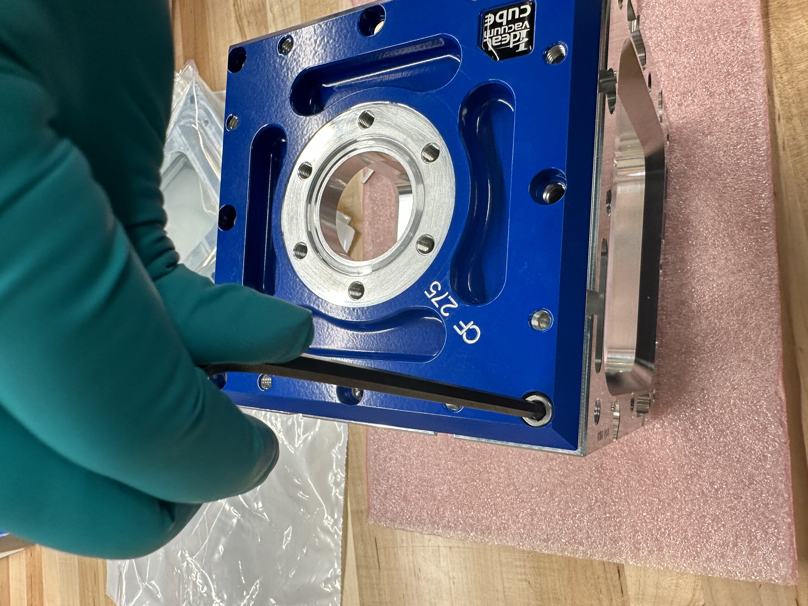
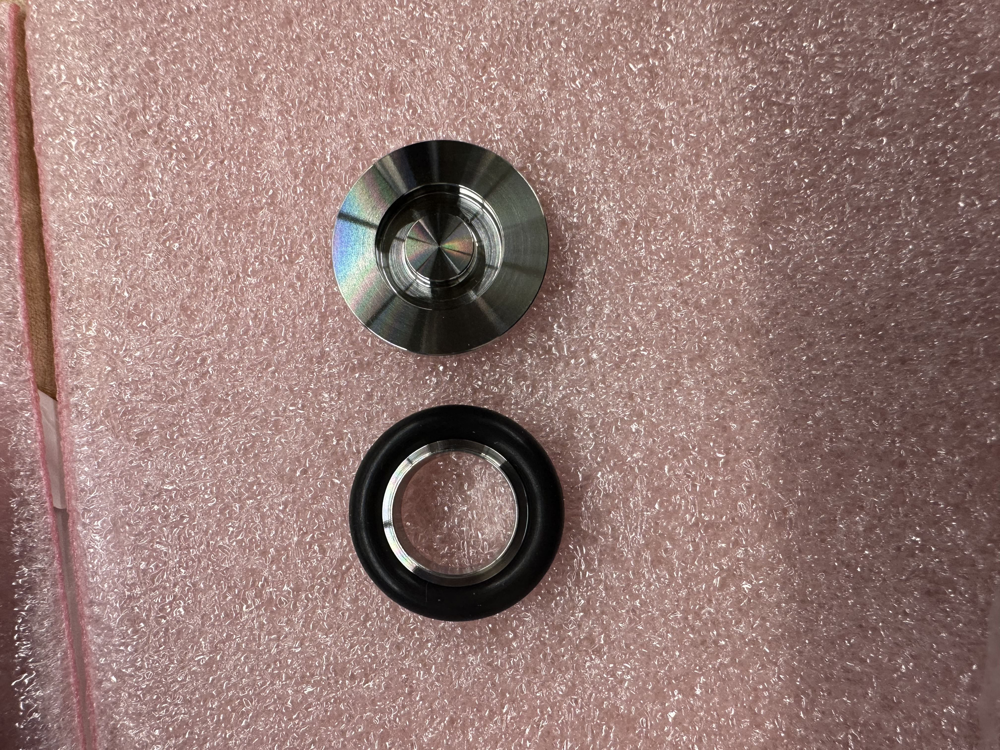
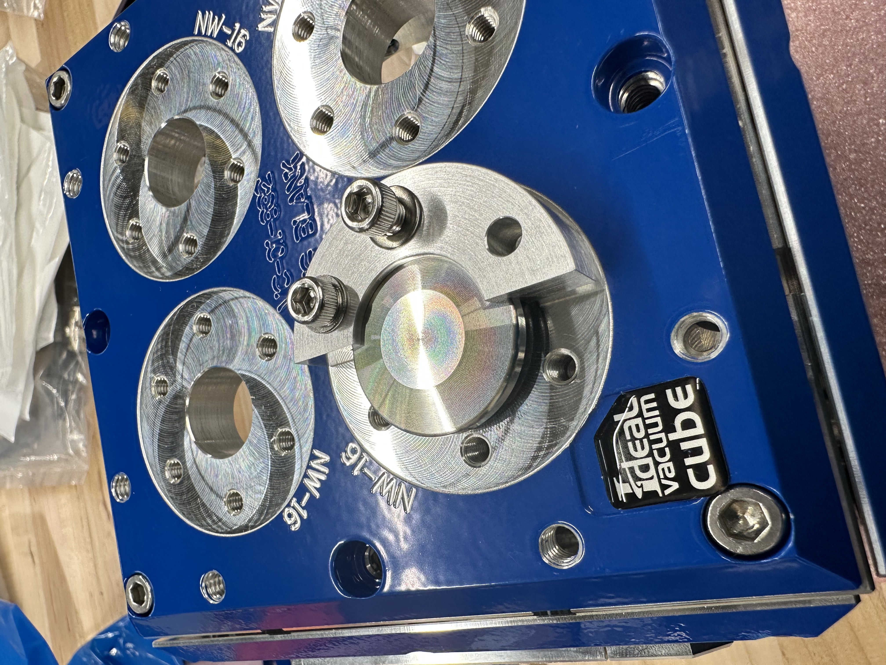
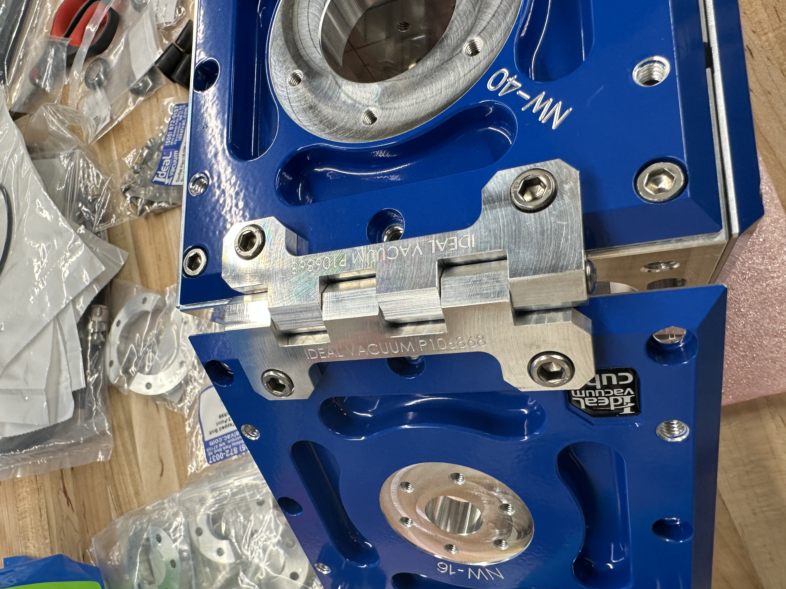
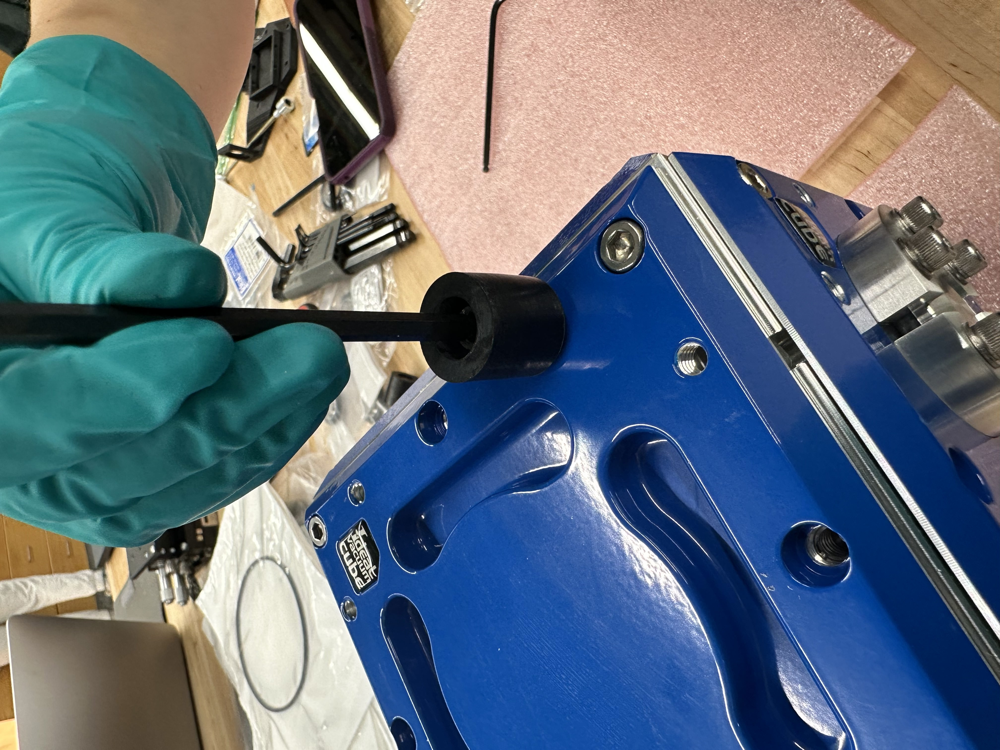

# 💡 Thermal Evaporator V1 Build (to do)

## Vacuum Chamber Assembly

After purchasing and receiving all parts outlined in the [Evaporator Bill of Materials](https://docs.google.com/spreadsheets/d/1TPauRe4IT71wgZRzCAktdQAIhP94O9i4d5mw1youb1I/edit?usp=sharing), follow the step-by-step process to assemble the vacuum chamber.

#### 1. Assemble the chamber frame and plates

<figure><figcaption>
Aluminum Frame
</figcaption></figure>

<figure><figcaption>
Plate with O-Ring
</figcaption></figure>

(i) Wrap an O-ring around each plate to ensure the chamber has a tight vacuum seal.

<figure><figcaption>
Plate with 8 bolts
</figcaption></figure>

(ii) Screw in each plate with 8 bolts into the frame as shown in the following image.

_Note: Plan where you want each plate to be (i.e. top, bottom, side) depending on your setup_

<figure><figcaption>
Screw in bolts to attach plate to frame
</figcaption></figure>

#### 2. Attach feedthroughs and/or blank flanges

Each opening must be covered and sealed for the vacuum to exist. Therefore, each opening needs a feedthrough in it or a blank flange to cover it. Ensure that each part has the correct dimension to properly fit in its corresponding port.

(i) Pair up the feedthrough/flange with its matching O-ring and clamp.

<figure><figcaption>
KF-16 viton ring and blank flange
</figcaption></figure>

(ii) Layer the parts in the following order. Starting from the bottom closest to the plate place the O-ring, flange/feedthrough, and clamp. Then attach all necessary screws tightly. Repeat this process for all openings.

<figure><figcaption>
Attaching a blank flange to a KF-16 port
</figcaption></figure>

#### 3. Turn a face into a door and attach feet

(i) Screw in the hinge into two adjacent plates where you want the door to be.

<figure><figcaption>
Hinge to allow top face to open
</figcaption></figure>

(ii) Attach knobs on opposite side of hinge to open and close the door securely.

<figure><figcaption>
Plate with hinge and knobs
</figcaption></figure>

(iii) Attach feet to the bottom of the chamber to minimize vibration.

<figure><figcaption>
Attaching rubber feet to chamber
</figcaption></figure>

#### Final product

<figure><figcaption>
Fully assembled vacuum chamber
</figcaption></figure>

## Pumping down the Vacuum Chamber

#### 1. Attach the turbo pump to the chamber

Connect the turbo pump (Hi-Cube 80) to the KF-40 plate using the corresponding KF-40 flange and O-ring. Since the turbo pump has a lip that makes it difficult to tighten the screws, we recommend using hex shaped 10-32 x 5/8" screws and tightening with a wrench.

#### 2. Connect the pressure gauge

The Pfeiffer MPT 200 Gauge has a KF-25 connection port. To optimize the 6 plates we chose, an adapter from KF-25 to KF-16 is needed to connect the pressure gauge to the vacuum chamber. Attach using a KF-16 flange to the plate and a KF-25 clamp to connect the adapter to the pressure gauge.

<figure><figcaption>
Vacuum chamber connected to turbo pump.
</figcaption></figure>
