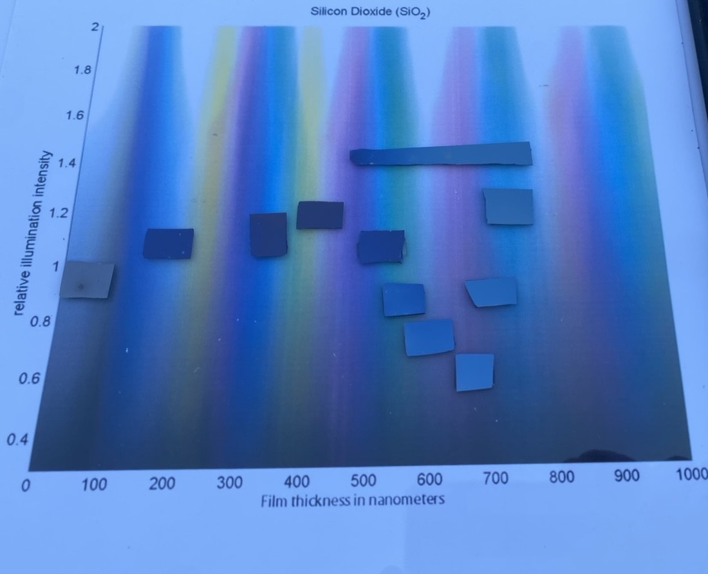

# Oxidation Chart & Results

When introduced to steam inside the tube furnace, blank piece of silicon can be oxidized. The color of the oxidation varies on the time, heat, and amount of steam introduced, but the color tends to oscillate based on the thickness of oxidation. Below is a chart of samples comparing the thickness of oxidation to the wavelength of light the sample is observed under. The thickness increases with more time spent in the furnace. Samples were collected in one test run for consistency sake.

<figure><figcaption></figcaption></figure>
