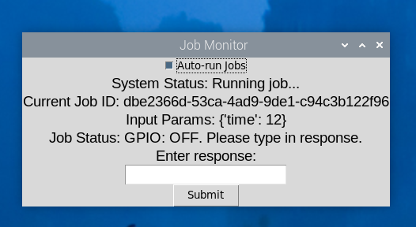

# Machine Integration

The goal of the Machine Integration project is to develop an extensible interface that can be used to communicate between the primary web application and each individual machine in the hacker fab.&#x20;

## Background information

The information in this section will explain some basics about web application design that will allow for a better understanding of the current machine integration system.&#x20;

### API:

<figure><figcaption></figcaption></figure>

An API is an application programming interface. For the purposes of this project, it is the abstraction of the interface between the server and client devices. The client devices can invoke GET, POST, UPDATE and other HTTP (Hyper Text Transfer Protocol) endpoints for a specific URL. We can send test API requests easily using POSTMAN. For those more familiar with linux networking, you could also use a CURL command.


### Postman:

Postman is a user friendly way to send API requests to test endpoints. Note that in production, another program will call an API endpoint. Postman is just a way for us to easily test these endpoints. If you are familiar with the CURL linux command, you can use that instead.&#x20;

Download POSTMAN from their website (do a google search). Below is a basic overview of the user interface.&#x20;

<figure><figcaption></figcaption></figure>

\


<figure><figcaption></figcaption></figure>

### Database fundamentals:

A **database** is a structured collection of data that enables efficient storage, retrieval, and management of information.&#x20;

You can think of a single **Table** within the database as an excel spreadsheet. The entire database is like an excel workbook.&#x20;

Each table has multiple column names (shown as the first row in the image below). One of these columns are dedicated to be the primary key. The primary key uniquely identifies a single row, or entry, in the database. The other columns are used to store information about that entry.&#x20;

The entire structure of the database (names of all the tables, column names, etc) is referred to as the **schema**. &#x20;

<figure><figcaption></figcaption></figure>

## System Architecture Diagram:

Now moving onto the details of this project, here is a system level architecture diagram of the system.&#x20;

<figure><figcaption></figcaption></figure>

## High level overview:

1. **Web Application Frontend & Backend:** This is the first two boxes on the architecture diagram above. This is how the end user will interface with the system. The user can create/edit/delete jobs. The exact details of how the web application frontend and backend work are covered in more detail in that section of the documentation (not on this page).&#x20;
2. **Jobs Queue on AWS**: This is where the list of jobs that the machines will need to run is stored. The jobs queue on AWS will have an API interface that is accessible to the web application (in order to take in new jobs) and the Raspberry PI (in order to complete jobs).&#x20;
3. **Raspberry PI mini computer**: This raspberry PI will be physically located near the tool that will be controlled (spin coater to start). The raspberry PI will be connected to the device using either USB or I/O pins on the raspberry PI. The raspberry PI will pull jobs from the jobs queue and run them on the device. There will also be a keyboard, mouse, and portable monitor connected to the Raspberry PI to monitor the status of the machine (these components will be optional, but provide additional redundancy).&#x20;
4. **Device to be controlled**: Will receive control signals from the raspberry PI. For this version of the project, we will be controlling the spin coater.&#x20;

## Data Flow Description:

#### Job Creation:

* The primary way that jobs will be created is through the hacker fab website. The hacker fab website will call the appropriate API call to manage the jobs database. The implementation of this is out of the initial scope for my project. For testing purposes for this semester, I will use POSTMAN to send API calls to the AWS jobs database.&#x20;
* Users can also create new jobs directly via the Raspberry Pi UI. This allows for redundancy in the case that the machine needs to be controlled without the database.
* There will be an option to run the job immediately or to send it to the database to be added to the queue.&#x20;

#### Job Queue Management:

* The AWS server maintains a centralized queue of jobs.
* The Raspberry Pi fetches and dequeues jobs by querying the API. Only jobs for the specific machine are dequeued.&#x20;

#### Job Execution:

* The Raspberry Pi receives the job and displays it on the connected UI.
* Upon user interaction (manual start) or automatically (if set), the job is run on the spin coater (or other device in the future)

#### Job Completion:

* After execution, the Raspberry Pi sends the success/failure status to the AWS server, updating the job's record in the database.


## Justification for Design choices:

### 1. Why do we need lab automation?

This will significantly automate the process of chip development. Our goal is to make basic chip tape outs like 3D printing.

### 2. Why do we need an additional full raspberry pi for each tool that we are controlling? This is much more expensive than having one raspberry pi that then communicates wirelessly with smaller arduinos for each tool.&#x20;

Answer: KISS: Keep it simple stupid. Adding the additional communication step between a central raspberry pi to peripheral arduinos would significantly increase complexity of the system in multiple ways:&#x20;

1. Initial implementation time is significantly longer for an arduino solution. The additional communication link between the raspberry pi and arduinos is not trivial, especially considering issues with the CMU wifi.&#x20;
2. The user experience is significantly worse for the arduino solution. The user who is standing at the tool is completely reliant on the automation system in this case. By contrast, with my proposal, the user will still have direct control of the tool via the on-screen gui at the machine. &#x20;
3. A raspberry pi for each machine would be a significantly more robust solution, while still offering all of the potential for automation.&#x20;
   1. Less complexity (removed additional wireless link)
   2. Tools can still easily be operated manually (using on screen gui) in case of issues with the website/database.


I will now go through the jobs queue and Raspberry PI mini computer in more detail, as these are the key innovations of the machine integration framework.

## **Jobs Queue on AWS:**&#x20;

The jobs queue is where jobs that are requested by the web application are stored before they are fetched by the appropriate tool's raspberry PI.&#x20;

Other programs (such as the web application and the RPI) interface/communicate with the jobs queue via API calls. These are HTTP requests.&#x20;

### Job Queue API interface:

#### API Gateway Endpoints from AWS for raspberry PI:

* #### GET /jobs/next: Fetch the next job from the queue.
* #### POST /job\_completion : Update job completion details.
* #### POST /generate\_download\_url: Generates the download url for a file recently uploaded based on the s3 id key provided&#x20;

**API Gateway Endpoints from AWS for web application:**

* #### POST /jobs: Enqueue a new job. The request has the machine name, input parameters, priority. The response will have the job\_id of the newly created job, or error.&#x20;
* #### GET /jobs\_by\_id: The request includes the job\_id(s) for which you will get details. All data for that row of the table will then be returned. NOTE: you can pass a list of job\_ids to get multiple rows of data at the same time.
* #### GET /jobs\_by\_machine: The request includes the machine name. All jobs that are in the database (regardless of status) will be returned.&#x20;
* #### POST /generate\_upload\_url: Generates the upload url to then upload a file to s3 storage. It also returns the s3 key, which can be used to retrieve the uploaded file.&#x20;

### Job Queue Table Schema:

* #### job\_id (Primary Key)
* #### machine (the machine to run the job on. E.g. spin coater)
* #### status (Pending/In Progress/Completed/Failed)
* #### input\_parameters (JSON for variable parameters)
* #### output\_parameters (JSON for results from the machine)
* #### timestamp (Queued timestamp)
* #### priority (Optional for prioritized execution)

### Job Queue implementation details:

**AWS Configuration for jobs queue:**

This is the jobs queue that the tools (right now only the spincoater) pull from. Jobs are enqueued from the primary web application.&#x20;

The API gateway routes are configured as follows:

<figure><figcaption></figcaption></figure>

The dynamo DB is configured with default settings. job\_id is the primary key.&#x20;

<figure><figcaption></figcaption></figure>

I am currently using a free tier AWS account from hacker fab. This takes care of all licensing requirements for this project.&#x20;

The majority of the logic is in the lambda function. The lambda function is the code that runs on AWS servers that processes API requests to the database. The python code is as follows (up to date as of 4/10/2025):

<details>

<summary><a href="https://github.com/hacker-fab/data-management/blob/main/lab_com/AWS/AWS_lambda.py">aws_labmda.py</a></summary>

```python
"""AWS Lambda handler module.

This module contains the Lambda function that runs the API endpoints
for the job queue system in AWS.
"""
import json
import uuid
import time
import logging
from decimal import Decimal
import boto3

### This code runs on the AWS instance as a lambda function for managing the API requests ###

# Set up logging
logger = logging.getLogger()
logger.setLevel(logging.INFO)

dynamodb = boto3.resource("dynamodb")
table = dynamodb.Table("JobQueue")

def lambda_handler(event, context):
    """
    Handles API requests for different endpoints.
    """
    logger.info("Received event: %s", json.dumps(event, indent=2, default=decimal_serializer))

    # Extract HTTP method and route
    route = event.get("routeKey", "")
    method = event["requestContext"]["http"]["method"]
    body = json.loads(event.get("body", "{}"))  # Parse JSON body safely

    logger.info("Processing route: %s with method: %s", route, method)
    result = None
    # Routing based on the request
    if route == "GET /jobs/next" and method == "GET":
        result = get_next_job(event)
    if route == "POST /job_completion" and method == "POST":   # Ensure correct endpoint
        result = update_job_completion(body)
    if route == "POST /jobs" and method == "POST":
        result = enqueue_job(body)
    if route == "GET /jobs_by_id" and method == "GET":
        result = get_jobs_by_id(event)
    if route == "GET /jobs_by_machine" and method == "GET":
        result = get_jobs_by_machine(event)
    if route == "POST /generate_upload_url" and method == "POST":
        result = generate_presigned_upload_url(body)
    if route == "POST /generate_download_url" and method == "POST":
        result = generate_presigned_download_url(body)
    logger.warning("Invalid request received: %s", route)
    result = {"statusCode": 400, "body": json.dumps({"message": "Invalid request"})}

    return result

# **Helper Function to Convert Decimal to Native Python Types**
def decimal_serializer(obj):
    """
    Convert Decimal to native Python types.
    """
    if isinstance(obj, Decimal):
        return int(obj) if obj % 1 == 0 else float(obj)
    raise TypeError(f"Object of type {obj.__class__.__name__} is not JSON serializable")

# **Function to Update Job Completion (Completed or Failed)**
def update_job_completion(body):
    """
    Update job completion status.
    """
    job_id = body.get("job_id", "-1")
    logger.info("Received job completion request: %s", body)

    # **Check if job_id is missing, invalid, or set to "-1"**
    if not job_id or not isinstance(job_id, str) or len(job_id) < 8 or job_id == "-1":
        logger.error("Invalid job_id received: %s", job_id)
        return {"statusCode": 400, "body": json.dumps({"message": "Invalid or missing job_id"})}

    # Retrieve the job from DynamoDB to verify it exists
    response = table.get_item(Key={"job_id": job_id})
    if "Item" not in response:
        logger.error("Job ID not found: %s", job_id)
        return {"statusCode": 410, "body": json.dumps({"message": f"Job ID {job_id} not found"})}

    output_parameters = body.get("output_parameters", {})
    status = body.get("status", "").capitalize()

    if status not in ["Completed", "Failed"]:
        logger.error("Invalid status received: %s", status)
        return {"statusCode": 400, "body":
                json.dumps({"message": "Invalid status, must be 'Completed' or 'Failed'"})}

    timestamp = int(time.time())
    table.update_item(
        Key={"job_id": job_id},
        UpdateExpression="SET #s = :s, output_parameters = :o, #t = :t",
        ExpressionAttributeNames={"#s": "status", "#t": "timestamp"},
        ExpressionAttributeValues={":s": status, ":o": output_parameters, ":t": timestamp}
    )

    logger.info("Job %s updated to %s", job_id, status)
    return {"statusCode": 200, "body": json.dumps({"message": f"Job {job_id} marked as {status}."})}

# **Function to Add a New Job**
def enqueue_job(body):
    """
    Add a new job to the queue.
    """
    job_id = str(uuid.uuid4())
    machine = body.get("machine", "unknown")
    input_parameters = body.get("input_parameters", {})
    priority = body.get("priority", 1)
    timestamp = int(time.time())
    logger.info("Adding new job with ID: %s", job_id)

    # Ensure input_parameters are serialized properly (convert floats to Decimal for DynamoDB)
    def serialize_input_parameters(params):
        if isinstance(params, dict):
            return {k: serialize_input_parameters(v) for k, v in params.items()}
        if isinstance(params, list):
            return [serialize_input_parameters(v) for v in params]
        if isinstance(params, float):
            return Decimal(str(params))  # Convert float to Decimal
        return params

    serialized_input_parameters = serialize_input_parameters(input_parameters)

    table.put_item(Item={
        "job_id": job_id,
        "machine": machine,
        "status": "Pending",
        "input_parameters": serialized_input_parameters,
        "output_parameters": {},
        "timestamp": timestamp,
        "priority": priority
    })

    return {"statusCode": 200, "body": json.dumps({"message": "Job added", "job_id": job_id})}

# **Function to Get the Next Pending Job for a Specific Machine
# and Mark It "In Progress", Then Return Updated Data**
def get_next_job(event):
    """
    Get the next pending job for a specific machine and mark it as "In Progress".
    """
    machine = event.get("queryStringParameters", {}).get("machine")
    if not machine:
        return {"statusCode": 400, "body": json.dumps({"message": "Missing machine parameter"})}

    logger.info("Fetching next job for machine: %s", machine)
    response = table.scan(
        FilterExpression="#s = :s AND #m = :m",
        ExpressionAttributeNames={"#s": "status", "#m": "machine"},
        ExpressionAttributeValues={":s": "Pending", ":m": machine}
    )

    jobs = response.get("Items", [])
    if not jobs:
        logger.warning("No pending jobs found for machine: %s", machine)
        return {"statusCode": 404, "body": json.dumps(
            {"message": "No pending jobs found for the specified machine"})}

    # Sort jobs by timestamp (oldest job first)
    jobs.sort(key=lambda x: x.get("timestamp", float('inf')))
    next_job = jobs[0]
    logger.info("Next job selected for machine %s: %s", machine, next_job["job_id"])

    table.update_item(
        Key={"job_id": next_job["job_id"]},
        UpdateExpression="SET #s = :s, #t = :t",
        ExpressionAttributeNames={"#s": "status", "#t": "timestamp"},
        ExpressionAttributeValues={":s": "In Progress", ":t": int(time.time())}
    )

    updated_job = table.get_item(Key={"job_id": next_job["job_id"]}).get("Item", {})
    logger.info("Updated job details: %s", updated_job)

    return {"statusCode": 200, "body": json.dumps(updated_job, default=decimal_serializer)}

# **Function to Fetch a Job by Its ID**
def get_jobs_by_id(event):
    """
    Fetch a job by its ID.
    """
    job_id = event.get("queryStringParameters", {}).get("job_id")

    if not job_id:
        return {"statusCode": 400, "body": json.dumps({"message": "Missing job_id parameter"})}

    response = table.get_item(Key={"job_id": job_id})

    if "Item" not in response:
        return {"statusCode": 404, "body": json.dumps({"message": "Job not found"})}

    return {"statusCode": 200, "body": json.dumps(response["Item"], default=decimal_serializer)}

# **Function to Fetch Jobs by Machine name. This is needed for interface w/web application.**
def get_jobs_by_machine(event):
    """
    Fetch jobs by machine.
    """
    machine = event.get("queryStringParameters", {}).get("machine")
    if not machine:
        return {"statusCode": 400, "body": json.dumps({"message": "Missing machine parameter"})}

    response = table.scan(
        FilterExpression="#m = :m",
        ExpressionAttributeNames={"#m": "machine"},
        ExpressionAttributeValues={":m": machine}
    )

    jobs = response.get("Items", [])
    if not jobs:
        return {"statusCode": 404, "body":
                json.dumps({"message": "No jobs found for the specified machine"})}

    return {"statusCode": 200, "body": json.dumps(jobs, default=decimal_serializer)}

def generate_presigned_upload_url(body):
    """
    Generate a presigned URL for uploading a file to S3.
    """
    s_3 = boto3.client("s3")
    bucket = "job-queue-files"

    # Use the provided filename or generate a unique one
    filename = body.get("filename", f"{uuid.uuid4()}")
    key = f"uploads/{filename}"

    try:
        # Generate a presigned URL without restricting the ContentType
        presigned_url = s_3.generate_presigned_url(
            "put_object",
            Params={"Bucket": bucket, "Key": key},
            ExpiresIn=600  # 10 minutes
        )
        return {
            "statusCode": 200,
            "body": json.dumps({
                "upload_url": presigned_url,
                "s3_key": key
            })
        }
    ## We want to catch all exception, even though this introduces a pylint error. 
    except Exception as exception:
        logger.error("Failed to generate pre-signed URL: %s", str(exception))
        return {
            "statusCode": 500,
            "body": json.dumps({"message": "Failed to generate upload URL"})
        }

def generate_presigned_download_url(body):
    """
    Generate a presigned URL for downloading a file from S3.
    """
    s_3 = boto3.client("s3")
    bucket = "job-queue-files"
    key = body.get("s3_key")

    if not key:
        return {"statusCode": 400, "body": json.dumps({"message": "Missing s3_key"})}

    try:
        url = s_3.generate_presigned_url(
            "get_object",
            Params={"Bucket": bucket, "Key": key},
            ExpiresIn=600  # 10 minutes
        )
        return {"statusCode": 200, "body": json.dumps({"download_url": url})}
    except:
        return {
            "statusCode": 500,
            "body": json.dumps({"message": "Failed to generate download URL"})
        }

```

</details>

This code scores a 9.31/10 on pylint (google code guidelines). The failures are described in comments and are intentional, or are due to import statements not being found (since this code runs on AWS, not locally).&#x20;

Other AWS resources (File Transfer):

S3: S3 is amazon's blob storage service. When a file is uploaded to the upload link from the generate\_upload\_url, it is stored here. It is setup with default configurations.&#x20;

IAM management policy. This policy must be added to allow the Lambda script to access the S3 data. This is needed to generate the upload and download URLs.&#x20;

To add the policy, go to IAM from the AWS panel, then roles, then create role.&#x20;

```
{
	"Version": "2012-10-17",
	"Statement": [
		{
			"Effect": "Allow",
			"Action": [
				"s3:PutObject",
				"s3:GetObject"
			],
			"Resource": "arn:aws:s3:::job-queue-files/uploads/*"
		},
		{
			"Effect": "Allow",
			"Action": "s3:ListBucket",
			"Resource": "arn:aws:s3:::job-queue-files"
		}
	]
}
```


Here is an automated test script to run that will test all endpoints except /generate\_download\_url and /generate\_upload\_url. Run this script locally on your PC. The script should pass if the AWS database is configured correctly. You may need to change the base URL.&#x20;

<details>

<summary><a href="https://github.com/hacker-fab/data-management/blob/main/lab_com/AWS/auto_test_endpoints.py">auto_test_endpoints.py</a></summary>

```python
"""
This module contains automated tests for the job queue API endpoints.
"""
import requests

# Constants
BASE_URL = "https://fbc4oam2we.execute-api.us-east-2.amazonaws.com/prod"

def test_jobqueue_api():
    """
    Test the job queue API endpoints.
    """
    # Step 1: POST /jobs - Enqueue a new job
    job_data = {
        "machine": "test_machine",
        "input_parameters": {"param1": "value1"},
        "priority": 2
    }
    response = requests.post(f"{BASE_URL}/jobs", json=job_data)
    assert response.status_code == 200, "Failed to enqueue job"
    job_id = response.json().get("job_id")
    print(f"Job enqueued: {job_id}")

    # Step 2: GET /jobs_by_id - Verify job exists
    response = requests.get(f"{BASE_URL}/jobs_by_id", params={"job_id": job_id})
    assert response.status_code == 200, "Job not found"
    print("Job verification successful")

    # Step 3: GET /jobs_by_machine - Verify job is present for machine
    response = requests.get(f"{BASE_URL}/jobs_by_machine", params={"machine": "test_machine"})
    assert response.status_code == 200, "Job not found for machine"
    print("Job found under machine")

    # Step 4: GET /jobs/next - Fetch job from queue
    response = requests.get(f"{BASE_URL}/jobs/next")
    assert response.status_code == 200, "Failed to fetch next job"
    assert response.json().get("job_id") == job_id, "Fetched wrong job"
    print("Job fetched successfully")

    # Step 5: GET /jobs_by_id - Ensure job is now in progress
    response = requests.get(f"{BASE_URL}/jobs_by_id", params={"job_id": job_id})
    assert response.status_code == 200, "Job ID not found"
    assert response.json().get("status") == "In Progress", "Job status not updated"
    print("Job status updated to In Progress")

    # Step 6: POST /jobs_completion - Complete the job
    completion_data = {
        "job_id": job_id,
        "status": "Completed",
        "output_parameters": {"result": "success"}
    }
    response = requests.post(f"{BASE_URL}/job_completion", json=completion_data)
    assert response.status_code == 200, "Failed to update job completion"
    print("Job completion updated")

    # Step 7: GET /jobs_by_id - Verify job is completed
    response = requests.get(f"{BASE_URL}/jobs_by_id", params={"job_id": job_id})
    assert response.status_code == 200, "Job not found"
    assert response.json().get("status") == "Completed", "Job status not updated to Completed"
    print("Job verified as Completed")

if __name__ == "__main__":
    test_jobqueue_api()
```

</details>

[auto\_test\_endpoints.py](https://github.com/hacker-fab/data-management/blob/main/lab_com/AWS/auto_test_endpoints.py) scored 10/10 on google pylint

The following python script tests the functionality of the s3 file upload and download system. Note you made need to change the base URL to the current AWS instance.&#x20;

<details>

<summary><a href="https://github.com/hacker-fab/data-management/blob/main/lab_com/AWS/auto_test_file_endpoints.py">auto_test_file_endpoints.py</a></summary>

```python
"""
This module contains examples of a few endpoint calls
"""
import requests

# Constants
BASE_URL = "https://fbc4oam2we.execute-api.us-east-2.amazonaws.com/prod"

TEST_FILE_NAME = "PNG_test.png"  # Replace with the path to your test file


def get_file_upload_url_and_key(job_id):
    """
    Generate a presigned URL for uploading an image.
    """
    response = requests.post(f"{BASE_URL}/generate_upload_url", json={"job_id": job_id})
    assert response.status_code == 200, "Failed to generate upload URL"
    upload_url = response.json().get("upload_url")
    s3_key = response.json().get("s3_key")

    print(f"Upload URL: {upload_url}")
    return upload_url, s3_key


def upload_file(file_name, upload_url):
    """
    Upload a file to the presigned URL.
    """
    with open(file_name, "rb") as file:
        response = requests.put(upload_url, data=file)
    if response.status_code != 200:
        print(f"Upload failed. Status code: {response.status_code}, response: {response.text}")
    assert response.status_code == 200, "Upload failed"
    print("File uploaded successfully")


def enqueue_job(machine, input_parameters, priority):
    """
    Enqueue a job with the specified parameters.
    """
    job_data = {
        "machine": machine,
        "input_parameters": input_parameters,
        "priority": priority
    }
    response = requests.post(f"{BASE_URL}/jobs", json=job_data)
    assert response.status_code == 200, "Failed to enqueue job"
    job_id = response.json().get("job_id")
    print(f"Job enqueued: {job_id}")
    return job_id

def download_file(s3_key):
    """
    Download a file from S3 using the presigned URL.
    """

    # get the presigned URL for download
    response = requests.post(f"{BASE_URL}/generate_download_url", json={"s3_key": s3_key})
    assert response.status_code == 200, "Failed to generate download URL"
    download_url = response.json().get("download_url")
    print(f"Download URL: {download_url}")

    # download the file using the presigned URL
    response = requests.get(download_url)
    if response.status_code != 200:
        print(f"Failed to download file. Status code: \
              {response.status_code}, Response text: {response.text}")
    assert response.status_code == 200, "Failed to download file"
    with open("downloaded-" + TEST_FILE_NAME, "wb") as file:
        file.write(response.content)

def test_upload_and_download_file():
    """
    Test uploading a file, providing the S3 key as a job parameter, fetching the job,
    and then downloading the file using the presigned URLs.
    """
    # Step 1: Generate a presigned upload URL and S3 key
    # Passing None as job_id since it's not required here
    upload_url, s3_key = get_file_upload_url_and_key(None)
    print(f"Generated upload URL: {upload_url}")
    print(f"S3 Key: {s3_key}")

    # Step 2: Upload a file
    upload_file(TEST_FILE_NAME, upload_url)
    print(f"File uploaded successfully to S3 key: {s3_key}")

    # Step 3: Enqueue a job with the S3 key as a parameter
    job_id = enqueue_job(
        machine="lithographer",
        input_parameters={"x": 100.0, "y": 200.0, "image_s3_key": s3_key},
        priority=2
    )
    print(f"Job enqueued: {job_id}")

    # Step 4: Fetch the job from the queue
    response = requests.get(f"{BASE_URL}/jobs/next", params={"machine": "lithographer"})
    assert response.status_code == 200, "Failed to fetch next job"
    fetched_job = response.json()
    assert fetched_job.get("job_id") == job_id, "Fetched wrong job"
    fetched_s3_key = fetched_job["input_parameters"]["image_s3_key"]
    print(f"Fetched job successfully. S3 Key: {fetched_s3_key}")

    # Step 5: Download the file using the fetched S3 key
    download_file(fetched_s3_key)
    print("File downloaded successfully.")

if __name__ == "__main__":
    test_upload_and_download_file()

```

</details>

[auto\_test\_file\_endpoints.py](https://github.com/hacker-fab/data-management/blob/main/lab_com/AWS/auto_test_file_endpoints.py) scored 10/10 on google pylint

## Raspberry PI mini computer

The raspberry PI pulls job requests from the AWS jobs queue


### **Basic raspberry PI hardware setup:**

Raspberry PI 5 with case and heatsink. There are two ways the RPI can connect to tools to control. The first method is using jumper wires to connect GPIO pins to external device. See image attached. The device could also interface with the raspberry PI over one of the Raspberry PIs USB ports. This is the approach that is used for the spincoater&#x20;

<figure><figcaption></figcaption></figure>


To control the Raspberry PI 5 GPIO ports, use the gpiod python package (see screenshot below). It is critical to use gpiochip4. If you are interfacing with the device over USB, the exact setup instructions will depend on the device you are controlling. I will detail how to interface with the spincoater in this guide.


Here are the reasons why we are using UART over USB instead of using the GPIO TX and RX on the rasperry PI and arduino. Keep this in mind if you are integrating future devices other than the spincoater.

The raspberry PI runs on 3.3V while the arduino runs on 5V. This presents a problem for the signal from the arduino to the RPI. We have to use either a level shifter or a voltage divider. I didn't have a level shifter on hand, so I tried building a voltage divider using a 20k (on the bottom) and 10k resistor (on the top). This filtered the voltage as needed, but it's possible this was part of the issue. Here is an image of the basic voltage divider I tried.&#x20;

<figure><figcaption></figcaption></figure>

I also attempted to bitbang a UART connection between the RPI and arduino. This was also unsuccessful. After a bit of research, it looks like this is because Raspberry PI OS is not a RTOS (real time operating system), so the timing is not precise enough to bitbang a UART connection. Keep this in mind before trying this approach for a new tool.

At this point I was pretty stumped, so I searched around the internet a bit. I then realized it would be MUCH MUCH easier to simply use UART over the USB connection between the two devices. The reasons why I settled with this approach are as follows:

1. I was able to get UART over USB from RPI to arduino working, but I was not able to get it working using the GPIO UART module.&#x20;
2. This solution is more scalable as we can have multiple arduinos that control individual devices plugged into one raspberry PI as the RPI only has one UART TX/RX vs multiple usb ports.&#x20;
3. We can leverage existing consumer grade USB extension cables and hubs
4. The USB cable is physically studier than the multiple thin GPIO cables. Also, there is only one cable to deal with.&#x20;

[https://roboticsbackend.com/raspberry-pi-arduino-serial-communication/](https://roboticsbackend.com/raspberry-pi-arduino-serial-communication/)


### [lab\_com\_gui.py](https://github.com/hacker-fab/data-management/blob/main/lab_com/CodeOnRaspberryPi/lab_com_gui.py) conceptual overview

This is the code running on the raspberry PI. I'll first show it from the user's perspective:&#x20;

When the machine is IDLE, the monitor connected to the RPI just displays a message that we are waiting for the next job

<figure><figcaption></figcaption></figure>

If autorun is not turned on, you'll need to manually approve the job

<figure><figcaption></figcaption></figure>

Next, the job will be run

<figure><figcaption></figcaption></figure>

Finally, the user can type in input for the final job status (this will vary based on the machine automated)

<figure><figcaption></figcaption></figure>

The user can also create a job from the RPI gui itself. If the RPI is connected to the internet, it will upload the job details to the database. Otherwise, the job will run completley offline. This is a intentional redundancy feature.&#x20;

<figure><figcaption></figcaption></figure>

The essential behavior of [lab\_com\_gui.py](https://github.com/hacker-fab/data-management/blob/main/lab_com/CodeOnRaspberryPi/lab_com_gui.py) can also be described in the following state machine:

<figure><figcaption></figcaption></figure>

### [lab\_com\_gui.py](https://github.com/hacker-fab/data-management/blob/main/lab_com/CodeOnRaspberryPi/lab_com_gui.py) implementation details:

The [lab\_com\_gui ](https://github.com/hacker-fab/data-management/blob/main/lab_com/CodeOnRaspberryPi/lab_com_gui.py)code completes the following high level actions.&#x20;

1. Fetches jobs from AWS jobs queue
2. Displays the currently running job on the GUI. Also allows users to control whether jobs run automatically or require manual confirmation.&#x20;
3. Runs the job on the device
4. Sends completion details back to the AWS jobs queue.

<details>

<summary><a href="https://github.com/hacker-fab/data-management/blob/main/lab_com/CodeOnRaspberryPi/lab_com_gui.py">lab_com_gui.py</a></summary>

```python
"""
This module contains the GUI for the job queue system.
"""

import uuid
import time
import threading
import tkinter as tk
from tkinter import ttk
import sys
import requests
import gpiod
import serial

IO_PIN = 17  # Change to your GPIO pin number
chip = gpiod.Chip('gpiochip4')
line = chip.get_line(IO_PIN)

# Request the GPIO line for output
line.request(consumer="gpio_test", type=gpiod.LINE_REQ_DIR_OUT)

BASE_URL = "https://fbc4oam2we.execute-api.us-east-2.amazonaws.com/prod"

########################## EDIT HERE: PERIPHERAL CONFIGURATION ##########################
#### INSTRUCTIONS: ######
### Add whatever code you need here to inintialize your peripherals so that they     ####
###        can begin to accept jobs.                                                  ###

#### UART OVER USB SERIAL TO ARDUINO ####
# This may be different on a different RPI
USB_PORT = "/dev/ttyACM0"  # Adjust this based on your device
BAUD_RATE = 115200  # Must match Arduino

# Open Serial Connection
try:
    ser = serial.Serial(USB_PORT, BAUD_RATE, timeout=1)
    time.sleep(2)  # Allow time for connection to stabilize
    print("Connected to Arduino over USB Serial!")
except serial.SerialException:
    print("ERROR: Could not open serial port. Check USB connection!")
    sys.exit()

#########################################################################################


def get_next_job():
    """Fetch the next job from the queue."""
    endpoint = f"{BASE_URL}/jobs/next"
    params = {"machine": JOB_NAME}
    try:
        response = requests.get(endpoint, params=params)
        response.raise_for_status()
        return response.json()
    except requests.exceptions.RequestException as err:
        print(f"Error fetching next job: {err}")
        return None

def send_job_completion(job_id, output_parameters):
    """Send job completion data to the server."""
    endpoint = f"{BASE_URL}/job_completion"
    data = {
        "job_id": job_id,
        "status": "completed",
        "output_parameters": output_parameters
    }
    try:
        response = requests.post(endpoint, json=data)
        response.raise_for_status()
        print("Job completion posted successfully.")
    except requests.exceptions.RequestException as err:
        print(f"Error posting job completion: {err}")

class JobGUI:
    """Class to manage the GUI for the job queue system."""
    def __init__(self, root, job_function):
        """Initialize the JobGUI class."""

        # Google code guidelines recommend fewer class variables
        # (I have 21+, they recommend 7 or fewer)
        # However, I believe this is the most
        # efficient way to manage the GUI

        self.root = root
        self.job_function = job_function  # Store the function pointer
        self.root.title("Job Monitor")

        self.auto_run = tk.BooleanVar(value=True)

        self.auto_run_switch = ttk.Checkbutton(root, text="Auto-run Jobs",
                                               variable=self.auto_run,
                                               command=self.toggle_approve_deny_buttons)
        self.auto_run_switch.pack()

        self.job_id_label = ttk.Label(root, text="Current Job ID: ", font=("Arial", 14))
        self.job_id_label.pack()
        self.job_id_label.pack_forget()

        self.system_status_label = ttk.Label(root,
                                             text="System Status: Waiting for job...",
                                             font=("Arial", 14))
        self.system_status_label.pack()

        self.input_param_label = ttk.Label(root, text="Input parameters: ",
                                           font=("Arial", 14))
        self.input_param_label.pack()
        self.input_param_label.pack_forget()

        self.job_status = ttk.Label(root, text="Job Status: LED OFF",
                                    font=("Arial", 14))
        self.job_status.pack()
        self.job_status.pack_forget()

        self.approve_button = ttk.Button(root, text="Approve Job",
                                         command=self.run_job)
        self.approve_button.pack()
        self.approve_button.pack_forget()

        self.deny_button = ttk.Button(root, text="Deny Job",
                                      command=self.deny_job)
        self.deny_button.pack()
        self.deny_button.pack_forget()

        self.input_label = ttk.Label(root, text="Enter response:",
                                     font=("Arial", 14))
        self.input_entry = ttk.Entry(root, font=("Arial", 14))
        self.input_entry.bind("<Return>",
                              lambda event: self.submit_textbox_response())
        self.submit_button = ttk.Button(root, text="Submit",
                                        command=self.submit_textbox_response)

        self.input_label.pack_forget()
        self.input_entry.pack_forget()
        self.submit_button.pack_forget()


        # create GUI elements for manually entering job parameters based on JOB_PARAM_TEMPLATE
        self.job_param_entries = {}
        for param_name, param_value in JOB_PARAM_TEMPLATE.items():
            label = ttk.Label(root, text=f"{param_name}:")
            label.pack()
            label.pack_forget()
            entry = ttk.Entry(root)
            entry.insert(0, str(param_value))
            entry.pack()
            entry.pack_forget()
            self.job_param_entries[param_name] = {"label" : label, "entry" : entry}


        self.create_new_job_button = ttk.Button(root, text="Create New Job",
                                        command=self.create_new_job)

        self.create_new_job_button.pack()

        self.create_new_job_submit = ttk.Button(root, text="Submit New Job",
                                        command=self.submit_new_job)

        self.create_new_job_submit.pack()
        self.create_new_job_submit.pack_forget()


        self.job = None
        self.job_running_on_machine = False
        self.running = True
        self.output_text = None
        self.output_text_avail_semaphore = threading.Semaphore(0)
        self.check_for_jobs()

    def check_for_jobs(self):
        """Check for new jobs in the queue."""
        if self.running:
            job = get_next_job()
            if job:
                self.job = job
                self.job_id_label.config(
                    text=f"Current Job ID: {self.job.get('job_id', 'unknown')}")
                self.job_id_label.pack()
                self.input_param_label.config(
                    text=f"Input Params: {self.job.get('input_parameters', {})}")
                self.input_param_label.pack()
                if self.auto_run.get():
                    self.run_job()
                else:
                    self.system_status_label.config(
                        text="System Status: Job available. Approve or Deny?")
                    self.approve_button.pack()
                    self.deny_button.pack()
            else:
                self.root.after(5000, self.check_for_jobs)

    def toggle_approve_deny_buttons(self):
        """Toggle the visibility of approve and deny buttons."""
        if self.auto_run.get():
            self.approve_button.pack_forget()
            self.deny_button.pack_forget()

            # we also want the job to run automatically if we just
            # turned on auto-run and the job was already loaded into memory.
            self.run_job()
        elif self.job and not self.job_running_on_machine:
            self.approve_button.pack()
            self.deny_button.pack()

    def run_job(self):
        """Run the current job."""
        if not self.job:
            return

        self.approve_button.pack_forget()
        self.deny_button.pack_forget()

        job_input_parameters = self.job.get("input_parameters", {})
        self.system_status_label.config(text="System Status: Running job...")
        self.job_running_on_machine = True

        # Use the function pointer to run the job
        threading.Thread(target=self.job_function,
                         args=(self, job_input_parameters,), daemon=True).start()

    def deny_job(self):
        """Deny the current job."""
        if self.job:
            send_job_completion(self.job["job_id"], {"info": "job_skipped"})
            self.system_status_label.config(
                text="System Status: Job Denied. Waiting for next job...")
            self.approve_button.pack_forget()
            self.deny_button.pack_forget()
            self.job_id_label.pack_forget()
            self.input_param_label.pack_forget()
            self.root.after(5000, self.check_for_jobs)

    def submit_textbox_response(self):
        """Submit the response from the textbox."""
        user_input = self.input_entry.get()
        self.input_entry.delete(0, tk.END)
        self.input_label.pack_forget()
        self.input_entry.pack_forget()
        self.submit_button.pack_forget()
        self.system_status_label.config(text="System Status: Text submitted...")
        self.output_text = user_input
        self.output_text_avail_semaphore.release()

    def create_new_job(self):
        """Handles the button click to bring up the option to create a new job."""
        self.system_status_label.config(text="System Status: Enter new job parameters...")

        # Show the job parameter entries
        for entry in self.job_param_entries.values():
            entry["label"].pack()
            entry["entry"].pack()

        self.create_new_job_button.pack_forget()
        self.create_new_job_submit.pack()

    def submit_new_job(self):
        """Submit the new job after the user has entered the parameters."""
        self.system_status_label.config(text="System Status: Submitting new job...")

        # Hide the job parameter entries
        for entry in self.job_param_entries.values():
            entry["label"].pack_forget()
            entry["entry"].pack_forget()

        self.create_new_job_button.pack()
        self.create_new_job_submit.pack_forget()

        # Get the job parameters from the entries
        job_input_parameters = {}
        for param_name, entry in self.job_param_entries.items():
            job_input_parameters[param_name] = entry["entry"].get()

        # Submit the job to the server
        endpoint = f"{BASE_URL}/jobs"
        data = {
            "machine": JOB_NAME,
            "input_parameters": job_input_parameters
        }

        print("Submitting job:", data)

        try:
            response = requests.post(endpoint, json=data)
            response.raise_for_status()
            print("Job posted successfully.")
            self.system_status_label.config(text="System Status: Job submitted.")
        except requests.exceptions.RequestException as err:
            print(f"Error posting job: {err}")
            self.system_status_label.config(
                text="System Status: Error submitting. Now running job locally.")

            self.job = {"input_parameters": job_input_parameters, "machine": JOB_NAME,
                        "status": "In Progress", "timestamp": 0, "output_parameters": {},
                        "priority": "1", "job_id": str(uuid.uuid4()) + "-local"}
            self.job_id_label.config(
                text=f"Current Job ID: {self.job.get('job_id', 'unknown')}")
            self.job_id_label.pack()
            self.input_param_label.config(
                text=f"Input Params: {self.job.get('input_parameters', {})}")
            self.input_param_label.pack()
            if self.auto_run.get():
                self.run_job()
            else:
                self.system_status_label.config(
                    text="System Status: Job available. Approve or Deny?")
                self.approve_button.pack()
                self.deny_button.pack()


    def submit_completed_response_to_server(self, output_parameters):
        """Submit the completed job response to the server."""
        if self.job:
            send_job_completion(self.job["job_id"], output_parameters)
            self.job = None
            self.job_id_label.pack_forget()
            self.job_id_label.config(text="Current Job ID: ")
            self.system_status_label.config(text="System Status: Waiting for job...")
            self.input_param_label.pack_forget()
            self.input_param_label.config(text="Input Parameters: ")
            self.job_status.pack_forget()
            self.job_status.config(text="Job Status:")
            self.job_running_on_machine = False
            self.toggle_approve_deny_buttons()
            self.root.after(5000, self.check_for_jobs)

    def stop(self):
        """Stop the GUI and release resources."""
        self.running = False
        line.release()

    def set_job_status_label(self, text):
        """Set the job status label text."""
        self.job_status.config(text=text)
        self.job_status.pack()

    def get_user_output_response(self):
        """Get the user output response."""
        self.input_label.pack()
        self.input_entry.pack()
        self.submit_button.pack()

        # we need to wait until the user has submitted a response...

        # this introduces a pylint warning, but it is necessary to
        # format the program in this way for better readability
        self.output_text_avail_semaphore.acquire()


    ########################## EDIT HERE: PERIPHERAL CONFIGURATION ##########################
    ##### INSTRUCTIONS #######

    ### Write a function in this locaiton that will run the job. ###
    ### This function will be called when the job is approved. ###
    ### The function will be passed the job input parameters. ###

    ### to get started, copy the run_led function and edit it to run your job. ###
    ### only edit the code in between FIRMWARE START and FIRMWARE END ###
    ### This is where you will write the code to run your job. ###

    ### If you want the user to type in a response, leave the following two lines. ###
    ### If you don't want the user to type in a response, remove the two lines. ###

    #### This is the function that will be edited to integrate new tools #####
    def run_led(self, job_input_parameters):
        """Run the LED job."""

        ### FIRMWARE START: This is where you write the firmware code to run the job. ##
        line.set_value(1)  # Turn on GPIO
        self.set_job_status_label("Job Status: GPIO: ON")

        duration = job_input_parameters.get("time", 5)
        for i in range(duration, 0, -1):
            self.set_job_status_label(f"Job Status: GPIO: ON, Time remaining: {i} seconds")
            time.sleep(1)

        line.set_value(0)  # Turn off GPIO

        ### FIRMWARE END ###

        ## Gather the user response [Optional, you can remove]##
        self.set_job_status_label("Job Status: GPIO: OFF. Please type in response.")
        self.get_user_output_response()

        ## Submit the data back to the server ##
        final_output_parameters = {"response": self.output_text}
        self.submit_completed_response_to_server(final_output_parameters)

    def run_spincoater(self, job_input_parameters):
        """Run the spincoater job."""

        print("Job input parameters:", job_input_parameters)

        ### This is where you write the firmware code to run the job. ##
        rpm = job_input_parameters.get("rpm", 1000)
        duration = job_input_parameters.get("time", 5)

        # Send RPM command
        rpm_command = f"RPM:{rpm}\n"
        print(f"Sending: {rpm_command.strip()}")
        ser.write(rpm_command.encode())
        time.sleep(0.5)  # Small delay to ensure command is processed

        # Send Time command
        time_command = f"TIME:{duration}\n"
        print(f"Sending: {time_command.strip()}")
        ser.write(time_command.encode())
        time.sleep(0.5)  # Small delay to ensure command is processed

        # Turn on the compressor and give it time to stabilize
        line.set_value(1)  # Turn on GPIO
        print("Compressor turned on.")
        time.sleep(10)  # Allow time for the compressor to stabilize

        # Send Start command
        start_command = "START\n"
        print(f"Sending: {start_command.strip()}")
        ser.write(start_command.encode())

        run_result = "JOB FAILED"

        # Read response from Arduino
        while True:
            response = ser.readline().decode('utf-8').strip()
            if response:
                print(f"Arduino: {response}")
                if "**SPIN JOB COMPLETED SUCCESSFULLY**" in response:
                    run_result = "JOB COMPLETED"
                    break
            # else:
            #     break  # Stop reading when no more data

        # Turn off the compressor
        time.sleep(5)  # Wait a couple seconds before turning off the compressor
        line.set_value(0)  # Turn off GPIO
        print("Compressor turned off.")

        ### End of firmware code. ###

        ## Submit the data back to the server ##
        final_output_parameters = {"response": run_result}

        self.submit_completed_response_to_server(final_output_parameters)


    ##########################################################################################


########################## EDIT HERE: JOB OBJECT FORMAT ######################################
#### INSTRUCTIONS: ####
### In this section, to integrate a new tool, you must create three new variables ###
### These will be used to know which function to call when the job is run. ###
### The variables are: ###
### 1. JOB_PARAM_TEMPLATE: This is the template for the job parameters. ###
###    It should be a dictionary with the same keys as the job parameters. ###
###    The values should be the default values for the job parameters. ###
### 2. JOB_NAME: This is the name of the job. ###
###    It should be the same as the name of the job in the server. ###
###    It will be used to identify which jobs to fetch from the server###
### 3. JOB_FUNCTION: This is the function that will be called to run the job. ###
###    It should be the function that you wrote to run the job. ###

#### It is imperative that the job object format matches the server's object format ####

#### SPINCOATER JOB ####
SPINCOATER_JOB_PARAM_TEMPLATE = { "time": 12, "rpm": 1100 }
SPINCOATER_JOB_NAME = "spincoater"
SPINCOATER_FUNCTION = JobGUI.run_spincoater


#### LED JOB ####
LED_JOB_PARAM_TEMPLATE = { "time": 5 }
LED_JOB_NAME = "led"
LED_FUNCTION = JobGUI.run_led


### Edit the following variables to match the job type you are integrating ###
JOB_PARAM_TEMPLATE = SPINCOATER_JOB_PARAM_TEMPLATE
JOB_NAME = SPINCOATER_JOB_NAME
JOB_FUNCTION = SPINCOATER_FUNCTION

###########################################################################################


if __name__ == "__main__":
    root = tk.Tk()
    gui = JobGUI(root, JOB_FUNCTION)  # Pass JOB_FUNCTION to the GUI
    try:
        root.mainloop()
    except KeyboardInterrupt:
        gui.stop()
        ser.close()
        line.release()
        print("Exiting program")

```

</details>

[lab\_com\_gui.py](https://github.com/hacker-fab/data-management/blob/main/lab_com/CodeOnRaspberryPi/lab_com_gui.py) scores 9.44/10 on pylint (used by google code guidelines). The failures are purposeful design decisions and are described in the comments.&#x20;

I will now detail three important pieces of the code. These three parts should be the only parts of the code that you need to modify when integrating a new tool.&#x20;

Note that the three sections that you need to edit to integrate a new tool begin with the comment&#x20;

```python
########################## EDIT HERE: block name ##############################
```

The first portion is an initialization block. In this case, it just opens the UART port to communicate with the Arduino. In general though, put any code here that needs to run once when the raspberry PI starts up.&#x20;

```python
########################## EDIT HERE: PERIPHERAL CONFIGURATION ##########################
#### INSTRUCTIONS: ######
### Add whatever code you need here to inintialize your peripherals so that they can begin to accept jobs. ###

#### UART OVER USB SERIAL TO ARDUINO ####
# This may be different on a different RPI
USB_PORT = "/dev/ttyACM0"  # Adjust this based on your device
BAUD_RATE = 115200  # Must match Arduino

# Open Serial Connection
try:
    ser = serial.Serial(USB_PORT, BAUD_RATE, timeout=1)
    time.sleep(2)  # Allow time for connection to stabilize
    print("Connected to Arduino over USB Serial!")
except serial.SerialException:
    print("ERROR: Could not open serial port. Check USB connection!")
    sys.exit()

#########################################################################################
```

The second portion sends the command to the arduino. Note that it is a self-contained method for this new device. To add this device to the code, all we needed to do was add the peripheral config and write this method.&#x20;

This method also reads out the debugging messages from the arduino. Once we actually get the spincoater working, this could be messages if the spincoater is malfunctioning.&#x20;

Note that I show two methods: one for run\_led and another for the spincoater. In the next section, you'll select which you want to run when a job is recieved.&#x20;

```python
 ########################## EDIT HERE: PERIPHERAL CONFIGURATION ##########################
    ##### INSTRUCTIONS #######

    ### Write a function in this locaiton that will run the job. ###
    ### This function will be called when the job is approved. ###
    ### The function will be passed the job input parameters. ###

    ### to get started, copy the run_led function and edit it to run your job. ###
    ### only edit the code in between FIRMWARE START and FIRMWARE END ###
    ### This is where you will write the code to run your job. ###

    ### If you want the user to type in a response, leave the following two lines for gathering the response. ###
    ### If you don't want the user to type in a response, remove the two lines. ###

    #### This is the function that will be edited to integrate new tools #####
    def run_led(self, job_input_parameters):
        """Run the LED job."""

        ### FIRMWARE START: This is where you write the firmware code to run the job. ##
        line.set_value(1)  # Turn on GPIO
        self.set_job_status_label("Job Status: GPIO: ON")

        duration = job_input_parameters.get("time", 5)
        for i in range(duration, 0, -1):
            self.set_job_status_label(f"Job Status: GPIO: ON, Time remaining: {i} seconds")
            time.sleep(1)

        line.set_value(0)  # Turn off GPIO

        ### FIRMWARE END ###

        ## Gather the user response [Optional, you can remove]##
        self.set_job_status_label("Job Status: GPIO: OFF. Please type in response.")
        self.get_user_output_response()

        ## Submit the data back to the server ##
        final_output_parameters = {"response": self.output_text}
        self.submit_completed_response_to_server(final_output_parameters)

    def run_spincoater(self, job_input_parameters):
        """Run the spincoater job."""

        print("Job input parameters:", job_input_parameters)

        ### This is where you write the firmware code to run the job. ##
        rpm = job_input_parameters.get("rpm", 1000)
        duration = job_input_parameters.get("time", 5)

        # Send RPM command
        rpm_command = f"RPM:{rpm}\n"
        print(f"Sending: {rpm_command.strip()}")
        ser.write(rpm_command.encode())
        time.sleep(0.5)  # Small delay to ensure command is processed

        # Send Time command
        time_command = f"TIME:{duration}\n"
        print(f"Sending: {time_command.strip()}")
        ser.write(time_command.encode())
        time.sleep(0.5)  # Small delay to ensure command is processed

        # Send Start command
        start_command = "START\n"
        print(f"Sending: {start_command.strip()}")
        ser.write(start_command.encode())

        run_result = "JOB FAILED"

        # Read response from Arduino
        while True:
            response = ser.readline().decode('utf-8').strip()
            if response:
                print(f"Arduino: {response}")
                if ("**SPIN JOB COMPLETED SUCCESSFULLY**" in response):
                    run_result = "JOB COMPLETED"
            else:
                break  # Stop reading when no more data

        ### End of firmware code. ###

        ## Submit the data back to the server ##
        final_output_parameters = {"response": run_result}

        self.submit_completed_response_to_server(final_output_parameters)


    ##########################################################################################
```


The last section that needs to be reconfigured when adding a new device sets parameters for the GUI and main action of the program.&#x20;

The editor will specify a default job param template (needed to construct the GUI automatically), the name for the machine (so it knows what jobs to grab from the server) and the name of the function to run when a new job is fetched.&#x20;

```python
########################## EDIT HERE: JOB OBJECT FORMAT ######################################
#### INSTRUCTIONS: ####
### In this section, to integrate a new tool, you must create three new variables ###
### These will be used to know which function to call when the job is run. ###
### The variables are: ###
### 1. JOB_PARAM_TEMPLATE: This is the template for the job parameters. ###
###    It should be a dictionary with the same keys as the job parameters. ###
###    The values should be the default values for the job parameters. ###
### 2. JOB_NAME: This is the name of the job. ###
###    It should be the same as the name of the job in the server. ###
###    It will be used to identify which jobs to fetch from the server###
### 3. JOB_FUNCTION: This is the function that will be called to run the job. ###
###    It should be the function that you wrote to run the job. ###

#### It is imperative that the job object format matches the server's object format ####

#### SPINCOATER JOB ####
SPINCOATER_JOB_PARAM_TEMPLATE = { "time": 12, "rpm": 1100 }
SPINCOATER_JOB_NAME = "spincoater"
SPINCOATER_FUNCTION = JobGUI.run_spincoater


#### LED JOB ####
LED_JOB_PARAM_TEMPLATE = { "time": 5 }
LED_JOB_NAME = "led"
LED_FUNCTION = JobGUI.run_led


### Edit the following variables to match the job type you are integrating ###
JOB_PARAM_TEMPLATE = SPINCOATER_JOB_PARAM_TEMPLATE
JOB_NAME = SPINCOATER_JOB_NAME
JOB_FUNCTION = SPINCOATER_FUNCTION

##########################################################################################
```

## Embedded Firmware

Whoever is extending this software to a new tool will need to write firmware for the ardunio or other microcontroller that controls the final device. For example, the spincoater has an internal ardunio that acts as a microcontroller. The RPI talks to this microcontroller over UART.&#x20;


Here is the code that will run on the arduino FOR THE SPINCOATER INTEGRATION. Notice that only a section was added for the USB UART interface.&#x20;

<details>

<summary><a href="https://github.com/hacker-fab/data-management/blob/main/lab_com/CodeOnRaspberryPi/spin_coater.ino">spincoater.ino</a></summary>

```arduino
#include <LiquidCrystal.h>
#include <Servo.h>


#define PIN_RS 10
#define PIN_RW 11
#define PIN_E 12
#define PIN_D4 2
#define PIN_D5 3
#define PIN_D6 4
#define PIN_D7 5

#define PIN_RPM_UP    15
#define PIN_RPM_DOWN  14
#define PIN_TIME_UP   21
#define PIN_TIME_DOWN 20

#define PIN_START 17

#define PIN_MOTOR 9


void setup() {
  Serial.begin(115200);
  pinMode(PIN_RPM_UP, INPUT_PULLUP);
  pinMode(PIN_RPM_DOWN, INPUT_PULLUP);
  pinMode(PIN_TIME_UP, INPUT_PULLUP);
  pinMode(PIN_TIME_DOWN, INPUT_PULLUP);
  pinMode(PIN_START, INPUT_PULLUP);
}

void loop() {
  
  auto lcd = LiquidCrystal(PIN_RS, PIN_RW, PIN_E, PIN_D4, PIN_D5, PIN_D6, PIN_D7);

  Servo servo;

  servo.attach(PIN_MOTOR);
  servo.writeMicroseconds(1000);

  lcd.begin(16, 2);
  lcd.clear();

  bool prev_spinning = false;
  long long prev_rpm = 3000;
  long long prev_duration = 30;
  long long prev_progress = 0;

  long long rpm = 3000;
  long long duration = 30;
  long long progress = 0;
  long long period = 1000;

  lcd.setCursor(0, 0); lcd.print("RPM: "); lcd.print(rpm);
  lcd.setCursor(0, 1); lcd.print("Duration: "); lcd.print(duration);

  bool prev_button_states[5] = { false, false, false, false };
  bool button_states[5] = { false, false, false, false };

  long long start_time = 0;

  bool spinning = false;

  while (true) {
    button_states[0] = digitalRead(PIN_RPM_UP);
    button_states[1] = digitalRead(PIN_RPM_DOWN);
    button_states[2] = digitalRead(PIN_TIME_UP);
    button_states[3] = digitalRead(PIN_TIME_DOWN);
    button_states[4] = digitalRead(PIN_START);

    bool changed = false;

    bool pushed[5] = { false, false, false, false };
    for (int i = 0; i < 5; ++i) {
      pushed[i] = !button_states[i] && prev_button_states[i];
      if (pushed[i]) {
        changed = true;
        delay(100);
      }
    }

    if (spinning) {
      progress = (millis() - start_time) / 1000;
      if ((millis() - start_time) > duration * 1000) {
        spinning = false;
      }
      if (pushed[4]) {
        spinning = false;
        delay(100);
      }
    } 
    else {
      if (pushed[0]) {
        rpm += 100;
        delay(100);
      } 
      else if (pushed[1]) {
        rpm -= 100;
        delay(100);
      }

      if (pushed[2]) {
        duration += 1;
        delay(100);
      }
      else if (pushed[3]) {
        duration -= 1;
        delay(100);
      }

      if (pushed[4]) {
        start_time = millis();
        spinning = true;
        delay(100);
      }


      // Now, read the USB UART serial input and parse the command
      if (Serial.available()) {
        String command = Serial.readStringUntil('\n');  // Read full command

        // Print received command to Serial Monitor (Debugging)
        Serial.print("[DEBUG] Received: ");
        Serial.println(command);

        if (command.startsWith("RPM:")) {
          rpm = command.substring(4).toInt();  // Extract the integer

          Serial.print("[DEBUG] Parsed RPM: ");
          Serial.print(rpm);
          Serial.println(" RPM.");
        } 
        else if (command.startsWith("TIME:")) {
          duration = command.substring(5).toInt();  // Extract the integer

          Serial.print("[DEBUG] Parsed Duration: ");
          Serial.print(duration);
          Serial.println(" seconds.");
        } 
        else if (command.startsWith("START")) {
          start_time = millis();
          spinning = true;

          Serial.println("[DEBUG] Starting the spin...");
        } 
        else {
          Serial.println("[DEBUG] Invalid command received.");
        }
      }

    }

    memcpy(prev_button_states, button_states, sizeof(button_states));

    if (prev_spinning != spinning || prev_progress != progress || prev_rpm != rpm || prev_duration != duration) {
      prev_spinning = spinning;
      prev_rpm = rpm;
      prev_duration = duration;
      prev_progress = progress;

      if (spinning) {
        lcd.clear();
        lcd.setCursor(0, 0); lcd.print("Spinning...");
        lcd.setCursor(0, 1); lcd.print(progress); lcd.print(" / "); lcd.print(duration); lcd.print(" s");
        period = map(rpm, 0, 12000, 1000, 2000);
        servo.writeMicroseconds(period);
      } 
      else {
        lcd.clear();
        lcd.setCursor(0, 0); lcd.print("RPM: "); lcd.print(rpm);
        lcd.setCursor(0, 1); lcd.print("Duration: "); lcd.print(duration);
        servo.writeMicroseconds(1000);
      }
    }
  }
}
```

</details>

### Example embedded firmware: Spincoater

In this section I will give additional comments on how the spincoater was integrated to the lab\_com system. Many of the specific implementation details were highlighted in prior sections (see run\_spincoater method of [lab\_com\_gui.py](https://github.com/hacker-fab/data-management/blob/main/lab_com/CodeOnRaspberryPi/lab_com_gui.py) in earlier section), but this section will fill in a few gaps. This will hopefully guide the design process for integrating additional tools.


The spin coater's motor must be powered by an AC 120-V power supply. The spin coater also needs to be connected to an Air Compressor, which is also AC powered.

<figure><figcaption></figcaption></figure>

The AC power to the air compressor and the spin coater are connected to the "normally off" outlets of the relay switch. GPIO pin 17 of the Raspberry PI is connected to the positive terminal of the relay switch DC input. The ground pin of the Raspberry Pi GPIO pins is connected to the negative terminal of the relay switch.&#x20;


### Example embedded firmware: Stepper

In this section, I will explain how the lab communication system was used to successfully connect the stepper to the database website with minimal changes to the system architecture.&#x20;

There are two main differences between the spincoater and stepper when considering their integration with the lab com system.&#x20;

1. The stepper solution already has a control PC. This eliminates the need for the RPI, as we can just run the lab\_com software directly on the control PC.&#x20;
2. The stepper needs to have an image sent from the website to describe the image to pattern. Although it is theoretically possible to encode this within the existing input\_params JSON, this is not a robust solution. We will need to develop a file transfer system to transmit images from the website to the stepper. This file transfer system will be soley used for images here, but it can be used with other types of files when connecting other devices to the lab\_com system.&#x20;

The diagram below shows the overall dataflow for the interaction between the website and the stepper.&#x20;

<figure><figcaption></figcaption></figure>

The existing control PC does not need to run the entire lab\_com\_gui software. Carson, the current project lead, was simply able to incorperate a series of API calls to the database into his existing python code for the stepper GUI. The details of the stepper GUI are out of scope of this project (see that section of the doucmentation on gitbook). He directly copied the code from [auto\_test\_file\_endpoints.py](https://github.com/hacker-fab/data-management/blob/main/lab_com/AWS/auto_test_endpoints.py). This file is linked [here ](https://github.com/hacker-fab/data-management/blob/main/lab_com/AWS/auto_test_file_endpoints.py)

The website first adds a job to the job queue to start the spincoater. For testing purposes, we will use a simple web gui as shown in the image below.&#x20;

<figure><figcaption></figcaption></figure>

After the user hits submit, the image is uploaded to AWS S3 blob storage. AWS S3 blob storage is a service that allows shorter-term storage of files as part of a web application.&#x20;

See get\_file\_upload\_url\_and\_key and upload\_file functions in [auto\_test\_file\_endpoints.py](https://github.com/hacker-fab/data-management/blob/main/lab_com/AWS/auto_test_endpoints.py) for the details on this process. After the upload is complete, the web application gets back a s3\_key. This is a string that uniquely identifies the image that was just uploaded. The web application then POSTs to the jobs endpoint. The request will have the machine name field set to stepper and the input\_parameters will include the image\_s3\_key.&#x20;

As a result, the jobs queue database will then have the following entry added. It is shown here in JSON where the keys are the column names and the values are the values within this specific row of the table.&#x20;

```json
{"input_parameters": {"x": "9000", "image_s3_key": "uploads/129f420c-ac04-46af-a935-a1ded153de1c", "y": "8000"}, 
"machine": "stepper", 
"status": "In Progress", 
"timestamp": 1745800143, 
"output_parameters": {}, 
"priority": 2, 
"job_id": "3891b3b4-9cca-476d-b55e-874b92cdf663"}

```

Note that the table schema (names of the columns) did not change for the stepper. It is the same as the table schema for the spincoater. All jobs are stored in the same table. We are able to differentiate between jobs for each type of machine by the "machine" column (as seen above).&#x20;

The file that stores the pattern to image is not stored directly in the jobs queue database, but is instead stored in AWS S3 storage. Within the jobs queue database table, the input parameter stores a key to access the specific file uploaded for this job. For the job above, the key is:  "image\_s3\_key": "uploads/129f420c-ac04-46af-a935-a1ded153de1c"


The job is now stores in the queue and ready to be fetched and run by the stepper.&#x20;

The control PC for the stepper will poll the jobs queue by repeatedly calling the jobs/next endpoint. Eventually, the json object shown above will be received. The control PC for the stepper will then download the image from AWS S3 storage using the image\_s3\_key in the input parameters. See the download\_file() method of [auto\_test\_file\_endpoints.py](https://github.com/hacker-fab/data-management/blob/main/lab_com/AWS/auto_test_endpoints.py) for details on how this work. This method can be reused when automating other machines.&#x20;

At this point, the stepper has all of the data needed to complete the patterning job. The patterning job is run, and the job\_completion endpoint is called on success.&#x20;

## Error Handling & Reliability

This system was designed on the ground up from both the macro and micro-level for robust operation.&#x20;

The main high level design principle that ensures robust operation is redundancy. The lab\_com system for this semester is not intended to fully operate with no human intervention. Although the infrastructure is now in place for operation without human intervention, we will have a human in the loop for the short to medium term. For example, the current spin coater requires a human to place the chip on top and line it up before the spin can begin. So, the current system includes a GUI control attatched to the RPI that allows the user of the spincoater to approve or deny jobs sent from the website. Furthermore, the GUI also allows the user to manually start a local job in case the lab\_com system goes completely offline. Last, the physcial buttons are still present on the spincoater and will override any automated controls.&#x20;

A related high level design principle that has been employed to increase reliability is the KISS principle: Keep it simple stupid. In practice, this has meant using the HIGHEST possible level of abstraction for hardware and software tools. This not only reduces design complexity substantially, but it also improves design reliability as we are using tools and systems that have already been validated by others. The main example of this is using HTTP API requests instead of opening sockets for network communication. HTTP requests are the foundation of all web-based traffic. There are countless resources available for developing, debugging, and testing HTTP requests. The barrier to entry for future students working on this project will also be much lower.&#x20;

On the micro-level, the code has been written in a way to catch as many error states as possible. For example, in the[ lab\_com\_gui.py](https://github.com/hacker-fab/data-management/blob/main/lab_com/CodeOnRaspberryPi/lab_com_gui.py), the method for returning data to the server after a job has completed has a try-catch block in case the API request fails. This will prevent the application from failing catastrophically and will provide a clear error message for the user. These try-catch blocks are used for many of the HTTP api calls, as this is the most likely point of failure (e.g. the RPI isn't connected to the internet).&#x20;

```python
def send_job_completion(job_id, output_parameters):
    """Send job completion data to the server."""
    endpoint = f"{BASE_URL}/job_completion"
    data = {
        "job_id": job_id,
        "status": "completed",
        "output_parameters": output_parameters
    }
    try:
        response = requests.post(endpoint, json=data)
        response.raise_for_status()
        print("Job completion posted successfully.")
    except requests.exceptions.RequestException as err:
        print(f"Error posting job completion: {err}")
```


