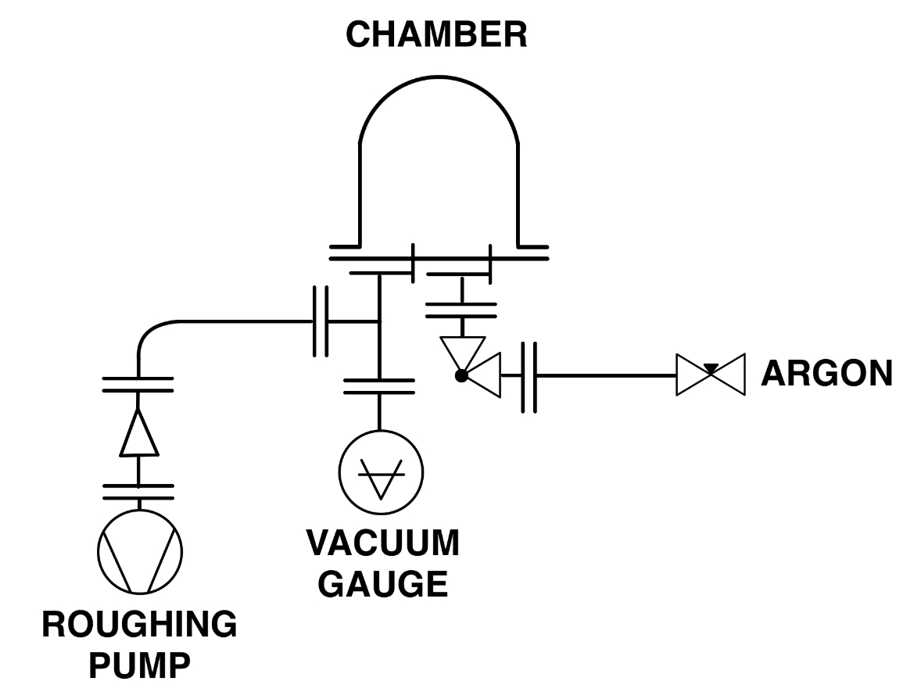
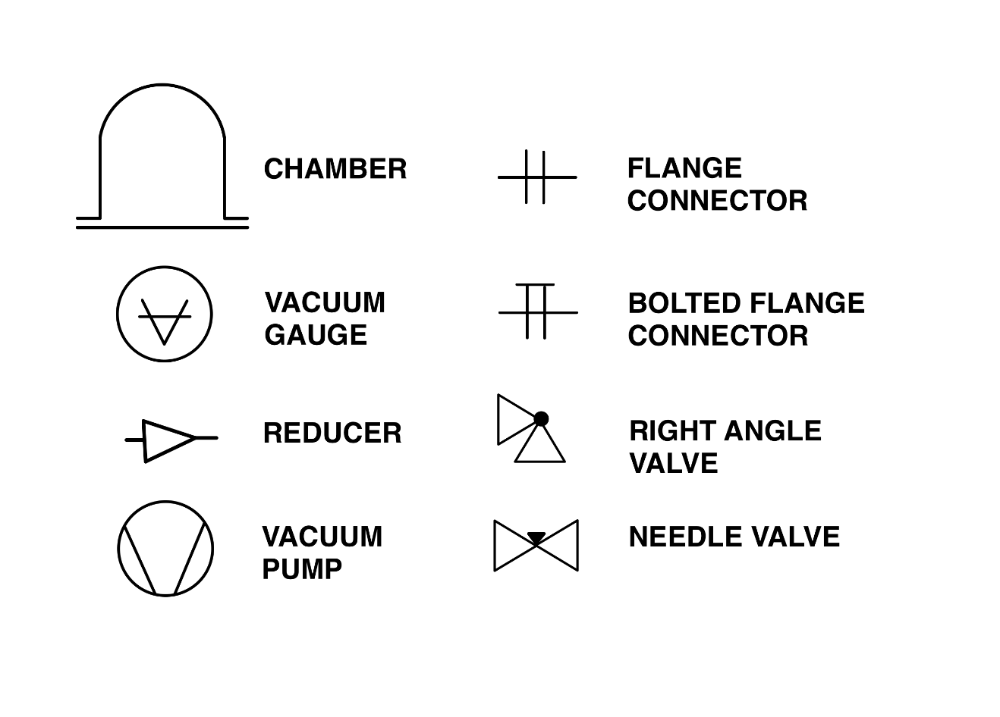

# ⚡ DC Sputtering (WIP) (UWaterloo)

## Preface

Although Waterloo's DC sputtering efforts began in 2024, the majority of work between Fall 2024 and Spring 2025 went undocumented. This page details the state and lessons learned of Waterloo's sputtering machine from the Summer of 2025 onwards. DC Sputtering was chosen primarily due to the relative accessibility of second-hand high voltage DC power supplies, although our long term goal is to move to an RF power supply.

**Contacts:**

* Skye Koh (@skyekoh)
* Eric Jessee (@eejay)

## Current Specifications (April 2026)

**Machine:**

* Chamber base pressure: 5 to 10mTorr  ✅
  * (Minimum pressure achievable by roughing pump)
* Max power: \~20W DC
  * Magnets will overheat after this threshold with sustained use

**Thin Films:**

* Copper Oxide / Copper&#x20;
  * Minimum resistance achieved: \~20Ω

## Design

### Power Supply

In choosing a DC power supply, the voltage of the power source must be high enough to provide sufficient force to accelerate electrons until they carry enough kinetic energy to ionize the sputtering gas molecules on collision.

Our initial solution was to re-purpose existing power supplies designed for electrophoresis processes. On paper, these power supplies are capable of delivering the voltage and current required for sputtering, and are ubiquitous on the second-hand market. They are also generally designed with built in ground leakage and arc fault protections, which at first glance appear to be welcome safety features. For these reasons, in order to minimize cost and increase safety for initial testing, an electrophohresis supply was purchased second hand, pictured below. The drawbacks of this type of supply are discussed in the [_Lessons Learned_](dc-sputtering-wip-uwaterloo.md#lessons-learned) section.

<figure><figcaption>
Fischer Biotech FB600 Electrophoresis DC Power Supply
</figcaption></figure>

### Vacuum Chamber Design

To minimize cost as well as design/manufacturing complexity, the chamber is comprised of a borosilicate glass bell jar, aluminum baseplate, Viton gasket, two electrical feedthroughs, and two KF inlet ports. The baseplate was manufactured using a milling machine in the school's student machine shop, although a drill press would suffice.&#x20;



<figure><figcaption>
Pyrex Vacuum Bell Jar
</figcaption></figure>





<figure><figcaption>
Chamber Exploded View
</figcaption></figure>




The rest of the vacuum setup included a roughing pump connected by a KF hose, a vacuum gauge, and an Argon inlet controlled manually by an isolation valve and needle valve. KF connections were possible to minimize leaks. The overall schematic is shown below.


{% column width="50%" %}
<figure><figcaption>
Vacuum Schematic Diagram
</figcaption></figure>


{% column width="50%" %}
<figure><figcaption>
Vacuum Symbols Guide
</figcaption></figure>



### Electrical Feedthroughs

The redesigned electrical feedthroughs were a significant breakthrough in reducing the pressure of the chamber by mitigating potential leak paths. These custom feedthroughs are made entirely from off-the-shelf low-cost components, comprised of a threaded rod, hex standoff, PTFE spacer, and Viton gasket. When the argon gas line is isolated from the chamber through the right-angle valve the chamber achieves a vacuum of 5 to 10mTorr, which is within the range of the maximum vacuum the roughing pump can pull, proving the effectiveness of the feedthrough.

<figure><figcaption>
DIY Electrical Feedthroughs
</figcaption></figure>

### Source Design

For ease of manufacturing, the size of the source was reduced to a diameter just over 30mm. The ground shield was improved to include a lip that partially covers the target to improve the plasma confinement and ensure only the target material is sputtered. Additionally, the magnet enclosure is made from mild steel to act as a pole piece, which provides a path for the magnetic flux to create an unbalanced magnetron, improving plasma confinement on the target.

<figure><figcaption>
Sputtering Source Cross Section
</figcaption></figure>

Because the goal of this source design was primarily to validate the design of the chamber, confinement of the plasma, and use of the DC power supply, the source design does not include active thermal management for the magnets. The next iteration will be designed with active cooling, either through air cooling or water cooling.&#x20;

### Testing and Deposition Results

The sputtering source achieved stable plasma confinement using an electrophoresis power supply with minimal arcing between 10-200mTorr.

<figure><figcaption>
Plasma Confinement
</figcaption></figure>

Copper was the only metal we sputtered, to varying degrees of success. Many trials exhibited high resistivity, indicating impure films and the presence of copper oxide. The lack of turbopump or Argon mass flow controller on our machine limits our ability to deposit high-quality films.&#x20;

<figure><figcaption>
Copper / Copper Oxide Sputtered on Glass Slide
</figcaption></figure>

## Lessons Learned

### Power Supply

We were able to carry out many experiments with this supply, and were able to learn a lot about the characteristics of plasma formation and maintenance. Unfortunately, one of the main features that the power supply was chosen for (ground and arc fault protection) ended up being a major limitation, making it very difficult to strike and maintain plasma.&#x20;

As such, an electrophoresis power supply is unsuitable for this application, as the in-built safety features are not designed to tolerate plasma behaviour, and make it very difficult to use. In order to continue with the DC sputtering process, a custom power supply must be constructed, and other engineering controls should be put in place to account for the lack of arc and ground fault protection.

## Bill of Materials

Most raw materials were purchased from the UWaterloo Engineering Machine Shop. However, equivalents can be found on McMaster-Carr or a local metal supermarket.&#x20;

<table><thead><tr><th width="218.64453125">Part</th><th width="121.58203125">Source</th><th width="103.05078125">Price ($CAD)</th><th>Note</th></tr></thead><tbody><tr><td>1/2" 6061 Aluminum Chamber Baseplate</td><td>Raw Material</td><td>$24.81</td><td>Baseplate</td></tr><tr><td>Borosilicate Glass Vacuum Bell Jar</td><td>EBay</td><td>$205</td><td>Swap out for an ordinary thick borosilicate glass jar (at your own risk)</td></tr><tr><td>Cold Rolled Steel Magnet Enclosure</td><td>Raw Material</td><td>$3.14</td><td>Pole piece</td></tr><tr><td>Magnets (x5)</td><td><a href="https://a.co/d/02EJFKIB">Amazon</a>.ca</td><td>~$2</td><td>Plasma confinement</td></tr><tr><td>6061 Aluminum Ground Shield</td><td>Raw Material</td><td>$3.86</td><td>Sputter only target material + plasma confinement</td></tr><tr><td>Feedthrough Hardware </td><td>McMaster-Carr, Various</td><td>~$30</td><td>Electrical vacuum feedthroughs</td></tr><tr><td>Vacuum gauge</td><td><a href="https://a.co/d/0eWdi6Yr">Amazon</a>.ca</td><td>$141.19</td><td>0.001 mmHg resolution (allegedly)</td></tr><tr><td>KF16 Swing Clamps</td><td><a href="https://a.co/d/0dSjxHSt">Amazon</a>.ca</td><td>$64.87</td><td>Pack of 10</td></tr><tr><td>KF16 Bulkhead Clamps</td><td><a href="https://a.co/d/0bc1zuEU">Amazon</a>.ca</td><td>$100</td><td>x2</td></tr><tr><td>Total (Excluding roughing pump)</td><td></td><td>$574.87</td><td></td></tr></tbody></table>

## Next Steps

**Vacuum**

* Turbopump
  * Our team has just acquired an Edwards EXT70H Turbomolecular Pump and EXDC160 Drive Controller. Integrating this into our system will require a full resdesign of the vacuum chamber, as well as a custom control system and new power supply for the Turbopump.&#x20;
* Implement Mass Flow Controllers

**Power Supply**

* Design a new RF or DC Power Supply

**Sputtering Source**

* Active cooling (air cooled or water cooling)
