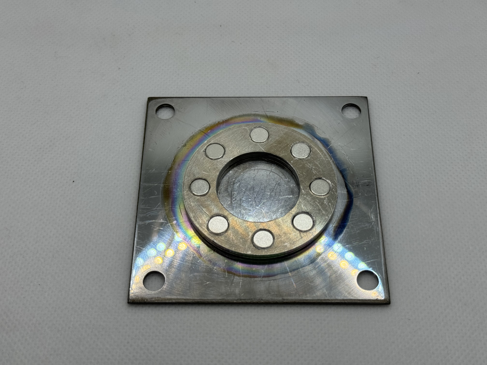

# ⚡ DIY RF Sputtering Chamber

<figure><figcaption></figcaption></figure>

## Preface

At the CMU Hacker Fab, we started building an RF sputtering Chamber in the Fall 2024. After a second iteration, the RF sputtering chamber seems to be reliable enough to share.

The sputtering project was originally initiated to support the development of a reliable DIY CMOS process. For context, the NMOS process as of F24 relies on buying p type wafers which already have a clean gate oxide grown on the, and a polysilicon gate contact deposited on top, providing a fab quality gate stack which is further processed into NMOS integrated circuits (ICs). For CMOS ICs, n type wells are needed within the p type substrate, and theses wells cannot be doped while the gate oxide and polysilicon gate contact are present on the wafer/substrate surface. Thus, to create  a CMOS process, the n wells would have to be doped **before** depositing a gate oxide and gate contact. Thus, to create a CMOS process, the fab needs to be capable of depositing a high quality gate oxide and gate contact, instead of buying wafers with the gate stack already present. The gate oxide and it's interfaces are the most sensitive parts of a transistors, as they are sensitive to small amounts of contamination, and small concentration of thin film and interfacial defects. For example to grow a high quality gate oxide of SiO2, requires a remarkably pure environment since ionic contamination at those temperature is extremely mobile, and can ruin the gate oxide.

After assessing the feasibility of creating high quality gate stacks through various methods, we landed on sputtering as the best tool for our situation; a fab that exists in non clean room. We chose RF sputtering, as it is capable of depositing almost any material, including high K dielectrics. Additionally, the vacuum environment of the sputtering chamber is likely o produce higher purity films than if we attempted to create a high purity furnace for growing oxides.&#x20;

The initial material chose for the the sputter gate stack were Aluminum oxide (double the dielectric constant of SiO2) as the gate oxide, and aluminum as the gate contact. The aluminum oxide is to be deposited a a reactive process, by flowing in O2 during the sputtering process, and using an Al Target. This process selection allows for the use of a single target, and allows for the deposition of both the gate oxide, and gate contact in a single sputtering run, which helps avoid contamination of the gate oxide, since it is covered with aluminum before venting the chamber, and exposing the wafer to potential contamination.&#x20;

Si - Al2O3 to Si gate stack:

&#x20;pros

* High k dielectric
* Single target needed if reactive sputtering is used
* Allows for immediate protection of gate oxide (which is very contamination sensitive)
* Cheap sputtering target material

cons

* Of all the metals, Al is particularly sensitive to oxygen contamination, and pre-sputtering/target cleaning. So, our system will have to be able to delivery extremely pure Ar, and a very clean vacuum environment to achieve conductive aluminum,

## Goal Specifications

#### Machine

* 1E-7 torr base pressure
* 100 watts 14 MHz RF power with >90% impedance matching
* Stable plasma down to 5 millitorr Ar
* .5 - 8" adjustable throw distance
* \>10nm/minute deposition rate for Al at 4" throw distance.
* Balanced magnetron magnetic field
* 1 sccm O2 flow accuracy
* 1 sccm Ar flow accuracy
* Actuatable substrate shield
* Air cooled magnetron
* 2 simultaneous process gasses
* View port
* Entire system machinable with only a drill press and band saw.

#### Thin films

* Al2O3 measured dielectric constant >6
* Al2O3 surface roughness <5nm
* Al resistivity of <3E-6 ohm-cm

## Chamber + Integrated Air Cooled Magnetron&#x20;

<figure><figcaption></figcaption></figure>

#### Concept Diagrams

<figure><figcaption>
Chamber
</figcaption></figure>

<figure><figcaption>
Air Cooled Magnetron
</figcaption></figure>

#### BOM

$924.87 as of 6/30/2025

<table><thead><tr><th width="164">Part</th><th width="40">#</th><th width="296">Link</th><th width="106">Price ($)</th><th>Role</th></tr></thead><tbody><tr><td>Aluminum disk (1/2" thick, 9" diameter)</td><td>2</td><td><a href="https://www.mcmaster.com/1610T67-1610T153/">https://www.mcmaster.com/1610T67-1610T153/</a></td><td>72.23</td><td>Top Plate and Bottom Plate</td></tr><tr><td>Pyrex cylinder with flame polished ends(8.86" (225mm) OD, .275" (7mm) thick, 8" long)</td><td>1</td><td><a href="https://www.greatglas.com/PyrexCylinders.htm">https://www.greatglas.com/PyrexCylinders.htm</a></td><td>225</td><td>Chamber walls</td></tr><tr><td>Viton "L" gasket (BJLGV-8)</td><td>2</td><td><a href="https://www.greatglas.com/PyrexBellJars.htm">https://www.greatglas.com/PyrexBellJars.htm</a></td><td>155.6</td><td>Sealing between cylinder and top/bottom plates</td></tr><tr><td>Aluminum plate (.63" thick, 6"x6")</td><td>1</td><td><a href="https://www.mcmaster.com/89015K183/">https://www.mcmaster.com/89015K183/</a></td><td>4.93</td><td>Substrate stage</td></tr><tr><td>Aluminum threaded rods (1/4"-20 thread, 8" long, 5 pack)</td><td>1</td><td><a href="https://www.mcmaster.com/93225A886/">https://www.mcmaster.com/93225A886/</a></td><td>12.5</td><td>Support substrate stage</td></tr><tr><td>316 Stainless steel wing nuts (1/4"-20 threaded, 5 pack)</td><td>2</td><td><a href="https://www.mcmaster.com/93575A029/">https://www.mcmaster.com/93575A029/</a></td><td>12.72</td><td>Support substrate stage</td></tr><tr><td>304 Stainless steel mesh</td><td>1</td><td><a href="https://www.amazon.com/YAGJIA-Stainless-200Mesh-40x120cm-Filtration/dp/B0CDPF51QB/ref=sr_1_1?crid=325KHAWKU2MHS&#x26;dib=eyJ2IjoiMSJ9.pZIi9xSSIXFLh09ZhUY3jwsxANT8xLJR31M9Wb2XT4y8OFinkL-aCW-SWYbZh8fisBXbpK-B41xGmIGC1lHzhWhmamgY2Lqw9p16R9NHCJNHS7thdnTKp6ikHjTWG1-mm-6mB5-ZvUS2AJ5UllkBGrLWZGVhUbexOVvViPTtxbXXl9zk96L3gR0LojIM8eFWql7IBOwCcVwXPdEsOCzlAuoJNlFzSX_LZ5HBjEnMItw.GsQozzCLqvxXp6vlg0QZYh_B8dnHoG9662NOriWItmU&#x26;dib_tag=se&#x26;keywords=fine%2Bsteel%2Bmesh&#x26;qid=1751295091&#x26;sprefix=fine%2Bsteel%2Bmesh%2Caps%2C93&#x26;sr=8-1&#x26;th=1">https://www.amazon.com/YAGJIA-Stainless-200Mesh-40x120cm-Filtration/dp/B0CDPF51QB/ref=sr_1_1?crid=325KHAWKU2MHS&#x26;dib=eyJ2IjoiMSJ9.pZIi9xSSIXFLh09ZhUY3jwsxANT8xLJR31M9Wb2XT4y8OFinkL-aCW-SWYbZh8fisBXbpK-B41xGmIGC1lHzhWhmamgY2Lqw9p16R9NHCJNHS7thdnTKp6ikHjTWG1-mm-6mB5-ZvUS2AJ5UllkBGrLWZGVhUbexOVvViPTtxbXXl9zk96L3gR0LojIM8eFWql7IBOwCcVwXPdEsOCzlAuoJNlFzSX_LZ5HBjEnMItw.GsQozzCLqvxXp6vlg0QZYh_B8dnHoG9662NOriWItmU&#x26;dib_tag=se&#x26;keywords=fine%2Bsteel%2Bmesh&#x26;qid=1751295091&#x26;sprefix=fine%2Bsteel%2Bmesh%2Caps%2C93&#x26;sr=8-1&#x26;th=1</a></td><td>12.99</td><td>Protect turbo pump</td></tr><tr><td>Aluminum Sheet (6"x24" .032")</td><td>1</td><td><a href="https://www.mcmaster.com/89015K155/">https://www.mcmaster.com/89015K155/</a></td><td>12.95</td><td>Used for magnetron atmosphere side ground box, dark space shield plate, and substrate shutter</td></tr><tr><td>Vented cup point screw (18-8 stainless steel, 10-32 threaded 1/2" long, 5 pack)</td><td>1</td><td><a href="https://www.mcmaster.com/91979A593/">https://www.mcmaster.com/91979A593/</a></td><td>6.33</td><td>Supports dark space shield plate, vented to avoid trapped air</td></tr><tr><td>Wing nuts (316 stainless steel, 10-32 threaded)</td><td>1</td><td><a href="https://www.mcmaster.com/93575A015/">https://www.mcmaster.com/93575A015/</a></td><td>5.5</td><td>Supports dark space shield plate</td></tr><tr><td>Washers (Aluminum, 1.25" ID, 2.25" OD, .16" thick, 5 pack)</td><td>1</td><td><a href="https://www.kjmagnetics.com/dx02-n52sh-neodymium-disc-magnet">https://www.kjmagnetics.com/dx02-n52sh-neodymium-disc-magnet</a></td><td>10.17</td><td>Stacked to set dark space shielding distance</td></tr><tr><td>N52SH Nedymium disk magnet (1" diamter, 1/8" thick)</td><td>1</td><td><a href="https://www.kjmagnetics.com/dc2-n52sh-neodymium-disc-magnet">https://www.kjmagnetics.com/dc2-n52sh-neodymium-disc-magnet</a></td><td>4.30</td><td>Center magnet</td></tr><tr><td>N42SH Nedymium disk magnets (1/4" diamter, 1/8" thick)</td><td>8</td><td><a href="https://www.kjmagnetics.com/d42sh-neodymium-high-temp-disc-magnet">https://www.kjmagnetics.com/d42sh-neodymium-high-temp-disc-magnet</a></td><td>4.8</td><td>Outer magnets</td></tr><tr><td>Alumina washers (2.5" OD, 1.062" ID, 1/8" thick)</td><td>2</td><td><a href="https://www.mcmaster.com/94610A311/">https://www.mcmaster.com/94610A311/</a></td><td>25</td><td>Fills space between side of target/magnet block, and side walls. Protects viton gasket from metal deposition and plama degredation</td></tr><tr><td>Viton sheet (1/8" thick, 6" x 6")</td><td>1</td><td><a href="https://www.amazon.com/Herco-0-125-Thick-Fluoroelastomer-Rubber/dp/B0BRBNDJH4/ref=sr_1_10?crid=2UD3KJOLJ8DHM&#x26;dib=eyJ2IjoiMSJ9.7jRE0_zXGPN4_skcluuH1itFHIZDuFiUmosqjyiyheCI0K0V81BKKr3SFppCX6ZjWJ8woSjRRPeEjShKqo8YiMbP61cWbQh1FxA5XBHJx875OPw8qpcdjKP8WxAIwK872dlUqu96oMkLhH55BFcQKZ92lXzlY0Di-HV1I2HTusbB8PJ-edKaUZ0m5CUBuf8NBxOwtji4ML0U-6hvo8_FBv9ksk5IyjOAyzt9a5LL8Hw.471eO99P9SEHFpq4NXSept_x1cEOSE6wHTgMAp7wQ1s&#x26;dib_tag=se&#x26;keywords=viton%2Bsheet&#x26;qid=1739762271&#x26;sprefix=viton%2Bsheet%2Caps%2C115&#x26;sr=8-10&#x26;th=1">https://www.amazon.com/Herco-0-125-Thick-Fluoroelastomer-Rubber/dp/B0BRBNDJH4/ref=sr_1_10?crid=2UD3KJOLJ8DHM&#x26;dib=eyJ2IjoiMSJ9.7jRE0_zXGPN4_skcluuH1itFHIZDuFiUmosqjyiyheCI0K0V81BKKr3SFppCX6ZjWJ8woSjRRPeEjShKqo8YiMbP61cWbQh1FxA5XBHJx875OPw8qpcdjKP8WxAIwK872dlUqu96oMkLhH55BFcQKZ92lXzlY0Di-HV1I2HTusbB8PJ-edKaUZ0m5CUBuf8NBxOwtji4ML0U-6hvo8_FBv9ksk5IyjOAyzt9a5LL8Hw.471eO99P9SEHFpq4NXSept_x1cEOSE6wHTgMAp7wQ1s&#x26;dib_tag=se&#x26;keywords=viton%2Bsheet&#x26;qid=1739762271&#x26;sprefix=viton%2Bsheet%2Caps%2C115&#x26;sr=8-10&#x26;th=1</a></td><td>38.97</td><td>Seal between steel cathode plate and aluminum top plate</td></tr><tr><td>Plate (low carbon steel, 1/16" thick, 3"x3")</td><td>1</td><td><a href="https://www.mcmaster.com/1388K142/">https://www.mcmaster.com/1388K142/</a></td><td>5.69</td><td>Cathode plate, pole piece, supports magnets</td></tr><tr><td>Teflon coated copper wire, (12 AWG, 25 feet)</td><td>1</td><td><a href="https://bntechgo.com/bntechgo-12awg-fep-teflon-coated-tin-plated-copper-wire-in-black-25-ft-has-a-temperature-rating-of-65-to-200-c-fep-teflon-wire-is-suitable-for-applications-requiring-high-temperature-resistance/">https://bntechgo.com/bntechgo-12awg-fep-teflon-coated-tin-plated-copper-wire-in-black-25-ft-has-a-temperature-rating-of-65-to-200-c-fep-teflon-wire-is-suitable-for-applications-requiring-high-temperature-resistance/</a></td><td>19.94</td><td>Connects UHF port to cathode plate</td></tr><tr><td>Terminal Connectors</td><td>1</td><td><a href="https://www.amazon.com/Shrink-Connectors-Terminals-Automotive-Terminal/dp/B0B2MLNV87?source=ps-sl-shoppingads-lpcontext&#x26;ref_=fplfs&#x26;smid=AJA0I35L29D7G&#x26;gQT=1&#x26;th=1">https://www.amazon.com/Shrink-Connectors-Terminals-Automotive-Terminal/dp/B0B2MLNV87?source=ps-sl-shoppingads-lpcontext&#x26;ref_=fplfs&#x26;smid=AJA0I35L29D7G&#x26;gQT=1&#x26;th=1</a></td><td>12.99</td><td>Connects 12awg wire to cathode plate</td></tr><tr><td>PEEK Socket head screws (1/4"-20, 3/8" long)</td><td>4</td><td><a href="https://www.mcmaster.com/98885A123/">https://www.mcmaster.com/98885A123/</a></td><td>23.48</td><td>Secures Cathode plate into top plate, compresses gasket</td></tr><tr><td>Copper heat sync (60x60x20mm)</td><td>1</td><td><a href="https://www.amazon.com/Heatsink-Skiving-Radiator-Electronic-Cooling/dp/B0B7G3FDBW/ref=sr_1_18?crid=1812WPGJJVKOP&#x26;dib=eyJ2IjoiMSJ9.U_HVle4mMfYR6Yc0WlfKR7sGnSBEVUKBDDGmwEjmfRuQUtABJLk68oAAt0vGFQiFcCiz0qPDFXW8o3MNGMViQyyrv_g4UPErOV4CUBYll9EPIfm8kK1pmoo1rghJvBumeSB3dkviAKSJq7pTS4nJztwwAPHAma-TcMV6s6trf23XM2nWUy6rzG6Vcei9F2XlQk12p5W4o0pN-Yc2zndz01qC6WBB7EM90HixHzHBHA4.K4WuNoDa_kTArlAzljiFAemCiBStXrgMIAeJ3qtd_to&#x26;dib_tag=se&#x26;keywords=heat%2Bsink%2B60mm%2Bx%2B60mm%2Btall%2Bheat%2Bsink&#x26;qid=1739908373&#x26;sprefix=heat%2Bsink%2B60mm%2Bx%2B60mm%2Btall%2Bheat%2Bsink%2Caps%2C92&#x26;sr=8-18&#x26;th=1">https://www.amazon.com/Heatsink-Skiving-Radiator-Electronic-Cooling/dp/B0B7G3FDBW/ref=sr_1_18?crid=1812WPGJJVKOP&#x26;dib=eyJ2IjoiMSJ9.U_HVle4mMfYR6Yc0WlfKR7sGnSBEVUKBDDGmwEjmfRuQUtABJLk68oAAt0vGFQiFcCiz0qPDFXW8o3MNGMViQyyrv_g4UPErOV4CUBYll9EPIfm8kK1pmoo1rghJvBumeSB3dkviAKSJq7pTS4nJztwwAPHAma-TcMV6s6trf23XM2nWUy6rzG6Vcei9F2XlQk12p5W4o0pN-Yc2zndz01qC6WBB7EM90HixHzHBHA4.K4WuNoDa_kTArlAzljiFAemCiBStXrgMIAeJ3qtd_to&#x26;dib_tag=se&#x26;keywords=heat%2Bsink%2B60mm%2Bx%2B60mm%2Btall%2Bheat%2Bsink&#x26;qid=1739908373&#x26;sprefix=heat%2Bsink%2B60mm%2Bx%2B60mm%2Btall%2Bheat%2Bsink%2Caps%2C92&#x26;sr=8-18&#x26;th=1</a></td><td>23.48</td><td>Cooling on top of cathode plate</td></tr><tr><td>Aluminum socket head screws (4-40 threaded, 1/4" long, 10 pack)</td><td>1</td><td><a href="https://www.mcmaster.com/98511A211/">https://www.mcmaster.com/98511A211/</a></td><td>12.81</td><td>Holds down magnetron atmosphere side ground box</td></tr><tr><td>Cooling Fans (60x10mm, 2 pack)</td><td>1</td><td><a href="https://www.amazon.com/Packs-Wathai-60mm-Brushless-Cooling/dp/B0821YC2NW/ref=sxin_16_pa_sp_search_thematic_sspa?content-id=amzn1.sym.c5787da2-212d-48eb-a894-9ea5a87adeb3%3Aamzn1.sym.c5787da2-212d-48eb-a894-9ea5a87adeb3&#x26;crid=IGI2DM2Z54O1&#x26;cv_ct_cx=60%2Bmm%2Bx%2B15%2Bmmcooling%2Bfans&#x26;keywords=60%2Bmm%2Bx%2B15%2Bmmcooling%2Bfans&#x26;pd_rd_i=B0821YC2NW&#x26;pd_rd_r=875aa891-436e-4af5-97ff-4a2a340b9787&#x26;pd_rd_w=b1oDe&#x26;pd_rd_wg=Vwwsx&#x26;pf_rd_p=c5787da2-212d-48eb-a894-9ea5a87adeb3&#x26;pf_rd_r=P9E8MVJRAS29G9PCZ9H7&#x26;qid=1739997192&#x26;sbo=RZvfv%2F%2FHxDF%2BO5021pAnSA%3D%3D&#x26;sprefix=60%2Bmm%2Bx%2B15%2Bmmcooling%2Bfans%2Caps%2C73&#x26;sr=1-4-6024b2a3-78e4-4fed-8fed-e1613be3bcce-spons&#x26;sp_csd=d2lkZ2V0TmFtZT1zcF9zZWFyY2hfdGhlbWF0aWM&#x26;th=1">https://www.amazon.com/Packs-Wathai-60mm-Brushless-Cooling/dp/B0821YC2NW/ref=sxin_16_pa_sp_search_thematic_sspa?content-id=amzn1.sym.c5787da2-212d-48eb-a894-9ea5a87adeb3%3Aamzn1.sym.c5787da2-212d-48eb-a894-9ea5a87adeb3&#x26;crid=IGI2DM2Z54O1&#x26;cv_ct_cx=60%2Bmm%2Bx%2B15%2Bmmcooling%2Bfans&#x26;keywords=60%2Bmm%2Bx%2B15%2Bmmcooling%2Bfans&#x26;pd_rd_i=B0821YC2NW&#x26;pd_rd_r=875aa891-436e-4af5-97ff-4a2a340b9787&#x26;pd_rd_w=b1oDe&#x26;pd_rd_wg=Vwwsx&#x26;pf_rd_p=c5787da2-212d-48eb-a894-9ea5a87adeb3&#x26;pf_rd_r=P9E8MVJRAS29G9PCZ9H7&#x26;qid=1739997192&#x26;sbo=RZvfv%2F%2FHxDF%2BO5021pAnSA%3D%3D&#x26;sprefix=60%2Bmm%2Bx%2B15%2Bmmcooling%2Bfans%2Caps%2C73&#x26;sr=1-4-6024b2a3-78e4-4fed-8fed-e1613be3bcce-spons&#x26;sp_csd=d2lkZ2V0TmFtZT1zcF9zZWFyY2hfdGhlbWF0aWM&#x26;th=1</a></td><td>12.99</td><td>Air flow through ground box for air cooling</td></tr><tr><td>Nylon screws (M4 threaded, 20 mm long, 100 pack)</td><td></td><td><a href="https://www.mcmaster.com/92492A731/">https://www.mcmaster.com/92492A731/</a></td><td>17.19</td><td>Secures fans to ground box without shorting to cathode plate.</td></tr><tr><td>UHF to solder cup connector</td><td>1</td><td><a href="https://www.amazon.com/DHT-Electronics-Female-Chassis-Connector/dp/B071KK22V2/ref=sr_1_8?crid=33I2KQN9ENJDC&#x26;dib=eyJ2IjoiMSJ9.yo8jRff7tZ25v9YK5XMf9AOxQoIdw9tOOUgFXuHue1srK26dMsU5KL0z9OsaHxZDuP764JWEEUWJzHLShFyhp2uqFs02JT8UbT-X5n5_qkUg4Bn2XM0gYmreqWfc19Ouz1Bw2p83-O_5NtpgsKBLYbDZSrm7wWDrplO-HD4eY4P99YVFNpj0eL_7vCSSDZmL1CmY5z3O9B6LAmYJKn_dpIXbaTfz1e8o5kLJ0zKIAgo.Z5nFv7xV74WUxusKtdjXih0ysTe6TIEWFq5ZuwG7rxU&#x26;dib_tag=se&#x26;keywords=UHF+solderable+mount&#x26;qid=1739754149&#x26;sprefix=uhf+solderable+mount%2Caps%2C86&#x26;sr=8-8">https://www.amazon.com/DHT-Electronics-Female-Chassis-Connector/dp/B071KK22V2/ref=sr_1_8?crid=33I2KQN9ENJDC&#x26;dib=eyJ2IjoiMSJ9.yo8jRff7tZ25v9YK5XMf9AOxQoIdw9tOOUgFXuHue1srK26dMsU5KL0z9OsaHxZDuP764JWEEUWJzHLShFyhp2uqFs02JT8UbT-X5n5_qkUg4Bn2XM0gYmreqWfc19Ouz1Bw2p83-O_5NtpgsKBLYbDZSrm7wWDrplO-HD4eY4P99YVFNpj0eL_7vCSSDZmL1CmY5z3O9B6LAmYJKn_dpIXbaTfz1e8o5kLJ0zKIAgo.Z5nFv7xV74WUxusKtdjXih0ysTe6TIEWFq5ZuwG7rxU&#x26;dib_tag=se&#x26;keywords=UHF+solderable+mount&#x26;qid=1739754149&#x26;sprefix=uhf+solderable+mount%2Caps%2C86&#x26;sr=8-8</a></td><td>6</td><td>Allows for coax cable connection</td></tr><tr><td>KF16 Centered viton O-rings (10 pack)</td><td>1</td><td><a href="https://www.amazon.com/Flange-Centering-10pcs-ISO-KF-Stainless/dp/B08GL9JQCM/ref=sr_1_3?crid=1CRR587B6IXEL&#x26;dib=eyJ2IjoiMSJ9.3Z2fRmBOQ6dT4KAbcJ4Rdh0t-p-6B5DdF0yqAniM3xTY0I21dpts0Y4-Y7gUhynKSErpVGd_6f1yb3CIs7SN_cLUuWs5XtoIotb4hQcRDu8c5kKuWcLgrmTBIB1dMWJ43njSGoh4cFujWS4TmTKsg6XapqBAlO51NKdb3LgROLucgRIDctLWjAhdeLHGvjEnvhPklt4cLee6OfrsRhckh9TUfm6Ru4dtxHku2xiaWY8.QqnbT93k3yJMOv5ALKloUGlOyWpey96Yv5Lpm79WD0k&#x26;dib_tag=se&#x26;keywords=kf16%2Bseal&#x26;qid=1743004544&#x26;sprefix=kf16%2Bseal%2Caps%2C69&#x26;sr=8-3&#x26;th=1">https://www.amazon.com/Flange-Centering-10pcs-ISO-KF-Stainless/dp/B08GL9JQCM/ref=sr_1_3?crid=1CRR587B6IXEL&#x26;dib=eyJ2IjoiMSJ9.3Z2fRmBOQ6dT4KAbcJ4Rdh0t-p-6B5DdF0yqAniM3xTY0I21dpts0Y4-Y7gUhynKSErpVGd_6f1yb3CIs7SN_cLUuWs5XtoIotb4hQcRDu8c5kKuWcLgrmTBIB1dMWJ43njSGoh4cFujWS4TmTKsg6XapqBAlO51NKdb3LgROLucgRIDctLWjAhdeLHGvjEnvhPklt4cLee6OfrsRhckh9TUfm6Ru4dtxHku2xiaWY8.QqnbT93k3yJMOv5ALKloUGlOyWpey96Yv5Lpm79WD0k&#x26;dib_tag=se&#x26;keywords=kf16%2Bseal&#x26;qid=1743004544&#x26;sprefix=kf16%2Bseal%2Caps%2C69&#x26;sr=8-3&#x26;th=1</a></td><td>18.5</td><td>Sealing KF16 bulkhead ports</td></tr><tr><td>KF16 Blanks</td><td>4</td><td><a href="https://www.vplcorp.com/wholesale-blank-off-flange-kf16-nw16-aluminum/">https://www.vplcorp.com/wholesale-blank-off-flange-kf16-nw16-aluminum/</a></td><td>1.4</td><td>Sealing unused KF16 Bulkhead ports</td></tr><tr><td>KF16 bulkhead clamps</td><td>4</td><td><a href="https://www.lesker.com/newweb/flanges/hardware_kf_clamps_bulkhead.cfm?pgid=al">https://www.lesker.com/newweb/flanges/hardware_kf_clamps_bulkhead.cfm?pgid=al</a></td><td>112.6</td><td>Modular KF16 ports</td></tr><tr><td>Flared collar thumb screw (1/4"-28 threaded, 18-8 Stainless steel, 1-1/4" long)</td><td>1</td><td><a href="https://www.mcmaster.com/99607A246/">https://www.mcmaster.com/99607A246/</a></td><td>7.35</td><td>Substrate Shutter</td></tr><tr><td>Viton O rings (1/4" ID, 12" OD, 1/8" thick, 25 pack)</td><td>1</td><td><a href="https://www.mcmaster.com/6540K248/">https://www.mcmaster.com/6540K248/</a></td><td>17.44</td><td>Substrate shutter sealing</td></tr><tr><td>Aluminum nuts (1/4"-28 threaded, 10 pack)</td><td>1</td><td><a href="https://www.mcmaster.com/90670A155/">https://www.mcmaster.com/90670A155/</a></td><td>14.34</td><td>Substrate shutter</td></tr><tr><td>Alligotor clips</td><td>1</td><td><a href="https://www.amazon.com/Alligator-Electrical-1-77in-Soldered-EDGELEC/dp/B0D2DHLTZ5/ref=sr_1_2_sspa?dib=eyJ2IjoiMSJ9.ATt4qSqr7vYBBqRxx5R9xCAxpWNr5n4MnwNYAQhrYHBBMyr9xeJlCZmaGaWbtmmFiMjb-QFLLXmqJLvZqL0nna-Sh6SfZUHkN-tkpvaKp6CvAVFKo7Uwwm4aQdv0TpuQrYN7_qPnhJyAeHOL9ARH66VGJToSrCfncE7cF-t6ff8a-bI-ATqDqZVwctl3Q7-GWvi7VmY8aIv86OJKiU11i-dszkueDvBkj58lx-sKmK8.QJijmozzH2zAzLxov0tvBF3_2TpkzGz5BEeKFS0Yqiw&#x26;dib_tag=se&#x26;keywords=alligator%2Bclip%2Bwire&#x26;qid=1751299979&#x26;sr=8-2-spons&#x26;sp_csd=d2lkZ2V0TmFtZT1zcF9hdGY&#x26;th=1">https://www.amazon.com/Alligator-Electrical-1-77in-Soldered-EDGELEC/dp/B0D2DHLTZ5/ref=sr_1_2_sspa?dib=eyJ2IjoiMSJ9.ATt4qSqr7vYBBqRxx5R9xCAxpWNr5n4MnwNYAQhrYHBBMyr9xeJlCZmaGaWbtmmFiMjb-QFLLXmqJLvZqL0nna-Sh6SfZUHkN-tkpvaKp6CvAVFKo7Uwwm4aQdv0TpuQrYN7_qPnhJyAeHOL9ARH66VGJToSrCfncE7cF-t6ff8a-bI-ATqDqZVwctl3Q7-GWvi7VmY8aIv86OJKiU11i-dszkueDvBkj58lx-sKmK8.QJijmozzH2zAzLxov0tvBF3_2TpkzGz5BEeKFS0Yqiw&#x26;dib_tag=se&#x26;keywords=alligator%2Bclip%2Bwire&#x26;qid=1751299979&#x26;sr=8-2-spons&#x26;sp_csd=d2lkZ2V0TmFtZT1zcF9hdGY&#x26;th=1</a></td><td>8.99</td><td>Grounds bottom plate with top plate</td></tr><tr><td>Power Strip</td><td>1</td><td><a href="https://www.amazon.com/Protector-Outlets-Braided-Extension-Extender/dp/B07WQS9V2G/ref=sr_1_9?crid=2HPXAWCFFZMXH&#x26;dib=eyJ2IjoiMSJ9.4KAdxtHJarwC7szv_2z_fvxLHMscJkVBJ2h46vy0yxJ7RWayGvCaIETEHuk31--dDGC9qmZpwJ2QQW7wV_-XB4pPT2T_xi0UPYc7Jf48bnqms57cGovLQImOiFt_8K4GnfS480Gr8Gm8pUxASgVl46t7Ui3X3A9TOgqxkVi6t7qexLUXQn8JwE4HqnUSG4-tixrnWYon64-ebRwOY51JuNM5b7-HcZfcg4QYQe2sLbw.hmNyljVOjPHs1L0hsTMfTBWpne7aM3won1XtEy03qDo&#x26;dib_tag=se&#x26;keywords=dual%2Busb%2Bpower%2Bstrip&#x26;qid=1743005550&#x26;sprefix=dual%2Busb%2Bpower%2Bstrip%2Caps%2C90&#x26;sr=8-9&#x26;th=1">https://www.amazon.com/Protector-Outlets-Braided-Extension-Extender/dp/B07WQS9V2G/ref=sr_1_9?crid=2HPXAWCFFZMXH&#x26;dib=eyJ2IjoiMSJ9.4KAdxtHJarwC7szv_2z_fvxLHMscJkVBJ2h46vy0yxJ7RWayGvCaIETEHuk31--dDGC9qmZpwJ2QQW7wV_-XB4pPT2T_xi0UPYc7Jf48bnqms57cGovLQImOiFt_8K4GnfS480Gr8Gm8pUxASgVl46t7Ui3X3A9TOgqxkVi6t7qexLUXQn8JwE4HqnUSG4-tixrnWYon64-ebRwOY51JuNM5b7-HcZfcg4QYQe2sLbw.hmNyljVOjPHs1L0hsTMfTBWpne7aM3won1XtEy03qDo&#x26;dib_tag=se&#x26;keywords=dual%2Busb%2Bpower%2Bstrip&#x26;qid=1743005550&#x26;sprefix=dual%2Busb%2Bpower%2Bstrip%2Caps%2C90&#x26;sr=8-9&#x26;th=1</a></td><td>9.99</td><td></td></tr><tr><td><strong>Total</strong></td><td></td><td></td><td><strong>$929.17</strong></td><td></td></tr></tbody></table>

2" diameter, 1/8" thick, high purity aluminum target not included in BOM

## Power Supply

The power supply consists of a 100W Radio transceiver, an antenna tuner, and a switching DC power supply to power the radio. The radio supplies a 14 MHz sine wave at 100 watts into an antenna tuner. The antenna tuner uses selectable inductors and a variable capacitor to tune the impedance of the system, and the output is connected to the magnetron via UHF cable.

The antenna tuner achieves 90-95% impedance matching, delivering 90-95 watts of forward power.

<figure><figcaption></figcaption></figure> <figure><figcaption></figcaption></figure> <figure><figcaption></figcaption></figure>

#### BOM

$1025.88 as of 6/30/2025

<table><thead><tr><th width="154">Part</th><th width="40">#</th><th width="467">Link</th><th>Price ($)</th></tr></thead><tbody><tr><td>Yaesu FT-891 Transceiver</td><td>1</td><td><a href="https://www.dxengineering.com/parts/ysu-ft-891?srsltid=AfmBOor5rMQTB8zAWqkcRWGNFK9dc8_W2loUvtWGbBEB63qhzYZr7-17">https://www.dxengineering.com/parts/ysu-ft-891?srsltid=AfmBOor5rMQTB8zAWqkcRWGNFK9dc8_W2loUvtWGbBEB63qhzYZr7-17</a></td><td>629.95</td></tr><tr><td>Comet CAT-300 antenna tuner</td><td>1</td><td><a href="https://www.dxengineering.com/parts/cma-cat-300">https://www.dxengineering.com/parts/cma-cat-300</a></td><td>279.95</td></tr><tr><td>TP30SWI Switching DC power supply</td><td>1</td><td><a href="https://www.amazon.com/TekPower-Analog-Display-TP30SWI-Switching/dp/B01MQ2PGYO">https://www.amazon.com/TekPower-Analog-Display-TP30SWI-Switching/dp/B01MQ2PGYO</a></td><td>99.99</td></tr><tr><td>UHF cable (3', 2 pack)</td><td>1</td><td><a href="https://www.amazon.com/MOOKEERF-Jumper-Cable-Antenna-Analyzer/dp/B0B3HVLMWR/ref=sr_1_4?dib=eyJ2IjoiMSJ9.uXYYZUlr84X-uyAiHB350gaK1u63msRM4NHtcrjrER8c0AIyS-9B6hbXOFjj-9bFrDUi_3fGDhpUU-G0p-7_zupWlmB1G-7q7HvGlht8-oLO5jBlbQkEkTkubt0XoZzCPEYmFY1pkWXALBZdtorAAoiMI_jUvGjh0voJBkQBcmLbnvwwPsOMEHyvQcsGTXgnIPPjq0afCqAPIzazt030mXIOLAy3CncCGFj2RdsrNnc.63SqTMsZDzfKXYFl8LEn7_7dnZ25uxkH45Q75Gz2Oxs&#x26;dib_tag=se&#x26;hvadid=695430056154&#x26;hvdev=c&#x26;hvexpln=67&#x26;hvlocphy=9005925&#x26;hvnetw=g&#x26;hvocijid=1471782757759262822--&#x26;hvqmt=e&#x26;hvrand=1471782757759262822&#x26;hvtargid=kwd-871808323360&#x26;hydadcr=17952_13446635&#x26;keywords=uhf+to+uhf+cable&#x26;mcid=76b362f25125383c937d6612c82cadd6&#x26;qid=1751307632&#x26;sr=8-4">https://www.amazon.com/MOOKEERF-Jumper-Cable-Antenna-Analyzer/dp/B0B3HVLMWR/ref=sr_1_4?dib=eyJ2IjoiMSJ9.uXYYZUlr84X-uyAiHB350gaK1u63msRM4NHtcrjrER8c0AIyS-9B6hbXOFjj-9bFrDUi_3fGDhpUU-G0p-7_zupWlmB1G-7q7HvGlht8-oLO5jBlbQkEkTkubt0XoZzCPEYmFY1pkWXALBZdtorAAoiMI_jUvGjh0voJBkQBcmLbnvwwPsOMEHyvQcsGTXgnIPPjq0afCqAPIzazt030mXIOLAy3CncCGFj2RdsrNnc.63SqTMsZDzfKXYFl8LEn7_7dnZ25uxkH45Q75Gz2Oxs&#x26;dib_tag=se&#x26;hvadid=695430056154&#x26;hvdev=c&#x26;hvexpln=67&#x26;hvlocphy=9005925&#x26;hvnetw=g&#x26;hvocijid=1471782757759262822--&#x26;hvqmt=e&#x26;hvrand=1471782757759262822&#x26;hvtargid=kwd-871808323360&#x26;hydadcr=17952_13446635&#x26;keywords=uhf+to+uhf+cable&#x26;mcid=76b362f25125383c937d6612c82cadd6&#x26;qid=1751307632&#x26;sr=8-4</a></td><td>15.99</td></tr><tr><td><strong>Total</strong></td><td></td><td></td><td><strong>$1025.88</strong></td></tr></tbody></table>

## Pumping System + Vacuum Gauge

A turbo pump was selected to ensure a base pressure of 1E-7 torr prior to depositions. Any turbo pump + roughing pump system could be used, but the HiCube 300 Eco pumping system was used because we already had it prior to beginning the project. The MPT 200 pressure guage was also used simply becasue we already had one.

#### BOM

$11,399.86 as of 6/30/2025

<table data-header-hidden><thead><tr><th width="121.00006103515625">Part</th><th width="40">#</th><th width="420">Link</th><th>Total Price ($)</th></tr></thead><tbody><tr><td>HiCube 300 Eco Pumping Station</td><td>1</td><td><a href="https://www.idealvac.com/en-us/Pfeiffer-HiCube-300-Eco-Benchtop-Turbomolecular-Pump-Station-ISO-100K-Inlet-110-240-VAC-PN:-PM-025-019-AT/pp/P1011608">https://www.idealvac.com/en-us/Pfeiffer-HiCube-300-Eco-Benchtop-Turbomolecular-Pump-Station-ISO-100K-Inlet-110-240-VAC-PN:-PM-025-019-AT/pp/P1011608</a></td><td>10733.87</td></tr><tr><td>DN100CF FKM gasket</td><td>1</td><td><a href="https://www.lesker.com/flanges/hardware-cf-gaskets/part/vzvit100">https://www.lesker.com/flanges/hardware-cf-gaskets/part/vzvit100</a></td><td>38.25</td></tr><tr><td>MPT 200 Pressure Gauge</td><td>1</td><td><a href="https://www.idealvac.com/en-us/Pfeiffer-PiraniCold-Cathode-Combination-MPT-200-Gauge-RS-485-analog-0-10V-KF25-PN:-PT-R40-141/pp/P107321?srsltid=AfmBOooRa2jCMva1dUtlUuyUUF6zqvpxA4Uad86e-j1NAPchPNNiyPaS">https://www.idealvac.com/en-us/Pfeiffer-PiraniCold-Cathode-Combination-MPT-200-Gauge-RS-485-analog-0-10V-KF25-PN:-PT-R40-141/pp/P107321?srsltid=AfmBOooRa2jCMva1dUtlUuyUUF6zqvpxA4Uad86e-j1NAPchPNNiyPaS</a></td><td>590.76</td></tr><tr><td>kF25 to KF16 adapter</td><td>1</td><td><a href="https://locoscience.com/products/kf25-to-kf16-flange-conical-reducer-vacuum-adapter?currency=USD&#x26;variant=19581628612704&#x26;utm_source=google&#x26;utm_medium=cpc&#x26;utm_campaign=Google%20Shopping&#x26;stkn=bfb99cbe7f05&#x26;gad_source=1&#x26;gad_campaignid=19936024283&#x26;gbraid=0AAAAADdoM7-bi0ISgQTgJ8jl9yMqjvSra&#x26;gclid=Cj0KCQjw64jDBhDXARIsABkk8J6qn0G6WHLT4zIVgFr3LSb47LcR9Bv79kOYF2cwLjZ8G4yy_4OW4dMaAv3bEALw_wcB">https://locoscience.com/products/kf25-to-kf16-flange-conical-reducer-vacuum-adapter?currency=USD&#x26;variant=19581628612704&#x26;utm_source=google&#x26;utm_medium=cpc&#x26;utm_campaign=Google%20Shopping&#x26;stkn=bfb99cbe7f05&#x26;gad_source=1&#x26;gad_campaignid=19936024283&#x26;gbraid=0AAAAADdoM7-bi0ISgQTgJ8jl9yMqjvSra&#x26;gclid=Cj0KCQjw64jDBhDXARIsABkk8J6qn0G6WHLT4zIVgFr3LSb47LcR9Bv79kOYF2cwLjZ8G4yy_4OW4dMaAv3bEALw_wcB</a></td><td>24.99</td></tr><tr><td>kf25 clamp and O-ring</td><td>1</td><td><a href="https://locoscience.com/products/kf25-flange-vacuum-clamp-aluminum?currency=USD&#x26;variant=19581330784352&#x26;utm_source=google&#x26;utm_medium=cpc&#x26;utm_campaign=Google%20Shopping&#x26;stkn=bfb99cbe7f05&#x26;gad_source=1&#x26;gad_campaignid=19936024283&#x26;gbraid=0AAAAADdoM7-bi0ISgQTgJ8jl9yMqjvSra&#x26;gclid=Cj0KCQjw64jDBhDXARIsABkk8J6mwtI2Y1_ZwfvezxCv9TxUThGjIaIBb1HaUMrUm_yiDZtiQxroWvwaAgaaEALw_wcB">https://locoscience.com/products/kf25-flange-vacuum-clamp-aluminum?currency=USD&#x26;variant=19581330784352&#x26;utm_source=google&#x26;utm_medium=cpc&#x26;utm_campaign=Google%20Shopping&#x26;stkn=bfb99cbe7f05&#x26;gad_source=1&#x26;gad_campaignid=19936024283&#x26;gbraid=0AAAAADdoM7-bi0ISgQTgJ8jl9yMqjvSra&#x26;gclid=Cj0KCQjw64jDBhDXARIsABkk8J6mwtI2Y1_ZwfvezxCv9TxUThGjIaIBb1HaUMrUm_yiDZtiQxroWvwaAgaaEALw_wcB</a></td><td>11.99</td></tr><tr><td><strong>Total</strong></td><td></td><td></td><td><strong>$11,399.86</strong></td></tr></tbody></table>

## Gas Flow

Mass flow controllers that can deliver small amounts precise flow are necessary to achieve ethe desired pressures. The MCFs require a fixed pressure of around 10-20 PSIG on the inlet side to maintain accurate flow, so dual stage regulators are used to control pressure between the MFC and cylinder.

#### BOM

$4,957.09 as of 6/30/2025

<table data-header-hidden><thead><tr><th width="142">Part</th><th width="53">#</th><th width="408">Link</th><th>Total Price ($)</th></tr></thead><tbody><tr><td>Alicat MC Series MFC (100 SCCM Ar)</td><td>1</td><td><a href="https://www.alicat.com/products/gas-flow/mass-flow-controller/laminar-dp-mass-flow-controllers/">https://www.alicat.com/products/gas-flow/mass-flow-controller/laminar-dp-mass-flow-controllers/</a></td><td>1544.4</td></tr><tr><td>Alicat MC Series MFC (50 SCCM O2)</td><td>1</td><td><a href="https://www.alicat.com/products/gas-flow/mass-flow-controller/laminar-dp-mass-flow-controllers/">https://www.alicat.com/products/gas-flow/mass-flow-controller/laminar-dp-mass-flow-controllers/</a></td><td>1544.4</td></tr><tr><td>KF16 to 1/8” Male NPT adapter</td><td>2</td><td><a href="https://locoscience.com/products/kf-16-to-npt-male-vacuum-fitting-loco-science?currency=USD&#x26;variant=36380797141147&#x26;utm_source=google&#x26;utm_medium=cpc&#x26;utm_campaign=Google%20Shopping&#x26;stkn=bfb99cbe7f05&#x26;gad_source=1&#x26;gad_campaignid=19936024283&#x26;gbraid=0AAAAADdoM7-bi0ISgQTgJ8jl9yMqjvSra&#x26;gclid=Cj0KCQjw64jDBhDXARIsABkk8J4I91IYZZCROysGnBMIDE1JQgjV1BJnSxkaiapP75puMDYDi8G9wd0aAobSEALw_wcB">https://locoscience.com/products/kf-16-to-npt-male-vacuum-fitting-loco-science?currency=USD&#x26;variant=36380797141147&#x26;utm_source=google&#x26;utm_medium=cpc&#x26;utm_campaign=Google%20Shopping&#x26;stkn=bfb99cbe7f05&#x26;gad_source=1&#x26;gad_campaignid=19936024283&#x26;gbraid=0AAAAADdoM7-bi0ISgQTgJ8jl9yMqjvSra&#x26;gclid=Cj0KCQjw64jDBhDXARIsABkk8J4I91IYZZCROysGnBMIDE1JQgjV1BJnSxkaiapP75puMDYDi8G9wd0aAobSEALw_wcB</a></td><td>33.98</td></tr><tr><td>1/4" VCR Male to 1/4" Male NPT adapters</td><td>2</td><td><a href="https://products.swagelok.com/en/c/straights/p/SS-4-VCR-1-2">https://products.swagelok.com/en/c/straights/p/SS-4-VCR-1-2</a></td><td>31.52</td></tr><tr><td>1/4" VCR Male to 1/8" Male NPT adapters</td><td>2</td><td><a href="https://products.swagelok.com/en/c/straights/p/SS-4-VCR-1-4">https://products.swagelok.com/en/c/straights/p/SS-4-VCR-1-4</a></td><td>31.6</td></tr><tr><td>1/4" VCR metal gaskets</td><td>4</td><td><a href="https://products.swagelok.com/en/c/gaskets/p/SS-4-VCR-2-GR?q=:relevance:platingsCoatings:Silver-Plated:gasketStyle:Gasket+Retainer+Assembly:bodyMaterial:316L+Stainless+Steel:gasketSize:1%2F4+in.">https://products.swagelok.com/en/c/gaskets/p/SS-4-VCR-2-GR?q=:relevance:platingsCoatings:Silver-Plated:gasketStyle:Gasket+Retainer+Assembly:bodyMaterial:316L+Stainless+Steel:gasketSize:1%2F4+in.</a></td><td>23</td></tr><tr><td>Flexible Metal gas line 1/4" male VCR ends</td><td>2</td><td><a href="https://www.amazon.com/corrugated-pipe-VCR1-4Female-metal/dp/B0C13LJZG3?th=1">https://www.amazon.com/corrugated-pipe-VCR1-4Female-metal/dp/B0C13LJZG3?th=1</a></td><td>161.15</td></tr><tr><td>3850 series dual stage regulators</td><td>2</td><td><a href="https://store.mathesongas.com/3850-series-dual-stage-high-purity-miniature-regulator-brass/">https://store.mathesongas.com/3850-series-dual-stage-high-purity-miniature-regulator-brass/</a></td><td>1587.04</td></tr><tr><td><strong>Total</strong></td><td></td><td></td><td><strong>$4,957.09</strong></td></tr></tbody></table>

UHP Ar and O2 cylinders not included in BOM

## Testing/Verification

* Chamber reaches 1.6E-7 hPa base pressure
* Highly conductive Al films have been sputtered
* Further characterization of films is actively being pursued

<figure><figcaption>
Glass microscope slide with Al sputtered onto it
</figcaption></figure>

## Future/Pending Work

* Replae radio with signal generator and amplifier
* Build our own tuner/matching network (its literally just an inductor and variable capacitor)
* DIY substrate heater
* DIY QCM
* Automation/controls
* More film characterization, and experimentation with various target materials

## Lessons Learned

Many failures occurred over two iterations of power supply and chamber. A more detailed collection and description of these is yet to be uploaded

## Contacts

#### Primary Contacts

* Jay Kunselman
* Rahim Malik

#### Additional Contributors

* Matthew Moneck
* Marina Wang
* Shayaan Gandhi
* Meadow Webster
* Rachel Lewis
* Ayan Ghosh

## Misc. Images

<figure><figcaption></figcaption></figure> <figure><figcaption></figcaption></figure> <figure><figcaption></figcaption></figure> <figure><figcaption></figcaption></figure> <figure><figcaption></figcaption></figure> <figure><figcaption></figcaption></figure> <figure><figcaption></figcaption></figure> <figure><figcaption></figcaption></figure> <figure><figcaption></figcaption></figure> <figure><figcaption></figcaption></figure> <figure><figcaption></figcaption></figure> <figure><figcaption></figcaption></figure> <figure><figcaption></figcaption></figure> <figure><figcaption></figcaption></figure> <figure><figcaption></figcaption></figure> <figure><figcaption></figcaption></figure>

