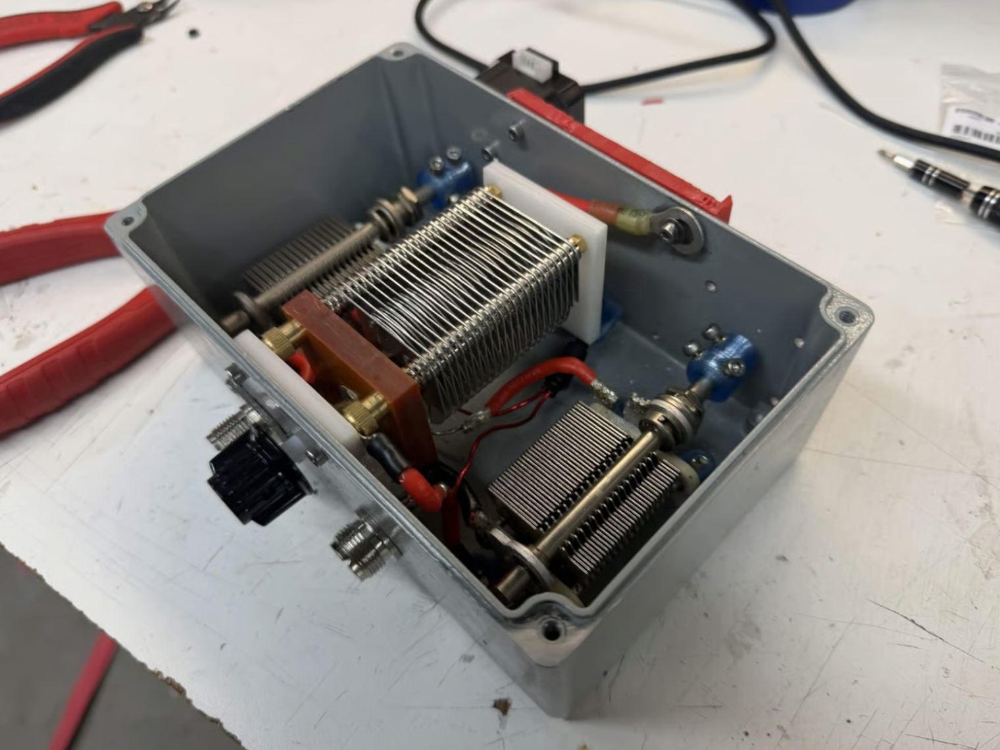
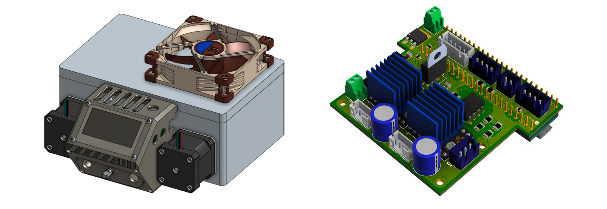
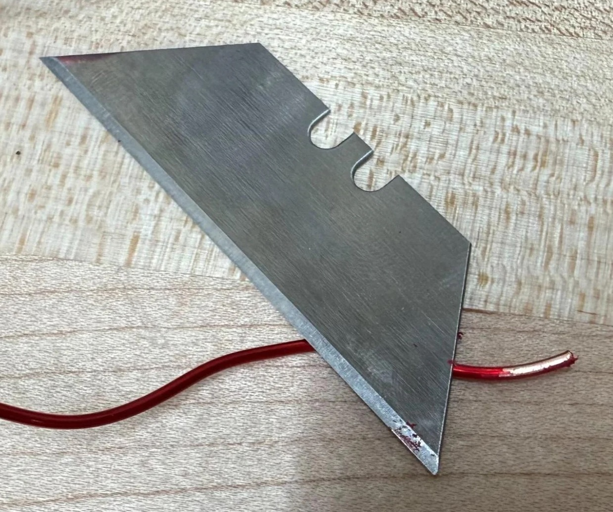
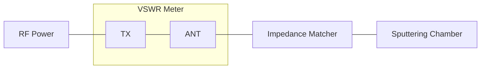
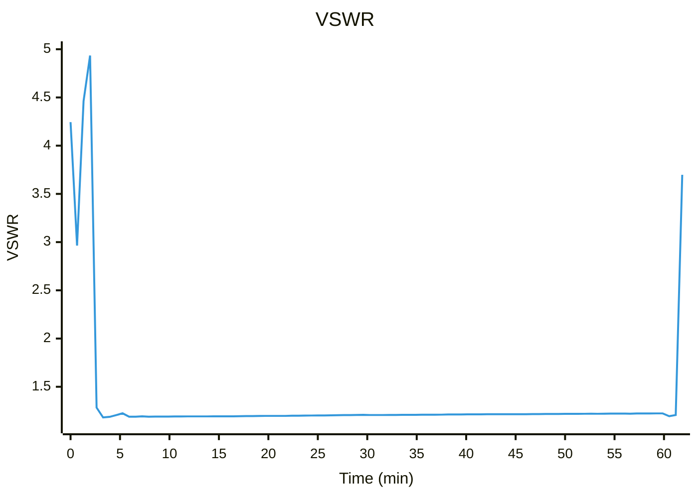
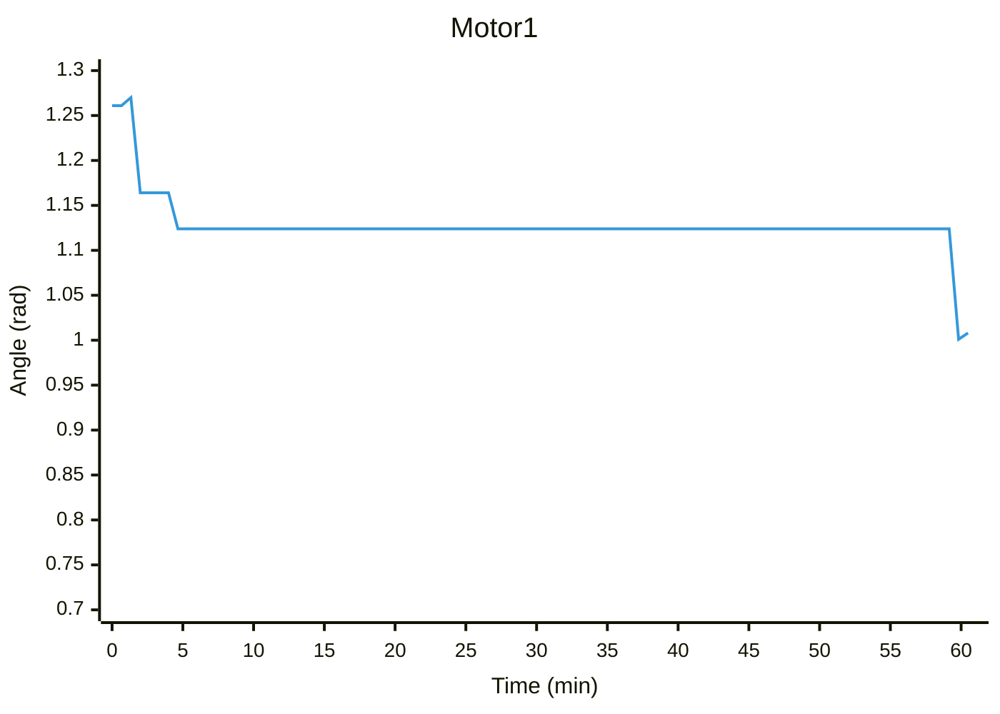

# Automated Impedance Matching

<figure><figcaption></figcaption></figure> <figure><figcaption></figcaption></figure>

## Hardware Specifications

| Metric                     | Value                                    |
| -------------------------- | ---------------------------------------- |
| Cost                       | $636.65                                  |
| Approximate Build Time     | 8 hours                                  |
| Enclosure Dimensions       | 195 mm x 185 mm x 80 mm                  |
| Maximum Forward Power      | 100 W                                    |
| Minimum Operating Pressure | Sustained plasma at 5.40E-3 hPa in argon |
| Stabilized Performance     | \~1.2 VSWR                               |
| Match Speed From Startup   | \~5 seconds                              |
| VSWR Sensing Noise         | ±0.001                                   |


Disclaimer: Note that some real-life images of the build may differ from the finalized BOM and design files because of improvements made after integration.


## Preface

This project is an automated impedance-matching network designed specifically for RF sputtering. When generating plasma in a sputtering chamber, the chamber impedance constantly fluctuates. This leads to high reflected power, measured as VSWR, which can reduce efficiency or extinguish the plasma.

Instead of relying on an expensive commercial auto-tuner, this tool dynamically matches the impedance of the sputtering chamber. It intercepts the forward and reflected power signals from an off-the-shelf VSWR meter. A Teensy 4.1 microcontroller processes these signals, calculates the gradient, and drives stepper motors. These motors tune variable capacitors in a T-network to minimize reflected power. The system features a custom PCB, active cooling, and a local GUI with an OLED screen and rotary encoder for monitoring and control.

<figure><figcaption>
Box assembly and PCB
</figcaption></figure>


Working prototype


## Design Decisions and Rationale

### RF Components and T-Network

We used air-variable capacitors rated for 500 V. This provides the necessary safety margin for the maximum peak-to-peak voltage of 200 V and helps mitigate arcing. This design also includes one large manually tunable capacitor. It is set during initial setup to bring the T-network tuning range into the correct region for our sputtering chamber.

Finding an off-the-shelf inductor that matched our exact 2 μH specification was difficult, so we fabricated a custom coil using 16-AWG magnet wire wrapped around an acetal copolymer rod. This core keeps the turns even during manufacturing, and the 16-AWG wire is stiff enough to prevent shifting under high power.

<figure><figcaption>
T-tuner schematic
</figcaption></figure>

### Electro-Mechanical Integration

We chose to use 0.9° stepper motors, as they are far more resistant to RF noise and provide much tighter physical resolution than servos. Regular hobby servos also suffer from significant backlash and low resolution. To maximize our motors, the motor drivers on the PCB are configured for 1/64 microstepping, enabling more precise gradient adjustments.

### Control Electronics

#### VSWR Sensing

In order to calculate the gradient and match the impedance of the sputtering chamber, the system must be able to very accurately measure the VSWR of the system, which is a measure of the amount of power being reflected from the chamber, or the power lost. Our design was able to achieve a noise of about 0.001 VSWR.

<figure><figcaption></figcaption></figure>

#### **COTS VSWR meter reverse engineering**

A COTS Surecom SW-112 VSWR meter was reverse-engineered to measure VSWR. The important component in analog VSWR meters is the toroidal sensing line, which, after rectifying diodes and filtering, produces forward and reverse power lines. In the SW-112, the lines had a range of 0-10 V at 100 watts. 

<figure><figcaption></figcaption></figure>

#### **Buffering and Digitization**

In order for the automated matcher to calculate the gradient, it must very accurately digitize the analog forward and reverse voltage outputs of the VSWR. The VSWR lines are extremely sensitive to voltage sag, with about a 1 MΩ output impedance. Therefore, a low current draw buffer like the TLV2462CP was chosen, after which the voltage was divided down for the Teensy 4.1 to read.

<figure><figcaption></figcaption></figure>

### Control Algorithm

We used an empirical Coordinate Descent optimization algorithm to optimize the VSWR. We calculate the gradient by having the motor take a step, measure the cost, calculate the finite difference gradient, and use it to scale the next step.

**Supersampling and Cost Function**

To reduce noise, most of which consists of the 13.56 MHz sputtering power, we average over N = 300 samples for the forward and reverse voltages. We then use the forward and reverse voltages to calculate VSWR, and then use VSWR to calculate a squared loss function.

$$
\begin{aligned}
N &= 300 \\
\bar{V}_{fwd} &= \frac{1}{N} \sum_{i=1}^{N} V_{fwd,i} \\
\bar{V}_{rev} &= \frac{1}{N} \sum_{i=1}^{N} V_{rev,i} \\
\mathrm{VSWR}(\theta) &= \frac{\bar{V}_{fwd} + \bar{V}_{rev}}{\bar{V}_{fwd} - \bar{V}_{rev}} \\
J(\theta) &= (\mathrm{VSWR}(\theta) - 1)^2
\end{aligned}
$$

**Finite-Difference Gradient Estimation**

Using the loss calculated, we calculate the difference in loss from the current position to the last position to calculate the gradient. Here, we actually calculate the negative gradient for ease of calculation.

$$
\begin{aligned}
\Delta J &= J(\theta_{\text{initial}}) - J(\theta_{\text{new}}) \\
\tilde{g} &= \frac{\Delta J}{\Delta \theta_{\text{actual}}} \approx -\nabla J
\end{aligned}
$$

**Step Size Clamping Safeguards**

To ensure that the Finite-Difference approximation holds and the algorithm converges, we place an upper limit on the step size to preserve the small step approximation and provide a lower limit to combat noise.

$$
\begin{aligned}
\alpha &= 0.025 \\
\Delta\theta_{\min} &= \frac{\pi}{700} \\
\Delta\theta_{\max} &= \frac{\pi}{36} \\
\Delta\theta_{\text{cmd}} &= \alpha \cdot \tilde{g} \\
\Delta\theta_{\text{clamped}} &= \operatorname{sgn}(\Delta\theta_{\text{cmd}}) \cdot \max \left( \Delta\theta_{\min}, \min \left( |\Delta\theta_{\text{cmd}}|, \Delta\theta_{\max} \right) \right)
\end{aligned}
$$

## Bill of Materials


Many components used, such as the vacuum capacitors, are not sold cheaply by manufacturers, and thus must be scavenged or bought as surplus. The capacitors you find will likely be of different dimensions and need different mounting solutions.


Assembly Subsystem

| Name                        | Quantity | Price/Unit | Link                                                                                                                                                                                                                                                                                                                                                                                                                                                                                                                                                                                                                                                                                                                                                                                                                          | Total Price |
| --------------------------- | -------- | ---------- | ----------------------------------------------------------------------------------------------------------------------------------------------------------------------------------------------------------------------------------------------------------------------------------------------------------------------------------------------------------------------------------------------------------------------------------------------------------------------------------------------------------------------------------------------------------------------------------------------------------------------------------------------------------------------------------------------------------------------------------------------------------------------------------------------------------------------------- | ----------- |
| Aluminum Enclosure          | 1        | $32.99     | [Amazon](https://www.amazon.com/CXCESNS-Waterproof-Electrical-Enclosure-Dustproof/dp/B0F8NLH6HJ/ref=sr_1_1_sspa?crid=2K9U1TO9U4OJ6\&dib=eyJ2IjoiMSJ9.aq5FXkwqi-Igl6QuD9Nuzc5uBQwOR1j7sniOoojpWL8U-ZuK90fRzH_g3paqqJR2sdLLHVHUbHnC5HID9-J6Ej4hJX2Hj3iAXhMsHMkAPw8CtxeMRTlQtple3FkGhA8RXE83RD6EAn1JmRWtDvkCY6oV-e6UtAVtw-RSadp8RL0KEeHnSwkHx-N5a17LHxwgPa3Zq7vbHA9IZn7nE8MvSHaf-ocQguiGcoSl1cm4msslvs90ts4ZT-plAu3xLpJNHTiOMV-71yBZuy7fP0twDz6HxYN023k7NQOZI-fZhKg.E8F1v4QtAJNhDTjcTj_46is_SkoToncmgN5ekRXJc64\&dib_tag=se\&keywords=CXCENS%2Bwaterproof%2Belectrical%2Bjunction%2Bbox%2B7.4x4.72x3%2BD%2BAluminum%2BAlloy\&nsdOptOutParam=true\&qid=1777614073\&sprefix=cxcens%2Bwaterproof%2Belectrical%2Bjunction%2Bbox%2B7.4x4.72x3%2Bd%2Baluminum%2Balloy%2Caps%2C107\&sr=8-1-spons\&sp_csd=d2lkZ2V0TmFtZT1zcF9hdGY\&th=1) | $32.99      |
| PETG Filament               | 1        | $20.00     | [Amazon](https://www.amazon.com/Polymaker-Polyethylene-Terephthalate-Transparent-Printing/dp/B09DKMCNMW/ref=sr_1_1_sspa?crid=1CLFDS0F43RMR\&dib=eyJ2IjoiMSJ9.0Gro6KDUAVNOzkJ4DA3n0E6ohi_hyjREVfi9fUtvKlG_XqFV6GbCvvl3bKf0-Zi5Po3wyx4f5BlO7bYLzcQf69oqszWkHDdKzSMKCA5KDa0pXF7xlYVi0WEpuwZ2Chl9HSGpwgy-YgWNYkB31xAC8foLfIbzH6T6c429wWhG59b5Q6VE-IjMugr3fRmI2XO3BQuZzqItfmsZbWMLYcwI1eZTilCwzTjPWIkzhWpt4Is.lCszQDkRfye4Lhx5bV3aThfapXvijlKBFTLKj_plR00\&dib_tag=se\&keywords=clear+petg\&qid=1777613857\&sprefix=clear+petg%2Caps%2C130\&sr=8-1-spons\&sp_csd=d2lkZ2V0TmFtZT1zcF9hdGY\&psc=1)                                                                                                                                                                                                                                   | $20.00      |
| SO239 Coax Bulkheads        | 1        | $9.99      | [Amazon](https://www.amazon.com/Bulkhead-Connector-Adapter-Mounting-Straight/dp/B0BFWFGVJ7?crid=23MEP624JMNQN\&dib=eyJ2IjoiMSJ9._zkcPxlW1MYEGYWnLVHHoA3cLSTcFURzxSGT349ojoKtktdG3oFlQWeQl2d1T-wnlgIJClaKFNL_oZX2Gw-coHZnYbmcGFmlwHgz1_UUoLZzr5WdeGsblOFiYPANJnSXmmAAAZfUR_XSHyLtNUfriEn-gjR57L200x0Mco6leeIWHPSruQ-mn5Muyh6qNlO4so7d2br2AMqCp8TpVzXEuZLCMcU4mhUvp4yErmlW9U0.70Q-LvB8E9B0E60BgJaHdRCC8gt9A5OVsYiwv4sJfoI\&dib_tag=se\&keywords=coax%2Bconnector%2Badapter\&qid=1757987184\&sprefix=coax%2Bconn%2Caps%2C137\&sr=8-1-spons\&sp_csd=d2lkZ2V0TmFtZT1zcF9hdGY\&th=1)                                                                                                                                                                                                                                                | $9.99       |
| M3 Bolts, Nuts, and Washers | 1        | $10.00     | [Amazon](https://www.amazon.com/Fgruh-750PCS-Assortment-Washers-Assorted/dp/B0FGV5FCBN/ref=sr_1_1_sspa?dib=eyJ2IjoiMSJ9.2uOljQ6TCNagljhcoVb2QdSZWRyCnmmpKgef-W1i-dZ9W7XlPRPYFW8_nliJ9pUQUpOcYvlG0UuDTGnzMOdz9nZqn4JevTxxQmqraUEKi61sT93gr_eVF8sARaREsw6gfm_QjmuEoV1Ss9hPE2jHNOxm8hFJLswK5SvDzFbcn1c1XCoYd8ASxIZ0b5yoBI7jDZlFrVVSdS-Vc-bM3xQksvugGuUgAAMnbM1Yjt04Itg.t_wwHr5zFjsF-eBB6dGrHbMvfNtfTIzdiDZKDGPTTwQ\&dib_tag=se\&hvadid=664822078793\&hvdev=c\&hvexpln=0\&hvlocphy=9005929\&hvnetw=g\&hvocijid=17209155172100783427--\&hvqmt=e\&hvrand=17209155172100783427\&hvtargid=kwd-116804674869\&hydadcr=287_1015151238\&keywords=m3%2Bbolt%2Bset\&mcid=3391f6784240311dbdde9046355e8a6a\&qid=1765756642\&sr=8-1-spons\&sp_csd=d2lkZ2V0TmFtZT1zcF9hdGY\&th=1)                                                              | $10.00      |
| M3 Heat-Set Inserts         | 1        | $13.00     | [Amazon](https://www.amazon.com/Threaded-Inserts-Plastic-3mm-10mm-Pringting/dp/B0FD88XTV4/ref=sr_1_1_sspa?crid=2TE12C6PR73WJ\&dib=eyJ2IjoiMSJ9.ysLAr15RdvqorLI_EVK3TTAvaieGjc-ry_O2VWyjm_rmtmuULcxv6MTYAYmtF_ifjkCfEtkBfe1zNkugY-EG_g_i2RqoQ3vXdK1e8tIraWsBoV-CyDXHhlsggOov-ZBy42gF9PZfUeBFaqt1-Ka9wu-VJQU2l90vxMmqIPLL-EGvhSZ64zId_cj6jTYf6xj1H2xFUKCFKUBP8e0rC3Q9dHQuB3danQm7IQbVZPwr9OY.NJ__TgXB58ydwzr0jOlfaUmApQYCdljU-2IpHiLZqvg\&dib_tag=se\&keywords=m3%2Bheat%2Bset%2Binserts\&qid=1765695953\&sprefix=m3%2Bheat%2B%2Caps%2C124\&sr=8-1-spons\&sp_csd=d2lkZ2V0TmFtZT1zcF9hdGY\&th=1)                                                                                                                                                                                                                                 | $13.00      |
| 100W Dummy Load             | 1        | $41.20     | [Amazon](https://www.amazon.com/dp/B08H83WKP8?ref=cm_sw_r_cso_cp_apin_dp_1W6YZ1VV5X2MP5H62BDQ\&social_share=cm_sw_r_cso_cp_apin_dp_1W6YZ1VV5X2MP5H62BDQ\&th=1)                                                                                                                                                                                                                                                                                                                                                                                                                                                                                                                                                                                                                                                                | $41.20      |

Network Subsystem

| Name                                    | Quantity | Price/Unit | Link                                                                                                                                                                                                                                                                                                                                                                                                                                                                                                                                                                                                                                                                                                                                                                                                                        | Total Price |
| --------------------------------------- | -------- | ---------- | --------------------------------------------------------------------------------------------------------------------------------------------------------------------------------------------------------------------------------------------------------------------------------------------------------------------------------------------------------------------------------------------------------------------------------------------------------------------------------------------------------------------------------------------------------------------------------------------------------------------------------------------------------------------------------------------------------------------------------------------------------------------------------------------------------------------------- | ----------- |
| VSWR Meter                              | 1        | $33.00     | [Amazon](https://www.amazon.com/Mcbazel-Surecom-SW-112HF-1-5-60MHz-V-S-W-R/dp/B0DDGD2Y2X)                                                                                                                                                                                                                                                                                                                                                                                                                                                                                                                                                                                                                                                                                                                                   | $33.00      |
| RF Shielded Wire                        | 1        | $23.99     | [Amazon](https://www.amazon.com/XRDS-RF-25FT-THHN-Stranded/dp/B0F9WBDSG3?crid=22RCXY31KO4PK\&dib=eyJ2IjoiMSJ9.edcThPRV9A-E1psFQJFEiJUTum6OKzPMD5Qdoj0i1KXrvDuvRegqJxRZAMw0TGUdBhF9FakeNlUhP3MEgCdHxDWOqiLh_gqPrgmBQ7JsCyb1rUitbaq_QK_p_6JwzHyB98VJev15VlrFt9LHz_9UBFcezC2IDJct8ul3Mf6G5WnxdoFAkXw2rhWQLSl3yWt-23M6S2FKTo9slQ_7rXcEFErgIieoLPZpPzgT6qylumPJRwcdrMajzQF8Dyz_DvEG8nECa7XoKwqyQBMO5moOZyarWm1UPLqy687zAzpiKZ0.y77aXb5uHp0i77Epe9lO-GOpnJopkmV-NEMGViAnN48\&dib_tag=se\&keywords=copper%2Bstranded%2Bwire%2B10%2Bawg\&qid=1762219955\&sprefix=copper%2Bstranded%2Bwire%2B10%2Bawg%2Caps%2C133\&sr=8-21-spons\&sp_csd=d2lkZ2V0TmFtZT1zcF9tdGY\&th=1)                                                                                                                                                              | $23.99      |
| Acetal Copolymer Rod                    | 1        | $8.99      | [Amazon](https://www.amazon.com/Pcs-Round-Acetal-Copolymer-Rods/dp/B0BYYR91YX/ref=sr_1_3?crid=3PFE8TIIH1Z00\&dib=eyJ2IjoiMSJ9.86f6AfxjIcEwJHKTjwMAgArl2GGZVbe1r-igi3Wlxlip-Q5PCGDzn03cVEUJugeyv3EZgHYatKtUk-TMfS2AIpQzskweHgYMLM-1Xwn_xpBvjbHqBCDvu2flB8uqs2DA-TQRrmidZkXpoOTL0ICgMhgx691QcuNbD2sQqN70bEbZXXTLI-4jTuz4_8kGf0whUJOFmo7rQeoPln6mTJTfgX-1U8JvnkZVSyG7tjB-HXA.hhUSQe-mobE-Ll635i2bihfZnRl_p6Y9RSJChErANqU\&dib_tag=se\&keywords=delrin+rod\&qid=1757987381\&sprefix=delran+rod%2Caps%2C400\&sr=8-3)                                                                                                                                                                                                                                                                                                             | $8.99       |
| Magnet Wire                             | 1        | $29.98     | [Amazon](https://www.amazon.com/BNTECHGO-AWG-Magnet-Wire-Transformers/dp/B07H7FTRG5?th=2)                                                                                                                                                                                                                                                                                                                                                                                                                                                                                                                                                                                                                                                                                                                                   | $29.98      |
| 
Adjustable Capacitor 10-250pf
 | 2        | $69.00     | [Surplus Sales](https://www.surplussales.com/items/115207/single-section-air-variable-capacitorbrspan11-260-pfspan/)                                                                                                                                                                                                                                                                                                                                                                                                                                                                                                                                                                                                                                                                                                        | $138.00     |
| 
Adjustable Capacitor 20-500pf
 | 1        |            | (Harvested from broken tuner)                                                                                                                                                                                                                                                                                                                                                                                                                                                                                                                                                                                                                                                                                                                                                                                               |             |
| Heat Shrink Wire Connectors             | 1        | $9.99      | [Amazon](https://www.amazon.com/TICONN-Connectors-Waterproof-Automotive-Electrical/dp/B086Z2Y1D6/ref=sr_1_1_sspa?adgrpid=186837253656\&dib=eyJ2IjoiMSJ9.S0q9wGvmhOi7e9QA-LmCiJX0N-SVhOEjBMJ4RQFotNb6rTHqccPqDztdNUgBEaXYzfj2ZADsAiODGdieDg6Tvh__Gkt4u41dzY7Uab8AHrUyfnR6HKQ7-y0-9e03Q317B9d5aqpdguFhzb_PozPBfiPIM9J2TKet6niOq0PuqmN_1Y-b_Xg8sGPqKjhLDzXO_ThF715-RSSfKNBbel8o8iHX-8Qik9AGdys1qPatJWs.yEvpNS-S6KLcoMCXovIx-a-lWBqSOJmXdFaKIJaZ7TA\&dib_tag=se\&hvadid=779535498405\&hvdev=c\&hvexpln=0\&hvlocphy=9005929\&hvnetw=g\&hvocijid=18270831532817565626--\&hvqmt=e\&hvrand=18270831532817565626\&hvtargid=kwd-866089074414\&hydadcr=3640_13689822_2126675\&keywords=ticonn%2Bheat%2Bshrink%2Bconnectors\&mcid=2c0fd5dbe6193f52827166aa64748833\&qid=1765691745\&sr=8-1-spons\&sp_csd=d2lkZ2V0TmFtZT1zcF9hdGY\&th=1) | $9.99       |
| Spliced Wire Connectors                 | 1        | $9.98      | [Amazon](https://www.amazon.com/BEKMLOD-Connector-Splicing-Connection-Conductor/dp/B0C9WWNG2R?source=ps-sl-shoppingads-lpcontext\&ref_=fplfs\&smid=ALFHBF3MRH9YJ\&th=1)                                                                                                                                                                                                                                                                                                                                                                                                                                                                                                                                                                                                                                                     | $9.98       |

Electronics Subsystem

| Name                         | Quantity | Price/Unit | Link                                                                                                                                                                                                                                                                                                                                                                                                                                                                                                                                                                                                                                                     | Total Price |
| ---------------------------- | -------- | ---------- | -------------------------------------------------------------------------------------------------------------------------------------------------------------------------------------------------------------------------------------------------------------------------------------------------------------------------------------------------------------------------------------------------------------------------------------------------------------------------------------------------------------------------------------------------------------------------------------------------------------------------------------------------------- | ----------- |
| PCB                          | 1        | $105.53    | JLCPCB                                                                                                                                                                                                                                                                                                                                                                                                                                                                                                                                                                                                                                                   | $105.53     |
| NEMA 17 Stepper Motors       | 2        | $25.99     | [Amazon](https://www.amazon.com/STEPPERONLINE-0-9deg-Stepper-Bipolar-Printer/dp/B0B38GHRH8/ref=sr_1_2?crid=3GHR54XO6IWZV\&dib=eyJ2IjoiMSJ9._KT-TZTYjn6z0Sovohn4qd22QKeULDjQ6pKtckcQvioQ4gwy7QcmdLlbh9rn-MKhEdxcmj02a7c8jxFsEObG0mBu3gjepOFn649mlHfKrrl4a-tSISbsQJKIN7Ba8STNW3xVOsAJgDIO5Gk_LuweNvOrzfeHsyQYP_OcVV6XULdG8DHAcngGoTUjeEicw89SpF3DgJQlgzfHCnu5iHgK5IZPcBnc-PaiZiOlR4jf9QE.lfx7lSogH_SS1tBqOaaS-o4RGTObMr-27uYiqTqYhIg\&dib_tag=se\&keywords=nema%2B17%2B0.9%2Bdeg\&qid=1777666733\&sprefix=nema%2B17%2B0.9%2Caps%2C135\&sr=8-2\&th=1)                                                                                                       | $25.99      |
| Teensy 4.1                   | 1        | $23.99     | [Amazon](https://www.amazon.com/PJRC-Cortex-M7-Processor-iMXRT1062-Without/dp/B088JY7P2H?crid=3N9FZMEG5O53Q\&dib=eyJ2IjoiMSJ9.sJ78Urlha2ogIlIbQCYBEoNzcaTrCVtw9PU_Z-Q9fys7JIiic7IQjjEqAQ81Z5mF4PibwRjf-DVA5IvmtQC2_B_bFyYoT-EaLWAzZ4eNE00NRT2BwLHBMbdlSI9wHN439E8X4UkiqNWnTW6PqBME8pSdoXJ9xsLrHSsuK9ACdIoBz96kRJcvctej1BJfUnVOSGAeCYuSnIiuUswhuVpeezLuqlpdf_ZNpp_4Q20SNog.sgK63tyr2B-f2lFA6Jn2IGKEd5sOMO6fcEpH0YfDzxk\&dib_tag=se\&keywords=teensy+4.1\&qid=1757993540\&sprefix=teensy%2Caps%2C144\&sr=8-3)                                                                                                                                              | $23.99      |
| 92mm Cooling Fan             | 1        | $18.95     | [Amazon](https://www.amazon.com/Noctua-NF-A9-PWM-Premium-Cooling/dp/B00RUZ059O?crid=3PZA2JNEPPF7T\&dib=eyJ2IjoiMSJ9.XtCanFHoE4PdG_kwzedRDvNaeXdGCNkKYUCs7Z6EACTtBjXgZa-eM8D4p7sjmAPkzdJB34hJWLmnX6kKxPpEecnhiEFNy5lqcSJX8xJ7OB220KJuXdi3GX_TD5zGYGwnLlp3OI3SJ9NHL3qD5gSeW9g-WNO87BKECSCqmgpP3ewxCA0SYPDcXeTrikHrVu-Z11AVeywz1TCc5nzAgyCP9u93Mux8VmAJPXw3I2dVFGOQdGXqPjm7C9tHeQTIdPW0SAld5fxqTPXg08LBgctAIxVMX23R7OCwasFOkb-D9Ec.e92E80uVdA_FHOZFFkAwckzjHf-ucjQiq4MONTa3SQw\&dib_tag=se\&keywords=NF-A9+5V\&qid=1777595107\&s=electronics\&sprefix=nf-a9+5v%2Celectronics%2C114\&sr=1-2)                                                                 | $18.95      |
| Panel mount power jack       | 1        | $9.99      | [Amazon](https://www.amazon.com/dp/B0D9B7WR23?ref=ppx_yo2ov_dt_b_fed_asin_title\&th=1)                                                                                                                                                                                                                                                                                                                                                                                                                                                                                                                                                                   | $9.99       |
| 5V, 3A DC Barrel Jack Supply | 1        | $8.00      | [Amazon](https://www.amazon.com/Universal-Adapter-Converter-Inverter-Transformer/dp/B09NLMVXMZ/ref=sr_1_3?crid=BGUFV1LRB2XS\&dib=eyJ2IjoiMSJ9.gMeymONL43xfKbQVXLO4qZTTPN3BmPe7CN_xOXPzx0QyYaB21QCv90OJ8RqqiT3Az0vhZfkf3eug0AIrZAe27Zlwp0KoADQMSO111ebbvpyLE10s6Fo5OJXb9I9ckJES-_rsw88x38m5u2YaXMKXZG5PSVS6oUq7H11x8zxZktQo0w-sWgJmpksUPEA1vLk-4jFhOgl3vXbuG8biR7iTalJzEUa_0zMKJgyGGSCn9LA8tJo2qYOUeu-i8StNN989gL7Jb_kBAf7lxosbyM-9u5Pzgp_gaqONRIM-PbzZNp0.7rElQmqHqmPmvIFg2wtUsZxVvJbZpl3tWQOXG0Q-rtE\&dib_tag=se\&keywords=5v%2B3a%2Bpower%2Bsupply\&qid=1761791380\&s=electronics\&sprefix=5v%2B3a%2Bpower%2Bsupply%2Celectronics%2C124\&sr=1-3\&th=1) | $16.00      |
| OLED screen                  | 1        | 16.99      | [Amazon](https://www.amazon.com/HiLetgo-SSD1309-128x64-Display-Optional/dp/B0CFF3XNX4/ref=sr_1_1?crid=2IASBIRYGJXP2\&dib=eyJ2IjoiMSJ9.VnA75QzvopcVhf8P7LpfyY2hEXzC4ymSR_qtnYV6Qbyad9oWXs_8h4LW6K0sAJdWVOUzNuDYzFLYaz6IGh2Ul31nzcyTsg9yxgAFG98nBObKbXBt_8zu0GKnTNuq9thEuTZ3JUkoNXT3f911Hlo_i5pjM_fM6P8YdfiH0AhZy1QcYzAsscedyNdlksBa8eVBX6DpPLcXseI5ZDcKRPOsU32F8I_zytbfrm6St2aUyn0.Cb8acVh2lBGm9YIDqd5Las-G0bOgh8xGSilm_edS4Vc\&dib_tag=se\&keywords=oled%2Bscreen%2B2%2Bin\&qid=1777666823\&sprefix=oled%2Bscreen%2B2%2Bin%2Caps%2C137\&sr=8-1\&th=1)                                                                                                    | 16.99       |
| EC11 Rotary Encoder          | 1        | $9.99      | [Amazon](https://www.amazon.com/dp/B0C6Q67V97?ref=ppx_yo2ov_dt_b_fed_asin_title)                                                                                                                                                                                                                                                                                                                                                                                                                                                                                                                                                                         | $9.99       |
| 3.5mm panel mount jack       | 1        | $5.99      | [Amazon](https://www.amazon.com/BLLNDX-Stereo-Female-Headphone-Connector/dp/B09B7JKSQ1?dib=eyJ2IjoiMSJ9.azbPbPJ6pYSYCuPYasBIoIEkcvLL1CY3PykAE8K7iQ3SJuveY8eVt_bart0yPI5bL0NOdCNxIIOIFVK_c4tooF5bfPco-Uaimnd5nFr-WiwCB77SBaJ6U1IGOLuJvQ0Hdj4pOdgp12XSKIJ7LF_0GLrtljTLQMN1Y9VOv0Ri0E12R-pr7aswIma9bf4Ka1CQ5ythmZLNxtZ3QZA342GmnlDpN2ZwRNZTcCqNUy588xI.OVizZaIwV6m0Zz-Zx6iOr82kVUcN2om-ZZzMLMraKPk\&dib_tag=se\&keywords=3.5mm+panel+mount+jack\&qid=1775082136\&sr=8-6)                                                                                                                                                                                    | $5.99       |
| 3.5mm cable                  | 1        | $5.24      | [Amazon](https://www.amazon.com/Amazon-Basics-Speaker-Subwoofer-Gold-Plated/dp/B00NO73MUQ?crid=34M6SIEN98366\&dib=eyJ2IjoiMSJ9.MvRmVOqDRaKuCZoc2RUEMul4DZ-7_R0wsBpS4Rdn3sAjPZhLMZKgU25v_l9nevesNxUkw26wvmhQk5AmTHHM-uMQczcGf24P1PeI8R1i7c0IXKqvfp3KSUiCYAt_XqmT7KMguARWkb_7EFL8qO44ujdD2RZiORXAVTRiQ7a0H1IZmoI4udCuX-HVsf5Y2D_Rk6LwYpUmP12r-h4odug-SxEf92uBlX_VFgjgEC0o0n0.wRj9h2agz__IOjaHe99dQvmDBBwr0StbxmspLXKkBWE\&dib_tag=se\&keywords=3.5mm+cable\&qid=1775082292\&sprefix=3.5mm+cable%2Caps%2C140\&sr=8-5)                                                                                                                                       | $5.24       |

PCB Through-hole

| Name                     | Quantity | Price/Unit | Link                                                                                                               | Total Price |
| ------------------------ | -------- | ---------- | ------------------------------------------------------------------------------------------------------------------ | ----------- |
| 100uF Capacitors         | 10       | $0.230     | [Digikey](https://www.digikey.com/en/products/detail/panasonic-electronic-components/EEU-FR1C101B/2504097)         | $2.30       |
| 395021002 Connector      | 5        | $0.560     | [Digikey](https://www.digikey.com/en/products/detail/molex/0395021002/1280621?s=N4IgTCBcDaIMwE4CsAGMBGFaQF0C%2BQA) | $2.80       |
| JST-4-PTH-VERT Connector | 5        | $0.160     | [Digikey](https://www.digikey.com/en/products/detail/jst-sales-america-inc/B4B-PH-K-S-LF-SN/926613)                | $0.800      |
| TLV2372IP Op-Amp         | 3        | $1.870     | [Digikey](https://www.digikey.com/en/products/detail/texas-instruments/TLV2372IP/413506)                           | $5.610      |
| Male header pins         | 10       | $0.242     | [Digikey](https://www.digikey.com/en/products/detail/adam-tech/2PH1-10-UA/9830686)                                 | $2.420      |
| Female header pins       | 10       | $0.567     | [Digikey](https://www.digikey.com/en/products/detail/sullins-connector-solutions/PPTC121LFBN-RC/807231)            | $5.670      |

PCB Surface-mount

| Name                        | Quantity | Price/Unit | Link                                              | Total Price |
| --------------------------- | -------- | ---------- | ------------------------------------------------- | ----------- |
| 22$$\mu$$F Capacitor (0805) | 10       | $0.0316    | [JLCPCB](https://jlcpcb.com/partdetail/C45783)    | $0.32       |
| 330nF Capacitor (0805)      | 20       | $0.0129    | [JLCPCB](https://jlcpcb.com/partdetail/C1740)     | $0.26       |
| 24V Zener Diode             | 10       | $0.0260    | [JLCPCB](https://jlcpcb.com/partdetail/C45783)    | $0.26       |
| SS34 Schottky Diode         | 5        | $0.0295    | [JLCPCB](https://jlcpcb.com/partdetail/C8678)     | $0.15       |
| 22$$\mu$$H Inductor         | 7        | $0.0875    | [JLCPCB](https://jlcpcb.com/partdetail/C9391)     | $0.61       |
| PC817 Optocoupler           | 5        | $0.0275    | [JLCPCB](https://jlcpcb.com/partdetail/C20612593) | $0.14       |
| 470Ω Resistor (0805)        | 5        | $0.0023    | [JLCPCB](https://jlcpcb.com/partdetail/C17710)    | $0.01       |
| 2.2kΩ Resistor (1206)       | 15       | $0.0038    | [JLCPCB](https://jlcpcb.com/partdetail/C17948)    | $0.06       |
| 1kΩ Resistor (0805)         | 5        | $0.0025    | [JLCPCB](https://jlcpcb.com/partdetail/C17513)    | $0.01       |
| 2.2kΩ Resistor (0805)       | 5        | $0.0022    | [JLCPCB](https://jlcpcb.com/partdetail/C17520)    | $0.01       |
| 62kΩ Resistor (0805)        | 20       | $0.0025    | [JLCPCB](https://jlcpcb.com/partdetail/C17783)    | $0.05       |
| 10kΩ Resistor (0805)        | 5        | $0.0024    | [JLCPCB](https://jlcpcb.com/partdetail/C17414)    | $0.01       |
| 3.6kΩ Resistor (1206)       | 15       | $0.0035    | [JLCPCB](https://jlcpcb.com/partdetail/C17882)    | $0.05       |
| 10kΩ Resistor (1206)        | 10       | $0.0046    | [JLCPCB](https://jlcpcb.com/partdetail/C17902)    | $0.05       |
| P-Channel MOSFET            | 5        | $0.3091    | [JLCPCB](https://jlcpcb.com/partdetail/C93034)    | $1.55       |
| L7812 Voltage Regulator     | 5        | $0.2565    | [JLCPCB](https://jlcpcb.com/partdetail/C105651)   | $1.28       |
| MT3608 Boost Converter      | 6        | $0.0785    | [JLCPCB](https://jlcpcb.com/partdetail/C84817)    | $0.47       |

**Total Cost:** $636.65

## Design Files


Enclosure CAD



Tuner Firmware






[Download](https://a360.co/4eUhefh)





[Download](https://andrew2457.autodesk360.com/g/shares/SH90d2dQT28d5b6028116e47922b7a30403b)





[Download](https://andrew2457.autodesk360.com/g/shares/SH90d2dQT28d5b602811f144553ccd053d13)



## Build Instructions

### Tools Needed

* Soldering iron and solder
* Screwdrivers and hex keys
* Drill/drill press
* Wire strippers
* 3D printer
* LCR meter
* Multimeter

### VSWR Meter Modification



Carefully disassemble the VSWR meter housing.

<figure><figcaption>
Disassemble VSWR housing
</figcaption></figure>



Tap into the internal signal lines before they reach the original display by soldering wires to pads labeled F, G, and R.

<figure><figcaption>
Tapping into internal lines
</figcaption></figure>



Feed cables out of the VSWR meter through a screw hole.

<figure><figcaption>
Feeding wires through screw hole
</figcaption></figure>



Reassemble the VSWR meter.

<figure><figcaption>
Final VSWR meter modification
</figcaption></figure>



### Outer Box Assembly



Drill mounting and cooling holes in the aluminum housing.

<figure><figcaption>
Back drilling holes
</figcaption></figure>

<figure><figcaption>
Top drilling/cooling holes
</figcaption></figure>



3D print the main electronics housing, its associated back mounting plate, and the two motor spacers from any standard filament; we used PLA.

<figure><figcaption>
Main electronics housing
</figcaption></figure> <figure><figcaption>
Back mounting plate
</figcaption></figure> <figure><figcaption>
Motor spacer
</figcaption></figure>




Attach the back mounting plate and motor spacers using heat-set inserts for easy maintenance.



Attach the stepper motors to the box assembly with the motor spacers.




Install coax connectors onto the back of the case.



Install the fan (and optionally the VSWR meter) onto the box lid.

<figure><figcaption></figcaption></figure>




### Inductor Fabrication

To achieve the desired inductance of 2 μH, we used the following coil parameters:

| Number of turns | 6     |
| --------------- | ----- |
| Length          | 2”    |
| Spacing         | 0.15” |



Drill a 1/16” hole in the acetal copolymer rod, which should be just large enough for your magnet wire to feed through. This will serve as an anchor point for the wire.



Feed one end of the wire through the hole and leave a \~3” lead.



Insert the acetal copolymer rod into the drill chuck with the wire-inserted end closest to the chuck, as shown in the image below.



Run the drill and use your fingers to tightly guide the wire so that it forms a coil around the rod for the desired number of turns with the desired spacing.

<figure><figcaption>
Coiling wire with drill
</figcaption></figure>



Drill a hole just after the last turn, feed the wire through it, and cut it with another 3” lead.



Use a saw to cut the acetal copolymer rod just before the first anchor point and after the second.


Secure the rod in place with a clamping device before any sawing.




Use a razor to strip the enamel insulating coating off each end of the wire.


Always cut away from yourself when using a blade.





Use an LCR meter to ensure the coil reaches the expected inductance.



### Inner Box Assembly



3D print the two **different** capacitor mounts, two motor couplers, and the inductor mount out of a thermally conductive insulating material.

<figure><figcaption>
Capacitor mount 1
</figcaption></figure> <figure><figcaption>
Capacitor mount 2
</figcaption></figure> <figure><figcaption>
Coupler
</figcaption></figure> <figure><figcaption>
Inductor mount
</figcaption></figure>




Attach the two smaller capacitors to the stepper motors using the motor couplers and heat-set inserts.




Mount the two smaller capacitors and the inductor into the box.




Mount the larger tunable capacitor.


We obtained this capacitor from a broken tuner, so your mounting method may differ.


<figure><figcaption>
Final inner assembly
</figcaption></figure>



Connect all the capacitors and inductors with RF-shielded wire following the diagram below.


There is a risk of arcing between the capacitor plates, although we have never seen it during testing. Ensure there is **proper spacing** between all the capacitor plates.





### PCB Assembly and Integration



Order the PCB from a manufacturer such as JLCPCB with standard settings.


We recommend having your PCB manufacturer assemble the surface-mount components for you, but it is also an option to solder them yourself. If you do solder them yourself, we recommend buying a stencil.




Solder the op-amps, screw terminals, and JST connectors to the custom PCB.



Solder female header pins for the Teensy 4.1 and motor drivers.



Plug in the Teensy 4.1 and motor drivers, ensuring the correct orientation.



<figure><figcaption>
Final 3D PCB design
</figcaption></figure>



### Electronics Installation



Mount the PCB onto the back mounting plate using standoffs.

<figure><figcaption>
PCB mounting
</figcaption></figure>



Install the OLED screen, rotary encoder, power jack, and 3.5mm jack onto the front panel.

<figure><figcaption>
OLED and rotary encoder installation
</figcaption></figure>



Route the OLED, rotary encoder, power, and aux lines to the screw and JST connectors on the main PCB.



Route the I2C, VSWR, motor, and fan cables out of the front panel.



Install the front panel onto the back mounting plate.



Plug in the fan, VSWR meter, and motor cables.



### Final Integration



Connect the RF power supply, box assembly, VSWR meter, and sputtering chamber with coaxial cables following the diagram below.




## Operations and User Interface

To operate the machine, plug in the power cable and the machine will start matching automatically. You can then control the GUI by rotating and pressing the rotary encoder.

The GUI allows you to enable or disable transmission, switch between automated and manual matching, and view advanced telemetry for debugging.

<figure><figcaption>
GUI main screen
</figcaption></figure>


This system operates at RF power outputs around 100 W. Ensure all coaxial connections are secure, and **keep the lid on** when transmitting power.



The T-tuner generates significant heat, especially in the inductor. Do not operate the system for long periods without the **active cooling** running.


## Testing Setup

The repo includes two Python scripts that automate data collection during testing. Running `live.py` displays live graphs of VSWR, motor positions, and match state. It also records the data to a CSV file, which you can visualize with `plot.py`. That script generates Matplotlib plots, an interactive Plotly chart, and Mermaid `xychart` code. See the GitHub repository for details.

## Validation and Characterization

We brought the chamber down to a vacuum by following the SOP for the sputtering chamber, achieving 2.50E-1 hPa at 90 SCCM argon flow. At this pressure, we struck a plasma, then lowered the argon flow to 15 SCCM, achieving 5.40E-3 hPa pressure. We were able to continuously sputter for 1 hour under these conditions until the plasma extinguished.\
The cause of the plasma going out could be a brownout of the vacuum pump or a piece of aluminum debris from machining shorting the capacitor plates.

<pre class="language-mermaid"><code class="lang-mermaid"><strong>%%{init: { 'themeVariables': { 'xyChart': { 'plotColorPalette': '#3498db' } } } }%%
</strong>xychart-beta
    title "Motor2"
    x-axis "Time (min)" 0 --> 61.1516
    y-axis "Angle (rad)" 0.2 --> 0.9
    line [0.293, 0.293, 0.894, 0.439, 0.439, 0.439, 0.439, 0.639, 0.639, 0.639, 0.639, 0.639, 0.639, 0.639, 0.639, 0.639, 0.639, 0.639, 0.639, 0.639, 0.639, 0.639, 0.639, 0.639, 0.639, 0.639, 0.639, 0.639, 0.639, 0.639, 0.639, 0.639, 0.639, 0.639, 0.639, 0.639, 0.639, 0.639, 0.639, 0.639, 0.639, 0.639, 0.639, 0.639, 0.639, 0.639, 0.639, 0.639, 0.639, 0.639, 0.639, 0.639, 0.639, 0.639, 0.639, 0.639, 0.639, 0.639, 0.639, 0.639, 0.639, 0.639, 0.639, 0.639, 0.639, 0.639, 0.639, 0.639, 0.639, 0.639, 0.639, 0.639, 0.639, 0.639, 0.639, 0.639, 0.639, 0.639, 0.639, 0.639, 0.639, 0.639, 0.639, 0.639, 0.639, 0.639, 0.639, 0.639, 0.639, 0.639, 0.511, 0.227, 0.305]

</code></pre>

## Theoretical VSWR Function

The theoretical VSWR function of the system was calculated to validate the convex shape of the optimization range. It uses assumed values for the impedance of the chamber, as well as the T-tuner values. It plots VSWR as a function of the motor positions.

### RF System and Environment Setup

We define variables representing the impedance of the transmission line $$Z_0$$, and the operating frequency $$f$$.

$$
Z_0=50\text{ Ohms}
$$

$$
f=13.56\cdot10^6\text{Hz}
$$

$$
\omega=2\pi f
$$

We also define the working limits of our capacitors, as well as how capacitance changes with motor position.

$$
C_{\min} = 11 \cdot 10^{-12} \text{ F}, \quad X_{\min} = -\frac{1}{\omega \cdot C_{\min}}
$$

$$
C_{\max} = 260 \cdot 10^{-12} \text{ F}, \quad X_{\max} = -\frac{1}{\omega \cdot C_{\max}}
$$

We also define estimated chamber characteristics during sputtering.

$$
R = 3.4 \quad \text{(Load Resistance)}
$$

$$
X = -5.2 \quad \text{(Load Reactance)}
$$

$$
L_s = 50 \quad \text{(Fixed Series Inductance)}
$$

### Equivalent Impedance Transformation

We combine the T-tuner with the impedance of the series tuning capacitor to find the equivalent impedance of the chamber and series tuning capacitor lumped load.

$$
D(y) = R^2 + (X + y + L_s)^2
$$

$$
R_p(y) = \frac{L_s^2 R}{D(y)}
$$

$$
X_p(y) = \frac{L_s R^2 + L_s(X + y)(X + y + L_s)}{D(y)}
$$

### VSWR and Reflection Coefficient Calculation

The shunt tuning capacitor value is then used to calculate the reflection coefficient, and therefore the VSWR.

$$
G(x, y) = \sqrt{\frac{(R_p(y) - Z_0)^2 + (X_p(y) + x)^2}{(R_p(y) + Z_0)^2 + (X_p(y) + x)^2}}
$$

$$
V(x, y) = \frac{1 + G(x, y)}{1 - G(x, y)} \quad \text{bounded by} \quad \{X_{\min} \leq x, y \leq X_{\max}\}
$$

<figure><figcaption>
VSWR over motor position visualized
</figcaption></figure>

## Future Work

In the future, we will integrate this project with the Automated Pressure Control System, providing useful information such as when we are transmitting.

We also want to fully integrate the VSWR meter into the box assembly to reduce the assembly's footprint and the number of coaxial cables needed.

## Appendix

Initial Testing

We conducted a series of four runs to test how low we could set the gas flow until the plasma went out.

| Power (W) | # of samples | Gradient scale | Gas Flow (SCCM) | Pressure (hPa) | VSWR                       | Time sustained (min) |
| --------- | ------------ | -------------- | --------------- | -------------- | -------------------------- | -------------------- |
| 100       | 300          | 0.025          | 90              | 2.50E-01       | N/A, transitioned too fast | 0                    |
| 100       | 300          | 0.025          | 30              | 1.40E-02       | N/A, transitioned too fast | 0                    |
| 100       | 300          | 0.025          | 15              | 5.40E-03       | N/A, transitioned too fast | 0                    |
| 100       | 300          | 0.025          | 14              | 4.00E-03       | 1.1                        | 0                    |
| 100       | 300          | 0.025          | 30              | 1.40E-02       | 1.30                       | 2                    |
| 100       | 300          | 0.025          | 15              | 4.60E-03       | 1.11                       | 8 min, then out      |

| Power (W) | # of samples | Gradient scale | Gas Flow (SCCM) | Pressure (hPa) | VSWR | Time sustained (min) |
| --------- | ------------ | -------------- | --------------- | -------------- | ---- | -------------------- |
| 100       | 300          | 0.025          | 90              | 2.50E-01       | 1.15 | 3                    |
| 100       | 300          | 0.025          | 15              | 5.40E-03       | 1.15 | 2                    |
| 100       | 300          | 0.025          | 14              | 4.60E-03       | 1.50 | Instantly out        |

| Power (W) | # of samples | Gradient scale | Gas Flow (SCCM) | Pressure (hPa) | VSWR | Time sustained (min) |
| --------- | ------------ | -------------- | --------------- | -------------- | ---- | -------------------- |
| 100       | 300          | 0.05           | 90              | 2.50E-01       | 1.20 | 10                   |
| 100       | 300          | 0.05           | 30              | 1.40E-02       | 1.20 | 4                    |
| 100       | 300          | 0.05           | 15              | 5.40E-03       | 1.15 | 7                    |
| 100       | 300          | 0.05           | 14              | 4.60E-03       | 1.15 | 1                    |
| 100       | 300          | 0.05           | 13              | 4.00E-03       | 1.60 | Instantly out        |

| Power (W) | # of samples | Gradient scale | Gas Flow (SCCM) | Pressure (hPa) | VSWR | Time sustained (min) |
| --------- | ------------ | -------------- | --------------- | -------------- | ---- | -------------------- |
| 100       | 300          | 0.025          | 15              | 4.60E-03       | 1.10 | 5 min, then out      |

All CSV files can be visualized using the plot.py file provided in the GitHub repository.


First test, manually stopped after 35 minutes



Second test, plasma went out after 16 minutes



Third test, plasma went out after 59 minutes. Longer runtime due to more stable motor control.

