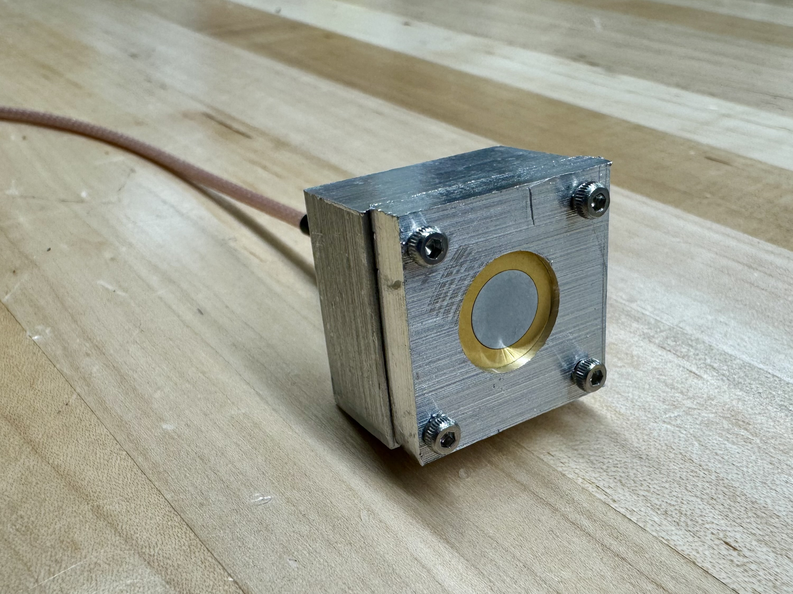
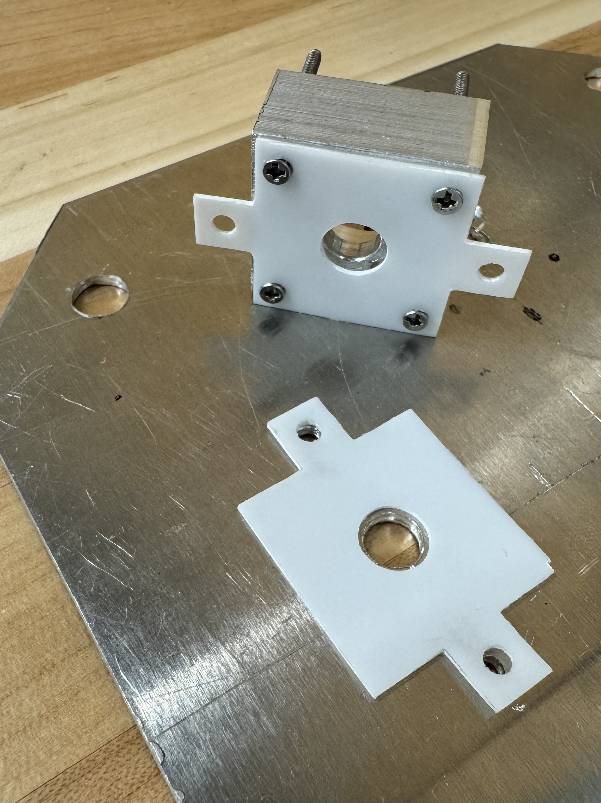
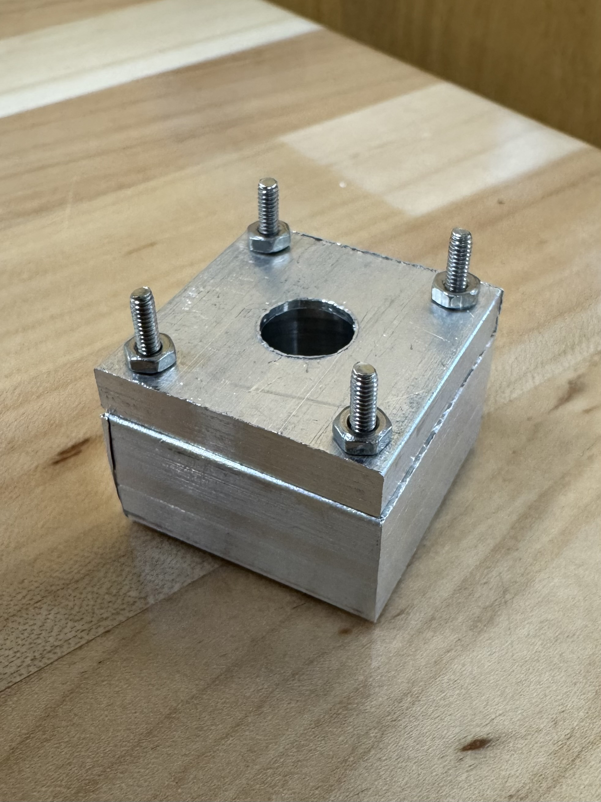

# QCM for RF Sputtering

<figure><figcaption></figcaption></figure>

## Preface

The Quartz Crystal Microbalance (QCM) project was designed for the RF sputtering chamber to measure thickness of deposition. This sensor utilizes the piezoelectric properties of quartz as explained by [nanoScience Instruments](https://www.nanoscience.com/techniques/quartz-crystal-microbalance/).

In this design the frequency is sent to a 6 MHz quartz crystal in an aluminum casing. The signal travels from the coaxial cable through the SMA connector to the wire fed through the spring to the electrode which the crystal disc sits on. The signal travels through the crystal then returns through the aluminum casing. The sensor head sits on the substrate plate near the center of the plate so that the crystal receives similar sputtering conditions to the substrate. The coaxial cable is fed into the chamber to the sensor head through one of the chamber’s KF16 flanges.&#x20;

One of the biggest challenges of this design was that the ground of the sensor head must be isolated from the ground of the chamber to avoid signal interference. This includes the substrate plate. To achieve this isolation, a layer of PTFE was placed between the substrate plate and the sensor head and fastened with PEEK screws.

The main components of this project are the sensor head, oscillator, and sensing software. As of now, a prototype of the sensor head has been fabricated and tested outside of the chamber using an existing oscillator and software. Even though the sensor has not yet been tested in the vacuum chamber, all materials are ultra high vacuum compatible. In the future, the goal is that the oscillator and software will also be built and the sensor head will not be reliant on existing systems.

## Concept Diagram

<figure><figcaption></figcaption></figure>

The oscillating signal travels from the coaxial cable through the SMA connector pin and the wire to the electrode. The aluminum base and lid serve as the ground. The signal returns through the casing. The target material adheres to the surface of the exposed quartz crystal disc causing a change in frequency of the signal.

## CAD Renderings



Note: The CAD rendering does not include the wire that connects the SMA connector pin to the electrode. See [#concept-diagram](qcm-for-rf-sputtering.md#concept-diagram "mention") for an example.

## Sensor Head Bill of Materials

Note: Not all materials listed are an exact match for those used in Version 1. Some materials were already available in the lab. Additionally, some of the materials used were not vacuum compatible due to zinc coatings so those materials have been substituted for vacuum compatible alternatives in the bill of materials.

## Future Work

* Design a Version 2 that eliminates the need for expensive silver epoxy.
* Complete more sensor head testing.
* Build the oscillator.
* Write the code to sense the change in frequency and calculate the change in thickness.
* Create a low-cost flange feedthrough into the chamber.

## Image Gallery

<figure><figcaption></figcaption></figure> <figure><figcaption></figcaption></figure> <figure><figcaption></figcaption></figure> <figure><figcaption></figcaption></figure>

## Documentation Document

[https://docs.google.com/document/d/15uXQ0jKiw-uUwXZg3vHdAT-oS-NZu3LUEBUPLZNrHng/edit?usp=sharing](https://docs.google.com/document/d/15uXQ0jKiw-uUwXZg3vHdAT-oS-NZu3LUEBUPLZNrHng/edit?usp=sharing)

## Contact

Hannah Chinn

Email: hchinn@andrew.cmu.edu

