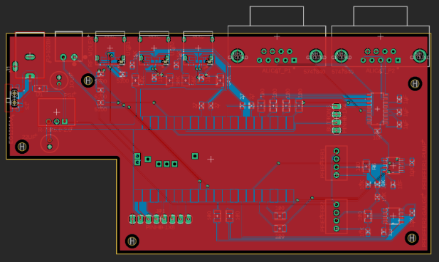
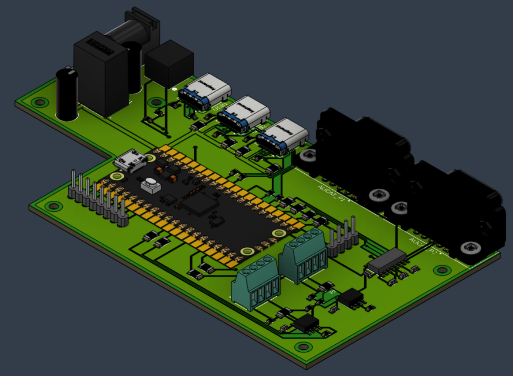

# Sputtering Automation Control System

This subsystem is a work in progress. Breadboard-level device communication and pressure-control concepts have been validated, but the final PCB, enclosure, GUI, and full sputtering run validation are not complete. The Sputtering Automation Control System (ACS) is a pressure-control subsystem for the Hacker Fab DIY RF sputtering chamber. Its purpose is to reduce the amount of manual tuning required during sputtering by coordinating chamber pressure readings, vacuum pump speed, and mass flow controller setpoints from one control platform.

This page focuses on the pressure-control portion of the sputtering tool. It does not replace the main sputtering chamber documentation. For the chamber build, operating principles, and broader process context, see the existing DIY RF sputtering chamber documentation.

### Purpose

Sputtering requires a controlled vacuum environment. The chamber must be evacuated to remove contaminants, but it cannot simply be pumped down as far as possible during deposition because sputtering also requires process gas to sustain plasma. The ACS is intended to automate this pressure balance by adjusting gas inflow through Alicat Mass Flow Controllers (MFC) and chamber evacuation through the Pfeiffer vacuum pump.

The current ACS scope is pressure automation. Future versions may support more complete sputtering recipes, including material-specific pressure targets, duration control, RF power coordination, safety interlocks, and thickness-based stop conditions.

### Operating Context

The sputtering process can be treated as four pressure-control phases:

| Phase              | Goal                                                                                | ACS relevance                                        |
| ------------------ | ----------------------------------------------------------------------------------- | ---------------------------------------------------- |
| Evacuation         | Pump down the chamber to remove contaminants and establish a low-pressure baseline. | Pump control and pressure monitoring.                |
| Striking           | Raise or stabilize pressure enough to ignite plasma.                                | MFC control and pressure feedback.                   |
| Sputtering         | Maintain a lower operating pressure for deposition.                                 | Closed-loop pressure regulation.                     |
| Venting / shutdown | Return the chamber to a safe end state after deposition.                            | MFC shutoff, pump state control, and fault handling. |

The target sputtering pressure range for this documentation is approximately **1-15 mTorr**. Pre-ignition pressures may be higher, around **100-200 mTorr**, depending on the process and plasma ignition requirements.

### Project History

An initial proof-of-concept for the ACS was developed in Spring 2025 to validate the pressure-control algorithms and hardware communication. This early iteration was built around an Arduino Uno, utilizing external RS232 and RS485 converter boards to interface with the Alicat MFC and Pfeiffer equipment.

The Spring 2025 work successfully demonstrated the core control theory:

* **Finite State Machine (FSM):** Handled chamber evacuation, plasma striking, active regulation, and shutdown states.
* **PI Control Loop:** Actively adjusted the MFC gas flow and vacuum pump speed to maintain specific pressure setpoints.
* **Data Visualization:** Used a custom Python script to plot desired versus measured pressure in real-time.

While this breadboard-level Arduino implementation proved that automated pressure regulation was possible, it highlighted significant hardware constraints. The Arduino Uno lacked the memory, processing power, and hardware UARTs required to safely run concurrent industrial communication protocols. Additionally, the wiring complexity of multiple converter boards made the system fragile. These limitations directly motivated the current phase of the project: transitioning to a custom Raspberry Pi Pico 2 (RP2350) integrated PCB.

### Current Status

The ACS should be treated as a WIP subsystem. The pressure-control concept and several device interfaces have been demonstrated, but the final integrated control station is not complete.

| Area                                | Current status                                                                  |
| ----------------------------------- | ------------------------------------------------------------------------------- |
| Pump communication                  | Validated in prior prototype and breadboard work.                               |
| Alicat MFC communication            | Validated in prior prototype and breadboard work.                               |
| Pressure gauge serial communication | Previously validated, but the MPT 200 RS485 path later failed.                  |
| Pressure regulation algorithm       | Demonstrated in the earlier Arduino FSM/PI implementation.                      |
| Pico 2 PCB                          | Designed and ordered, but not assembled or fully tested in the documented work. |
| Analog/relay gauge fallback         | Prototyped as an alternative to the failed MPT 200 RS485 path.                  |
| GUI                                 | Planned, but blocked by lower-level hardware and pressure-gauge issues.         |
| Enclosure                           | Conceptual only; final housing depends on validated electronics.                |

The biggest project pivot came from the pressure gauge failure. The original plan relied on serial RS485 communication with the Pfeiffer MPT 200 pressure gauge. When that path failed, the project shifted toward a fallback design using the gauge's analog output and relay outputs. Around the same time, PCB delivery and assembly delays prevented full validation of the redesigned board. As a result, later work focused less on claiming complete tool automation and more on documenting the hardware lessons, fallback strategy, and safer software architecture needed for the next iteration.

### Hardware Overview

The ACS connects the sputtering chamber's pressure-control hardware to a microcontroller-based control station.

#### Controlled Devices

| Device                                          | Role                                                                               |
| ----------------------------------------------- | ---------------------------------------------------------------------------------- |
| Pfeiffer HiPace 300 pump with TC 110 drive unit | Controls chamber evacuation and pump speed.                                        |
| Pfeiffer MPT 200 pressure gauge                 | Provides chamber pressure feedback.                                                |
| Alicat MFCs                                     | Regulate process gas flow. The design anticipates argon and future oxygen support. |

#### Controller Platform

Earlier work used an Arduino Uno with RS232/RS485 converter boards, a finite state machine, and a PI pressure-control loop. The updated design moves to a **Raspberry Pi Pico 2 / RP2350** because the Arduino Uno is limited in RAM, flash, serial interfaces, and expansion capacity.

The redesigned Pico 2 PCB includes:

* RS232 support for Alicat MFC communication through MAX3232 transceivers.
* RS485 support for Pfeiffer pump and gauge communication through MAX3485 transceivers.
* USB-C host/uplink interfaces.
* 24 V DC input power with onboard 5 V regulation.
* A 2-inch Waveshare SPI display.
* Physical switches for local control or safety behavior.
* A Molex I2C interface for possible integration with related sputtering subsystems.

The PCB is a two-layer board with approximate dimensions of **7 x 13 cm**. The bottom layer is used as a ground plane to help reduce noise in the RF-heavy sputtering environment, and the I/O layout is arranged to simplify cable routing.

<figure><figcaption></figcaption></figure>

<figure><figcaption></figcaption></figure>

### Electrical Interfaces

The table below summarizes the intended external interfaces. Treat this as a documentation-level overview until the final pin mappings are verified against `PicoDefinitions.h` in the current codebase.

| Device                            | Connector         | Protocol / signal               | Power note                             | Important wiring note                                                                            |
| --------------------------------- | ----------------- | ------------------------------- | -------------------------------------- | ------------------------------------------------------------------------------------------------ |
| Alicat MFC                        | DB9               | RS232                           | Device-powered or setup-dependent      | Use a straight-through cable pinout instead of relying on the custom cable used in earlier work. |
| Pfeiffer MPT 200 gauge            | M12               | RS485, or analog/relay fallback | Requires 24 V                          | RS485 failure means the analog/relay fallback may be required.                                   |
| Pfeiffer HiPace 300 / TC 110 pump | M12               | RS485                           | Pump has its own power                 | The control board mainly needs the communication lines.                                          |
| Host computer                     | USB-C             | USB serial / host link          | Board-powered through ACS power system | Intended for monitoring, flashing, and future host-side control.                                 |
| Local display                     | Board-mounted SPI | SPI                             | Powered by board logic rail            | Used for local status display in the updated design.                                             |

Important implementation lessons from breadboard testing:

* The Pfeiffer MPT 200 gauge requires **24 V**, not 15 V.
* RS485 A/B lines require **10 kOhm pull-up/down biasing**.
* RS485 termination used **120 Ohm** resistors across the differential pair.
* MAX3485 receive/transmit enable pins can be tied together so one GPIO controls RS485 direction.
* The Alicat DB9 pinout should support a standard straight-through cable.

### Pressure Gauge Fallback

The Pfeiffer MPT 200 pressure gauge's primary RS485 path failed during development. To avoid depending entirely on the dead serial interface, a fallback path was prototyped using the MPT 200's secondary outputs.

The fallback uses two gauge interfaces:

| MPT 200 output  | Purpose                                                                          |
| --------------- | -------------------------------------------------------------------------------- |
| Analog output   | Continuous 0-10 V pressure signal, logarithmically scaled with chamber pressure. |
| Precision Gauge | The addition of a 2nd gague tunded to our operating range.                       |

The Pico 2 ADC is a 3.3 V input. The MPT 200 analog output can reach 10 V, so it must not be connected directly to the Pico. The prototyped fallback uses signal conditioning to attenuate, buffer, and clamp the pressure signal before it reaches the ADC.

#### Analog Conditioning Path

| Component | Value / part                              | Function                                               |
| --------- | ----------------------------------------- | ------------------------------------------------------ |
| R1        | 22 kOhm                                   | Series attenuation resistor.                           |
| R2        | 10 kOhm                                   | Shunt resistor to ground.                              |
| Op amp    | MCP6002 or equivalent rail-to-rail op amp | Unity-gain buffer.                                     |
| Clamp     | 3.3 V Zener diode                         | Transient and overvoltage protection at the ADC input. |
| ADC input | Example: GP26                             | Reads conditioned pressure signal.                     |

The divider scales the gauge output before buffering:

```
V_buffer = V_MPT * (R2 / (R1 + R2))
```

Powering the op amp from the Pico's 3.3 V rail also helps keep the output within the ADC's safe range. The Zener clamp provides an additional protection layer for transients.

#### Relay Isolation Path

The relay fallback should be isolated from the Pico GPIO using an optocoupler. The documented prototype uses an optocoupler such as a PC817 or LTV-817, an LED-side resistor, and a hardware pull-up on the Pico side.

| Component    | Value / part                  | Function                                                     |
| ------------ | ----------------------------- | ------------------------------------------------------------ |
| Optocoupler  | PC817 / LTV-817 or equivalent | Galvanic isolation between gauge relay domain and Pico GPIO. |
| LED resistor | About 330 Ohm for 3.3 V drive | Limits optocoupler LED current.                              |
| GPIO pull-up | 10 kOhm                       | Provides a defined Pico-side logic state.                    |
| GPIO input   | Example: GP15                 | Reads isolated relay state.                                  |

### Control Logic and Software Architecture

The ACS software history has two main layers: the earlier Arduino pressure-control implementation and the newer Pico 2 / SputterOS direction.

#### Earlier Arduino Baseline

The earlier implementation used an Arduino Uno to coordinate device communication and pressure control. The software included:

* A finite state machine for setup, evacuation, active regulation, and shutdown behavior.
* RS232 communication with the Alicat MFC.
* RS485 communication with the Pfeiffer pump and pressure gauge.
* A PI controller that adjusted MFC flow and pump behavior to reach a user-specified pressure target.
* A Python visualizer that plotted desired pressure against measured pressure during testing.

The prior Hacker Fab controls repository is here:&#x20;

https://github.com/hacker-fab/Sputtering-Controls

#### Pico 2 Direction

The updated design targets the Raspberry Pi Pico 2 / RP2350. The documented architecture splits responsibility between hardware communication and higher-level control logic:

| Software layer            | Intended role                                                          |
| ------------------------- | ---------------------------------------------------------------------- |
| Core 0 hardware layer     | Device communication, peripheral updates, and low-level orchestration. |
| Core 1 control layer      | Higher-level sputtering control through a manager class.               |
| Shared intercore data     | Pressure readings, pump speed, MFC flows, setpoints, and enable flags. |
| Atomic status register    | Fault and exit conditions visible across cores.                        |
| UART abstraction          | Hardware UART and PIO UART implementations.                            |
| Serial device abstraction | RS232 and RS485 framing, buffering, and direction control.             |
| Device libraries          | Alicat and Pfeiffer command formatting/parsing.                        |

The current project codebase is useful as a WIP artifact, but it should not be treated as a polished build-ready software release:

https://github.com/BlastermanR/CMU\_HackerFab\_Sputtering\_Control

#### SputterOS Direction

Future software work is expected to align the ACS with SputterOS, a C++17 framework for safer and more reusable vacuum/control systems. SputterOS is intended to support hardware-free testing, fixed-memory design, built-in safety checks, multicore synchronization, and reusable control-system structure.

SputterOS repository:

https://github.com/BlastermanR/SputterOS

The ACS page should present SputterOS as the intended software direction, not as a completed ACS port unless later validation confirms that status.

### Testing and Validation

The most complete pressure-control validation came from the earlier Arduino-based implementation. That work demonstrated:

* Automated evacuation from atmospheric pressure to below **10^-5 hPa** in about **2-3 minutes**.
* A PI loop that reached and maintained pressure setpoints with minimal oscillation.
* Reported regulation accuracy within **1%** for pressure magnitudes of **10^-2**, **10^-3**, and **10^-4 hPa**.
* Reported regulation accuracy within **5%** for pressures in the **10^-5 hPa** range.

The later Pico 2 work validated important hardware lessons at the breadboard/design level, including gauge power requirements, RS485 biasing, RS485 direction-control simplification, and Alicat cable requirements.

No significant full-system testing was completed after the pressure gauge issue and PCB delivery delays. The final PCB was not fully assembled and validated in the documented work, and the GUI and enclosure remained blocked by unresolved lower-level hardware decisions. Because of that, the current page should describe the ACS as a validated concept and WIP implementation, not as a finished sputtering automation product.

### Component List

The production PCB BOM should be summarized as a component list rather than copied as a full purchasing spreadsheet. The list below captures the main component categories used in the documented production PCB design.

| Component / category                                      | Purpose                                               |
| --------------------------------------------------------- | ----------------------------------------------------- |
| Raspberry Pi Pico 2                                       | Main controller.                                      |
| MAX3485CSA+ RS485 transceivers                            | Pfeiffer pump/gauge serial communication.             |
| MAX3232ESE+ RS232 transceivers                            | Alicat MFC serial communication.                      |
| 24 AWG 4-conductor cable                                  | M12 / RS485 wiring.                                   |
| M12 4-pin connectors                                      | Industrial connections for Pfeiffer devices.          |
| DB9 ports and straight-through DB9 cables                 | Alicat MFC communication.                             |
| USB-C ports                                               | Host/uplink and external USB interfaces.              |
| 24 V power supply                                         | Main ACS input power.                                 |
| 5 V regulator                                             | Logic and peripheral power rail.                      |
| 2-inch Waveshare SPI display                              | Local status display.                                 |
| Physical switches                                         | Local control, shutoff, or safety behavior.           |
| 10 kOhm, 15 kOhm, 27 Ohm, 56 kOhm, and 5.1 kOhm resistors | RS485 biasing, USB support, and supporting circuitry. |
| Capacitors                                                | Power regulation and transceiver support.             |
| Diodes                                                    | Reverse-current and transient protection.             |
| Molex connectors / terminal blocks                        | Internal wiring and subsystem integration.            |

### Project Artifacts

| Artifact                                  | Link / note                                                                      |
| ----------------------------------------- | -------------------------------------------------------------------------------- |
| Existing sputtering chamber documentation | https://docs.hackerfab.org/home/fab-toolkit/deposition/diy-rf-sputtering-chamber |
| Earlier Hacker Fab controls repository    | https://github.com/hacker-fab/Sputtering-Controls                                |
| Current ACS project repository            | https://github.com/BlastermanR/CMU\_HackerFab\_Sputtering\_Control               |
| SputterOS repository                      | https://github.com/BlastermanR/SputterOS                                         |

### Continuing Work

Future work should focus on resolving the pressure-gauge path before treating the ACS as an integrated control station.

Recommended next steps:

1. Decide the final pressure gauge strategy: repair/replace the MPT 200 serial path, use a different gauge, add separate gauges for different pressure ranges, or commit to the analog/relay fallback.
2. Update the PCB schematic and layout to match the selected gauge strategy.
3. Assemble and electrically validate the PCB or redesign it to match updated hardware (Encourage modularity)
4. Validate each device interface independently: Alicat MFC, pump, gauge or fallback circuit, display, switches, and USB interfaces.
5. Verify final pin mappings against `PicoDefinitions.h` and update the public wiring table.
6. Port or align the ACS software with SputterOS.
7. Add explicit safety behavior for every machine state, including abort behavior, MFC zeroing, pump shutdown or standby behavior, and fault reporting.
8. Run hardware-free/unit tests where possible before tool integration.
9. Run controlled chamber tests for evacuation, setpoint approach, pressure hold, and shutdown.
10. Design and build the enclosure only after the electrical and control paths are validated.
11. Add GUI or host-side monitoring after the core embedded control path is reliable.

    <div data-gb-custom-block data-tag="hint" data-style="info" class="hint hint-info"><p>This page should be updated as soon as the gauge strategy, PCB validation, and software port status are resolved. Until then, it should remain in the WIP section.</p></div>





