# Build Instructions

## Top and Bottom Plates

.png>) 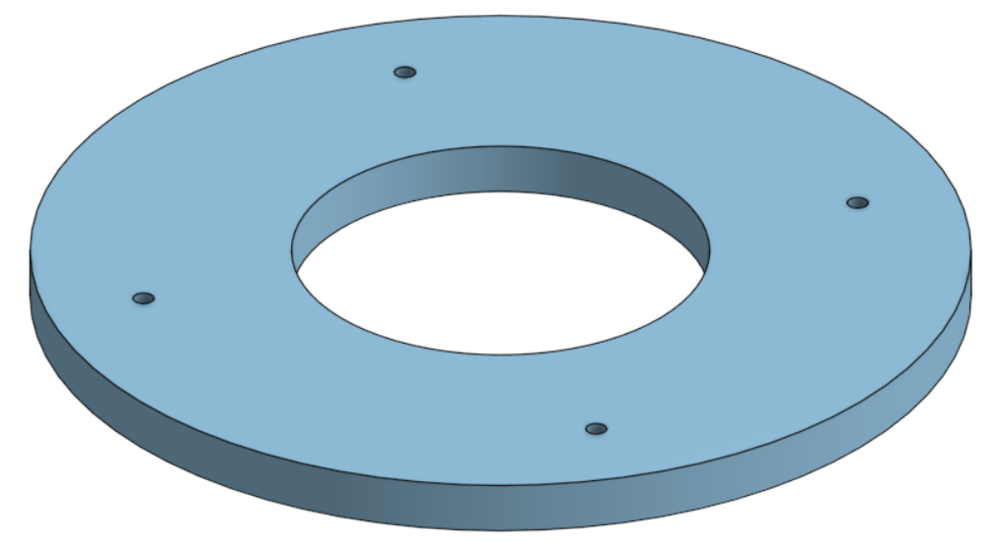

Both the top and bottom plates are fabricated from the 9” diameter, ½” thick Al disks. Both are most easily machined with CNC, however can be machined with just a drill press if CNC is not available. In the case you use the drill press, use a 3D printer to create a 2D template of each face of the top and bottom plates which can then be securely placed on the top/bottom plates for precise placement of both blind and through holes. Additionally, if a CNC is not available, hole saws will have to be used with the drill press to create the wide opening in the middle of both plates. In the case of the bottom plate, the hole does not have to be as large as specified in the CAD for the system to operate effectively. The opening was made large simply to ensure efficient pump downs.

The top middle opening of the top plate (where the magnetron will eventually go) is set to have 2.55” diameter in the CAD. The alumina Washer (2.5” Diameter) (which surrounds the magnetron inside the chamber) is meant to slide into that hole. That alumina washer from McMaster can deviate from the 2.5” spec. The one we ordered ended up being \~2.55” in diameter. So you must order the Alumina washer first, and measure its diameter before machining the top plate. This ensures the top plate magnetron hole has enough clearance for the alumina washers to fit. In our case, we machined the top plate before realizing the need for the alumina washers in the final design. So the Alumina washer had to be carefully shaven down on the outer perimeter (using the diam grit hole saw mentioned later). This was extremely difficult and should be avoided.

> **Important:** Order the alumina washer first and measure its diameter before machining the top plate.

The CAD designates the correct hole diameter and depth for each blind hole which will need to have threads tapped. The intended thread size for each blind hole are labeled below. In the CMU build, all threads were hand tapped.

.png>) 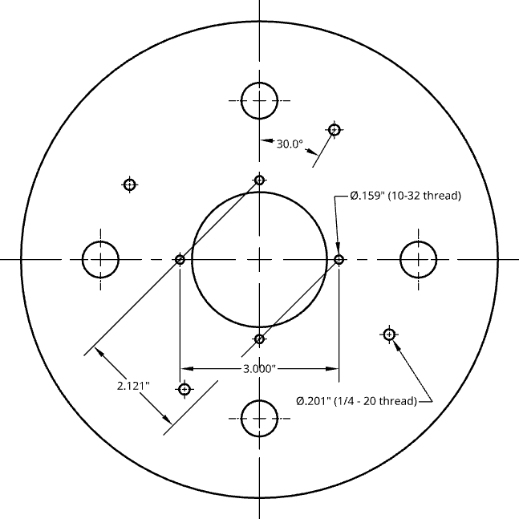

.png>) .png>)

As shipped, the disks from McMaster have a corrugated surface which is not suitable as sealing surfaces. A local metal supplier can probably provide you these disks with a smoother surface, and maybe even polish them for you. If you end up with the poor quality surfaces like we did at CMU, you will need to smooth and planarize them. We did this by putting them on a lathe to shave off a new surface. This surface was directly used as an effective UHV sealing surface with a viton gasket. Note that we only did this for the sides sealing to the chamber pyrex cylinder, whereas the other side was polished with the hand drill polishing kit. The hand drill polishing kit was used wet to sand the sealing surfaces at each KF16 bulk head port, and sand the magnetron hole where the magnetron gasket will go. Remember, you only actually need to smooth out the areas where an o-ring or gasket will sit, not the entire surface. We stopped at 1000 grit sandpaper (should build up from \~400 grit), as seen below. Although you can still see sanding lines, this surface was able to hold an effective UHV seal.

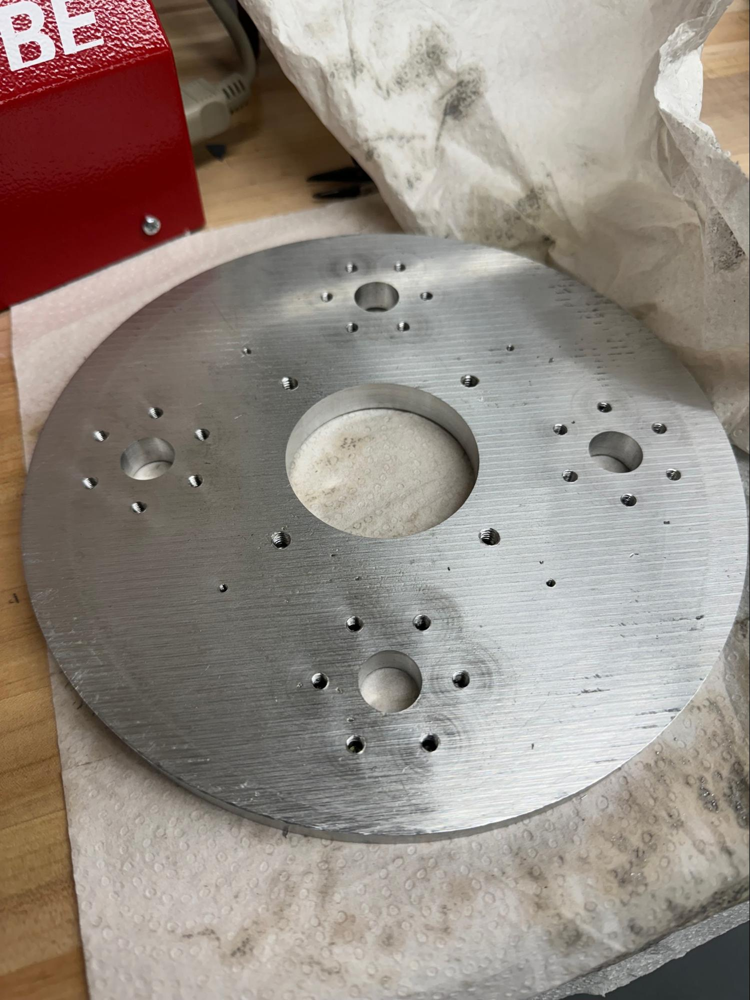 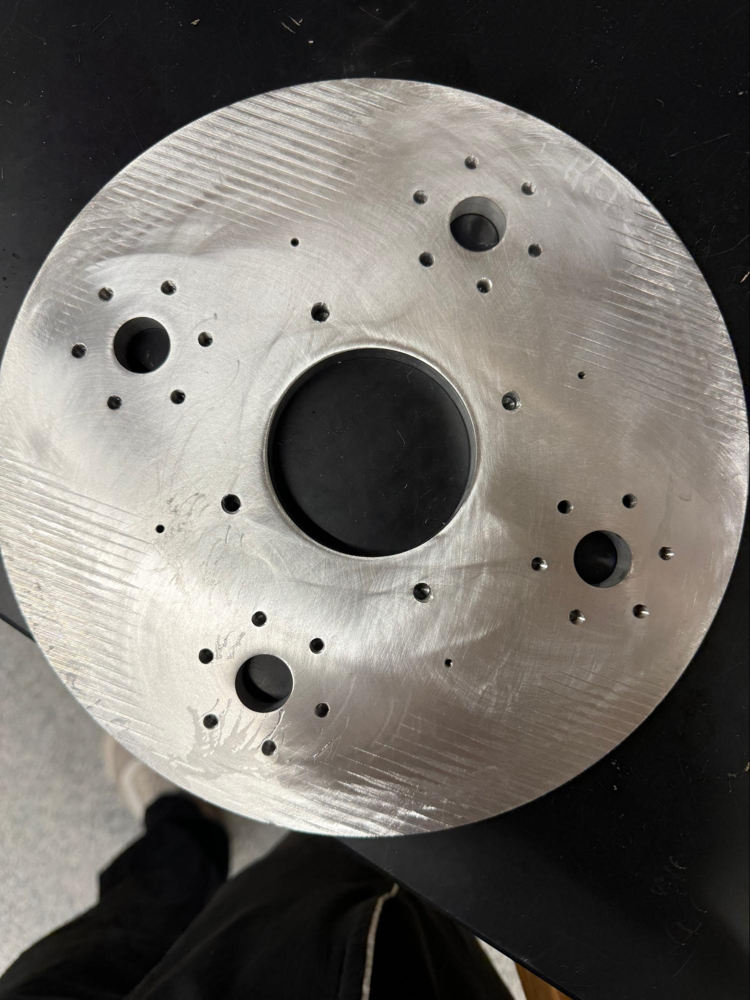

After all the machining and sanding, these plates will be covered in debris and machine oil. Thoroughly scrub all this off (inclining inside the holes on the UHV side of each plate) with acetone as a solvent (please do in a fume hood). Then rinse it with an IPA. The IPA removes residue left behind from the acetone. Blow dry or wipe down with particle free clean room wipes for best cleanliness. Any left behind debris or oils may prevent the system from reaching UHV levels.

## Magnetron

.png>)

The “magnetron” consists of the top copper heat sink, the steel plate/polepiece, the viton gasket, the aluminum backing plate/outer magnet holder, the target + center magnet assembly, and the alumina washers.

### Pole Piece

.png>)

The pole piece is made from a 3x3” 1/16” thick plate of mild steel and the function is three fold. First, it creates a barrier between atmosphere and the UHV environment inside the chamber. For that reason, the bottom of the pole piece needs to serve as a sealing surface, and needs to be polished. Second, it holds up the target (the target has the center magnet bonded to it) due to magnet force, creating a “mag lock” mechanism for swapping targets or the outer magnet holder. Thirdly, it concentrates the magnetic field produced by the permanent magnets for a strong uniform field at the target surface.

The pole piece will have 4 through holes drilled at the corners with the dimensions below.

.png>)

After drilling the holes, one side of the pole piece will need to be polished so that it can make a good seal with the Viton gasket. Note that the polished steel will quickly rust if not promptly cleaned and dried (depending on climate, this was march in Pittsburgh). In this case the sealing side was polished to near mirror like state with this kit, however as mentioned earlier, this seems to be overkill for a UHV seal with Viton gasket, and stopping at 1000 grit paper should be sufficient.

.jpg>) 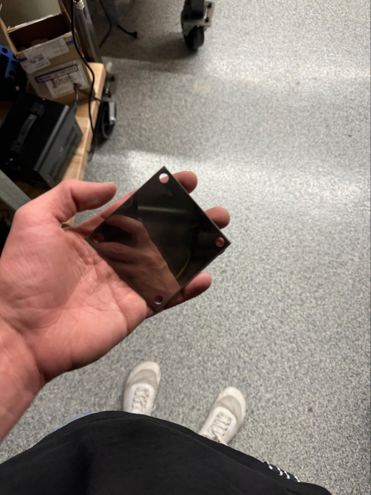

### Gasket

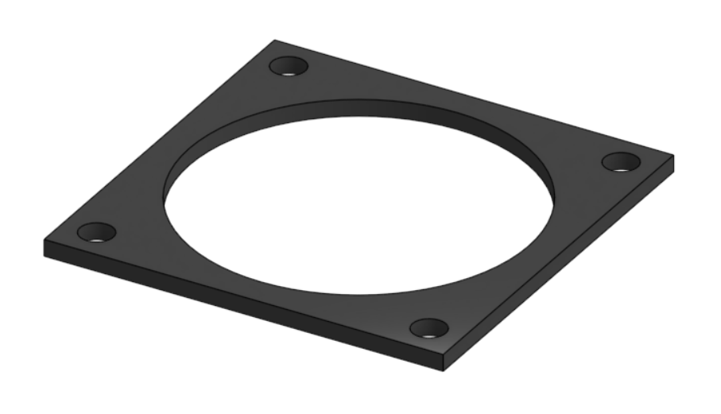

The gasket forms the seal between the pole piece and the top plate. It is compressed with 4 ¼-20 PEEK screws at the corners. It is very important that PEEK screws (a type of polymer) are used to prevent shorting the pole piece to the top plate. The pole piece is electrically part of the cathode, and the top plate is to be grounded. The gasket is cut from a ⅛” thick sheet of Viton with the dimension below to match the pole piece and top plate. Do not laser cut the Viton! It technically would work, but releases toxic and corrosive HF gas which would definitely damage the laser cutter and potentially kill you. We cut ours with an Xacto knife for the outer edges and center hole. For the 4 corner holes we found of a ¼” hole punch.

.png>) 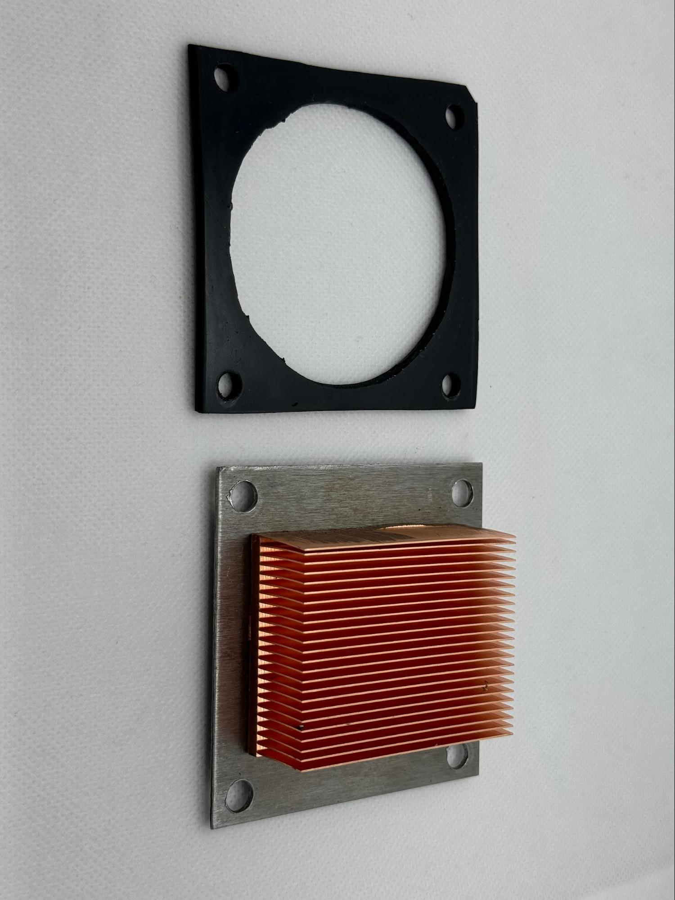

### Outer Magnet Holder/Backing Plate

.png>)

The backing plate is meant to define the outer magnet arrangement, as well as providing a backing for the target which provides an electrical connection and a heat transfer pathway. We did not do anything to enhance the interface between target and backing plate like smoothing out the backing plate for better contact. We have not had any obvious issue with overheating after extensive deposition testing with 2” Al target and 100W RF.

The backing plate is machine from a 2” diameter ⅛” thick Al disk. With the dimensions below.

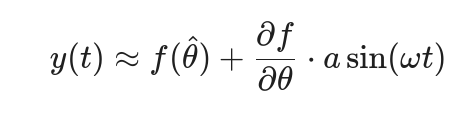 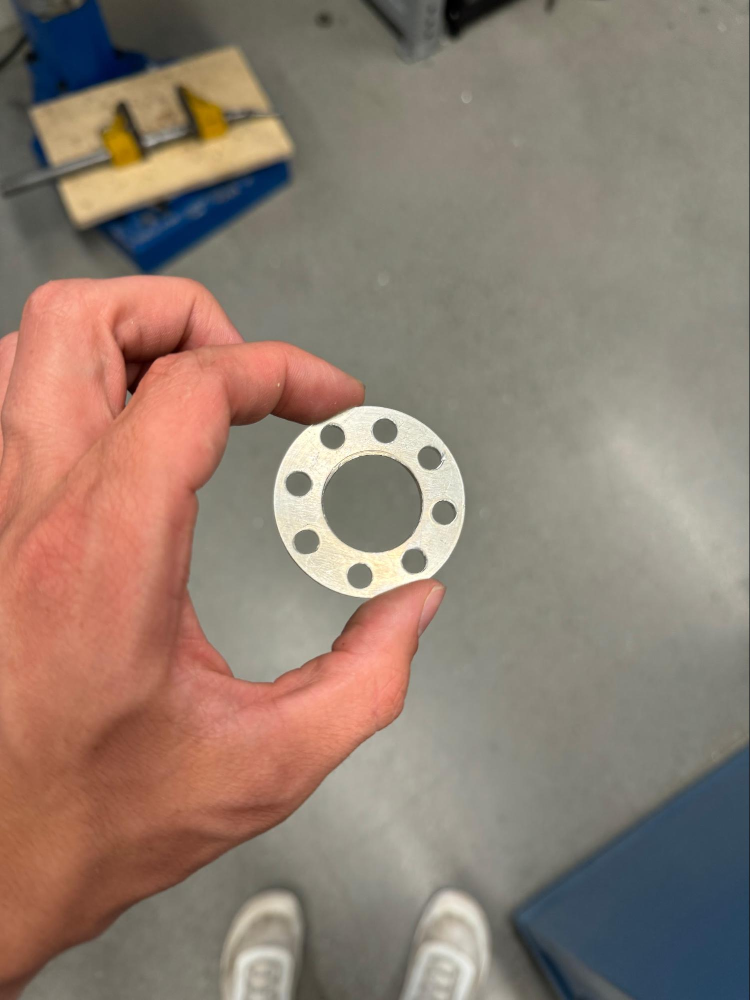

The ¼” diameter ⅛” thick N42SH magnets are then permanently press fit into the outer holes. For alternate magnet arrangements a new backing plate should be made (for biasing towards balanced unbalanced magnetic flux). It is extremely important that all magnets are press fit with the same polarity ,for example all with N acing up. We press fit ours with a simple vice. Note, the vice teeth can easily dent the Aluminum, so sandwich the backing plate in between two flat plates when press fitting to avoid damage.

.jpg>)

### Target + center magnet

.png>)

The target (in our case high purity Al 2” wide ⅛” thick) needs to be bonded to the 1” diameter ⅛” thick N52SH center magnet. It is critical that the center magnet’s polarity is oriented to be opposite to the outer magnets’ polarity. This is what creates the donut shaped electric field at the target surface. This allows the target to be easily snapped in and out of the magnetron assembly due the magnetic force between the center magnet and pole piece. If you have multiple targets to run, bond a center magnet to each target for easy swapping. We bonded ours with low outgassing silver epoxy because we already had it and knew it would be good for electrical and thermal conductivity. However, that epoxy is expensive, so something like Hysol 1C (which is also low outgassing) could probably be substituted, since the target will still make electric contact to the rest of the magnetron/cathode through the backing plate. Remember that this whole assembly will get very hot, so epoxies could fail. In our build, the silver epoxy has never failed even after extensive testing.

.jpg>)

### Alumina Space Fillers / Washers

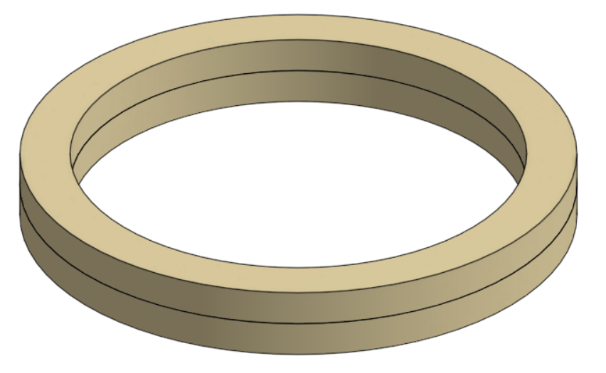

The alumina space fillers are present to confine where plasma forms, and prevent deposition of metals onto the edge of the viton gasket. This is discussed more elsewhere, but without the alumina, slow lateral deposition of the metallic target onto the edge of the gasket can create a conductive path between the polepiece and top plate, creating a fuse that burns up and burns the gasket releasing toxic compounds. The alumina washers have effectively prevented this even after extensive testing.

The washers could be made from other materials and with other methods, but the sintered alumina is low outgassing, does not introduce contaminants, is tough to plasma exposure, and inexpensive. If you go with machinable ceramic (usually porous alumina) beware that the porosity may trap contaminants.

In terms of machining, the alumina washers just need to have their inner diameter expanded. The sintered alumina is really hard, so this can only be done with a diamond grit hole saw attached to the drill press. Make sure you're well centered, use a lot of clamps (preferably pad them so as not to fracture the washer). Definitely spray water on it as you cut, be patient and go slow. We cracked 1 of 2 during our attempts.

.jpg>) 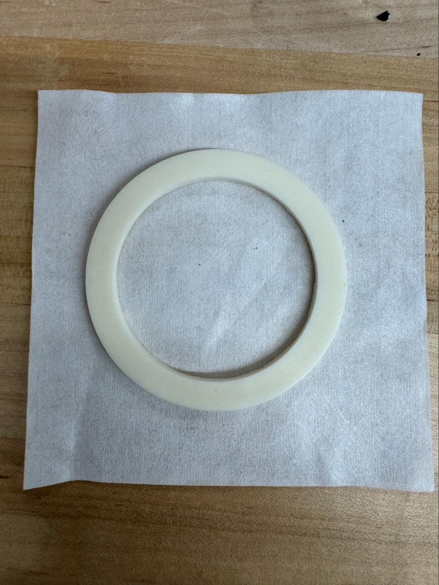

In the final assembly two of the washers are stacked. We held them together and to the pole with a few tiny pieces of double sided polyimide tape. At the time, this design was experimental so we anticipated disassembly which is why the polyimide tape was used. However, it worked, so we never took it apart, and the tape has never failed. Hysol 1C would be a fine alternative to the tape.

## Dark Space Shield

.png>)

The dark space shield was designed and built when the greater design of the chamber/magetron was still unverified. For that reason, it is not optimal, and is the best candidate for an improved design. A better dark space shield could be designed and fabricated in one single piece, however, it would likely require more complex machining which was purposefully avoided for this design.

The dark space shield is meant to control plasma formation by setting the dark space gap, i.e. the distance between the target surface and ground. Ours is made from .032” thick Al sheet, and a couple extra large washers.

The bottom sheet is cut and drilled to the dimensions below.

.png>)

The washers are simply stacked, and can be added/removed to tune the dark space gap. While experimenting with this design, we just held the washers to the bottom with two pieces of polyimide tape. That worked so we never changed it, however a little Hysol 1C may be better.

## Cooling Box

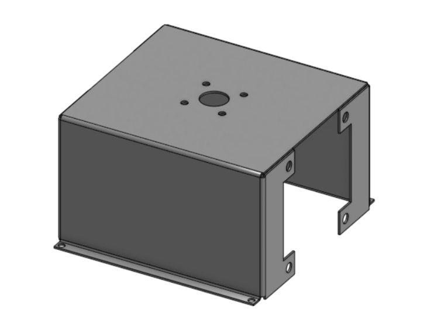 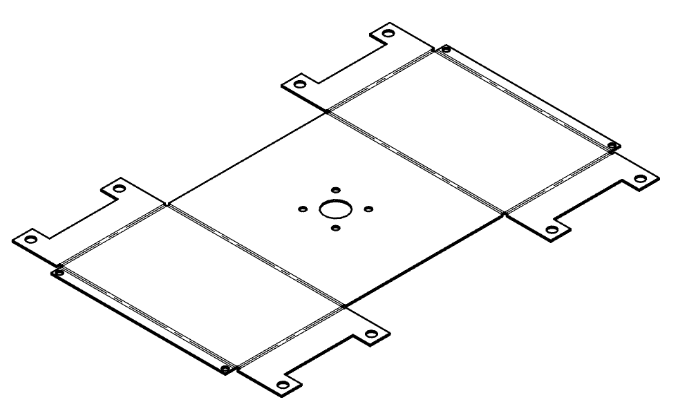

The purpose of the cooling box is first to facilitate electrical connection from the power supply to the chamber. More specifically this is where ground (outer conductor on the UHF cables) connects to the top plate, and the inner conductor connects to the magnetron/cathode. Secondly, the box sets up a PC fan powered wind tunnel for cooling the magnetron. Lastly, the box creates a shield around the magnetron to make sure no one can touch it and electrocute themselves (deadly if working with DC sputtering) as well as shielding signal transmission from the RF power source.

The box is folded out of .032” thick Al sheet to the dimensions below. We cut our lines with a dremel (band saw or tin snips would probably work) and bent the sheet with a dedicated sheet metal bender. However, the Al is so thin and malleable that this could be done in a vice with some stiff plates.

.png>)

Holes were made with a drill press. Make sure to clamp as near to the hole as possible since drill bits like to grab onto thin sheet and yank it upwards.

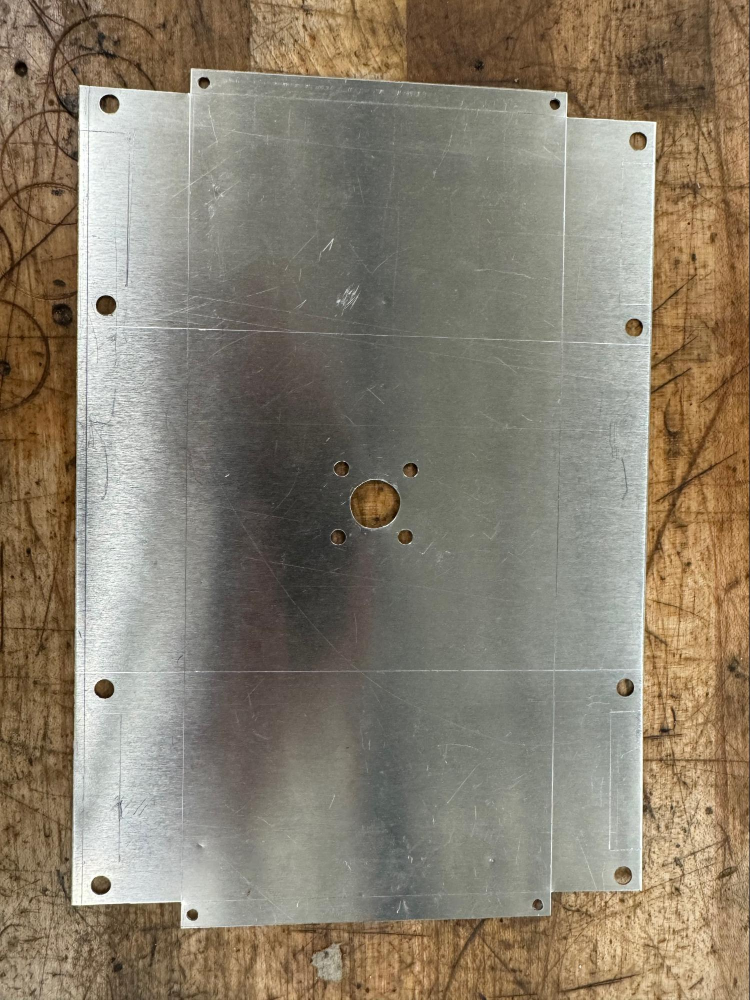 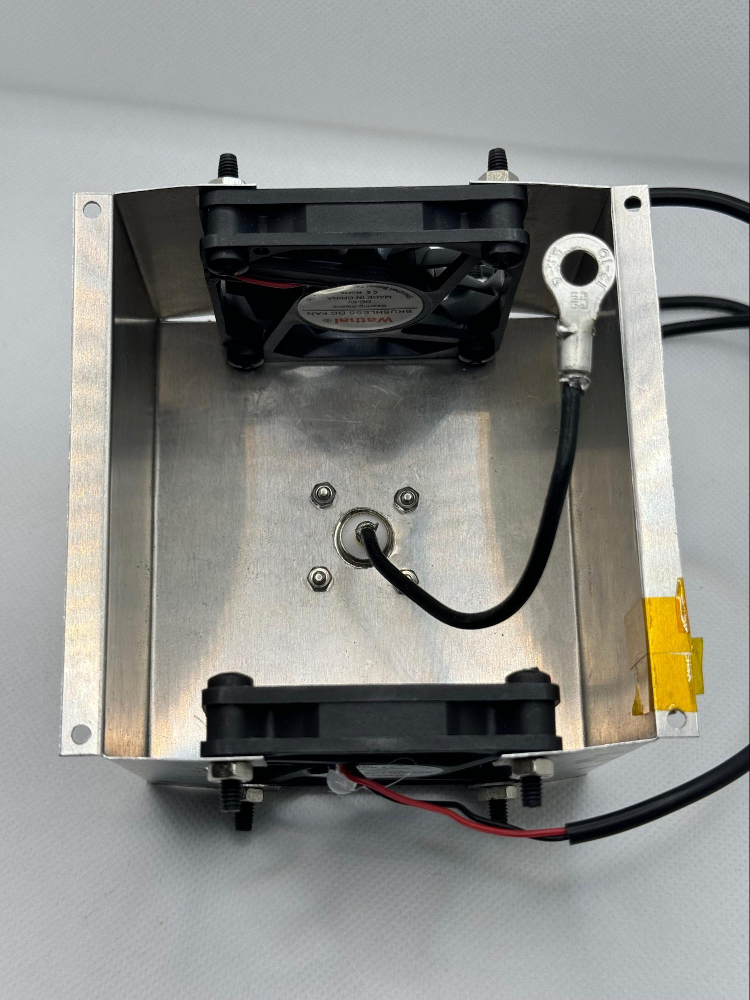

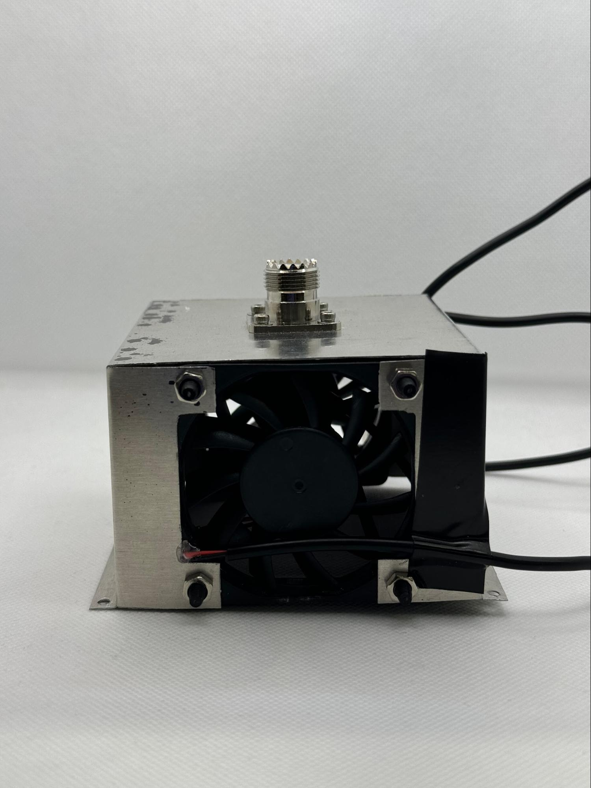 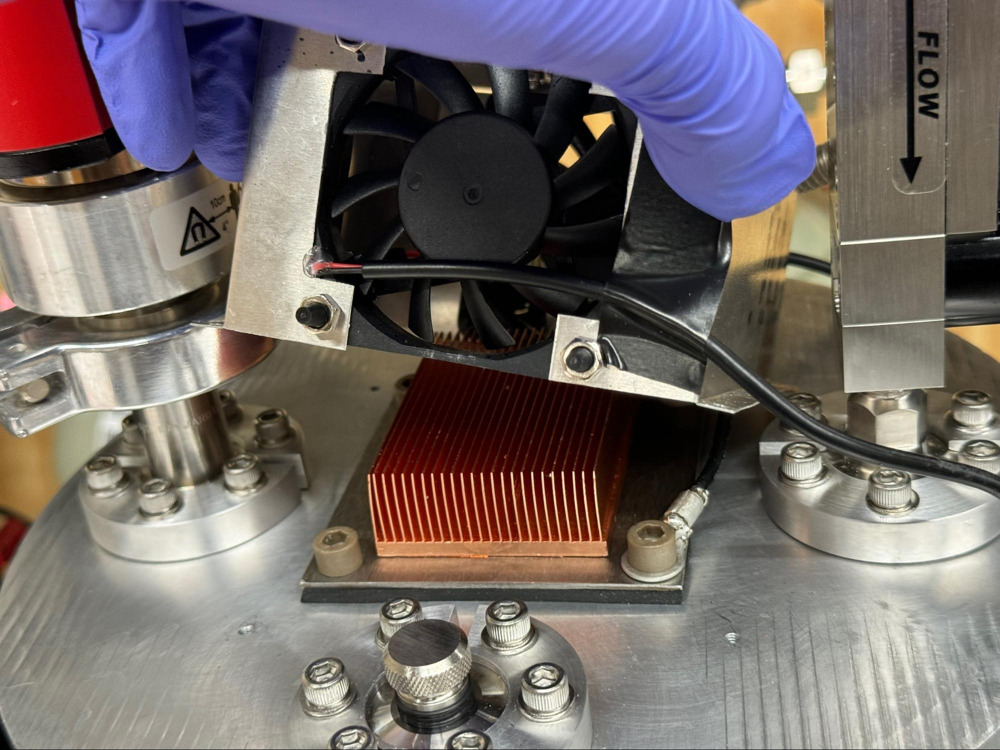

As seen above, the two small PC fans are mounted onto the inner face of each opening on the box. Make sure the fans are oriented such that they both blow in the same direction. The nylon screws must be used for mounting the fans. This is because the fans and screws but up right against the pole piece, so metallic screws would short the magnetron to ground. The reality is that the fans with screwheads coming out are a little too wide, so the box has to flex a little to get mounted onto the top plate. Also seen above is a one sided UHF part mounted on the top. That is where the power comes in. 12 Gauge copper wire is soldered to that terminal, and then the other side is soldered to a washer shaped power connector which is placed under one of the PEEK screws. This connects the UHF inner conductor to the magnetron/cathode.

## Shutter Assembly

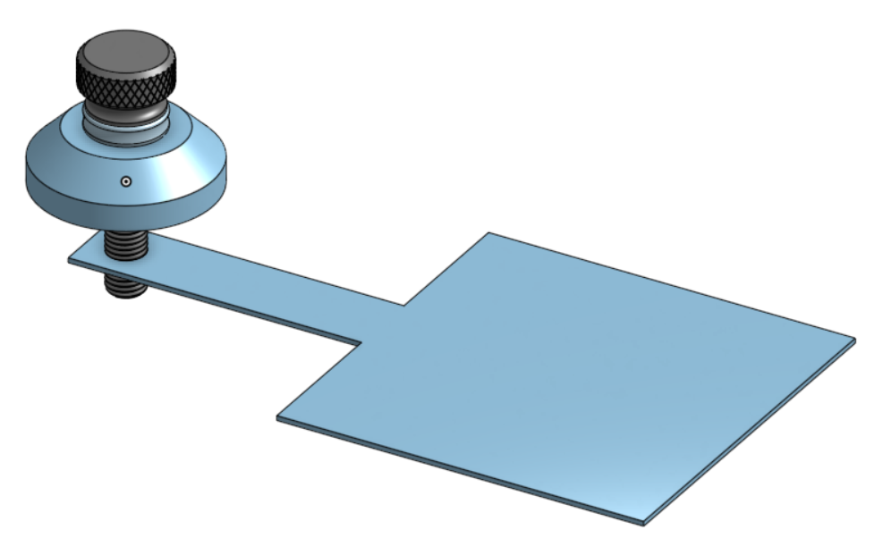

The shutter is a very simple inexpensive way to have a mechanical feedthrough that retains a UHV seal. The idea came to us when playing with the vent screw on a separate vacuum chamber, and realized the screw could turn at least 90 degrees, and be well sealed at both ends of that 90 degree range. So, we figured you could just extend a vent screw and put a flap on it as a shutter to block deposition from the target during the critical target plasma cleaning step.

The assembly consists of a 14/-28 threaded thumb screw (finer threads allow greater angle range without decompressing the o-ring), a viton o ring, an Al flap cut form 032” thick sheet, and a KF16 end cap with ¼-28 threads machined into the center. The flap is cut to the dimensions below.

.png>)

In the final assembly, the flap is fastened on last with nuts sandwiching it to the thumb screw shaft. Ideally you tighten the thumb screw all the way before setting the shutter position, to allow for a reasonable range of movement to allow for a fully covered and fully uncovered shutter position. The thumb screw is clamped onto 1 of the 4 available bulkhead ports. The shutter has been shown to provide a high quality UHV seal in both the covered and uncovered position.

## Stand For Top Plate

We 3D printed a stand for our top plate assembly to sit on while we work on the chamber and load/unload chips. The CAD for it is here.. I would widen out the holes and make the uprights shorter if I were redoing it.

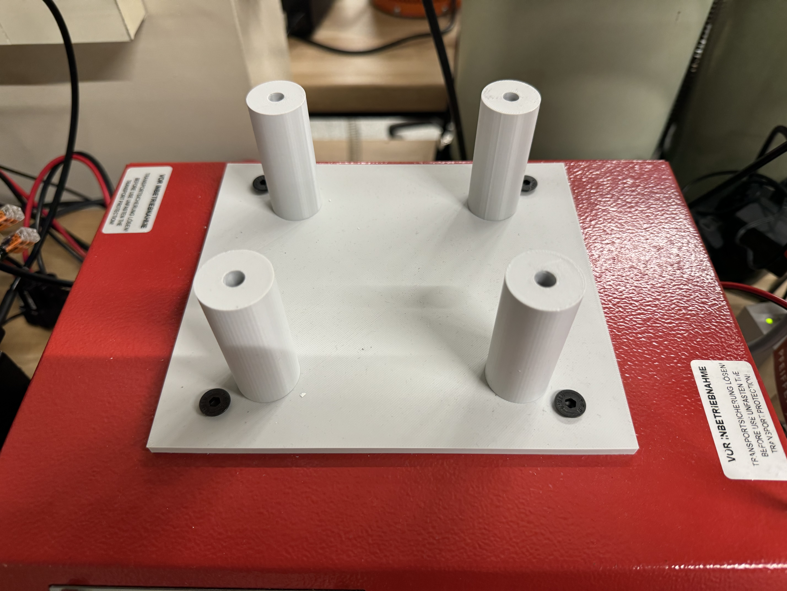

## Final Assembly

The OnShape CAD should visually describe the assembly, but it does not include the layout of the KF16 bulk head connections. Below are a few reference images of the layout at CMU.

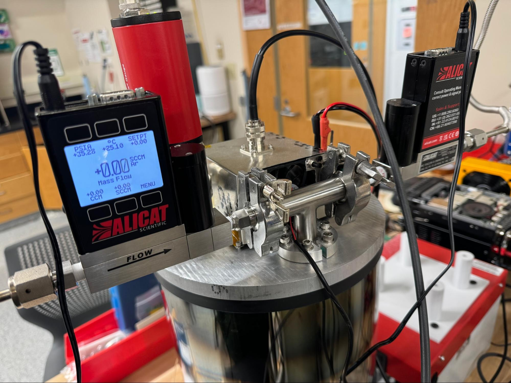 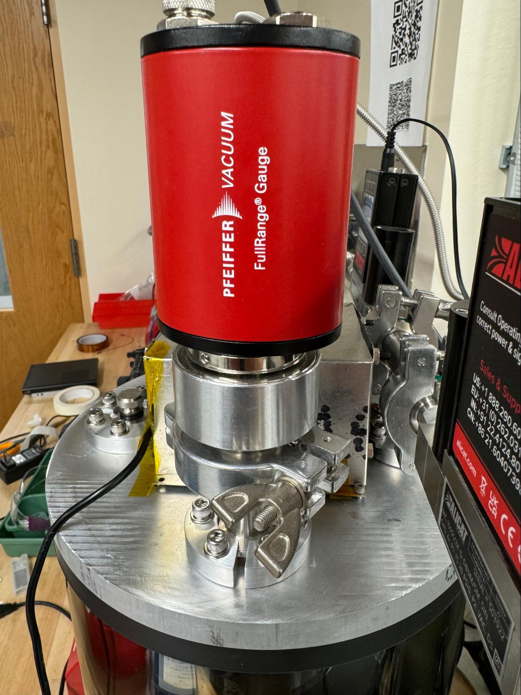 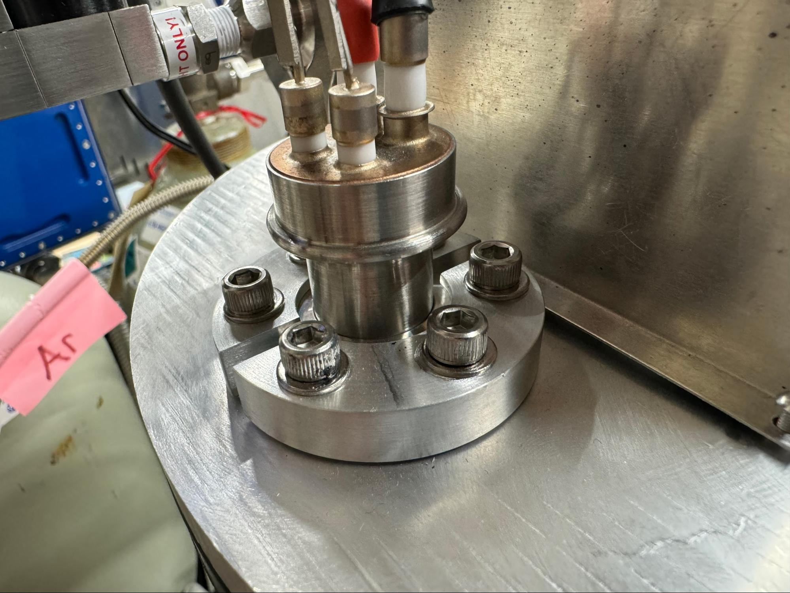 .jpg>)
