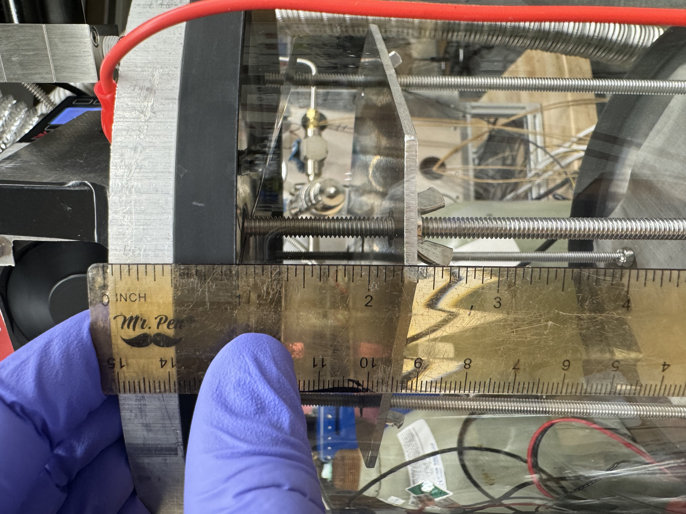
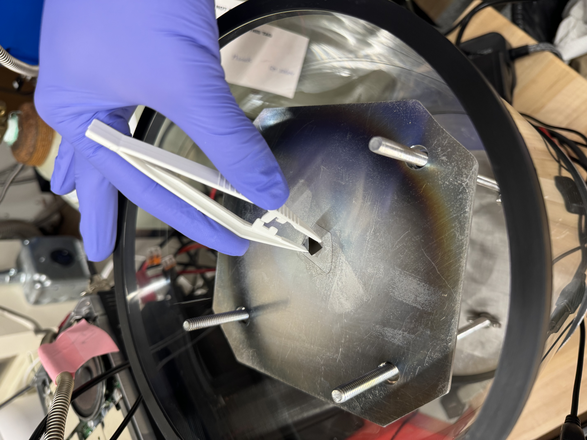
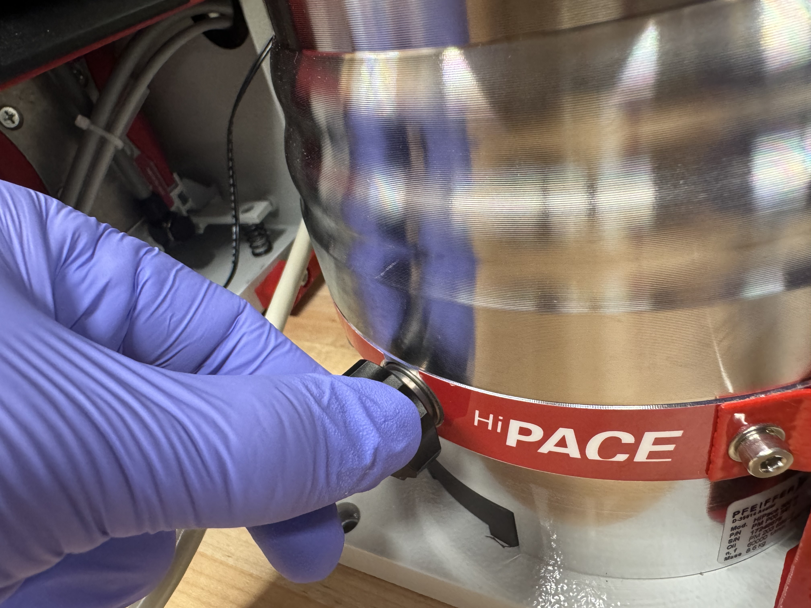
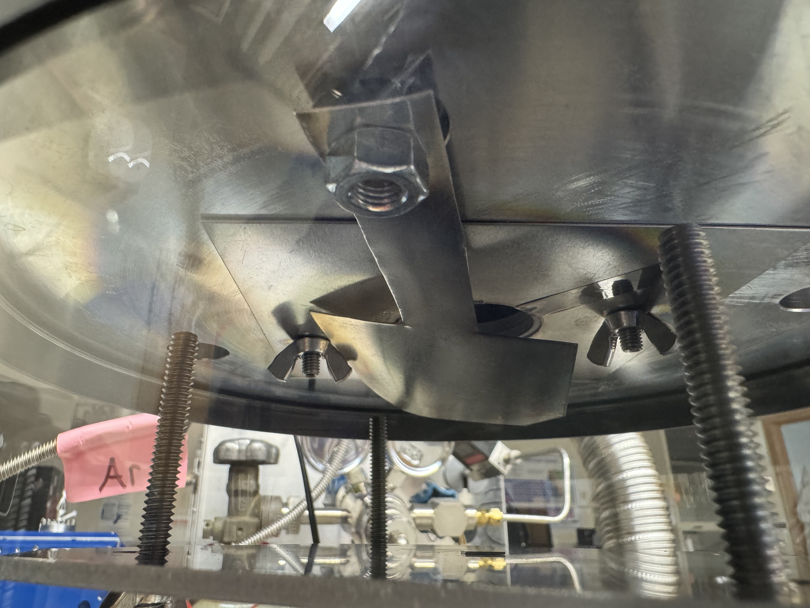
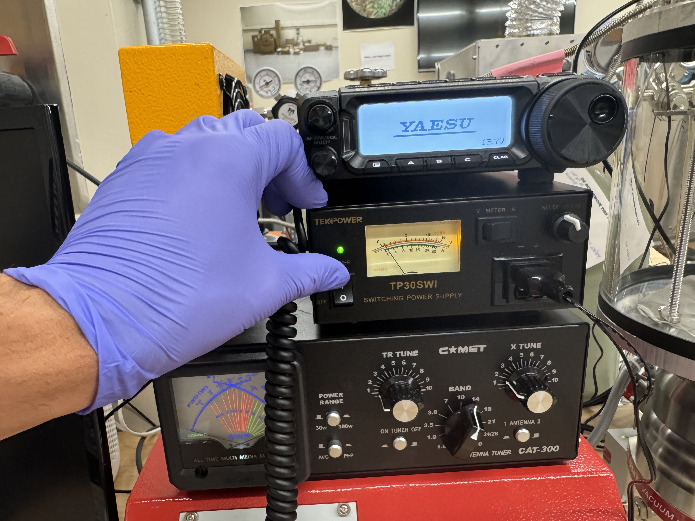
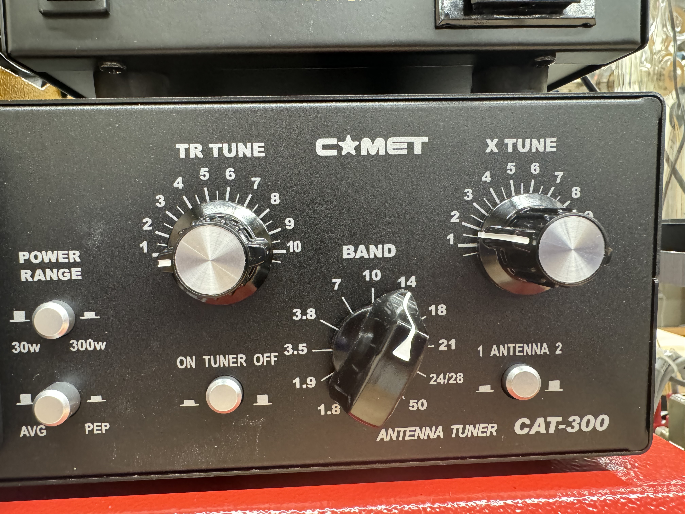
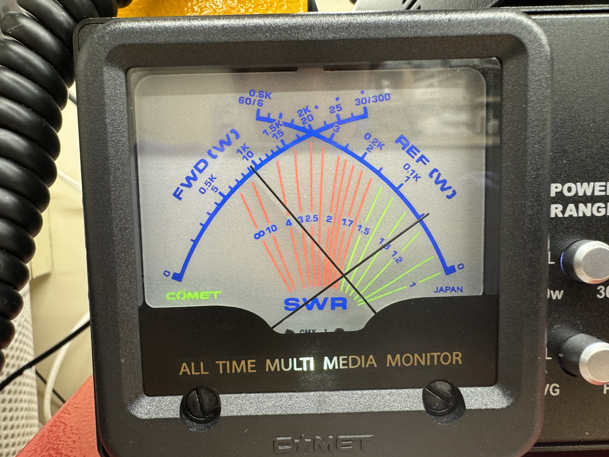
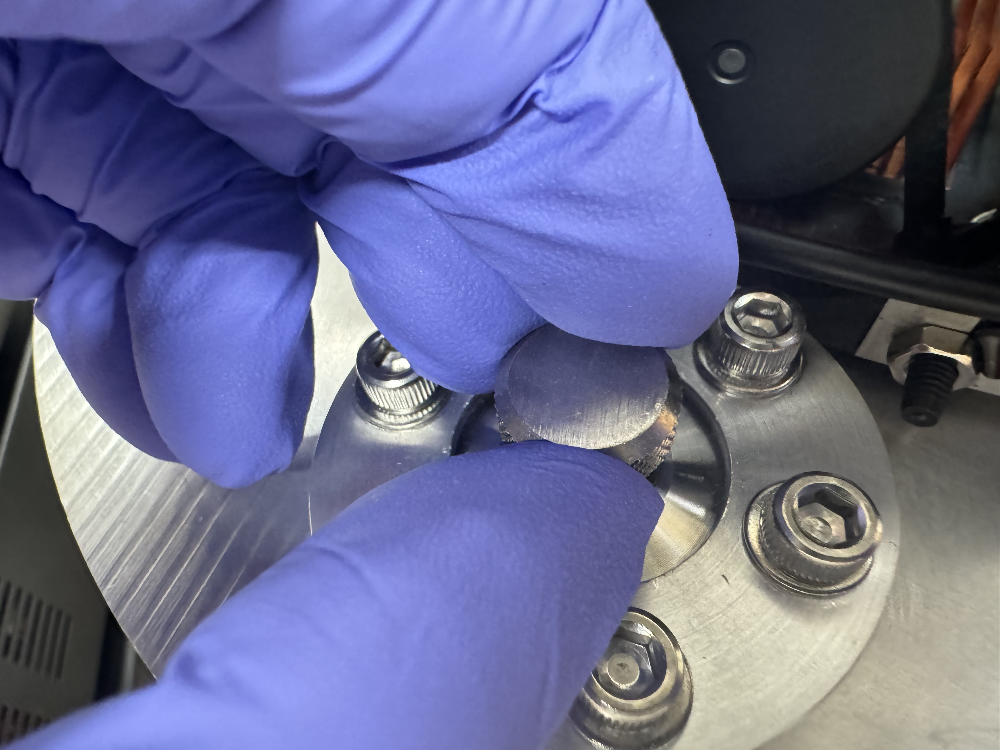

# SOP - RF Sputtering

### Loading your chip and setting throw distance

1.  Put on nitrile gloves to prevent getting skin oils on or in the chamber and other equipment.

    <figure><figcaption></figcaption></figure>
2. Take the black frame from under the bench, and place it vertically in front of the chamber.&#x20;
3.  Wipe the top surface of the black frame with a clean room wipe, to prevent transferring any contaminants to the top plate of the chamber.&#x20;

    <figure><figcaption></figcaption></figure>
4. Remove the top plate of the chamber and gently place it on the black frame, being careful to manage the gas lines and power lines attached to it.
5. to adjust the throw distance (distance between target and substrate), lift off the substrate plate and adjust the height of the 4 wing nuts used to support it.&#x20;
6. You can use a bubble level (located in the red bin below the bench) to ensure that the wings nut support he substrate plate in a flat plane.
7.  You can simply measure the distance between the substrate plate and target by using a ruler to mesa the distance between the substrate plate, and the top Viton gasket. The target surface sits 5/8" above the Viton gasket.&#x20;

    <figure><figcaption></figcaption></figure>
8.  Place your chip in the center of substrate plate. &#x20;

    <figure><figcaption></figcaption></figure>
9. Place the top plate back onto the chamber, being careful not to introduce any contamination to the sealing surfaces.
10. Ensure the red alligator clip is grounding the top plate to the pump, it often unclips during the chip loading process.
11. Do not leave the top plate off for extended periods of time, as contaminates can accumulate in the chamber.

### Pumping down

1.  Ensure that the vent screw is hand tight. Do not over tighten.&#x20;

    <figure><figcaption></figcaption></figure>
2. Double check that that both mass flow controllers are set to 0 SCCM.&#x20;
3.  On the digital control unit, use the arrows to scroll to parameter 707.

    <figure><figcaption></figcaption></figure>
4. Set parameter 707 to 100% by simultaneously clicking both areas, then using right arrow to select 100%, then simultaneously clicking both arrows to set it at 100%. This sets the pump speed to its maximum value of 1000 Hz.
5. Use the arrows to scroll  to parameter 340, which displays the pressure in hPa. Parameter 309, the pump speed in Hz, should also be visible on the DCU.
6. As the pump spins up to 1000Hz, ensure that the pressure is decreasing. It should reach the E-4 to E-5 range within a few minutes. It should also steadily speed up to 1000 Hz, without getting stuck at any speed. If either of these happen, then something is wrong, and you need to double check all your seals, and consider if anything is the chamber could be outgassing. For example, alumina very low outgassing, but is porous, so if you exposed it to water, the water will evaporate out of the alumina over an extended period of time.
7. Once the pump has reached 100Hz smoothly, and chamber pressure is in the E-5 hPa range, it is time to wait \~24 hours for the pump to reach base pressure. This system is capable of 1.5 E-7 hPa, but may not reach it due to contamination build up in the chamber or ion sealing surfaces. Ensure that the  chamber reaches <5E-7 hPa before proceeding, otherwise, your films will not be high qaulity (especially films like Al that are very reactive with oxygen or water vapor)

### Reaching striking pressure, and sputtering pressure

1.  Open the argon cylinder all the way, lefty loosey&#x20;

    <figure><figcaption></figcaption></figure>
2. Ensure that the dual stage regulator has high pressure on the cylinder side, and \~10-15 PSI on the chamber side.
3. On the Alicat mass flow controller, click the setpoint button, then use the select digit button, up button, and down  button, to set 10 SCCM. Hit the set button to actually begin flowing Ar. Ensure that the MCF is flowing 10 +- .01 SCCM.
4. On the HiCube digital control unit, scroll to parameter 707
5. Set parameter 707 to 100% by simultaneously clicking both areas, then using left arrow to select 25%, then simultaneously clicking both arrows to set it at 25%. This sets the pump speed to 250 Hz
6. use the arrows to scroll  to parameter 340, which displays the pressure in hPa. Parameter 309, the pump speed, in Hz should also be visible on the DCU.
7.  Once the pump reaches 250Hz, it is time to make a map of flow rate, and chamber pressure before striking plasma. This is necessary, because when the plasma is on, the RF noise can disrupt the communication between the pressure gauge and digital control unit, giving inaccurate pressure readings. Do this by setting the MFC to various setpoint between 5 and 50 SCCM Ar. The chamber at CMU usually has the following flow to pressure relationshsip. If youre using O2, you can do this same process, but by adjsting the Ar and O2 flow rate simutlaneaously to ustain a constsnt O2:Ar flow ratio.

    | Flow SCCM | Pressure hPa |
    | --------- | ------------ |
    | 10        | 2.5E-3       |
    | 20        | 6.3E-3       |
    | 25        | 8.6E-3       |
    | 30        | 1.2E-2       |
    | 35        | 1.6E-2       |
    | 40        | 1.9E-2       |
    | 80        | 1E-1         |
8. Next, set Ar flow to approximately 80 sccm to achieve  \~1E-1 hPa, which is the "striking pressure." Essentially, the electrical potential and pressure needed to strike a plasma are related through a non monotonic curve, known as the Paschen curve. The goal is to strike the plasma at the minima of this curve. for our chamber, the minima of this curve has been experimentally determined to be near 1E-1 hPa.

### Striking the plasma, and impedance matching, and depositing

1.  Ensure that the substrate shutter is in the blocking position.&#x20;

    <figure><figcaption></figcaption></figure>
2.  Double check that the alligator clip is connecting the top and bottom.&#x20;

    <figure><figcaption></figcaption></figure>
3.  Switch on the switching DC power supply. This should also power on the radio, and the antenna tuner.&#x20;

    <figure><figcaption></figcaption></figure>
4. Ensure the radio is set to 14 Mhz.
5.  Turn the RF power on by taping the radio controller button down with a piece of tape as shown.&#x20;

    <figure><figcaption></figcaption></figure>
6. If the matching network has already been tuned for the target inside the chamber, then plasma will likely form immediately.
7.  If plasma does not form, you will need to adjust the TR tune knob inutil plasm does form.&#x20;

    <figure><figcaption></figcaption></figure>
8. If plasma still is not striking, the pressure may be off, the magnetron and target may not be set right, or the ground and signal may be shorted.
9.  Once the plasma is formed, use the TR tiune knob to fine tune the matching. The goal is to get he forward power > 90 watts, and the reflected power <10 watts. They do not always add up to 100.&#x20;

    <figure><figcaption></figcaption></figure>
10. Lower to your selected sputtering pressure.
11. Carefully nudge the TR tune knob to finetune impedance matching again. if the plasma goes out, reset the Ar flow to \~80 SCCM, and repeat steps 1-10.
12. Note, the plasma is not always very stable below 1E-2 hPa,
13. Wait 15 minutes, to ensure the target surface has been cleaned by the plasma bombardment. then turn the shutter righty tighty until it is no longer blocking the magnetron hole. When turning the shutter, avoid putting lateral force on it, this could break the seal and ruin your sputtering run and damage the pump.&#x20;

    <figure><figcaption></figcaption></figure>
14. Wait the intended dwell time&#x20;

    <figure><figcaption></figcaption></figure>
15. Untape the radio controller to turn the plasma off.

### Shutting down and retrieving the chip

Basically do everything in reverse

1. Set both MFCs to 0 SCCM.
2.  Close both Ar and O2 cylinders (righty tighty)&#x20;

    <figure><figcaption></figcaption></figure>
3. Turn off the pump.
4. Turn off the switching DC power supply
5. Switch off all 3 fans
6. Wait until the pump reaches 0 Hz.
7. Slowly unscrew the pump vent. No need to fully remove it.
8. Wait until chamber pressure reaches >1E-3 hPa
9. Put the black frame on top of the table, set top plate on it. It may difficult to remove the top plate. IF so, grip the base of the pressure gauge and Ar MFC then tilt it off.
10. Retrieve your chip with tweezers
11. Put the top plate back on.

