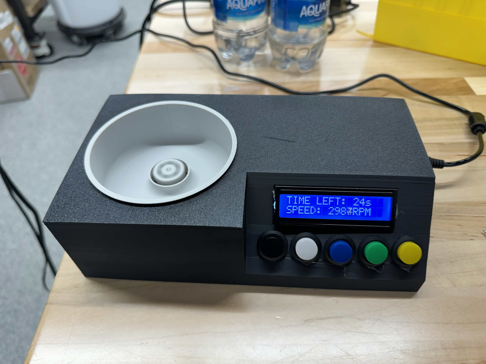
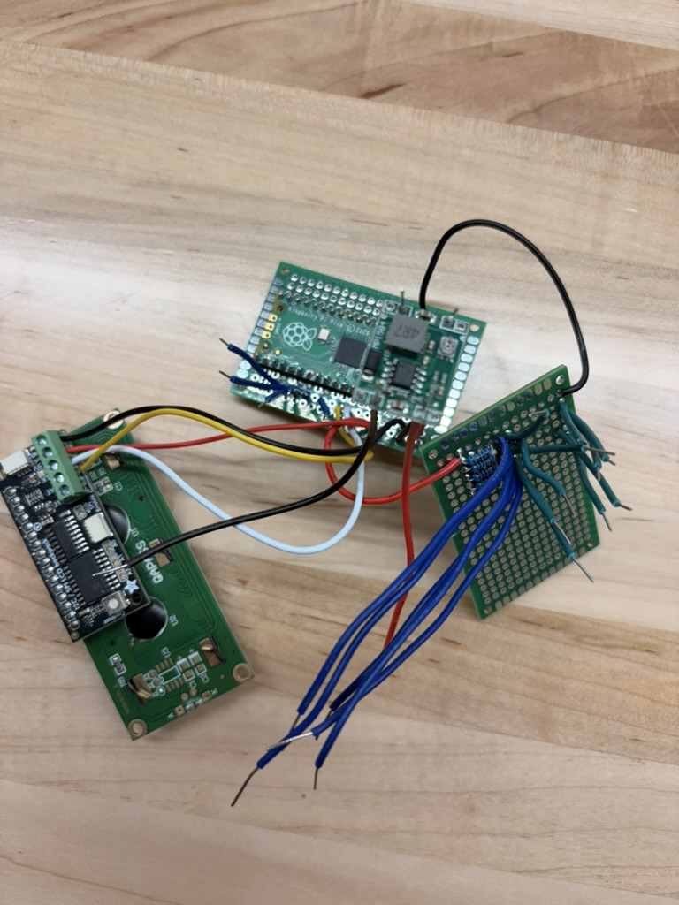
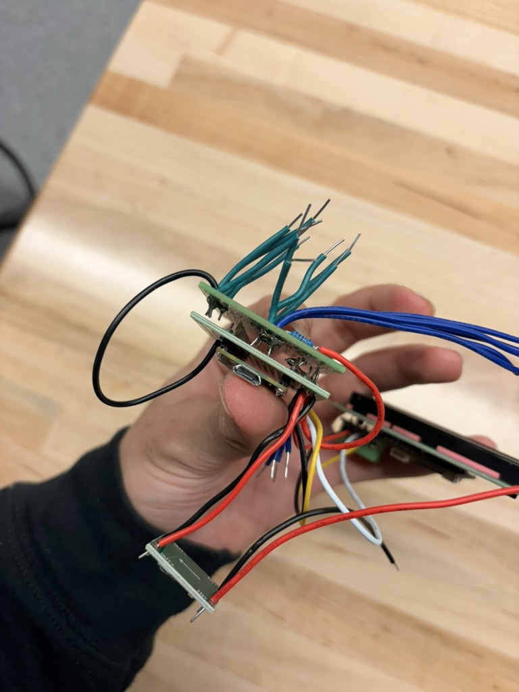
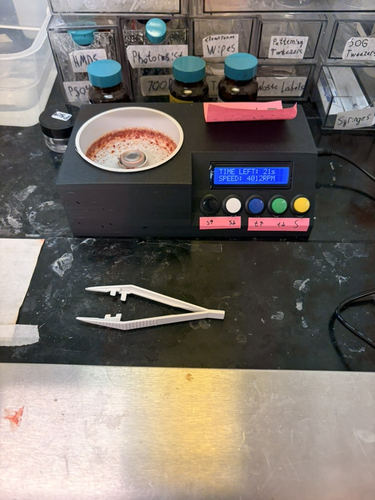

---
layout:
  width: default
  title:
    visible: true
  description:
    visible: false
  tableOfContents:
    visible: true
  outline:
    visible: true
  pagination:
    visible: false
  metadata:
    visible: true
  tags:
    visible: true
  actions:
    visible: true
---

# 💿 Spincoater v1

This spincoater was designed by Rahim Malik and Jay Kunselman at the CMU Hacker Fab. It features a Maasi spincoater-inspired enclosure, with custom, hand-wired hardware and software. A second-generation version of this spincoater is in development by Rahim Malik.

<figure><figcaption></figcaption></figure>

<figure><figcaption></figcaption></figure> <figure><figcaption></figcaption></figure> <figure><figcaption></figcaption></figure>

### BOM

<table data-search="false"><thead><tr><th width="350.640625">Part</th><th width="105.53125">Link</th><th width="92.62109375">Cost</th><th>Notes</th></tr></thead><tbody><tr><td>BLHeli_32 ESC with telemetry</td><td><a href="https://www.amazon.com/32bit-2-6S-Telemetry-Lumenier-36A/dp/B07D9V5FYS/">Amazon</a></td><td>$25.99</td><td></td></tr><tr><td>Brushless DC motor</td><td><a href="https://www.amazon.com/FLASH-HOBBY-Brushless-Multi-Copter-Outrunner/dp/B08KRRWM7F/ref=sr_1_37?dib=eyJ2IjoiMSJ9.ka9wQodTGdr6QcvxZaRbZepX75Ku-z5sWXXgh2Z3ZQ8z_KVnS6UiJKqSlvYdoutQatpUW2lBZdOASDOSMn37cd-zgm815OBJq1N4Is0iPDZ5WdQmnvva50Tjhj0sQxIvTntGJJP3ri8sUIOuc_hEE3_JOQje9mVi_EoizMzDYSZNJF-4cntLCIaz8Mm0fw7yU4ni_NzQkAy6MtBhLfkQEV0SiP7fM3MlEb5CKpIKMaoeCYrLS06ZM4VDoEQcrbpR7ToqqPTpykKB0l3H1qp-6lqdzTN2FD42_sneRVE6pVk.qEKVbUpozjOJr9HRueCok7byGa28XZg6M9ql5q1yRfs&#x26;dib_tag=se&#x26;keywords=Brushless+DC+motor&#x26;qid=1789158205&#x26;sr=8-37">Amazon</a></td><td>$12.95</td><td>Not tested, though should be suitable.</td></tr><tr><td>Mini DC-DC 3V3 buck converter</td><td><a href="https://www.amazon.com/dp/B0DJSXLSJV/ref=twister_B0DKSZJCBR?_encoding=UTF8&#x26;th=1">Amazon</a></td><td>$9.99</td><td></td></tr><tr><td>Adafruit I2C/SPI character LCD backpack</td><td><a href="https://www.adafruit.com/product/292">Adafruit</a></td><td>$9.95</td><td></td></tr><tr><td>12V 5A AC-DC wall adapter with barrel jack</td><td><a href="https://www.amazon.com/ALITOVE-Adapter-Converter-100-240V-5-5x2-1mm/dp/B01GEA8PQA/ref=sr_1_1?crid=16ZTC34U5UFX5&#x26;dib=eyJ2IjoiMSJ9.BUCjfx4WtqhAT981BJj3OdX7aD7kOcS61MZOzttyqWJWWT65cQ_Ga5umnB69_AA3CZiT3LpF55cIUjpJD53E0-RRacnar2YgLPfGpRhXAex2FQtACBqZL3WLv4LsNAYjw69M7vp6xOnC3dQkn0JhiDQsu2miazlCj8hkrxPEDMRCfAx1AC4k4HaLfcdlEVYlZrdRm2ho-DbhyFAsI7FodUwZlO51IJ1A9RTmJT04IeU.CfvnrldnRKx9iW_es1E2yqBhgNcq4I94cf6l92QdLYk&#x26;dib_tag=se&#x26;keywords=12V%2B5A%2BAC-DC%2Bwall%2Badapter&#x26;qid=1789158051&#x26;sprefix=12v%2B5a%2Bac-dc%2Bwall%2Badapter%2Caps%2C179&#x26;sr=8-1&#x26;th=1">Amazon</a></td><td>$12.99</td><td></td></tr><tr><td>Raspberry Pi Pico</td><td><a href="https://www.adafruit.com/pico?src=raspberrypi">Adafruit</a></td><td>$5.00</td><td></td></tr><tr><td>16×2 character LCD panel</td><td><a href="https://www.adafruit.com/product/181">Adafruit</a></td><td>$9.95</td><td></td></tr><tr><td>Pushbuttons</td><td><a href="https://www.amazon.com/Momentary-Button-Switch-Assorted-Self-Resetting/dp/B08SKJ6V7Z/ref=sr_1_12?crid=FPZ12Z32H152&#x26;dib=eyJ2IjoiMSJ9.eC6Z5XjDF3Pwf-uSobSq_xG8qaKzOt_mK_IF-CfXKlCNeVwDz8RRL-rxcXJ2p2dwYO-BVQEHHhCyfDdiquUBJJHl3qbRNNdt4UAcuVyt_9D9zIGgCxQN4JmDcSJ7PPcnJKo2aUb5bLY_nWjH5Ohgile34JMzyQQDgGjZ-P_AxR6kU9rUenGAiK6L7Qgp76yPYWGFVNdu5QTJbOliSy_qHr_K_mYAwaW8D2UHIAHKE-o.jsU7MxaqmYV_Qj5hG7q1BByQS2UHVq2ZflXp2MFVIWk&#x26;dib_tag=se&#x26;keywords=Pushbuttons&#x26;qid=1789158356&#x26;sprefix=pushbuttons%2Caps%2C375&#x26;sr=8-12&#x26;th=1">Amazon</a></td><td>$11.49</td><td></td></tr><tr><td>Rocker switch</td><td><a href="https://www.amazon.com/DaierTek-Listed-Switches-Automotive-KCD1-5Pack/dp/B07S1MV462/ref=sr_1_8?crid=3F0LYEZRF7QH&#x26;dib=eyJ2IjoiMSJ9.la1AK-tGMGtv8yLxeCVQVVkToKqfw8QDnOipzdrBkX0lR31-0g6GfnF9P-__Qvnyki_rXrPklz7BddQ83g8zIHBRWF6X0IHykOYagy3tPRsKdVtkThIYo0_1Xq_z9Lp_DR0M84FKLhWeJUBFbRN3b79UUMymIUPqX_G8FNZlPfVxq3QKUzZIeMgIJket1xVAb4pCHpifBLBGsGfdS9PpZZh20ef72c9sfjYlQswrtlQ.uVrfMua9SEE706GDmY-oQCLFA5ssc9j98Js8aRHMm-g&#x26;dib_tag=se&#x26;keywords=rocker+switch&#x26;qid=1789158390&#x26;sprefix=rocker+sw%2Caps%2C366&#x26;sr=8-8">Amazon</a></td><td>$6.39</td><td></td></tr><tr><td>10kOhm resistors</td><td><a href="https://www.amazon.com/10K-Resistor-Tolerance-Resistors-Resistance/dp/B0B4JFPHTW/ref=sr_1_3?crid=2VJC4F3UM56L1&#x26;dib=eyJ2IjoiMSJ9.CitfKyPFE5pIWUVS7QgFNI0WCe9Mkj03oaYZumY6Bj0vcp19UuZBSQ-W1rV5euNhZrQlcaXkTA2btsy7hn-eIL3KfJeeNmuv80J7UHskukdyu6yUmKYseelnc1XdZRwsra5t9UuHU1knOUTlyfYKZhkTEK7ChANXMHwE70XuJfdntSkhqOhxL0o_VJyyygp83bXu2p4GJeCNbVrQcZcjyZ4WBEexp3k_qZTBeyPoBrY.ea6aDbYFbzT6VYszQxgcGbZ-lSx24WdB0i78G_xK1UY&#x26;dib_tag=se&#x26;keywords=10+kohm+resistor&#x26;qid=1789158527&#x26;sprefix=10+koh%2Caps%2C368&#x26;sr=8-3">Amazon</a></td><td>$4.49</td><td>Not tested without, though internal Raspberry Pi Pico pullups should suffice.</td></tr><tr><td>Perfboard + hookup wire</td><td></td><td></td><td>Can be sourced anywhere if not on hand.</td></tr><tr><td><strong>Total</strong></td><td></td><td><strong>~$110</strong></td><td></td></tr></tbody></table>

### Build Instructions

#### **Wiring**

This build is hand-wired on perfboard, point-to-point. Follow the schematic below to correctly wire the hardware. Note the resistors can likely be omitted as the Pico sets pullups for each of the button inputs in software.


When wiring the buttons and rocker switch, make sure you account for their lips since they can't be pushed through the enclosure if soldered with all the internal electronics. You may want to solder leads to those components, push them through their holes from the outside, then connect the leads to internal ones. Simple Wago connectors would suffice.


<figure><figcaption></figcaption></figure>

<table data-search="false"><thead><tr><th width="128.86328125">Pico GPIO</th><th width="239.2421875">Function in Code</th><th>Net</th></tr></thead><tbody><tr><td>GP3</td><td><code>ESC_TX</code></td><td>ESC signal (bidirectional DShot)</td></tr><tr><td>GP26</td><td>I2C1 SDA (<code>myWire</code>)</td><td>LCD backpack SDA</td></tr><tr><td>GP27</td><td>I2C1 SCL (<code>myWire</code>)</td><td>LCD backpack SCL</td></tr><tr><td>GP13</td><td><code>START_STOP_BTN</code></td><td>Pushbutton to GND</td></tr><tr><td>GP12</td><td><code>INC_SPEED_BTN</code></td><td>Pushbutton to GND</td></tr><tr><td>GP11</td><td><code>DEC_SPEED_BTN</code></td><td>Pushbutton to GND</td></tr><tr><td>GP10</td><td><code>INC_TIME_BTN</code></td><td>Pushbutton to GND</td></tr><tr><td>GP9</td><td><code>DEC_TIME_BTN</code></td><td>Pushbutton to GND</td></tr></tbody></table>

Power architecture: 12V 5A wall adapter → rocker switch → 12V rail feeds the ESC/motor directly and a MP1584EN buck converter (12V→5V or 3V3) feeding the Pico's `VSYS`. The LCD backpack is powered from the Pico's onboard regulated `3V3` output, which keeps the I2C bus at 3.3V so no level shifter is needed against the Picos's non-5V-tolerant GPIOs.

#### **CAD**

3D print (PLA is fine) this enclosure/mechanical design (Onshape): [Spincoater v1 assembly](https://cad.onshape.com/documents/0f8d75eba296b389c9a9c25c/w/3d63d26b365cbf05a166e047/e/78a777aea0b61be88a95ec67?renderMode=0\&uiState=6a7b3c4119ffa8cd973646b7)


Since this spin coater does not support a vacuum chuck. You will want to stick a piece of double sided tape onto the chuck, so your chip does not fly away. Replace that tape as often as needed.


#### Software

You can download the software from this GitHub repository: [github.com/hacker-fab/spincoater-rahim-jay](https://github.com/hacker-fab/spincoater-rahim-jay)



#### Install Arduino IDE

Get the latest [Arduino IDE](https://www.arduino.cc/en/software)



#### Add the Raspberry Pi Pico in Board Manager



#### Install the following libraries in Library Manager

* `Adafruit LiquidCrystal`
* `PID_v1_bc`
* `PIO_DShot`



#### Plug in the Pico via USB, select the correct board and port



#### Compile and upload the software to the Pico



You can play with the parameters at the top of the software to remap your button pins, adjust rampup and rampdown rates, button stickiness, etc.


A serial override mode exists for debugging (connect at 115200 baud, send an integer 0–8000 to directly command RPM, or `-1` to return to normal button control). This bypasses the button/state-machine and isn't part of normal operation.


### SOP

Spincoat a liquid (photoresist, spin-on glass, etc.) at a set RPM for a set duration, with closed-loop PID speed control (RPM measured live off the ESC's bidirectional DShot telemetry, not just estimated).

The controls and display are extremely intuitive. The best way to learn is by playing with it, but instructions are given here.

<table><thead><tr><th width="196.36328125">Button</th><th>Function</th></tr></thead><tbody><tr><td>SPEED + / SPEED −</td><td>Adjust target coat RPM by ±100 RPM per press (range: 500–8000 RPM). Hold to auto-repeat.</td></tr><tr><td>TIME + / TIME −</td><td>Adjust coat duration by ±5s per press (range: 5s–180s). Hold to auto-repeat.</td></tr><tr><td>START/STOP</td><td>From idle: starts a run (ramp-up → coat → ramp-down → idle). During a run: aborts immediately and ramps down early.</td></tr></tbody></table>



#### Power on

Flip the rocker switch. LCD shows the idle screen with the current `TIME`/`SPEED` settings.



#### Set speed and time

Use SPEED +/− and TIME +/− to dial in the target RPM and coat duration for this run.



#### Load the substrate

Secure the substrate on the chuck and dispense resist/coating fluid.



#### Start the run

Press START/STOP. Motor ramps from 300 RPM up to the target RPM at 1500 RPM/s, then holds at target for the set duration. The display will show time remaining and live measured RPM.



#### Ramp-down and stop

When the timer elapses, the motor automatically ramps down (1500 RPM/s) to 300 RPM and stops. The display returns to idle.




To abort a run early, press START/STOP at any point during ramp-up, coating, or ramp-down. The motor immediately begins ramping down from its current speed.

