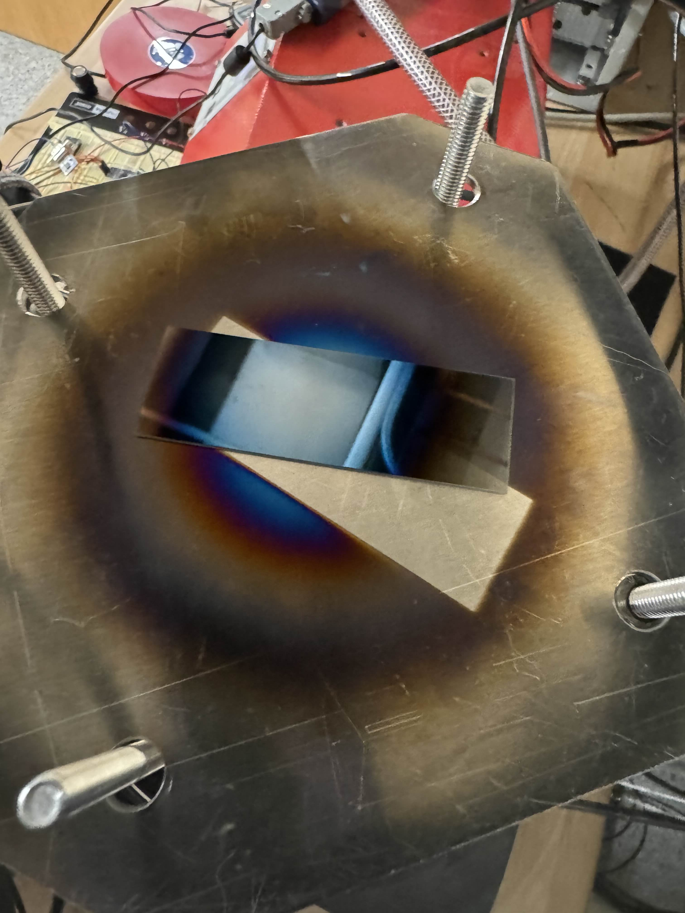
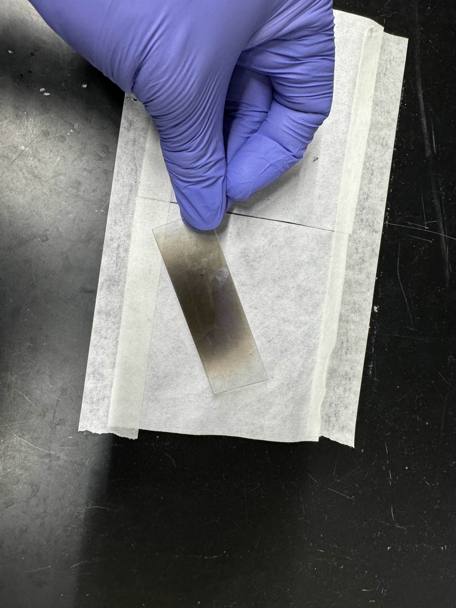

# ⚡ Sputtering Chamber

## Version 2

Below are pictures of the current V2 sputtering chamber. This test was conducted just last week, so documentation for construction, BOM, operation are forthcoming.

<figure><figcaption></figcaption></figure> <figure><figcaption></figcaption></figure> <figure><figcaption></figcaption></figure>

The huge improvement is the completely redesigned sputter head, which allows for much strong magnets to confine the plasma to a small ring at the target. This makes it our first sputtering chamber capable of both RF and DC metal and oxide deposition at highly performant speeds. bleow is evidence of sputtering for aluminum.

documentation for construction, BOM, operation are forthcoming.

<figure><figcaption></figcaption></figure> <figure><figcaption></figcaption></figure> <figure><figcaption></figcaption></figure>

## Version 1

Refer to [this documentation](https://docs.google.com/document/d/1rf3GRqafH8iqekn8YzyOdSB1IbM-5DOVs08c3u3Zl0Y/edit?usp=sharing). Note some conclusions made about power supply specifications and chamber problems have been resolved in v2 assembly and experimentation.

