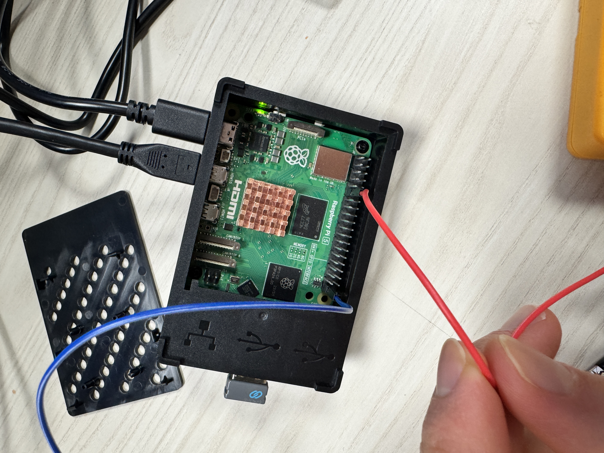

# 📚 Database

## Overview

The Hacker Fab [database](http://db.hackerfab.org) was built on the Django framework using Python, with HTML and CSS serving as the front-end. The code in this [Github repository](https://github.com/hacker-fab/data-management). The purpose of the database is to store data related to chip fabrication in our labs and use the results to refine our process parameters. It is crucial that we maintain a comprehensive and functional data store in order to develop new processes and to help new Hacker Fabs begin fabrication.

The database was created in Spring 2024 with the ability to create new chips, add process parameters to each chip, and query back results from the database. The front-end had simple styling, although they were not reflected in the production website due to issues with certification. The motivation for our improvements in Fall 2024 was increasing the intuitive usability of the website, as well as adding more functionality for the user. hi

## Design Choices

### Web Hosting Platform

The website hosting options up for consideration were Amazon Web Services (AWS), Google Cloud Platform (GCP), and Microsoft Azure. AWS was ultimately chosen because it had the longest free period and we had the most experience working with it. We use EC2 because it has the most flexible options and high availability in many geographic regions. The website is not very compute-heavy, so we chose a small instance to keep costs down.

### Model/Schema Changes

The code has a model-view-controller (MVC) structure. Each fabrication process is described as a model (in [models.py](https://github.com/hacker-fab/data-management/blob/main/data_management/models.py)), with each field representing a process parameter or documentation artifact. This translates to each process being stored as a separate table within the database. This semester, the models were updated to constrain parameters to specific data types in order to maintain consistency and correctness in the database. For instance, temperature was stored as a decimal value, duration as a positive integer, and material type as a string. Some models and fields were renamed as well in order to clarify their meaning. We worked closely with the process development teams to understand which fields should be included or what new models should be added. Relevant Django documentation: [Models](https://docs.djangoproject.com/en/5.1/topics/db/models/)

In order to allow the user to interface with the database, there are input and search forms based on the models (in [forms.py](https://github.com/hacker-fab/data-management/blob/main/data_management/forms.py)). As of this semester, the input forms require certain parameters that are measurable and critical to the fabrication process, as well as prefilled default values for standardized parameters in our primary NMOS process. The search forms do not have any required fields, since we should be able to search process data for every chip and parameter value. This semester, the search forms were also updated with input fields that would provide users with the ability to perform searches given a specified range of values. The labels to these forms were also refined to be more readable and include units to aid in correct input. Relevant Django documentation: [Forms based on models](https://docs.djangoproject.com/en/5.1/topics/forms/modelforms/)

### User Interface

We identified that a non-intuitive workflow and lack of visual cohesion were affecting the usability of our website. One major change was the inclusion of “chip pages” that show every process done to a chip and eventually will allow for edits to the data associated with it. Previously, the only way to see that data was to search the database by chip number. This process was not intuitive because users are usually working with a single chip at a time, so it made more sense to have a centralized location to view that relevant information.

A change for the search page was the use of horizontal tables to display data for a process. In other words, for a single entry, each column represents a certain field in that entry, and each row is a distinct entry (previously, the first column was the field name, the second column was the value, and additional fields for a given entry were displayed in their own row). The horizontal table display makes it much easier for users to distinguish between different entries for chip information and process parameters. Furthermore, we modified the search page to display all filter categories to the user under an umbrella “Advanced Search” dropdown. This allows the user to see all the search options at once instead of having to submit a process. Lastly, to make it easier for users to interpret the data that is presented to them in the search page, we added functionality that allows users to group the search results either by the process types they have selected, or by the chip number.

The chip creation page will also have the option to use a “chip profile” or “chip default” that prefills parameter values associated with an established process, such as the NMOS process we use for class labs.

An important addition to the Patterning process in particular is the ability to add multiple patterns in the same step and click on a gray rectangle to approximately note the location of that pattern. This way, it is easier to record the application of multiple patterns at the same time as well as locate a specific pattern when returning to the chip.

### Main Controller

The different web pages in our website are served by their own controller functions which are located in [views.py](https://github.com/hacker-fab/data-management/blob/main/data_management/views.py). We designed the backend architecture to have a separate function that serves each unique web page. This design allows us to modularize our backend logic and isolate functionality to those specific pages so that they can be as customizable as possible. If similar logic is used across different web pages, we put this logic in helper functions to avoid having duplicated code. The different controller functions for each page serve the main functionality of our website. Routes between the addresses to these pages and the functions that serve them are specified in [urls.py](https://github.com/hacker-fab/data-management/blob/main/webapps/urls.py). The controller links the different HTML pages together, performs the database operations, and interfaces with the backend. It determines what form to display based on what process the user selected, saves the form data and passes it to the database after cleaning, displays search queries by the user, and renders the web pages.

### Main Controller: Querying Data

As our website serves to display database entries to our users, a crucial functionality is querying data (related to process parameters and chip information) and rendering it on the page. These are the different pages where data querying is critical:

| Page Name                     | Page Address         | Controller (Function Name) |
| ----------------------------- | -------------------- | -------------------------- |
| Search Page                   | /search              | search\_page()             |
| Central Chip Page             | /central             | central\_action()          |
| Chip Page (for a single chip) | /chipnum/\<chip\_id> | display\_chip()            |

When a user performs a search for data, they can enter specific filters to narrow down their results. These filters are passed to our controller when the user fills out a search form filled with parameter values. In our controller, we use Django’s Q() objects from their [database querying library](https://docs.djangoproject.com/en/5.1/topics/db/queries/#making-queries) to create and execute SQL queries. This simplifies the process of extracting data from our database since we just need to create a Q() object using the filters specified by the user then apply the filter on our models. This querying is done in the function [filter\_form()](https://github.com/hacker-fab/data-management/blob/main/data_management/views.py#L359). Data querying is one of the most computationally intensive components of our database; hence, it can be considered as a bottleneck. Querying data for a single model (i.e. process type, user profile, etc.) has a worst case complexity of O(M), where M represents the number of rows that exist for a particular model in our database (the total number of unique entries of that model stored in our database). In the search page, the user is able to conduct a search to retrieve data from multiple process types. In this case, the worst case complexity for the search is O(P\*M), where P represents the number of different processes the user has selected, and M represents the number of rows that exist for a particular model in our database.

The code in [views.py](https://github.com/hacker-fab/data-management/blob/main/data_management/views.py) is responsible for passing the data from the query result to the html files so that they can be displayed on the web page. There is an important detail that developers should take note of when implementing any functions that return queried results to users. We have implemented a specific data format to pass to the html page in order to standardize the design of the html pages and controller function outputs. When an html page is rendered, [views.py](https://github.com/hacker-fab/data-management/blob/main/data_management/views.py) provides it a context, which contains data (variables) that are required by or will be displayed in the html page. The html page expects the queried data provided in the context to be an array of arrays of dictionaries. Since Django’s querying library returns the queried data to us in the form of a [QuerySet](https://docs.djangoproject.com/en/5.1/topics/db/queries/#retrieving-objects), we must convert the QuerySet into an array of dictionaries using Django’s model\_to\_dict() function found in their [forms.models](https://docs.djangoproject.com/en/4.2/_modules/django/forms/models/) library. Each dictionary represents a single entry in the database. The keys correspond to the column names, which map to the corresponding value for that column. Each array of dictionaries within the outer array corresponds to a grouping of data. This enables us to group data based on the process types so that they can be displayed on the page with the correct column headers. This data structure is depicted below.

Diagram representing the data structure of the query results passed as a context to be rendered in the html 

!!!!!!!!!!!!!!!!!!!!!!!!!! System architecture for interfacing with tools (the spincoater for now) !!!!!!!!!!!!!!!!!!!!!!!!!!!!!!!!!!!!!!!!!!!!!

SEE this link for better formatting: https://docs.google.com/document/d/1SrD66bqmS1xxs2jt\_WWSY7eLr6vyDJxIB4dbMdbxkws/edit?tab=t.0#heading=h.ai1m6262yla9

System Architecture

1. AWS Server Purpose: Centralized management of the job queue and storage of job-related data. Components: API Gateway: To handle incoming API requests from the Raspberry Pi and the primary web application. Lambda Functions (or EC2-based backend): Job Queue API: Handles enqueueing, dequeuing, and querying of jobs. Job Status API: Updates job status upon completion. DynamoDB (or RDS): Job Queue Table: Stores queued jobs with parameters, states (pending, in progress, completed), timestamps, and priority levels. Job Log Table: Stores historical job execution logs. S3: Optional for storing any job-related resources or output files.
2. Raspberry Pi Purpose: Acts as a client to fetch, run, and manage jobs locally. Major advantage of Raspberry PI: Runs full GUI linux distro that can directly connect to CMU WIFI or ethernet. Components: Job Fetching Service: Runs every 5 seconds (via a cron job or background service). Sends an API request to the AWS server to check for the next job. Receives and dequeues a job (if available). UI Module: Displays the job details on a connected screen. Allows the user to manually start the job or view progress. Supports initiating a new job via the UI. Job Execution Module: Sends job parameters to the microcontroller (spin coater controller for this semester) for execution. The Raspberry PI is physically connected to the spin coater microcontroller using jumper wires. This will replace the buttons that are currently used as input. Monitors job progress and completion. Job Completion Handler: Sends a POST request to the AWS server with job status and result details after execution.

Data Flow Job Creation: The primary way that jobs will be created is through the hacker fab website. The hacker fab website will call the appropriate API call to manage the jobs database. The implementation of this is out of the initial scope for my project. For testing purposes for this semester, I will use POSTMAN to send API calls to the AWS jobs database. Users can also create new jobs directly via the Raspberry Pi UI. This allows for redundancy in the case that the machine needs to be controlled without the database. There will be an option to run the job immediately or to send it to the database to be added to the queue. Job Queue Management: The AWS server maintains a centralized queue of jobs. The Raspberry Pi fetches and dequeues jobs by querying the API. Only jobs for the specific machine are dequeued. Job Execution: The Raspberry Pi receives the job and displays it on the connected UI. Upon user interaction (manual start) or automatically (if set), the job is run on the spin coater (or other device in the future) Job Completion: After execution, the Raspberry Pi sends the success/failure status to the AWS server, updating the job's record in the database.

Technical Details AWS Backend API Gateway Endpoints from AWS for raspberry PI: GET /jobs/next: Fetch the next job from the queue. POST /jobs/completion: Update job completion details. API Gateway Endpoints from AWS for web application: POST /jobs: Enqueue a new job. The request has the machine name, input parameters, priority. The response will have the job\_id of the newly created job, or error. GET /jobs\_by\_id: The request includes the job\_id(s) for which you will get details. All data for that row of the table will then be returned. NOTE: you can pass a list of job\_ids to get multiple rows of data at the same time. GET /jobs\_by\_machine: The request includes the machine name. All jobs that are in the database (regardless of status) will be returned. Job Queue Table Schema: job\_id (Primary Key) machine (the machine to run the job on. E.g. spin coater) status (Pending/In Progress/Completed/Failed) input\_parameters (JSON for variable parameters) output\_parameters (JSON for results from the machine) timestamp (Queued timestamp) priority (Optional for prioritized execution) Raspberry Pi Software Language: Python for compatibility with Pi and microcontroller communication. UI Framework: Tkinter. Lightweight GUI API Client: Fetches jobs and sends completion status using requests library. Microcontroller Interface This will vary significantly depending on the tool we are attempting to automate. This code will be modularized and will be one of the only things that will need to be modified when adding a new tool to the system. Job Execution Commands: Defined in a simple protocol (e.g., JSON commands). These commands are then parsed and used to control the microcontroller. For example, for the spin coater, the output from the I/O ports of the raspberry pi can be connected to where the buttons are on the spin coater microcontroller and simulate the button presses. There might also be an even simpler way to connect the raspberry pi to the spin coater microcontroller after talking to someone familiar with the spin coater.


**Basic raspberry PI hardware setup:**

Raspberry PI 5 with case and heatsink. Jumper wires connect GPIO pins to external device. See image attached.&#x20;

<figure><figcaption></figcaption></figure>


To control the Raspberry PI 5 GPIO ports, use the gpiod python package (see screenshot below). It is critical to use gpiochip4.&#x20;

<figure><figcaption></figcaption></figure>

AWS Configuration for jobs queue:

This is the jobs queue that the tools (right now only the spincoater) pull from. Jobs are enqueued from the primary web application.&#x20;

The API gateway routes are configured as follows:

<figure><figcaption></figcaption></figure>

The dynamo DB is configured with default settings. job\_id is the primary key.&#x20;

<figure><figcaption></figcaption></figure>


The majority of the logic is in the lambda function. The python code is as follows (subject to change):

```python
import boto3
import json
import uuid
import time
import logging
from decimal import Decimal

# Set up logging
logger = logging.getLogger()
logger.setLevel(logging.INFO)

dynamodb = boto3.resource("dynamodb")
table = dynamodb.Table("JobQueue")

def lambda_handler(event, context):
    """
    Handles API requests for different endpoints.
    """
    logger.info("Received event: %s", json.dumps(event, indent=2, default=decimal_serializer))

    # Extract HTTP method and route
    route = event.get("routeKey", "")
    method = event["requestContext"]["http"]["method"]
    body = json.loads(event.get("body", "{}"))  # Parse JSON body safely

    logger.info("Processing route: %s with method: %s", route, method)

    # Routing based on the request
    if route == "GET /jobs/next" and method == "GET":
        return get_next_job()
    elif route == "POST /job_completion" and method == "POST":   # Ensure correct endpoint
        return update_job_completion(body)
    elif route == "POST /jobs" and method == "POST":
        return enqueue_job(body)
    elif route == "GET /jobs_by_id" and method == "GET":
        return get_jobs_by_id(event)
    elif route == "GET /jobs_by_machine" and method == "GET":
        return get_jobs_by_machine(event)
    else:
        logger.warning("Invalid request received: %s", route)
        return {"statusCode": 400, "body": json.dumps({"message": "Invalid request"})}

# **Helper Function to Convert Decimal to Native Python Types**
def decimal_serializer(obj):
    if isinstance(obj, Decimal):
        return int(obj) if obj % 1 == 0 else float(obj)
    raise TypeError(f"Object of type {obj.__class__.__name__} is not JSON serializable")

# **1️⃣ Function to Update Job Completion (Completed or Failed)**
def update_job_completion(body):
    job_id = body.get("job_id", "-1")
    logger.info("Received job completion request: %s", body)

    # **Check if job_id is missing, invalid, or set to "-1"**
    if not job_id or not isinstance(job_id, str) or len(job_id) < 8 or job_id == "-1":
        logger.error("Invalid job_id received: %s", job_id)
        return {"statusCode": 400, "body": json.dumps({"message": "Invalid or missing job_id"})}

    # Retrieve the job from DynamoDB to verify it exists
    response = table.get_item(Key={"job_id": job_id})
    if "Item" not in response:
        logger.error("Job ID not found: %s", job_id)
        return {"statusCode": 410, "body": json.dumps({"message": f"Job ID {job_id} not found"})}

    output_parameters = body.get("output_parameters", {})
    status = body.get("status", "").capitalize()
 
    if status not in ["Completed", "Failed"]:
        logger.error("Invalid status received: %s", status)
        return {"statusCode": 400, "body": json.dumps({"message": "Invalid status, must be 'Completed' or 'Failed'"})}

    timestamp = int(time.time())
    table.update_item(
        Key={"job_id": job_id},
        UpdateExpression="SET #s = :s, output_parameters = :o, #t = :t",
        ExpressionAttributeNames={"#s": "status", "#t": "timestamp"},
        ExpressionAttributeValues={":s": status, ":o": output_parameters, ":t": timestamp}
    )

    logger.info("Job %s updated to %s", job_id, status)
    return {"statusCode": 200, "body": json.dumps({"message": f"Job {job_id} marked as {status}."})}

# **2️⃣ Function to Add a New Job**
def enqueue_job(body):
    job_id = str(uuid.uuid4())
    machine = body.get("machine", "unknown")
    input_parameters = body.get("input_parameters", {})
    priority = body.get("priority", 1)
    timestamp = int(time.time())
    logger.info("Adding new job with ID: %s", job_id)

    table.put_item(Item={
        "job_id": job_id,
        "machine": machine,
        "status": "Pending",
        "input_parameters": input_parameters,
        "output_parameters": {},
        "timestamp": timestamp,
        "priority": priority
    })

    return {"statusCode": 200, "body": json.dumps({"message": "Job added", "job_id": job_id})}

# **3️⃣ Function to Get the Next Pending Job and Mark It "In Progress", Then Return Updated Data**
def get_next_job():
    logger.info("Fetching next job from queue")
    response = table.scan(
        FilterExpression="#s = :s",
        ExpressionAttributeNames={"#s": "status"},
        ExpressionAttributeValues={":s": "Pending"}
    )

    jobs = response.get("Items", [])
    if not jobs:
        logger.warning("No pending jobs found")
        return {"statusCode": 404, "body": json.dumps({"message": "No pending jobs found"})}

    jobs.sort(key=lambda x: x.get("priority", 1), reverse=True)
    next_job = jobs[0]
    logger.info("Next job selected: %s", next_job["job_id"])

    table.update_item(
        Key={"job_id": next_job["job_id"]},
        UpdateExpression="SET #s = :s, #t = :t",
        ExpressionAttributeNames={"#s": "status", "#t": "timestamp"},
        ExpressionAttributeValues={":s": "In Progress", ":t": int(time.time())}
    )

    updated_job = table.get_item(Key={"job_id": next_job["job_id"]}).get("Item", {})
    logger.info("Updated job details: %s", updated_job)

    return {"statusCode": 200, "body": json.dumps(updated_job, default=decimal_serializer)}

```
