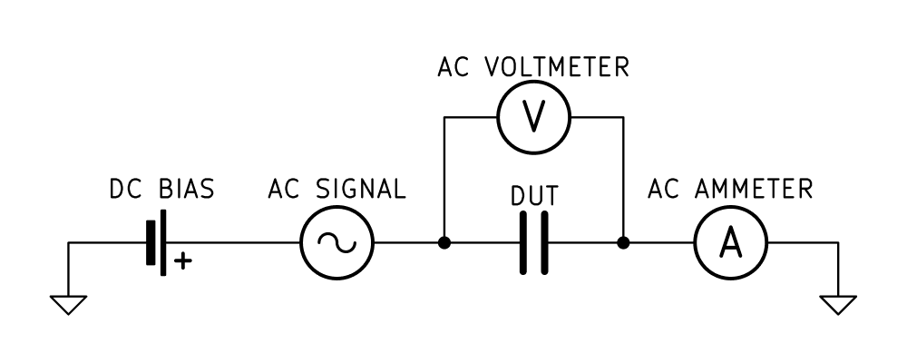

# C-V Characterization

**Capacitance-voltage (C-V)** characterization measures how the capacitance of a device changes with applied bias voltage.\
\
Unlike an I-V measurement, where we look at current flowing through the device, C-V measurements can tell us about what is happening inside a semiconductor structure. Changing the bias changes the distribution of charge in the device, which changes its capacitance.\
\
This makes C-V particularly useful for characterizing **MOS structures and semiconductor junctions**. From a C-V curve, we can extract information such as oxide capacitance, oxide thickness, doping concentration, flat-band voltage, and properties of the semiconductor-oxide interface.

### How does it work?

A C-V measurement uses a small AC signal on top of a DC bias voltage.\
\
The **DC bias** changes the electrical state of the device. Depending on the structure, this can change the depletion region, move charge carriers, or change the distribution of charge near an interface.\
\
The small **AC signal** is used to measure the capacitance at that bias point. The AC voltage is usually kept small so that we measure the device around its current operating point without significantly changing its state.

<figure><figcaption>
<strong>Basic C-V measurement principle.</strong> A DC bias sets the operating point of the DUT. A small AC signal is then applied, and the resulting voltage and current are used to determine its capactiance.
</figcaption></figure>

\
The instrument doesn't measure capacitance directly. It measures the AC voltage across the device and the resulting AC current, including the phase relationship between them. From these measurements, it determines the impedance of the DUT and calculates its capacitance

The DC bias is then swept across a range of voltages. At each bias point, the measurement is repeated. The result is a **C-V curve**, showing capacitance as a function of bias voltage.

<figure><figcaption>
<strong>Example C-V characteristics of a MOS capacitor.</strong> As the bias voltage changes, the device moves  through accumulation, depletion, and inversion. The measured capacitance in inversion depends on the measurement frequency. 
</figcaption></figure>

The shape of a C-V curve depends on the device being measured and its physical properties. For a MOS capacitor, different regions of the curve correspond to different charge distributions in the semiconductor.

Measurement frequency also matters. At higher frequencies, some charge carriers may not be able to respond fast enough to the AC test signal. This can change the measured capacitance and the shape of the C-V curve, particularly in inversion.

### What can we measure?

What we can learn from a C-V measurement depends on the device being measured. For **MOS structures,** the shape of the C-V curve is related to what happens at the semiconductor-oxide interface. From it, we can extract or estimate parameters such as:

* oxide capacitance and oxide thickness,
* flat-band voltage,
* threshold voltage,
* substrate doping concentration,
* interface trap density.

For **PN and Schottky junctions**, the measured capacitance is strongly related to width of the depletion region. This makes C-V useful for extracting parameters such as:

* doping concentration,
* doping profile,
* depletion width,
* built-in potential.

The reason these parameters can be extracted from C-V measurements is that capacitance is directly related to the physical structure of the device.\
For a MOS structure, the oxide capcitance is approximately:

$$
C_{OX} = \frac{\epsilon_{ox}A}{t_{ox}}
$$

so if the capacitor area and dielectric premittivity are known, the oxide thickness can be estimated from the measured capacitance.\
For a junction:

$$
C_j = \frac{\epsilon_sA}{W}
$$

where W is the depletion width. As the applied bias changes, the depletion region expands or contracts, changing the measured capacitance. This relationship is what allows C-V measurements to be used to extract information about the doping of the semiconductor.

### References

* Robert F. Pierret, Semiconductor Device Fundamentals, Addison-Wesley, 1996, Chapter 16: “MOS Fundamentals,” Section 16.4: “Capacitance-Voltage Characteristics.”
* Keithley Instruments, Making Optimal Capacitance and AC Impedance Measurements with the 4200A-SCS Parameter Analyzer.
