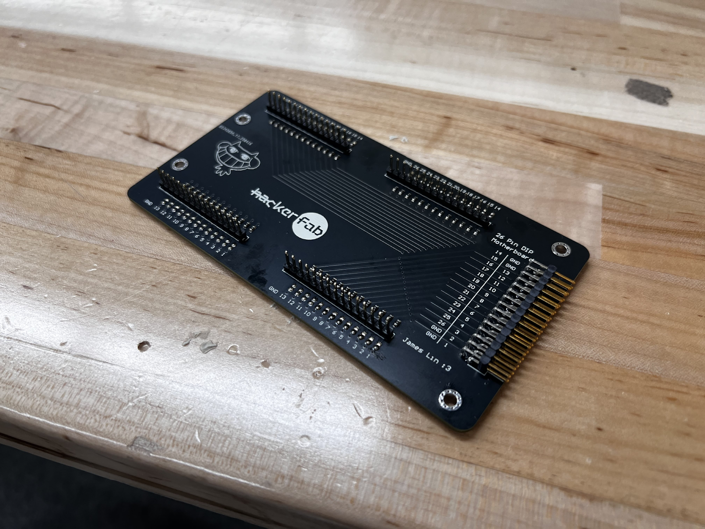

# IC Packaging

***

## Links



[https://github.com/hacker-fab/packaging](https://github.com/hacker-fab/packaging)



[https://cad.onshape.com/documents?nodeId=a41742eaad18f4b65bb1ceb5\&resourceType=folder](https://cad.onshape.com/documents?nodeId=a41742eaad18f4b65bb1ceb5\&resourceType=folder)



[https://docs.hackerfab.org/home/working-docs/cmu-updates/james-lin](https://docs.hackerfab.org/home/working-docs/cmu-updates/james-lin)



***

## Bill of Materials

The overall cost of the package itself is $108.10, the total R\&D cost of $195.09.

The table below is the BOM packaging, which can be found here: [Packaging BOM](https://docs.google.com/spreadsheets/d/1h7u_Eif3jr8CX-VDs7G6TskFq9B_RoVnjoTQv3pn7rc/edit?gid=0#gid=0)

***

## Motivation

Hacker Fab currently utilizes the probing station available at CMU for electrical characterization of its ICs, but these machines have proven difficult to both access and operate. Consequently, the team is developing a DIY probing station at a much lower price in hopes of bringing this capability in house. However, as our ICs eventually get more complex and start to increase in IO counts, characterization with a probing station will also require more time and effort.&#x20;

In anticipation of this challenge, we are also developing a process for packaging our ICs with the EDA team in order to accommodate for the increased IO counts in order to further close the loop on the team’s process steps, and decrease the time to test more complex ICs in the future.

<figure><figcaption>
Figure 1: Hacker Fab package
</figcaption></figure>

***

## Introduction

The main purpose of packaging is to protect the IC from the outside world while still making proper electrical connections to other devices. Packages are often standardized into different form factors for different IO counts and applications.&#x20;

Many packages in industry are designed for protection against environmental factors such as moisture as to prevent damage to the IC. Materials choices are also important especially for high performance ICs that have high heat dissipation. This means that materials used must have compatible coefficients of thermal expansion in order to prevent thermal stress from damaging the package and chip. They must also be designed to reject sufficient heat from the chip in order to prevent thermal runaway.&#x20;

The varying requirements for different applications have led to many different packaging technologies in the packaging industry that each have trade offs with each other. In recent years, as the semiconductor industry encounters technical and economic limitations to higher performance gains on the ICs, advanced packaging technologies have emerged as a way to continue improving overall device performance while maintaining economic viability.&#x20;

With all that said, packages being developed at Hacker Fab will have much less technical requirements due to simpler devices on our ICs and our goal of creating easily replicable solutions.&#x20;

The main use for packages made this semester will be to use the [Analog Discovery 3](https://digilent.com/shop/analog-discovery-3/) analyzer to perform tests on IC devices, and so all packages will be designed to port to the analyzer.

<figure><figcaption>
Figure 2: Analog Discovery 3
</figcaption></figure>

***

## Technical Requirements

| **Metric**          | **Requirement**                                            |
| ------------------- | ---------------------------------------------------------- |
| Mechanical strength | Withstand regular handling                                 |
| Signal integrity    | Minimize parasitic resistance between IC and package       |
| Portability         | Adaptable to different ICs and ease of package replacement |
| Integration         | Successfully connect to Analog Discovery 3 analyzer        |
| Replicability       | Minimize hard to access material and processes             |
| Cost                | Minimize cost where possible                               |

***

## Packaging Methods

Typical semiconductor packaging process goes through the following steps:

* Wafer-level probing for known good die (KGD)
* Wafer back grinding
* Wafer dicing
* Die pick & sort
* Die attach to package
* Wire bonding or flip chip bonding
* Package encapsulation
* Packaged die test
* Final assembly onto printed circuit board (PCB)

(Hacker Fab: Packaging, Robert M. Radway, 2024)

Due to our aim for simplicity and replicability, we will not need all the steps to this process flow, and the packaging method will determine how many process steps are needed for packaging.&#x20;

Two main candidates were considered for Hacker Fab:&#x20;

Chip on Package

Chip on package is a standalone package that uses leads to electrically connect to the outside world. Most of the ICs we use during PCB design are packaged this way. It is consisted of the following:

* Leadframe: Piece(s) of conductive metal that makes electrical connections from the IC to the outside world.
* Wire bonds: Thin wires (usually gold or aluminum) that connect IO pads on the IC to the lead frame.
* Encapsulation: Usually made of a polymer like epoxy (though not limited) that provides structural support and protection to the package by enclosing the IC, wire bonds, and leadframe.

<figure><figcaption>
Figure 3: Example of chip on package
</figcaption></figure>

For Hacker Fab, a chip on package will have the following manufacturing process flow:&#x20;

1. Lead frame manufacturing
2. Chip attach to lead frame
3. Encapsulation manufacturing
4. Lead frame attach to encapsulation
5. Wire bond from lead frame to chip
6. Final chip encapsulation
7. Possible soldering onto PCB
8. Test with analyzer

Chip on Board

Chip on board is a package that directly makes electrical connections to pads on a PCB, consists of the following components:

* PCB: A piece of PCB that has pads around the IC footprint for wire bonding.&#x20;
* Wire bonds: Thin wires (usually gold or aluminum) that connect IO pads on the IC to the lead frame.

- Encapsulation: Usually made of a polymer like epoxy (though not limited) that provides structural support and protection to the package by enclosing the IC and wire bonds right on the PCB.

<figure><figcaption>
Figure 4: Example of chip on board
</figcaption></figure>

For Hacker Fab, a chip on board will have the following manufacturing process flow:&#x20;

1. PCB manufacturing
2. Chip attach to PCB
3. Wire bond from PCB to chip
4. Encapsulation manufacturing
5. Final chip encapsulation
6. Test with analyzer

After evaluating the tradeoffs and benefits between the two methods for packaging, we settled on chip on board mainly due to its less complex manufacturing process and better replicability.&#x20;

The design matrix for this choice is outlined below:

| 
 
     | Complexity | Manufacture Time | Chip Protection | Damage Risk | Portability | Total |
| --------------- | ---------- | ---------------- | --------------- | ----------- | ----------- | ----- |
| Chip on Package | 0          | 0                | 1               | 0           | 1           | 2     |
| Chip on Board   | 1          | 1                | 1               | 1           | 1           | 5     |

The major concerns regarding manufacturing complexity is mainly due to the lead frame and encapsulation. With a chip on board, the lead frame can be eliminated, reducing the step of machining small patterns on a piece of thin metal. The encapsulation is also made easier by the fact that the PCB board itself can be used as the bottom part of the encapsulation, requiring only a cap to protect the chip.

***

## Design Process

### Package Architecture

Working with the EDA team, we first had to decide the IO counts that the prototype package will accommodate. This was ultimately locked down at 16 pins due to its potential for two main tests that we would like to run:

Resistance Test

The first test we would like to run are wire bond resistance tests. The goal of this test is to determine the combined contact resistance from the wire and bond joints. The data from this test will help inform the team how much resistance our package introduces between the analyzer and the IC, allowing us to more accurately characterize our devices.&#x20;

The 16 pins will be used to test 8 rows of resistance paths with varying widths of doped silicon. The IV curves will provide a correlation between width and resistance that will be used to determine total contact resistance of the circuit.

<figure><figcaption>
Figure 5: Resistor lab chip mask design (courtesy of the EDA team)
</figcaption></figure>

NMOS Characterization

The second test we would like to perform is with NMOS transistors designed by the EDA team.

The 16 pins will allow us to test 5 transistor devices at once with the analyzer (5x3 terminals per MOSFET + 1 GND). This will allow us to validate our package design’s viability for testing devices in Hacker Fab.&#x20;

<figure><figcaption>
Figure 6: NMOS chip draft (courtesy of the EDA team)
</figcaption></figure>

***

### Wire bonding

As explained before, wire bonding connects the IC’s IO pads to metal pads on either the PCB or leadframe, but how is this done?

There are two main methods for wire bonding:

Wedge Bonding

Wedge bonding is achieved first by pressing the wire onto the bond substrate using a fine metal tip, then ultrasonic energy is applied to make the bond. The ultrasonic energy both helps rub off contaminants and oxides as well as facilitating intermetal diffusion, allowing the wire to fuse with its substrate. After the bond is achieved, the tip is then moved to make the next bond, or to break the wire, leaving a wedge shape on the substrate.&#x20;

<figure><figcaption>
Figure 7: Wedge bonding process
</figcaption></figure>

Ball Bonding

Ball bonding is achieved with a fine metal tip pressing the wire down on the substrate as well, but the bond is formed by applying heat to the tip, causing the wire to deform then bond to the substrate. This is called thermocompression. When moving the tip away to break the wire after bonding is finished, the tip will leave a ball shape at the first bond and a crescent at the second bond.&#x20;

<figure><figcaption>
Figure 8: Ball bonding process
</figcaption></figure>

We are planning on using wedge bonding for our packaging due to its higher availability on campus and smaller bond footprint allowing for more margin of error during bonding.&#x20;

The machine we are planning to use is the manual wire bonder in the CMU MEMS lab ([West Bond Wire Bonder](https://research.ece.cmu.edu/~mems/resources/HH1212/bonder.shtml)). This is the wire bonder in the lab that is the easiest to train on, but if more precision is needed we may pivot to other wire bonders in the lab that offer semi automatic operation. Though the use of lab equipment on campus harms the replicability of this project, the team is hoping to use experience gained from our DIY Probe Station to eventually develop a DIY wire bonder at a much lower cost than on the market.

<figure><figcaption>
Figure 9: West Bond Wire Bonder in HH1212
</figcaption></figure>

The wire material we are planning to use is aluminum for a number of reasons. Since the team has the most experience with aluminum thermal evaporation, using aluminum wire to bond to aluminum pads on the IC will pose the least risks to defects, especially given our uncertainty of potential failure modes on the IC side. Wedge bonding with aluminum also has much higher mechanical reliability than gold and requires lower temperatures, thus further lowering the failure risk.&#x20;

Based on recommendations from the lab, we have given some IO pad design parameters as well. The aluminum bonding pads are set to be at least 200µm by 200µm and at least 3µm tall, with about 300µm to 500µm spacing between pads. The EDA team has also designed the resistor pattern with multiple sizes of bond pads to determine the size that will yield the most performance for our team.

***

### Package Design

The package itself is a smaller piece of PCB with the aforementioned 16 IO pins + 4 GND pins in a dual-inline configuration. The IO pads are also dual-inline on either side of the chip footprint.&#x20;

The encapsulation was planned to be a 3D printed cap secured with bolts to ensure protection of the IC and wire bonds. The bolted connections will allow for easy removal of the cap to inspect for defects and wire bond failure, as well as giving us the option to redo any failed wire bonds. Since we do not expect to use the test chips for extended periods of time or in harsh conditions, moisture protection with hermetic sealing is not considered within scope.

<figure><figcaption></figcaption></figure>

<figure><figcaption>
Figure 10: CAD Views of initial package concept
</figcaption></figure>

Chip on Board Footprint

Starting with the footprint design, I referenced common aluminum wire bonding design rules to determine how far the IO pads should be from the chip itself, which should be at least 1.5X the thickness of the chip. With our chips being 0.525 mm, the minimum gap should be 0.7875 mm.&#x20;

<figure><figcaption>
Figure 11: Design rules for Al wire bonding
</figcaption></figure>

Due to the manual method of chip dicing, I set a conservative estimate of chip size ranging from 10 mm to 14 mm on each side. With both of these dimensions in mind, I was able to roughly plan the footprint layout and confirm with the EDA team:&#x20;

<figure><figcaption>
Figure 12: Initial planning for footprint layout
</figcaption></figure>

These PCB IO pads will need to be as small as possible while still falling within manufacturing limits in order to minimize the wire bond lengths. This is important for both reducing wire failure and parasitic resistance.

I set the PCB pads to be 0.5 x 1.5 mm with 0.5 mm gaps, which are slightly larger than the recommendations given by a graduate student who has worked on chip on board packaging before:

<figure><figcaption>
Figure 13: Recommendations for PCB pad sizes (Credit: Chengyu Fan)
</figcaption></figure>

With these constraints in mind, I followed by creating a custom footprint for the chip in Altium Designer. At this stage, I added more tolerances to the chip gap due to lack of familiarity with the process, resulting in a gap of 1.226 mm from the largest anticipated chip size of 14x14 mm.

<figure><figcaption></figcaption></figure>

<figure><figcaption>
Figure 14: Altium footprint and relevant dimensions
</figcaption></figure>

In addition to the footprint, I also created a custom schematic symbol for the resistor chip that contains proper pin labeling.

<figure><figcaption>
Figure 15: Altium schematic symbol for resistor chip
</figcaption></figure>

Schematic and Layout

Moving on to over schematic design, I connected the chip pins to two female headers with 10 positions each, leaving the last 4 for ground connections.

I also added 0603 decoupling capacitors (tentatively set at 0.1 uF) to each pin as an option for future chips that may be used for the package.

<figure><figcaption>
Figure 16: Final resistor chip package schematic
</figcaption></figure>

Next is layout, which uses a two layer board due to the lack of complexity and has the ground plane on the bottom layer. There are also 4 mounting holes for encapsulation mounting.

<figure><figcaption>
Figure 17: Resistor chip package layout
</figcaption></figure>

<figure><figcaption>
Figure 18: Resistor chip package 3D top view
</figcaption></figure>

<figure><figcaption>
Figure 19: Resistor chip package 3D bottom view
</figcaption></figure>

Finally, I exported the board design and designed a 3D printed cap around the chip. The cap uses four M2 screws and nuts for mounting and has 7.5mm of of vertical space for wire bond loop heights.

<figure><figcaption></figcaption></figure>

<figure><figcaption>
Figure 20: Resistor chip package CAD with cap
</figcaption></figure>

For the sake of simplicity and cost, we will be using readily available adhesives to perform the chip attach to board step. This should not pose major concerns especially due to the fact that these test packages are not expected to encounter significant thermal loading and since the team is not planning on doing the wafer thinning step, risk of chip cracking is minimal.&#x20;

***

### Motherboard Design

The motherboard is a larger PCB that can accommodate two packages by accepting them with female breadboard headers. Has a 30 pin connector to meet the IO needs of the Analog Discovery 3. This approach will allow us to easily swap out packages without having to spend extra time redoing all the connections to the analyzer.&#x20;

Schematics and Layout

Due to time constraints, the motherboard was designed to house two packages.

Each package slot has two male headers with 15 positions each.

Each pin has an optional pull up and pull down resistor for eventual switching functions on chip in mind. The pull down resistors can also be used with a 0 Ω jumper to short the pin to GND, and the pull up slot can also use the same jumper when the function is not needed.&#x20;

Additionally, each of the output pins has an option for decoupling capacitors.

Like the package, all components are standardized to 0603. Also due to time constraints with assembly, additional jumpers for the pull up and pull down connections were not added.

Due to the number of pins that need to be routed, the board has four layers.

<figure><figcaption>
Figure 21: Top level motherboard schematic
</figcaption></figure>

<figure><figcaption>
Figure 22: Analog Discovery 3 connector schematic
</figcaption></figure>

<figure><figcaption>
Figure 23: Package slot schematic
</figcaption></figure>

<figure><figcaption></figcaption></figure>

<figure><figcaption>
Figure 24: Resistor and capacitor sub blocks
</figcaption></figure>

<figure><figcaption>
Figure 25: Motherboard final layout
</figcaption></figure>

<figure><figcaption>
Figure 26: Motherboard 3D top view
</figcaption></figure>

<figure><figcaption>
Figure 27: Motherboard 3D bottom view
</figcaption></figure>

Once the board was finished, the step file was imported into CAD, and 4 M3 screw mounted bumpers were added as well.

<figure><figcaption>
Figure 28: Motherboard CAD with packages
</figcaption></figure>

***

## Sourcing and Manufacturing 

Initially the PCBs were planned to be milled in house, but this was later changed to outsourcing for the following reasons:

* Better replicability and access for others, PCB mill is not accessible to everyone
* Reasonably low cost to outsource PCB manufacturing
* More design freedom, not limited to to two layers and can add vias
* For Al wire bonding, PCB bonding pads with ENIG (Electroless Nickel Immersion Gold) plating is recommended for high bonding quality
  * Source: [https://pcbtrace.com/enig-plating/](https://pcbtrace.com/enig-plating/)

Thus we outsourced board manufacturing to JLC PCB.

The encapsulation was able to be printed in house out of ABS easily.&#x20;

The remaining components were sourced from Digikey and McMaster-Carr.

***

## Assembly 

Once the PCBs arrived, a combination of solder reflow and hand soldering was used to connect all the components.&#x20;

<figure><figcaption>
Figure 29: Soldered package
</figcaption></figure>

<figure><figcaption>
Figure 30: Soldered motherboard
</figcaption></figure>

Finally, the resistor chip #656 from the EDA team was adhered with double sided tape and wire bonded to the package board. Due to time constraints, the other resistor chip #657 was not wired. The NMOS chip was not fabricated in time.

Due to manufacturing errors, only four resistors on the chip were good for wire bonding for resistance testing.

We found that setting the bonding power to 300 yielded good results. Due to the asymmetry of chip pad placement the two sides don’t have identical wire lengths (\~5mm vs \~7mm).

<figure><figcaption>
Figure 31: Wire bonded chip on package
</figcaption></figure>

During the wire bonding process, there were multiple issues:

* PCB pads are too far away from the chip
  * Longer bonds are much more difficult to do
* PCB pads are also too spaced out compared to the chip pads, leading to longer wires and mismatch in intended pinouts
* Bonds should’ve been made before putting in the headers for more rigid fixturing
  * Lack of rigidity results in loss of ultrasonic energy
  * Double sided tape is also not ideal for the same reason

<figure><figcaption>
Figure 32: Annotated pinouts for resistor chips
</figcaption></figure>

Lastly, the encapsulation and hardware are installed, completing the package.

<figure><figcaption>
Figure 33: Package on motherboard
</figcaption></figure>

***

## Testing and Validation 

### Wire Bonding Test

While waiting for the PCBs to arrive, I did a few wire bonding tests with spare chips from the lab to identify likely failure points in the wire bonding process\

<figure><figcaption></figcaption></figure>

<figure><figcaption></figcaption></figure>

<figure><figcaption>
Figure 34: Test wire bonds
</figcaption></figure>

Conclusions from the test:

* Confirmed that thin and small aluminum pads are very susceptible to flaking off the chip
* The most likely failure points were at the wedges where bonding occurs, likely due to the sharp geometry creating high stress points

***

### Resistance Test

While the original goal was to get IV curves with the Analog Discovery 3, we were not able to do this in time due to needing a specific current-power adapter. As a result we took resistance measurements with a multimeter on the four resistors and used those values for analysis.

For this set of resistors, the chip pads are 400 x 250 x 3 um in dimension, and the n-channel resistors have widths of 75, 150, 225, and 300 um.

<figure><figcaption>
Figure 35: Multimeter measurement
</figcaption></figure>

| Width  | Resistance |
| ------ | ---------- |
| 75 um  | 1168 Ω     |
| 150 um | 579 Ω      |
| 225 um | 408 Ω      |
| 300 um | 311.5 Ω    |

Using this data, I was able to plot measured resistance to the reciprocal of channel width to observe a linear relationship. The intercept represents the total parasitic and contact resistances from the wire bonds and chip pads:

<figure><figcaption></figcaption></figure>

Additionally, the pure contact resistance from the bond points and chip pads can be extrapolated by subtracting the parasitic resistance from the Al wires:\

<figure><figcaption></figcaption></figure>

The resistance plots are as follows:\

<figure><figcaption>
Figure 36: Total resistance plot
</figcaption></figure>

<figure><figcaption>
Figure 37: Adjustable resistance plot
</figcaption></figure>

From the analysis, the following is concluded:

* Total parasitic resistance per connection: 11 Ω
* Contact resistance per connection: 10.6755 Ω
* Total aluminum wire parasitic resistance: 0.649 Ω

***

## Conclusion and Future Plans 

The project has proven successful over the course of the semester. Despite not all the initial project deliverables being met, I was able work towards a successful packaging solution for Hacker Fab and prove its functionality.

Below are actions and improvements for future semesters:

* Wire bond chip #657
* Obtain IV curves from both resistor chips with the Analog Discovery 3
* Package NMOS chips and verify their characteristics with the Analog Discovery 3
* Modify Altium footprint to close the gap between chip and PCB pads for easier wire bondin

Additionally, below are potential projects to look into for future semesters:

* DIY wafer dicer that allows for more accurate chip sizes
* Revisit chip in package through metal plating on resin 3D prints
* Flip chip on board packaging with nickel plated aluminum pads and solder reflow

This semester’s progress serves as a first step to packaging for metrology at Hacker Fab, and hopefully as we make progress toward more complex devices packaging can facilitate efficient testing for those devices.

***

## References 

Hacker Fab: Packaging, Robert M. Radway, 2024.

Chapter A: Wire Bonding, Nanoscale Research Facility, University of Florida, 2021. [https://nrf.aux.eng.ufl.edu/\_files/documents/3201.pdf](https://nrf.aux.eng.ufl.edu/_files/documents/3201.pdf)

Capabilities: ENIG Plating for Aluminum Wedge Wire Bonding, PCB Trace. [https://pcbtrace.com/enig-plating/](https://pcbtrace.com/enig-plating/) (figure 11)

CHIP ON BOARD / WIRE BONDING, Würth Elektronik eiSos GmbH & Co. KG. [https://www.we-online.com/files/pdf1/design-rules-wire-bonding-cbt-en.pdf](https://www.we-online.com/files/pdf1/design-rules-wire-bonding-cbt-en.pdf)

Analog Discovery 3, Diligent. [https://digilent.com/shop/analog-discovery-3/](https://digilent.com/shop/analog-discovery-3/) (figure 2)

The power of packaging, Texas Instruments. [https://www.ti.com/about-ti/newsroom/company-blog/the-power-of-packaging.html](https://www.ti.com/about-ti/newsroom/company-blog/the-power-of-packaging.html) (figure 3)

The Mystery Behind The Globs Of Epoxy, HACKADAY. [https://hackaday.com/2016/08/25/the-mystery-behind-the-globs-of-epoxy/](https://hackaday.com/2016/08/25/the-mystery-behind-the-globs-of-epoxy/) (figure 4)

Fatigue Design Criteria, Encyclopedia of Materials: Science and Technology, R.I. Stephens.  [https://www.sciencedirect.com/topics/physics-and-astronomy/metal-fatigue](https://www.sciencedirect.com/topics/physics-and-astronomy/metal-fatigue) (figure 7)

High precision capillary produced with by HIP processing and polishing technology, Orbray. [https://orbray.com/en/product/jewel/product/capillary.html](https://orbray.com/en/product/jewel/product/capillary.html) (figure 8)

West Bond Wire Bonder, Carnegie Mellon ECE Department. [https://research.ece.cmu.edu/\~mems/resources/HH1212/bonder.shtml](https://research.ece.cmu.edu/~mems/resources/HH1212/bonder.shtml) (figure 9)

***
