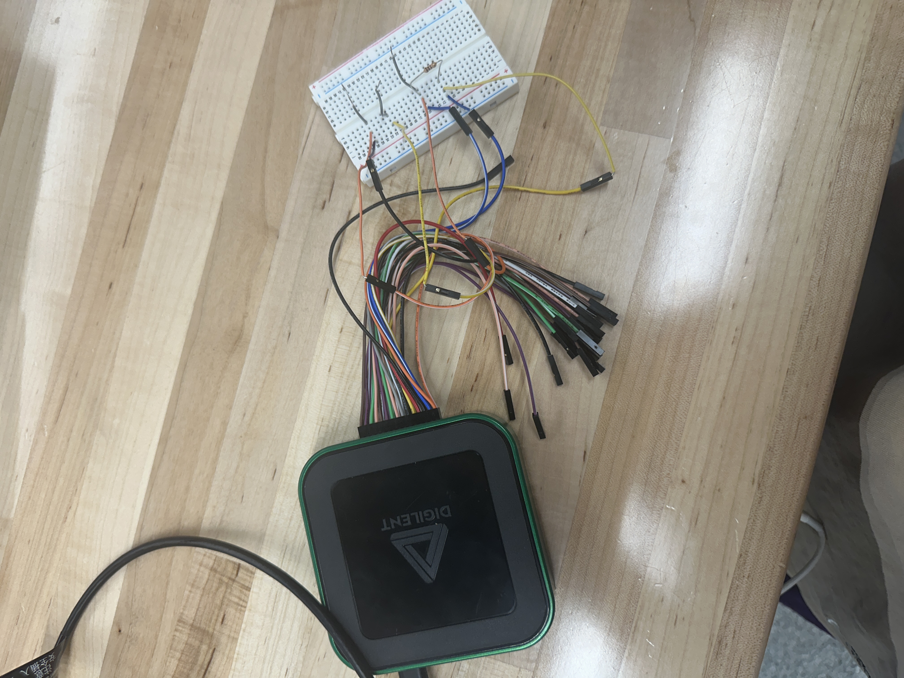

# SMU - Analog Discovery



A portable USB-powered test and measurement device, also known as the AD3, is a digital oscilloscope, logic analyzer, waveform generator, pattern generator, and much more. Digilent WaveForms software makes it easy to acquire, visualize, store, analyze, produce and reuse analog and digital signals.

***

## Hardware Specs

<table><thead><tr><th width="253">Product</th><th width="119">Cost (each)</th><th>Quantity</th></tr></thead><tbody><tr><td>Analog Discovery 3</td><td>$379</td><td>3</td></tr><tr><td>Jumper Cables set</td><td>$6.98</td><td>1</td></tr><tr><td>Micropositioners</td><td>TBD</td><td>4</td></tr></tbody></table>

Total Cost:

Setup Time:

***

## Technical Specs

* Output Voltage Range: ±5 V
* Accuracy:
  1. ±10 mV ± 0.5% (│Vout│ ≤ 1.25 V)&#x20;
  2. ±25 mV ± 0.5% (│Vout│ > 1.25 V)
* Number of channels: 2 (custom channels feature available)
* DC Current Drive: 30 mA maximum

***

## Setting up AD 3

1. Download the Waveforms software: [https://digilent.com/shop/software/digilent-waveforms/](https://digilent.com/shop/software/digilent-waveforms/)
2. Run the .exe installer
3. Plug the Analog Discovery 3s into the laptop and open up the Waveforms software.

***

## Circuit Setup&#x20;

Set up the circuit that connects the Analog Discovery 3 like this circuit diagram:

<figure><figcaption></figcaption></figure>

The actual circuit will look something like this:

<figure><figcaption></figcaption></figure>

## Manual Testing with Waveforms GUI (not sdk)

* For our purposes, click on Tracer (for IV Characterization).

<figure><figcaption><p>Waveforms Software</p></figcaption></figure>

* Click on drop down to select transistor type.

<figure><figcaption><p>Tracer Window</p></figcaption></figure>

* Select “No Adapter”

<figure><figcaption></figcaption></figure>

*   Select “Measure Id/Vgs” and set the ranges for the Vgs and Vds.

    <br>

    <figure><figcaption></figcaption></figure>
* Select step-size/no. of steps for both voltages.

<figure><figcaption></figcaption></figure>

* Click play (in the top right corner) and watch the magic!

<figure><figcaption></figcaption></figure>

* I-V Curve _for ZVN3310A Transistor_ on Curve Tracer _(replace this image with our chip curves)._

<figure><figcaption></figcaption></figure>

#### Suggestions:

* Can adjust current compliance for Gate if needed. (below the main toolbar, right above the graph).

***

## Automated testing with Waveforms SDK

Get the code from github by typing in terminal

```
>>> git clone https://github.com/joshna-ii/HackerFabSMU
```

Cd into this directory then run the below Python script in any environment where Python is installed by typing in terminal

```
>>> python3 smu.py
```

If this is the first time being run in this environment, make sure all dependencies are installed by typing the following command in terminal:

```
>>> pip install -r requirements.txt
```

***

