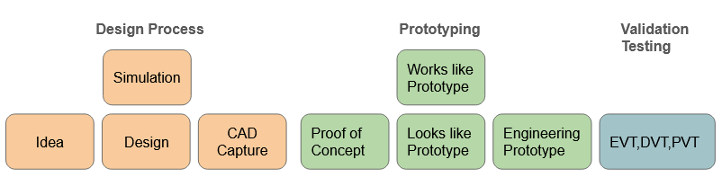

# Blu-Ray Lithography

## Introduction

This is the project page for a lithography system based on repurposing Blu-Ray drives. The initial goal is to reach a feature size of at least 500nm (2x the Blu-ray laser spot size). As a stretch goal, we would like to also use the sled and spindle motors as high speed nano-positioners and to spin coat and cure photo-resin.

## Project Status

<figure><figcaption></figcaption></figure>

Right now, the first project for this technology (Lithography Spinner V1) is in the research/idea stage. See work in progress page for details on upcoming tasks if you want to contribute.
