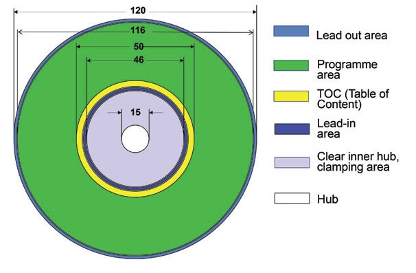

# Base Principles

This page contains topics that are good to know if you want to contribute to this project.&#x20;

## Optical

Minimum Spot Size (Rayleigh Criterion)

The Rayleigh criterion is a measure of the limit at which two points of light can be distinguished as separate. It states that two points are resolvable when the principal diffraction maximum of one image coincides with the first minimum of the other. In simpler terms, it defines the smallest angular separation at which two light sources appear distinctly separate rather than as a single blurred point. This criterion helps in understanding the resolving power of optical instruments.\
\
When the Rayleigh criterion is expressed in terms of the numerical aperture, the equation becomes:

$$d =\frac{0.61λ }{NA}$$

where:

* d is the minimum resolvable spot size,
* λ\lambda is the wavelength of light,
* NA is the numerical aperture of the lens.

-

    <figure><figcaption></figcaption></figure>

For blu-ray the wavelength is 405nm and the NA is 0.85 resulting in a spot size of 290nm.

### Source/Reference

1. Video explanation of resolution in optics (relevant info starts at 27:15 but the entire video is a great introduction to optics)\
   [https://www.youtube.com/watch?v=sTa-Hn\_eisw](https://www.youtube.com/watch?v=sTa-Hn_eisw)

Minimum Feature Size

The minimum feature size in transistors, often referred to as the "technology node" or "process node," represents the smallest dimension of a transistor on a semiconductor chip. This size is measured in nanometers (nm) and dictates how densely transistors can be packed on a chip, which in turn influences the chip's performance, power consumption, and overall size.

### Transistor sizes through the years (needs to be corrected)

| Year | Node Process | Width (nm) | Length (nm) |
| ---- | ------------ | ---------- | ----------- |
| 1968 | 20,000 nm    | 100 nm     | 20,000 nm   |
| 1971 | 10,000 nm    | 100 nm     | 10,000 nm   |
| 1974 | 6,000 nm     | 100 nm     | 6,000 nm    |
| 1977 | 3,000 nm     | 100 nm     | 3,000 nm    |
| 1981 | 1,500 nm     | 100 nm     | 1,500 nm    |
| 1984 | 1,000 nm     | 100 nm     | 1,000 nm    |
| 1987 | 800 nm       | 100 nm     | 800 nm      |
| 1990 | 600 nm       | 100 nm     | 600 nm      |
| 1993 | 350 nm       | 100 nm     | 350 nm      |
| 1996 | 250 nm       | 100 nm     | 250 nm      |
| 1999 | 180 nm       | 100 nm     | 180 nm      |
| 2001 | 130 nm       | 100 nm     | 130 nm      |
| 2003 | 90 nm        | 100 nm     | 90 nm       |
| 2005 | 65 nm        | 100 nm     | 65 nm       |
| 2007 | 45 nm        | 100 nm     | 45 nm       |
| 2009 | 32 nm        | 100 nm     | 32 nm       |
| 2010 | 28 nm        | 100 nm     | 28 nm       |
| 2012 | 22 nm        | 100 nm     | 22 nm       |
| 2014 | 14 nm        | 100 nm     | 14 nm       |
| 2016 | 10 nm        | 100 nm     | 10 nm       |
| 2018 | 7 nm         | 100 nm     | 7 nm        |
| 2020 | 5 nm         | 100 nm     | 5 nm        |
| 2022 | 3 nm         | 100 nm     | 3 nm        |

OPU Architecture

Note: It is recommended to keep the cover layer, whose thickness depends on the operation wavelength, in front of the OPU objective lens to guarantee optimal laser focusing. Microscopy cover glasses provide a similar refractive index (1.47 to 1.5) as the cover layer or one can simply use the disc hard-coat polycarbonate cover layer. Furthermore, the cover layer can be used for sealing microfluidic channels. OPU-based imaging or sensing through different media, such as liquid or gas, demands the optimization of the distance between the cover layer and measurement target

### Source

[https://pmc.ncbi.nlm.nih.gov/articles/PMC6066758/](https://pmc.ncbi.nlm.nih.gov/articles/PMC6066758/)

Photo-diode Auto-focus

Optical pickups focus on disc using the so called astigmatic method. This method is based on the deformation of the roundness of the laser beam when it is unfocused. The pickup has a series of lenses that lead the reflected ray to a photodiode array which generates four signals (A,B,C,D). Using them it is possible to deduct if the laser is unfocused and move the lens to focus it correctly.

\
Once you know the A,B,C,D signal pins, implementing the auto-focus algorithm is easy: just add A+C and subtract B+D from the result. The pickup returns those signals in the form of minimum current variations that depend on the laser light received by each photodiode. The photodiodes are arranged in a square (see following figure).

As you can see, it is possible to infer the focus level checking if the result is less than 0 (too close) equal to zero (focused) or greater than zero (too far) and with this information move the lens until the laser is focused.

\

### Sources

[http://www.diyouware.com/node/161](http://www.diyouware.com/node/161)\
[https://pmc.ncbi.nlm.nih.gov/articles/PMC6066758/](https://pmc.ncbi.nlm.nih.gov/articles/PMC6066758/)

## Mechanical

Mechanical Resolution - Step size

The minimum needed step size can be determined by the perimeter of the writing area and the minimum spot size

$$perimeter ={2 * π * radius}$$

* For the largest radius (58mm) the perimeter is 364mm
* For the smallest radius (23mm) the perimeter is 144mm

From there number of steps is calculated by:

&#x20;$$steps = \frac {perimeter}{min spot size}$$

Assuming a 290nm spot size:

* For the largest radius (58mm) the number of steps is 1.256M
* For the smallest radius (23mm) the number of steps is 498k

 (1).png>)

Mechanical Resolution - Repeatability

The planned approach for repeatability is closed loop control. Since the blu-ray system works on reading concentric circles each disc will have a pattern written along the ring perimeter that identifies what is the current ring radius. It will also be used to help identify the start position on the perimeter.

 (1).png>)

Maximum Wafer Size

Since this project plans to use a blu-ray drive, the working area is basically the entire readable area of a disc (including table of contents).&#x20;

* The start of the writing area for a disc is 46mm in diameter or 23mm in radius.
* The end of the writing area for a disc is 116mm in diameter or 58mm in radius.

Therefore the writing radius is about 35mm.

### Maximum Symmetrical Die

5x Symmetrical dies can fit on a disc assuming 30mm x 30mm  (900mm^2)&#x20;

 (1).png>)

### Maximum Asymmetrical Die

4x Asymmetrical dies can fit on a disc assuming 25mm x 50mm ( 1,250mm^2 )

 (1).png>)

Disc Revolution Speed

To calculate how fast the disc needs to spin we first need to know how fast the spot we need to image is moving. the speed is dependent on how far we are from the center of the disc.&#x20;

&#x20;If we assume a random rotational speed in revolutions per minute (rpm), we can use the following steps to calculate how fast the imaging spot is moving:

1. **Convert rpm to revolutions per nano-second (rpns):**

$$rpns =\frac{rpm }{60*10^{9}}$$

2. **Calculate the linear speed in nano-meters per nano-second (nm/ns):**

$$Linear speed (nm/ns)=radius (nm)×2×π×rpns$$

Assuming the disc is spinning at 500rpm:

* The smallest inner radius of the disc (23mm) is moving at roughly 1.24nm/ns&#x20;
* The largest outer radius of the disc (58mm) is moving at roughly 3.03nm/ns&#x20;

## Material

Positive and Negative Photo-resist (TBD)

Minimum Developed Spot Size (TBD)

## Relevant Works

Blu-Ray Specifications

### White Paper Blu-ray Disc Format General

[http://educypedia.karadimov.info/library/general\_bluraydiscformat-15263.pdf](http://educypedia.karadimov.info/library/general_bluraydiscformat-15263.pdf)

### White Paper Blu-ray Disc Format BD-R

[https://blog.ligos.net/images/The-Reliability-Of-Optical-Disks/BD-R\_physical\_specifications-18326.pdf](https://blog.ligos.net/images/The-Reliability-Of-Optical-Disks/BD-R_physical_specifications-18326.pdf)

### White Paper Blu-ray Disc Format BD-RE

[https://blog.ligos.net/images/The-Reliability-Of-Optical-Disks/White\_Paper\_BD-RE\_5th\_20180216.pdf](https://blog.ligos.net/images/The-Reliability-Of-Optical-Disks/White_Paper_BD-RE_5th_20180216.pdf)

Laser Scanning Microscope (Doctor Volt)

This is a 3 part video series where Doctor Volt dissects a Blu-ray player to figure out how to make a laser scanning microscope out of it.&#x20;

### PT1. Blu-Ray laser tear-down

[https://www.youtube.com/watch?v=liGuhbFh4IQ](https://www.youtube.com/watch?v=liGuhbFh4IQ)

### PT2. Mechanical Assembly

[https://www.youtube.com/watch?v=Hkialty\_8K4\&t=267s](https://www.youtube.com/watch?v=Hkialty_8K4\&t=267s)

### PT3. SW and Resolution Improvements

[https://www.youtube.com/watch?v=xfuWbnMYOos\&t=72s](https://www.youtube.com/watch?v=xfuWbnMYOos\&t=72s)

DVD Laser Assembly Tear-down (tsbrownie)

Functional walk through of laser head assembly

[https://www.youtube.com/watch?v=-7IRB7lb9lQ](https://www.youtube.com/watch?v=-7IRB7lb9lQ)

Edwin Hwu's Research Hacking Blu-Ray

### Hacking Blu-ray for High-Resolution 3D printing

[https://backend.orbit.dtu.dk/ws/files/239879723/SSDM2020\_Abstract\_Edwin.pdf](https://backend.orbit.dtu.dk/ws/files/239879723/SSDM2020_Abstract_Edwin.pdf)

### Hacking Blu-ray for High-Throughput 3D printing

\#Paper

[https://www.spiedigitallibrary.org/conference-proceedings-of-spie/11677/116770A/Hacking-blu-ray-drives-for-high-throughput-3D-printing/10.1117/12.2576491.short](https://www.spiedigitallibrary.org/conference-proceedings-of-spie/11677/116770A/Hacking-blu-ray-drives-for-high-throughput-3D-printing/10.1117/12.2576491.short)

\#Video

[https://www.youtube.com/watch?v=Fw8r5FBaPTI\&t=1281s](https://www.youtube.com/watch?v=Fw8r5FBaPTI\&t=1281s)

### Hacking CD/DVD/Blu-ray Optical Pickup Unit (OPU) for Fun and Scientific Research

[https://www.youtube.com/watch?v=5bqujaldaCQ](https://www.youtube.com/watch?v=5bqujaldaCQ)

### Hacking CD/DVD/Blu-ray for Biosensing

[https://pmc.ncbi.nlm.nih.gov/articles/PMC6066758/](https://pmc.ncbi.nlm.nih.gov/articles/PMC6066758/)

Tear-down of PHR-803T Laser Module (diyouware)

[http://www.diyouware.com/node/161](http://www.diyouware.com/node/161)

## Future Improvements&#x20;

 STED Lithography (reaching 100nm and below)

1. STED Microscopy\
   [https://www.youtube.com/watch?v=1pgpzHao1c0](https://www.youtube.com/watch?v=1pgpzHao1c0)
2. Two-beam OBL utilizes a doughnut-shaped inhibition beam to inhibit the photopolymerization triggered by the writing beam at the doughnut ring leading to reduced feature size and improved resolution \
   [https://www.nature.com/articles/ncomms3061](https://www.nature.com/articles/ncomms3061)
3. Super-resolved critical dimensions in far-field I-line photolithography\
   \
   [https://www.spiedigitallibrary.org/journals/journal-of-micro-nanolithography-mems-and-moems/volume-18/issue-1/013505/Super-resolved-critical-dimensions-in-far-field-I-line-photolithography/10.1117/1.JMM.18.1.013505.short](https://www.spiedigitallibrary.org/journals/journal-of-micro-nanolithography-mems-and-moems/volume-18/issue-1/013505/Super-resolved-critical-dimensions-in-far-field-I-line-photolithography/10.1117/1.JMM.18.1.013505.short)
4. Possible STED Architecture\
   \
   \
   Diagram of BSM. The fluorescence signal passes through multimode fiber B7 and is collimated by collimator lens B8 and narrowband emission filter B9. D1, laser diode; D2, beam splitter; D3, collimator lens; D4, dichroic filter; D5, photodiode; D6, objective lens (NA: 0.6); D7, Al-coated address pattern; B1, blue laser diode; B2, B3, beam splitters; B4, collimator lens; B5, dichroic filter; B6, 4.34 mm focal lens; B10, objective lens (NA: 0.85); B11, lens holder. B12, cover glass; B13, collimator astigmatic plate; B14, photodetector. ([https://pmc.ncbi.nlm.nih.gov/articles/PMC6066758/](https://pmc.ncbi.nlm.nih.gov/articles/PMC6066758/))

