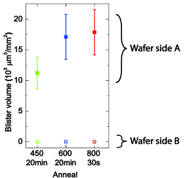

# Hardware

## Introduction

The HW needed to drive the OPU can be broken into 3 sections:

1. Motors
2. PMIC
3. Laser Diode

<figure><figcaption></figcaption></figure>

## Preliminary PCB

OPU\_Driver\_rev0p1 PCB CAD capture has been completed and is up for review on github here:

[https://github.com/offbyfour/OPU\_Driver/tree/main/Hardware/Kicad\_PCB](https://github.com/offbyfour/OPU_Driver/tree/main/Hardware/Kicad_PCB)



The board has been roughly quoted on JLCPCB:

* PCB= \~$35.00 / Ea
* Components = \~ $110.00 / Ea

3x Assembled PCBs = $550

At this time no orders are planned until firmware is far enough along to confirm pin out and FPGA logic size.
