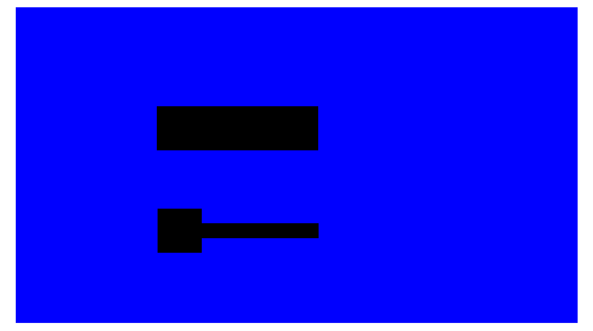
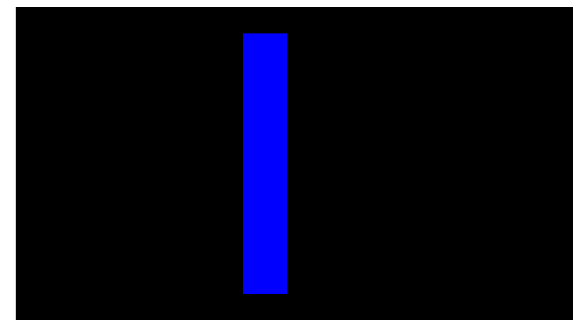
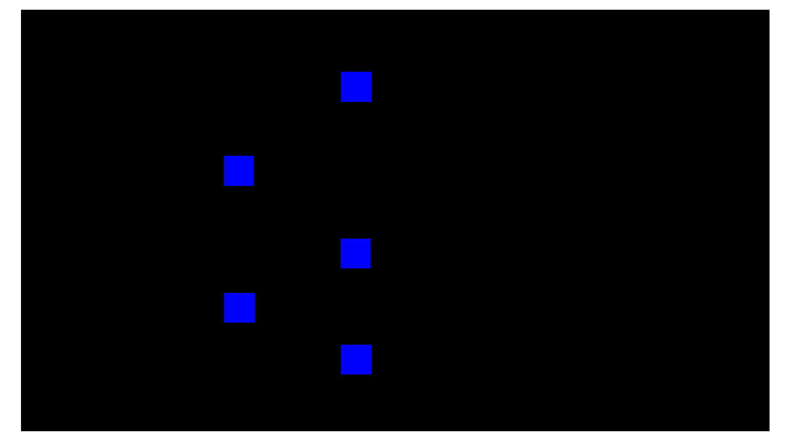
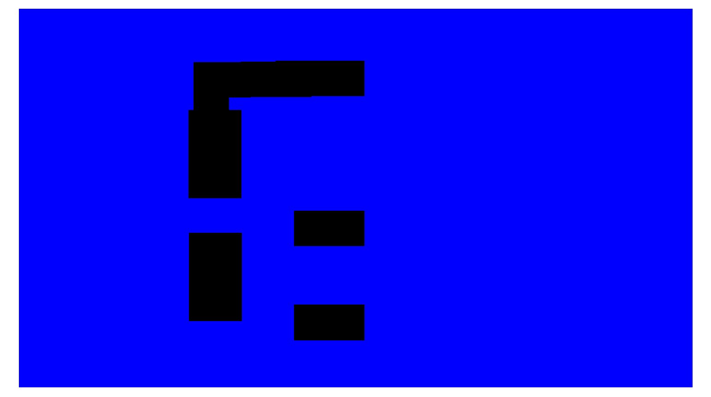
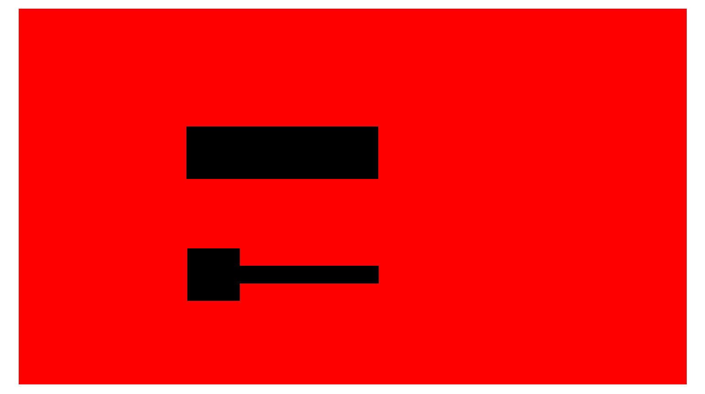

# Getting started with Klayout

1. Download Klayout from their websites and follow the instructions to install the software
2. After it is successfully installed, open the Klayout editor


3. To create a new layout File>>New Layout


4. Set the initial layer(s) that you need. The current hacker fab process would require 5 layers which are substrate, poly, active, contact, and aluminum. This is just for getting started, you can always add new layers later if you need to do so.


The layers will be shown in the upper right corner.&#x20;


5. Go to View>>Layer Toolbox to open the layer toolbox so that you can adjust the order of the layers and the texture of the layers based on your preference.


<br>

Double-click the layer to hide it. If you are drawing on a hidden layer, the following tip will show up.


6. To create a new layer, go to Edit>>Layer>>New Layer


7. Scroll your mouse to adjust the size of the grid


The grid can also be hidden through View>>Show Grid. When you need to export the masks as screenshots, the mask needs to be hidden.


8. Klayout has the following tools to draw the shapes. Press “shift” to draw straight lines.


9. Draw the rough shape of an object then adjust it to be the exact size by pressing “Q” to edit its property.


10. Mask Exporting (method 1):
    1. Go to Display>>Zoom Fit to maximize the size of the mask on the screenshot


2. Rename and sort the order of the layers according to the order of the fabrication steps. In this case, the easiest way is to sort them by name (0:substrate, 1:poly gate, 2:active layer, 3:contact hole, 4:aluminum)


3. To make the masks compatible with the lithography stepper, adjust the size of the substrate layer (layer 0 in this case) to be proportional to its resolution (3840x2160). In this set of masks, the size of the substrate layer is set to be 384x216. Under this setting, the actual size of the pattern coming from the stepper is 2.5 times the designed size.
4. Adjust the color and texture of the mask to be blue/red/black accordingly to make them compatible with the red focusing and UV focusing.


5. Hide or show certain layers based on the property of the mask and take screenshots via File>>Screenshot and save the mask.&#x20;
6. Corp the screenshots since the exported screenshot would normally have white sides.
7. See step 11 for an alternative way of exporting the masks using Python scripts


11. Mask Exporting (method 2):
    1. Set up steps are the same as Step 10 a. to c. steps.
    2. Go to Macros>>Macro Development to write Maros in Klayout


3. Select “Python” and change the Macro Template to “Plain Python file”


4. Paste the following code into the Python file you just created. 1

```
lv = pya.LayoutView.current()
ly = pya.CellView.active().layout()


# top cell bounding box in micrometer units
bbox = ly.top_cell().dbbox()


# compute an image size having the same aspect ratio than 
# the bounding box
w = 3840
h = int(0.5 + w * bbox.height() / bbox.width())


lv.save_image_with_options('/your_directory/your_picture_name.png', w, h, 0, 0, 0, bbox, True)
```

5. Change the path to the folder where you want your images to be saved. Note that if the name of your folder or file starts with a number, it will give you the following error message.


6. The .png file of your mask will be saved in black and white. Be sure to adjust the color and texture of the mask to be blue/red/black accordingly to make them compatible with the red focusing and UV focusing.


Reference:

1 GDS to image  [https://www.klayout.de/doc-qt5/programming/python.html](https://www.klayout.de/doc-qt5/programming/python.html)


Appendix 1. Klayout user guides

Klayout user manual from their websites:

[https://www.klayout.de/doc/manual/basic.html](https://www.klayout.de/doc/manual/basic.html)


Shorter one for getting started with basic functions:

[https://mycourses.aalto.fi/pluginfile.php/897248/mod\_resource/content/2/KLayout%20Guide.pdf](https://mycourses.aalto.fi/pluginfile.php/897248/mod_resource/content/2/KLayout%20Guide.pdf)<br>

Appendix 2. Masks for an NMOS enhancement load inverter

<div><figure><figcaption></figcaption></figure> <figure><figcaption></figcaption></figure> <figure><figcaption></figcaption></figure> <figure><figcaption></figcaption></figure> <figure><figcaption></figcaption></figure></div>

<br>
