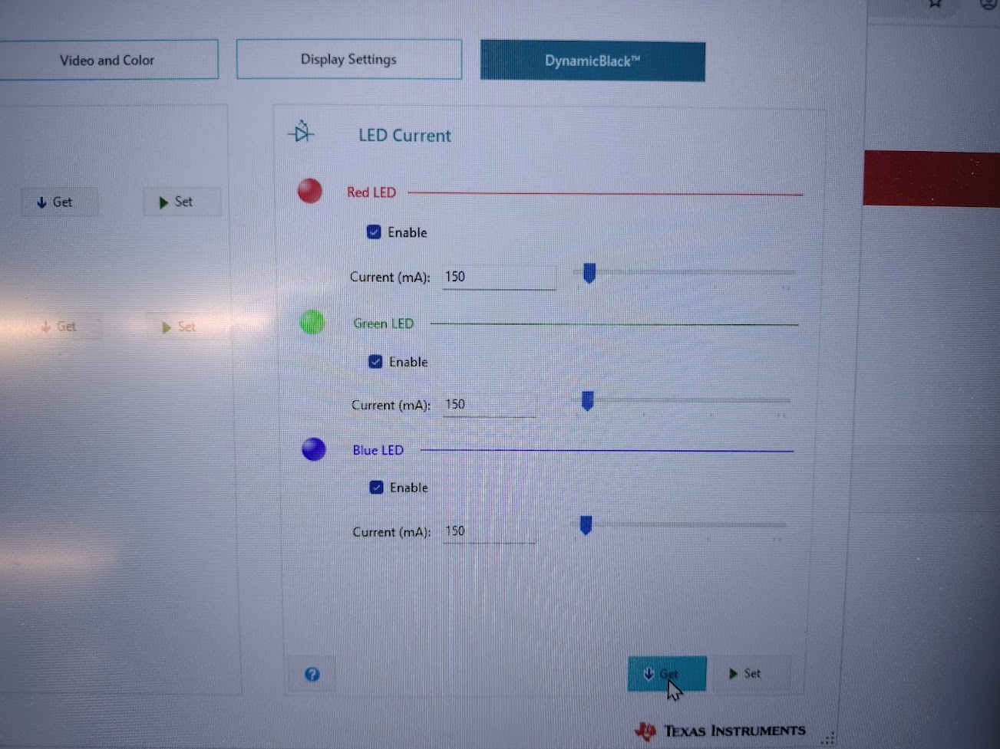
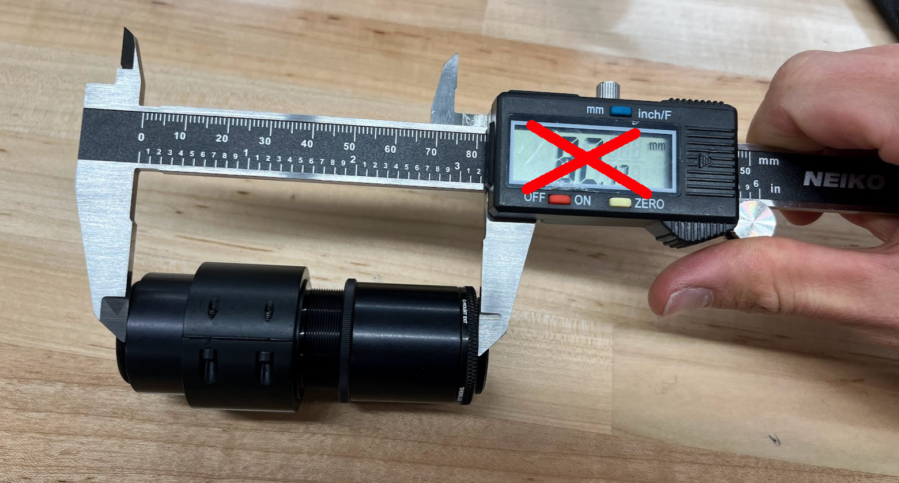
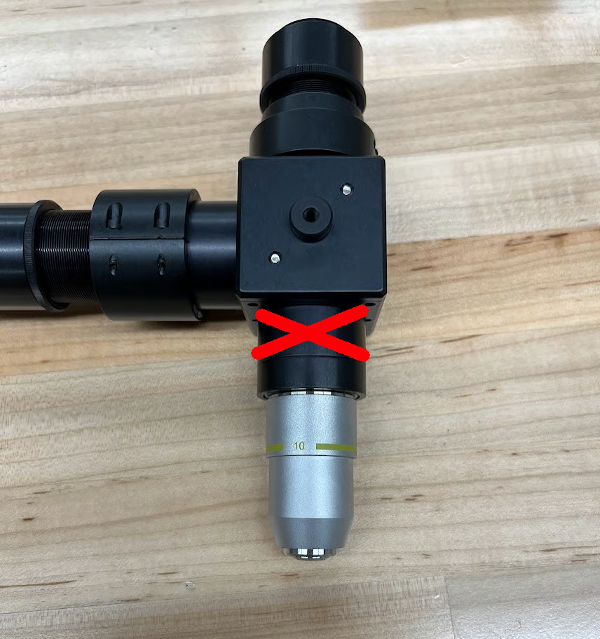
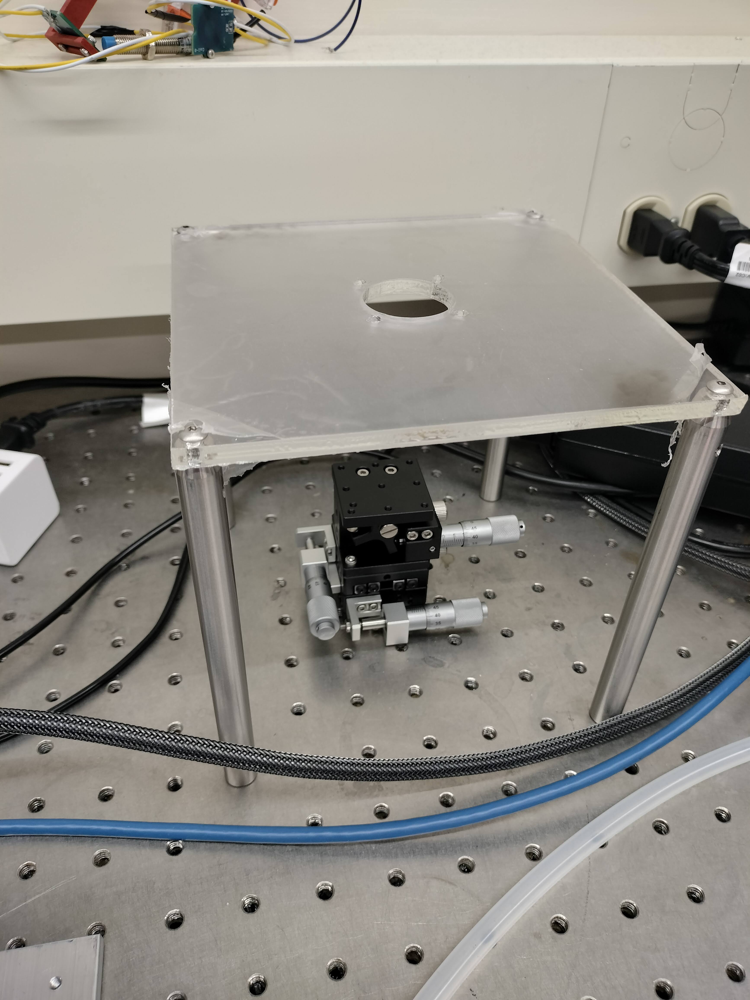
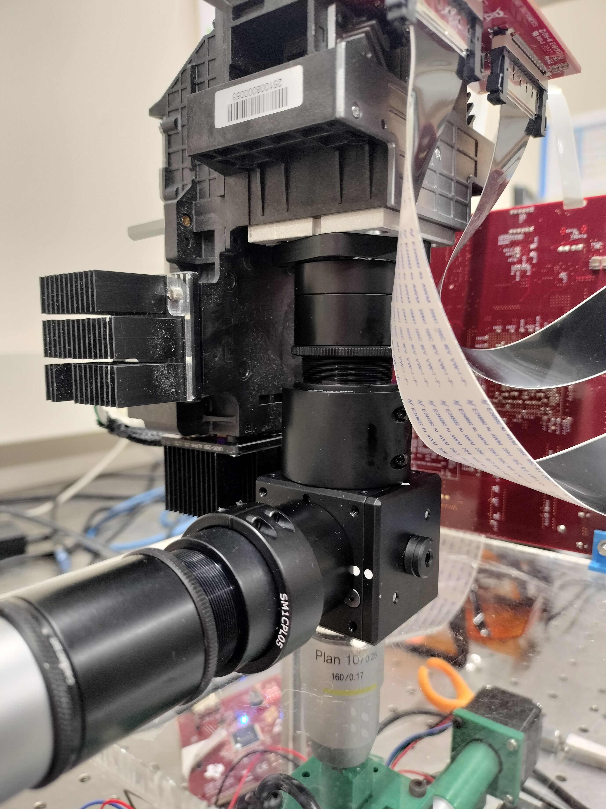
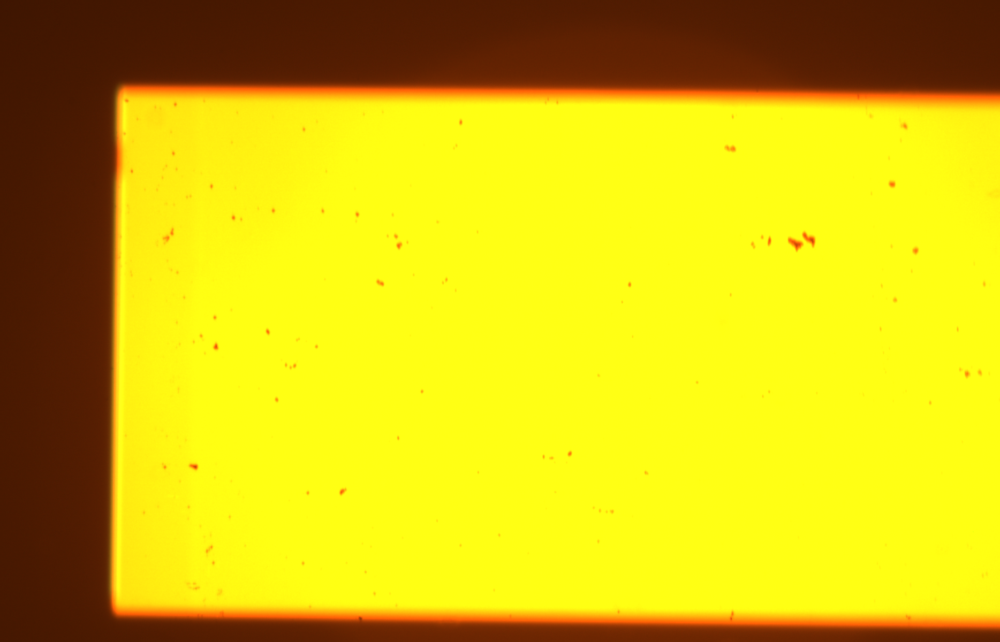
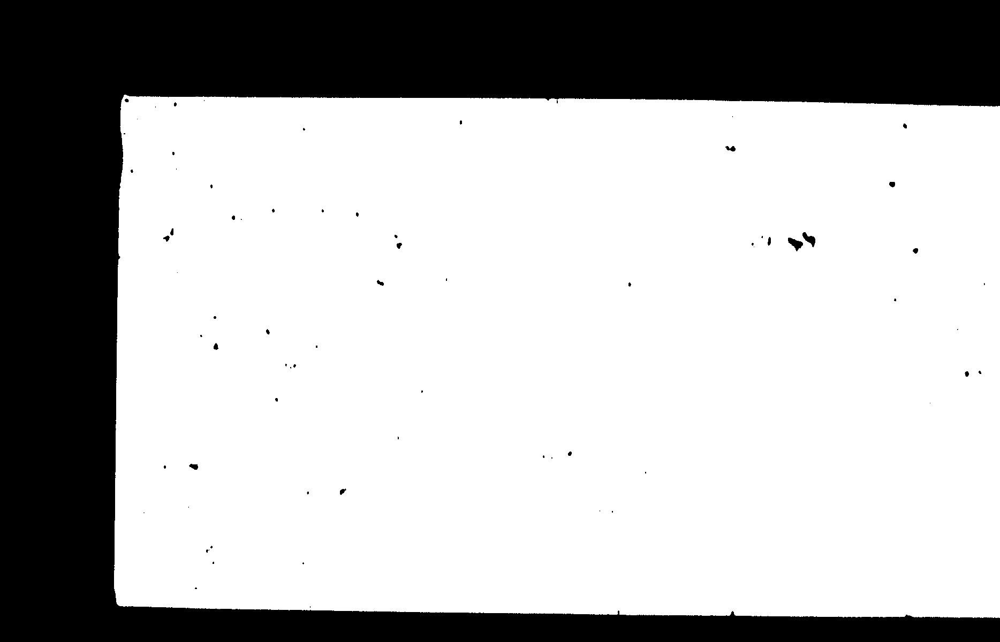

# Lithography Stepper V2.1

Stepper V2.1 is an incremental improvement upon the existing [Stepper V2](lithography-stepper-v2-build-work-in-progress.md) with mechanical improvements. As such, a lot of the content here will be the same as V2! The changes from V2 (and reasoning):

* Rotate the optics so that the objective points downward instead of sideways
  * This allows using the much-improved X and Y axes of the stage, instead of X and Z, which permits higher movement resolution and repeatability
  * This also means that we no longer need the vacuum chuck, which means reduced vibration (and less complexity)
  * Unlike Stepper V1, which was cantilevered, V2.1 is supported on all sides by rigid optical mounting posts, which should avoid V1's vibration issues
* Mount the optics and projector much more rigidly, using a plate offset by posts to secure the optics directly, rather than relying on the projector's case and rubber feet
  * This further reduces relative vibrations between the optics and stage
  * This also makes the DLP DMD plane and the chip plane more parallel == more consistent focus both across a single exposure and between exposures
  * This also decouples the structure of the stepper from the mechanical design of the projector (as Stepper V2 relies on the actual shape of the projector to work) which will allow us to change to a different projector in the future
* Switch from a FLIR Blackfly camera to a Basler Ace camera, and reduce the sensor size from 1" to 1/1.2"
  * Not only is the Basler less expensive for an equivalent sensor, it also has a much, much nicer software suite that is distributable (a particular pain point with FLIR's)
  * Smaller sensor size means we're paying for less unused sensor (since any sensor area outside of the size of the projector's DMD is not used)

As a whole, these changes should improve the results we get out of Stepper V2.1 compared to Stepper V2, and the mechanical changes will set the stage for further patterning capabilities such as reliable automatic alignment. Furthermore, the decoupling of the projector from the rest of the design will in the future allow us to use different projector for further improvements.

## Specifications&#x20;

| Spec                           | Value                                  |
| ------------------------------ | -------------------------------------- |
| Cost                           | $3,012.13                              |
| Build Time                     | 6 hours                                |
| Optical Resolution             | 1 µm                                   |
| Vibration susceptibility       | 1.2 µm (when built onto optical table) |
| Reticle (Exposure) Dimensions  | 1.04mm by 0.58mm                       |
| Exposure Time                  | 8 seconds                              |
| Mechanical Step Size           | 1.5 µm                                 |
| Maximum Wafer Size             | 1 cm x 1 cm                            |
| Size                           | 20 cm x 20 cm x 50 cm                  |

These remaining specs are from Stepper V2's documentation and have not been verified. The optical performance of both systems should be the same.

<table><thead><tr><th width="279">Spec</th><th>Value</th></tr></thead><tbody><tr><td>Developed Resolution</td><td>2 µm</td></tr><tr><td>Tiling Alignment Accuracy</td><td>5 µm</td></tr><tr><td>Overlay Alignment Accuracy</td><td>5 µm</td></tr><tr><td>Mechanical Repeatability</td><td>5 µm (to verify)</td></tr></tbody></table>

## Bill of Materials

Total cost as currently specified: $3,012.13

<table><thead><tr><th width="337">Name</th><th width="64">Quantity</th><th width="128">Total</th><th>Link</th></tr></thead><tbody><tr><td>TI DLP Evaluation Module</td><td>1</td><td>$1328.63</td><td><a href="https://www.mouser.com/ProductDetail/Texas-Instruments/DLPDLCR471TPEVM?qs=DRkmTr78QAQsT6dpWa8zKg%3D%3D">Mouser</a> (on backorder as of May 2025)</td></tr><tr><td>Assorted optics and optomechanics</td><td>1</td><td>$772.89</td><td><a href="https://www.thorlabs.com/uploadcart/">Thorlabs</a>*</td></tr><tr><td>10X Din Plan Objective</td><td>1</td><td>$159.00</td><td><a href="https://www.edmundoptics.com/p/10x-din-plan-commercial-grade-objective/5386/">Edmund Optics</a></td></tr><tr><td>Basler ace U acA1920-40uc</td><td>1</td><td>$609</td><td><a href="https://www.baslerweb.com/en-us/shop/aca1920-40uc/">Basler</a></td></tr><tr><td>USB Type A to Micro B locking cable</td><td>1</td><td>$3.99</td><td><a href="https://www.amazon.com/dp/B0CWN9YLSB">Amazon</a></td></tr><tr><td>19V 4.74A Projector Power Supply</td><td>1</td><td>$17.99</td><td><a href="https://www.amazon.com/Nobsound-Adapter-Universal-Charger-100-240V/dp/B074J81XRB/ref=sr_1_9?keywords=19v+power+supply&#x26;qid=1685981984&#x26;sr=8-9">Amazon</a></td></tr><tr><td>XYZ Stage 40mm</td><td>1</td><td>$125</td><td><a href="https://www.amazon.com/Pricision-40x40mm-Trimming-Bearing-Platform/dp/B07D7N9GT6/ref=sr_1_4?crid=32WSW494CE1YE&#x26;keywords=30mm+xyz+stage&#x26;qid=1706559232&#x26;sprefix=30mm+xyz+stage%2Caps%2C80&#x26;sr=8-4&#x26;ufe=app_do%3Aamzn1.fos.f5122f16-c3e8-4386-bf32-63e904010ad0">Amazon</a></td></tr><tr><td>NEMA 28 Steppers</td><td>3</td><td>$53.97</td><td><a href="https://www.amazon.com/gp/product/B07PNV7RBW/ref=ox_sc_act_title_1?smid=A3HCJ70Z0RHBT6&#x26;th=1">Amazon</a></td></tr><tr><td>Arduino Uno (Elegoo)</td><td>1</td><td>$16.99</td><td><a href="https://www.amazon.com/ELEGOO-Board-ATmega328P-ATMEGA16U2-Compliant/dp/B01EWOE0UU/ref=sr_1_6?crid=25HW74RSV1WUQ&#x26;keywords=arduino&#x26;qid=1706561234&#x26;sprefix=arduino%2Caps%2C115&#x26;sr=8-6">Amazon</a></td></tr><tr><td>CNC Shield for Arduino V3.0</td><td>1</td><td>$10.99</td><td><a href="https://www.amazon.com/Organizer-Expansion-Stepper-Heatsink-Arduino/dp/B07TT3C3HB/ref=sr_1_1?crid=3U63T1GH2IYGH&#x26;keywords=arduino+stepper+shield&#x26;qid=1706561169&#x26;sprefix=arduino+stepper+shield%2Caps%2C104&#x26;sr=8-1">Amazon</a></td></tr><tr><td>Stepper Motor Drivers</td><td>1</td><td>$22.99</td><td><a href="https://www.amazon.com/BIGTREETECH-Direct-TMC2208-TMC2209-TMC5160/dp/B07ZPYKL46?th=1">Amazon</a></td></tr><tr><td>Shield Power Supply 12V</td><td>2</td><td>$23.98</td><td><a href="https://www.amazon.com/ALITOVE-Adapter-Converter-100-240V-5-5x2-1mm/dp/B01GEA8PQA/ref=sr_1_4?keywords=12v+power+supply&#x26;qid=1706561572&#x26;sr=8-4">Amazon</a></td></tr><tr><td>M2.5 Screw Assortment</td><td>1</td><td>$16.99</td><td><a href="https://www.amazon.com/VIGRUE-Button-Washers-Assortment-Storage/dp/B08VHVB4H5/ref=sr_1_3?crid=24MVS2UJSXWC&#x26;keywords=m2.5&#x26;qid=1695828225&#x26;sprefix=m2.5%2Caps%2C112&#x26;sr=8-3">Amazon</a></td></tr><tr><td>410nm Lumiled LED</td><td>4</td><td>$27.96</td><td><a href="https://www.digikey.com/en/products/detail/lumileds/L1F3-U400200012000/7389568">Digikey</a></td></tr><tr><td>Pico-spox 10pos Vertical Connector</td><td>2</td><td>$1.86</td><td><a href="https://www.digikey.com/en/products/detail/molex/0874371043/717647">Digikey</a></td></tr><tr><td>Proximity sensors (4 pack)</td><td>1</td><td>$19.90</td><td><a href="https://www.amazon.com/Inductive-Proximity-Sensors-Anti-Interference-Unshielded/dp/B0DCMWDJ85/ref=asc_df_B0DCMWDJ85?mcid=4ec07ef204db32868c54b1f1f4eca62c&#x26;tag=hyprod-20&#x26;linkCode=df0&#x26;hvadid=693071814664&#x26;hvpos=&#x26;hvnetw=g&#x26;hvrand=5581199184906295329&#x26;hvpone=&#x26;hvptwo=&#x26;hvqmt=&#x26;hvdev=c&#x26;hvdvcmdl=&#x26;hvlocint=&#x26;hvlocphy=9005925&#x26;hvtargid=pla-2365125809402&#x26;th=1">Amazon</a></td></tr></tbody></table>

(Not included in BOM: misc. bolts)

\*For Thorlabs order: upload the file below to [Rapid Order](https://www.thorlabs.com/uploadcart/) to retrieve the cart:



## Design Files

Currently the CAD for Stepper 2.1 is all in FreeCAD, with the files stored in [this repo](https://github.com/hacker-fab/stepper_cad), but will be ported to Onshape soon for consistency.

<figure><figcaption>
Stepper V2.1
</figcaption></figure>

Several parts from Stepper V2's CAD are used on 2.1:

* [Adapter plate](https://cad.onshape.com/documents/64016e74334e9df7f3829a37/v/b7cf6897006e1bbfe46b354b/e/0e8c1f104c4c4708545e72bb)
* [Stage](https://cad.onshape.com/documents/0649d732771a63bcb8e6be1d/w/408d85c155072764ebeaefad/e/301b112b8d29652692865df3)

The software ([custom](https://github.com/hacker-fab/stepper) and [GRBL](https://github.com/grbl/grbl)) are the same as Stepper V2.

## Build Instructions

### Tools required

* 3D Printer
* SMD soldering tools (solder paste, reflow oven, tweezers)
* Calipers
* Metric and imperial allen wrench sets

### Fabricate the mechanical parts

There are several mechanical parts that will need to be fabricated:

* top plate x1: laser cut from acrylic or machined, from [V2.1 CAD](https://github.com/hacker-fab/stepper_cad) (`assembly.FCStd`, part `top_plate`)
* adapter plate x1: 3D printed or machined, from modified [V2 CAD](https://cad.onshape.com/documents/9a26802ff74766ab4a3300db/w/c38cc8ce466d94f1188a02dc/e/dc1e5fa1658c924bae41ec8a) (part `adapter-DLP471EVM` for the machined version, `adapter plate 3d print alt` for the 3d print version)
* PCB holder x1: 3D printed, CAD [here](https://cad.onshape.com/documents/10531a6d720ba41d9b6b0029/w/6ee9eb44d264029fe6767e9a/e/68128b59d67d22dde591e088). I can't make this one shared publicly due to weird permissions problems, this is a HackerFab admin issue.
* for builds that are not making use of an existing optical table: bottom plate. laser cut or machined, 1 inch grid of ¼ inch holes at least 6x6 inches

### UV LED PCB Assembly

This step is the same as for V2, see the instructions [here](lithography-stepper-v2-build-work-in-progress.md#solder-the-uv-led-pcb).

### Projector Modification

These steps are heavily based on the steps done for V2, but some have changed.

<figure><figcaption>
it works!
</figcaption></figure>

1. Test the projector before we completely take it apart :)

<figure><figcaption>
LED current settings in the software
</figcaption></figure>

2. Plug in the projector over USB and use the [LightCrafter GUI software](https://www.ti.com/tool/download/DLPDLC-GUI) to set the LED current to 150mA. (The projector defaults to 1023 mA, which is its maximum output - our UV LEDs are not able to handle that much current, so reducing the current makes sure they don't burn out!)

<figure><figcaption></figcaption></figure>

3. Unplug all the connectors and remove the top PCB by unscrewing the standoffs.

<figure><figcaption></figcaption></figure>

4. Remove the side PCB.

<figure><figcaption></figcaption></figure>

5. Unscrew and remove the shroud by sliding it away from the rest of the optics.

<figure><figcaption></figcaption></figure>

6. _**NEW FOR 2.1:**_ Remove the bolts and standoffs that hold the main projector assembly to the bottom plate. This should free the bottom assembly.

<figure><figcaption></figcaption></figure>

7. Unscrew and remove the heatsink for the front-most LED, which should be the blue one.

.png>).png>)

8. Disconnect the LED PCB from the cable. Heat it slightly on a hot plate or with a hot air gun to soften the adhesive and remove the black plastic housing.
9. Glue the black plastic piece to the DIY UV LED PCB, connect it to the blue cable, and reattach it to the optics housing. Put the heatsink back as well.

<figure><figcaption></figcaption></figure>

10. Unscrew the projection lens. That one makes things bigger, but we're trying to make things smaller. It's got to go.

<figure><figcaption></figcaption></figure>

11. Screw on the adapter plate with four countersunk M2 screws.

<figure><figcaption></figcaption></figure>

12. Use four M2.5 screws to screw on the Thorlabs SM1A53 adapter flange
13. _**NEW FOR 2.1:**_ Do not reassemble the projector case - we will use it as-is.

### Optics + Mechanics Assembly

These steps are heavily based on the same steps for V2, but slightly modified.

<figure><figcaption></figcaption></figure>

1. Start with the beamsplitter cube. Unscrew the set screws, remove the holder, and clip in the beamsplitter. The text ("Thorlabs") should be facing the microscope objective and camera when the holder is reinserted. Keep track of this during assembly and fix it later if necessary.

<figure><figcaption></figcaption></figure>

<figure><figcaption></figcaption></figure>

2. Assemble the DLP tube. From left to right, the parts in the first picture are 0.3" lens tube (SM1L03), 0.5" lens tube coupler (SM1CPL05), 0.5" adjustable lens tube (SM1V05), and 0.5" lens tube (SM1L05). You may want to remove any internal lens rings. The adjustable lens tube allows axial length adjustment and the coupler allows rotation about the optical axis.

<figure><figcaption></figcaption></figure>

3. Screw the DLP tube into the beamsplitter cube. The correct orientation is shown above, and the arrow points to the side of the beamsplitter with the text (and optical coating).
4. Assemble the camera tube, which similarly constructed. The parts are 1" lens tube (SM1L10), 1" lens tube coupler (SM1CPL10), 1" adjustable lens tube (SM1V10), another 1" lens tube (SM1L10), and C-mount SM1 adapter (SM1A9) (last two shown below).

<figure><figcaption></figcaption></figure>

5. Make sure this camera tube is 86.8 mm long. We calculate this number by subtracting the various component lengths from the standard microscope objective back focal length of 150mm: 150 - 17.5 (c-mount camera) - 7.6 (objective tube) - 38.1 (beamsplitter cube) = 86.8mm\
   \
   &#xNAN;**(NOTE:** Our objective is rated for a 160mm optical tube length, but this is NOT the same as the back focal length, which is 150mm... this is a very confusing specification, see [this page](https://www.edmundoptics.com/knowledge-center/application-notes/microscopy/understanding-microscopes-and-objectives/) for what lengths are what)

<figure><figcaption>
Camera and beamsplitter cube should be parallel.
</figcaption></figure>

6. Screw on the C-mount SM1 adapter (SM1A9) to the camera and the 1" lens tube. Adjust the lens tube coupler to align the camera with the beamsplitter cube.

<figure><figcaption>
(Photo has 1 tube piece that shouldn't be there)
</figcaption></figure>

7. Assemble the objective tube, which consists of a 0.3" lens tube (SM1L03), an SM1 to RMS adapter (SM1A3), and the microscope objective.

<figure><figcaption></figcaption></figure>

8. Use four #4-32 bolts to mount the beamsplitter cube to the top plate.

<figure><figcaption>
You should have the optics attached to the top of this by this point
</figcaption></figure>

9. Mount the top plate to either your optical table (if you have one) or the bottom plate. First, mount the posts to the bottom plate/table using four 1/4-20 bolts (if you're using a bottom plate) or four 1/4-20 grub screws (if you're using the table). Then, mount the top plate on top with four #8-32 bolts.

<figure><figcaption></figcaption></figure>

10. Temporarily loosen the top lens tube coupler in order to screw that tube into the projector, and finally tighten it again with the projector mounted.

<figure><figcaption></figcaption></figure>

11. Mount the main PCB with the power connector facing downward using the 3D printed PCB holder part. Reconnect the ribbon cables and LED power cables.

### Motion Stage Assembly

Print all of the parts in the table below. Any PLA is fine. You may need to re-orient them so they print well. The stepper mounts will all need small supports in the motor flange. The X and Y axes need other supports as well.

<table><thead><tr><th width="315">File Name w/ link</th><th width="362">Description</th><th width="224">QTY</th></tr></thead><tbody><tr><td>
<a href="https://cad.onshape.com/documents/0649d732771a63bcb8e6be1d/w/408d85c155072764ebeaefad/e/4f403f0e1f7a684bfcd56e85?renderMode=0&#x26;uiState=67a53479587ffd763470073c">Motor and Sensor Mounts</a> (Folder "XYZ Platform") "X Motor Mount" "Y Motor Mount" "Z Motor Mount" (Optional, for sensors:) "Y Sensor Mount" "Z Sensor Mount"

<a href="https://cad.onshape.com/documents/0649d732771a63bcb8e6be1d/w/408d85c155072764ebeaefad/e/7e61b99aaa271c30cf5b125b">Base V2.1</a>

"Base"
</td><td>Three parts that connect stepper motors to the micropositioning stage x , y and z axes.</td><td>1</td></tr><tr><td><a href="https://cad.onshape.com/documents/0649d732771a63bcb8e6be1d/w/408d85c155072764ebeaefad/e/4f403f0e1f7a684bfcd56e85?renderMode=0&#x26;uiState=67a53479587ffd763470073c">Motor and Sensor Mounts</a> (Folder "XYZ Platform") "Fixed Coupler"</td><td>Press fits onto micrometer and uses a grub screw to rigidly attach to motor D-shaft</td><td>2</td></tr><tr><td><a href="https://cad.onshape.com/documents/063eef6ab069a37e76b64c19/w/360bb32d9a47955784cca530/e/4050acd5b58cb3066cb89ced?renderMode=0&#x26;uiState=679ffdb2182b770fef09b329">Z Coupler</a> "Z Coupler"</td><td>Press fits onto micrometer and meshes with part press fit onto motor D-shaft</td><td>1</td></tr><tr><td>
<a href="https://cad.onshape.com/documents/0649d732771a63bcb8e6be1d/w/408d85c155072764ebeaefad/e/4f403f0e1f7a684bfcd56e85?renderMode=0&#x26;uiState=67a53479587ffd763470073c">Motor and Sensor Mount</a><a href="https://cad.onshape.com/documents/0649d732771a63bcb8e6be1d/w/408d85c155072764ebeaefad/e/4f403f0e1f7a684bfcd56e85?renderMode=0&#x26;uiState=67a53479587ffd763470073c">s</a>

"Upright Chip Mount"
</td><td>Provides a platform for the chip</td><td>1</td></tr></tbody></table>

A detailed 3D model of the fully-assembled stage is available in the [CAD](https://cad.onshape.com/documents/0649d732771a63bcb8e6be1d/w/408d85c155072764ebeaefad/e/301b112b8d29652692865df3) under the "XYZ Platform > Fully Assembled" document.

The video below describes the necessary components and the assembly process.


Build guide


### Electrical Assembly

To test the proximity switches, connect them to a 12V supply. The sensor output can be left unconnected. The red LED on the back of the switches should illuminate when the front of the sensor is held within \~4mm of a metal part of the stage, which will also pull the sensor output to ground.

**Note**: the limit switch pin block on the CNC shield has two rows of pins. One of the rows is connected only to ground; do not connect your limit switches to that row.

The sensors should be connected through a pull-up resistor to the Arduino's 5V supply. 12V should be supplied externally.

<figure><figcaption>
Wiring diagram for the sensors
</figcaption></figure>

TODO: Add picture of CNC shield!

### Software Setup

Instructions for installing and preparing the software are available on the [stepper software repository](https://github.com/hacker-fab/stepper).

The video below descries the basic electronics setup and how to install GRBL and integrate the two. Make sure to cross reference this with the stepper instructions above.



## Final Focusing

Once the software is set up, the final focus alignment can be done. These steps will align the two focus planes within the stepper (the projector and the camera) to ensure that images that appear in focus on the camera are actually in focus on the surface of the chip. This is done by adjusting the tube length between the projector housing and the beamsplitter cube (the length in the image below) such that both the projected image and the chip's surface are in focus in the camera view.

<figure><figcaption></figcaption></figure>

1. Load a chip with recognizable features into the stepper (a dirty chip is a good option).
2. Project a red-focus pattern with recognizable features that can be used to determine projector focus.
3. Adjust the Z position to focus onto the surface of the chip. This means that you should ensure that the features of the _chip_ (the dirt, most likely) is sharp, but the projected focus pattern most likely is not.
4. Loosen the clamp that connects the two parts of the DLP-beamsplitter tube so that they freely rotate. (the bottom circle in the image)
5. Loosen the locking ring on the adjustable lens tube. (the top circle in the image)
6. Screw the adjustable lens tube in/out while periodically checking to see if the projected image gets more or less in focus. You may need to push the optics into the coupler to ensure that the surfaces of the lens tubes are coplanar.
7. Once both images are in focus at the same time, tighten the locking ring on the adjustable lens tune as well as the coupler.

## Characterization

One of the core goals of Stepper V2.1 as compared to Stepper V2 is reduction of vibration through a more rigid frame. In order to test this, we characterized the amount of vibration that affects V2.1 using the following procedure:

1. Load a chip with recognizable features into the stepper and focus on it (in our testing, we just used a dirty chip)
2. Using the Basler Pylon Viewer software, collect a 10 second video clip of the surface of the chip. Pylon Viewer gives the video clip as a collection of `.tiff` frame images.\
   Here is an example of a single frame:

<figure><figcaption></figcaption></figure>

3. Use ImageMagick to threshold the frames: `magick '*.tiff' -channel G -threshold 75% -separate threshold.png` (this is a bulk operation on all frames).\
   Here is an example of a single frame:

<figure><figcaption></figcaption></figure>

4. Using an image editor, find a specific feature on the chip to focus on, and crop all of the frames to it: `magick 'threshold*.png' -crop 300x300+1000+800 crop.png` \
   Here is an example of a single frame, plus a GIF of the frames playing in real time:

<figure><figcaption></figcaption></figure>

<figure><figcaption>
GIF of playing in real time
</figcaption></figure>

5. Multiply the thresholded frames together to produce a footprint of where the feature moved throughout the duration: `magick 'crop*.png' -compose multiply -layers merge product.png`&#x20;

<figure><figcaption></figcaption></figure>

6. Subtract a frame from the footprint to produce an image that shows how much the feature meandered from its starting point: `magick product.png crop-0.png -compose subtract -composite diff.png`&#x20;

<figure><figcaption></figcaption></figure>

In this final image, all of the white pixels are deviations from the starting image. This allows us to count a maximum deviation: in this image (which is from when we were testing the effect of someone resting their hands on the table) there is a maximum 3 pixel deviation.

From this, we can calculate the maximum peak-to-peak vibration amplitude: each pixel on the camera sensor is 5.86 μm square, which after the 10x reduction of our objective, means each pixel in this image is 586 nm on the chip. 3 pixels then is 3 \* 586nm = 1.8 µm.

We also ran another test of "ideal" conditions, in which there was no external vibration added to the stepper table, which had 2px deviation. This leads to the result being 1.2 µm.

## Another Option for the Projector

As of October 2025, the [DLPDLCR471TPEVM projector](https://www.mouser.com/ProductDetail/Texas-Instruments/DLPDLCR471TPEVM?qs=DRkmTr78QAQsT6dpWa8zKg%3D%3D) is out of stock. However, Hunter G., an ECE Ph.D. student at Carnegie Mellon, figured out a way to make another project work. The model he used was the  [DLP4710EVM-LC](https://www.ti.com/tool/DLP4710EVM-LC).

<figure><figcaption></figcaption></figure>

Here is how he adapted it to work for the Stepper V2.1 build:

"The GUI and control seems to be identical to the recommended one, but the optics assembly was slightly different. The 3D printed adapter for the lens tube does not work with this model, so instead I machined an adapter out of 3/8" aluminum and tapped holes to screw in the lens tube adapter. I can send pictures and design files if you'd like.

Also, the LED PCB wiring is a bit different on this one, though the boards you gave me do actually fit pretty well. I've been using it with the stock blue LEDs because I was having trouble getting it to turn on the UV LEDs. I think the forward voltage might not be high enough on this model or something, but I need to debug that. I was reading that some people had success with the standard blue ones though, so I will give them a try before tearing the projector down again.\
\
Here's a photo of my adapter and the [design file](https://drive.google.com/file/d/1x0eyXnsHauO3VgQ_aGPtDOXjgl_YrOAo/view).\
.png>).png>)

The first photo is the original plastic part that came with the projector. It had a lens tube that stuck out a few inches from the plastic plate that you see. I cut that tube off with a saw and attempted to modify the plastic plate to fit the Thorlabs mount. However, the plastic was too soft to reliably tap threads. So, I measured it with calipers and made the attached DXF file.

I used a water jet to cut out the part, then marked the screw holes through the Thorlabs mount with a punch, drilled them out, and then tapped them. For the holes which connect it to the projector, I just drilled them out and used a M2 bolt + nut to fasten it to the projector. I also had to gouge out some areas on the adapter with a dremel because there are indexing nubs on the metal facet to align the original part with the optical path. I expected there to be some alignment issues but the camera and projector seem to align perfectly with this adapter.

<figure><figcaption></figcaption></figure>

Here's what it looks like assembled on the beamsplitter."

Thank you Hunter for sharing your alternative build with the Hacker Fab!

## Assessment and Future Work

This section is a reflection by me, Sky.

The core design goal of V2.1 was pretty much a mixture of "make it less susceptible to vibration" and "make it less janky". I think I mostly succeeded in this department: although I lack proper numbers on V2's vibration issues, I am confident in asserting that V2.1 fixes them (mainly because you could visually see the vibration occurring on V2's camera, and you can't anymore on V2.1), and now that we have a rigidly mounted frame, the slop from the projector moving around on the table is gone.

However, there's still definitely some improvements to be made. For one, I think that the projector should probably be more directly supported - I didn't end up adding a direct support for the projector this semester because it didn't appear to be necessary, but I think this could further reduce vibration issues. This shouldn't be particularly hard because the disassembled projector has very convenient standoff mounting points directly on it.

Another improvement to make is to fix up the centering of the image on the camera: currently, the hole on the adapter plate is perfectly centered to the part's center, but it appears that the projector's actual image is slightly off to one side. This wasn't really an issue when the camera had a larger sensor, but now that it's smaller it very slightly cuts off part of the image. This only require a small change to the adapter plate to correct.

Finally, one of the biggest issues that remains with the stepper is that the whole projector situation is not ideal: specifically, the fact that all of our existing litho setups have used projectors that hook up to a computer monitor output leads to a bunch of undesirable effects from the OS taking over (like unexpected popups showing up and getting imaged onto the chip). Another issue with the projector is that it's really not ideal to UV-mod a color projector: the projector is designed to _always_ be emitting all 3 color channels, which means that we're outputting a small but noticeable amount of UV even when not actively imaging. Also- the DLPDLCR471TPEVM projector used on V2 and V2.1 is currently (May 2025) out of stock everywhere in the world, which is very bad for reproducibility. One thing we could do to solve all of these issues is to create a custom projector design which gives us more control over UV emissions and the image pipeline. I have written up an essay on the design process and ideation behind a custom projector [here](https://docs.google.com/document/d/1_BkaYH9mCQQRQLMjm69QgOG-tz-MBY6FusZlHGJ0aoE/edit).
