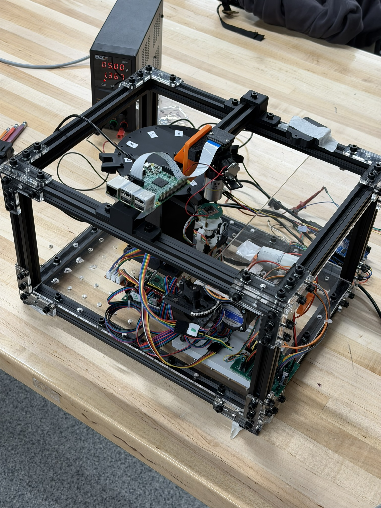

# 2D Crystal Stacking Robot (WIP)

#### What it is?

Two-dimensional crystals such as graphene and hexagonal boron nitride are atomically thin materials held together in stacked layers by Van der Waals forces. Their electronic and mechanical properties can change significantly when the layers are aligned at specific twist angles, creating unique behaviors such as superconductivity or enhanced conductivity.

<figure><figcaption>
Masubuchi, S., Morimoto, M., Morikawa, S. <em>et al.</em> Autonomous robotic searching and assembly of two-dimensional crystals to build van der Waals superlattices. <em>Nat Commun</em> 9, 1413 (2018). https://doi.org/10.1038/s41467-018-03723-w
</figcaption></figure>

Many of the labs have either DIYed their own 2D crystal stacking machine for their research or purchased industrial level platform like the one showing below.

<figure><figcaption>
Masubuchi, S., Morimoto, M., Morikawa, S. <em>et al.</em> Autonomous robotic searching and assembly of two-dimensional crystals to build van der Waals superlattices. <em>Nat Commun</em> 9, 1413 (2018). https://doi.org/10.1038/s41467-018-03723-w
</figcaption></figure>

The goal of this document is to explain in detail of our progress in developing a standard instructions on assembly affordable yet with nanometer precision 2D crystal stacking platform.

## System Overview

<figure><figcaption></figcaption></figure> <figure><figcaption></figcaption></figure>

The (WIP) 2D crystal stacking robot with all subsystems attached.&#x20;

### Submodules


Each submodule has their own individual subpages. You will have to follow each individual submodule assembly instruction before starting to integrate.


#### Microscope Module


Assembly and testing instructions for the Microscope Module is [here](microscope-camera-module.md)


<figure><figcaption></figcaption></figure> <figure><figcaption></figcaption></figure>

The Microscope Module provides operators with a clear, real-time view of 2D crystals such as graphene and hexagonal boron nitride during the selection and stacking process. It utilizes reflective optics to ensure proper illumination of the specimen, improving image clarity and visibility for precise alignment and manipulation.

#### Microscope Autofocus Stage


Assembly and testing instructions for the Microscope Autofocus Stage is [here](microscope-focus-module.md)


<figure><figcaption></figcaption></figure>

The microscope allows the user to have a look at the process and the stacked layers. However, this observation requires a focus on the object observed and so a system that changes the focal point is needed. This is the goal achieved by this module: it moves with little amplitude and high precision movements the microscope on the vertical absciss to obtain a clear observation of the process.

#### Frame


Assembly and testing instructions for the Frame is [here](frame/)


The frame holds the robot assembly together while mitigating external vibrations during stacking operations. Designed to be easy to reproduce with laser cut acrylic, 3D prints, and milled aluminum extrusion.

<figure><figcaption></figcaption></figure>

#### Central Control Software


Assembly and testing instructions for the Central Control Software is [here](central-control-software.md)


<figure><figcaption></figcaption></figure>

The central control Software is the gateway for operator to operate the 2D crystal stacking process. The software communicates with and control each individual sub-hardware components. The central control software contains GUI for user control dashboards and backend with router services for direct control with hardware protocols.&#x20;

#### Carousel


Assembly and testing instructions for the Carousel is [here](carousel-module/)


<figure><figcaption></figcaption></figure> <figure><figcaption></figcaption></figure>


To feed chips back into the carousel, follow these instructions to create the [Chip Return Stage](carousel-module/chip-return-stage.md)


The carousel is a subsystem of the project that enable the system to store chips and distribute them on a plate so it can switch between different chip materials. The carousel is a turning platform composed at its extremity of 10 chip holders to store the chips. A stepper motor is rotating the carousel while a linear actuator pushes the chips on the plate, the part of the system where the chip is used.

#### Nanopositioner


Assembly and testing instructions for the Nanopositioner is [here](../../../working-docs/nanopositioner-wip/)

The current 2D stacking robot is designed for version V3 of the Open Micro-manipulator, which is still compatible with all the custom designed add-ons from the Nanopositioning team


<figure><figcaption></figcaption></figure>

The Open Micro-manipulator in our mount for the 2D Crystal Stacking Robot responsible for X, Y, Z and theta movements during the stamping process. It also provides heating and vacuum to provide chip mounting stability and stamping required physics behavior.&#x20;

### Current Progress

<figure><figcaption></figcaption></figure>

All parts have been developed and tested individually. The entire system has been put together yet without complete stamping validation.

What has been validated includes:

* Frame structure integration (all parts fit precisely within the required precision)
* Carousel rotation and chip transfer&#x20;
* Camera video feed quality&#x20;
* Camera Module integrity&#x20;
* Central software control with the entire nano-positioner stage
* Central software with individual controls
