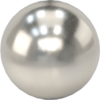

# Micromanipulator

<figure><figcaption>
Assembled micromanipulator v4 (with Kirby)
</figcaption></figure>

## Summary

This is a replica of version 4 of this open source project: [https://github.com/0x23/MicroManipulatorStepper](https://github.com/0x23/MicroManipulatorStepper). Almost all resources for assembly can be found here.

**NOTE:** As of June 2026, there is a complete guide for this project available on [StepWiseDocs](https://stepwisedocs.com/docs/projects/open-micro-manipulator-13). We recommend following their guide, but we leave the rest of this page as is in case anyone finds it helpful.

## BOM

Below is a list of materials used that worked for this particular build. Parts of the table are copied from the original repository.

Mechanics

| Name                   | Qty                                             | Dimensions                      | Comments                                                                            | Suggested Link                                                                                                                                                                                                                                                                                                                                                                                                                                                                                                                                                                                                                                                                            | Image                                                                             |
| ---------------------- | ----------------------------------------------- | ------------------------------- | ----------------------------------------------------------------------------------- | ----------------------------------------------------------------------------------------------------------------------------------------------------------------------------------------------------------------------------------------------------------------------------------------------------------------------------------------------------------------------------------------------------------------------------------------------------------------------------------------------------------------------------------------------------------------------------------------------------------------------------------------------------------------------------------------- | --------------------------------------------------------------------------------- |
| Steel ball             | 12                                              | Ø1 mm (0.04")                   | 1-2mm steel balls should work (e.g 1.2mm)                                           | 
<a href="https://www.mcmaster.com/9292K29/">mcmaster</a>

  
                                                                                                                                                                                                                                                                                                                                                                                                                                                                                                                                                                                                            |       |
| PU stretch cord        | 1m                                              | Ø1mm                            | Any polyurethane cord can be cut to size                                            | [amazon](https://www.amazon.com/dp/B001PZB57G?ref=ppx_yo2ov_dt_b_fed_asin_title\&th=1)                                                                                                                                                                                                                                                                                                                                                                                                                                                                                                                                                                                                    |   |
| Neodym Cylinder Magnet | 51                                              | Ø3mm h=5 mm                     | Diametrically (through diameter) or Axially Magnetized (through thickness) magnets. | [Mcmaster](https://www.mcmaster.com/5862K166/) or for cheaper but untested ([kj](https://www.kjmagnetics.com/d23-neodymium-cylinder-magnet?pl=1.1\&pf=))                                                                                                                                                                                                                                                                                                                                                                                                                                                                                                                                  |   |
| Solid Brass Pipe       | 17inch length                                   | Ø2mm                            | 
 
                                                                         | [Amazon](https://www.amazon.com/Brass-Round-Stock-Diameter-Length/dp/B087JYWMF9?crid=2MSE4C710OQL0\&dib=eyJ2IjoiMSJ9.nRVLbPYWOWcRdfNi323-OH727yGzIGIlSul1T3a4ZCT_hwJPbR3kgZ2MmnCDQG80L7EoHVN-XsyjuWbJ8eNEoXhYmBduJ5kJMYQoiM78J1WiC41bI8_qz2U2kN979auj62LcunocCxN4BXjVAT2Yj8jXxezl-mTX-zC5bGvvktSN8rpdR-ZenHADSoJjugkFsnr-cO_eGYy5CKsBCQMmQN5VoyXYo5x1vdvKDjJPGrk.wVpGJTBSLJC5C7KPi3I4z2bx5PMFYVQmZKupYMsJEow\&dib_tag=se\&keywords=2mm%2Bbrass%2Brod\&qid=1772059593\&sprefix=2mm%2Bbrass%2Brod%2Caps%2C127\&sr=8-3\&th=1)                                                                                                                                                                |   |
| Jewel Crimps           | 12 small crimps                                 | N/A (min 1mm diameter)          | 
 
                                                                         | [Amazon](https://www.amazon.com/dp/B011XYWVKS?ref=ppx_pop_mob_ap_share)                                                                                                                                                                                                                                                                                                                                                                                                                                                                                                                                                                                                                   |   |
| Metal Dowell pins      | 24                                              | M2x8mm                          | This is used for homing in the motor horns.                                         | [Amazon](https://www.amazon.com/MroMax-100pcs-Stainless-Rust-Proof-Elements/dp/B07ZFDH69F?crid=3GQBZVXZ81T9V\&dib=eyJ2IjoiMSJ9.rAuj2q7MDfZSxfwidntUABjGhtDyFKwCcZOjidLojN0BftNePnadOYXfdzalwX4incXfAqDkqkJj-FIm3SDWPt7BCes5eCU0l2mRMIpt55xEXwciTJyCkU9DGQ2fFAAfy3QqBcz7eAi-1LTvWYKqCjMm0XaD1UNSrvMeWqj_reWTQwGBOlhLMPXvVoJDKFhR2vOwa8tWt46QnCJOcSLkd5PV0lApcezLndPOLREQOKj1m_qvqbfnra5TxB3DMXbLic6wGKklElo3hNs-fSM_7JcBzRMYayrU7CoP3Ofjp5k.j_CIokd5ImK0iOPy59mZxAvdmU8_IUkBcruo0wIs-jw\&dib_tag=se\&keywords=2x8mm%2Bdowel%2Bpin\&qid=1772058639\&s=industrial\&sprefix=2x8mm%2Bdowel%2Bpin%2Cindustrial%2C105\&sr=1-2\&th=1)                                                             |   |
| M3 Counter sunk screws | 
12 total (9 long and 3 short)

 
 | 10mm for long and 6mm for short | 
 
                                                                         | [Amazon](https://www.amazon.com/Machine-Screws-Countersunk-Phillips-Assortment/dp/B0FD9SD33X?crid=3D7HW0UJ8JET\&dib=eyJ2IjoiMSJ9.NjfLGNyROzxfQVsSvFBWpo2ypCqWTBxr7I97AKBP0UulKLWSNJeSei32GDHKefgGUAMooP1KUh146gGs__0tBdjTcjwz30o6fPJLSh8Ew39uW0ru3xcZcKPWolovv-RhQJYQs90NSUKr49LQk4St_IP2HWUD-h9xr0nKkSKE5e4mJ_rHo8pX-a7QtHIb_cwIE6sx91BlAqwwT8qsFyj98ilI4hgtzPWGcA8mYTM8QICN-spVd5qPgzCxk-3p0mqmGx9SH0F7HvSYsJghCo3Y6Y8ja1dFRUv4MDO2qAze9wc.6OQ2bT1JHjP1wbJdMzurtZ3mjwF1mJepR4QcJVa5kmI\&dib_tag=se\&keywords=M3%2BCounter%2Bsunk%2Bscrews\&qid=1777432354\&s=industrial\&sbo=RZvfv%2F%2FHxDF%2BO5021pAnSA%3D%3D\&sprefix=m3%2Bcounter%2Bsunk%2Bscrews%2Cindustrial%2C169\&sr=1-3\&th=1) |   |
| M3 Screws              | 6                                               | 8mm                             | You can use the counter sunk screws for this but it might not be great              | [Amazon](https://www.amazon.com/Fgruh-750PCS-Assortment-Washers-Assorted/dp/B0FGV5FCBN?crid=24BDZZ4KZSARK\&dib=eyJ2IjoiMSJ9.XpE5QnFF_sYUsJVNrpIYGDJRRtDi_7FkD4eNplF0rBkBfwduaGnKwfDXYMgJA5LJEjxrLaV2JCKsgN2fIUU62BWg-wzLJIvQDWQ6ffEfu4frX-IfOhbLfM0gtg-XpJP9Ga1FzzCuWh1URsz6h0LCWASy6-HuU9eeSEoRaUrhXhcTxBlrX8FImjmAIG8UCvvG7d4LMef-ppFsgk4slDdU9aKBgwH3qnmAzN1KgyiIbs8.LOdo0AXgxr5NDtgFZUCBynDc0tjx7Rog3j1VI-uSPfU\&dib_tag=se\&keywords=M3+screws\&qid=1777432447\&sbo=RZvfv%2F%2FHxDF%2BO5021pAnSA%3D%3D\&sprefix=m3+screws%2Caps%2C180\&sr=8-3)                                                                                                                                       |   |
| M2 Screws              | 15                                              | 8mm                             | 
 
                                                                         | [Amazon](https://www.amazon.com/Fgruh-1260pcs-M2-Assortment-Stainless/dp/B0FG2CC91J?crid=1L429Y5M8GOWE\&dib=eyJ2IjoiMSJ9.0wCmUdMvoBGtxtd6YLnZyIFzsc07IkQt1MYESOzM9qFRIPmNzxLAwvlFW_xFHNOrtyDK96RcnssMJq1MYcpeZsMMJVNWxlxewWdR6VHo5hxUTdFhMsF5ZHiCAbmH20btClDCCxKKfw-_gtg0AjBzUHYaGbyh48iOqAMd_FeCkVKifbq3Zli-QF8CcIm5ro77EcW7CMNfzCIVG6dzlRLll99aF6Vwbx2sISFzzefIpP8smOZkvINO_s3CL0SPGwKwlWdcVFoNq3CdgxtocQkJe6_EphgfM2O51Ou2W-Z_ia0.Yz5Ctql9qIFIDh7sRvonpj8mUWLAob5Z0ZQoz_doNSQ\&dib_tag=se\&keywords=M2%2Bscrews%2Bcap%2Bhead\&qid=1777433246\&s=industrial\&sbo=RZvfv%2F%2FHxDF%2BO5021pAnSA%3D%3D\&sprefix=m2%2Bscrews%2Bcap%2Bhead%2Cindustrial%2C156\&sr=1-3\&th=1)                 |  |
| Blade                  | 1                                               | 
 
                     | This is for the rod sharpening jig. We will be bending off a piece of the blade.    | [Amazon](https://www.homedepot.com/p/Anvil-18-mm-and-9-mm-Snap-Off-Utility-Knife-Set-2-Piece-86-212-0111/303711777)                                                                                                                                                                                                                                                                                                                                                                                                                                                                                                                                                                       |  |

 

Electronics

| Name                                  | Qty     | Comments                                                                                        | Suggested Link                                                                                                                                                                                                                                                                                                                                                                                                                                                                                                                                                                                                                                                                                                                       | Image                                                                             |
| ------------------------------------- | ------- | ----------------------------------------------------------------------------------------------- | ------------------------------------------------------------------------------------------------------------------------------------------------------------------------------------------------------------------------------------------------------------------------------------------------------------------------------------------------------------------------------------------------------------------------------------------------------------------------------------------------------------------------------------------------------------------------------------------------------------------------------------------------------------------------------------------------------------------------------------ | --------------------------------------------------------------------------------- |
| DC-DC Step Down Module                | 1       | 12V->5V step down                                                                               | [Amazon](https://www.amazon.com/DAOKAI-Adjustable-Converter-Ultra-Small-Aeronautical/dp/B0B82GL5XN?crid=3ENKHXDD09Q5Y\&dib=eyJ2IjoiMSJ9.2oCHbIEzS4UWCnbQYmHniJTY9Fm072Ajr0k6PaqVBYTFRvpof4EQfhmyD4umzom-FSBpSD_0SznfGjyqkNqHUR-rozzCtmQGXMYpSnfN3V5QkwSlb145WeQm5rODoWTjdIGeTdyuiukoNpMI86I0ifwgpbXQ7azmgS4apjDW3vVq485H0bKxgQGqLsLyuqBwyzM5DZM2ussvTmRHMHM1L5bT136N_PnIgY7Et2TaChY.n6i3caN56z9it3JQ6o7VHxt6RLEoiNK1wzZ9r_5TX_0\&dib_tag=se\&keywords=Mini360+10+Pack+Buck+Converter+-+Step+Down+Power+Converter+4.75-23V+to+1.0-17V%2C\&nsdOptOutParam=true\&qid=1777433663\&sbo=RZvfv%2F%2FHxDF%2BO5021pAnSA%3D%3D\&sprefix=mini360+10+pack+buck+converter+-+step+down+power+converter+4.75-23v+to+1.0-17v%2C%2Caps%2C131\&sr=8-1) |  |
| 
1N5819 Diode

(TH or SMD)
 | 1       | If you want to keep the RPI and motor power source separate, don’t solder on the diode.         | [Amazon](https://www.amazon.com/dp/B0FC2CWKPL?ref=ppx_pop_mob_ap_share)                                                                                                                                                                                                                                                                                                                                                                                                                                                                                                                                                                                                                                                              |  |
| Raspberry Pi Pico 2                   | 1       | Do not use a Pico 1 for various compatibility issues (no FPU unit)                              | [Amazon](https://www.amazon.com/Color-Coded-Pre-soldered-Pico-Microcontroller-Dual-Architecture/dp/B0DJVJ8V85/ref=sr_1_2_sspa?crid=I07JKP0J7VAB\&dib=eyJ2IjoiMSJ9.KPUqyU71ipeEKFom-yLp7AGrpfQ11ryrSM-_U4BM5ZgRyFGgMsKUQs-U6oUJ-ZI5a6TuvYtCgekJGvRhuPMitMKtzdoBdm2M3DSkCejfU-2bW5lreQvIsv5HusT6UEsCTt0IVDDbCMVUqqVb0r5X23Eb_8xJQhrLhdNaecimdqp6tyH1J3q6hupJdfCcf5u7HHQ7PysantDrrpL3TO-1JcF15VUidBNoxlbDAb4RsVT8vuH2zsz_X55JOsK6QRqrDoUYH5MLR9P5QaiVIBQ-JdzUeAwx0jvScgQrLDitHko.BqsEAN1AplcRG2gK1akpcOt8eqEhTeqE04egujLvaXQ\&dib_tag=se\&keywords=pico+2\&qid=1773949012\&s=electronics\&sprefix=pico%2Celectronics%2C111\&sr=1-2-spons\&sp_csd=d2lkZ2V0TmFtZT1zcF9hdGY\&psc=1)                                                        |  |
| TB6612FNG Driver                      | 3       | 
 
                                                                                     | [Amazon](https://www.amazon.com/TB6612FNG-Driver-TB6612-Microcontroller-Replace/dp/B0F7RGWQ8B?crid=13OFL970TUE0P\&dib=eyJ2IjoiMSJ9.cERurX9L0mfoEltaYZMaISLLyGMtd9pP9_mi6SqECCPj4r8ASA1-HGIrsgLRSvMJeNd0RdVZO7eTd8T9TL9rHYzcKF_mWTalf5izyJ9DopWLpwBJm95f8NQVoGExGNSWerwzvQk1Ai_Pf-Ff5IJrsKF9Ad_Zkz_iWXnae0bwA1IKYU5IDp7t3uRreoBlp8gkkjnfz8d6g4_PocQgUQ2QZxAgXqNNCnKfNV2sEZ111oCMsa_ilbDxaV1wLFmiij1BDZchzip8uX83viBAbHpA2MpqMODtsH87gIDJcY7CkTA.P4EGd6x_owW575g4q56urlIlOe2wUPfRPTqUFTccZt4\&dib_tag=se\&keywords=L298N+dual+driver\&qid=1772058416\&s=industrial\&sprefix=l298n+dual+driver%2Cindustrial%2C109\&sr=1-5)                                                                                                              |  |
| 470 µF Electrolytic Capacitor         | 3       | 
 
                                                                                     | [Amazon](https://www.amazon.com/dp/B089R5TMGN?ref=ppx_pop_mob_ap_share)                                                                                                                                                                                                                                                                                                                                                                                                                                                                                                                                                                                                                                                              |  |
| MT6835 Magnetic Encoder Module        | 3       | 
 
                                                                                     | [Walmart](https://www.walmart.com/ip/MT6835-Magnetic-Encoder-Module-PWM-SPI-Brushless-Motor-21BIT-Encoder-Can-Replace-AS5048/8913803633?fulfillmentIntent=Shipping\&filters=%5B%7B%22intent%22%3A%22fulfillmentIntent%22%2C%22values%22%3A%5B%22Shipping%22%5D%7D%5D\&classType=REGULAR\&selectedSellerId=101293930\&from=/search)                                                                                                                                                                                                                                                                                                                                                                                                   |  |
| NEMA 17 Stepper Motor                 | 3       | 
12V 0.4A, 30Ohm resistance motors. 

 

! Note the resistance matters alot!
 | 
<a href="https://www.amazon.com/dp/B00PNEQ9T4?ref=emc_s_m_5_i_atc">Amazon</a>

 
                                                                                                                                                                                                                                                                                                                                                                                                                                                                                                                                                                                                                                      |  |
| JST 2mm 4 pin connectors              | 1 pair  | For main PCB                                                                                    | [Amazon](https://www.amazon.com/dp/B0CKZG2LXQ?ref=ppx_pop_mob_ap_share)                                                                                                                                                                                                                                                                                                                                                                                                                                                                                                                                                                                                                                                              |  |
| JST 2mm 8 pin connectors              | 1 pair  | For main PCB                                                                                    | [Amazon](https://www.amazon.com/dp/B0CKZG2LXQ?ref=ppx_pop_mob_ap_share)                                                                                                                                                                                                                                                                                                                                                                                                                                                                                                                                                                                                                                                              | Same as above                                                                     |
| JST 1.25 mm 6 pin connectors          | 3 pairs | For encoder connection                                                                          | [Amazon](https://www.amazon.com/dp/B0CZ6V3K66?ref=ppx_pop_mob_ap_share)                                                                                                                                                                                                                                                                                                                                                                                                                                                                                                                                                                                                                                                              |  |
| XT60H Power Jack                      | 1 pair  | 
 
                                                                                     | 
<a href="https://www.amazon.com/Amass-Bullet-Connector-Upgrated-Sheath/dp/B074PN6N4K">Amazon</a>

 
                                                                                                                                                                                                                                                                                                                                                                                                                                                                                                                                                                                                                   |  |
| DC Power supply and power jack        | 1       | 
 
                                                                                     | [Amazon](https://www.amazon.com/dp/B01GEA8PQA?ref=ppx_yo2ov_dt_b_fed_asin_title)                                                                                                                                                                                                                                                                                                                                                                                                                                                                                                                                                                                                                                                     |  |
| Pin headers                           | 1       | Technically not required but makes replacing chips significantly easier                         | [Amazon](https://www.amazon.com/Breadboard-20x40-pin-55x40-pin-Compatible-Projects/dp/B0FDBK8YTY?crid=25ZNT73D9BS8U\&dib=eyJ2IjoiMSJ9.0sZqwXnMSR4rprB9FDpXeVKLbsSNaSBvIwQhWTPq8IQjumJUVlZ6V5iKZE8MuGI_C4jo3smGFzF7hrMFvTyymmmXq5FYw-hrylFgIQobM87LuHBKgK5vjkU4ZzXADJgeFkV2GNu1sk08jG6oO0swasz0tEZ5xiZBNVNA-Qdg2nxVGFHFD0vpPx5cXHHoaprL43_IvC2pNBBf_xvPPxFRDj0W9NC5kYmMCzwAv3rgXMo.07_f9IeBY4DPtStXVc_zlpISLbHh0Yl2dXkhYq-81kA\&dib_tag=se\&keywords=pin%2Bheaders\&qid=1777833327\&sprefix=pin%2Bheaders%2Caps%2C241\&sr=8-4\&th=1)                                                                                                                                                                                                  |  |

\
 

### 3d Printed

Standard PLA filament for all prints. Estimated \~200g of filament depending on infill.

 

| Name             | Qty | Comments                                                                                                                    | Image                                                                                                 |
| ---------------- | --- | --------------------------------------------------------------------------------------------------------------------------- | ----------------------------------------------------------------------------------------------------- |
| Motor Horn       | 3   | 0.4 mm+ nozzle may require post-processing                                                                                  |                  |
| RubberBandCollet | 12  | 0.4 mm nozzle, 0.1mm Layer height + may require post-processing                                                             |  |
| Motor Mount      | 3   | 
 
                                                                                                                 |                |
| End Effector     | 1   | 
 
                                                                                                                 |              |
| Base Block       | 1   | 
 
                                                                                                                 |                  |
| Standing Base    | 1   | [Onshape](https://cad.onshape.com/documents/32ab534d89b47a2368354b18/w/076b5d3f56d289c4573f7795/e/4f55c246b8b4fa0fec42810a) |                      |

 

#### PCB

Technically both electrical boards (control and spi) could be done via bread board but the PCB is significantly easier and more reliable. The ball joint plate is required.

 

| Name               | Qty | Comments                                                                      | Image                                                                                                                                                                                                                                                                                                                                                                                                                                                                                        |
| ------------------ | --- | ----------------------------------------------------------------------------- | -------------------------------------------------------------------------------------------------------------------------------------------------------------------------------------------------------------------------------------------------------------------------------------------------------------------------------------------------------------------------------------------------------------------------------------------------------------------------------------------- |
| Control board      | 1   | 
 
                                                                   |                                                                                                                                                                                                                                                                                                                                                                                                             |
| Ball joint plate   | 6   | Could be laser cut or machined but PCB was simpler                            |                                                                                                                                                                                                                                                                                                                                                                                                             |
| SPI breakout board | 1   | Can be done via veroboard or perfboard but PCB is significantly more reliable | 
Mechanics

 

Electronics

  
<h3>3d Printed</h3>
Standard PLA filament for all prints. Estimated ~200g of filament depending on infill.

 

 
<h4>PCB</h4>
Technically both electrical boards (control and spi) could be done via bread board but the PCB is significantly easier and more reliable. The ball joint plate is required.

 
 |

| Name               | Qty | Comments                                                                      | Image                                                                             |
| ------------------ | --- | ----------------------------------------------------------------------------- | --------------------------------------------------------------------------------- |
| Control board      | 1   | 
 
                                                                   |  |
| Ball joint plate   | 6   | Could be laser cut or machined but PCB was simpler                            |  |
| SPI breakout board | 1   | Can be done via veroboard or perfboard but PCB is significantly more reliable |  |

| Name             | Qty | Comments                                                                                                                    | Image                                                                                                     |
| ---------------- | --- | --------------------------------------------------------------------------------------------------------------------------- | --------------------------------------------------------------------------------------------------------- |
| Motor Horn       | 3   | 0.4 mm+ nozzle may require post-processing                                                                                  |                  |
| RubberBandCollet | 12  | 0.4 mm nozzle, 0.1mm Layer height + may require post-processing                                                             |  |
| Motor Mount      | 3   | 
 
                                                                                                                 |                |
| End Effector     | 1   | 
 
                                                                                                                 |              |
| Base Block       | 1   | 
 
                                                                                                                 |                  |
| Standing Base    | 1   | [Onshape](https://cad.onshape.com/documents/32ab534d89b47a2368354b18/w/076b5d3f56d289c4573f7795/e/4f55c246b8b4fa0fec42810a) |                          |

| Name                                  | Qty     | Comments                                                                                        | Suggested Link                                                                                                                                                                                                                                                                                                                                                                                                                                                                                                                                                                                                                                                                                                                       | Image                                                                             |
| ------------------------------------- | ------- | ----------------------------------------------------------------------------------------------- | ------------------------------------------------------------------------------------------------------------------------------------------------------------------------------------------------------------------------------------------------------------------------------------------------------------------------------------------------------------------------------------------------------------------------------------------------------------------------------------------------------------------------------------------------------------------------------------------------------------------------------------------------------------------------------------------------------------------------------------ | --------------------------------------------------------------------------------- |
| DC-DC Step Down Module                | 1       | 12V->5V step down                                                                               | [Amazon](https://www.amazon.com/DAOKAI-Adjustable-Converter-Ultra-Small-Aeronautical/dp/B0B82GL5XN?crid=3ENKHXDD09Q5Y\&dib=eyJ2IjoiMSJ9.2oCHbIEzS4UWCnbQYmHniJTY9Fm072Ajr0k6PaqVBYTFRvpof4EQfhmyD4umzom-FSBpSD_0SznfGjyqkNqHUR-rozzCtmQGXMYpSnfN3V5QkwSlb145WeQm5rODoWTjdIGeTdyuiukoNpMI86I0ifwgpbXQ7azmgS4apjDW3vVq485H0bKxgQGqLsLyuqBwyzM5DZM2ussvTmRHMHM1L5bT136N_PnIgY7Et2TaChY.n6i3caN56z9it3JQ6o7VHxt6RLEoiNK1wzZ9r_5TX_0\&dib_tag=se\&keywords=Mini360+10+Pack+Buck+Converter+-+Step+Down+Power+Converter+4.75-23V+to+1.0-17V%2C\&nsdOptOutParam=true\&qid=1777433663\&sbo=RZvfv%2F%2FHxDF%2BO5021pAnSA%3D%3D\&sprefix=mini360+10+pack+buck+converter+-+step+down+power+converter+4.75-23v+to+1.0-17v%2C%2Caps%2C131\&sr=8-1) |  |
| 
1N5819 Diode

(TH or SMD)
 | 1       | If you want to keep the RPI and motor power source separate, don’t solder on the diode.         | [Amazon](https://www.amazon.com/dp/B0FC2CWKPL?ref=ppx_pop_mob_ap_share)                                                                                                                                                                                                                                                                                                                                                                                                                                                                                                                                                                                                                                                              |  |
| Raspberry Pi Pico 2                   | 1       | Do not use a Pico 1 for various compatibility issues (no FPU unit)                              | [Amazon](https://www.amazon.com/Color-Coded-Pre-soldered-Pico-Microcontroller-Dual-Architecture/dp/B0DJVJ8V85/ref=sr_1_2_sspa?crid=I07JKP0J7VAB\&dib=eyJ2IjoiMSJ9.KPUqyU71ipeEKFom-yLp7AGrpfQ11ryrSM-_U4BM5ZgRyFGgMsKUQs-U6oUJ-ZI5a6TuvYtCgekJGvRhuPMitMKtzdoBdm2M3DSkCejfU-2bW5lreQvIsv5HusT6UEsCTt0IVDDbCMVUqqVb0r5X23Eb_8xJQhrLhdNaecimdqp6tyH1J3q6hupJdfCcf5u7HHQ7PysantDrrpL3TO-1JcF15VUidBNoxlbDAb4RsVT8vuH2zsz_X55JOsK6QRqrDoUYH5MLR9P5QaiVIBQ-JdzUeAwx0jvScgQrLDitHko.BqsEAN1AplcRG2gK1akpcOt8eqEhTeqE04egujLvaXQ\&dib_tag=se\&keywords=pico+2\&qid=1773949012\&s=electronics\&sprefix=pico%2Celectronics%2C111\&sr=1-2-spons\&sp_csd=d2lkZ2V0TmFtZT1zcF9hdGY\&psc=1)                                                        |  |
| TB6612FNG Driver                      | 3       | 
 
                                                                                     | [Amazon](https://www.amazon.com/TB6612FNG-Driver-TB6612-Microcontroller-Replace/dp/B0F7RGWQ8B?crid=13OFL970TUE0P\&dib=eyJ2IjoiMSJ9.cERurX9L0mfoEltaYZMaISLLyGMtd9pP9_mi6SqECCPj4r8ASA1-HGIrsgLRSvMJeNd0RdVZO7eTd8T9TL9rHYzcKF_mWTalf5izyJ9DopWLpwBJm95f8NQVoGExGNSWerwzvQk1Ai_Pf-Ff5IJrsKF9Ad_Zkz_iWXnae0bwA1IKYU5IDp7t3uRreoBlp8gkkjnfz8d6g4_PocQgUQ2QZxAgXqNNCnKfNV2sEZ111oCMsa_ilbDxaV1wLFmiij1BDZchzip8uX83viBAbHpA2MpqMODtsH87gIDJcY7CkTA.P4EGd6x_owW575g4q56urlIlOe2wUPfRPTqUFTccZt4\&dib_tag=se\&keywords=L298N+dual+driver\&qid=1772058416\&s=industrial\&sprefix=l298n+dual+driver%2Cindustrial%2C109\&sr=1-5)                                                                                                              |  |
| 470 µF Electrolytic Capacitor         | 3       | 
 
                                                                                     | [Amazon](https://www.amazon.com/dp/B089R5TMGN?ref=ppx_pop_mob_ap_share)                                                                                                                                                                                                                                                                                                                                                                                                                                                                                                                                                                                                                                                              |  |
| MT6835 Magnetic Encoder Module        | 3       | 
 
                                                                                     | [Walmart](https://www.walmart.com/ip/MT6835-Magnetic-Encoder-Module-PWM-SPI-Brushless-Motor-21BIT-Encoder-Can-Replace-AS5048/8913803633?fulfillmentIntent=Shipping\&filters=%5B%7B%22intent%22%3A%22fulfillmentIntent%22%2C%22values%22%3A%5B%22Shipping%22%5D%7D%5D\&classType=REGULAR\&selectedSellerId=101293930\&from=/search)                                                                                                                                                                                                                                                                                                                                                                                                   |  |
| NEMA 17 Stepper Motor                 | 3       | 
12V 0.4A, 30Ohm resistance motors. 

 

! Note the resistance matters alot!
 | 
<a href="https://www.amazon.com/dp/B00PNEQ9T4?ref=emc_s_m_5_i_atc">Amazon</a>

 
                                                                                                                                                                                                                                                                                                                                                                                                                                                                                                                                                                                                                                      |  |
| JST 2mm 4 pin connectors              | 1 pair  | For main PCB                                                                                    | [Amazon](https://www.amazon.com/dp/B0CKZG2LXQ?ref=ppx_pop_mob_ap_share)                                                                                                                                                                                                                                                                                                                                                                                                                                                                                                                                                                                                                                                              |  |
| JST 2mm 8 pin connectors              | 1 pair  | For main PCB                                                                                    | [Amazon](https://www.amazon.com/dp/B0CKZG2LXQ?ref=ppx_pop_mob_ap_share)                                                                                                                                                                                                                                                                                                                                                                                                                                                                                                                                                                                                                                                              | Same as above                                                                     |
| JST 1.25 mm 6 pin connectors          | 3 pairs | For encoder connection                                                                          | [Amazon](https://www.amazon.com/dp/B0CZ6V3K66?ref=ppx_pop_mob_ap_share)                                                                                                                                                                                                                                                                                                                                                                                                                                                                                                                                                                                                                                                              |  |
| XT60H Power Jack                      | 1 pair  | 
 
                                                                                     | 
<a href="https://www.amazon.com/Amass-Bullet-Connector-Upgrated-Sheath/dp/B074PN6N4K">Amazon</a>

 
                                                                                                                                                                                                                                                                                                                                                                                                                                                                                                                                                                                                                   |  |
| DC Power supply and power jack        | 1       | 
 
                                                                                     | [Amazon](https://www.amazon.com/dp/B01GEA8PQA?ref=ppx_yo2ov_dt_b_fed_asin_title)                                                                                                                                                                                                                                                                                                                                                                                                                                                                                                                                                                                                                                                     |  |
| Pin headers                           | 1       | Technically not required but makes replacing chips significantly easier                         | [Amazon](https://www.amazon.com/Breadboard-20x40-pin-55x40-pin-Compatible-Projects/dp/B0FDBK8YTY?crid=25ZNT73D9BS8U\&dib=eyJ2IjoiMSJ9.0sZqwXnMSR4rprB9FDpXeVKLbsSNaSBvIwQhWTPq8IQjumJUVlZ6V5iKZE8MuGI_C4jo3smGFzF7hrMFvTyymmmXq5FYw-hrylFgIQobM87LuHBKgK5vjkU4ZzXADJgeFkV2GNu1sk08jG6oO0swasz0tEZ5xiZBNVNA-Qdg2nxVGFHFD0vpPx5cXHHoaprL43_IvC2pNBBf_xvPPxFRDj0W9NC5kYmMCzwAv3rgXMo.07_f9IeBY4DPtStXVc_zlpISLbHh0Yl2dXkhYq-81kA\&dib_tag=se\&keywords=pin%2Bheaders\&qid=1777833327\&sprefix=pin%2Bheaders%2Caps%2C241\&sr=8-4\&th=1)                                                                                                                                                                                                  |  |

| Name                   | Qty                                             | Dimensions                      | Comments                                                                            | Suggested Link                                                                                                                                                                                                                                                                                                                                                                                                                                                                                                                                                                                                                                                                            | Image                                                                             |
| ---------------------- | ----------------------------------------------- | ------------------------------- | ----------------------------------------------------------------------------------- | ----------------------------------------------------------------------------------------------------------------------------------------------------------------------------------------------------------------------------------------------------------------------------------------------------------------------------------------------------------------------------------------------------------------------------------------------------------------------------------------------------------------------------------------------------------------------------------------------------------------------------------------------------------------------------------------- | --------------------------------------------------------------------------------- |
| Steel ball             | 12                                              | Ø1 mm (0.04")                   | 1-2mm steel balls should work (e.g 1.2mm)                                           | 
<a href="https://www.mcmaster.com/9292K29/">mcmaster</a>

  
                                                                                                                                                                                                                                                                                                                                                                                                                                                                                                                                                                                                            |   |
| PU stretch cord        | 1m                                              | Ø1mm                            | Any polyurethane cord can be cut to size                                            | [amazon](https://www.amazon.com/dp/B001PZB57G?ref=ppx_yo2ov_dt_b_fed_asin_title\&th=1)                                                                                                                                                                                                                                                                                                                                                                                                                                                                                                                                                                                                    |   |
| Neodym Cylinder Magnet | 51                                              | Ø3mm h=5 mm                     | Diametrically (through diameter) or Axially Magnetized (through thickness) magnets. | [Mcmaster](https://www.mcmaster.com/5862K166/) or for cheaper but untested ([kj](https://www.kjmagnetics.com/d23-neodymium-cylinder-magnet?pl=1.1\&pf=))                                                                                                                                                                                                                                                                                                                                                                                                                                                                                                                                  |  |
| Solid Brass Pipe       | 17inch length                                   | Ø2mm                            | 
 
                                                                         | [Amazon](https://www.amazon.com/Brass-Round-Stock-Diameter-Length/dp/B087JYWMF9?crid=2MSE4C710OQL0\&dib=eyJ2IjoiMSJ9.nRVLbPYWOWcRdfNi323-OH727yGzIGIlSul1T3a4ZCT_hwJPbR3kgZ2MmnCDQG80L7EoHVN-XsyjuWbJ8eNEoXhYmBduJ5kJMYQoiM78J1WiC41bI8_qz2U2kN979auj62LcunocCxN4BXjVAT2Yj8jXxezl-mTX-zC5bGvvktSN8rpdR-ZenHADSoJjugkFsnr-cO_eGYy5CKsBCQMmQN5VoyXYo5x1vdvKDjJPGrk.wVpGJTBSLJC5C7KPi3I4z2bx5PMFYVQmZKupYMsJEow\&dib_tag=se\&keywords=2mm%2Bbrass%2Brod\&qid=1772059593\&sprefix=2mm%2Bbrass%2Brod%2Caps%2C127\&sr=8-3\&th=1)                                                                                                                                                                |  |
| Jewel Crimps           | 12 small crimps                                 | N/A (min 1mm diameter)          | 
 
                                                                         | [Amazon](https://www.amazon.com/dp/B011XYWVKS?ref=ppx_pop_mob_ap_share)                                                                                                                                                                                                                                                                                                                                                                                                                                                                                                                                                                                                                   |  |
| Metal Dowell pins      | 24                                              | M2x8mm                          | This is used for homing in the motor horns.                                         | [Amazon](https://www.amazon.com/MroMax-100pcs-Stainless-Rust-Proof-Elements/dp/B07ZFDH69F?crid=3GQBZVXZ81T9V\&dib=eyJ2IjoiMSJ9.rAuj2q7MDfZSxfwidntUABjGhtDyFKwCcZOjidLojN0BftNePnadOYXfdzalwX4incXfAqDkqkJj-FIm3SDWPt7BCes5eCU0l2mRMIpt55xEXwciTJyCkU9DGQ2fFAAfy3QqBcz7eAi-1LTvWYKqCjMm0XaD1UNSrvMeWqj_reWTQwGBOlhLMPXvVoJDKFhR2vOwa8tWt46QnCJOcSLkd5PV0lApcezLndPOLREQOKj1m_qvqbfnra5TxB3DMXbLic6wGKklElo3hNs-fSM_7JcBzRMYayrU7CoP3Ofjp5k.j_CIokd5ImK0iOPy59mZxAvdmU8_IUkBcruo0wIs-jw\&dib_tag=se\&keywords=2x8mm%2Bdowel%2Bpin\&qid=1772058639\&s=industrial\&sprefix=2x8mm%2Bdowel%2Bpin%2Cindustrial%2C105\&sr=1-2\&th=1)                                                             |  |
| M3 Counter sunk screws | 
12 total (9 long and 3 short)

 
 | 10mm for long and 6mm for short | 
 
                                                                         | [Amazon](https://www.amazon.com/Machine-Screws-Countersunk-Phillips-Assortment/dp/B0FD9SD33X?crid=3D7HW0UJ8JET\&dib=eyJ2IjoiMSJ9.NjfLGNyROzxfQVsSvFBWpo2ypCqWTBxr7I97AKBP0UulKLWSNJeSei32GDHKefgGUAMooP1KUh146gGs__0tBdjTcjwz30o6fPJLSh8Ew39uW0ru3xcZcKPWolovv-RhQJYQs90NSUKr49LQk4St_IP2HWUD-h9xr0nKkSKE5e4mJ_rHo8pX-a7QtHIb_cwIE6sx91BlAqwwT8qsFyj98ilI4hgtzPWGcA8mYTM8QICN-spVd5qPgzCxk-3p0mqmGx9SH0F7HvSYsJghCo3Y6Y8ja1dFRUv4MDO2qAze9wc.6OQ2bT1JHjP1wbJdMzurtZ3mjwF1mJepR4QcJVa5kmI\&dib_tag=se\&keywords=M3%2BCounter%2Bsunk%2Bscrews\&qid=1777432354\&s=industrial\&sbo=RZvfv%2F%2FHxDF%2BO5021pAnSA%3D%3D\&sprefix=m3%2Bcounter%2Bsunk%2Bscrews%2Cindustrial%2C169\&sr=1-3\&th=1) |  |
| M3 Screws              | 6                                               | 8mm                             | You can use the counter sunk screws for this but it might not be great              | [Amazon](https://www.amazon.com/Fgruh-750PCS-Assortment-Washers-Assorted/dp/B0FGV5FCBN?crid=24BDZZ4KZSARK\&dib=eyJ2IjoiMSJ9.XpE5QnFF_sYUsJVNrpIYGDJRRtDi_7FkD4eNplF0rBkBfwduaGnKwfDXYMgJA5LJEjxrLaV2JCKsgN2fIUU62BWg-wzLJIvQDWQ6ffEfu4frX-IfOhbLfM0gtg-XpJP9Ga1FzzCuWh1URsz6h0LCWASy6-HuU9eeSEoRaUrhXhcTxBlrX8FImjmAIG8UCvvG7d4LMef-ppFsgk4slDdU9aKBgwH3qnmAzN1KgyiIbs8.LOdo0AXgxr5NDtgFZUCBynDc0tjx7Rog3j1VI-uSPfU\&dib_tag=se\&keywords=M3+screws\&qid=1777432447\&sbo=RZvfv%2F%2FHxDF%2BO5021pAnSA%3D%3D\&sprefix=m3+screws%2Caps%2C180\&sr=8-3)                                                                                                                                       |  |
| M2 Screws              | 15                                              | 8mm                             | 
 
                                                                         | [Amazon](https://www.amazon.com/Fgruh-1260pcs-M2-Assortment-Stainless/dp/B0FG2CC91J?crid=1L429Y5M8GOWE\&dib=eyJ2IjoiMSJ9.0wCmUdMvoBGtxtd6YLnZyIFzsc07IkQt1MYESOzM9qFRIPmNzxLAwvlFW_xFHNOrtyDK96RcnssMJq1MYcpeZsMMJVNWxlxewWdR6VHo5hxUTdFhMsF5ZHiCAbmH20btClDCCxKKfw-_gtg0AjBzUHYaGbyh48iOqAMd_FeCkVKifbq3Zli-QF8CcIm5ro77EcW7CMNfzCIVG6dzlRLll99aF6Vwbx2sISFzzefIpP8smOZkvINO_s3CL0SPGwKwlWdcVFoNq3CdgxtocQkJe6_EphgfM2O51Ou2W-Z_ia0.Yz5Ctql9qIFIDh7sRvonpj8mUWLAob5Z0ZQoz_doNSQ\&dib_tag=se\&keywords=M2%2Bscrews%2Bcap%2Bhead\&qid=1777433246\&s=industrial\&sbo=RZvfv%2F%2FHxDF%2BO5021pAnSA%3D%3D\&sprefix=m2%2Bscrews%2Bcap%2Bhead%2Cindustrial%2C156\&sr=1-3\&th=1)                 |  |
| Blade                  | 1                                               | 
 
                     | This is for the rod sharpening jig. We will be bending off a piece of the blade.    | [Amazon](https://www.homedepot.com/p/Anvil-18-mm-and-9-mm-Snap-Off-Utility-Knife-Set-2-Piece-86-212-0111/303711777)                                                                                                                                                                                                                                                                                                                                                                                                                                                                                                                                                                       |  |

### Tools

* Super glue
* Wire stripper + crimper
* Soldering Iron
* 3D Printer
* Calipers
* Hammer
* Blade
* Drill

### CAD

Same cad files were used as in the repo aside from the base of the stage.

### PCB

Version 4 requires 2 PCBs: the control board and the ball joint plate PCB. We hand soldered the SPI board but it would be a lot easier to just order the SPI board too.

The PCBs can be found in the same repository.

## Assembly

For general assembly guidance, please refer to the two videos from the original creator:

Version 3: [An Open Source Motorized XYZ Micro-Manipulator - Affordable sub µm Motion Control](https://www.youtube.com/watch?v=MgQbPdiuUTw)

Version 4 Additions: [Better Ball Joints - For the Open Micro-Manipulator](https://www.youtube.com/watch?v=NM2KXvRGmpg\&t=106s)

We would also like to provide some more tips from our experience of putting together a version 4 micromanipulator.

### Motor Horns

Each motor horn should be able to fit 17 cylinder magnets like the image below. We used super glue for this step to glue the magnets to the motor horn. A trick is to apply super glue from the top of the magnets and allow it to pool into the cracks for a strong and stable connection.

<figure><figcaption>
Motor horn with magnets glued on
</figcaption></figure>

When assembling the motor horn, remember to put in the metal dowel pin for homing in the middle (highlighted in the red circle). The insertion of the pin should satisfy the following:

* The pin should stop the motor horn when hitting the 2 ends of the groove (highlighted in orange underneath)
* The pin should not be touching the back wall of the groove otherwise there will be extra friction during rotation.&#x20;

<figure><figcaption>
Red: where the dowel pin should be Orange: groove underneath used for homing
</figcaption></figure>

### Rods

#### Sanding

The first step of creating the rods is to sand them down so they are of equal length. Here we printed out the 2 rod sanding jigs from the repository. Initially, use coarser grained sanding paper just to get the length down. Then, switch over to finer grained sandpaper and add some water. Try to get the surface to be as smooth against the jig as possible. There should be no noticeable height differences between the two when we touch it.



Jig 1



Jig 2





.png>)



.png>)



#### **Sharpening**

We sharpen both tips of the rods such that they leave 1mm in diameter at each tip. This step can be quite tedious purely due to the fact that we need to ensure all rods maintain equal lengths. The MicroManipulatorStepper repository provides [special CAD jigs](https://github.com/0x23/MicroManipulatorStepper/tree/main/construction/tools/rod_embossing_tools) that we use to sharpen the rods.  

1. Print the blade carrier and rod guide from [this link](https://github.com/0x23/MicroManipulatorStepper/tree/main/construction/tools/rod_embossing_tools/rod_sharper) and collect some materials

| 1 Blade Carrier                                   | 1 Rod Guide                                       | Blade                                             | M3 Screws \* 2                                   | Drill                                            |
| ------------------------------------------------- | ------------------------------------------------- | ------------------------------------------------- | ------------------------------------------------ | ------------------------------------------------ |
| .png>) | .png>) | .png>) | .png>) | .jpeg>) |

2. Follow the video “Better Ball Joints” for assembly steps, which includes adding the blade to the blade carrier and positioning the rod for sharpening. \
   imgs: [source](https://www.youtube.com/watch?v=NM2KXvRGmpg)

| Sharpen blade                                     | Insert blade                                                                     | Rod guide & blade carrier                         |
| ------------------------------------------------- | -------------------------------------------------------------------------------- | ------------------------------------------------- |
| .png>) | .png>)                                | .png>) |
| Screw them together                               | Driller carries rod, insert rod into sharpening hole                             | Drill until the tip is 1mm wide                   |
| .png>) |  | .png>) |

**Tips**

1\) If you’re drilling and the tip is jutting inwards near the center (outer area is taller than inner), then you're likely drilling in the wrong direction

2\) To get precise sharpening (not loose equal length for all rods), count how many seconds it took to sharpen the first successful one, then use that as a measure for how long you sharpen for next time

3\) Patience is key. Trust the process. And most important of all, be safe.

<figure><figcaption></figcaption></figure>

#### **Denting**

One might consider this step to be one that tempts your patience the most. Although seemingly simple of a step, it is one that requires not only determination, but also attention to small details. For the magnetic balls to connect to the rods and ball alignment disc PCBs, we must form a 0.2mm radius dent at both tips of each rod.  

.png>)

Source: [https://www.youtube.com/watch?v=NM2KXvRGmpg](https://www.youtube.com/watch?v=NM2KXvRGmpg)

To complete this step, first [print out the necessary jigs to complete this step](https://github.com/0x23/MicroManipulatorStepper/tree/main/construction/v4_3dprinting_stl/tools/rod_length_setting_press). Next, find a caliper to use, as it’ll become your source of measurement verification (not really, but we’ll explain this later).&#x20;

| Hammer                                            | Rubber Band                                       | A table that you can sacrifice                    | 2 \* M2 Screws + 1 \* M3 Screw |
| ------------------------------------------------- | ------------------------------------------------- | ------------------------------------------------- | ------------------------------ |
| .png>) | .png>) | .png>) | 
 
                    |

**Print Jigs:**

| .png>) | .png>) | .png>) |
| ------------------------------------------------- | ------------------------------------------------- | ------------------------------------------------- |

**Steps:**

| 
Fit caliper clamps into the teeth of the caliper, this may require some brute force.

Then screw them on tightly.
                                                                                           | Drill hole into collets to ensure rod fits into it, then assemble them with the PCBs, and superglue the balls on after                                                                                                                                                           |
| ----------------------------------------------------------------------------------------------------------------------------------------------------------------------------------------------------------------------- | -------------------------------------------------------------------------------------------------------------------------------------------------------------------------------------------------------------------------------------------------------------------------------- |
| .png>)                                                                                                                                                                       | 

 |
| Put Rod in Rod Guide, attach assembled collets to both ends of the rod. Then fit them to caliper, and attach the rubber band                                                                                            | Set your caliper to 0. Use a hammer to bang one side against your “table” like so. Hammar until it reaches 0.2mm in delta                                                                                                                                                        |
| 
 

 | 

                                                                                                                                         |

**Tips**

if your dents are bad, many reasons:

1. Not hitting caliper and jig hard enough (going past 0.2mm is fine)
2. Rod collet not assembled well (3D print is fine, but breaks easily)
3. Human error

For us, instead of hitting the dent on both sides at time, denting 1 side at a time worked well, we just replaced one collet with a modified collet that doesn’t have the hole.

#### **Rubber band collets**

The next step is to push the rubber band collets onto the finished rods. Remember to orient the rounded side of the collet towards the two ends. For our build, it was oriented incorrectly and when we were trying to hook up the rubber bands, they would keep slipping off easily. Aside from this initial difficulty to assemble the stage, the error did not affect functionality so we did not fix it.

Since the holes on the collets are very small, we’ve found that using the rod as a drill tip and drilling it through the rubber band collet helps with sliding it on. It's also important to place the collets at the same distance from the edge for each rod.

Here is a picture of the rods with the rubber band collets on **the wrong way** :

.png>)

This is the **correct way**: [source](https://www.youtube.com/watch?v=NM2KXvRGmpg\&t=106s)\
.png>)

### **Electrical Assembly**

#### **Connections**

* The path: Encoder - SPI board - control board should be as short as possible. Keep the wire length to be less than 25 cm if possible. This is because SPI protocol does not do well with off chip connections and so we must try to keep this connection short for the communication to remain stable.
* The encoders require JST 1.25mm pitch connectors. Since JST connectors are harder to disconnect, we convert it to a dupont connection which we can then easily plug/unplug. Below is an image of the connection:

<figure><figcaption>
Image of wire connections from encoder
</figcaption></figure>

Note: for the SPI board connections, refer to the [PCB schematic](https://github.com/0x23/MicroManipulatorStepper/tree/main/electronics) in the original repository.

## Software

The CMU HackerFab uses a custom fork of the Open Micro-manipulator located on github:  [github.com/hacker-fab/MicroManipulatorStepper](https://github.com/hacker-fab/MicroManipulatorStepper) with improvements on error checking, homing, and custom changes for our specific stepper motors.

As of now we require users to install [PlatformIO](https://platformio.org/platformio-ide) (we recommend using the vs code extension). After installing PlatformIO open the project located in the firmware folder at [/firmware/MotionControllerRP](https://github.com/hacker-fab/MicroManipulatorStepper/tree/main/firmware/MotionControllerRP). Finally you can build and upload the code

