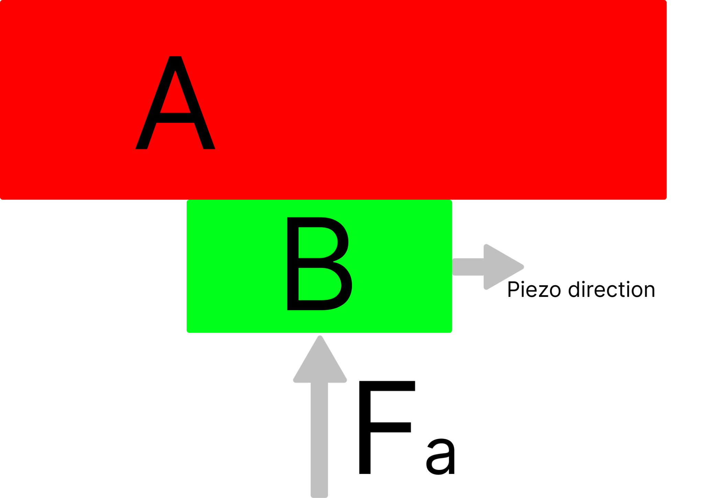
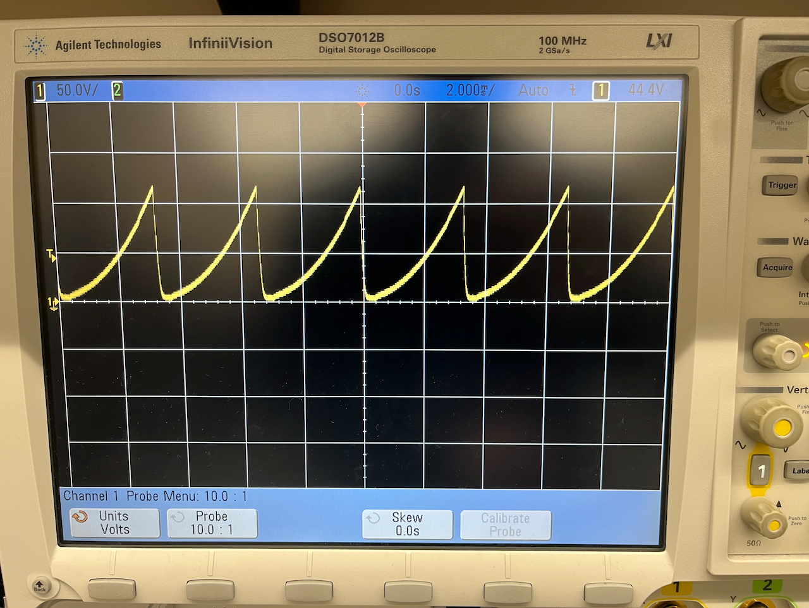
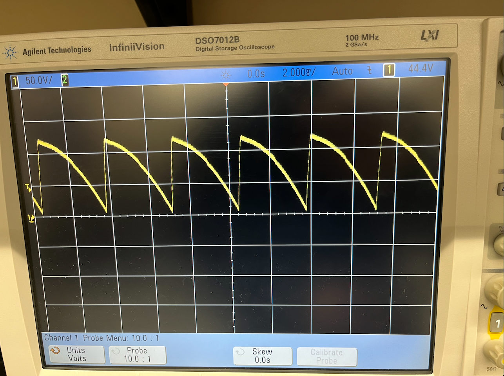

# Piezo Nanopositioner (Stick Slip)

## **How to make a piezo nanopositioner work**

**A List of Quantifiable Parameters**

At its fundamental level, a piezo inertia actuator might seem quite simple: two contacting surfaces one of which alternates between moving slowly and quickly in alternating directions which, in turn, causes displacement on the other surface. However, there are many – often elusive – variables at play, all of which have profoundly significant effects on the functioning of a piezo inertia actuator.

Because of the subtle, often opposing, impact all of these variables have, there is no single optimal solution to each one, rather one must experiment with different combinations of variables that function well given specific designs of piezo inertia actuators. However, understanding the most impactful variables and their effects can simplify this process.

In this document, I will give insight into many of these variables and to the impact I have found them to cause. I will also describe a specific configuration that resulted in a working piezo inertia actuator.

1. ### **Friction between and**

The friction force between and is, perhaps, the variable that has the greatest effect on the reliability of the actuator.

Having too much friction makes it harder for the slip phase of the stick-slip cycle to work. When the friction force is too strong, the inertia of is no longer enough to overcome the higher friction force and the and surfaces do not slip; the assembly simply vibrates.

However, when the friction force is too weak the contact between both surfaces becomes inconsistent and the actuator does not work reliably. Sometimes the actuator does not stick, sometimes it does not slip. Similarly to when there is too much friction, the assembly mostly just vibrates.

2. ### **Preload**

Having a preload force between the and surfaces is paramount. If there were none, we would be relying on the alignment between the and surfaces to certify that there was constant and known friction force between the and surfaces.

Having a preload ensures that even if both surfaces are not perfectly aligned they maintain contact with each other and gives us control on the friction force between and : if we need more friction between and we can increase and if we need less friction we can decrease .

3. ### **Finish & consistency of and surfaces**

As the piezo expands a very small amount (microns) any imperfections, burs, or debris between the and surfaces can cause the stick-slip cycle to fail and the actuator to get stuck. Therefore, having smooth surface finishes in and is desirable and increases reliability. Keeping the surfaces clean from debris has the same effect and also prolongs the life of the surfaces. Furthermore, it is also desirable for the surfaces of and to be hard, as this also prolongs the life of the surfaces.

As a smooth surface finish is desirable, the preload force plays a very useful role here. It is possible to have a smoother surface finish in and (which would decrease the coefficient of friction u) but increase the preload force which has the opposite effect of increasing the friction force.

4. ### **Mass of A**

The entire concept of a piezo inertia actuator relies on the fact that will have a high enough momentum so that it can overcome the friction force between and and the piezo will slip, therefore, as momentum is related to mass and velocity, the mass of a is very impactful and useful.

The reason why the mass of is useful lies in the asymmetrical nature of the force required to perform the stick and the slip phases. Piezos can exert very high forces when expanding (stick phase), however, during the slip phase, we only require enough force to overcome the friction force between and B.

By increasing the mass moved by the piezo, the momentum of immediately before the slip phase also increases and therefore it is easier to overcome the friction between and B, and slip; it basically becomes harder to stick. However, due to the fact that can move as slowly as we want during the stick phase and that piezos can exert very large amounts of force, the difficulty to stick, experienced during the slip phase, is not experienced here.

This becomes extremely useful to increase the reliability of the actuator and ensure it slips when it is expected for it to slip. This can be especially useful when the slew rate of the piezo driver is not fast enough, you can basically use brute force to make it slip. However, as you are moving more mass, you might need to compensate by slowing the frequency at which you drive the piezo.

5. ### **Waveform driving the piezo**

Though a linear saw-tooth waveform is able to produce movement of the piezo inertia actuator, it is far from optimal. Using a linearly increasing or decreasing waveform limits the driving frequency to what does not cause slipping at the start of the sticking phase.

As we need to maximize for the maximum possible driving frequency and velocity (absolute velocity) at the end of the sticking phase, using a gradually increasing waveform like the ones seen below is the optimal solution.

Instead of limiting the driving frequency to what does not cause slipping at just the start of the sticking phase, thee velocity of the waveform starts of slowly and gradually increases speed, which allows it to reach higher driving frequencies without slipping and even a greater velocity at the end of the sticking phase – which increases the momentum of the surface A.

_**A is moving in the same direction as the piezo**_

_**A is moving in the opposite direction as the piezo**_

Let Fcr be the maximum driving frequency at which there still is sticking: it is desirable that the rapidly changing portions of the signal (sliping phase) be 4 times faster than Fcr and that the slowly changing portions of the signal be 4 times slower than Fcr.

The slipping phase should transition from low to high voltage as quickly as possible. This slew rate is mostly dependent on the capacitance of the piezo element and the power of the piezo driver used. Having a faster slew rate allows for slipping when the surface has less momentum and makes the actuator more reliable.

6. ### **Stiffness / stability of the entire assembly**

The nature of the piezo inertia driving results is vibrations being created. They are undesired and indicate inefficiencies in the actuator.

However, manufacturing the chassis assembly out of a stiffer and heavier material and fixturing the assembly to a stable base reduces said vibrations and greatly increases the efficiency and reliability of the machine.

### **Example Configuration that Works**

[VIDEO OF THE STAGE MOVING](https://drive.google.com/file/d/1T9c2T80Upw-menAUSYJ7MKQZQuIeMHPR/view?usp=sharing)

[OLD DRIVER BUT A BUNCH OF WEIGHT](https://drive.google.com/file/d/1XJrpbyoGirXTm36EDpsmjcrc1NUZyWDf/view?usp=sharing)

1. **Friction between and**

We have a 3 mm square nickel-coated neodymium magnet and a precision ground stainless steel linear rail as the two surfaces causing friction.

2. **Preload**

We are using a 3mm square nickel-coated neodymium magnet that has 0.28kg pull and the magnetic attraction between the stainless steel linear rail and the magnet acts as the preload force.

3. **Finish & consistency of and surfaces**

We are using a 3mm square nickel-coated neodymium magnet as the surface and a stainless steel linear rail as the surface. The linear rail was chosen as the surface because it is precision ground and has an excellent surface finish and for the surface we are using the smoothest looking face of the magnet. Furthermore, both surfaces are handled with care to avoid scratches and burrs, kept clean, and cleaned with isopropyl alcohol.

4. **Mass of A**

The design starts performing the best when there is over 50g of mass on top of the carriage. If you are prototyping and just put something heavy on top of the carriage to test, certify the weight is properly fixed to the carriage and can’t move freely – which would just cause vibrations and a poor performance.

5. **Waveform driving the piezo**

The piezo element is driven with an 8 bit DAC and a [PDu150](https://www.piezodrive.com/product/pdu150-three-channel-ultra-low-noise-150v-piezo-driver/) piezo driver. The waveform used is the same shown in the images in section “5. Waveform driving the piezo”, it has a peak voltage of 120V and a driving frequency of 1,400 Hz.

Previously, we used the [BD150](https://www.piezodrive.com/product/bd150-dual-channel-150v-amplifier/) driver, however, its slew rate was extremely low and the upgrade to the [PDu150](https://www.piezodrive.com/product/pdu150-three-channel-ultra-low-noise-150v-piezo-driver/) driver showed very significant improvements.

6. **Stiffness / stability of the entire assembly**

The most significant way this was handled was by attaching the piezo directly onto the linear slide and the magnet touching the rail. This ensures that all movement is directly transferred onto movement of the slide and less is lost due to compliance on other parts of the assembly.

Machining the main body of the actuator out of aluminum works well, however it is also working with a 3d-printed chassis out of PLA. Taping – or even just pressing down with your fingers – the assembly to a stiff plate or table solves vibration related problems.

[VIDEO OF 3D PRINTED VERSION – SIDE MOUNTED MAGNET](https://drive.google.com/file/d/18SRqigx62qSgzW3oG9dCKlq33cSTzdOr/view?usp=sharing)

[VIDEO OF 3D PRINTED VERSIon – TOP MOUNTED MAGNET](https://drive.google.com/file/d/1F-rFmb0HY8VqcwQd4WW1wQDVSczNiiwN/view?usp=sharing)

7. **Piezo element**

We used [this](https://www.mmech.com/tokin-actuators/nec-tokin-resin-coated/nec-ae0203d04f) 4.6um draw distance piezo stack.

8. **Linear rail and carriage**

We are using these [rail](https://www.mcmaster.com/6725K33/) and [carriages](https://www.mcmaster.com/8438K2/) from McMacter.
