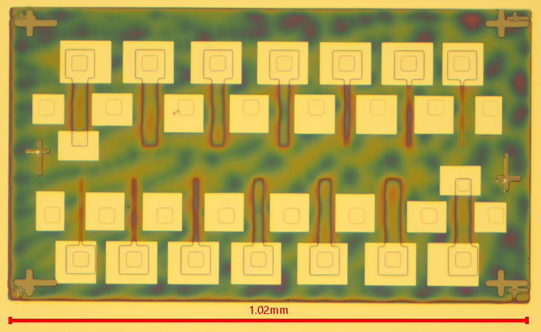
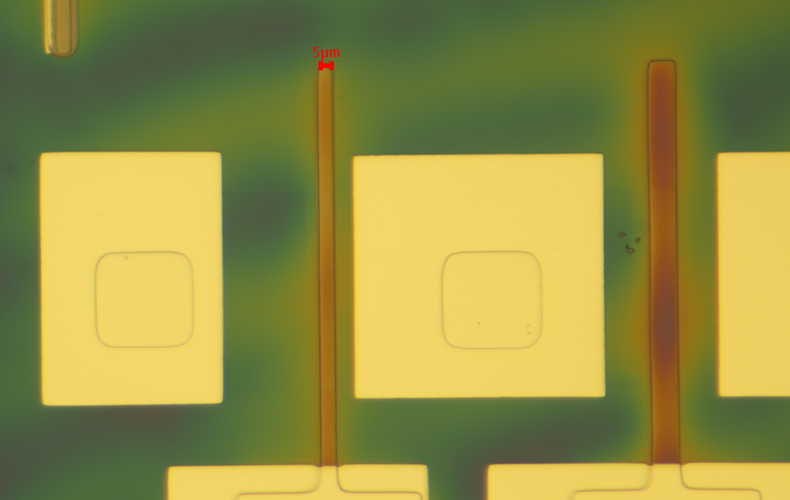

# ✨ Summary

* 952 Transistors per Chip
* 94% Yield
* 1.26V Threshold Voltage
* 5 um gate length

<figure><figcaption></figcaption></figure>

<figure><figcaption></figcaption></figure>

<figure><figcaption></figcaption></figure>

<figure><figcaption></figcaption></figure>

<figure><figcaption></figcaption></figure>
