# Group 1 report

1\. chips

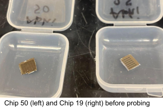 .png>)

An important distinction between the two chips comes from a process difference during insulator deposition. For Chip 19, the intended 700B spin-on silicon oxide layer was deposited and baked . For Chip 50, due to repeated cracking issues during baking the glass, this step was modified and a baked AZ photoresist was used instead of 700B. Since fabrication parameters were not fully standardized, these variations are treated as experimental process variables to help guide future process optimization.


2. Pics

Final chips Chip 19 (left) and Chip 50 (right). 10x, 100x, 100x dark field.

 

***

  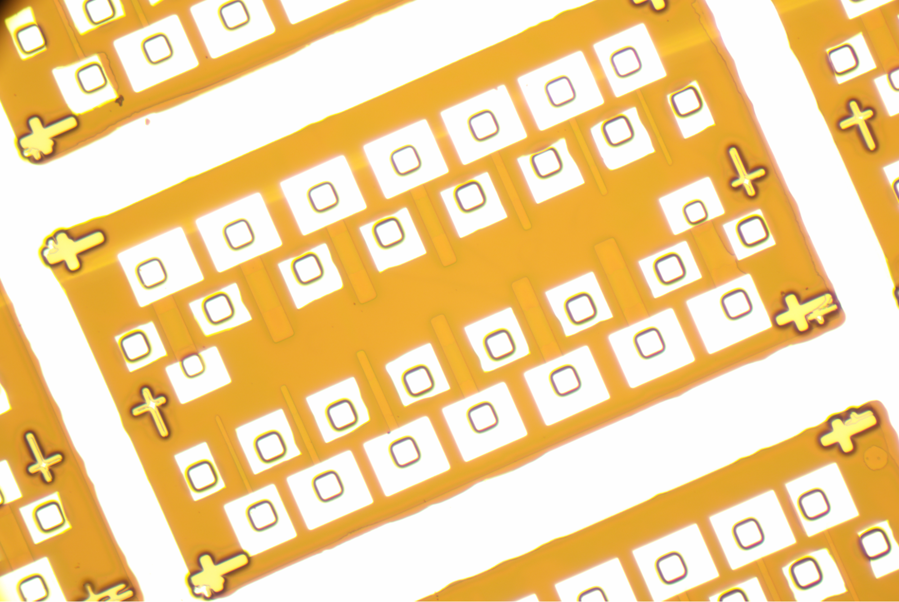

3. Fabrication Observations

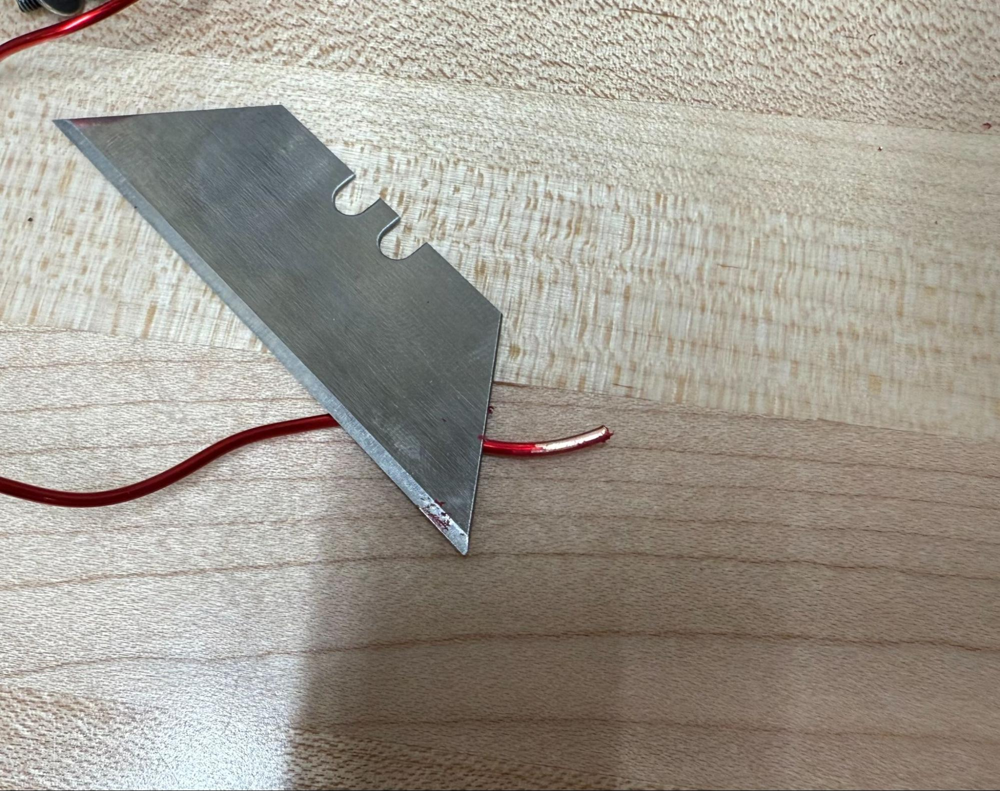

3.1 Lithography

Lithography was one of the most time-intensive stages of the process, along with probing.  Misalignment between the gate, source, and drain patterns was observed in some devices, but overall everything looked good.

Chip on stepper

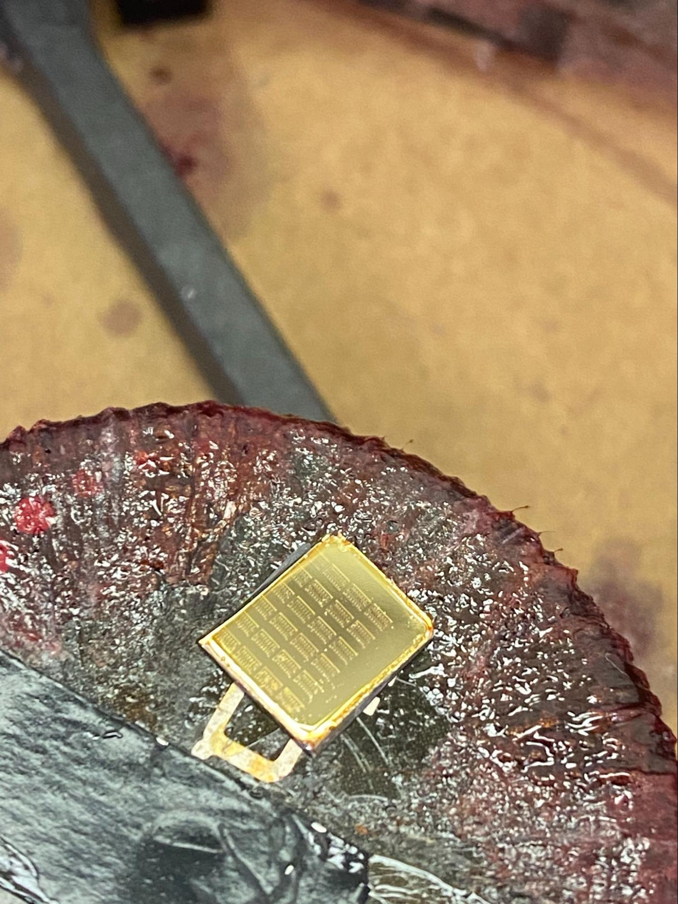

3.2 Chip 50 Insulator Substitution


```
    Photoresist spun-on after aluminum evaporation ->
```

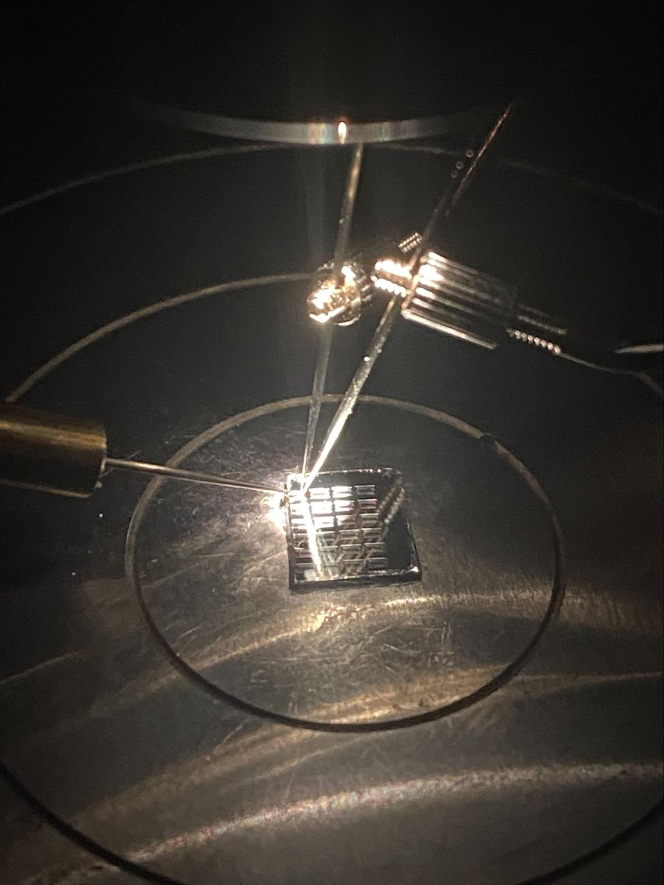

3.3 Contact and Probe

Probe contact resistance appeared inconsistent during testing, small adjustments to probe placement sometimes transformed noisy or non-ideal I-V traces into clean NMOS curves. This sensitivity to probe positioning suggests that contact resistance at the probe-metal interface is a significant source of measurement variability, rather than intrinsic device variability alone. 6 out of 100 probed were excluded from analysis due to breakdown behavior or anomalous readings, likely caused by gate damage from probe needle contact during early testing runs.

<- Chip 19 on probe station; needles on gate, source, drain

5. Methodology

5.1 Measurement Setup 

Electrical characterization was performed using a Keithley source-measure unit (SMU). For each transistor, the gate voltage (Vgs) was stepped from 0 V to 6 V in 1 V increments, while the drain voltage (Vds) was swept from 0 V to 10 V at each gate bias. The source was held at ground throughout. This generated a family of Id-Vd curves (output characteristics) for each device. One hundred transistors were probed in total: 50 on Chip 19 and 50 on Chip 50. The devices span seven NMOS transistor sizes (gate lengths of 5 µm through 30 µm) across eight spatial pattern positions on each chip.

5.2 Parameter Extraction

Python scripts were written to parse all Keithley .xls output files and extract the following parameters automatically:

Threshold Voltage (Vth):

Vth was extracted using the linear extrapolation method applied to the transconductance curve at a reference drain voltage. At each gate voltage step, the drain current at the reference drain voltage (Vd\_ref = 5 V) was found, the transconductance gm = dId/dVgs was computed, and the gate voltage at which the linear extrapolation of the Id-Vgs curve intersects zero current was taken as Vth. Vth was extracted at four drain biases (Vd = 0.2 V, 1 V, 5 V, 10 V) to assess drain-induced threshold variation. The Vd = 5 V value is used as the primary Vth reference in all statistical analyses.

On Current (Ion) and On Resistance (Ron)

Ion is defined as the drain current at the maximum gate voltage (Vgs = 6 V) and the reference drain voltage (Vds = 5 V). Ron is computed as Vds/Id at the same bias point: Ron = 5 V / Ion.

Off Current (Ioff) and Off Resistance (Roff)

Ioff is defined as the drain current at Vgs = 0 V and the reference drain voltage (Vds = 5 V). Roff = 5 V / Ioff.

On/Off Current Ratio

The Ion/Ioff ratio is computed directly from the extracted Ion and Ioff values: Ion/Ioff = Ion / Ioff. This is a number that quantifies the switching contrast of the transistor.

5.3 Quality Control

After automated extraction, each device's I-V graph was inspected visually. Devices exhibiting breakdown behavior, non-monotonic curves not consistent with NMOS operation, or clearly anomalous parameter values were flagged and excluded from statistical averages. Six devices out of 100 were excluded on this basis, leaving 94 valid devices in the final dataset.

5.4 Statistical Analysis

For each parameter, mean and standard deviation were computed both at the chip level (Chip 19 vs. Chip 50) and at the FET size level (NMOS 1-7). The chip-level comparison isolates the effect of the gate dielectric process difference. The size-dependent analysis reveals how transistor gate length affects device behavior, notably the expected decrease in Ion and increase in Ron with increasing channel length.

5.5 Parameter Formulas and Sample Calculations

This section presents every formula used for parameter extraction and then applies each formula to a real device from the dataset to show exactly how the numbers in the results tables were produced. Two example devices are used: NMOS 1, Pattern 2, Chip 19 (a Chip 19 representative) and NMOS 1, Pattern 1, Chip 50 (a Chip 50 representative). Both were measured at Vds = 5 V reference.

5.5.1 On Current (Ion)

Ion is the drain current measured when the transistor is fully on, at maximum gate voltage and the reference drain voltage:

Ion = Id(Vgs = 6 V, Vds = 5 V)

This value is read directly from the Keithley sweep data at the Vgs = 6 V row and the Vds = 5 V column.

Chip 19 example: Ion = 18.57 mA

Chip 50 example: Ion = 3.277 mA

5.5.2 Off Current (Ioff)

Ioff is the residual leakage current when the transistor is nominally off, gate grounded, drain biased:

Ioff = Id(Vgs = 0 V, Vds = 5 V)

This is read from the Vgs = 0 V row in the same sweep data.

Chip 19 example: Ioff = 65.14 µA (6.514 × 10⁻⁵ A)

Chip 50 example: Ioff = 0.969 µA (9.691 × 10⁻⁷ A)

5.5.3 On Resistance (Ron)

Ron is derived from Ohm's law at the on-state bias point. It represents the total series resistance in the conducting channel including contact resistance:

Ron = Vds / Ion = 5 V / Ion

Chip 19: Ron = 5 V / 18.57 × 10⁻³ A = 269.3 Ω

Chip 50: Ron = 5 V / 3.277 × 10⁻³ A = 1525.7 Ω

5.5.4 Off Resistance (Roff)

Roff is Ohm's law at the off-state bias point. A high Roff indicates the channel is effectively blocking current when the gate is grounded:

Roff = Vds / Ioff = 5 V / Ioff

Chip 19: Roff = 5 V / 6.514 × 10⁻⁵ A = 76,755 Ω (76.8 kΩ)

Chip 50: Roff = 5 V / 9.691 × 10⁻⁷ A = 5,159,597 Ω (5.16 MΩ)

5.5.5 Ion/Ioff Ratio

The on/off current ratio is the primary figure of merit for digital switching. It quantifies how many orders of magnitude the device current changes between its on and off states:

Ion/Ioff = Ion / Ioff

Chip 19: 18.57 × 10⁻³ / 6.514 × 10⁻⁵ = 285.0

Chip 50: 3.277 × 10⁻³ / 9.691 × 10⁻⁷ = 3381.7

5.5.6 Threshold Voltage (Vth) Linear Extrapolation Method

Vth cannot be read directly from the I-V data; it must be extracted by fitting a line to the Id-Vgs transfer curve in its linear region. The procedure is:



### Collect Id vs. Vgs at reference Vds

From the per-gate-voltage sweep data, collect Id at Vds = 5 V for each Vgs step (0 V, 1 V, 2 V, ... 6 V).



### Find peak transconductance

Find the gate voltage step where transconductance gm = ΔId/ΔVgs is maximum. This is the steepest part of the transfer curve.



### Fit tangent at peak gm

Fit a tangent line through that point: Id(Vgs) ≈ gm\_max × (Vgs − Vth)



### Compute Vth

Vth is the x-intercept of this line:

Vth = Vgs\_at\_peak\_gm − Id\_at\_peak\_gm / gm\_max



The per-gate-voltage data for the Chip 19 example device (nmos1, pattern2) is shown:

| Vgs (V) | Id at Vds = 5V (A) | ΔId (A)       | gm = ΔId/ΔVgs (A/V)    |
| ------- | ------------------ | ------------- | ---------------------- |
| 0       | 6.514 × 10⁻⁵       | -             | -                      |
| 1       | 2.604 × 10⁻³       | +2.539 × 10⁻³ | 2.539 × 10⁻³           |
| 2       | 3.707 × 10⁻³       | +1.103 × 10⁻³ | 1.103 × 10⁻³           |
| 3       | 7.182 × 10⁻³       | +3.475 × 10⁻³ | 3.475 × 10⁻³           |
| 4       | 1.131 × 10⁻²       | +3.130 × 10⁻³ | 3.130 × 10⁻³           |
| 5       | 1.491 × 10⁻²       | +3.602 × 10⁻³ | 3.602 × 10⁻³           |
| 6       | 1.857 × 10⁻²       | +3.651 × 10⁻³ | 3.651 × 10⁻³ (peak gm) |

The script finds the maximum gm step (here gm = 3.651 × 10⁻³) and extrapolates the tangent line back.

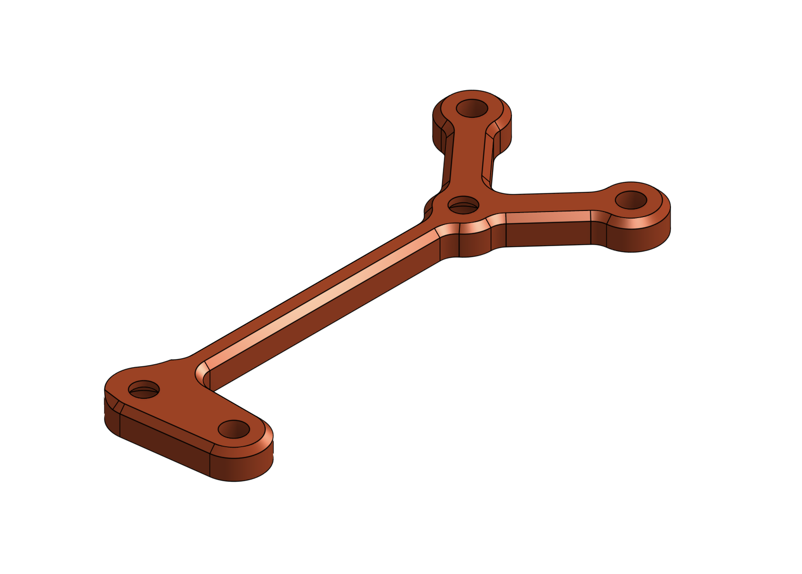

6. Dataset Description

6.1 Raw Measurement Data

The raw dataset consists of 100 Keithley-generated .xls files, one per probed transistor. Each file contains Id-Vd sweep data for gate voltages from 0 to 6 V. Files are named according to the convention: nmos{1-7}\_pattern{1-8}\_chip{19/50}, where the nmos number encodes the gate length (NMOS 1 = 5 µm through NMOS 7 = 30 µm) and the pattern number encodes the spatial position on the chip.

.png>)

6.2 Processed Data

A Python script parsed all raw files and generated a summary CSV (nmos\_summary.csv) containing one row per functional device (94 rows) with the following columns: chip identifier, NMOS number, pattern number, FET size label, source filename, Vth at four drain biases, reference drain voltage, Ion, Ioff, Ron, Roff, and Ion/Ioff ratio.

A second CSV (nmos\_summary\_per\_gate\_voltage.csv) contains per-gate-voltage breakdown data, allowing analysis of how drain current and resistance evolve as a function of gate bias for each device.

6.3 Graphs

Individual Id-Vd family-of-curves graphs were generated for all 94 functional transistors. Example graphs for representative devices are included in Section 8 and Section 9.

7. Fabrication and Yield Statistics

7.1 Devices Attempted

Total NMOSFETs attempted fabrication: Chip 19 was originally labeled Chip 25, but it snapped during removal from the aluminum evaporator, leaving only half of the chip usable. The total attempted fabrication count is:

N\_attempted = 14 FETs/pattern × 68 patterns = 952 transistors

7.2 Visual Fabrication Yield

Devices were inspected under the microscope prior to electrical testing. A device was classified as visually passing if it had: (1) a continuous, unbroken gate region; (2) clearly defined and accessible source and drain contacts; and (3) no evidence of structural breaks, severe misalignment, or photoresist/metal residue bridging critical regions.

N\_visual\_pass = 900 transistors -> Yield\_visual = 900 / 952 = 94.5%

7.3 Electrical Yield

Of the 100 devices probed (50 per chip), 94 exhibited recognizable NMOS I-V behavior: increasing drain current with gate voltage, a cutoff-to-saturation transition, and extractable parameters. Six devices were excluded due to breakdown behavior, erratic readings, or suspected gate damage from probe needle contact during early testing sessions (before probing technique was refined).

N\_functional = 94 N\_probed = 100 -> Yield\_electrical = 94%

Post-inspection functional yield (functional yield conditioned on visual pass) will be computed in Checkpoint 2 once complete pattern mapping data is available.

***

8. Chip-Level Analysis

The two chips in this study differ in one critical process variable: gate dielectric material. Chip 19 uses thermally grown SiO₂ (intended process), while Chip 50 uses photoresist as the gate dielectric (process deviation due to spin on glass cracking).

| Parameter                   | Chip 19              | Chip 50        |
| --------------------------- | -------------------- | -------------- |
| Devices probed              | 50                   | 50             |
| Functional devices          | 48                   | 46             |
| Electrical yield            | 96%                  | 92%            |
| Vth @ Vd=5V (mean ± std)    | 1.26 ± 0.31 V        | 3.43 ± 0.40 V  |
| Ion (mean ± std)            | 5.42 ± 3.40 mA       | 2.06 ± 0.70 mA |
| Ioff (mean ± std)           | 71.7 ± 413.8 µA      | 1.70 ± 2.76 µA |
| Ron (mean ± std)            | 1,214 ± 733 Ω        | 2,696 ± 860 Ω  |
| Ion/Ioff ratio (mean ± std) | 738 ± 657            | 6,404 ± 8,488  |
| Dielectric                  | Spin on glass (SiO₂) | Photoresist    |

Note: The Vth, Ion, Ioff, Ron, and Ion/Ioff values in this table are means computed across all 7 NMOS gate lengths together (5 µm through 30 µm). Because Ion varies strongly with gate length (a 5 µm device conducts \~4.5× more than a 30 µm device on Chip 19), pooling all sizes produces a large standard deviation. This is expected and does not indicate random fabrication failure. It reflects the deliberate range of device sizes tested. Per-size breakdowns are in Section 9.

8.1&#x20;

8.3 Why Chip 50 Has Lower Ioff and Better Ion/Ioff

TBD

Something to do with overdrive voltage (Vgs - Vth). Leaving this here for future research.

8.3 Why Chip 50 Has Lower Ioff and Better Ion/Ioff

Chip 50's photoresist dielectric suppresses off-state leakage far more effectively than Chip 19's spin-on glass. I don’t really get the reasoning behind this as well so I will have to look more into this for the upcoming checkpoint.

The titles of the graphs below explain what the graph shows. I have created this set of graphs for all 94 transistors. You can find them in Section 11.

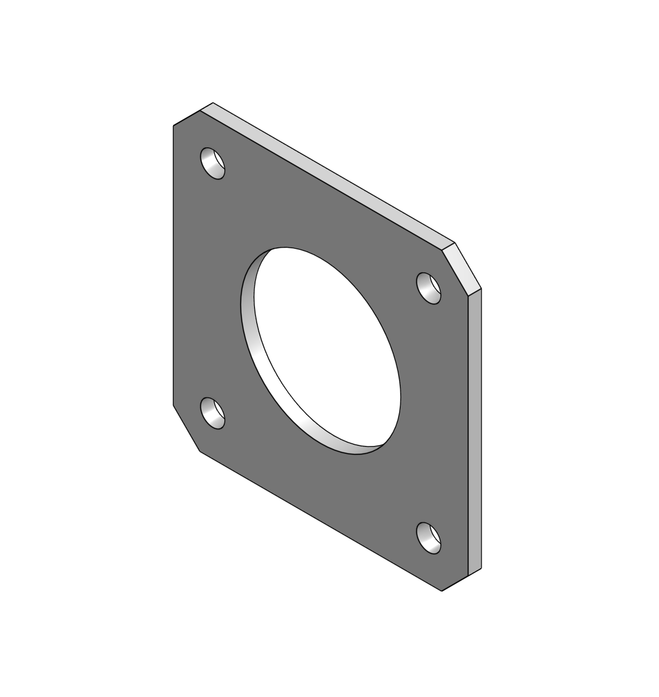 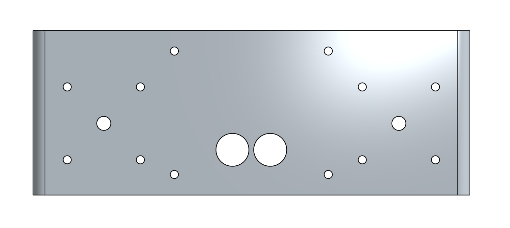

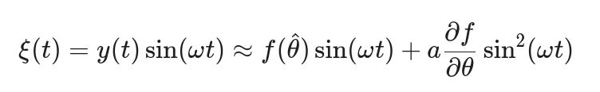 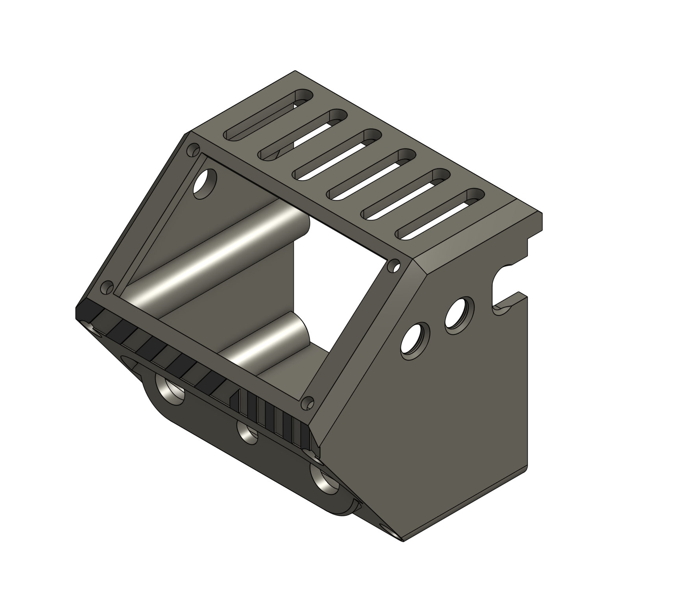

.png>) .png>)

9. FET Size-Dependent Analysis

Seven NMOS transistor sizes were fabricated, with gate lengths from 5 µm (NMOS 1) to 30 µm (NMOS 6 and 7). The tables below show mean ± std for each parameter, broken out separately for each chip so the within-chip size trends are not obscured by the chip-to-chip dielectric difference.

IMAGE

9.1 Chip 19: Per FET Size (700B Spin-On Glass Dielectric)

| NMOS | L    | Quantity | Vth ± σ (V) | Ion ± σ (mA) | Ioff ± σ (µA) | Ron ± σ (Ω)   |
| ---- | ---- | -------- | ----------- | ------------ | ------------- | ------------- |
| 1    | 5µm  | 5        | 1.40 ± 0.64 | 13.13 ± 4.41 | 605 ± 1271    | 434 ± 206     |
| 2    | 10µm | 6        | 0.91 ± 0.26 | 7.74 ± 1.28  | 13.8 ± 5.5    | 663 ± 127     |
| 3    | 15µm | 7        | 1.15 ± 0.35 | 5.97 ± 0.91  | 10.0 ± 4.0    | 856 ± 146     |
| 4    | 20µm | 7        | 1.25 ± 0.16 | 4.23 ± 0.41  | 7.3 ± 3.5     | 1,191 ± 124   |
| 5    | 25µm | 8        | 1.32 ± 0.13 | 3.81 ± 0.35  | 8.5 ± 5.8     | 1,323 ± 139   |
| 6    | 30µm | 8        | 1.42 ± 0.18 | 3.26 ± 0.20  | 9.5 ± 8.8     | 1,539 ± 97    |
| 7    | 30µm | 7        | 1.29 ± 0.16 | 2.86 ± 0.91  | 9.9 ± 13.3    | 2,125 ± 1,416 |

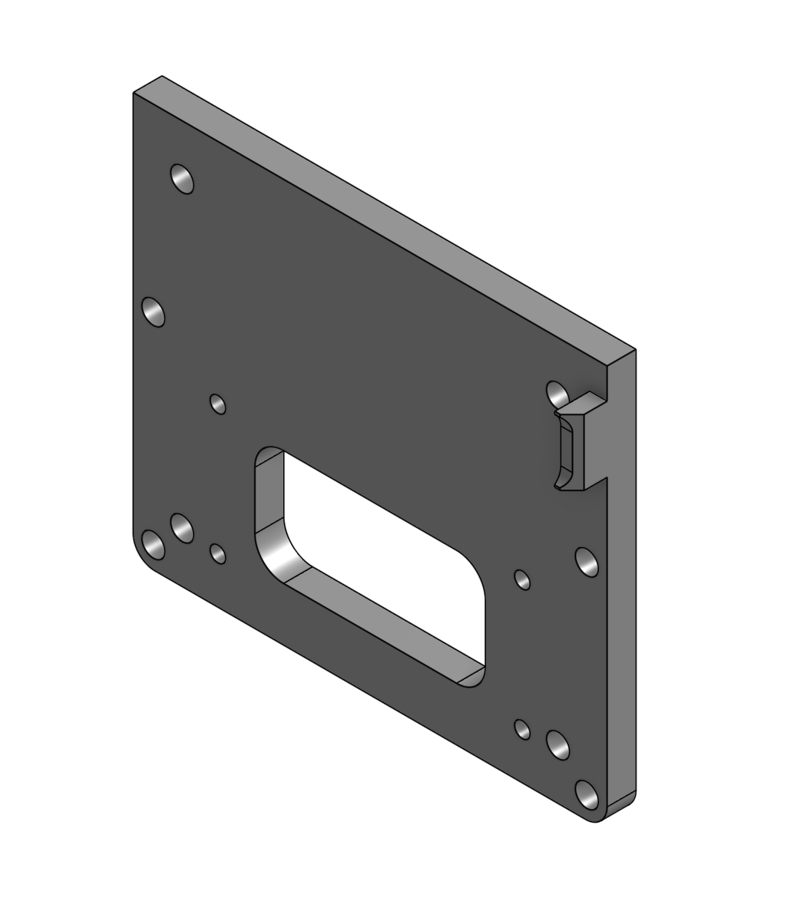

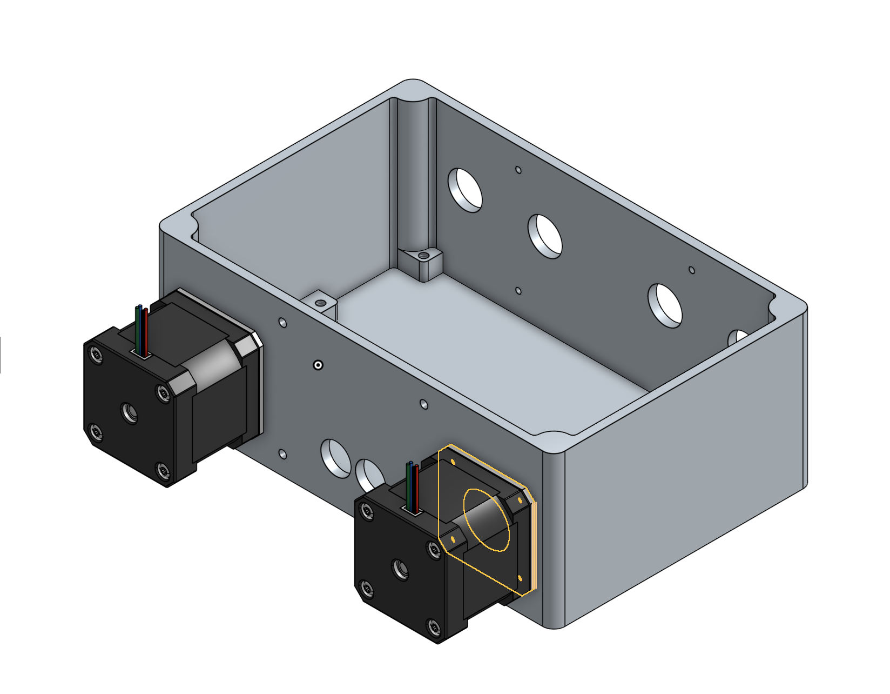 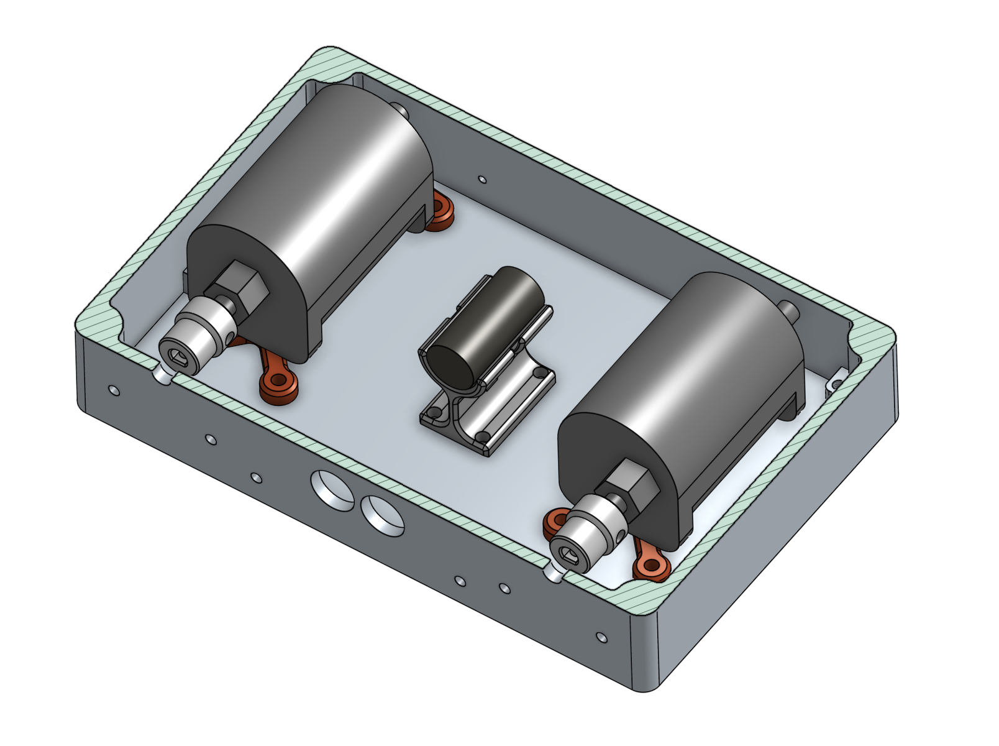

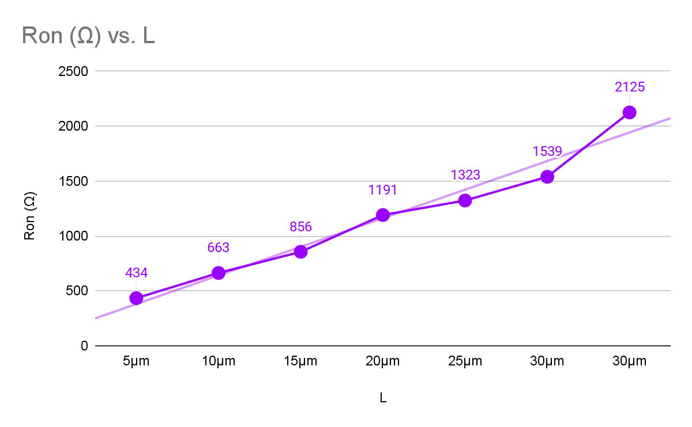

9.2 Chip 50: Per FET Size (Baked AZ Photoresist Dielectric)

| NMOS | L    | Quantity | Vth ± σ (V) | Ion ± σ (mA) | Ioff ± σ (µA) | Ron ± σ (Ω) |
| ---- | ---- | -------- | ----------- | ------------ | ------------- | ----------- |
| 1    | 5µm  | 6        | 3.59 ± 0.44 | 3.09 ± 0.46  | 1.35 ± 2.20   | 1,652 ± 255 |
| 2    | 10µm | 7        | 3.80 ± 0.38 | 2.62 ± 0.51  | 3.06 ± 6.06   | 1,965 ± 355 |
| 3    | 15µm | 6        | 3.49 ± 0.33 | 2.36 ± 0.53  | 0.74 ± 0.81   | 2,208 ± 501 |
| 4    | 20µm | 7        | 3.29 ± 0.43 | 1.90 ± 0.51  | 1.36 ± 2.07   | 2,822 ± 894 |
| 5    | 25µm | 7        | 3.21 ± 0.43 | 1.65 ± 0.28  | 1.26 ± 2.03   | 3,101 ± 457 |
| 6    | 30µm | 6        | 3.39 ± 0.30 | 1.45 ± 0.24  | 1.51 ± 1.17   | 3,543 ± 734 |
| 7    | 30µm | 7        | 3.28 ± 0.24 | 1.45 ± 0.12  | 2.42 ± 1.45   | 3,483 ± 309 |

***

9.3 Trends and Interpretation

Ion decreases with increasing gate length. On Chip 19, NMOS 1 (5µm) averages 13.13 mA vs. 2.86 mA for NMOS 7 (30µm), a 4.6× difference. On Chip 50, NMOS 1 averages 3.09 mA vs. 1.45 mA for NMOS 7, a 2.1× difference. The standard is Ion proportional to W/L (longer length less Ion), so this trend is expected.

Ron increases monotonically with gate length, consistent with the decreasing Ion trend since Ron = Vds/Ion. On Chip 19: 434 Ω (NMOS 1) -> 2,125 Ω (NMOS 7). On Chip 50: 1,652 Ω (NMOS 1) -> 3,483 Ω (NMOS 7). Chip 50 Ron values are consistently \~3-4× higher than Chip 19 at every size.

Vth is very consistent across all 7 sizes within each chip. Chip 19 Vth ranges from 0.91 V (NMOS 2) to 1.42 V (NMOS 6), a spread of only 0.51 V across 7 sizes. Chip 50 ranges from 3.21 V (NMOS 5) to 3.80 V (NMOS 2), a spread of 0.59 V. This confirms that Vth is set by the dielectric and doping properties, not the gate length.

Ioff shows no strong size trend on either chip, which is expected. The high Ioff std values (especially on Chip 19) reflect device-to-device variation in sub-threshold leakage, likely driven by doping non-uniformity and probe contact variability.

10. Discussion and Conclusion

For digital switching applications, Chip 50's characteristics are more useful — though its Vth of 3.43 V is impractically high for most standard supply voltages, and would need to be reduced through process optimization.

Within each chip, the variability in extracted parameters is substantial. Standard deviations for Ion are 63% of the mean for Chip 19 and 34% for Chip 50. This reflects the non-optimized nature of the fabrication process, particularly the inconsistency of probe contact resistance, alignment variability in lithography, and non-uniform doping across the chip. Critically, minor repositioning of probe needles was observed to dramatically change measured I-V characteristics, suggesting that some reported variability is extrinsic (probe-related) rather than intrinsic to the devices.

The size-dependent trend of decreasing Ion with increasing gate length is expected for standard MOSFET theory.

Overall electrical yield was 94%, indicating that the fabrication process, while variable, is capable of reliably producing functional NMOS transistors. Continued refinement of the process and probing technique are the highest-priority next steps for improving both yield and parameter consistency

11. Links

[Images of chip going through fabrication process](https://www.google.com/url?q=https://drive.google.com/drive/folders/1j2ZTHT11P--8f9d1HJedet5avoHqmetN?usp%3Ddrive_link\&sa=D\&source=editors\&ust=1773593902216945\&usg=AOvVaw3vJ7dWQMKuPWSucWlLQ8TV)

[Processed data nmos\_summary\_per\_gate\_voltage.csv](https://www.google.com/url?q=https://drive.google.com/file/d/1hWcgOi_VTi-tj84jaKlh_4Ab0Ib9imnd/view?usp%3Ddrive_link\&sa=D\&source=editors\&ust=1773593902217447\&usg=AOvVaw3HvdqdiGDN1R1NG7-M95BO)

[Processed data nmos\_summary.csv](https://www.google.com/url?q=https://drive.google.com/file/d/1MBbaGzsllM3dzdijOpUGj0idGdKoqtuR/view?usp%3Ddrive_link\&sa=D\&source=editors\&ust=1773593902217775\&usg=AOvVaw3rNKgFQStFI38rkYG6mdU9)

[All graphs (564 in total each of 94 transistors have 6 graphs associated)](https://www.google.com/url?q=https://drive.google.com/drive/folders/1wp9zjVrxm1W0XEgkSPj8-xrugV1GSC_f?usp%3Ddrive_link\&sa=D\&source=editors\&ust=1773593902218158\&usg=AOvVaw35iGkN-I8LnP2-J9T2R3cf)
