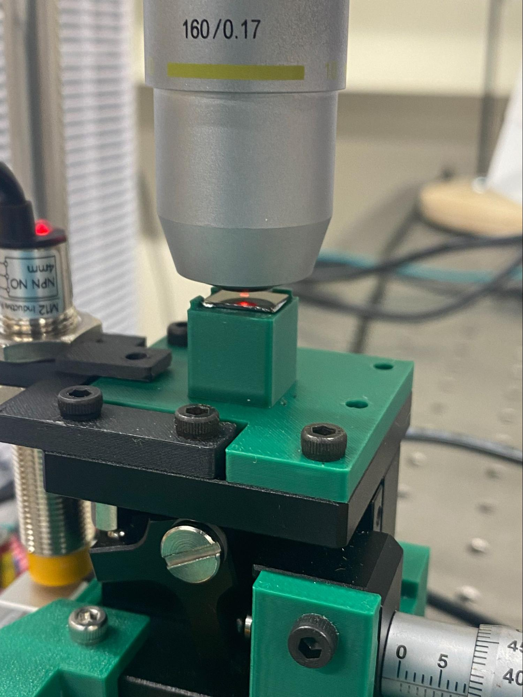

# Group 2 report

.png>)

3. Fabrication Observations

3.1 Lithography

Lithography was one of the most time-intensive stages of the process, along with probing. Misalignment between the gate, source, and drain patterns was observed in some devices, but overall everything looked good.

Chip on stepper

3.2 Contact and Probe

Probe contact resistance appeared inconsistent during testing; small adjustments to probe placement sometimes transformed noisy or non-ideal I-V traces into clean NMOS curves. This sensitivity to probe positioning suggests that contact resistance at the probe-metal interface is a significant source of measurement variability, rather than intrinsic device variability alone. 8 out of 56 probed chips were excluded from analysis due to breakdown behavior or anomalous readings, likely caused by gate damage from probe needle contact during early testing runs.

Chip on probe station

***

5. Methodology

.jpg>)

5.1 Measurement Setup

Electrical characterization was performed using a Keithley source-measure unit (SMU). For each transistor, the gate voltage (Vgs) was stepped from 0 V to 6 V in 1 V increments, while the drain voltage (Vds) was swept from 0 V to 10 V at each gate bias. The source was held at ground throughout. This generated a family of Id-Vd curves (output characteristics) for each device. 56 transistors were probed in total. The devices span seven NMOS transistor sizes (gate lengths of 5 µm through 30 µm) across 8 spatial pattern positions on our chip.

5.2 Parameter Extraction

Python scripts were written to parse all Keithley .xls output files and extract the following parameters automatically:

Threshold Voltage (Vth)\
Vth is extracted using a gm-max tangent (linear extrapolation) method on an Id–Vgs slice at fixed Vds. For a chosen Vds, we take Id at each Vgs step, compute gm = dId/dVgs by finite differences, find the Vgs where gm is maximal, and extrapolate the tangent line at that point to Id = 0. The x-intercept is reported as Vth: Vth = Vgs\* − Id\*/gm\*. Vth is computed at multiple Vds values and then aggregated (e.g., averaged) for summary statistics.

On Current (Ion) and On Resistance (Ron)\
Ion is defined as the average drain current at Vgs = 6 V over Vds ∈ \[4, 6] V: Ion = mean{Id | Vgs = 6 V, Vds ∈ \[4, 6] V}. Ron is computed pointwise as Vds/Id over the same window and then averaged: Ron = mean{Vds/Id | Vgs = 6 V, Vds ∈ \[4, 6] V}.

Off Current (Ioff) and Off Resistance (Roff)\
Ioff is defined as the average drain current at Vgs = 0 V over Vds ∈ \[4, 6] V: Ioff = mean{Id | Vgs = 0 V, Vds ∈ \[4, 6] V}. Roff is computed pointwise as Vds/Id over the same window and then averaged: Roff = mean{Vds/Id | Vgs = 0 V, Vds ∈ \[4, 6] V}.

On/Off Current Ratio\
Ion/Ioff is computed directly from the extracted Ion and Ioff values: Ion/Ioff = Ion / Ioff.

5.3 Quality Control

After automated extraction, each device's I-V graph was inspected visually. Devices exhibiting breakdown behavior, non-monotonic curves not consistent with NMOS operation, or clearly anomalous parameter values were flagged and excluded from statistical averages. Six devices out of 100 were excluded on this basis, leaving 94 valid devices in the final dataset.

5.4 Statistical Analysis

For each parameter, mean and standard deviation were computed at the FET size level (NMOS 1–7).

6. Dataset Description

6.1 Raw Measurement Data

The raw dataset consists of 100 Keithley-generated .xls files, one per probed transistor. Each file contains Id-Vd sweep data for gate voltages from 0 to 6 V. Files are named according to the convention: nmos{1-7}\_pattern{1-8}\_chip{19/50}, where the nmos number encodes the gate length (NMOS 1 = 5 µm through NMOS 7 = 30 µm) and the pattern number encodes the spatial position on the chip.

6.2 Processed Data

A Python analysis pipeline parsed all raw .xls measurement files into a single tidy table (big\_df\_meas) and then generated a device-level summary table (df\_summary) with one row per device\_label. For each device, df\_summary stores Vth\_avg and Vth\_std (computed from gm-max tangent Vth extracted across a selected set of Vds slices), plus Ion, Ioff, Ron, Roff, and Ion/Ioff (computed from Id averaged over Vds ∈ \[4, 6] V at Vgs = 6 V for Ion/Ron and Vgs = 0 V for Ioff/Roff, with Ron and Roff computed as the average of Vds/Id over the same window).

6.3 Graphs

Individual Id-Vd family-of-curves graphs were generated for all 56 functional transistors. Example graphs for representative devices are included in Section 8 and Section 9.

7. Fabrication and Yield Statistics

8.1 Devices Attempted

The total attempted fabrication count is:

N\_attempted = 14 FETs/pattern × 16 patterns = 224 transistors

8.2 Visual Fabrication Yield

Devices were inspected under the microscope prior to electrical testing. A device was classified as visually passing if it had: (1) a continuous, unbroken gate region; (2) clearly defined and accessible source and drain contacts; and (3) no evidence of structural breaks, severe misalignment, or photoresist/metal residue bridging critical regions.

N\_visual\_pass = 180 transistors -> Yield\_visual = 180 / 224 = 80.3%

7.3 Electrical Yield

Of the 56 devices probed, 48 exhibited recognizable NMOS I-V behavior: increasing drain current with gate voltage, a cutoff-to-saturation transition, and extractable parameters. 8 devices were excluded due to breakdown behavior, erratic readings, or suspected gate damage from probe needle contact during early testing sessions (before probing technique was refined).

N\_functional = 48 N\_probed = 56 -> Yield\_electrical = 85%

Post-inspection functional yield (functional yield conditioned on visual pass) will be computed in Checkpoint 2 once complete pattern mapping data is available.

9. FET Size-Dependent Analysis

Seven NMOS transistor sizes were fabricated, with gate lengths from 5 µm (NMOS 1) to 30 µm (NMOS 6 and 7). The tables below show mean ± std for each parameter, broken out separately for each chip so the within-chip size trends are not obscured by the chip-to-chip dielectric difference.

| L\_um | n(um) | Vth\_avg | Ion      | Ioff     | Ron         | Roff         | Ion/Ioff  |
| ----- | ----- | -------- | -------- | -------- | ----------- | ------------ | --------- |
| 5.0   | 5     | 0.784633 | 0.015168 | 0.001140 | 333.848297  | 5067.595323  | 13.768613 |
| 10.0  | 4     | 0.664854 | 0.008734 | 0.000972 | 688.611827  | 5607.739060  | 9.863257  |
| 15.0  | 6     | 1.135487 | 0.008866 | 0.000598 | 564.625472  | 9607.670912  | 16.999532 |
| 20.0  | 7     | 1.154826 | 0.005527 | 0.000606 | 908.636826  | 10520.067881 | 10.356482 |
| 25.0  | 7     | 1.236735 | 0.004281 | 0.000335 | 1178.387695 | 17183.785435 | 14.976045 |
| 30.0  | 6     | 1.070343 | 0.003515 | 0.000578 | 1429.056525 | 10475.632003 | 6.374179  |

.png>)

.png>)

.png>)

.png>)

.png>)

9.3 Trends and Interpretation

The Vth trend for the different NMOS sizes is generally reasonable: shorter-length gates exhibit slightly lower Vth overall. There is, however, a systematic discrepancy for Vth of the longest-length gates, where Vth drifts to become lower than the others on average.&#x20;

Ron increases monotonically with gate length, consistent with the decreasing Ion trend. Ioff shows no strong size trend on either chip, which is expected.

10. Comments

In this work, the threshold voltage (Vth) of the fabricated NMOS devices was extracted using the maximum transconductance (gmax) methodology. However, the extracted Vth values exhibited noticeable deviations and inconsistencies across devices and measurement conditions.&#x20;

10.1 Dopant depth

The threshold voltage depends strongly on the channel dopant concentration near the silicon surface. In our devices, the dopant distribution may not be uniform due to manual processing, and the implantation depth may not be well controlled. If dopants are distributed too deeply or unevenly, the effective surface doping concentration can be reduced or vary across devices. This affects channel formation and shifts the measured threshold voltage. Non-uniform dopant profiles may also introduce device-to-device variation and distort the gm characteristics used in the gmax extraction method. Improving control over the doping process and dopant activation would help achieve more consistent and accurate Vth extraction.

10.3 Methodology optimization: Saturation Region Identification and Outlier Removal

The gmax extraction method assumes the device operates in the saturation region, where the drain current is primarily controlled by Vgs and is weakly dependent on Vds. If data from the linear region are included, the transconductance behavior differs and can lead to inaccurate Vth extraction. Therefore, it is important to identify and use only saturation-region data. Additionally, measurement noise, contact instability, or device defects may introduce outliers that distort gm calculation. Applying proper filtering and removing outliers can improve the accuracy and reliability of the extracted threshold voltage.

10.4 Probing Process: Insufficient Vgs Resolution

The gate voltage (Vgs) was stepped in relatively small or insufficiently optimized increments during measurement. If the step size is too large, the gm peak may not be accurately captured, leading to uncertainty in identifying the true maximum transconductance point. Since Vth extraction using the gmax method depends directly on locating the maximum gm point and extrapolating from it, insufficient resolution in Vgs reduces extraction precision. Using finer Vgs steps, particularly near the threshold region, would significantly improve accuracy.

10.5 Probing Quality: Contact Resistance and Mechanical Contact Issues

The probing quality plays a critical role in measurement accuracy. Poor contact between the probe pins and the Source, Drain, and Gate areas introduces additional contact resistance and unstable electrical connections. Unstable contact may also introduce fluctuations in measured current, leading to unreliable threshold voltage extraction. Improving probe alignment, ensuring clean contact pads, and maintaining stable mechanical contact during measurement would help reduce these errors.

