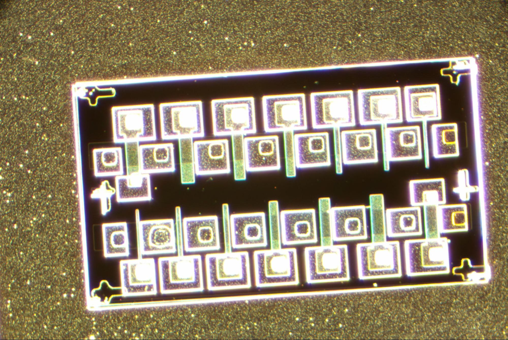
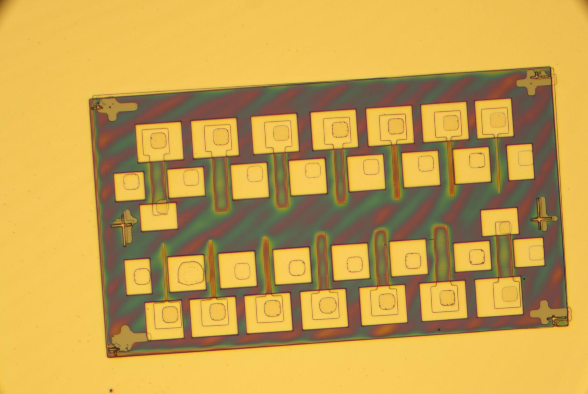
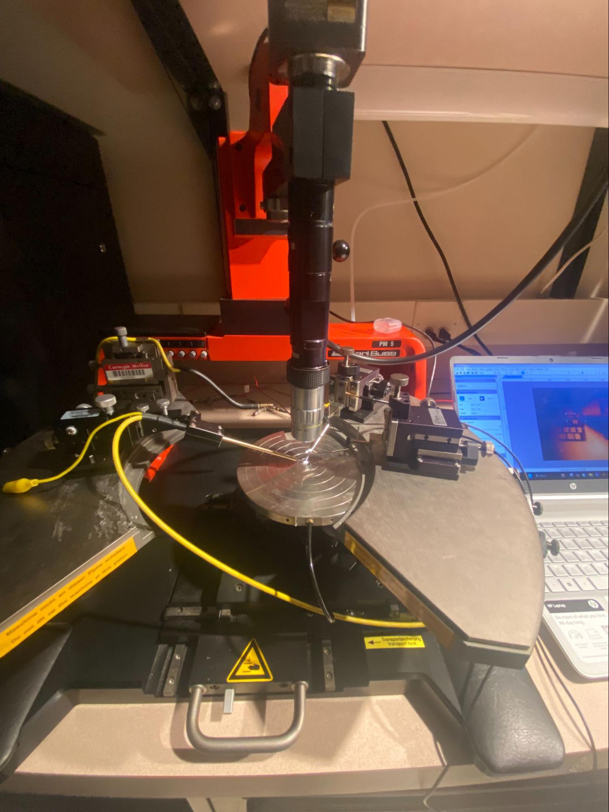
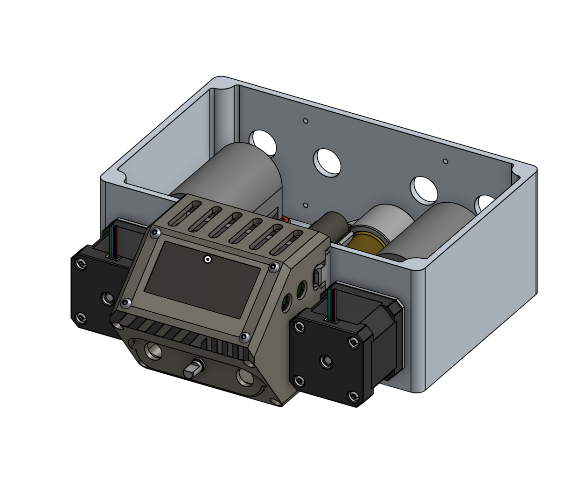
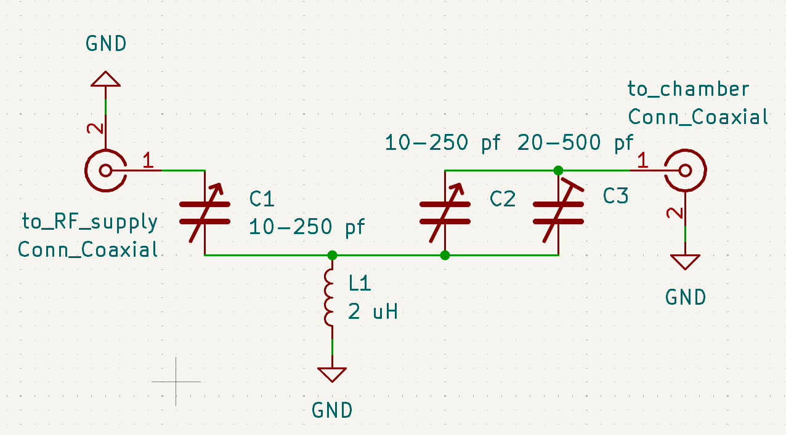
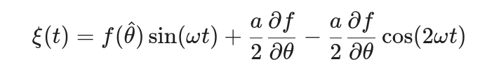
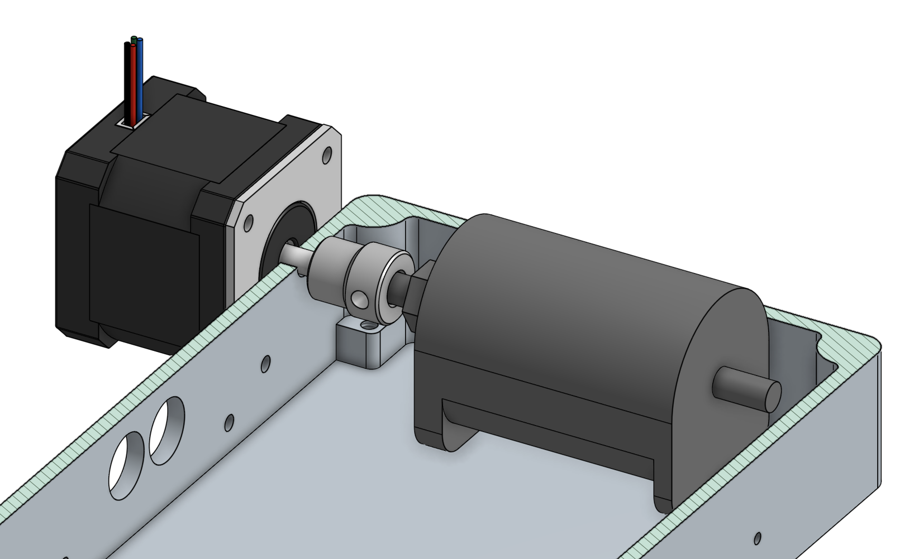
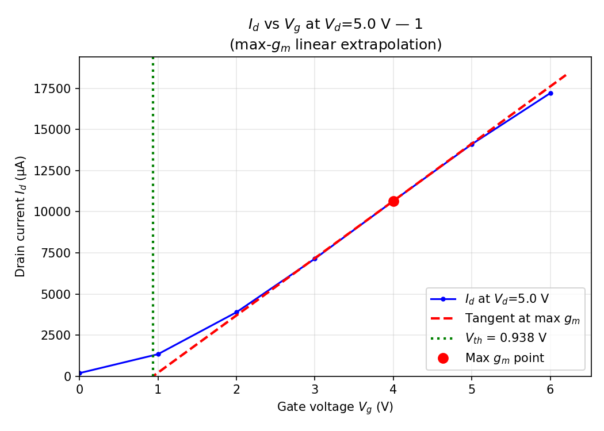

# Group 3 report

### 3. Fabrication Observation

#### 3.1 Lithography

Lithography was one of the most time-intensive stages of the process, along with probing. Although Misalignment between the gate, source, and drain patterns was observed in some devices, overall, everything looked good.

#### 3.2 Contact and Probe

Probe contact resistance appeared inconsistent during testing; small adjustments to probe placement sometimes transformed noisy or non-ideal I-V traces into clean NMOS curves. This sensitivity to probe positioning suggests that contact resistance at the probe-metal interface is a significant source of measurement variability, rather than intrinsic device variability alone. 29 out of 112 probed were excluded from analysis due to breakdown behavior or anomalous readings, likely caused by gate damage from probe needle contact during early testing runs.

***

 

### 5. Methodology

#### 5.1 Measurement Setup

Electrical characterization was performed using a Keithley source-measure unit (SMU). For each transistor, the gate voltage (Vgs) was stepped from 0 V to 6 V in 1 V increments, while the drain voltage (Vds) was swept from 0 V to 10 V at each gate bias. The source was held at ground level throughout. This generated a family of Id-Vd curves (output characteristics) for each device. 112 transistors were probed in total.

#### 5.2 Parameter Extraction

Python scripts were written to parse all Keithley .xls output files and extract the following parameters automatically:

Threshold Voltage (Vth):

Vth was extracted using the linear extrapolation method applied to the transconductance curve at a reference drain voltage. At each gate voltage step, the drain current at the reference drain voltage (Vd\_ref = 5 V) was found, the transconductance gm = dId/dVgs was computed, and the gate voltage at which the linear extrapolation of the Id-Vgs curve intersects zero current was taken as Vth. Vth was extracted at four drain biases (Vd = 0.2 V, 1 V, 5 V, 10 V) to assess drain-induced threshold variation. The Vd = 5 V value is used as the primary Vth reference in all statistical analyses.

On Current (Ion) and On Resistance (Ron)

Ion is defined as the drain current at the maximum gate voltage (Vgs = 6 V) and the reference drain voltage (Vds = 5 V). Ron is computed as Vds/Id at the same bias point: Ron = 5 V/Ion.

Off Current (Ioff) and Off Resistance (Roff)

Ioff is defined as the drain current at Vgs = 0 V and the reference drain voltage (Vds = 5 V). Roff = 5 V / Ioff.

On/Off Current Ratio

The Ion/Ioff ratio is computed directly from the extracted Ion and Ioff values: Ion/Ioff = Ion / Ioff. This is a number that quantifies the transistor's switching contrast.

#### 5.3 Quality Control

After automated extraction, each device's I-V graph was inspected visually. Devices exhibiting breakdown behavior, non-monotonic curves not consistent with NMOS operation, or clearly anomalous parameter values were flagged and excluded from statistical averages. Six devices out of 100 were excluded on this basis, leaving 94 valid devices in the final dataset.

### 6. Dataset Description

#### 6.1 Raw Measurement Data

The raw dataset consists of 100 Keithley-generated .xls files, one per probed transistor. Each file contains Id-Vd sweep data for gate voltages from 0 to 6 V. Files are named according to the convention: nmos{1-7}\_pattern{0-7\}}, where the nmos number encodes the gate length (SIZE 1 = 5 µm through SIZE 7 = 30 µm) and the pattern number encodes the spatial position on the chip.

#### 6.2 Processed Data

A Python script parsed all raw files and generated a summary CSV (nmos\_summary.csv) containing one row per functional device (94 rows) with the following columns: chip identifier, NMOS number, pattern number, FET size label, source filename, Vth at four drain biases, reference drain voltage, Ion, Ioff, Ron, Roff, and Ion/Ioff ratio.

A second CSV (nmos\_summary\_per\_gate\_voltage.csv) contains per-gate-voltage breakdown data, allowing analysis of how drain current and resistance evolve as a function of gate bias for each device.

#### 6.3 Graphs

Individual Id-Vd family-of-curves graphs were generated for all 94 functional transistors. Example graphs for representative devices are included in Sections 8 and 9.

### 7. Fabrication and Yield Statistics

#### 7.1 Visual Fabrication Yield

Devices were inspected under the microscope prior to electrical testing. A device was classified as visually passing if it had: (1) a continuous, unbroken gate region; (2) clearly defined and accessible source and drain contacts; and (3) no evidence of structural breaks, severe misalignment, or photoresist/metal residue bridging critical regions.

At the beginning of the experiment, it was originally planned to prepare two chips, each containing 112 NMOS devices (a total of 224). During the spinning process of the No. 1 chip, it was broken due to unstable absorption and fixation, constituting a non-process-related accidental damage and thus not included in the final yield statistics.

However, during the manufacturing of the second chip, we also found problems under the microscope that led to damage or incomplete NMOS basic structures:

* The 3rd pattern: all 14 NMOS transistors showed abnormal performance due to contamination of photoresist during the heating process.
* Random failure: Another NMOS in the 4th pattern had its gate contaminated during the transfer process, resulting in distorted electrical test data in subsequent tests.

#### 7.2 Electrical Yield

Of the 112 devices probed, 68 exhibited recognizable NMOS I-V behavior: increasing drain current with gate voltage, a cutoff-to-saturation transition, and extractable parameters. 16 transistors were removed because they had erratic readings, so it did not make sense to calculate the parameters.

N\_functional = 68 N\_probed = 112 -> Yield\_electrical = 61%

To optimize the experimental performance of Checkpoint 2, we will adopt the following countermeasures: Firstly, we will pre-screen and eliminate chips with surface contamination or microscopic defects. Secondly, we will employ a position alignment strategy to fabricate devices in areas with higher wafer consistency. Through this normalization process, we expect to eliminate the influence of position-dependent variations, thereby obtaining more statistically significant functional yield data.

### 8. Chip-Level Analysis and key parameter

| Parameter                 | Mean += σ        | Min     | Median   | Max       |
| ------------------------- | ---------------- | ------- | -------- | --------- |
| Vth atVg = 5V             | 0.41 += 1.0V     | -2.73V  | 0.80V    | 1.91V     |
| Ion                       | 10.2 += 5.2mA    | 3.7mA   | 9.3mA    | 23.6mA    |
| Ioff                      | 1.57 += 1.76mA   | 0.13mA  | 0.61mA   | 7.50mA    |
| Ron                       | 625 += 299 ohm   | 212 ohm | 539 ohm  | 1344 ohm  |
| Roff                      | 9756 += 8205 ohm | 709 ohm | 8204 ohm | 39422 ohm |
| Gate Current On/Off Ratio | 17.5 += 18.3     | 1.7     | 9.1      | 91.6      |

Vth was measured to be negative for several transistors, notably in patterns 5 to 8. Some measurements featured negative current values at low VDS. The majority of the transistors on this chip exhibited breakdown-type behavior with Ig in the range of milliamps, with the exception of a few transistors on patterns 0 and 1. Roff is very low, being only in the kiloOhm range, when it ideally should be in the megaohm to gigaohm range. The gate off current was similarly extremely high for most transistors, closely following the current at Vg = 1. This resulted in gate on/off current ratios ranging from 2 to almost 100. Graphs of the best transistor are shown below.

 

#### 8.1. Output Characteristics and Driving Capability

The Id-Vd curves demonstrate that the fabricated NMOSFETs exhibit clear transistor behavior, with the drain current Id increasing significantly as the gate voltage Vgs rises from 0 V to 6 V. While the device shows distinct linear and saturation regimes, the curves at higher gate biases do not flatten out perfectly in the saturation region but maintain a noticeable positive slope. This suggests a prominent channel-length modulation effect, indicating that the output resistance is not infinite and that the effective channel length is shortened by the drain bias. Furthermore, the maximum Id of approximately 18,00 μA shows strong driving capability, though the slope in the linear region, low Vd may be slightly degraded by the contact resistance issues mentioned in your probing analysis.

#### 8.2. Gate Current and Leakage Behavior

The Ig-Vd plot reveals critical information regarding the quality of the gate dielectric. Although the gate current Ig is in the nano-ampere (nA) range—much smaller than the drain current—it reaches levels as high as 3,500nA at Vgs = 6V, which is relatively high for a standard gate oxide. This suggests potential gate leakage due to thin spots or defects in the dielectric layer formed during fabrication. Interestingly, Ig decreases as Vd increases; this occurs because a higher drain voltage reduces the potential difference between the gate and the drain (Vgd), thereby lowering the electric field across the oxide near the drain. This leakage, combined with the observed Ioff at Vgs = 0V, highlights the impact of process-related factors on the overall switching contrast and device reliability.

 

#### 8.3 The Maximum Transconductance Linearization Method

The Maximum Transconductance Linearization Method (gmax method) is a technique for extracting the threshold voltage Vth. It involves locating the point of maximum slope (i.e., the peak transconductance gmax) on the transfer characteristic curve (Id-Vg) and drawing a tangent line at this point. The intersection of the tangent line with the horizontal axis (Vg) is the extrapolation voltage. After correction, this value yields the threshold voltage Vth. This method effectively eliminates interference from leakage current before device turn-on and holds a significant physical reference value. However, its accuracy depends heavily on the test step size's precision to ensure accurate capture of the transconductance peak.

#### 8.4 Id-Vg analysis

Test results for extracting the threshold voltage Vth using the gmax linear extrapolation method under different drain biases (Vd = 0.2V, 1.0V, 5.0V, 10.0V) exhibit distinct phase characteristics.

Under the low drain voltage condition of Vd = 0.2V, the extracted negative threshold voltage (-0.053V) may stem from the combined effects of measurement errors and process defects:

* The large 1V gate-voltage step-scanning employed in the experiment resulted in sparse data sampling within the critical threshold range for device turn-on. This caused significant deviation during tangent fitting in the linear extrapolation method, shifting the intercept toward negative values.
* Residual positive charge in the gate oxide spontaneously attracts electrons, leading to surface accumulation and the formation of an initial conductive channel. This causes the device to exhibit weak depletion characteristics even at Vg = 0V, resulting in a negative drift of the intrinsic threshold voltage.

In contrast, during high-bias testing (1V to 10V), the device exhibits a stable transition toward saturation: as the drain voltage increases, the extracted Vth rebounds from 0.138V and ultimately stabilizes at approximately 0.93V. This indicates the device overcomes measurement noise at low voltages and enters a normal operating state effectively controlled by the gate.

###
