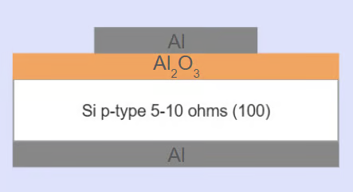
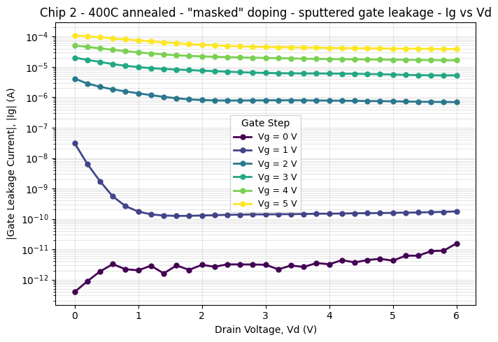
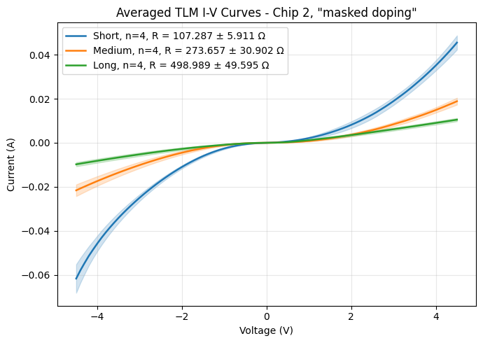

# 💻 CMOS - sputtered gate stack (WIP)

#### Overview

This is in support of the development of a CMOS process that uses a Si-Al2O3-Al gate stack. The NMOS process originally developed with Hacker Fab tooling relies on procuring wafers that already have a Si-SiO2-PolySi prefabricated gate. This prevents the expansion of the NMOS process into a CMOS process. For a CMOS process, it is necessary for the gate stack to be fabricated in house with Hacker Fab tooling. Sputtering of the gate stack from just an Al target is pursued as a potential option to mitigate the risks associated with gate oxide contamination. For context, growing a SiO2 gate oxide has been considered, but abandoned due to a few challenges. The main being contamination control of the gate oxide in an open air tube furnace, contamination that can be introduced between oxide growth and metal deposition for the gate, and the added complexity of dopant pile up + depletion (discussed in the Oxidation Effects Section of "Microchip Fabrication: A Practical Guide to Semiconductor Processing by Peter Van Zant"). Overall this intended process simplifies the tooling required to tape out devices (cuts out evaporator and plasma etcher). Sputtering allows for a low contamination oxide to be deposited, which is immediately covered with a metal gate contact without the chip ever exiting the clean vacuum environment of the sputtering chamber. The choice of Al2O3 as the oxide and Al as the metal is motivated by simplified process flow it allows, and relatively inexpensive target material (Al2O3 is sputtered reactively form an Al target, then Al is sputtered immediately after from the same target, avoiding the need for a 2 target system or a target swapping). Al2O3 has favorable dielectric constant and band alignment, but there are risks related to charge traps forming at the Si-Al2O3 interface. Attempts are made to tune the process to mitigate this interface effect.

**Thus far only NMOS devices have been fabbed to verify effectiveness of sputtered gate oxide. Details on n well doping process dev to allow for CMO devices coming soon**

**More details on general approach and methods and next steps coming soon**

The sputtered film characterization that precedes this work is linked below.


[film-characterization.md](../fab-toolkit/deposition/diy-rf-sputtering-chamber/film-characterization.md)


#### MOSCap Capacitance and Conductance Profiling

**MOSCap Capacitance and Conductance Profiling**

<figure><figcaption></figcaption></figure>

MOSCap devices were fabricated from the sputtered Al and Al2O3 for Conductave-Voltage and Capacititacne voltage profiling. They were fabricated from the process flow inlcuded below from prime p-Si 5-10 ohm (100) wafers. Oxide thickness, surafce preparation method, and post oxide deposition anealing were modulated to study the impact on capcitance and conductance testing.The individual MOSCaps were defined by applying a shadowmask in between the oxide Deposition nad the firt Al deposition.

<table data-header-hidden><thead><tr><th width="80.3636474609375">Step #</th><th width="104.81817626953125">Step Name</th><th width="371.2728271484375">Parameters</th><th>Layer Stacks</th></tr></thead><tbody><tr><td>0</td><td>Substrate Stack</td><td>Si p-type 5-10 ohms (100): 525 µm</td><td>​​</td></tr><tr><td>1</td><td>RCA Clean</td><td>SC 1 Constituents: H2O:NH4OH(29%):H2O2(30%) (5:1:1) SC 1 Cleaning Time: 10 mins SC 1 Cleaning Temperature: 80 °C HF Concentration: 6:1 BOE HF Dip Time: 15 secs HF Dip Temperature: 20 °C SC 2 Constituents: H2O:HCl(37%):H2O2(30%) (6:1:1) SC 2 Cleaning Time: 10 mins SC 2 Cleaning Temperature: 80 °C "SC 1 and 2 mixed in 50ml pyrex beakers directly before using. Optional HF last processing step (Experimental Option) Rinsed with DI Water then N2 dried. Immediately placed into sputtering chamber for pump down."</td><td>​​</td></tr><tr><td>2</td><td>Sputter w/ CMU Hacker Fab RF Sputtering Chamber</td><td>Material: Al2O3 Film thickness: Experimental Option Deposition Rate: .00025 µm/min Deposition Time: 80 mins Sputter Type: RF Sputtering RF or DC Power: 100 Watts Sputter Gas Composition: 9 SCCM UHP Ar : 9 SCCM UHP O2 Chamber Pressure: 4.7E-3 Torr Throw Distance: 3" Base Pressure Pre Deposition: 1E-7 Torr Target Sputter Clean Ar Flow: 30 SCCM Target Sputter Clean Time: 15 Minutes</td><td>​​</td></tr><tr><td>3</td><td>Anneal (Experimental Option)</td><td>Performed in RF sputtering Chamber under partial Vacuum. Pump speed at 250Hz with 50 SCCM of either UHP Ar or UHP O2.</td><td>​​</td></tr><tr><td>4</td><td>Sputter w/ CMU Hacker Fab RF Sputtering Chamber</td><td>Material: Al Film thickness: 150 nm Deposition Rate: .0025 µm/min Deposition Time: 60 mins Sputter Type: RF Sputtering RF or DC Power: 100 Watts Sputter Gas Composition: 15 SCCM UHP Ar Chamber Pressure: 3E-3 Torr Throw Distance: 3" Base Pressure Pre Deposition: 1E-7 Torr Target Sputter Clean Ar Flow: 30 SCCM Target Sputter Clean Time: 15 Minutes SWR During Deposition: 1.5</td><td>​​</td></tr><tr><td>6</td><td>Sputter w/ CMU Hacker Fab RF Sputtering Chamber</td><td>Material: Al Film thickness: 150 nm Deposition Rate: .0025 µm/min Deposition Time: 60 mins Sputter Type: RF Sputtering RF or DC Power: 100 Watts Sputter Gas Composition: 15 SCCM UHP Ar Chamber Pressure: 3E-3 Torr Throw Distance: 3" Base Pressure Pre Deposition: 1E-7 Torr Target Sputter Clean Ar Flow: 30 SCCM Target Sputter Clean Time: 15 Minutes SWR During Deposition: 1.5</td><td>​​</td></tr></tbody></table>

Summary/Comparison

<figure><figcaption></figcaption></figure>

<figure><figcaption></figcaption></figure>

<figure><figcaption></figcaption></figure>

<figure><figcaption></figcaption></figure>

| Processing Conditions             | Al2O3 thickness (nm) | K (raw data) | K (slope method, raw data) | Vfb (P -> N, raw data) | Vfb (N -> P, raw data) | delta Vfb (raw data) | k (corrected data) | k (slope method, corrected data) | Vfb (P -> N, corrected data) | Vfb (N -> P, corrected data) | delta Vfb (corrected data) | G peak (Siemens) (P -> N) | G peak (Siemens) (N -> P) | Series Resistance (Ohms) (calculated) |
| --------------------------------- | -------------------- | ------------ | -------------------------- | ---------------------- | ---------------------- | -------------------- | ------------------ | -------------------------------- | ---------------------------- | ---------------------------- | -------------------------- | ------------------------- | ------------------------- | ------------------------------------- |
| Standard RCA clean                | 45                   | 7.1          | 4.7                        | -0.20                  | -1.15                  | 0.95                 | 7.2                | 4.9                              | -0.20                        | -1.10                        | 0.90                       | 2.2E-05                   | 2.3E-05                   | 565.95                                |
| Standard RCA clean                | 15                   | 5.3          | 2.4                        | -0.80                  | -1.20                  | 0.40                 | 5.5                | 2.5                              | -0.70                        | -1.00                        | 0.30                       | 8.3E-05                   | 8.3E-05                   | 495.45                                |
| HF-Last RCA clean                 | 45                   | 7.4          | 4.7                        | -1.90                  | -2.20                  | 0.30                 | 7.4                | 4.8                              | -1.85                        | -2.15                        | 0.30                       | 1.9E-05                   | 2.0E-05                   | 260.67                                |
| HF-Last RCA clean                 | 20                   | 6.6          | 3.2                        | -1.05                  | -1.85                  | 0.80                 | 6.7                | 3.4                              | -0.95                        | -1.70                        | 0.75                       | 7.5E-05                   | 8.3E-05                   | 289.87                                |
| HF-Last RCA clean, 450C O2 anneal | 20                   | 4.7          | 2.8                        | -4.35                  | -4.70                  | 0.35                 | 5.3                | 3.1                              | -4.15                        | -4.45                        | 0.30                       | 8.1E-05                   | 9.0E-05                   | 910.06                                |

#### MOSCap Leakage Current

<figure><figcaption></figcaption></figure>

#### MOSFETs and TLM Test Structures

<figure><figcaption></figcaption></figure>

<figure><figcaption></figcaption></figure> <figure><figcaption></figcaption></figure>

<table><thead><tr><th width="79.0909423828125">Step #</th><th width="140.6363525390625">Step Name</th><th width="305.181884765625">Parameters</th><th>Layer Stacks</th></tr></thead><tbody><tr><td>0</td><td>Substrate Stack</td><td>p-Si 5-10 ohm (100): 525 µm</td><td></td></tr><tr><td>1</td><td>Acetone + IPA Clean (N2 dry)</td><td>Cleaning Agent: Acetone then IPA Squirt with Acetone, then IPA, then dry the surface with the N2 gun.</td><td></td></tr><tr><td>2</td><td>Bake</td><td>Bake Temperature: 100 °C Bake Time: 60 secs</td><td></td></tr><tr><td>3</td><td>Spin-Coat</td><td>Material Type: Adhesion Promoter Material: HMDS Spin Speed: 4000 rpm Spin Time: 30 secs</td><td></td></tr><tr><td>4</td><td>Bake</td><td>Bake Temperature: 100 °C Bake Time: 60 secs</td><td></td></tr><tr><td>5</td><td>Spin Resist</td><td>Resist: AZ P4210 Resist Type: Positive Spin Speed: 4000 rpm Spin Time: 30 secs</td><td></td></tr><tr><td>6</td><td>Bake</td><td>Bake Temperature: 100 °C Bake Time: 90 secs</td><td></td></tr><tr><td>7</td><td>Hacker Fab Maskless Litho Stepper</td><td>Exposure time: 8 secs</td><td></td></tr><tr><td>8</td><td>Develop</td><td>Developer: AZ 400K : DI Water (1:3) Develop Time: 30 secs</td><td></td></tr><tr><td>9</td><td>Wet-Etch</td><td>Actually performed with SF6 RIE, but can be replaced by a Nitric + HF wet etch solution since this step simply creates alignment marks in the Si.</td><td></td></tr><tr><td>10</td><td>Wet Strip Resist</td><td>Stripping Agent(s): Acetone then IPA Blow dry with N2 gun after.</td><td></td></tr><tr><td>11</td><td>RCA Clean</td><td>SC 1 Constituents: H2O:NH4OH(29%):H2O2(30%) (5:1:1) SC 1 Cleaning Time: 10 mins SC 1 Cleaning Temperature: 80 °C HF Concentration: 6:1 BOE HF Dip Time: 15 secs HF Dip Temperature: 20 °C SC 2 Constituents: H2O:HCl(37%):H2O2(30%) (6:1:1) SC 2 Cleaning Time: 10 mins SC 2 Cleaning Temperature: 80 °C</td><td></td></tr><tr><td>12</td><td>Spin-Coat</td><td>Material Type: Non-Resist Material: 700B (spin on glass) Spin Speed: 4000 rpm Spin Time: 20 secs</td><td></td></tr><tr><td>13</td><td>Bake</td><td>Bake Temperature: 400 °C Bake Time: 10 mins</td><td></td></tr><tr><td>14</td><td>Spin-Coat</td><td>Material Type: Adhesion Promoter Material: HMDS Spin Speed: 4000 rpm Spin Time: 30 secs</td><td></td></tr><tr><td>15</td><td>Bake</td><td>Bake Temperature: 100 °C Bake Time: 60 secs</td><td></td></tr><tr><td>16</td><td>Spin Resist</td><td>Resist: AZ P4210 Resist Type: Positive Spin Speed: 4000 rpm Spin Time: 30 secs</td><td></td></tr><tr><td>17</td><td>Bake</td><td>Bake Temperature: 100 °C Bake Time: 90 secs</td><td></td></tr><tr><td>18</td><td>Hacker Fab Maskless Litho Stepper</td><td>Exposure time: 8 secs</td><td></td></tr><tr><td>19</td><td>Develop</td><td>Developer: AZ 400K : DI Water (1:3) Develop Time: 30 secs</td><td></td></tr><tr><td>20</td><td>Wet-Etch</td><td>Etch Time: 20 secs Etching Agent(s): 6:1 BOE</td><td></td></tr><tr><td>21</td><td>Wet Strip Resist</td><td>Stripping Agent(s): Acetone then IPA Blow dry with N2 gun after.</td><td></td></tr><tr><td>22</td><td>Spin-On Dopant</td><td>Spin-On Dopant Name: P504 (Phosphorus source) Spin Speed: 4000 rpm Spin Time: 20 secs</td><td></td></tr><tr><td>23</td><td>Bake</td><td>Bake Temperature: 200 °C Bake Time: 10 mins</td><td></td></tr><tr><td>24</td><td>Dopant Diffusion</td><td>Diffusion Time: 30 mins Diffusion Temperature: 1100 °C Environmental: false</td><td></td></tr><tr><td>25</td><td>Wet-Etch</td><td>Etch Time: 10 mins Etching Agent(s): 6:1 BOE</td><td></td></tr><tr><td>26</td><td>RCA Clean</td><td>SC 1 Constituents: H2O:NH4OH(29%):H2O2(30%) (5:1:1) SC 1 Cleaning Time: 10 mins SC 1 Cleaning Temperature: 80 °C HF Concentration: 6:1 BOE HF Dip Time: 15 secs HF Dip Temperature: 20 °C SC 2 Constituents: H2O:HCl(37%):H2O2(30%) (6:1:1) SC 2 Cleaning Time: 80 mins SC 2 Cleaning Temperature: 75 °C</td><td></td></tr><tr><td>27</td><td>Sputter w/ CMU Hacker Fab RF Sputtering Chamber</td><td>Material: Al2O3 Film thickness: 20 nm Deposition Rate: .25 Å/s Deposition Time: 80 mins Sputter Type: RF Sputtering RF or DC Power: 100 Watts Sputter Gas Composition: 9 SCCM UHP Ar : 9 SCCM UHP O2 Chamber Pressure: 4.7E-3 Torr Throw Distance: 3" Base Pressure Pre Deposition: 1E-7 Torr Target Sputter Clean Ar Flow: 30 SCCM Target Sputter Clean Time: 15 Minutes SWR During Deposition: 1.5</td><td></td></tr><tr><td>28</td><td>Sputter w/ CMU Hacker Fab RF Sputtering Chamber</td><td>Material: Al Film thickness: 150 nm Deposition Rate: 2.5 Å/s Deposition Time: 60 mins Sputter Type: RF Sputtering RF or DC Power: 100 Watts Sputter Gas Composition: 15 SCCM UHP Ar Chamber Pressure: 3E-3 Torr Throw Distance: 3" Base Pressure Pre Deposition: 1E-7 Torr Target Sputter Clean Ar Flow: 30 SCCM Target Sputter Clean Time: 15 Minutes SWR During Deposition: 1.5</td><td></td></tr><tr><td>29</td><td>Spin Resist</td><td>Resist: AZ P4210 Resist Type: Positive Spin Speed: 4000 rpm Spin Time: 30 secs</td><td></td></tr><tr><td>30</td><td>Bake</td><td>Bake Temperature: 100 °C Bake Time: 90 secs</td><td></td></tr><tr><td>31</td><td>Hacker Fab Maskless Litho Stepper</td><td>Exposure time: 8 secs</td><td></td></tr><tr><td>32</td><td>Develop</td><td>Developer: AZ 400K : DI Water (1:3) Develop Time: 30 secs</td><td></td></tr><tr><td>33</td><td>Wet-Etch</td><td>Etch Time: 8 mins Etching Agent(s): Type A Al Etch (PAN) Etch Temperature: 40 °C</td><td></td></tr><tr><td>34</td><td>Wet Strip Resist</td><td>Stripping Agent(s): Acetone then IPA Blow dry with N2 gun after.</td><td></td></tr><tr><td>35</td><td>Spin-Coat</td><td>Material Type: Non-Resist Material: 700B (spin on glass) Spin Speed: 4000 rpm Spin Time: 20 secs</td><td></td></tr><tr><td>36</td><td>Bake</td><td>Bake Temperature: 400 °C Bake Time: 10 mins</td><td></td></tr><tr><td>37</td><td>Spin-Coat</td><td>Material Type: Adhesion Promoter Material: HMDS Spin Speed: 4000 rpm Spin Time: 30 secs</td><td></td></tr><tr><td>38</td><td>Bake</td><td>Bake Temperature: 100 °C Bake Time: 60 secs</td><td></td></tr><tr><td>39</td><td>Spin Resist</td><td>Resist: AZ P4210 Resist Type: Positive Spin Speed: 4000 rpm Spin Time: 30 secs</td><td></td></tr><tr><td>40</td><td>Bake</td><td>Bake Temperature: 100 °C Bake Time: 90 secs</td><td></td></tr><tr><td>41</td><td>Hacker Fab Maskless Litho Stepper</td><td>Exposure time: 8 secs</td><td></td></tr><tr><td>42</td><td>Develop</td><td>Developer: AZ 400K : DI Water (1:3) Develop Time: 30 secs</td><td></td></tr><tr><td>43</td><td>Wet-Etch</td><td>Etch Time: 20 secs Etching Agent(s): 6:1 BOE</td><td></td></tr><tr><td>44</td><td>Wet Strip Resist</td><td>Stripping Agent(s): Acetone then IPA Blow dry with N2 gun after.</td><td></td></tr><tr><td>45</td><td>Sputter w/ CMU Hacker Fab RF Sputtering Chamber</td><td>Material: Al Film thickness: 300 nm Deposition Rate: 2.5 Å/s Deposition Time: 120 mins Sputter Type: RF Sputtering RF or DC Power: 100 Watts Sputter Gas Composition: 15 SCCM UHP Ar Chamber Pressure: 3E-3 Torr Throw Distance: 3" Base Pressure Pre Deposition: 1E-7 Torr Target Sputter Clean Ar Flow: 30 SCCM Target Sputter Clean Time: 15 Minutes SWR During Deposition: 1.5</td><td></td></tr><tr><td>46</td><td>Spin Resist</td><td>Resist: AZ P4210 Resist Type: Positive Spin Speed: 4000 rpm Spin Time: 30 secs</td><td></td></tr><tr><td>47</td><td>Bake</td><td>Bake Temperature: 100 °C Bake Time: 90 secs</td><td></td></tr><tr><td>48</td><td>Hacker Fab Maskless Litho Stepper</td><td>Exposure time: 8 secs</td><td></td></tr><tr><td>49</td><td>Develop</td><td>Developer: AZ 400K : DI Water (1:3) Develop Time: 30 secs</td><td></td></tr><tr><td>50</td><td>Wet-Etch</td><td>Etch Time: 4 mins Etching Agent(s): Type A Al Etchant (PAN)</td><td></td></tr><tr><td>51</td><td>Wet Strip Resist</td><td>Stripping Agent(s): Acetone then IPA Blow dry with N2 gun after.</td><td></td></tr></tbody></table>

Steps 12-25 replaced by the below sequence in chip 1 for "maskless" diffusion:

| 
Spin-On and Bake P504 Dopant (400 rpm 20s, 200C 10 mins)
 | ![](data:image/png;base64,iVBORw0KGgoAAAANSUhEUgAAAH0AAAB9CAYAAACPgGwlAAAEKUlEQVR4AezYz04TURTH8emUvxVBVExM1MSNCfV5eAKhG2O3uiTGlXt9CR6ALWxYsqJs2BNC07QpCUGqjEMmoQMlztWZ6733nG/T2wzJnTPn/D7MQBpHvNQlALo68igCHXSFCSgcmTsddIUJKByZOx10hQkoHNnWna4wynBGBj0cq8o6Bb2yKMMpBHo4VpV1CnplUYZTCPRwrCrrFPTKogynEOjhWFXWaWjolQ2uuRDoCvVBB11hAgpH5k4HXWECCkfmTgddYQIKR+ZOz9BVfYKuijsbFvQsB1WfoKvizoYFPctB1SfoqrizYUHPclD1Cboq7mxY0LMcbH16WRd0L1nsNgW63Xy9rA66lyx2mwLdbr5eVgfdSxa7TYFuN18vq4PuJYvdpkC3m6+t6qXqgl4qvjBPBj1Mt1Jdg14qvjBPBj1Mt1Jdg14qvjBPBj1Mt1Jdg14qvjBPBj1Mt1Jd/wG9VF1O9jgB0D3GsdUa6LaS9bgu6B7j2GoNdFvJelwXdI9xbLUGuq1kPa4Lusc4tlpzgG5rFOqaJgC6aVKC9oEuCNN0FNBNkxK0D3RBmKajgG6alKB9oAvCNB0FdNOkBO0ThC5IxfIooFsO2MfyoPuoYrkn0C0H7GN50H1UsdwT6JYD9rE86D6qWO4JdMsB+1ge9EIVeRtAl2daOBHohRHJ2wC6PNPCiUAvjEjeBtDlmRZOBHphRPI2gC7PtHAi0AsjsrXBXV3Q3WXv7MqgO4ve3YVBd5e9syuD7ix6dxcG3V32zq4MurPo3V0YdHfZO7sy6M6it3Xh4rqgF2ckbgfo4kiLBwK9OCNxO0AXR1o8EOjFGYnbEa8lyczGYLCx3u+3WbIzeNfrrUdJEscvoqieJMmH9Nf5EysSnUGtXn+/trVV4/Ge/qZre/8buraUhM0LujBQk3FAN0lJ2B7QhYGajAO6SUrC9oAuDNRkHNBNUhK2B3RhoCbj+IVu0jF7SicQL3Y69Yfd7tzinVUfjepRLf3GLrfmB4P63X38PJnd/85kbjicsJq6vKxN9HF6Ovd2ZaUWL2xvJ6s7O0uru7vL+dUYDn+lX85f5dfr/f2r/B6Ob2fmKo9XnU6Ud7o+Xjo5ubinn6Vmt5vweC/9sAyvAOjhmZXuGPTSEYZXIG40GrX0NUpbv8yv9J+7meXj4+n8mhqNZvJ7OI5uZeYqj+mLiwmrB/1+455+RoeHh7X4/Pw8SV/T6YZr0Jv18uDgyZu9vaf5NX929vjuPn6ObjJzlcVCr/co73R9/Pzo6Nk9/Uw3m00l/8il0/MeJ8Df9HEWao5AV0M9HhT0cRZqjkBXQz0eFPRxFmqOQFdDPR4U9HEWao7i2dnZn+m039IvaL6ykr/LIAlu//f0G7kkbrfbP1qt1ud0fWS1pGfwZXNz84rHe/qY0/b+DQAA//9uCbQlAAAABklEQVQDAJbMgVWPZbZDAAAAAElFTkSuQmCC)                                                                                                                                                                                                                                                     |
| ------------------------------------------------------------------ | --------------------------------------------------------------------------------------------------------------------------------------------------------------------------------------------------------------------------------------------------------------------------------------------------------------------------------------------------------------------------------------------------------------------------------------------------------------------------------------------------------------------------------------------------------------------------------------------------------------------------------------------------------------------------------------------------------------------------------------------------------------------------------------------------------------------------------------------------------------------------------------------------------------------------------------------------------------------------------------------------------------------------------------------------------------------------------------------------------------------------------------------------------------------------------------------------------------------------------------------------------------------------------------------------------------------------------------------------------------------------------------------------------------------------------------------------------------------------------------------------------------------------------------------------------------------------------------------------------------------------------------------------------------------------------------------------------------------------------------------------------------------------------------------------------------------------------------------------------------- |
| Pattern on top of P504 Dopant                                      | ![](data:image/png;base64,iVBORw0KGgoAAAANSUhEUgAAAH0AAAB9CAYAAACPgGwlAAAEvUlEQVR4AezbTU8TURQG4PmwgIAgKiYmKroxAjsMblgaN/IZgr9AYIGxCze6ROPKvf4J9rAygQ2JmBD5dEGCYUMIpGmDLLDVXm8ziw6UOLed3vbce96mtxmTO2fOeR9nbJroOXixSwDo7MgdB+hAZ5gAw5FxpwOdYQIMR8adDnSGCTAcWdedzjBKc0YGujlWVesU6FWL0pxCQDfHqmqdAr1qUZpTCOjmWFWtU6BXLUpzCgHdHKuqdWoaetUG51wI6Az1gQ50hgkwHBl3OtAZJsBwZNzpQGeYAMORcacH6Kw+gc6KOxgW6EEOrD6Bzoo7GBboQQ6sPoHOijsYFuhBDqw+gc6KOxgW6EEOuj5J1gU6SRa9TQFdb74kqwOdJIvepoCuN1+S1YFOkkVvU0DXmy/J6kAnyaK3KaDrzVdX9Vh1gR4rPjNPBrqZbrG6Bnqs+Mw8GehmusXqGuix4jPzZKCb6Rara6DHis/Mk4Fuplusrv+DHqsuTiacANAJ4+hqDei6kiVcF+iEcXS1BnRdyRKuC3TCOLpaA7quZAnXBTphHF2t1QFd1yioq5oA0FWTsmgf0C3CVB0F6KpJWbQP6BZhqo4CdNWkLNoHdIswVUcBumpSFu2zCN0iFc2jAF1zwBTLA52iiuaegK45YIrlgU5RRXNPQNccMMXyQKeoorknoGsOmGJ5oEeq2LcB6PaZRk4E9MiI7NsAdPtMIycCemRE9m0Aun2mkRMBPTIi+zYA3T7TyImAHhmRrg31qwv0+mVftytXhL4+Ovru++joT0prbWzsic4U14aGhinNW+hlfWTkdSUzV4Sed91r8mL3KC3hOL7sR9tb+H6zLE5q5rzntcieyn5XhF72VXACqQSAToqjNs0AvTY5k7oK0Elx1KYZoNcm5xpeJfpSQI/OyLodQLeONHogoEdnZN0OoFtHGj0Q0KMzsm6H91yIhqlMZmoynU6qrm+Dgw93+/p+UVrzMzMjqv1Xsu/L1NRTSvMWelkZH39UziwvUqnJWSE877b8zVoI8Ur+dX6rur5OTPTOJ5MnlNZuf/+4av+V7PsxMPCM0ryFXlaGhx+XM4vr+y+35uZcPN5latzelaFzS8myeYFuGajKOEBXScmyPUC3DFRlHKCrpGTZHqBbBqoyDtBVUrJsD9AtA1UZhxa6SsfYEzsBr21ry79ydNTUdm75uZzvuPIXu9C6nMn45/fhz6XZ1TqTppOTEqtL2axb0sfhYVNvZ6frtS4siO7FxfbupaWO8Go+Pv7rCJEPr/urq/nwHhyfzaxeedzd2HDCToXj9oOD0wv6ae85OhJ4vMd+WJpXAOjmmcXuGOixIzSvgNfV1eXKV062ng0v+eWuoWN/PxFeiWy2MbwHx86ZzOqVR+L0tMSqJZ0u/N+78/3ltre3XW9vb0/IV0I23BBedzY3rz9YXr4RXvJbYkd4D46dM5nVK4/WVOpq2KlwfGtn5+YF/SR6enqYfJGT0+NdTAD/phezYHMEdDbUxUGBXsyCzRHQ2VAXBwV6MQs2R0BnQ10cFOjFLNgceY2NjX/ktJ/kDzQfsUR5GQjj9n+Wv8gJL5lM/p6enn4v1xusadsz+DA7O5vH410+5ri9/wEAAP//wIi85QAAAAZJREFUAwA+Sa5ko4ZmlQAAAABJRU5ErkJggg==)                                             |
| Wet-Etch P504 Dopant with 6:1 BOE (20s)                            | ![](data:image/png;base64,iVBORw0KGgoAAAANSUhEUgAAAH0AAAB9CAYAAACPgGwlAAAEpUlEQVR4AezZv04UURQG8JlZEYOJiRaiMf4hmhgpNrIdibExsREhMb6AzVqYbLI2UiKxstewLD4CpfT0EKShAOM+AB0qKhDGMzvFXibGGWbm7J57z2fmrnfHO3fO+X6ZzQqBhz/qEgC6OnLPAzrQFSagsGU86UBXmIDClvGkA11hAgpb5nrSFUZpT8tAt8eqtEqBXlqU9mwEdHusSqsU6KVFac9GQLfHqrRKgV5alPZsBHR7rEqr1Db00hrXvBHQFeoDHegKE1DYMp50oCtMQGHLeNKBrjABhS3jSY/RVb0CXRV33CzQ4xxUvQJdFXfcLNDjHFS9Al0Vd9ws0OMcVL0CXRV33CzQ4xy4XkXuC3SRLLxFAZ03X5G7A10kC29RQOfNV+TuQBfJwlsU0HnzFbk70EWy8BYFdN58uXYvtC/QC8Vn58VAt9OtUNVALxSfnRcD3U63QlUDvVB8dl4MdDvdClUN9ELx2Xkx0O10K1T1f9AL7YuLBScAdME4XKUBnStZwfsCXTAOV2lA50pW8L5AF4zDVRrQuZIVvC/QBeNwlTYAdK5WsG/WBICeNSmH1gHdIcysrQA9a1IOrQO6Q5hZWwF61qQcWgd0hzCztgL0rEk5tM4hdIdUmFsBOnPAErcHukQV5pqAzhywxO2BLlGFuSagMwcscXugS1RhrgnozAFL3B7oqSruLQC6e6apHQE9NSL3FgDdPdPUjoCeGpF7C4DunmlqR0BPjci9BUB3zzS1I6CnRsS1YHD7An1w2Q/szrnQv8zMvKXRkTQ2p6YecaZI+z+V1G+3lunp13l6zoXu+f4lutktSSM8c6ZC9bAdYaUyQpuL6tkLgvNU06mPfOinvg0ukJQA0CVp9KkWoPcpaEm3AbokjT7VAvQ+Bd2/26TfCejpGTm3AujOkaY3BPT0jJxbAXTnSNMbAnp6Rs6tyIX+rVY7oPFd0vg6MeFz6nRqtSNJ/XZrqVaP8/ScC/1zo/FrpdH4IWlQTb/zBJD1mpVm81BSv91ams2fWes31+VCNzfA3L4E8qHb1ycqNhIAuhGGlinQtUgbfQLdCEPLFOhapI0+gW6EoWUKdC3SRp9AN8LQMpWFriX1AfcZtFqtocXFxal2u/0sMUaTtS0tLT2M1ox2Oncv7O6ekzTurK93a4vq4xjXNzYmJfUb1XJlZ6ca9bqwsDCZtCLXG9G/mYPOPZmbmwuCvb29s3TBJxrLiTFG75PHLJ1YHltbe35vdfWipHG505mPauMaV7e3ZyX1G9Vyc3PzRdRvpVJ5SX+fOHzfv08nTpgGQdAeHx/38fFOyWg7gK5NnPoFOoWg7QhGRkbo498/pMYPEmOGvgTUzRGG4bXEmuQ1eO95fc+AAG+bTtGczj3+h9Xh1taWH+zv75NlOEQLoi905oi+tLXovDmq9N5cg7nnDTwDAnxALqZTNH9F55K1DdEXuVDHxzt1j6OXANB7WaiZAV0Nda9RoPeyUDMDuhrqXqNA72WhZgZ0NdS9RoHey0LNLBgeHj6ibj/Qf/DfY4SnyyC0bv1H+olcGDQajT/1en2exhuMuusZvKPfpx/j450+5rQdfwEAAP//+PmWhwAAAAZJREFUAwCnT8dVgqJk3QAAAABJRU5ErkJggg==)                                                                             |
| Dopant Diffusion (1100C 30 mins)                                   | ![](data:image/png;base64,iVBORw0KGgoAAAANSUhEUgAAAH0AAAB9CAYAAACPgGwlAAAE30lEQVR4Aezau2sUURQG8Dujm8VVJAg+wAeIIBJQLCwsLBREC0XBUrHTbYRop9gYxEoU0igkwUawtAyIYhr/h7TGJKh5aJJds5DH7njHaXZG8e5m5uSee88ne5fMcufMOd8vs64mocIfcQkAXRy5UkAHusAEBI6MOx3oAhMQODLudKALTEDgyFR3usAo3RkZ6O5YFdYp0AuL0p1CQHfHqrBOgV5YlO4UAro7VoV1CvTConSnENDdsSqsU9fQCxtcciGgC9QHOtAFJiBwZNzpQBeYgMCRcacDXWACAkfGnZ6gi3oGuijuZFigJzmIega6KO5kWKAnOYh6Broo7mRYoCc5iHoGuijuZFigJzlQPbOsC3SWLLRNAZ02X5bVgc6ShbYpoNPmy7I60Fmy0DYFdNp8WVYHOksW2qaATpsvVfVcdYGeKz43Twa6m265ugZ6rvjcPBnobrrl6hroueJz82Sgu+mWq2ug54rPzZOB7qZbrq7/g56rLk5mnADQGeNQtQZ0qmQZ1wU6Yxyq1oBOlSzjukBnjEPVGtCpkmVcF+iMcahas4BONQrqdpoA0DtNyqN9QPcIs9NRgN5pUh7tA7pHmJ2OAvROk/JoH9A9wux0FKB3mpRH+zxC90iFeBSgEwfMsTzQOaoQ9wR04oA5lgc6RxXinoBOHDDH8kDnqELcE9CJA+ZYHuhGFf82AN0/U+NEQDdG5N8GoPtnapwI6MaI/NsAdP9MjRMB3RiRfxuA7p+pcSKgGyOi2mCvLtDtZW/tykC3Fr29CwPdXvbWrgx0a9HbuzDQ7WVv7cpAtxa9vQsD3V721q4MdGvRU13YXBfo5oy82wF070jNAwHdnJF3O4DuHal5IKCbM/Jux4bQb9XrZ28tLPSzWouLhyl1bs/NHWU1b5z/0tLpjcy8IfSo2TyvL/aA02pG0SHdD92jXD6mi7OaWbVam4euh8fD4QQ2dKcrhwdG60oBXeB3AdCBLjABgSPjTge6wAQEjow7HegCExA4Mq87XSCAjZHDoaGh0vDw8OWRkZFrmbU329Dz92NXnn38dLN3/ufxynJjG6d1YPLrhbi3wdHR65k5snN1dTw4+u56XHfP5PQ5TvPGveyamz8V9zb4Yexi1kq7HsrmoF+7NDAwEIa1Wq1Hn/BKr7eZ9fcPMHq2PorKpdf7vs9eOTgx1ctp7azXH8a9qWDLm8wc2bm6Oo62hG/iur2LtXuc5o172T3740bcW2tr6a6eOfUIguCkfiE1axiGI319fUFXb+/h2npDF2L9CJrNQvsLmq1C61EUC1ZXlrup2xX69snP9e1TE6oyPcl0fVHb5ma6md+4tzLzjemsiUHssWNqgg49jCJV+lVXPfUlpqumir/T15nOuvSnr9hDaRfjd2/bhrBSqei3/2BNv7aaWVf1B4Fq+4qiaH9mT/YcHCu16RlowCPtTvHX+rUL/7BaGx8fD8JGo6Eto5LeEH+ga1/xLwwM6dfb1wl93L4HXytlPQMNeEa7tDvFX9/Rr2V7K+kPclFXf6frIm4+0HUqAaCn4pBxAHQZzqkpgZ6KQ8YB0GU4p6YEeioOGQdAl+GcmhLoqThkHITlcnldj/pC/wP/KVbUXQaRc/tf6v+Ri8L+/v6VarX6WK/7WFXfM3iif57ewtu7fpuT9vgNAAD//0k7voAAAAAGSURBVAMAEHYAZPzYjVIAAAAASUVORK5CYII=) |

#### MOSFET masks, images, and results



### pattern and etch alignment marks into Si

<figure><figcaption></figcaption></figure> <figure><figcaption></figcaption></figure>




### spin on glass (dopant mask), pattern and etch source/drain regions&#x20;

<figure><figcaption></figcaption></figure> <figure><figcaption></figcaption></figure>




### spin on dopant, diffuse

<figure><figcaption></figcaption></figure>



### etch/clean off dopant, sputter gate films, pattern and etch gates

<figure><figcaption></figcaption></figure> <figure><figcaption></figcaption></figure>




### spin on glass, pattern and etch contact holes

<figure><figcaption></figcaption></figure> <figure><figcaption></figcaption></figure>




### sputter Al, pattern and etch contact pads

<figure><figcaption></figcaption></figure> <figure><figcaption></figcaption></figure>




All curves below recorded on lower row (50 um gate length, 21.4 um channel length)

Chip 1 electrical testing

<figure><figcaption></figcaption></figure>

<figure><figcaption></figcaption></figure> <figure><figcaption></figcaption></figure>

Chip 2 pre anneal electrical testing

<figure><figcaption></figcaption></figure>

<figure><figcaption></figcaption></figure> <figure><figcaption></figcaption></figure>

Chip 2 post anneal electrical testing

<figure><figcaption></figcaption></figure>

<figure><figcaption></figcaption></figure> <figure><figcaption></figcaption></figure>

<table><thead><tr><th width="158.00006103515625">Chip/Processing</th><th width="159">On Current Vd=5, Vg=0 (A)</th><th width="154.818359375">Off Current Vd=5, Vg=0 (A)</th><th width="184.7274169921875">On/Off Ratio Vd = 5</th></tr></thead><tbody><tr><td>Chip 1 "maskless" doping</td><td>3.2E-3</td><td>8.8E-4</td><td>3.6</td></tr><tr><td>Chip 2 "masked" doping - best</td><td>4.4E-4</td><td>1.2E-6</td><td>369</td></tr><tr><td>Chip 2 400C annealed "masked" doping</td><td>4.9E-4</td><td>2.2E-6</td><td>227</td></tr></tbody></table>

#### TLM Structures (contact resistance and sheet resistance results)

Built on same chip(s) as FETs

<figure><figcaption></figcaption></figure> <figure><figcaption></figcaption></figure>

<figure><figcaption></figcaption></figure> <figure><figcaption></figcaption></figure>

<figure><figcaption></figcaption></figure> <figure><figcaption></figcaption></figure> <figure><figcaption></figcaption></figure>

<figure><figcaption></figcaption></figure> <figure><figcaption></figcaption></figure>

| Processing                             | Specific contact resistance (ohm-cm^2) | Sheet Resistance (ohm/square) |
| -------------------------------------- | -------------------------------------- | ----------------------------- |
| Chip 1 "maskless doping"               | 7.15E-4                                | 56.32                         |
| Chip 2 "masked doping"                 | 1.78E-3                                | 113.25                        |
| Chip 2 "masked doping" - 400C annealed | 3.75E-4                                | 92.27                         |

## Appendix

#### 9:9, 3hr, Standard RCA Clean

<figure><figcaption></figcaption></figure> <figure><figcaption></figcaption></figure> <figure><figcaption></figcaption></figure>

<figure><figcaption></figcaption></figure> <figure><figcaption></figcaption></figure> <figure><figcaption></figcaption></figure>

<figure><figcaption></figcaption></figure> <figure><figcaption></figcaption></figure> <figure><figcaption></figcaption></figure>

<figure><figcaption></figcaption></figure> <figure><figcaption></figcaption></figure> <figure><figcaption></figcaption></figure>

| size (area)       | frequency | area\_mm2 | k\_avg\_raw | k\_slope\_avg\_raw | Vfb\_PN\_avg\_raw | Vfb\_NP\_avg\_raw | deltaVfb\_avg\_raw | k\_avg\_corrected | k\_slope\_avg\_corrected | Vfb\_PN\_avg\_corrected | Vfb\_NP\_avg\_corrected | deltaVfb\_avg\_corrected | Gpeak\_PN\_S | Gpeak\_NP\_S | Rs\_mean\_ohm |
| ----------------- | --------: | --------: | ----------: | -----------------: | ----------------: | ----------------: | -----------------: | ----------------: | -----------------------: | ----------------------: | ----------------------: | -----------------------: | -----------: | -----------: | ------------: |
| Small (0.2 mm²)   |     10KHz |      0.20 |    7.428647 |           5.073352 |              0.35 |             -0.90 |               1.25 |          9.863421 |                 4.937214 |                    0.05 |                   -1.35 |                     1.40 |     0.000012 |     0.000012 |  20992.490094 |
| Small (0.2 mm²)   |    100KHz |      0.20 |    7.114325 |           4.743494 |             -0.20 |             -1.15 |               0.95 |          7.186758 |                 4.910686 |                   -0.20 |                   -1.10 |                     0.90 |     0.000022 |     0.000023 |    565.949437 |
| Small (0.2 mm²)   |      1MHz |      0.20 |    6.768461 |           1.728415 |             -0.60 |             -1.40 |               0.80 |          7.379437 |                 6.553137 |                   -0.50 |                   -1.30 |                     0.80 |     0.000512 |     0.000514 |    165.844804 |
| Medium (0.79 mm²) |     10KHz |      0.79 |    6.697895 |           5.073352 |              0.45 |             -0.60 |               1.05 |          6.800300 |                 4.937214 |                    0.50 |                   -0.55 |                     1.05 |     0.000009 |     0.000010 |   1349.595597 |
| Medium (0.79 mm²) |    100KHz |      0.79 |    6.529448 |           4.743494 |             -0.10 |             -0.95 |               0.85 |          6.571378 |                 4.910686 |                    0.00 |                   -0.85 |                     0.85 |     0.000095 |     0.000099 |    124.666071 |
| Medium (0.79 mm²) |      1MHz |      0.79 |    5.318851 |           1.728415 |             -0.45 |             -1.30 |               0.85 |          7.888473 |                 6.553137 |                   -0.40 |                   -1.25 |                     0.85 |     0.003640 |     0.003644 |     90.601948 |
| Large (1.77 mm²)  |     10KHz |      1.77 |    5.409678 |           5.073352 |              0.40 |             -0.25 |               0.65 |          5.535893 |                 4.937214 |                    0.45 |                   -0.10 |                     0.55 |     0.000023 |     0.000023 |   1002.470871 |
| Large (1.77 mm²)  |    100KHz |      1.77 |    5.092326 |           4.743494 |             -0.15 |             -0.60 |               0.45 |          5.241898 |                 4.910686 |                    0.00 |                   -0.45 |                     0.45 |     0.000241 |     0.000233 |    132.262058 |
| Large (1.77 mm²)  |      1MHz |      1.77 |    2.455902 |           1.728415 |             -0.35 |             -0.40 |               0.05 |          6.723377 |                 6.553137 |                   -0.45 |                   -0.50 |                     0.05 |     0.006887 |     0.006341 |    107.769918 |

#### 9:9, 1hr, Standard RCA Clean

<figure><figcaption></figcaption></figure> <figure><figcaption></figcaption></figure> <figure><figcaption></figcaption></figure>

<figure><figcaption></figcaption></figure> <figure><figcaption></figcaption></figure> <figure><figcaption></figcaption></figure>

<figure><figcaption></figcaption></figure> <figure><figcaption></figcaption></figure> <figure><figcaption></figcaption></figure>

<figure><figcaption></figcaption></figure> <figure><figcaption></figcaption></figure>

| size (area)       | frequency | area\_mm2 | k\_avg\_raw | k\_slope\_avg\_raw | Vfb\_PN\_avg\_raw | Vfb\_NP\_avg\_raw | deltaVfb\_avg\_raw | k\_avg\_corrected | k\_slope\_avg\_corrected | Vfb\_PN\_avg\_corrected | Vfb\_NP\_avg\_corrected | deltaVfb\_avg\_corrected | Gpeak\_PN\_S | Gpeak\_NP\_S | Rs\_mean\_ohm |
| ----------------- | --------: | --------: | ----------: | -----------------: | ----------------: | ----------------: | -----------------: | ----------------: | -----------------------: | ----------------------: | ----------------------: | -----------------------: | -----------: | -----------: | ------------: |
| Small (0.2 mm²)   |     10KHz |      0.20 |    6.141816 |           0.904621 |             -0.30 |             -1.00 |               0.70 |         13.045352 |                 0.173698 |                   -0.75 |                   -0.80 |                     0.05 |     0.000052 |     0.000056 |   9025.245375 |
| Small (0.2 mm²)   |    100KHz |      0.20 |    5.301111 |           2.379235 |             -0.80 |             -1.20 |               0.40 |          5.513058 |                 2.470873 |                   -0.70 |                   -1.00 |                     0.30 |     0.000083 |     0.000083 |    495.445897 |
| Small (0.2 mm²)   |      1MHz |      0.20 |    3.828395 |           0.381960 |             -1.10 |             -1.55 |               0.45 |          5.758140 |                 3.908771 |                   -1.00 |                   -1.35 |                     0.35 |     0.002048 |     0.002042 |    166.487007 |
| Medium (0.79 mm²) |     10KHz |      0.79 |    3.996518 |           0.904621 |             -0.25 |             -0.60 |               0.35 |          5.358427 |                 0.173698 |                   -0.40 |                   -0.70 |                     0.30 |     0.000075 |     0.000072 |   3649.048078 |
| Medium (0.79 mm²) |    100KHz |      0.79 |    3.610729 |           2.379235 |             -0.55 |             -0.95 |               0.40 |          3.720343 |                 2.470873 |                   -0.50 |                   -0.80 |                     0.30 |     0.000190 |     0.000199 |    159.210655 |
| Medium (0.79 mm²) |      1MHz |      0.79 |    1.724243 |           0.381960 |             -0.85 |             -1.25 |               0.40 |          4.774321 |                 3.908771 |                   -1.00 |                   -1.30 |                     0.30 |     0.006874 |     0.006886 |     95.271610 |
| Large (1.77 mm²)  |     10KHz |      1.77 |    1.616946 |           0.904621 |             -1.45 |             -0.60 |               0.85 |          1.759600 |                 0.173698 |                   -1.40 |                   -0.60 |                     0.80 |     0.000002 |     0.000061 |   1696.143692 |
| Large (1.77 mm²)  |    100KHz |      1.77 |    2.742960 |           2.379235 |             -0.35 |             -0.75 |               0.40 |          2.847340 |                 2.470873 |                   -0.35 |                   -0.70 |                     0.35 |     0.000355 |     0.000355 |    104.022923 |
| Large (1.77 mm²)  |      1MHz |      1.77 |    0.803455 |           0.381960 |             -0.40 |             -0.75 |               0.35 |          4.144864 |                 3.908771 |                   -0.55 |                   -0.95 |                     0.40 |     0.010591 |     0.010604 |     77.807216 |

#### 9:9, 3 hr, HF last

<figure><figcaption></figcaption></figure>

<figure><figcaption></figcaption></figure>

<figure><figcaption></figcaption></figure>

<figure><figcaption></figcaption></figure>

<figure><figcaption></figcaption></figure>

<figure><figcaption></figcaption></figure>

<figure><figcaption></figcaption></figure>

<figure><figcaption></figcaption></figure>

<figure><figcaption></figcaption></figure>

<figure><figcaption></figcaption></figure>

<figure><figcaption></figcaption></figure>

<figure><figcaption></figcaption></figure>

| size (area)       | frequency | area\_mm2 | k\_avg\_raw | k\_slope\_avg\_raw | Vfb\_PN\_avg\_raw | Vfb\_NP\_avg\_raw | deltaVfb\_avg\_raw | k\_avg\_corrected | k\_slope\_avg\_corrected | Vfb\_PN\_avg\_corrected | Vfb\_NP\_avg\_corrected | deltaVfb\_avg\_corrected | Gpeak\_PN\_S | Gpeak\_NP\_S | Rs\_mean\_ohm |
| ----------------- | --------: | --------: | ----------: | -----------------: | ----------------: | ----------------: | -----------------: | ----------------: | -----------------------: | ----------------------: | ----------------------: | -----------------------: | -----------: | -----------: | ------------: |
| Small (0.2 mm²)   |     10KHz |      0.20 |    7.685834 |           5.625961 |             -1.45 |             -1.90 |               0.45 |          7.766772 |                 5.877118 |                   -1.40 |                   -1.85 |                     0.45 |     0.000002 |     0.000002 |   3053.672852 |
| Small (0.2 mm²)   |    100KHz |      0.20 |    7.396978 |           4.707130 |             -1.90 |             -2.20 |               0.30 |          7.414154 |                 4.847823 |                   -1.85 |                   -2.15 |                     0.30 |     0.000019 |     0.000020 |    260.665467 |
| Small (0.2 mm²)   |      1MHz |      0.20 |    6.890245 |           2.242337 |             -2.25 |             -2.55 |               0.30 |          7.407294 |                 4.727527 |                   -2.20 |                   -2.45 |                     0.25 |     0.000470 |     0.000471 |    148.915132 |
| Medium (0.79 mm²) |     10KHz |      0.79 |    7.129632 |           5.625961 |             -0.90 |             -1.30 |               0.40 |          7.175604 |                 5.877118 |                   -0.85 |                   -1.25 |                     0.40 |     0.000008 |     0.000009 |   1143.266648 |
| Medium (0.79 mm²) |    100KHz |      0.79 |    6.360197 |           4.707130 |             -1.25 |             -1.60 |               0.35 |          6.415378 |                 4.847823 |                   -1.20 |                   -1.55 |                     0.35 |     0.000085 |     0.000090 |    147.965410 |
| Medium (0.79 mm²) |      1MHz |      0.79 |    5.041438 |           2.242337 |             -1.55 |             -1.95 |               0.40 |          6.663681 |                 4.727527 |                   -1.50 |                   -1.85 |                     0.35 |     0.002853 |     0.002849 |     87.454312 |
| Large (1.77 mm²)  |     10KHz |      1.77 |    5.925761 |           5.625961 |             -1.75 |             -2.05 |               0.30 |          6.146619 |                 5.877118 |                   -1.60 |                   -1.85 |                     0.25 |     0.000026 |     0.000026 |   1447.212115 |
| Large (1.77 mm²)  |    100KHz |      1.77 |    5.077424 |           4.707130 |             -2.15 |             -2.35 |               0.20 |          5.200458 |                 4.847823 |                   -2.05 |                   -2.25 |                     0.20 |     0.000191 |     0.000195 |    136.210088 |
| Large (1.77 mm²)  |      1MHz |      1.77 |    2.878274 |           2.242337 |             -2.25 |             -2.50 |               0.25 |          5.116181 |                 4.727527 |                   -2.30 |                   -2.55 |                     0.25 |     0.005637 |     0.005627 |     79.692297 |

#### 9:9, 80 min, HF last

<figure><figcaption></figcaption></figure>

<figure><figcaption></figcaption></figure>

<figure><figcaption></figcaption></figure>

<figure><figcaption></figcaption></figure>

<figure><figcaption></figcaption></figure>

<figure><figcaption></figcaption></figure>

<figure><figcaption></figcaption></figure>

<figure><figcaption></figcaption></figure>

<figure><figcaption></figcaption></figure>

<figure><figcaption></figcaption></figure>

<figure><figcaption></figcaption></figure>

<figure><figcaption></figcaption></figure>

| size (area)       | frequency | area\_mm2 | k\_avg\_raw | k\_slope\_avg\_raw | Vfb\_PN\_avg\_raw | Vfb\_NP\_avg\_raw | deltaVfb\_avg\_raw | k\_avg\_corrected | k\_slope\_avg\_corrected | Vfb\_PN\_avg\_corrected | Vfb\_NP\_avg\_corrected | deltaVfb\_avg\_corrected | Gpeak\_PN\_S | Gpeak\_NP\_S | Rs\_mean\_ohm |
| ----------------- | --------: | --------: | ----------: | -----------------: | ----------------: | ----------------: | -----------------: | ----------------: | -----------------------: | ----------------------: | ----------------------: | -----------------------: | -----------: | -----------: | ------------: |
| Small (0.2 mm²)   |     10KHz |      0.20 |    7.226328 |           4.517307 |             -0.30 |             -1.45 |               1.15 |         11.470554 |                 4.553309 |                   -1.85 |                   -1.70 |                     0.15 |     0.000034 |     0.000027 |   3265.030912 |
| Small (0.2 mm²)   |    100KHz |      0.20 |    6.614153 |           3.185460 |             -1.05 |             -1.85 |               0.80 |          6.721767 |                 3.417425 |                   -0.95 |                   -1.70 |                     0.75 |     0.000075 |     0.000083 |    289.871676 |
| Small (0.2 mm²)   |      1MHz |      0.20 |    4.991604 |           0.455764 |             -1.55 |             -2.45 |               0.90 |          7.040173 |                 5.204334 |                   -1.35 |                   -2.05 |                     0.70 |     0.001855 |     0.001850 |    162.998687 |
| Medium (0.79 mm²) |     10KHz |      0.79 |    6.424663 |           4.517307 |             -0.45 |             -1.65 |               1.20 |          6.597815 |                 4.553309 |                   -0.40 |                   -1.55 |                     1.15 |     0.000027 |     0.000027 |   1121.137288 |
| Medium (0.79 mm²) |    100KHz |      0.79 |    5.074745 |           3.185460 |             -1.15 |             -1.90 |               0.75 |          5.259125 |                 3.417425 |                   -1.10 |                   -1.75 |                     0.65 |     0.000245 |     0.000268 |    163.635326 |
| Medium (0.79 mm²) |      1MHz |      0.79 |    2.018435 |           0.455764 |             -1.50 |             -2.35 |               0.85 |          6.804791 |                 5.204334 |                   -1.50 |                   -2.25 |                     0.75 |     0.006929 |     0.006923 |    105.118284 |
| Large (1.77 mm²)  |     10KHz |      1.77 |    4.906795 |           4.517307 |             -0.90 |             -1.85 |               0.95 |          5.354940 |                 4.553309 |                   -0.85 |                   -1.70 |                     0.85 |     0.000085 |     0.000083 |   1191.643675 |
| Large (1.77 mm²)  |    100KHz |      1.77 |    3.642597 |           3.185460 |             -1.60 |             -2.20 |               0.60 |          3.859411 |                 3.417425 |                   -1.50 |                   -2.00 |                     0.50 |     0.000497 |     0.000502 |    128.614905 |
| Large (1.77 mm²)  |      1MHz |      1.77 |    0.996573 |           0.455764 |             -1.75 |             -2.35 |               0.60 |          5.489297 |                 5.204334 |                   -1.90 |                   -2.45 |                     0.55 |     0.010393 |     0.010387 |     82.599948 |

#### 9:9, 80 min, HF last, 450C 30 min O2 anneal

<figure><figcaption></figcaption></figure>

<figure><figcaption></figcaption></figure>

<figure><figcaption></figcaption></figure>

<figure><figcaption></figcaption></figure>

<figure><figcaption></figcaption></figure>

<figure><figcaption></figcaption></figure>

<figure><figcaption></figcaption></figure>

<figure><figcaption></figcaption></figure>

<figure><figcaption></figcaption></figure>

<figure><figcaption></figcaption></figure>

<figure><figcaption></figcaption></figure>

<figure><figcaption></figcaption></figure>

| size (area)       | frequency | area\_mm2 | k\_avg\_raw | k\_slope\_avg\_raw | Vfb\_PN\_avg\_raw | Vfb\_NP\_avg\_raw | deltaVfb\_avg\_raw | k\_avg\_corrected | k\_slope\_avg\_corrected | Vfb\_PN\_avg\_corrected | Vfb\_NP\_avg\_corrected | deltaVfb\_avg\_corrected | Gpeak\_PN\_S | Gpeak\_NP\_S | Rs\_mean\_ohm |
| ----------------- | --------: | --------: | ----------: | -----------------: | ----------------: | ----------------: | -----------------: | ----------------: | -----------------------: | ----------------------: | ----------------------: | -----------------------: | -----------: | -----------: | ------------: |
| Small (0.2 mm²)   |     10KHz |      0.20 |    5.725439 |           3.625706 |             -3.35 |             -4.30 |               0.95 |         10.969794 |                 3.796601 |                   -3.20 |                   -4.55 |                     1.35 |     0.000007 |     0.000026 |   4665.743838 |
| Small (0.2 mm²)   |    100KHz |      0.20 |    4.742700 |           2.765370 |             -4.35 |             -4.70 |               0.35 |          5.292607 |                 3.124594 |                   -4.15 |                   -4.45 |                     0.30 |     0.000081 |     0.000090 |    910.056283 |
| Small (0.2 mm²)   |      1MHz |      0.20 |    2.901555 |           0.793532 |             -4.75 |             -4.95 |               0.20 |          4.029582 |                 2.940564 |                   -4.65 |                   -4.85 |                     0.20 |     0.000823 |     0.000622 |    273.774244 |
| Medium (0.79 mm²) |     10KHz |      0.79 |    4.972657 |           3.625706 |             -3.15 |             -4.30 |               1.15 |          5.803228 |                 3.796601 |                   -2.95 |                   -3.70 |                     0.75 |     0.000029 |     0.000053 |   2254.233872 |
| Medium (0.79 mm²) |    100KHz |      0.79 |    3.760431 |           2.765370 |             -4.50 |             -4.75 |               0.25 |          4.186907 |                 3.124594 |                   -4.30 |                   -4.55 |                     0.25 |     0.000289 |     0.000286 |    309.539446 |
| Medium (0.79 mm²) |      1MHz |      0.79 |    1.665962 |           0.793532 |             -4.75 |             -4.95 |               0.20 |          3.416144 |                 2.940564 |                   -4.80 |                   -5.00 |                     0.20 |     0.002619 |     0.001648 |    137.554599 |
| Large (1.77 mm²)  |     10KHz |      1.77 |    3.918623 |           3.625706 |             -3.10 |             -4.35 |               1.25 |          4.620144 |                 3.796601 |                   -3.05 |                   -3.90 |                     0.85 |     0.000062 |     0.000073 |   1385.010681 |
| Large (1.77 mm²)  |    100KHz |      1.77 |    3.022550 |           2.765370 |             -4.30 |             -4.65 |               0.35 |          3.404616 |                 3.124594 |                   -4.10 |                   -4.50 |                     0.40 |     0.000523 |     0.000518 |    210.306410 |
| Large (1.77 mm²)  |      1MHz |      1.77 |    1.054850 |           0.793532 |             -4.35 |             -4.65 |               0.30 |          3.077261 |                 2.940564 |                   -4.65 |                   -4.90 |                     0.25 |     0.005672 |     0.003891 |     97.212422 |

