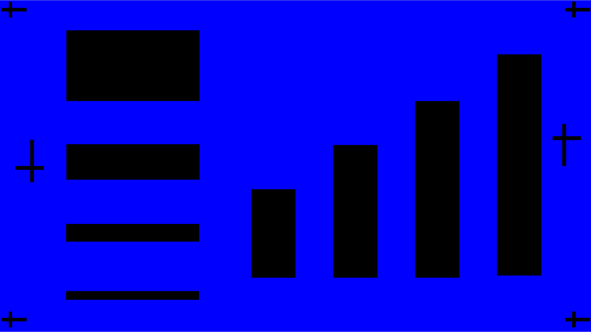

# NMOS - Polysilicon Resistors (WIP)

A polysilicon resistor process flow fully compatibile with the Self Aligned NMOS process. Designed to be useful in building NMOS logic circuits.

## Background

Without a viable way to fabricate PMOS, the logic is limited to an NMOS-only design. Unlike CMOS logic, which employs PMOS transistors to switch the voltage from High to Low, NMOS logic uses a resistive load in to pull the voltage low.&#x20;

In the basic example of an NMOS inverter, the circuit is essentially a voltage divider. When the NMOS is off, there is 0 voltage drop across the resistor and Vout = VDD. When the NMOS is on, current flows to ground and Vout  is pulled low. While digital logic is relatively robust in terms of HI/LO cutoff voltage requirements, the pull-up resistive load should be large compared to the channel resistance when the NMOS is on. A direct consequence of this design is that NMOS logic has the disadvantages of slow RC switching time and higher power consumption.&#x20;

The poly resistor process used in our project was designed as a derivative of the existing NMOS process, rather than a completely independent fabrication flow. Even though we already had an established substrate resistor process, the low sheet resistance prompted us to look for a better material for fabricating pull-up resistors.

In this resistor process, the doping time is reduced compared to the NMOS process to increase the resistance of the polysilicon layer for use as resistor pull-ups. A higher resistance polysilicon layer is also attractive in any future integrated processes because it can help reduce unwanted leakage paths and preserve clearer separation between intentionally resistive elements and highly conductive transistor regions.

## Tools

Same as the self-aligned NMOS process.

## Procedure

[Fabublox link](https://www.fabublox.com/process-editor/581d616b-fd7d-4b0c-b464-549f8c002721)

[Resistor Masks](https://docs.google.com/presentation/d/1PqgsMFEELReuOm6cnJ8Q5tTdDkawcxXL/edit?slide=id.g3d2d9defb61_2_281#slide=id.g3d2d9defb61_2_281)

Uses thes same wafer as the Self-Aligned NMOS process. Includes the same steps with the exception of adjusted first diffusion time.

| Step # | Step Name                    | Parameters                                                                                                                                       | Comments                                                                                                                                                                                                             | Layer Stacks                                                                                                                                                                                                                                                                                                                                                                                                                                                                                                                                                                                                                                                                                                                                                                                                                                                                                                                                                                                                                                                                                                                                                                                                                                                                                                                                                                                                                                                                                                                                                                                                                                                                                                                                                                                                                                                                                                                                                                                                                                                                            |
| ------ | ---------------------------- | ------------------------------------------------------------------------------------------------------------------------------------------------ | -------------------------------------------------------------------------------------------------------------------------------------------------------------------------------------------------------------------- | --------------------------------------------------------------------------------------------------------------------------------------------------------------------------------------------------------------------------------------------------------------------------------------------------------------------------------------------------------------------------------------------------------------------------------------------------------------------------------------------------------------------------------------------------------------------------------------------------------------------------------------------------------------------------------------------------------------------------------------------------------------------------------------------------------------------------------------------------------------------------------------------------------------------------------------------------------------------------------------------------------------------------------------------------------------------------------------------------------------------------------------------------------------------------------------------------------------------------------------------------------------------------------------------------------------------------------------------------------------------------------------------------------------------------------------------------------------------------------------------------------------------------------------------------------------------------------------------------------------------------------------------------------------------------------------------------------------------------------------------------------------------------------------------------------------------------------------------------------------------------------------------------------------------------------------------------------------------------------------------------------------------------------------------------------------------------------------- |
| 0      | Substrate Stack              | 
PolySi: 500 nm SiO2: 20 nm Si (lightly p doped): 525 µm
                                                                             | Same Wafer as NMOS Process                                                                                                                                                                                           |                                                                                                                                                                                                                                                                                                                                                                                                                                                                                                                                                                                                                                                                                                                                                                                                                                                                                                                                                                                                                                                  |
| 1      | Acetone + IPA Clean (N2 dry) | Cleaning Agent: Acetone then IPA                                                                                                                 | Squirt with Acetone, then IPA, then dry the surface with the N2 gun.                                                                                                                                                 |                                                                                                                                                                                                                                                                                                                                                                                                                                                                                                                                                                                                                                                                                                                                                                                                                                                                                                                                                                                                                                                  |
| 2      | Spin-On Dopant               | 
Spin-On Dopant Name: P504 Dopant Type: N Spin Speed: 4000 rpm Spin Time: 20 secs
                                                 | 
P504 from Filmtronics must use filtered syringe tips
                                                                                                                                                       | ![](data:image/png;base64,iVBORw0KGgoAAAANSUhEUgAAAH0AAAB9CAYAAACPgGwlAAACsUlEQVR4Xu2cO04yYRhG52M0ogY1QuGFQm1tZAGswcreVVjrMqimsMLWEBIaGks7TCyM0tGKhhiLCeOES2JYwpzjDs5z3vPx5/cSIr9wCwQcscCR0oFHoHSlAxcAIlu60oELAJEtXenABYDIlq504AJAZEtXOnABILKlKx24ABDZ0pUOXACIbOlKBy4ARLZ0pQMXACJbutKBCwCRLV3pwAWAyJaudOACQGRLVzpwASCypSsduAAQ2dKVDlwAiGzpSgcuAES2dKUDFwAiW7rSgQsAkS1d6cAFgMiWrnTgAkBkS1c6cAEgsqUrHbgAENnSlQ5cAIhs6UoHLgBEtnSlAxcAIlu60oELAJEtXenABYDIlq504AJAZEtXOnABILKlKx24ABDZ0pUOXACIbOlKBy4ARLZ0pQMXACJbutKBCwCRLV3pwAWAyJaudOACQGRLVzpwASByuB4Oy2vV6n3OXgPyo5DzZ31yXKlczqXv7z9FIRyiFmDCftcrlXOls+QrneV7Rqt0pfuZTrgBSydYXmFUutJ93gk3YOkEyz7vQMtKV/r8eX98vt3a/vl6yffwv2GLfhQh+wrpXj1kyUn5ZyN+y3nrRWeWLxtvrX3UlI66BKWjdM9hla50P9MJN2DpBMsrjEpXus874QYsnWDZ5x1oWelK93kH3sBC+vvD1e7h5vg1iqZ+w6XgZ5BF4fvp8+Io9Pv9g2azOYjj2N9wKbj06XQ6abfbp0ovuOj/eEoHyV6iKp0svdPpHDQajUGpVPIzveCHkGXZpNvtnoUkScppmvqTMwUXvsAb93q9mtIZspeUSmf5ntEqXen+NCzhBiydYHmFUelK93kn3IClEyz7vAMtK13pPu/AG1C60v3XO+EG5qW3Wq31nPYmhLBDoIYz/o5Gozv/3jvwCpQOlP4HPIBOHrOyfcsAAAAQZGVCR0ZCMTU3QTcxNTM1MjZERDdbM10qAAAAAElFTkSuQmCC)                                                                                                                                                                                                                                                                                                                                                                                                                                                                                                                                                                                                                                                                                                                                                                                                                                                                                                                                                                                     |
| 3      | Bake                         | 
Bake Temperature: 200 °C Bake Time: 10 mins
                                                                                            |                                                                                                                                                                                                                      | ![](data:image/png;base64,iVBORw0KGgoAAAANSUhEUgAAAH0AAAB9CAYAAACPgGwlAAACsUlEQVR4Xu2cO04yYRhG52M0ogY1QuGFQm1tZAGswcreVVjrMqimsMLWEBIaGks7TCyM0tGKhhiLCeOES2JYwpzjDs5z3vPx5/cSIr9wCwQcscCR0oFHoHSlAxcAIlu60oELAJEtXenABYDIlq504AJAZEtXOnABILKlKx24ABDZ0pUOXACIbOlKBy4ARLZ0pQMXACJbutKBCwCRLV3pwAWAyJaudOACQGRLVzpwASCypSsduAAQ2dKVDlwAiGzpSgcuAES2dKUDFwAiW7rSgQsAkS1d6cAFgMiWrnTgAkBkS1c6cAEgsqUrHbgAENnSlQ5cAIhs6UoHLgBEtnSlAxcAIlu60oELAJEtXenABYDIlq504AJAZEtXOnABILKlKx24ABDZ0pUOXACIbOlKBy4ARLZ0pQMXACJbutKBCwCRLV3pwAWAyJaudOACQGRLVzpwASByuB4Oy2vV6n3OXgPyo5DzZ31yXKlczqXv7z9FIRyiFmDCftcrlXOls+QrneV7Rqt0pfuZTrgBSydYXmFUutJ93gk3YOkEyz7vQMtKV/r8eX98vt3a/vl6yffwv2GLfhQh+wrpXj1kyUn5ZyN+y3nrRWeWLxtvrX3UlI66BKWjdM9hla50P9MJN2DpBMsrjEpXus874QYsnWDZ5x1oWelK93kH3sBC+vvD1e7h5vg1iqZ+w6XgZ5BF4fvp8+Io9Pv9g2azOYjj2N9wKbj06XQ6abfbp0ovuOj/eEoHyV6iKp0svdPpHDQajUGpVPIzveCHkGXZpNvtnoUkScppmvqTMwUXvsAb93q9mtIZspeUSmf5ntEqXen+NCzhBiydYHmFUelK93kn3IClEyz7vAMtK13pPu/AG1C60v3XO+EG5qW3Wq31nPYmhLBDoIYz/o5Gozv/3jvwCpQOlP4HPIBOHrOyfcsAAAAQZGVCR0ZCMTU3QTcxNTM1MjZERDdbM10qAAAAAElFTkSuQmCC)                                                                                                                                                                                                                                                                                                                                                                                                                                                                                                                                                                                                                                                                                                                                                                                                                                                                                                                                                                                     |
| 4      | Dopant Diffusion             | 
Diffusion Time: 5 mins Diffusion Temperature: 1100 °C Environmental: false
                                                          | In tube furnace with fused quartz tube                                                                                                                                                                               | ![](data:image/png;base64,iVBORw0KGgoAAAANSUhEUgAAAH0AAAB9CAYAAACPgGwlAAADCUlEQVR4Xu2cMWtTUQBG701STCtRaCu0SQZ1VAf7AzI6O7n7I8RZ/4B7p4BOcQ/BLFkKLm6BCgYtVMxW+ghBC03f82HUSuovuOdk7XTOud99bdMmBl84AxFHLHAwOvAQGN3oQANAZJdudKABILJLNzrQABDZpRsdaACI7NKNDjQARHbpRgcaACK7dKMDDQCRXbrRgQaAyC7d6EADQGSXbnSgASCySzc60AAQ2aUbHWgAiOzSjQ40AER26UYHGgAiu3SjAw0AkV260YEGgMgu3ehAA0Bkl250oAEgsks3OtAAENmlGx1oAIjs0o0ONABEdulGBxoAIrt0owMNAJFdutGBBoDILt3oQANAZJdudKABILJLNzrQABDZpRsdaACI7NKNDjQARHbpRgcaACK7dKMDDQCRXbrRgQaAyC7d6EADQGSXbnSgASCySzc60AAQ2aUbHWgAiOzSjQ40AESOT4+O6rWtrTcl+zaQH4VcXuvzVqPxeBl9c/MgxLiLMsCEnbUbjftGZ8U3Oqv3L1qjG91nOuEMuHRC5RVGoxvd651wBlw6obLXO7Cy0Y2+vN5fv3t2/Ud2Ng5F4a9hEz8URQyzmJ2344cXzY2Ti/CpCKGVODMer3zDJXtfnd6KX1+11w9P84nR0z8TlRiyRw+m27Ho3q4fzvLJt5NFOy/L+0rTQBk8tDZr2b3m8TL692vVSZ4X7fOLNIGlCmGtGkKlErKN2pfL6KWYtnJSN1AYPfXEV/mMzmsejG50n+mEM+DSCZVXGI1udK93whn4vfTPb5/c3F3PPoaQ+4ZL4t2LEGcHpw+bcTQa7XQ6nXG1WvU/XBKPnuf5vNfr3TF64qH/xTM6KPYfVKOTo/f7/Z29vb1xpVLxmZ74QSiKYj4YDO7GbrdbXywWE39kS7z4Ei8bDofbRke0/gtpdFZvlw7sbXSj+40c5gz4TMekvgQ1utH9a1jCGXDphMorjEY3utc74Qy4dEJlr3dg5f9G39/fXyu/8DzGeEMnyRs4m06nL/289+Q7XwU0OjD6T6fkXxEQgh+0AAAAEGRlQkcxQTZGQjBBMjhBQTYzN0JFR0TYEQAAAABJRU5ErkJggg==)                                                                                                                                                                                                                                                                                                                                                                                                                                                                                                                                                                                                                                                                                                                                                                                                                                                             |
| 5      | Wet-Etch                     | 
Etch Time: 10 mins Etching Agent(s): 6:1 BOE Etch Temperature: 25 °C
                                                                | 
BOE is HF + Ammonium Fluoride  DI water rinse after etch
                                                                                                                                                | ![](data:image/png;base64,iVBORw0KGgoAAAANSUhEUgAAAH0AAAB9CAYAAACPgGwlAAAC3ElEQVR4Xu2cP2tTUQBH732vpX8GBY3QpBnUURzMB8joR3DpB3HWL+DQLS6Z0z0EsmQRXNwKVXzYQfFtoY9SRTB91wdtLbT9BO+crJnOOff3bgIhMfjCGYg4YoGD0YGHwOhGBxoAIrt0owMNAJFdutGBBoDILt3oQANAZJdudKABILJLNzrQABDZpRsdaACI7NKNDjQARHbpRgcaACK7dKMDDQCRXbrRgQaAyC7d6EADQGSXbnSgASCySzc60AAQ2aUbHWgAiOzSjQ40AER26UYHGgAiu3SjAw0AkV260YEGgMgu3ehAA0Bkl250oAEgsks3OtAAENmlGx1oAIjs0o0ONABEdulGBxoAIrt0owMNAJFdutGBBoDILt3oQANAZJdudKABILJLNzrQABDZpRsdaACI7NKNDjQARHbpRgcaACK7dKMDDQCRXbrRgQaAyC7d6EADQGSXbnSgASCySzc60AAQ2aUbHWgAiOzSjQ40AER26UYHGgAiu3SjAw0AkV260YEGgMix2A8bx8vu+5jiQyA/CzmFX9WXci9+etPbXp6HrymEXZYBHm1zl1cf8/JR/PGuv3V0UhdGb/8hyGKoXj4vOzGNH28endbFz+WqXzflfbXTQBM87D5Yq571vl9E/72RF3Wd+n/P2wksVQjreQhZFqrttePr6I2YvnLabiAZve2Jb/MZndc8GN3o3umEM+DSCZVvMBrd6D7eCWfgcunfDl7d725Vn0OouwRsMmMK8fTDyYteXCwWO8Ph8DDP8w5ZCIG9ruuzyWTyxOiE2peMRgfFvkI1Ojn6dDrdGQwGh1mWeae3/CCklM5ms9nTOB6PN1erVeFXtpYXv8Cr5vN5x+iI1v8hjc7q7dKBvY1udD/IYc6Adzom9TWo0Y3ur2EJZ8ClEyrfYDS60X28E86ASydU9vEOrHxn9NFotN688TrGeE8nrTfwpyzLt/7nTOs73wY0OjD6P/kNJ3Z0/eoYAAAAEGRlQkc3QUY3MzU5Mjc3MTJDRjc1JoUBzAAAAABJRU5ErkJggg==)                                                                                                                                                                                                                                                                                                                                                                                                                                                                                                                                                                                                                                                                                                                                                                                                                                                                                                                         |
| 6      | Acetone + IPA Clean (N2 dry) | Cleaning Agent: Acetone then IPA                                                                                                                 | Squirt with Acetone, then IPA, then dry the surface with the N2 gun.                                                                                                                                                 | ![](data:image/png;base64,iVBORw0KGgoAAAANSUhEUgAAAH0AAAB9CAYAAACPgGwlAAAC3ElEQVR4Xu2cP2tTUQBH732vpX8GBY3QpBnUURzMB8joR3DpB3HWL+DQLS6Z0z0EsmQRXNwKVXzYQfFtoY9SRTB91wdtLbT9BO+crJnOOff3bgIhMfjCGYg4YoGD0YGHwOhGBxoAIrt0owMNAJFdutGBBoDILt3oQANAZJdudKABILJLNzrQABDZpRsdaACI7NKNDjQARHbpRgcaACK7dKMDDQCRXbrRgQaAyC7d6EADQGSXbnSgASCySzc60AAQ2aUbHWgAiOzSjQ40AER26UYHGgAiu3SjAw0AkV260YEGgMgu3ehAA0Bkl250oAEgsks3OtAAENmlGx1oAIjs0o0ONABEdulGBxoAIrt0owMNAJFdutGBBoDILt3oQANAZJdudKABILJLNzrQABDZpRsdaACI7NKNDjQARHbpRgcaACK7dKMDDQCRXbrRgQaAyC7d6EADQGSXbnSgASCySzc60AAQ2aUbHWgAiOzSjQ40AER26UYHGgAiu3SjAw0AkV260YEGgMix2A8bx8vu+5jiQyA/CzmFX9WXci9+etPbXp6HrymEXZYBHm1zl1cf8/JR/PGuv3V0UhdGb/8hyGKoXj4vOzGNH28endbFz+WqXzflfbXTQBM87D5Yq571vl9E/72RF3Wd+n/P2wksVQjreQhZFqrttePr6I2YvnLabiAZve2Jb/MZndc8GN3o3umEM+DSCZVvMBrd6D7eCWfgcunfDl7d725Vn0OouwRsMmMK8fTDyYteXCwWO8Ph8DDP8w5ZCIG9ruuzyWTyxOiE2peMRgfFvkI1Ojn6dDrdGQwGh1mWeae3/CCklM5ms9nTOB6PN1erVeFXtpYXv8Cr5vN5x+iI1v8hjc7q7dKBvY1udD/IYc6Adzom9TWo0Y3ur2EJZ8ClEyrfYDS60X28E86ASydU9vEOrHxn9NFotN688TrGeE8nrTfwpyzLt/7nTOs73wY0OjD6P/kNJ3Z0/eoYAAAAEGRlQkc3QUY3MzU5Mjc3MTJDRjc1JoUBzAAAAABJRU5ErkJggg==)                                                                                                                                                                                                                                                                                                                                                                                                                                                                                                                                                                                                                                                                                                                                                                                                                                                                                                                         |
| 7      | HMDS Vapor Prime             | 
Deposited Monolayer: HMDS Layer Thickness: 5 Å
                                                                                         | 
Not Using an actual vapor primer.  Bake @ 120C for 30S to dehydrate  Spin @ 3000 rpm for 20 s  Bake @ 120C for 60S to drive off excess
                                                      | ![](data:image/png;base64,iVBORw0KGgoAAAANSUhEUgAAAH0AAAB9CAYAAACPgGwlAAAC+UlEQVR4Xu2cvW7TUABG77VTNY34UVEqtWmGwAgM5AEy8gjdeQrm8ALsmTKHPYqUJQsSC+pSqQgiGPjxVtWtKoREamPRlkotT+BzsmY659zPdpQoMfjCGYg4YoGD0YGHwOhGBxoAIrt0owMNAJFdutGBBoDILt3oQANAZJdudKABILJLNzrQABDZpRsdaACI7NKNDjQARHbpRgcaACK7dKMDDQCRXbrRgQaAyC7d6EADQGSXbnSgASCySzc60AAQ2aUbHWgAiOzSjQ40AER26UYHGgAiu3SjAw0AkV260YEGgMgu3ehAA0Bkl250oAEgsks3OtAAENmlGx1oAIjs0o0ONABEdulGBxoAIrt0owMNAJFdutGBBoDILt3oQANAZJdudKABILJLNzrQABDZpRsdaACI7NKNDjQARHbpRgcaACK7dKMDDQCRXbrRgQaAyC7d6EADQGSXbnSgASCySzc60AAQ2aUbHWgAiOzSjQ40AER26UYHGgAiu3SjAw0Aka+WnoQwBOLTkP82LmKv96K5udlYxhi6NAVA3nx//6Qdh3tP7sTW3Y+hDB2gBBRyjOXJ9/XVVnw/7LSOzsOnMoRdlAEgbHUvz9+l2Vb89rq7cXhcLI1e/1OQxJA/f5q1YznuNQ9Pi+WPo1W3qMr7qqeBKnjYfdDIH3e+XkT/uZ4ui6Ls/j6vJ7BUIaylISRJyFuNL9fRKzE+vdf+dJRGr33jW4BG5zUPRje693TCGXDphMo3GI1udC/vhDNwufTPb/bu72zkH6pv3HYI2GTGMsTTt8fPOnGxWGwPBoODNE3bZCEE9qIoziaTyUOjE2pfMhodFPsK1ejk6NPpdLvf7x8kSeI9veYHoSzLs9ls9iiOx+PmarVa+pGt5sUv8PL5fN42OqL1P0ijs3q7dGBvoxvdBznMGfCejkl9DWp0o/trWMIZcOmEyjcYjW50L++EM+DSCZW9vAMr/zf6aDRaq954GWO8p5PaG/iVZdkr/12q9p1vAxodGP0PF/0r0FGeGXUAAAAQZGVCRzY1MjY2QTQ4MUJCQTNFNjY+gPBDAAAAAElFTkSuQmCC)                                                                                                                                                                                                                                                                                                                                                                                                                                                                                                                                                                                                                                                                                                                                                                                                                                                                                     |
| 8      | Spin Resist                  | 
Resist: AZ P4210 Resist Type: Positive Spin Speed: 4000 rpm Spin Time: 30 secs
                                                   |                                                                                                                                                                                                                      | ![](data:image/png;base64,iVBORw0KGgoAAAANSUhEUgAAAH0AAAB9CAYAAACPgGwlAAADNElEQVR4Xu2dPU9TYRxHn6ctL60vJKYQKE1URjXGjgwkLI6yMfI1nPELuDN1xhlCwsJidHExJBjbKIkv3Qi3BI2J5T7e8BIj8RPcc/oNzu/8zy0QCjH4wi0QccQCB6UDj0DpSgcuAES2dKUDFwAiW7rSgQsAkS1d6cAFgMiWrnTgAkBkS1c6cAEgsqUrHbgAENnSlQ5cAIhs6UoHLgBEtnSlAxcAIlu60oELAJEtXenABYDIlq504AJAZEtXOnABILKlKx24ABDZ0pUOXACIbOlKBy4ARLZ0pQMXACJbutKBCwCRLV3pwAWAyJaudOACQGRLVzpwASCypSsduAAQ2dKVDlwAiGzpSgcuAES2dKUDFwAiW7rSgQsAkS1d6cAFgMiWrnTgAkBkS1c6cAEgsqUrHbgAENnSlQ5cAIhs6UoHLgBEtnSlAxcAIlu60oELAJEtXenABYDIcT2EyrOVlYWUUg3Ij0KupnTW2drqx8Pl5cnh1NT7gr6FWoAIm9KwNzFx90p6v9igTdwBxpz1xsebSmdZVzrL9zmt0pXuezrhBiydYPkao9KV7uOdcAOWTrDs4x1o+b/S3ywu1hszMz1/Ioe4iIvH+9rjtRtZvdZLyZ+9l117CmH4o3HYjOurD2/Gxq2PQelldx5iTMNvE6Pp+G691Tg6C73iCuZLTw0HLH5jJntbHUzHry/b9YPjvK/08l9EJYbs6aNBM6buvcmDk7z//WjUzgvzvsq5QCE8zN+pZQ9aXy6k/5yo9vM8tX+flRNYqhDGqsWvSFVC1qh9/ivdb9kIp5GUTtD8L6PSec6D0pXuezrhBiydYPkao9KV7uOdcAOXpX96tTo1V88+hJDPEbDJjCnEk9fHT1pxb29vdmlpab9arTbJgxDY8zw/3dzcvK90gu1LRqWDZF+hKp0sfXt7e7bT6exXKhXf00t+CMXfIDjd2dlZiN1ud3I0GvlR5ZILv8TLdnd3m0pnyL6iVDrL9zmt0pXuZ9kIN2DpBMvXGJWudB/vhBuwdIJlH+9Ay0pXuo934A0oXel+9U64gYvSNzY2xgra5zHG2wRqOOOvwWDwwv/sALwCpQOl/wHlrXhQlR1tJAAAABBkZUJHNjc3REQ1QTlFM0VGN0I2Rl6U2kYAAAAASUVORK5CYII=)                                                                                                                                                                                                                                                                                                                                                                                                                                                                                                                                                                                                                                                                                                                                                                                                     |
| 9      | Bake                         | 
Bake Temperature: 100 °C Bake Time: 90 secs
                                                                                            |                                                                                                                                                                                                                      | ![](data:image/png;base64,iVBORw0KGgoAAAANSUhEUgAAAH0AAAB9CAYAAACPgGwlAAADNElEQVR4Xu2dPU9TYRxHn6ctL60vJKYQKE1URjXGjgwkLI6yMfI1nPELuDN1xhlCwsJidHExJBjbKIkv3Qi3BI2J5T7e8BIj8RPcc/oNzu/8zy0QCjH4wi0QccQCB6UDj0DpSgcuAES2dKUDFwAiW7rSgQsAkS1d6cAFgMiWrnTgAkBkS1c6cAEgsqUrHbgAENnSlQ5cAIhs6UoHLgBEtnSlAxcAIlu60oELAJEtXenABYDIlq504AJAZEtXOnABILKlKx24ABDZ0pUOXACIbOlKBy4ARLZ0pQMXACJbutKBCwCRLV3pwAWAyJaudOACQGRLVzpwASCypSsduAAQ2dKVDlwAiGzpSgcuAES2dKUDFwAiW7rSgQsAkS1d6cAFgMiWrnTgAkBkS1c6cAEgsqUrHbgAENnSlQ5cAIhs6UoHLgBEtnSlAxcAIlu60oELAJEtXenABYDIcT2EyrOVlYWUUg3Ij0KupnTW2drqx8Pl5cnh1NT7gr6FWoAIm9KwNzFx90p6v9igTdwBxpz1xsebSmdZVzrL9zmt0pXuezrhBiydYPkao9KV7uOdcAOWTrDs4x1o+b/S3ywu1hszMz1/Ioe4iIvH+9rjtRtZvdZLyZ+9l117CmH4o3HYjOurD2/Gxq2PQelldx5iTMNvE6Pp+G691Tg6C73iCuZLTw0HLH5jJntbHUzHry/b9YPjvK/08l9EJYbs6aNBM6buvcmDk7z//WjUzgvzvsq5QCE8zN+pZQ9aXy6k/5yo9vM8tX+flRNYqhDGqsWvSFVC1qh9/ivdb9kIp5GUTtD8L6PSec6D0pXuezrhBiydYPkao9KV7uOdcAOXpX96tTo1V88+hJDPEbDJjCnEk9fHT1pxb29vdmlpab9arTbJgxDY8zw/3dzcvK90gu1LRqWDZF+hKp0sfXt7e7bT6exXKhXf00t+CMXfIDjd2dlZiN1ud3I0GvlR5ZILv8TLdnd3m0pnyL6iVDrL9zmt0pXuZ9kIN2DpBMvXGJWudB/vhBuwdIJlH+9Ay0pXuo934A0oXel+9U64gYvSNzY2xgra5zHG2wRqOOOvwWDwwv/sALwCpQOl/wHlrXhQlR1tJAAAABBkZUJHNjc3REQ1QTlFM0VGN0I2Rl6U2kYAAAAASUVORK5CYII=)                                                                                                                                                                                                                                                                                                                                                                                                                                                                                                                                                                                                                                                                                                                                                                                                     |
| 10     | Stepper Lithography          |                                                                                                                                                  | Pattern 1 -Defining Gates                                                                                                                                                                                            | ![](data:image/png;base64,iVBORw0KGgoAAAANSUhEUgAAAH0AAAB9CAYAAACPgGwlAAAD10lEQVR4Xu2cP09TURyGz7m3FYoFCZYESol/RnWwIbAx6jfgE/gBWIhz/QLsTMy4ExIWFoiLSyHBSKMmop2oXCoqf8q9XgPGxO2mh6SH92E/v/ye9zlvG3op1vAjl4CVIwbYIF3wEiAd6YIJCCLTdKQLJiCITNORLpiAIDJNR7pgAoLINB3pggkIItN0pAsmIIhM05EumIAgMk1HumACgsg0HemCCQgi03SkCyYgiEzTkS6YgCAyTUe6YAKCyDQd6YIJCCLTdKQLJiCITNORLpiAIDJNR7pgAoLINB3pggkIItN0pAsmIIhM05EumIAgMk1HumACgsg0HemCCQgi03SkCyYgiEzTkS6YgCAyTUe6YAKCyDQd6YIJCCLTdKQLJiCITNORLpiAIDJNR7pgAoLINB3pggkIItN0pAsmIIhM05EumIAgMk1HumACgsg0HemCCQgi03SkCyYgiEzTkS6YgCAyTUe6YAKCyLZWqwUvhoYeduI454rfRpE9qNcTV/NU59ydmjKmWHSGn8vnLybn5xv20/Jyf9hu19PJZVfTz1uts+/1+i1X81TnDM/MREGxOOyMP0mOJre27tkklb7fbjfSwRVXw88ODk6Pt7f7XM1TnTM8Pf0tGBwcccgfTW5ulpDuMFHXo5DuOlEP5iHdA0muV0S660Q9mId0DyS5XhHprhP1YB7SPZDkekWku07Ug3lI90CS6xWvTfr+4mIhCcM9PpFzraz7edcjfbxkF54v3G50fu2ZxN1n73kTm5MfJ91Ti08YKBbMaeLw6bc1R9V4tGRrc4+LdmDwvUvp4q56Ft/a5OhLX2fUvq2VB1oXZi99DjrRs9uymJME0teM6E3YHLX7i5XC7mHcQLqTXHt6SGBN9OxJ889Ttvv9u+248bXVqcT82UNPS+tmuVS4mRjJRY/Kny+l/+wLG3GcVM4vuhnL2V5OIB8aEwQmGsh9/Cfd5a9svQyvvVuCdL0LgHQ95wbpSOc9XeEO0HQFy/8xIh3pvLwr3IGrpn94PXdnvBC9MyYeV8BWZkyMbW8ePi3bjY2NsdnZ2Z0wDEvKgSiwx3F8vLKy8gDpCravGJEuJPsvKtKVpa+uro5Vq9WdIAh4T7/hFyFJkuO1tbWHdjn9qnKn03H6VeUbnp3PeNH6+noJ6T4rzL470rNn5v0JpHuvMDsA0rNn5v0JpHuvMDsA0rNn5v0JpHuvMDsA0rNn5v0JpHuvMDsA0rNn5v0JpHuvMDsA0rNn5v0JpHuvMDvApfSlpaV8evaltXYo+wxOeJbASbPZfOXwf1t4hi+8LtIF5f8GM7YHMGoWO0wAAAAQZGVCRzAzMEIwRkYxM0VCM0JFMzLh2LGOAAAAAElFTkSuQmCC)                                                                                                                                                                                                                                                                                                                                                                                                                                                                                                                                                                             |
| 11     | Develop                      | 
Developer: AZ 400K 3:1 (DI water : developer) Develop Time: 30 secs Develop Temperature: 25 °C
                                      | Develop time may vary, use current stable patterning process. Modulate exposure time and develop time as needed to achieve good pattern resolution                                                                   | ![](data:image/png;base64,iVBORw0KGgoAAAANSUhEUgAAAH0AAAB9CAYAAACPgGwlAAADkElEQVR4Xu2cPWtTUQCGz7lp6cfQVo2QpMGvURTaRVwyurZZRBBEXYq/wFn/gEMXiUtAXFLQdgmBLFkEEUTFQhWDHaxep5BrqCKY3OuFVgvVyZ5A732froXDeZ7nvkk/tNbwIWfAyhEDbIgu+BAQneiCBgSRWTrRBQ0IIrN0ogsaEERm6UQXNCCIzNKJLmhAEJmlE13QgCAySye6oAFBZJZOdEEDgsgsneiCBgSRWTrRBQ0IIrN0ogsaEERm6UQXNCCIzNKJLmhAEJmlE13QgCAySye6oAFBZJZOdEEDgsgsneiCBgSRWTrRBQ0IIrN0ogsaEERm6UQXNCCIzNKJLmhAEJmlE13QgCAySye6oAFBZJZOdEEDgsgsneiCBgSRWTrRBQ0IIrN0ogsaEERm6UQXNCCIzNKJLmhAEJmlE13QgCAySye6oAFBZJZOdEEDgsgsneiCBgSRWTrRBQ0IIrN0ogsaEERm6UQXNCCIPJSlvyqXZwaDQU7Qp1Pkfr/vX2w0ek4PjQ8bSvQ3i4s3Q2OWXV9W7jzPuz63uvrENfdwopfLS2EUVVxfVu48a6/Mra2tuOYmumujLs8jukubCTmL6AkJ5fKaRHdpMyFnET0hoVxek+gubSbkLKInJJTLaxLdpc2EnEX0hIRyec0kRX+9UF4ylp/IHbh/kqIvXLhxKzT2/oGhxQ8Ys4Nrj58/fORag20vm7HNTv6BjewxV4d/+jp1Yqs7c97VearnnDwSvCxM974444/Mt+Cdf9W+uFOY7AzM+8iYWWeHc9ChNBD/oiV4lvGP2617xYmNbtgm+qHs5PRSnjXBpXN+1kbVU+MbvbD9udMvhnF5PtJpIA5uZo+OBGcLH3eifx/LtMMwKv4cpBMYKmNGM8Z4ngkmRzb3osdiishJu4GI6GlP/Dcf0fWaG6ITnfd0hWeApStU3sdIdKLz8q7wDOwu/cPK5en8RPDWmDCvgK3MGBnbe9qdK9hWq5UrlUrrmUwmqyxEgT0Mw+1arXaa6Aq1dxmJLhT7NyrRlaPX6/Xc/Pz8uud5vKen/EGIomi70WicsdVqdTz+z+9tvmVLefEdvKDZbGaJLtH6DyTRtXqzdMHeRCc6X8jJPAO8p8uk3gMlOtH517AKzwBLV6i8j5HoROflXeEZYOkKlXl5F6z8z+iVSmU0/sRta+0UTlJv4Ifv+3eH8geBU68u4YBET3jA/7n+L8yXnXZqgzvyAAAAEGRlQkc5MUFDODBCMTk0NjgxNjNDEyDqAwAAAABJRU5ErkJggg==)                                                                                                                                                                                                                                                                                                                                                                                                                                                                                                                                                                                                                                                                         |
| 12     | ICP-RIE                      | 
Etch Time: 90 secs Etch Gas Composition: SF6 Gas Flows and Ratios: 10 sccm RF Power or Voltage: 100 Watts Sidewall Angle: 0 °
 | Place around 1/3 from the back of the chamber                                                                                                                                                                        | ![](data:image/png;base64,iVBORw0KGgoAAAANSUhEUgAAAH0AAAB9CAYAAACPgGwlAAAD0klEQVR4Xu2bTUtUYRiGzznjV1hSICEZhLVoqy5KCldtWunsjEz6oAb7A2GbsJ9QUDG0GIIMZoi0xTAghLtqERS5qxYuYtpWKEnOzOlEEEQrOe8D78t9uXB3bp77urxxGJ044kuOQCzXmMIR0gV/CJCOdEECgpVZOtIFCQhWZulIFyQgWJmlI12QgGBllo50QQKClVk60gUJCFZm6UgXJCBYmaUjXZCAYGWWjnRBAoKVWTrSBQkIVmbpSBckIFiZpSNdkIBgZZaOdEECgpVZOtIFCQhWZulIFyQgWJmlI12QgGBllo50QQKClVk60gUJCFZm6UgXJCBYmaUjXZCAYGWWjnRBAoKVWTrSBQkIVmbpSBckIFiZpSNdkIBgZZaOdEECgpVZOtIFCQhWZulIFyQgWJmlI12QgGBllo50QQKClVk60gUJCFZm6UgXJCBYmaUjXZCAYGWWjnRBAoKVWTrSBQkIVmbpSBckIFiZpSNdkIBgZZOlvy0W97fb7SFBnk4rt1qt5kSj8d1paBZmIv399PTlThTddX2sXF6SXBxdXn7mureN9GKx1EnTsutj5fLieGZ0ZaXmujfSXRN1mYd0lzQDyUJ6IKJcnol0lzQDyUJ6IKJcnol0lzQDyUJ6IKJcnol0lzQDyUJ6IKJcnhmS9HdTxVIU845cbv8hSZ86cWm+E8UPcpcWD+hLOheevn605BqDyduwi3MT83EcIT2nrd5CMrdQefk4Z8x/j5tIf35z+HpvV3rf9bFqeQPdyeypW5+fuO5tIv3F4vD8Tjtl6TltHehPZk8uBCK9+XCk9OHLz/L2Tpqztu7j/b1JdPxQ17mDVzaqrimYLH1r6VgpjaPyTiuNUrzv2ln2eijq6Yqj7MXwzL7zn8L4e/pv6dn/5PBPFLvW/e8DSM8JMMTHkR6itZw3Iz0nwBAfR3qI1nLejPScAEN8HOkhWst5M9JzAgzxcTPptVptz/j4+Nme7MsVmL0b9870fXtzzVWeas6P/afvbB25+spV/06n01pbW6vH2behycnJ9UKhMOgqnBw/CWTSN6vV6gjS/fRjchXSTbD6HYp0v/2YXPdXer1eHxobG1tPkoTf6Sao/QlN03Sz0WgcjSuVSl/24feP2WmH/TmPS4wIfF1dXR1EuhFdT2OR7qkYy7OQbknX02ykeyrG8iykW9L1NBvpnoqxPAvplnQ9zUa6p2Isz0K6JV1Ps5HuqRjLs5BuSdfTbKR7KsbyLKRb0vU0+4/0crncnR14I47jAU8P5Sx3BLabzeZtk0+turuRJAsCSLeg6nnmL1yMkRdATTSAAAAAEGRlQkc0QTZEMDczQTRBRkZCN0E2BUNhlQAAAABJRU5ErkJggg==)                                                                                                                                                                                                                                                                                                                                                                                                                                                                                                                                                                                 |
| 13     | Wet Strip Resist             | Stripping Agent(s): Acetone then IPA                                                                                                             | Squirt with acetone, then IPA, then dry with N2 gun                                                                                                                                                                  | ![](data:image/png;base64,iVBORw0KGgoAAAANSUhEUgAAAH0AAAB9CAYAAACPgGwlAAADVElEQVR4Xu2bMWtTYRhG771tbaW2KBQptiDVwbldRKWTi/gHFLuJFvUHiIKK7i4OKsGhk0KyiYRCQerm4tZNHTqUuCq0WGzM9YLiKoXvhU/OyZAtD+9zTp4kS8rCB45AiWts4ULpwDeB0pUOJACs7NKVDiQArOzSlQ4kAKzs0pUOJACs7NKVDiQArOzSlQ4kAKzs0pUOJACs7NKVDiQArOzSlQ4kAKzs0pUOJACs7NKVDiQArOzSlQ4kAKzs0pUOJACs7NKVDiQArOzSlQ4kAKzs0pUOJACs7NKVDiQArOzSlQ4kAKzs0pUOJACs7NKVDiQArOzSlQ4kAKzs0pUOJACs7NKVDiQArOzSlQ4kAKzs0pUOJACs7NKVDiQArOzSlQ4kAKzs0pUOJACs7NKVDiQArOzSlQ4kAKzs0pUOJACs7NKVDiQArOzSlQ4kAKzs0pUOJACs7NKVDiQArOzSlQ4kAKzs0pUOJACs7NKVDiQArOzSlQ4kAKzs0pUOJACs7NKVDiQArOzSlQ4kAKzs0pUOJACsHLL0N/dmL45Wg1tAnkkrT4xUj8/c33qXNLQJC5H++u7MzdHh+lnqY2l5kyPV0tkHW69S9w6R/vbhzI29n/Xz1MfS8o6MV0un7/wn0nsv5pY/fvnR2t2raZ6S9R0frYpTx4YvH7262U4W+icoZOk7L08u12XR2uvXRa33fTsrGysHhstiUJSXJq587uw74B8vCJPe/FpopT6Wlqd0mvGmr9KVnoyAH+/JUKYPcunpmWafqPTsFaU/UOnpmWafqPTsFaU/MEx6p9M5uLCwcOFA80h19qHNp+fHvn24niqPmvP98LknO8evvU/VfzAY9NfX17tl8zS9uLi4MTQ0NJUq3Jw8CTTSt9vt9pzS8/QTcpXSQ7DmHar0vP2EXPdXerfbnZ6fn9+oqsrv9BDU+YTWdb29urp6olxZWRnr9/ufmtNm8znPS4IIfF1bW5tSehDdTGOVnqmYyLOUHkk302ylZyom8iylR9LNNFvpmYqJPEvpkXQzzVZ6pmIiz1J6JN1Ms5WeqZjIs5QeSTfTbKVnKibyLKVH0s00+7f0Vqs10hx4uyzLyUwP9ax0BHZ7vd6jkH+4pLvRpAgCSo+gmnnmL4OgJBfZs5kTAAAAEGRlQkcyRDAyRTVCMEU0NUM0MjY4yfVJAAAAAABJRU5ErkJggg==)                                                                                                                                                                                                                                                                                                                                                                                                                                                                                                                                                                                                                                                                                                                                                         |
| 14     | Plasma Descum                | 
Gas composition: O2 10 SCCM RF Power: 100 Watts Time: 2400 secs
                                                                     | Alternatively, a shorter clean can be done before resist strip.                                                                                                                                                      | ![](data:image/png;base64,iVBORw0KGgoAAAANSUhEUgAAAH0AAAB9CAYAAACPgGwlAAADVElEQVR4Xu2bMWtTYRhG771tbaW2KBQptiDVwbldRKWTi/gHFLuJFvUHiIKK7i4OKsGhk0KyiYRCQerm4tZNHTqUuCq0WGzM9YLiKoXvhU/OyZAtD+9zTp4kS8rCB45AiWts4ULpwDeB0pUOJACs7NKVDiQArOzSlQ4kAKzs0pUOJACs7NKVDiQArOzSlQ4kAKzs0pUOJACs7NKVDiQArOzSlQ4kAKzs0pUOJACs7NKVDiQArOzSlQ4kAKzs0pUOJACs7NKVDiQArOzSlQ4kAKzs0pUOJACs7NKVDiQArOzSlQ4kAKzs0pUOJACs7NKVDiQArOzSlQ4kAKzs0pUOJACs7NKVDiQArOzSlQ4kAKzs0pUOJACs7NKVDiQArOzSlQ4kAKzs0pUOJACs7NKVDiQArOzSlQ4kAKzs0pUOJACs7NKVDiQArOzSlQ4kAKzs0pUOJACs7NKVDiQArOzSlQ4kAKzs0pUOJACs7NKVDiQArOzSlQ4kAKzs0pUOJACs7NKVDiQArOzSlQ4kAKzs0pUOJACsHLL0N/dmL45Wg1tAnkkrT4xUj8/c33qXNLQJC5H++u7MzdHh+lnqY2l5kyPV0tkHW69S9w6R/vbhzI29n/Xz1MfS8o6MV0un7/wn0nsv5pY/fvnR2t2raZ6S9R0frYpTx4YvH7262U4W+icoZOk7L08u12XR2uvXRa33fTsrGysHhstiUJSXJq587uw74B8vCJPe/FpopT6Wlqd0mvGmr9KVnoyAH+/JUKYPcunpmWafqPTsFaU/UOnpmWafqPTsFaU/MEx6p9M5uLCwcOFA80h19qHNp+fHvn24niqPmvP98LknO8evvU/VfzAY9NfX17tl8zS9uLi4MTQ0NJUq3Jw8CTTSt9vt9pzS8/QTcpXSQ7DmHar0vP2EXPdXerfbnZ6fn9+oqsrv9BDU+YTWdb29urp6olxZWRnr9/ufmtNm8znPS4IIfF1bW5tSehDdTGOVnqmYyLOUHkk302ylZyom8iylR9LNNFvpmYqJPEvpkXQzzVZ6pmIiz1J6JN1Ms5WeqZjIs5QeSTfTbKVnKibyLKVH0s00+7f0Vqs10hx4uyzLyUwP9ax0BHZ7vd6jkH+4pLvRpAgCSo+gmnnmL4OgJBfZs5kTAAAAEGRlQkcyRDAyRTVCMEU0NUM0MjY4yfVJAAAAAABJRU5ErkJggg==)                                                                                                                                                                                                                                                                                                                                                                                                                                                                                                                                                                                                                                                                                                                                                         |
| 15     | Dopant Diffusion             | 
Diffusion Time: 30 mins Diffusion Temperature: 1100 °C Environmental: false
                                                         |                                                                                                                                                                                                                      | ![](data:image/png;base64,iVBORw0KGgoAAAANSUhEUgAAAH0AAAB9CAYAAACPgGwlAAADWklEQVR4Xu2aP2tTcRiF77350wi2KhQttlSqg3OyiEomF/ELiHb1X/0AgmgFdx0c1N4pk2KyiYRAlri5OAgdFelQgoJD1RYFr/d6QfAT/F54r+fJkPHwnufJIZeQOOIlRyCWa0zhCOmCHwKkI12QgGBllo50QQKClVk60gUJCFZm6UgXJCBYmaUjXZCAYGWWjnRBAoKVWTrSBQkIVmbpSBckIFiZpSNdkIBgZZaOdEECgpVZOtIFCQhWZulIFyQgWJmlI12QgGBllo50QQKClVk60gUJCFZm6UgXJCBYmaUjXZCAYGWWjnRBAoKVWTrSBQkIVmbpSBckIFiZpSNdkIBgZZaOdEECgpVZOtIFCQhWZulIFyQgWJmlI12QgGBllo50QQKClVk60gUJCFZm6UgXJCBYmaUjXZCAYGWWjnRBAoKVWTrSBQkIVmbpSBckIFiZpSNdkIBgZZaOdEECgpVZOtIFCQhWZulIFyQgWJmlI12QgGBllo50QQKClVk60gUJCFZm6UgXJCBYmaUjXZCAYGWWjnRBAoKVWTrSBQkIVjZZ+qu7SxdmkvymIM+glWcbyYPT69uvg4aWYSbSX95eXJupF09CH6uWN9dIVs/c234eujfSQxMNmIf0gDCrEoX0qpgKeCfSA8KsSlSlpA/XF2/UouJpVeB6vfNQK1k9daciD3LvHi5f/7STbXiFWZW7Th5tXlpZ23oR+l6Tp/fvz05c+/j5V/rlWxb9zkOf/P/n1WtRdORAPVo+3Lw4e/nDIHRjE+l7pfTyF4A09LFqeXkUIx3pYQiw9DAcTVJYuglW36Fm0geDwb5Op3O+Wb5CIdi/9fhc6+vbq6HyVHN+HDz7aO/YlTeh+ud5nk0mk2Fcvi10u93NWq02HyqcHJ8ESum7/X5/Bek+/ZhchXQTrL5Dke7bj8l1/6QPh8OFdru9mSQJ3+kmqP2EFkWxOxqNjse9Xq+VZdn78rQlP+dxiRGBnfF4PI90I7pOY5HuVIzlWUi3pOs0G+lOxViehXRLuk6zke5UjOVZSLek6zQb6U7FWJ6FdEu6TrOR7lSM5VlIt6TrNBvpTsVYnoV0S7pOs/9KT9O0UR54K47jOaeHclY4Aj+n0+l9k79Ah7uRJAsCSLeg6jzzD88GIBcPYDRWAAAAEGRlQkdEREUyQjRGREU5Q0UxMzk0saL6ZAAAAABJRU5ErkJggg==)                                                                                                                                                                                                                                                                                                                                                                                                                                                                                                                                                                                                                                                                                                                                                 |
| 16     | Spin-Coat                    | 
Material: 700B Spin Speed: 4000 rpm Spin Time: 20 secs
                                                                              | 700B from filmtronics                                                                                                                                                                                                | ![](data:image/png;base64,iVBORw0KGgoAAAANSUhEUgAAAH0AAAB9CAYAAACPgGwlAAADoklEQVR4Xu2cMWtTURiG703SJjW2UYhaYxV0qIsKGRyUBlqQOvQP+AfEf6CDFOwodRCcMoWOhYIUiYUgRIUOBUU0g6ibYnCQmsTYJmnMNVpxcL3nwLm8T/d853uf5743l5LE9/iTI+DLJSawh3TBiwDpSBckIBiZpiNdkIBgZJqOdEECgpFpOtIFCQhGpulIFyQgGJmmI12QgGBkmo50QQKCkWk60gUJCEam6UgXJCAYmaYjXZCAYGSajnRBAoKRaTrSBQkIRqbpSBckIBiZpiNdkIBgZJqOdEECgpFpOtIFCQhGpulIFyQgGJmmI12QgGBkmo50QQKCkWk60gUJCEam6UgXJCAYmaYjXZCAYGSajnRBAoKRaTrSBQkIRqbpSBckIBiZpiNdkIBgZJqOdEECgpFpOtIFCQhGpulIFyQgGJmmI12QgGBkmo50QQKCkWk60gUJCEam6UgXJCAYmaYjXZCAYGSajnRBAoKRaTrSBQkIRqbpSBckIBjZny0FqQPNj499zz8qmF8qcuD539ObUzN/pX/6MEw/JUVAM2wjvXkyi3Qt+UjX8v0nLdKRznu6wjVA0xUs/5cR6Ujn9q5wDdB0Bcvc3gUtIx3p+7f3+eUv6cRI792QxwlTTHJ7r/pne5WEqXmqc96nFnY/x8+NmcofBEFzt3nKzr9hz++u9eZ27o2aWlZ1ztOJxeabkYWMwfz2HuSQbkYT0s1wjNQUpEdKl5llkW6GY6SmREr6hc5ab/YHD3Jhr7BnmcXm60REHuQuBQ+7F7fvJsOGVn/91pGlxtbg6iGDHOw9vc+n1rtzO8vJr62+93NgcGWRUYm45x3LJLxHqTvfnneuHDYY26L0sfXu9fH7ND2krQet20gPyTByL0d65JSFXxjp4RlGboI16beKLzLbydzbwPOOm6JyefTJ3rXxlRFT81TnrLRutF/uzRw0lX/4HbbWdKyW86vV6mShUKjF4/GsqeHMcZPAYDBor66unka6m36sbIV0K1jdHop0t/1Y2e6f9HK5PJnP52uxWIz3dCuo3Rk6/ORMe2Nj44xfKpVS/X6fb62648bmJo1KpZJFuk3E7s1GuntOrG+EdOuI3TsA6e45sb4R0q0jdu8ApLvnxPpGSLeO2L0DkO6eE+sbId06YvcOQLp7TqxvhHTriN07AOnuObG+EdKtI3bvgH3pxWLx92fZbvq+P+HejmxkmECnXq8v8XvvhqlGYRzSo2DJ8I6/AI6B3wbwVM2hAAAAEGRlQkdFQkIwRDZEMkM5MjAxNzY3JgeLOgAAAABJRU5ErkJggg==)                                                                                                                                                                                                                                                                                                                                                                                                                                                                                                                                                                                                                                                 |
| 17     | Bake                         | 
Bake Temperature: 200 °C Bake Time: 10 mins
                                                                                            |                                                                                                                                                                                                                      | ![](data:image/png;base64,iVBORw0KGgoAAAANSUhEUgAAAH0AAAB9CAYAAACPgGwlAAADoklEQVR4Xu2cMWtTURiG703SJjW2UYhaYxV0qIsKGRyUBlqQOvQP+AfEf6CDFOwodRCcMoWOhYIUiYUgRIUOBUU0g6ibYnCQmsTYJmnMNVpxcL3nwLm8T/d853uf5743l5LE9/iTI+DLJSawh3TBiwDpSBckIBiZpiNdkIBgZJqOdEECgpFpOtIFCQhGpulIFyQgGJmmI12QgGBkmo50QQKCkWk60gUJCEam6UgXJCAYmaYjXZCAYGSajnRBAoKRaTrSBQkIRqbpSBckIBiZpiNdkIBgZJqOdEECgpFpOtIFCQhGpulIFyQgGJmmI12QgGBkmo50QQKCkWk60gUJCEam6UgXJCAYmaYjXZCAYGSajnRBAoKRaTrSBQkIRqbpSBckIBiZpiNdkIBgZJqOdEECgpFpOtIFCQhGpulIFyQgGJmmI12QgGBkmo50QQKCkWk60gUJCEam6UgXJCAYmaYjXZCAYGSajnRBAoKRaTrSBQkIRqbpSBckIBjZny0FqQPNj499zz8qmF8qcuD539ObUzN/pX/6MEw/JUVAM2wjvXkyi3Qt+UjX8v0nLdKRznu6wjVA0xUs/5cR6Ujn9q5wDdB0Bcvc3gUtIx3p+7f3+eUv6cRI792QxwlTTHJ7r/pne5WEqXmqc96nFnY/x8+NmcofBEFzt3nKzr9hz++u9eZ27o2aWlZ1ztOJxeabkYWMwfz2HuSQbkYT0s1wjNQUpEdKl5llkW6GY6SmREr6hc5ab/YHD3Jhr7BnmcXm60REHuQuBQ+7F7fvJsOGVn/91pGlxtbg6iGDHOw9vc+n1rtzO8vJr62+93NgcGWRUYm45x3LJLxHqTvfnneuHDYY26L0sfXu9fH7ND2krQet20gPyTByL0d65JSFXxjp4RlGboI16beKLzLbydzbwPOOm6JyefTJ3rXxlRFT81TnrLRutF/uzRw0lX/4HbbWdKyW86vV6mShUKjF4/GsqeHMcZPAYDBor66unka6m36sbIV0K1jdHop0t/1Y2e6f9HK5PJnP52uxWIz3dCuo3Rk6/ORMe2Nj44xfKpVS/X6fb62648bmJo1KpZJFuk3E7s1GuntOrG+EdOuI3TsA6e45sb4R0q0jdu8ApLvnxPpGSLeO2L0DkO6eE+sbId06YvcOQLp7TqxvhHTriN07AOnuObG+EdKtI3bvgH3pxWLx92fZbvq+P+HejmxkmECnXq8v8XvvhqlGYRzSo2DJ8I6/AI6B3wbwVM2hAAAAEGRlQkdFQkIwRDZEMkM5MjAxNzY3JgeLOgAAAABJRU5ErkJggg==)                                                                                                                                                                                                                                                                                                                                                                                                                                                                                                                                                                                                                                                 |
| 18     | Acetone + IPA Clean (N2 dry) | 
Cleaning Agent: Acetone then IPA Ultra-Sonication: false
                                                                               | Squirt with Acetone, then IPA, then dry the surface with the N2 gun.                                                                                                                                                 | ![](data:image/png;base64,iVBORw0KGgoAAAANSUhEUgAAAH0AAAB9CAYAAACPgGwlAAADoklEQVR4Xu2cMWtTURiG703SJjW2UYhaYxV0qIsKGRyUBlqQOvQP+AfEf6CDFOwodRCcMoWOhYIUiYUgRIUOBUU0g6ibYnCQmsTYJmnMNVpxcL3nwLm8T/d853uf5743l5LE9/iTI+DLJSawh3TBiwDpSBckIBiZpiNdkIBgZJqOdEECgpFpOtIFCQhGpulIFyQgGJmmI12QgGBkmo50QQKCkWk60gUJCEam6UgXJCAYmaYjXZCAYGSajnRBAoKRaTrSBQkIRqbpSBckIBiZpiNdkIBgZJqOdEECgpFpOtIFCQhGpulIFyQgGJmmI12QgGBkmo50QQKCkWk60gUJCEam6UgXJCAYmaYjXZCAYGSajnRBAoKRaTrSBQkIRqbpSBckIBiZpiNdkIBgZJqOdEECgpFpOtIFCQhGpulIFyQgGJmmI12QgGBkmo50QQKCkWk60gUJCEam6UgXJCAYmaYjXZCAYGSajnRBAoKRaTrSBQkIRqbpSBckIBjZny0FqQPNj499zz8qmF8qcuD539ObUzN/pX/6MEw/JUVAM2wjvXkyi3Qt+UjX8v0nLdKRznu6wjVA0xUs/5cR6Ujn9q5wDdB0Bcvc3gUtIx3p+7f3+eUv6cRI792QxwlTTHJ7r/pne5WEqXmqc96nFnY/x8+NmcofBEFzt3nKzr9hz++u9eZ27o2aWlZ1ztOJxeabkYWMwfz2HuSQbkYT0s1wjNQUpEdKl5llkW6GY6SmREr6hc5ab/YHD3Jhr7BnmcXm60REHuQuBQ+7F7fvJsOGVn/91pGlxtbg6iGDHOw9vc+n1rtzO8vJr62+93NgcGWRUYm45x3LJLxHqTvfnneuHDYY26L0sfXu9fH7ND2krQet20gPyTByL0d65JSFXxjp4RlGboI16beKLzLbydzbwPOOm6JyefTJ3rXxlRFT81TnrLRutF/uzRw0lX/4HbbWdKyW86vV6mShUKjF4/GsqeHMcZPAYDBor66unka6m36sbIV0K1jdHop0t/1Y2e6f9HK5PJnP52uxWIz3dCuo3Rk6/ORMe2Nj44xfKpVS/X6fb62648bmJo1KpZJFuk3E7s1GuntOrG+EdOuI3TsA6e45sb4R0q0jdu8ApLvnxPpGSLeO2L0DkO6eE+sbId06YvcOQLp7TqxvhHTriN07AOnuObG+EdKtI3bvgH3pxWLx92fZbvq+P+HejmxkmECnXq8v8XvvhqlGYRzSo2DJ8I6/AI6B3wbwVM2hAAAAEGRlQkdFQkIwRDZEMkM5MjAxNzY3JgeLOgAAAABJRU5ErkJggg==)                                                                                                                                                                                                                                                                                                                                                                                                                                                                                                                                                                                                                                                 |
| 19     | HMDS Vapor Prime             | 
Deposited Monolayer: HMDS Layer Thickness: 5 Å
                                                                                         | 
Not Using an actual vapor primer.  Bake @ 120C for 30S to dehydrate  Spin @ 3000 rpm for 20 s  Bake @ 120C for 60S to drive off excess 
                                                  | ![](data:image/png;base64,iVBORw0KGgoAAAANSUhEUgAAAH0AAAB9CAYAAACPgGwlAAADzklEQVR4Xu2dz0uTcRzHn2d71KnpEiaZ/cAi6lKBhw5FwoSwg3T32CX6D+oQgh7DDkGnQTB2FISQEGEEVtBBsEV5iPQYSYewbajTufa0Eiq6Pt8vfB/fL+/7fD/v1+t5P3sYG/oef3IEfLnEBPaQLngRIB3pggQEI9N0pAsSEIxM05EuSEAwMk1HuiABwcg0HemCBAQj03SkCxIQjEzTkS5IQDAyTUe6IAHByDQd6YIEBCPTdKQLEhCMTNORLkhAMDJNR7ogAcHINB3pggQEI9N0pAsSEIxM05EuSEAwMk1HuiABwcg0HemCBAQj03SkCxIQjEzTkS5IQDAyTUe6IAHByDQd6YIEBCPTdKQLEhCMTNORLkhAMDJNR7ogAcHINB3pggQEI9N0pAsSEIxM05EuSEAwMk1HuiABwcg0HemCBAQj03SkCxIQjEzTkS5IQDAyTUe6IAHByDQd6YIEBCPTdKQLEhCMTNORLkhAMDJNV5SezWaDavXchOeF3YL5xSL79VLpacEfGrqd6usL1n3fOylGQDFuuVSqZJCupf5A+q2pla5abXutlf2EVn7BtKFXbnQ1+/1sPkx1VT6vtxBwez/810G5+82pDNIPv+h/EyJdy/fvtEhHOu/pCtcATVew/F9GpCOd27vCNUDTFSxzexe0jHSkH9zex2a+dgdt9U8mP3sf3H/XuFAvBjCORmAtNV77krzYGW3K31eHYVipVU7b+Rj2Um2uPrrzqN3UsqpzXvZOVj60jacN5rf3IId0M5qQboZjrKYgPVa6zCyLdDMcYzUlVtIv787Vs9s8yEW9wl6lJyvvg5g8yF0Nn+1d2XzYETW0+uuX+6fLy82bRw1ysPf0Ppaa3xvdmen4Vm14P5oGVxYZFSQ971g68J6npr6/3r3RZzC2Remd83t3eh7T9Ii2nlQfID0iw9i9HOmxUxZ9YaRHZxi7Cdak38+tpDc7Bj+GnnfcFJVr7S/2J3oKbabmqc4pVO9uvd2/fsRU/tavVavnE6uD/tLS0sDIyMhqMpnMmBrOHDcJNJvNrdnZ2TNId9OPla2QbgWr20OR7rYfK9v9kb6wsDAwPDy8mkgkeE+3gtqdoa1vzmwtLi6e9fP5fKrRaPCrVXfc2NykXCwWM0i3idi92Uh3z4n1jZBuHbF7ByDdPSfWN0K6dcTuHYB095xY3wjp1hG7dwDS3XNifSOkW0fs3gFId8+J9Y2Qbh2xewcg3T0n1jdCunXE7h1wID2Xy/36Lts93/d73duRjQwT2N3Y2JjmPzsYphqHcUiPgyXDO/4EGRfzj/mqT9sAAAAQZGVCRzAzRTI2NkExOUYyOTZCM0aR43sWAAAAAElFTkSuQmCC)                                                                                                                                                                                                                                                                                                                                                                                                                                                                                                                                                                                         |
| 20     | Spin Resist                  | 
Resist: AZ P4210 Resist Type: Positive Spin Speed: 4000 rpm Spin Time: 30 secs
                                                   |                                                                                                                                                                                                                      | ![](data:image/png;base64,iVBORw0KGgoAAAANSUhEUgAAAH0AAAB9CAYAAACPgGwlAAAECElEQVR4Xu2dz0uTcRzHn2ebc2q2jEm2fmAd6lKBhw5FwoSwg3QUugRdoj8gqEMI2i3sEHTaadhNEERDhBGYQQfBjJKI9NAhkg5im6jTufa0GkUUHWTPF77P3i/v+34/79fr+36e8Tin6/AjR8CVS0xgB+mChwDpSBckIBiZpiNdkIBgZJqOdEECgpFpOtIFCQhGpulIFyQgGJmmI12QgGBkmo50QQKCkWk60gUJCEam6UgXJCAYmaYjXZCAYGSajnRBAoKRaTrSBQkIRqbpSBckIBiZpiNdkIBgZJqOdEECgpFpOtIFCQhGpulIFyQgGJmmI12QgGBkmo50QQKCkWk60gUJCEam6UgXJCAYmaYjXZCAYGSajnRBAoKRaTrSBQkIRqbpSBckIBiZpiNdkIBgZJqOdEECgpFpOtIFCQhGpulIFyQgGJmmK0p/198f3S0W71eyHxDMLxXZ9bzC+OTkbfdjKhXLx+PLlfRHpQhohs0tRaMJpGvJR7qW759pkY507ukKZ4CmK1j+KyPSkc7lXeEM0HQFy1zeBS0jHenVy/uT3ustYXd7yXG8JEzqnkB+dvVgu9vZeSPW1hZZdl2evde98soTuYWFfALpAqb/iFiVfnVwvrlQ2Kxc3p0jWvkF03pOrtRcbndTGS/WnP/Er1Y1zkCu5eWxBNI1ZP9KiXQt39VfrdJ0PetI13NO0wWdIx3pFQJ8Grb+jwH39Pp3/E9CpCOdy7vCGag2vXf4S0ukofjBz2fvyd3XpdPFbESBosmMS7G+wufwmSa/9vA8L1/IHzfzGPZsYazYs/Uw6tewqus83z+Qf9vQF/cxv7l7OtL90YR0fzgGahWkB0qXP8Mi3R+OgVolUNLPbY8VU5u8kav1hM3GB/JvIgF5I3fBG985v/agsdbQ6q+fax/KzZWv+PkNIebevffGJnZ6toYbV9dLzreyurq954+EHedQPOI8jQ1+fbF9uW3vK/z3FQalN03s3Gx9RNNrtPV4/R7Sa2QYuJcjPXDKah8Y6bUzDNwKxqTfTc/H1xqT7z3HOewXlYvRZ7vXWkca/FpPdZ2R9Vsbr3Yv7fMrf+WbItdPhRaT7szMTEd3d/diOBxO+LU469hJoFwub4yOjp5Aup1+jEyFdCNY7V4U6Xb7MTLdb+lTU1MdXV1di6FQiHu6EdT2LFr55MzG9PT0STeTycRKpRJ/tWqPG5OT5LLZbALpJhHbtzbS7XNifCKkG0ds3wZIt8+J8YmQbhyxfRsg3T4nxidCunHE9m2AdPucGJ8I6cYR27cB0u1zYnwipBtHbN8GSLfPifGJkG4csX0bVKWn0+kfn2W747rufvtmZCKfCWyvrKwM8V+VfaYahOWQHgRLPs/4HXedN987XpsiAAAAEGRlQkdBN0I3RjY0RENFNjE2Qjc5nyJbJwAAAABJRU5ErkJggg==)                                                                                                                                                                                                                                                                                                                                                                                                                                                                                                         |
| 21     | Bake                         | 
Bake Temperature: 100 °C Bake Time: 90 secs
                                                                                            |                                                                                                                                                                                                                      | ![](data:image/png;base64,iVBORw0KGgoAAAANSUhEUgAAAH0AAAB9CAYAAACPgGwlAAAECElEQVR4Xu2dz0uTcRzHn2ebc2q2jEm2fmAd6lKBhw5FwoSwg3QUugRdoj8gqEMI2i3sEHTaadhNEERDhBGYQQfBjJKI9NAhkg5im6jTufa0GkUUHWTPF77P3i/v+34/79fr+36e8Tin6/AjR8CVS0xgB+mChwDpSBckIBiZpiNdkIBgZJqOdEECgpFpOtIFCQhGpulIFyQgGJmmI12QgGBkmo50QQKCkWk60gUJCEam6UgXJCAYmaYjXZCAYGSajnRBAoKRaTrSBQkIRqbpSBckIBiZpiNdkIBgZJqOdEECgpFpOtIFCQhGpulIFyQgGJmmI12QgGBkmo50QQKCkWk60gUJCEam6UgXJCAYmaYjXZCAYGSajnRBAoKRaTrSBQkIRqbpSBckIBiZpiNdkIBgZJqOdEECgpFpOtIFCQhGpulIFyQgGJmmK0p/198f3S0W71eyHxDMLxXZ9bzC+OTkbfdjKhXLx+PLlfRHpQhohs0tRaMJpGvJR7qW759pkY507ukKZ4CmK1j+KyPSkc7lXeEM0HQFy1zeBS0jHenVy/uT3ustYXd7yXG8JEzqnkB+dvVgu9vZeSPW1hZZdl2evde98soTuYWFfALpAqb/iFiVfnVwvrlQ2Kxc3p0jWvkF03pOrtRcbndTGS/WnP/Er1Y1zkCu5eWxBNI1ZP9KiXQt39VfrdJ0PetI13NO0wWdIx3pFQJ8Grb+jwH39Pp3/E9CpCOdy7vCGag2vXf4S0ukofjBz2fvyd3XpdPFbESBosmMS7G+wufwmSa/9vA8L1/IHzfzGPZsYazYs/Uw6tewqus83z+Qf9vQF/cxv7l7OtL90YR0fzgGahWkB0qXP8Mi3R+OgVolUNLPbY8VU5u8kav1hM3GB/JvIgF5I3fBG985v/agsdbQ6q+fax/KzZWv+PkNIebevffGJnZ6toYbV9dLzreyurq954+EHedQPOI8jQ1+fbF9uW3vK/z3FQalN03s3Gx9RNNrtPV4/R7Sa2QYuJcjPXDKah8Y6bUzDNwKxqTfTc/H1xqT7z3HOewXlYvRZ7vXWkca/FpPdZ2R9Vsbr3Yv7fMrf+WbItdPhRaT7szMTEd3d/diOBxO+LU469hJoFwub4yOjp5Aup1+jEyFdCNY7V4U6Xb7MTLdb+lTU1MdXV1di6FQiHu6EdT2LFr55MzG9PT0STeTycRKpRJ/tWqPG5OT5LLZbALpJhHbtzbS7XNifCKkG0ds3wZIt8+J8YmQbhyxfRsg3T4nxidCunHE9m2AdPucGJ8I6cYR27cB0u1zYnwipBtHbN8GSLfPifGJkG4csX0bVKWn0+kfn2W747rufvtmZCKfCWyvrKwM8V+VfaYahOWQHgRLPs/4HXedN987XpsiAAAAEGRlQkdBN0I3RjY0RENFNjE2Qjc5nyJbJwAAAABJRU5ErkJggg==)                                                                                                                                                                                                                                                                                                                                                                                                                                                                                                         |
| 22     | Stepper Lithography          | Exposure time: 8 secs                                                                                                                            | Pattern 3 - Defining Al contact areas                                                                                                                                                                                | ![](data:image/png;base64,iVBORw0KGgoAAAANSUhEUgAAAH0AAAB9CAYAAACPgGwlAAAEtklEQVR4Xu2dzUtUURjG75k7jjOONVkjmR9RLZpNBi5aFAkjhC2kpdAmaBP9AUEtIqh2UYuglSupnSCIhggSTgYtBNNKNNJFgSQuMmdMG+eje7shtOwKc17nXJ+nrTPveZ/f7z42jONVWfwHR0DBJWZgi9IBLwJKp3RAAoCR2XRKByQAGJlNp3RAAoCR2XRKByQAGJlNp3RAAoCR2XRKByQAGJlNp3RAAoCR2XRKByQAGJlNp3RAAoCR2XRKByQAGJlNp3RAAoCR2XRKByQAGJlNp3RAAoCR2XRKByQAGJlNp3RAAoCR2XRKByQAGJlNp3RAAoCR2XRKByQAGJlNp3RAAoCR2XRKByQAGJlNp3RAAoCR2XRKByQAGJlNp3RAAoCR2XRKByQAGJlNp3RAAoCR2XRKByQAGJlNp3RAAoCR2XRKByQAGJlNp3RAAoCR2XRE6fO9vZFSsfjQy35IV/5Ya6uKpVKu3zzlOKG1TMbxe9x++roKhUKH0mlXKeXL5+f8vFtaXdVWTOW6+aGRkVvqSzodzSUSSx7YVl1wa1taCvFUqtZvnpemvDYxEfZ73H76uifdakindxXp58LCuie9YVcP3t2DsouRSJLSdwdL26MonU3/78XEpmvrWnUHselsOpte3Q7uzelsOpvOpu9N16p7CpvOprPp1e3g3pzOprPp1Wn6i+5rcVttL1qW26zrWo8dSZbDbW2+b6/aynWys+9Dus4NwpyQbVv17e2Wa/m/pV5c/rpVWFuPa8yVm/x+uFGdOHE92tAQXlJK33vvGpfkKL0EsjMzuSSl64Vq+rQd6VfuT9fl81vet3erxfSNuV+FBFwrW65zGlW6343W5Za1/mi1wtX4dDkC2fjbtiSlywE2cTKlm2hFeCdKFwZs4nhKN9GK8E6ULgzYxPGUbqIV4Z0oXRiwieMp3UQrwjtRujBgE8dTuolWhHfakd79eDUeril+1vnee3Nptpwqjvv+aFU4YODHL0Z78t/sMzFdQVzXzeVzx2Xehm3PDxa7fj2J6FoWdc7rg/dyH2t6Ehrzy317p3Q9mihdD8dATaH0QOnSsyyl6+EYqCmBkn52e7CY3uILuUqvsMnEvdyHcEBeyJ13hwrnfjzyvSlBpVD2+/OnGh9kp5zL2u4Q4vGSe/XeHR0udP16XPt9o2z9hrq5iJ7LMGxb1tFE2HoZvb/+ZvuS1jtRiH1cqjs2XLhx4CmbXuE18GzjLqVXyDBwT6f0wCmrfGFKr5xh4CaISb/TN534Udv8ybup2TFdVC5EXpWuHnheo2se6pznGzc335Uu1uvK7/323Mbp0FyzymQyTZ2dnXO2bSd1DeccMwk4jrM5MDBwktLN9COyFaWLYDV7KKWb7Udku3/SR0dHmzo6Oua8+9Ty/3QR1OYM9T45szk2NnZK9ff3R8vlMn9r1Rw3kptkx8fHk5Quidi82ZRunhPxjShdHLF5B1C6eU7EN6J0ccTmHUDp5jkR34jSxRGbdwClm+dEfCNKF0ds3gGUbp4T8Y0oXRyxeQdQunlOxDeidHHE5h2wI72vr+/vZ9lue3/786B5O3IjzQS2V1ZWHvjfaV7zqRxXfQKUXn0He77BHxj82d/a0WtNAAAAEGRlQkdERUJENTU0OEYyQUI5RjQzzda9cgAAAABJRU5ErkJggg==)                                                                                                                                                                                                                                                                 |
| 23     | Develop                      | 
Developer: AZ 400K 3:1 (DI water : developer) Develop Time: 60 secs Develop Temperature: 25 °C
                                      | Develop time may vary, use current stable patterning process. Modulate exposure time and develop time as needed to achieve good pattern resolution.                                                                  | ![](data:image/png;base64,iVBORw0KGgoAAAANSUhEUgAAAH0AAAB9CAYAAACPgGwlAAAFEUlEQVR4Xu2dT2gcVRzH581uNtPEdk3d0Gb9lwrai0r3oKAYSUATsNg2SMRDBVHEg0dBESm0ggepByGnHGSpeAkpNKmEwCIkETwEmi011GIq9BAaBEO7s6Td7O50xikF8VLeLvvezJt8v3t9b36/3/f7me9mefsnwuIDzgEBp5iCLUIHvAkIndABHQCUzKQTOqADgJKZdEIHdABQMpNO6IAOAEpm0gkd0AFAyUw6oQM6ACiZSSd0QAcAJTPphA7oAKBkJp3QAR0AlMykEzqgA4CSmXRCB3QAUDKTTuiADgBKZtIJHdABQMlMOqEDOgAomUkndEAHACUz6YQO6ACgZCad0AEdAJTMpBM6oAOAkpl0Qgd0AFAyk07ogA4ASmbSCR3QAUDJTDqhAzoAKJlJJ3RABwAlM+mEDugAoGQmndABHQCUzKQTOqADgJKZdEIHdABQMpNO6IAOAEpm0gkd0AFAyUw6IvSrExOZZqPxdaj9UWX6hbh6ZHZ2Ulbv2vj4Y3Xf/0a2b7etr2cyn747M3NPpuvKiRNfBkHwtGxfq+siCGoXLl78TNwYHnbcbPZ6eOETrV7cwr7ZI3Nz47J95WPH8rYQN2X7dtv6bdftGlla8mS6Lh8/vhw+Fb8u29fGeiW84XKE3oZjqrYSOpP+0HuJSVcVMwPqMOlMOpNuQBC1j8CkM+lMuvaYGdCASWfSmXQDgqh9BCadSY8+6T+Ovt+bEjvrlhXkVd3iQSBKJ0szY7J6xTffeTZji7A31qPPHnDeWpisy1T/NDaxIqzgZdm+Ntbd5a39/WJw8AOnry99XQh1Z+9CBLOrqz9Iz94LhQ/zQthwZ+/l8l9dliU/ey8UPloWQig9ey+X3RyhtxETVVtjh/726Us9tdqd+0+xj6sSJbqdamb/wIasnu956eY/G4dl+3bbeubA4B/CFoFMV2NrczBo1ntl+1peD6yK1+P3i+Fi4PS4G6rfWm15Dm6M1IFK729P5gg9Us9jb0bosSOIfgBCj97z2DsSeuwIoh+A0KP3PPaOhB47gugHIPToPY+9I6HHjiD6AQg9es9j70josSOIfoAH0EfP/t2b7mr8qfLsPd+87B1ulNLRa9pdHdedo7Wbqef3qFIVfkXKrblP6TmGfaF2vjFy97uMqmFR6yztO+X+3nU0q1C/vqd3QleDidDV+JioKoSeKFxqhiV0NT4mqkqioL+4c74xfIcv5Dq9w5azp9wr6YS8kHsluFB/6da33Z2KRr9+pf9MZcUfU/cLIZal79X7qDNXH7l7tnur6ln3fHR07etPpyzrQDZt/eycvv3rzht97Vd46BUaoe+Zq3+893smvUNak9WvCL1DDxN3OaEnDlnnAxN65x4mroI26F9MXcre6s5fCz95P6DKlVczvzTf23su/OoOH504cK76yfZq87VHOqnx/2vDnyerPmev5cXi4uLBoaGhtVQqlVNVnHXMdMD3/e3p6elDhG4mHy1TEboWW80uSuhm89Ey3X/Q5+fnDxYKhTXbtvk3XYvV5hQNPzmzvbCw8IwoFouO53n81qo5bHROUimVSjlC12mxebUJ3Twm2icidO0Wm9eA0M1jon0iQtdusXkNCN08JtonInTtFpvXgNDNY6J9IkLXbrF5DQjdPCbaJyJ07Rab14DQzWOifSJC126xeQ0eQJ+amrr/WbbPw5+Y3mfejJxIsQM7m5ubZ/hflRW7moRyhJ4ESopn/BcwoAzuo350QAAAABBkZUJHMEI3NDRBRDJFMDc2NTlDRTvbm7YAAAAASUVORK5CYII=)                                                                                                                                         |
| 24     | Wet-Etch                     | 
Etch Time: 20 secs Etching Agent(s): 6:1 BOE (HF)
                                                                                      |                                                                                                                                                                                                                      | ![](data:image/png;base64,iVBORw0KGgoAAAANSUhEUgAAAH0AAAB9CAYAAACPgGwlAAAFSElEQVR4Xu2dXWgcVRiG58z+ZJuIuxs32mwbmxbrz41kRcSb1AhtClGThpJeiKLohYg3oqUld7EgFEQQAkoUWavexFxkW0kWFiFZ8BfarRJKSVMItLoWqclOTLPZZDLjVKGgUM6G+UbPyffu7Zz9ct73mWeymU02wsCDXQOCXWIENgCd4UkA6IDOsAGGkWE6oDNsgGFkmA7oDBtgGBmmAzrDBhhGhumAzrABhpFhOqAzbIBhZJgO6AwbYBgZpgM6wwYYRobpgM6wAYaRYTqgM2yAYWSYDugMG2AYGaYDOsMGGEaG6YDOsAGGkWE6oDNsgGFkmA7oDBtgGBmmAzrDBhhGhumAzrABhpFhOqAzbIBhZJgO6AwbYBgZpgM6wwYYRobpgM6wAYaRYTqgM2yAYWSYDugMG2AYGaYDOsMGGEaG6YDOsAGGkWE6oDNsgGFkmA7oDBtgGBmmAzrDBhhGhumAzrABhpFhOkfoFwYGoutraye87Amy/EJc6MjlhmXzLvb331VznLdl67ba8UvR6GtHxsY2ZLl+OnRo0HXdXbJ19R4XrlsdP3PmTTHf1RWz4vE574k7631yHetyHadP98vWlXp706YQv8jWbbXji5YVeXJ62pblOt/XV/Quxftk6zZxvOKdcClA30RjVEsBHabf9lyC6VSaKTAHpsN0mK6AiIFvAabDdJgeuGYKfAGYDtNhugIiBr4FmA7T/3vTP+1+vikkVi8ZhpumOsVdVxSeK4wdlM3LHji8N2oK72vzeiTN1lhPfrgmS/35wYEfhOE+Jlu3ieNW8Xpzi2hvfzGWTIbnhKC79y6Emzt37mPpvfdM5qW0ECa7e++l0uWIYcjvvWcyLxeFEKT33kslKwXom9CEaun/Dv2ZobON1eqNm5fYHVShDCEmvzq57ynZvK6hqfZw1ZyXrdtqxyMrN2L54R7p5X3/8eJ3XvbHyfK7RsVudFpEV9aNNVpXid9aFbnJ19ukl/cDw1fSkQ2D3eV9pdIWmR4S0rdWe967UvSAk17em75pSwE6mUb1DwJ0mH7bswWm1y+S8ithOkyH6cprSrBBmA7TYTqBSMqPgOkwHaYrrynBBlmb/vQHszuc2rafCXrUasTObb9FP3zl0XXZpgP7Ob37nWtN4cjaLOW997vt2fKzSy+cl4VaMZsb5iJP7Jet22rHH179clII25XlyibGOyyzlew9Ee9PpKyqdW8wt2F3rX293vfHUe/tQzz8NPBF4pR1LfRA3M+Mfz23Eti9d0CnwQToND1qNQXQtcJFs1lAp+lRqylaQW/3Xsj14oWc7xNsLHnK+tXU5IXcg8a3te7f32jwnZr5gPGWzxavOnuThDUE9+o9E/2+dmT1aMP1JdvYcAi3zGRUOGQY98TDxvvhTxbm7fuaCWMHB/0RD/pgYhCm+6R1bOEjQPfZoXZPB3TtkPnfMKD771C7CYFBPz5yNr7QkL7o3f1vpWrlodCP668m3sW9d5+Fnlw8sVx2dt/hc8ytp3sfT7Z0vzmTFlNTU9s7OztnQqFQimo45qjZgOM4y6Ojo7sBXU0+gewK0AOpVe2hgK42n0B2dwv6xMTE9kwmM2OaJr6nB1K1OkO935xZzufze0Q2m43Ztk38V6vqBMVO/tFApVAopACd11kB6Lx4/5UW0AGd9kP+GfapRWSYrgUm2k0COm2fWkwDdC0w0W4S0Gn71GIaoGuBiXaTgE7bpxbTAF0LTLSbBHTaPrWYBuhaYKLd5N/QR0ZGbv4u2zHvI6bvpJ2PaQo2sFoul9/Cf1VWkEzQWwL0oBtWcP6fdnee7vQQneYAAAAQZGVCRzZDMTI2MjFEMDk2NTBBQkPxJM3DAAAAAElFTkSuQmCC)                                                                 |
| 25     | Wet Strip Resist             | Stripping Agent(s): Acetone then IPA                                                                                                             | Squirt with acetone, then IPA, then dry with N2 gun                                                                                                                                                                  | ![](data:image/png;base64,iVBORw0KGgoAAAANSUhEUgAAAH0AAAB9CAYAAACPgGwlAAAEOUlEQVR4Xu2cS0hUYRiGzz/jqGWkhl28VUbXjWi0zGpRLiSKNi3atIx2EVG4q1ZBREFQWItJgsBaFIQKbiy60CIocBHSIrCaIsocs/IyznS6ILSoM3D+A+f3fdyecz6+93nOi8dxZozHjxwBI5eYwB7SBW8CpCNdkIBgZJqOdEECgpFpOtIFCQhGpulIFyQgGJmmI12QgGBkmo50QQKCkWk60gUJCEam6UgXJCAYmaYjXZCAYGSajnRBAoKRaTrSBQkIRqbpSBckIBiZpiNdkIBgZJqOdEECgpFpOtIFCQhGpulIFyQgGJmmI12QgGBkmo50QQKCkWk60gUJCEam6UgXJCAYmaYjXZCAYGSajnRBAoKRaTrSBQkIRqbpSBckIBiZpiNdkIBgZJqOdEECgpFpOtIFCQhGpulIFyQgGJmmI12QgGBkmo50QQKCkWk60gUJCEam6UgXJCAYmaYjXZCAYGSajnRBAoKRaTrSBQkIRqbpSBckIBiZpiNdkIBgZLMjXShfmB3pM55ZZit/wfMe9B1ZeTho3q6LI3Wls95A0Hnz7fjXscaWeydNLihXx/mRG8Z4zUHnFXu84JkvFY8atv6R/vqlf2FDsRcHn2fu9B1p3Bd03k/pqVnvbdB58+34t7HGVFHSL4zc97Nvs5h/rOJRYw3SLRItdhTSafo/75UOml5sj+J/Hk2n6TQ9/j0NvyFNp+k0PXyP4j+BptN0mh7/nobfULrpuy8P1+enFrwJj9GtCQ0LPpReObRlJmjryP5Obz/7vqIkNT3sL1AftESxx5flhjMHxg8+Czr/W2JJ2cvU9p1B5823482Td/uMyfn/ovj/T7rqdks2UWvNS6FQyH7ProzmZdhV0w9n9n45lgoKxfH/E7hZ1Z19n9xQaZFTdK+9I92OJqTb4ejUFKQ7pcvOski3w9GpKU5JX+0/yO3hQS70DXarujv7LuHIg9xG7/FU+6ejZaFTiw+4vfT659f5ddUWMUT39N5a+mRq/+Sxso/jOW82b3FlkVElSc9bXlniXSq5Nvoqt3aJxdjRSd/sS++s6qTpIW0dH72K9JAMnbsc6c4pC78w0sMzdG5CZNJPdD2tHC2re+G/+l9ri8qm5POZw1XneO09JNAzn09PZPJNi0KOmbvc/wzb+PrEUJ0ZHBxc0dbWNpRMJmtsDWdOPAnk8/mJnp6eJqTH008kWyE9EqzxHor0ePuJZLs56b29vStaW1uHEokEv9MjQR2fof47Zyb6+/vXmHQ6XZ7L5Sx/ajU+QdnkLwJjAwMDNUjXuiuQruX7V1qkI93qN1EI4nQjMk13w5PVLZFuFacbw5DuhierWyLdKk43hiHdDU9Wt0S6VZxuDEO6G56sbol0qzjdGIZ0NzxZ3fK39K6urp/vZTtujFlsdTzD4khgMpPJnOL73uOoJuKdkB4x4DiO/wFoQ4IVIcEwpgAAABBkZUJHMzRGRTUxNjlGODVFRjc2NHtdnz0AAAAASUVORK5CYII=)                                                                                                                                                                                                                                                                                                                                                                                                                                         |
| 26     | Thermal Evaporation          | Film thickness: 500 nm                                                                                                                           | Alternatively sputtering can be used depending on available lab tooling.                                                                                                                                             | ![](data:image/png;base64,iVBORw0KGgoAAAANSUhEUgAAAH0AAAB9CAYAAACPgGwlAAAEcElEQVR4Xu2cTUgUYRzG551dd/3Ibzc/0sq+OwRtnYUOJXSpQ9ChU4cQOgUhhrcKhCC6RbB02CQCrUNdFsHLEmR46KBI9OGhg7VpuOvOupj74UwTiYcFHXHeyZl9Hq/7zt/3eX7/553Z19cRCn/gHBBwiilYIXTAJiB0Qgd0AFAyk07ogA4ASmbSCR3QAUDJTDqhAzoAKJlJJ3RABwAlM+mEDugAoGQmndABHQCUzKQTOqADgJKZdEIHdABQMpNO6IAOAEpm0gkd0AFAyUw6oQM6ACiZSSd0QAcAJTPphA7oAKBkJp3QAR0AlMykEzqgA4CSmXRCB3QAUDKTTuiADgBKZtIJHdABQMlMOqEDOgAomUkndEAHACUz6YQO6ACgZCad0AEdAJTMpBM6oAOAkpl0Qgd0AFAyk07ogA4ASmbSCR3QAUDJTDqhAzoAKJlJJ3RABwAlM+mEDugAoGQmndABHQCUzKQTOqADgJLFXcUINDTpj4VQmwD1g0nWV5aS6nURVYxKrdmYNdV3gjmAJ9dQ0hMp0ULoSOgJHYn2ulZCJ3Te0xF6gElHoFyikdAJncs7Qg8w6QiUN1ne+/oS1StV/q+KYuyTZUPjj2D+cLwuYFWvUGWsTV9Z9FmNK7fPz74IKcKwVvX5opbJNufrrEdub4RQRHpuOhQS56JGZbU2J3V53zsbzJ0eCQWtppKr04tvbyX8VuPK7fMLQ52K0K1VTfYtpDKtBZnb4+maia4WR6CHZoP58EjI8i94JnTdhG7ZHNb2eGtE71BnQdkO9Bu/VjLt+XqJ6pyDzqRvjaksk07ohL6pA7ynb90cnrqnM+lMOpNe4gDv6fzKtmkouLxL/N6y26WYdCadSd/tFP6P37/rSe99OF/jr8h/McVK23vvSH4vnP/4psLKwHzAry+c0lSrceX0uaGrStdUtbn3br35HgtfW07WNtXK0m8YhvZb2+/MNuyB/LvC5eV+S+iyxJRrnZcNw9q877g3tmEJXU4bErocHz1VhdA9hUvOZAldjo+equIp6AfNB7lLfJCz3WCvGoe1n6pHHuROKO9zvcnbcIcjbFMuKfA69HxpTj/aKLGuc4cowoHJ3NXV/uBipqisbeOEiERRZVHKb54abK33K0/8z1Lfike8cVzqjAl9sGGQSbfZggOpp4Ru00PPXU7onkNmf8KEbt9Dz1VwDPqdyIf6VLDjk7n93y7LlZO+qcLNhkfce7dp6IOl+9mE3r3HZpmNy80z6Zlj6kyHiMfjbT09PTM+n69FVnHWcacDuq5nR0dHuwndnXwcmRWhO2Kru4sSurv5ODK7DeixWKwtHA7PqKrKe7ojVrunqHlyJjs2NnZIRKPRymKxKPW/Vt0jkzMpcSA9Pj5uvkeO0JE6g9CRaK9rJXRC57thEXqASUegzAc5QMqETuhc3gF7gNAJnU/vCD3ApCNQ5oMcIGVCJ/R/y3skEvl7lm1ACCHtxbP01rUOrCYSiXuW72917fQ5sR07QOg7ts67F/4BXGvufDJdtmEAAAAQZGVCR0EwRjREMDUxNUYzNkI2QTmGx+iOAAAAAElFTkSuQmCC)                                                                                                                                                                                                                                                                                                                                                                 |
| 27     | Acetone + IPA Clean (N2 dry) | 
Cleaning Agent: Acetone then IPA Ultra-Sonication: false
                                                                               | Squirt with Acetone, then IPA, then dry the surface with the N2 gun.                                                                                                                                                 | ![](data:image/png;base64,iVBORw0KGgoAAAANSUhEUgAAAH0AAAB9CAYAAACPgGwlAAAEsElEQVR4Xu2cTUgUYQCGv2923TU3dTXtx9R+6E9IaDsGQlB5rE4dokMnoVMQUnQIKgiE6BaBdNikS9ahCEyQQIKKiAJDIqpDgbFqueuuirm700wTRVAgM/XN7vDt+3r1+3ufZ951mZ1VCv7AEZBwiRlYUDrgRUDplA5IADAym07pgAQAI7PplA5IADAym07pgAQAI7PplA5IADAym07pgAQAI7PplA5IADAym07pgAQAI7PplA5IADAym07pgAQAI7PplA5IADAym07pgAQAI7PplA5IADAym07pgAQAI7PplA5IADAym07pgAQAI7PplA5IADAym07pgAQAI7PplA5IADAym07pgAQAI7PplA5IADAym07pgAQAI7PplA5IADAym07pgAQAI7PplA5IADAym07pgAQAI7PplA5IADAym07pgAQAI7PplA5IADAym07pgAQAI7PplA5IADAym07pgAQAI8vzwo7EG62rUhqNgPnBIluLs2njuEwKuzq3yn7vpG8FI4AX1xbZJxnZROlI6ikdyfavrJRO6fybjnANsOkIlv/KSOmUzpd3hGuATUewvMzLe09PqmZxRfidEPZ6vzCsfldTaH8ei3hY79uLY19CHsZVzBDDlGL3rSZPeT7umZ+f2bxU62mwh0FSyOzEq+ZmuTdpV9fkJnx9eW97WZvveFAfdT+HNEfOTYTdx1XOiFBRin193vo1fjgzO9m52OBj+mzsSVtTSaS3vIoVdt5vcP0Ez4oI6+GZTx4uDh9jB7yUNIU40NdaFLb7QcaOpBc/b/9a7z7S84jSSV/9PprfdavZVWa+zjIfnUxBNf2HngOXWoW03EU965nOzK0p+vlBGKW7Yy/NCEpn05e9stj00pQukFXZdDadTQ+kemXelE1n09n0MpcukO3YdDa9/E3vvjwVC1cV3jo7e7s36KEbLelPxf2v71W5DS1EwtZ0Z85wG1dJv7ctQ7SN1Qhpu9+SG0ocnU/XNvp279227dzXXHtpbsNuKDwuHprvdZVeSTJLkeV2fCA3Fdqux21YSvfnEqB0fzhqtQqla6XLn8NSuj8ctVpFK+kbnTdyB/lGTvkCu9MwkJs0NHkjt0M8zXenT7l+nq5MpcIXuNt8c3bC2qrHkzOJyLP8kaXe6MycKb55eFigwt39c7yw89TgmvqwuBa+kflgbtHjIYrdjvSz8bNs+j/r/nPC6cx1SldkqN10StdOmfqBKV2doXYrlEz6mf4X9Zloyxvn9v86v6h0hMaKJ+JXeO9dEWjf7MWFlLVppeIyv6c7z6TPbTPGW+To6Ojarq6u8VAo5O1rF36dgOuUnYBlWQuDg4ObKL3s6IPbkNKDYx/YzpQeGPrgNv4tfWhoaG0ikRg3DIN/04PzUZadnSdnFoaHhzfLZDJZbZqmr99aLUsCbvI/BLIjIyPO/5Gj9P+Bp+scStfVnMK5KV0Bnq5TKV1XcwrnpnQFeLpOpXRdzSmcm9IV4Ok6ldJ1NadwbkpXgKfrVErX1ZzCuSldAZ6uUyldV3MK56Z0BXi6Tv0pvb+//8ezbKellHW6JuG5PRNYSqVSF1z/f6vn5ThQGwKUro0q/w76HYUu6nwxFgHAAAAAEGRlQkcyOTcwNzlBNjZBQTU5MDdEp5iCrAAAAABJRU5ErkJggg==)                                                                                                                                                                                                                                                                         |
| 28     | Spin Resist                  | 
Resist: AZ P4210 Resist Type: Positive Spin Speed: 4000 rpm Spin Time: 30 secs
                                                   |                                                                                                                                                                                                                      | ![](data:image/png;base64,iVBORw0KGgoAAAANSUhEUgAAAH0AAAB9CAYAAACPgGwlAAAE3ElEQVR4Xu2cS2gTQRzGZ5KY1tSaPtXG1hc+QcF4FAoFtUf15EE8FzwJUhQPHhSEgngViodYvLR6UJRaKEIRrIgoVKKI9aBQic+m2ba0TbLuuvVRUJBdnU2Wyffl2v88vu833+5mOhsp+IFzQMIppmBB6ICLgNAJHdABQMlMOqEDOgAomUkndEAHACUz6YQO6ACgZCad0AEdAJTMpBM6oAOAkpl0Qgd0AFAyk07ogA4ASmbSCR3QAUDJTDqhAzoAKJlJJ3RABwAlM+mEDugAoGQmndABHQCUzKQTOqADgJKZdEIHdABQMpNO6IAOAEpm0gkd0AFAyUw6oQM6ACiZSSd0QAcAJTPphA7oAKBkJp3QAR0AlMykEzqgA4CSmXRCB3QAUDKTTuiADgBKZtIJHdABQMlMOqEDOgAoWb7p6KiejsefC9teC6gfSrItpTEeja79Dt2Ix1876luhHMAUm3OgNxE6FnxCx+L9XS2hEzrv6QhrgElHoPyHRkIndF7eEdYAk45AmZd3QMqETug/Lu93Endi+Ub7heNHgp5UugPSsNLzLTIl7Gqj0ebee6XzXtRni9xoVjYROgLsXxoJHYn2T62ETui8pyOsASYdgfIfGgmd0Hl5R1gDTDoC5b9c3ru6MrG55ZFx55u7b6dhV43HCuse10Q92Pr1ybHPYQ91FVMSMqXY09/kSc/bvTMzXzYt1Hoq9lAkhcxNPGtulh0puzpmTPh6eW97WpvfcTde5T4PaQ6fnYi411VORbgoxb4eb/lKH85Ovd81V++j+lzNaFtTSaAnntUUdt6ud317xooK697pdx4Wh4+yA+5KmkIc6GktOluirp+xI5Nzn7bNx10LvReUDvqq11X53f3NrjDzKy3z/okMVNIX+Ry40Cqk5U7qUdfH7PTqYoN7pecKQvdslc+FhM6k/3VJMek+py3I7ph0Jp1JDzKB5RqbSWfSmfRypS3IcZh0Jr38Se+8+KEmsqzwyhnZ296gh4gkJt8V97+4tcyttBCNWB93GSG3ukr6u22FRNtYTEjbfUtuMHl0ZrK2wbe9d9u2jXljXWm2YdcXHhQPzXS7Qq8kmKXQcr2uz/gQ3qbHNiyh+7MECN0fH7XqhdC1wuXPZAndHx+16kUr6BucB7mDfJBTXmA36vuM9yFNHuS2i4f5zsmTrv9PV3alwju42XxtasLaosfJmWT0Uf7IQnfVl2lTfPVwWKDC2f2zvIhzanB1PCIuR65m35ib9ThEsceBfqbuDJP+z7h/b3Aqe4XQFT3Urjmha4dMfcKEru6hdj2UDPrp3ifxbFXipbP93+KXKzvCY8XjdZe4965oaM/U+dmMtXGFYjdLzZ0z6dNbQ+mEHBkZWdPe3p4Oh8PeXrvwawbsp+wOWJY1OzAwsJHQy259cAMSenDeBzYyoQdmfXADL0EfHBxck0wm06FQiPf04HiUZWTn5Mzs0NDQJplKpapN0/T1rdWyKOAg/+NAbnh42PkdOUL/H/N0bUPoupJTmDehK5ina1NC15WcwrwJXcE8XZsSuq7kFOZN6Arm6dqU0HUlpzBvQlcwT9emhK4rOYV5E7qCebo2JXRdySnMm9AVzNO16Q/ovb29i2fZTkkpV+qqhPP27MBCJpM55/r7rZ67Y6E2DhC6Nqj8m+g3IOMudTGYrf4AAAAQZGVCRzg3NEJERkRENTgwOTMxNUHAMaTnAAAAAElFTkSuQmCC)                                                                                                                                                                                                                 |
| 29     | Bake                         | 
Bake Temperature: 100 °C Bake Time: 90 secs
                                                                                            |                                                                                                                                                                                                                      | ![](data:image/png;base64,iVBORw0KGgoAAAANSUhEUgAAAH0AAAB9CAYAAACPgGwlAAAE3ElEQVR4Xu2cS2gTQRzGZ5KY1tSaPtXG1hc+QcF4FAoFtUf15EE8FzwJUhQPHhSEgngViodYvLR6UJRaKEIRrIgoVKKI9aBQic+m2ba0TbLuuvVRUJBdnU2Wyffl2v88vu833+5mOhsp+IFzQMIppmBB6ICLgNAJHdABQMlMOqEDOgAomUkndEAHACUz6YQO6ACgZCad0AEdAJTMpBM6oAOAkpl0Qgd0AFAyk07ogA4ASmbSCR3QAUDJTDqhAzoAKJlJJ3RABwAlM+mEDugAoGQmndABHQCUzKQTOqADgJKZdEIHdABQMpNO6IAOAEpm0gkd0AFAyUw6oQM6ACiZSSd0QAcAJTPphA7oAKBkJp3QAR0AlMykEzqgA4CSmXRCB3QAUDKTTuiADgBKZtIJHdABQMlMOqEDOgAoWb7p6KiejsefC9teC6gfSrItpTEeja79Dt2Ix1876luhHMAUm3OgNxE6FnxCx+L9XS2hEzrv6QhrgElHoPyHRkIndF7eEdYAk45AmZd3QMqETug/Lu93Endi+Ub7heNHgp5UugPSsNLzLTIl7Gqj0ebee6XzXtRni9xoVjYROgLsXxoJHYn2T62ETui8pyOsASYdgfIfGgmd0Hl5R1gDTDoC5b9c3ru6MrG55ZFx55u7b6dhV43HCuse10Q92Pr1ybHPYQ91FVMSMqXY09/kSc/bvTMzXzYt1Hoq9lAkhcxNPGtulh0puzpmTPh6eW97WpvfcTde5T4PaQ6fnYi411VORbgoxb4eb/lKH85Ovd81V++j+lzNaFtTSaAnntUUdt6ud317xooK697pdx4Wh4+yA+5KmkIc6GktOluirp+xI5Nzn7bNx10LvReUDvqq11X53f3NrjDzKy3z/okMVNIX+Ry40Cqk5U7qUdfH7PTqYoN7pecKQvdslc+FhM6k/3VJMek+py3I7ph0Jp1JDzKB5RqbSWfSmfRypS3IcZh0Jr38Se+8+KEmsqzwyhnZ296gh4gkJt8V97+4tcyttBCNWB93GSG3ukr6u22FRNtYTEjbfUtuMHl0ZrK2wbe9d9u2jXljXWm2YdcXHhQPzXS7Qq8kmKXQcr2uz/gQ3qbHNiyh+7MECN0fH7XqhdC1wuXPZAndHx+16kUr6BucB7mDfJBTXmA36vuM9yFNHuS2i4f5zsmTrv9PV3alwju42XxtasLaosfJmWT0Uf7IQnfVl2lTfPVwWKDC2f2zvIhzanB1PCIuR65m35ib9ThEsceBfqbuDJP+z7h/b3Aqe4XQFT3Urjmha4dMfcKEru6hdj2UDPrp3ifxbFXipbP93+KXKzvCY8XjdZe4965oaM/U+dmMtXGFYjdLzZ0z6dNbQ+mEHBkZWdPe3p4Oh8PeXrvwawbsp+wOWJY1OzAwsJHQy259cAMSenDeBzYyoQdmfXADL0EfHBxck0wm06FQiPf04HiUZWTn5Mzs0NDQJplKpapN0/T1rdWyKOAg/+NAbnh42PkdOUL/H/N0bUPoupJTmDehK5ina1NC15WcwrwJXcE8XZsSuq7kFOZN6Arm6dqU0HUlpzBvQlcwT9emhK4rOYV5E7qCebo2JXRdySnMm9AVzNO16Q/ovb29i2fZTkkpV+qqhPP27MBCJpM55/r7rZ67Y6E2DhC6Nqj8m+g3IOMudTGYrf4AAAAQZGVCRzg3NEJERkRENTgwOTMxNUHAMaTnAAAAAElFTkSuQmCC)                                                                                                                                                                                                                 |
| 30     | Stepper Lithography          |                                                                                                                                                  | Pattern 4 - Interconnect and contact pad definition                                                                                                                                                                  | .png>)                                                                                                                                                                                                                                                                                                                                                                                                                                                                                                                                                                                                                                                                                                                                                                                                                                                                                                                                                                                                                                                                                                                                                                                                                                                                                                                                                                                                                                                                                                                                                                                                                                                                                                                                                                                                                                                                                                                                                                                                                                           |
| 31     | Develop                      | 
Developer: AZ 400K 3:1 (DI water : developer) Develop Time: 60 secs Develop Temperature: 25 °C
                                      | Develop time may vary, use current stable patterning process. Modulate exposure time and develop time as needed to achieve good pattern resolution.                                                                  | ![](data:image/png;base64,iVBORw0KGgoAAAANSUhEUgAAAH0AAAB9CAYAAACPgGwlAAAFd0lEQVR4Xu2cQWhcRRzGZ95udmNimmSbTWtMalvUWrHQjYhQDQjagoc2ngpKD54CngQpLT0IKggB8SZC8LAWL4miMUIMBCFWrJQaMSFIsT0opGzSurvJZkOa3X15zxekAUGdmc7sPuf9v72+//xnvu83H9nMzi5neJFzgJNTDMEM0AluAkAHdIIOEJSMpAM6QQcISkbSAZ2gAwQlI+mATtABgpKRdEAn6ABByUg6oBN0gKBkJB3QCTpAUDKSDugEHSAoGUkHdIIOEJSMpAM6QQcISkbSAZ2gAwQlI+mATtABgpKRdEAn6ABByUg6oBN0gKBkJB3QCTpAUDKSDugEHSAoGUkHdIIOEJSMpAM6QQcISkbSAZ2gAwQlI+mATtABgpKRdEAn6ABByUg6oBN0gKBkJB3QCTpAUDKSDugEHSAoGUkHdIIOEJSMpAM6QQcISlZK+tzg4Bfc918Mwyc3Fut/cnz8Whhzy8z588mTTzmcfydTa7rG5/zzoxMTZ2T7KkGfHxyc8Bk7JdvcZN2W4zz+f4fOHeeqSc0KvUYD6C/L1gO6rFOCuu2kA7ohM++2QdL/01Ak3fB+k2qHpEvZpFaEpCPpajumAdVIeh1MRtKR9DpsK72WSLqef/84GklH0uuwrfRaIul6/iHp6v6p/Z/+FvMTHSnvA86dlGiudPrS04mmtW5RXT2e5/PHvq1Ud5fr0dtEz2TzcmdX6sdnTfRS7VGpppby+WdmxeO8jZWC8yrPMr+5tNu/EQzoFQ9ChdUO+Gz1cpF3AbrVFBUXD+iKhkWhHNCjQFFRA6ArGhaFckCPAkVFDYCuaFgUygE9ChQVNQC6omFRKL8LfWgo17JxX/w6Y/6DpnR1X2+p7rvampDotzV75o+YRF1kShyXs/7RLik9vx8rl/MHN9ukiiWKOOOri/PpNH8u6ze3lBaNnsj1/dRWOfx1e1K8Du5Ov7kYF9dFpyJW4+z5Ybl8LbxUXFk6stFpUP1q6+W+rrpA75lvrT7xVafwpq2XYN43529KbA6DskNuxV3Gjg/31lhwl1z0mjtd2Lh96E67qE7hef2gd99IVo6OpoUwK7s899LrOVJJ3wZ0/N1exj0xqitDt4pre2rCD8LEnXYqAF3BLKOlgI6k/+uGQtKNZi3cZkg6ko6kh5vBxsyOpCPpSHpjshbuLEg6kt74pJ94b7k13lT9NZhZ7mxQIiQ9hZu1F375sklUWk3EvVtHSo6oLkrPfc9hfXMtLPhFD6Gsycwr5UJbytjZu+/7pTulffU5hn2o+n1tsHxWCF2omnjBpx0XS8uxQ3YcwwK6md0K6GZ8tKoLoFuFy8xiAd2Mj1Z1sQr6/uCN3Cm8kdPeYJ91XiwtOZa8kXuM/VA5UXhD+Hm6tisRbzCe/mRl0XvEjpszmcSVyunNs8n8msu2JC4LRJydsrx4cGtwT3ucfRj/uPib+7Adlyj6A+gXOi4g6cq4/z7gXPEjQNf00LrhgG4dMv0FA7q+h9Z1qBv08yOz7cVkz7Xg+P8BU64cjs3VXut4H2fvmoYOr7yznvMO3K/ZZmd4cCd97VFnoYfPzMzsHRgYWIjFYnJfuzC1AvRpuAOe562PjY0dAPSGWx/ehIAenvehzQzooVkf3sQ70CcnJ/dmMpkFx3HwNz08Hg2ZObg5sz41NXWQZ7PZZtd1jX5rtSEKMMm9OLA6PT0d/I4coN+LebaOAXRbyWmsG9A1zLN1KKDbSk5j3YCuYZ6tQwHdVnIa6wZ0DfNsHQrotpLTWDega5hn61BAt5WcxroBXcM8W4cCuq3kNNYN6Brm2Tr0L+gjIyPbd9nOcc532aoE65Z2YDOXy70t/P1W6XYotMYBQLcGlbmF/gnz8IyLkMk27gAAABBkZUJHODcyRDkzMTYzMkFFMjc5RnMQr7MAAAAASUVORK5CYII=) |
| 32     | Wet-Etch                     | 
Etch Time: 5 mins Etching Agent(s): Type A Al Etchant Etch Temperature: 40 °C New Field 1: stir speed 150 rpm
                    | 
Heat Etch up for 5-10 minutes before begining. Di water rinse after etch.  Etch rate to be around 90nm/minute with Type A Al etchant for the Evaporatied Al, and based off the evaporator QCM readings.
 | ![](data:image/png;base64,iVBORw0KGgoAAAANSUhEUgAAAH0AAAB9CAYAAACPgGwlAAAFYUlEQVR4Xu2dwWtURxzHZ97bJMaoiTbaNJq0hto2FqGJ2ENpQBGEHswWEaGQf6C3VsTiwUN7EkrBUyH0kEovSaUuS4mBvQTaWkSUaiNIa0FpZDfQmLjZUDe7b3d8UeJJd+a9mbdvJ79vru83v5nv9zPf7NvJ2w1n+CHnACenGIIZoBPcBIAO6AQdICgZSQd0gg4QlIykAzpBBwhKRtIBnaADBCUj6YBO0AGCkpF0QCfoAEHJSDqgE3SAoGQkHdAJOkBQMpIO6AQdICgZSQd0gg4QlIykAzpBBwhKRtIBnaADBCUj6YBO0AGCkpF0QCfoAEHJSDqgE3SAoGQkHdAJOkBQMpIO6AQdICgZSQd0gg4QlIykAzpBBwhKRtIBnaADBCUj6YBO0AGCkpF0QCfoAEHJSDqgE3SAoGQkHdAJOkBQMpIO6AQdICgZSQd0gg4QlBwo6TeTyUtciI/i8Mlz3cH9qdSdOOZWmfOPo0cPOJz/olJrukZw/tN76fSIat9A0G8lk2nB2LBqc5N1FcfZ2+jQueNcM6k5QK9xH/onqvWAruqUpG416YBuyMy1Nkh6TUORdMP7Takdkq5kU7AiJB1JD7Zj6lCNpEdgMpKOpEewrfRaIul6/r1wNJKOpEewrfRaIul6/iHpwf2L7n36xX3py5zxw8HXpD/C4d7+Y38eu63fKZoOqXdT71cc99doutfuWhXs5xO3h4+rzh3oGPZ8p0gzIWI5exeM7/38IW/YP7icf0UcYEzEc/bOxfhn8240Z++A/vIsAbrq75kAdUh6DbOQ9AA7yWApkm7QzLVWSDqSHsG20muJpOv598LRSDqSHsG20muJpOv5h6QH9S/o3fvBMbFhY/7f1ZO2HbK5NuWae5uKfLOsbsffG0u919qaZXX+9cr1kf9chTq21F36p9IiVlRq46hxi07rllxTn2xux+NscLxTVvb0+v0PCoX5vqLU73KryC93lR7ImvovkYW2K7s+5M+gz971B+ySDVK93nNj80r/5fYWeT33MmdnE/K69VPhljk7fG6nkqCZjxcWc/v+36pUrFb0qO1KTyegq5llrArQGZJeazch6cayFm8jJB1Jr7kDkfR4A2psdiQdSUfSjcWpgRsh6Ug6kt7AATW2NCQdSY8n6Ue+nmtLNJX+8mdXOxtU2PM9uWz50N1LTbLSCm+uZgcXHVnderrOPZftvNXKOPO/3kHyk+kfKcxt75Cevcv6rF0XQuQf53ujOYZ9vfRbOVk4JYWuuliqdT92XMjPuW+3G9Qf3dk7oJvBBOhmfLSqC6BbhcvMYgHdjI9WdbEK+hv+jdwwbuS0N9jFrRfyOceSG7l32O8rRx6eVHhyRtuXdd0gtf2HxdnqHjuenBlovrpyoniqZX7JY5XquuYSibiE/9Tgq+0J9m3i+4V73pvbDE4S3Vu2QR/6mY4zSLomrdML3wG6pofWDQd065DpLxjQ9T20rkNk0L8Yvd6+0NJ9xz/+f82UK/3uzfKnHd/g7F3T0HOLXy1nq7s3abZ5Ptz/2pGlt5yZbj49Pd01NDQ047qu2scuTK0AferuQLVaXZ6YmNgN6HW3Pr4JAT0+72ObGdBjsz6+iZ9Dn5yc7BoYGJhxHAev6fHxqMvM/pMzy1NTU318bGxsg+d5Rj+1WhcFmCSMA48ymUwnoIexzt4xgG4vu9ArB/TQ1tk7ENDtZRd65YAe2jp7BwK6vexCrxzQQ1tn70BAt5dd6JUDemjr7B0I6PayC71yQA9tnb0DAd1edqFXDuihrbN34DPoo6Ojq8+yneacb7FXC1au6EAxm81+GehfdCk2RlmDOwDoDQ4oiuU9Aad4uCR36cIDAAAAEGRlQkdGMTAxMDU3MkUzQUE1M0MxdfI0tQAAAABJRU5ErkJggg==)                             |
| 33     | Wet Strip Resist             | Stripping Agent(s): Acetone then IPA                                                                                                             | Squirt with acetone, then IPA, then dry with N2 gun                                                                                                                                                                  | ![](data:image/png;base64,iVBORw0KGgoAAAANSUhEUgAAAH0AAAB9CAYAAACPgGwlAAAE6ElEQVR4Xu2dz2sUZxzG33dmszHGmKjRxmiihmqNICUBL9JAS8Gj9lQo+A/0VBVRPHjQQxFE9FQIHqJ4MS1UPMTAXnKppRULLTmItWAxZTfQmHWzQTe7m3kdfyAeJO+7M+9k8uZ5cp3v+32/z/N5HzIZZjdS8AfOAQmnmIIFoQMeAkIndEAHACUz6YQO6ACgZCad0AEdAJTMpBM6oAOAkpl0Qgd0AFAyk07ogA4ASmbSCR3QAUDJTDqhAzoAKJlJJ3RABwAlM+mEDugAoGQmndABHQCUzKQTOqADgJKZdEIHdABQMpNO6IAOAEpm0gkd0AFAyUw6oQM6ACiZSSd0QAcAJTPphA7oAKBkJp3QAR0AlMykEzqgA4CSmXRCB3QAUDKTTuiADgBKZtIJHdABQMlMOqEDOgAomUkndEAHACUz6YQO6ACgZCad0AEdAJTMpBM6oAOAkpl0Qgd0AFAyk07ogA4ASmbSCR3QAUDJTDqhAzoAKLmhpF/eqM56Unyaik+BOPFdUT5JZW+DTS+1qT2ZrPjeoNR6iQqC348V/YumjRuCfqVT3RZKHTZtbrNOCbnv+FP5wGZPm72ubFIHhFD3bPY07iXVzWMz/jem9YRu6pSmjtAtGfl+GyZ9CVOZ9AROnEFLJt3ApEZLmHQmvdEzk3g9k56AxUw6k57AsYrXkkmP598HVzPpFpP++Yhas7b05I4UcouO1bpCtrepItt0dVv+Xlvtvdea1dWF1xfvH/3fN6gTc93Vfxab1YJJbRo1fsVrWV9o6tPt7dWlGLzZqSt7ff3fg+XyTF9F63etRZXmu6r/6ZqGwSm33t3+mXwDfepRuGC7bpHp9Z4/2hb677Q36+tlPXd2KqOvWz0Vfk2KLy9sMxI0+dVssbD/+QajYrOiZ613ezoJ3cwsa1WELpj0pU4Tk24ta+k2YtKZ9CVPIJOebkCt7c6kM+lMurU4reBGTDqTzqSv4IBaG41JZ9LTSfqhi9Otmabqw3B3s2eDBme+p5CvffHo5yZd6aLMBvnBoqerW03XZd0X2/5qEVIoraxc/9Hy9OYO7bN3baO3BUqp0otSbzKPYXdUf6kdKZ/UQjcdFrXux47rpWn/k3aL+pN79k7odjARuh0fnepC6E7hsjMsodvx0akuTkHfGd7IHeaNXOwD9tOG66WC58iN3F7x68KhpycM3pyJ7cuqbnBr843iVLDbjTdnBrK/LXxdOdk8M1cXi8Gq5pKIuEz41uBH7RnxQ+ba7OP6xxstbpLcn2yDIfQzHWeY9Ji0Ts1eJfSYHjq3nNCdQxZ/YEKP76FzHRKDfnr4fvtsc/eD8PH/Vluu9Pt/1r7tuMRn7zENvVA8P58Pdq2L2ebd8vAbKOb2eJPdcmJiomtoaGjS932zj13YmoB9lt2BIAjmR0dHdxH6sluf3oaEnp73qe1M6KlZn97G76CPjY11DQwMTHqex9/p6fFYlp3DN2fmx8fH++TIyMiaer1u9VOry6KAm0Rx4Fkul+sk9CjWubuG0N1lF3lyQo9snbsLCd1ddpEnJ/TI1rm7kNDdZRd5ckKPbJ27CwndXXaRJyf0yNa5u5DQ3WUXeXJCj2yduwsJ3V12kScn9MjWubvwDfTh4eFX77KdklKud1cLJzd0oJLP58819N+aDBuzbIU7QOgrHFAS470EkXAmJF082qgAAAAQZGVCR0E5RTYwMzY1MzU1QUVCRDim5nnhAAAAAElFTkSuQmCC)                                                                                                                                                                                                 |

## Results

| L × W (μm)       | L/W   | Valid samples  | Mean Rdiff (kΩ) | Avg Sheet Resistance (kΩ/sq) |
| ---------------- | ----- | -------------- | --------------- | ---------------------------- |
| 247.86 × 32.40   | 7.65  | 4              | 15.91           | 2.08                         |
| 247.86 × 65.34   | 3.79  | 3              | 15.15           | 3.99                         |
| 247.86 × 131.76  | 1.88  | 3              | 4.63            | 2.46                         |
| 165.24 × 82.08   | 2.01  | 2              | 13.15           | 3.42                         |
| 247.86 × 82.08   | 3.02  | 2              | 21.15           | 2.13                         |
| 331.02 × 82.62   | 4.01  | 3              | 19.71           | 2.79                         |
| 413.64 × 82.08   | 5.04  | 3              | 16.43           | 2.03                         |

The per-resistor table shows that resistance increases mainly with longer effective length and decreases with larger width, as expected from the sheet-resistance model. The horizontal and vertical structures are broadly consistent, but the spread between nominally similar geometries suggests that contact non-ohmic behavior, geometry extraction uncertainty, and process variation are still significant. Using the 4 V bias point gives a practical operating-point estimate of sheet resistance, but it should be treated as a bias-specific effective sheet resistance, not a fully geometry-independent material constant.

### Images

#### Step 11: Resistor Body Pattern

.png>)

#### Step 24: Resistor Contacts Pattern

.png>)

#### Step 31: Probing Contacts Pattern

.png>).png>)

### Appendix

5 Min Dopant Diffusion, Length modulation w/ width = 82 µm

.png>).png>)

.png>).png>)




