# Thermal Evaporator SOP (CMU Version)

### Materials

<figure><figcaption>
Laptop with STM2 software and STM2 monitor plugged in
</figcaption></figure> <figure><figcaption>
Double sided polyimide tape, tunsten filament, and high purity Al wire (99.999%)
</figcaption></figure>

<figure><figcaption>
Chamber
</figcaption></figure>

### Procedure

* Put on nitrile gloves to prevent contaminating the chamber.
* If the Pfeiffer turbo pump is on, power it off by pressing the button pictured below.

* Use the arrows to scroll to parameter 309, which show pump speed.
* Wait until the pump speed is at 0Hz
* Slowly vent the chamber by unscrewing the vent screw located on the turbo pump. 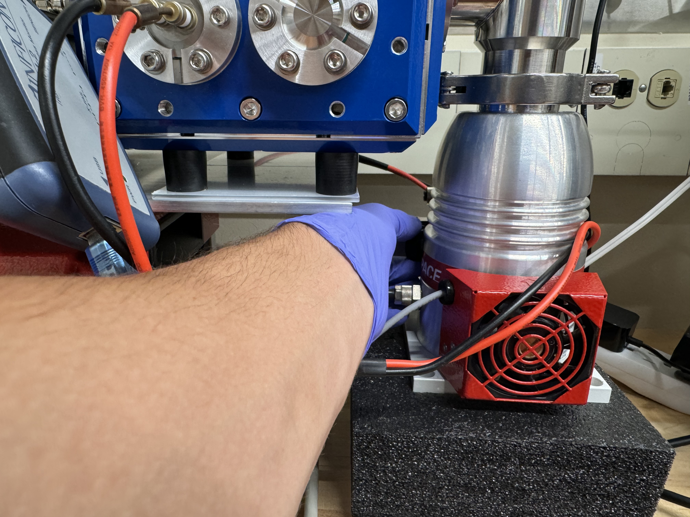.jpg>)
* Wait until the pressure is at 1E3 hPa or greater (pressure is given by parameter 340, scroll to it with the arrows).
* Unscrew the two black knobs pictured below, then lift the chamber lid.

<figure>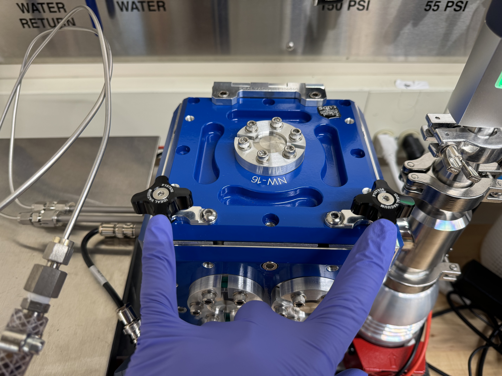<figcaption></figcaption></figure>

* Turn the two black knobs on the top of the blue box as shown above and open the lid.
* The tungsten filament is secured with two barrel connectors pictured below. The filament can be removed by slightly loosening the screws closest to the filament. 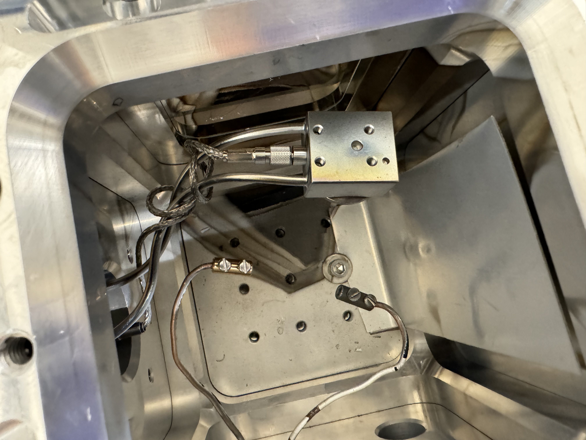
*   Tightly wrap aluminum wire near the center the Tungsten coil, you only really need an inch of wire. Due to the alloying between Al and W, the filament becomes more brittle after each evaporation, so be careful not to break it. If you do break it, use a new filament. You may have to use clippers to shorten the ends of the new filament to get it to fit right. &#x20;

    <figure>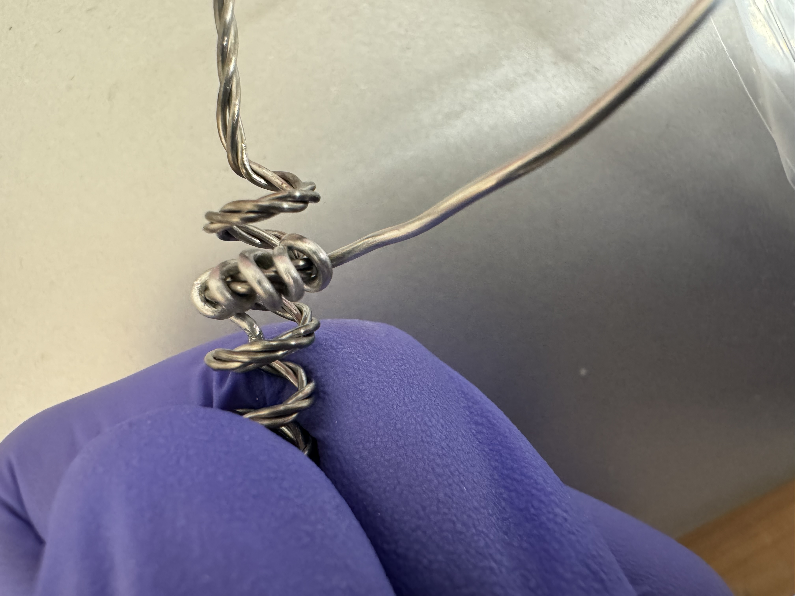<figcaption></figcaption></figure>
* Place the tungsten filament back and screw it in. Make sure it is straight. 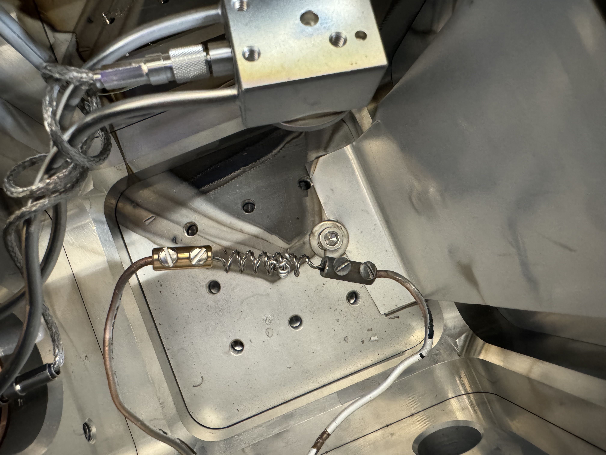
* Place \~ 1 inch of polyimide tape on the substrate holder shown below, then peel off the clear layer on top of the tape. Since aluminum often covers the square box, when you put the tape on, aluminum might stick to it and flake off. Just continue attempting to apply tape until it stick without flaking off.
  * Must be polyimide/Kapton tape, otherwise it will outgass under vacuum.

<figure>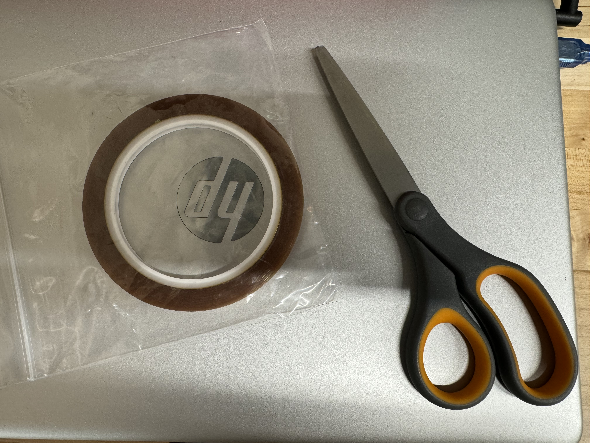<figcaption></figcaption></figure>

<figure>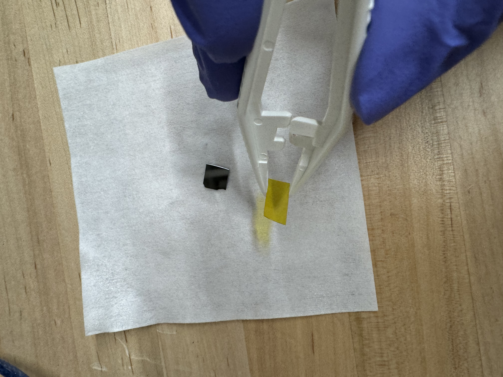<figcaption></figcaption></figure>

<figure>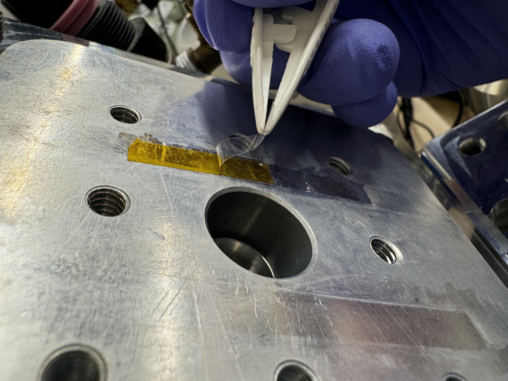<figcaption></figcaption></figure>

<figure>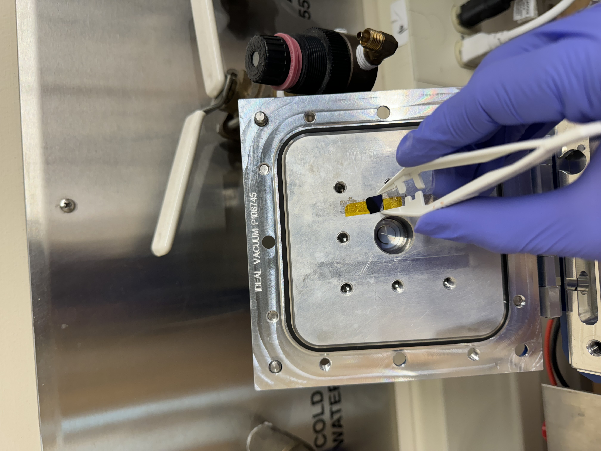<figcaption></figcaption></figure>

* Place your chip on the tape, and use tweezers to gently press down on the corners of the chip.
* Double check that the wire and barrel connectors are suspended and not touching anything conductive (including the chamber).
* Close the blue lid and screw the black knobs all the way.
* Close the vent all the way (hand tight)
* Turn on the pump. Monitor the pump speed in Hz. Often, around 270Hz, it makes a bad noise and stops speeding up. This can be resolved by quickly tuning the pump on and off, with the button on the right. It will slow to \~ 160, then re speed up, and pass the point it got stuck at. This is not normal pump behavior, and we are looking into a repair.
* Screw the black knobs more since they tend to loosen after the pump turns on.
* Wait for the pressure to reach 3.71E-5 torr (lower limit of the Pirani gauge). This may take hours. However, with this system, very conductive films have been deposited at a pressure of only 1E-4 torr when there was a bad seal. If you choose to do this, you are sacrificing some film quality.
* Turn on the water cooling for the QCM sensor head. Off is when both handles are vertical, on is when both handles are horizontal.

<figure>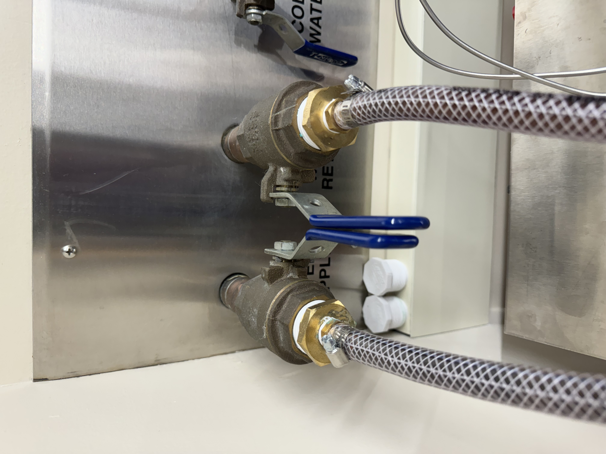<figcaption>
On
</figcaption></figure> <figure>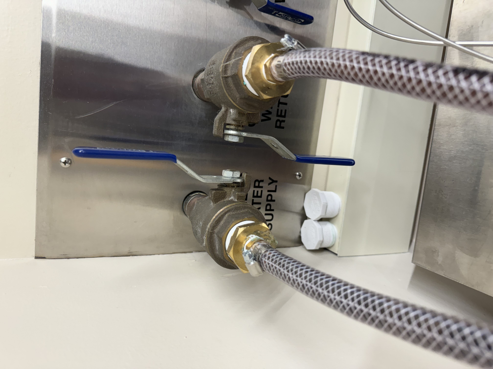<figcaption>
Off
</figcaption></figure>

* Turn on the hp laptop, and open the STM-2 software. under the STM-2 tab, it should show a connection to a sensor. Then, the frequency value should read something near 6 MHz, and actively stream slight noise oscillations.

<figure><figcaption></figcaption></figure>

* Hit the start button, values should pop up for both rate and thickness. Rate should be streaming noise oscillations near 0.
* For the next step, do not souch the wires going inot the chamber. If anything starts smoking, or if current i flowing but deposition rate does not increase, you must turn off the power supply.
* Turn on the power supply. Set it to 45 amps or less with the current knob, when ready, begin flowing the current by pressing the white "output" button. Deposition rate will soon shoot up to hundreds of Angstroms per second, then you've reached the desired thickness in kilo Angstroms, hit the white output button to turn off the current.

<figure><figcaption>
on
</figcaption></figure> <figure>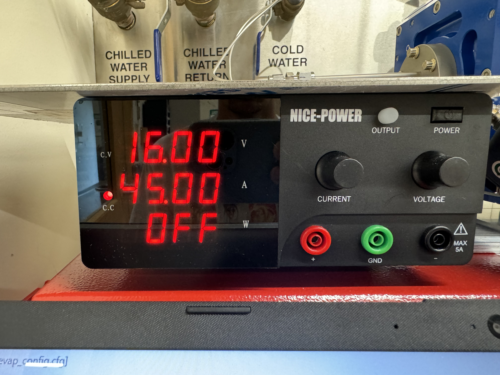<figcaption>
Off
</figcaption></figure>

* Poer off the power supply.
* Turn the pump and water cooling off.
* Wait until parameter 309 shows 0Hz, indicating the pump has fully stopped.
* Slowly unscrew the vent until chamber is  at \~760 torr.
* Open the lid.
* Peel the piece of tape off with your chip
* Grip the sides of the chip with the reverse plastic tip tweezer shown below, then peel the tape off with another tweezer.

<figure><figcaption></figcaption></figure> <figure><figcaption></figcaption></figure>

### Troubleshooting

* If current is not flowing when you press output on the power supply, then the electrodes are probably not connected through the filament. Check this by disconnecting the power lines from the back of the power supply, then use a multimeter on each electrode to see if it is an open circuit. If so, then a connection to the filament is not on.
* No deposition: check that nothing is hsorted, preventing fulll curren flow through the filament.
