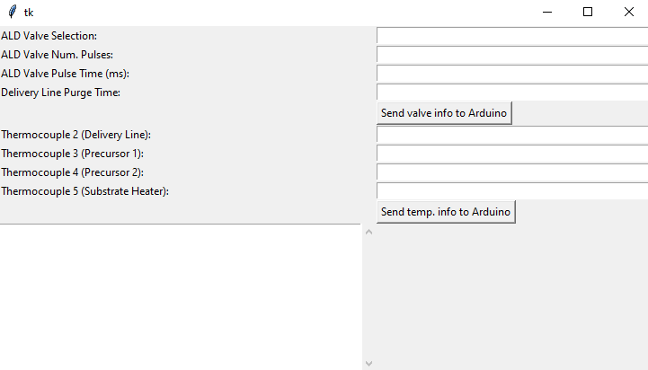

# DIY Thermal Evaporator SOP

## Purpose

Thermal evaporation heats up a metal (in this case Aluminum) to really hot temperatures in order to evaporate it onto the chip. Evaporating metals like aluminum is what allows us to conduct electricity through our design.

## Procedure

### Preparation

* Make sure the vacuum has been turned off for at least 5 minutes.
* Make sure pressure is at room pressure (\~1000 hPa) as shown in Figure 1. If it is not, slowly open the valve (black knob on the right side of the vacuum) as shown in Figure 2, and release pressure one order of magnitude about every 15 seconds.

<figure><figcaption>
<em>Figure 1: Front of thermal evaporator. A (red circle) indicates the screen which shows pressure while B (blue circles) indicates the lid's knobs and C (yellow circle) indicates the vacuum on/off button.</em>
</figcaption></figure>

<figure><figcaption>
<em>Figure 2: Right side of thermal evaporator. A (blue circle) indicates the knob to close and open the vent.</em>
</figcaption></figure>

* Turn the two black knobs on the top of the blue box as shown in Figure 1, and open the lid.
* Unscrew any screws holding down the Tungsten coil as shown in Figure 3, and remove the coil.

<figure><figcaption>
<em>Figure 3: Inside of thermal evaporator. A (red circle) indicates the Tungsten coil, B (blue circles) screw the coil in place, and C (yellow circle) is the metal sheet blocking the vacuum.</em>
</figcaption></figure>

* Tightly wrap aluminum around the Tungsten coil. This alloy is brittle, so be careful and don't wrap too tightly if you have less aluminum that you need to evaporate.
* Place Tungsten back and screw it in. Make sure it is straight.
* Put the yellow tape on the square box attached to the inside of the lid as shown in Figure 4, then peel off the clear layer on top of the tape. Since aluminum often covers the square box, when you put the tape on, aluminum might stick to it and flake off, so you might lose grip. If the tape isn't sticking because of this, just do it again.

<figure><figcaption>
<em>Figure 4: Thermal evaporator with lid open. A (red circle) indicates where the tape and chip should be placed.</em>
</figcaption></figure>

### Evaporation

* Put your chip on the yellow tape as shown in Figure 4.
* Double check that the metal sheet at the back is not bent and still covering the vacuum as shown in Figure 3.
* Close the blue lid and screw the black knobs all the way.
* Close the vent all the way.
* Turn on the pump as shown in Figure 1.
* Screw the black knobs more since they tend to loosen after the pump turns on.
* Wait for the pressure on the screen to get under 1e-5 hPa as shown in Figure 1. This will take 30 minutes to 1 hour depending on how clean the inside of the chamber is. (Baking the chips and trying not to touch the inside of the chamber too much will help speed this up.)
* Turn on the power source as shown in Figure 5.

<figure><figcaption>
<em>Figure 5: Program on computer next to thermal evaporator. Note green start button to begin, rate (A/s) in the table, and thickness (Angstroms) in the table on the computer program. A (yellow circle) indicates the power supply on bottom and B (red circle) indicates the knob for adjusting current.</em>
</figcaption></figure>

* Press start on the computer as shown in Figure 5.
* Turn up the current on the power source as shown in Figure 5. Keep adjusting the current to keep the rate between 30-100 Angstroms/second until the thickness hits 5 Angstroms.
  * If you click the dial, you can change the digit.
  * You will probably end up between 40-50 Amps.
  * The voltage and power will automatically change as you adjust the current, so you do not need to worry about it.
  * The pressure might increase to 1e-4 hPa which is not a problem.
  * You may not get to 5 Angstroms so keep turning up the current. But after 5 minutes, if you keep increasing past 55 Amps and the thickness does not increase, the aluminum has probably already melted off. It is not a huge deal if the layer is thin for our NMOS process, but it is not ideal.
* After the thickness hits 5 Angstroms, turn off the power source.
* Press stop on the computer program.
* Turn off the vacuum pump. WAIT at least 5 minutes.
* After 5 minutes, slowly open the valve (black knob on the right side of the vacuum) and release pressure one order of magnitude about every 15 seconds.
* You may now retrieve your chips!
