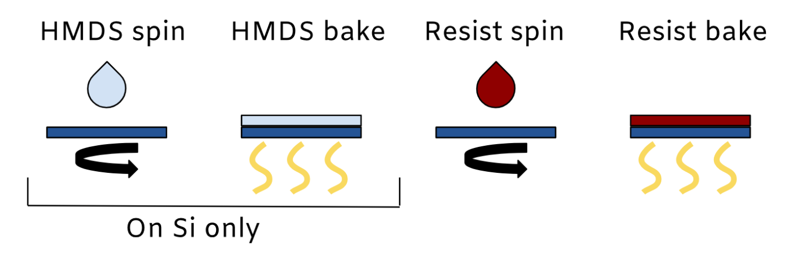
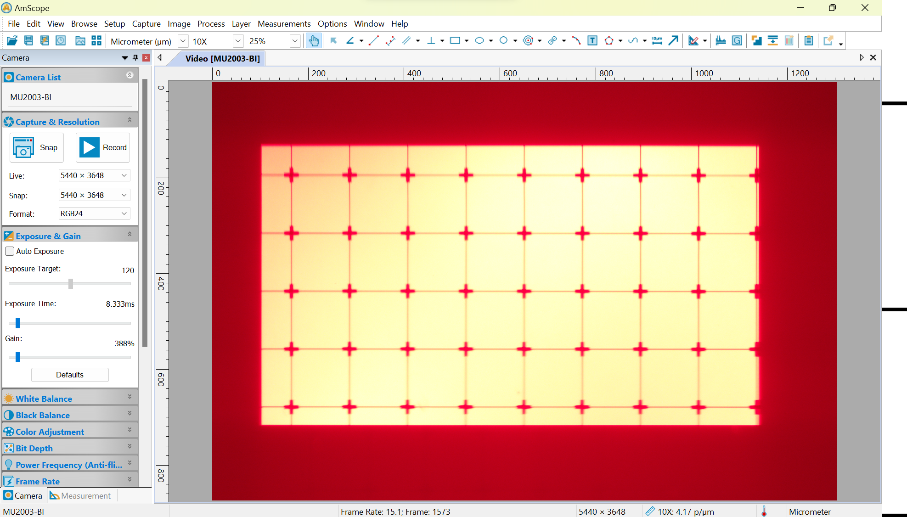
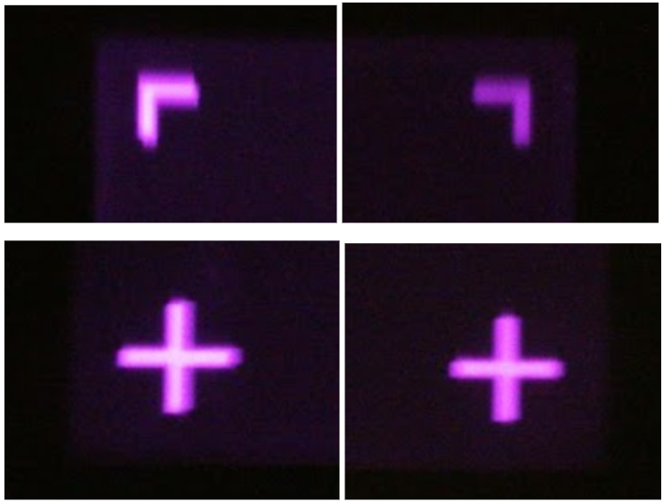

---
layout:
  title:
    visible: true
  description:
    visible: true
  tableOfContents:
    visible: true
  outline:
    visible: true
  pagination:
    visible: false
---

# 🎞 Patterning SOP - Stepper V1

<figure><figcaption>
Generic Patterning Sequence
</figcaption></figure>

## Parameters

<table><thead><tr><th width="262"></th><th width="116"></th><th width="213"></th><th></th></tr></thead><tbody><tr><td>HMDS Prebake Temperature</td><td>100°C</td><td>Resist Bake Temperature</td><td>100°C</td></tr><tr><td>HMDS Prebake Time</td><td>60s</td><td>Resist Bake Time</td><td>90s</td></tr><tr><td>HMDS Amount (Drops)</td><td>2</td><td>Exposure Pattern</td><td>link</td></tr><tr><td>HMDS Spin Speed</td><td>4000 rpm</td><td>Exposure Source</td><td>Stepper V1</td></tr><tr><td>HMDS Spin Time</td><td>20s</td><td>Exposure Time</td><td>4s</td></tr><tr><td>HMDS Bake Temperature</td><td>100°C</td><td>Exposure Dose</td><td></td></tr><tr><td>HMDS Bake Time</td><td>60s</td><td>Developer Type</td><td>AZ-400K</td></tr><tr><td>Resist Amount</td><td>2 drops</td><td>Developer Time</td><td>80s</td></tr><tr><td>Resist Spin Speed</td><td>4000 rpm</td><td>Developer Temperature</td><td>20°C</td></tr><tr><td>Resist Spin Time</td><td>30s</td><td></td><td></td></tr></tbody></table>

#### For More Detailed Process Parameters:

[Patterning Process Sheet](https://docs.google.com/spreadsheets/d/1JrOyISOwiZrRkdBT3utiHOze-yCluFcrFgd6\_dhLPMw/edit#gid=38181110)

***

## Purpose

Patterning is the core of any micro/nanofabrication process, as it is used to mask etch and deposit steps. First we spin coat photoresist to deposit a thin layer. Then we use our maskless lithography stepper to expose our pattern in the resist with light. Finally we wash away the exposed region with developer. This leaves behind a resist pattern that is resistant to many types of acid and plasma etches. It can also be hard baked and used as a dielectric, or metal can be deposited on top of it for a lift off process. The procedure described here uses a positive resist, AZ-P4210, but negative resists also exist where unexposed areas become soluble.

See the appendix for useful resources about spin coating, our resist, and developer.

***

## Tools

1. [Spin Coater](https://docs.google.com/document/d/16tg5COz3QADQcWTJfgbuTBRsJrYIF2IFitKL2VLnr3I/edit?usp=sharing)
2. [Hot Plate](https://docs.google.com/document/d/14IZRb\_CLO6zwDDNvO9dSkzYD5jisfbr-6na2exCk-T0/edit?usp=sharing)
3. Flashlight Jig or Maskless Lithography Stepper

## Materials

1. [Hexamethyldisilazane (HMDS) adhesion promoter](https://docs.google.com/document/d/1Wtk8l1dXzwlhdUSQaCBSIJ00-sB0tanP0AOklIOY0Ik/edit?usp=sharing)
2. AZ-4210 positive photoresist ([specsheet](https://www.microchemicals.com/micro/tds\_az\_p4000\_series.pdf))
3. AZ-400K Developer
4. Acetone
5. Isopropanol
6. Deionized water
7. Evaporating dish

***

## Procedure

### Preparation

1. If you have already claimed a chip number, and opened its specific chip view data sheet, record your patterning data into that sheet. If you have NOT claimed a chip number, and have NOT begun recording data in a chip specific sheet, open this [central chip count](https://docs.google.com/spreadsheets/d/1MrqtnkHcNr5hekHpQHusBZJG4nrdcxDz7Yg5Emn9BMQ/edit#gid=0) sheet, claim the next available chip number, open the blank chip view sheet for that specific chip number and record all subsequent process data into it.&#x20;
2. [Cleave](https://docs.google.com/document/d/1UWZ\_X2TpRqdOWOC8YGubfD7xW-dz4nRNzJk5c\_mo4w0/edit?usp=sharing) the Si wafer into a \~1 cm x 1 cm square.
3. Dust off the wafer with the nitrogen gun

### Wafer Cleaning

1. In the fume hood, hold the wafer with tweezers over the sink.
2. Rinse the polished side of the wafer thoroughly with acetone, then isopropyl alcohol.
   1. The acetone leaves a residue that must be removed by the isopropyl alcohol rinse.
3. Blow the wafer dry with the nitrogen gun.
   1. Even when the wafer appears dry, there may still be moisture on the edges, so dry liberally.
4. Inspect with the naked eye and note any marks on the wafer.
   1. Marks present after cleaning are likely scratches that need to be documented so we observe their effect on the process.

### Spin Coat

<figure><figcaption></figcaption></figure>

4. If previous steps required cleaning with solvents, pre-bake the wafer to dehydrate the surface.
5. If patterning on silicon, spin coat 1 drop of HMDS. Otherwise skip to 7.&#x20;
   1. Choose Time and RPM from [patterning data sheet](https://docs.google.com/spreadsheets/d/1T9-kXXxdD9c6KZh\_iy1LGt8I8wGlmeVlIZmvBrkVQ2g/edit#gid=0)
6. Bake on the hot plate at 100°C for 30 seconds.
7. Spin coat as much photoresist as needed to mostly cover the chip, normally 2-3 drops
   1. Choose Time and RPM from [patterning data sheet](https://docs.google.com/spreadsheets/d/1T9-kXXxdD9c6KZh\_iy1LGt8I8wGlmeVlIZmvBrkVQ2g/edit#gid=0)
   2.  If chip is having trouble sticking on o-ring either: try pressing top of chip while vacuum is on with some pressure to make a better seal (use plastic tweezers)

       
   3. Or, take o-ring off and clean then re-install.
8. Soft bake on the hot plate at 100°C for 90 seconds.

## Stepper Setup

1. Turn on the projector. Plug in the HDMI cable for the projector and the USB camera cable to your computer.
2. Plug in the Raspberry pi power adapter and press the button on the arduino nano to turn them on.
3. Set up the projector as a second screen on your computer’s  display settings.
4. Prepare patterns following [this guide](https://docs.google.com/document/d/1KSepVb3Hcj588Dh-XTc7v-McR3kzytuWSQJffmucU\_Q)
5. Set up the patterning GUI util script
   1. Run the python script\
      It requires installing pillow and tkinter with pip3
   2. Move the black full-screen window to the projector (on windows, this is shift + win + L/R arrow)
   3. Use the three import buttons to select the desired images, these can be changed whenever. Make sure they are correct using the small previews
   4. Future mentions to GUI buttons will be in \[braces]
6. Put your image to be patterned in a Google Slides presentation. Example: [resolution tests](https://docs.google.com/presentation/d/16IsbOxES9O-imGjrv0Toe71-hkYhzWTv\_O2MjYu2rck/edit?usp=sharing).&#x20;
   1. Put a black screen as the last slide in your presentation. This will be the non-exposing/”off” slide.
   2. Put another black screen as the second to last slide, this time adding a dark gray plus sign or other easily focusable feature. Ensure this feature is in an area that will either get exposed or isn’t used.

\

7. Copy the flat field correction mask from here and paste it on top of your pattern in google slides. Select the mask and go to format options > set opacity to 50%.
8. In your browser, navigate to [http://172.26.165.101:5000/#](http://172.26.165.101:5000). This is how you control the stage. Press “cancel” when it prompts you to calibrate.
9. Open AmScope.
10. Split the screen so you can see the browser with the stage control and AmScope at the same time.

### Expose Using Maskless Photolithography Stepper

1. Check that the red filter is inserted and the bandpass (UV) filter is out.
2. Place the chip with soft baked photoresist on the stage.
3. Press \[show red focus]&#x20;
4. Find your chip by moving it with tweezers, then rotate it so the pattern is the right way up.

<figure><figcaption>
Example of focused view with red illuminuation
</figcaption></figure>

16. Use the stage to rough focus and align. Use the arrow keys with the OpenFlexure control screen to move the stage. Use pg up/ pg down to move in Z. The plus sign grid pattern is useful for accurate focus.
17. Press \[clear] to project a black screen.
18. Move the Z stage by 1800 steps in +Z. This will switch from focusing in red to approximately focusing in UV.

<figure><figcaption>
AmScope exposure and gain panel
</figcaption></figure>

19. Turn the exposure time to 200-300ms and the gain all the way up on AmScope.
20. &#x20;Use an opaque, flat object to block the light coming out of the objective while you remove the red filter and insert the UV filter.

<figure><figcaption>
UV focus marks.
</figcaption></figure>

21. Press \[show UV focus] to show UV focusing pattern. Use the Z axis to focus. Try to do this as quickly as possible to avoid unnecessary exposure. Press \[clear] at any point to hide the focusing image.
22. &#x20;Set the desired patterning time (in milliseconds)
23. &#x20;Press the big red \[pattern] button when ready.
24. &#x20;Move on to your next pattern and repeat. If you’re aligning with an underlying pattern you need to switch back to red. Otherwise you can try stepping over and exposing in UV without refocusing.

## Develop

<figure><figcaption>
Developer (Deionized water to AZ-400K 3:1) and DI water rinse.
</figcaption></figure>

1. Refresh the developer if it has been out for more than 6 hours. Otherwise skip to step 3.
   1. Pour the used developer into the bottle labeled "developer waste"
   2. Rinse the evaporating dish with DI water.
   3. Pour about 30 mL of pre-diluted 3:1 AZ-400K developer solution into the evaporating dish labeled “AZ-400K 3:1”. For a sense of scale: in the dish above this should only be about 3mm tall of liquid (just enough to cover the surface of the chip)
   4. Fill another evaporating dish halfway with DI water.
2. Start the timer **at the same time as you drop the wafer into the developer**, photoresist side up.

<figure><figcaption>
Agitate the developer
</figcaption></figure>

5. Agitate the chip in the developer solution with quick, small circular motions. Watch [this video](https://drive.google.com/file/d/1C2APhZpUS7O2a-3hzmjMloyEuc7RCg1Z/view?usp=sharing) for proper technique.
6. 5 seconds before the end of the timer, pick up the chip and prepare to drop it into the water. The chip should **hit the water exactly at 0 seconds**.
   1. Note that development time includes all the time that developer is touching the chip, not just during agitation
7. Dry off the chip with compressed air.

## Inspect

1. Look at the chip with your bare eyes to help build an intuition for the process.
2. Put the chip under the microscope. Connect to the camera with your laptop and take pictures at 5X, 10X bright and dark field, 20X bright and dark field, and 50X.
   1. You can use the 10x or 20x objective and use the calibrated measuring system to determine feature sizes on your chip
3. Batch save then upload the folder to [Patterning Photos](https://drive.google.com/drive/folders/1-ON8-167CTyXiuhVdlI1\_WMpKkx0M0a8?usp=share\_link).
4. Paste a link to the folder in the last column of the patterning data sheet.
5. Put the chip away in a plastic box and label it with a serial number.

<figure><figcaption>
Inspection image demonstrating non-uniform exposure
</figcaption></figure>

Right side: thicker lines and blurry edges. Left side: thin lines and sharp edges.

<figure><figcaption>
Inspection image showing blurring effect from defocused stepper
</figcaption></figure>

<figure><figcaption>
Insprction image showing incsufficient develop or exposure
</figcaption></figure>

## Safety

1. HMDS is a toxic, volatile chemical that should only be used in the fume hood.
2. Photoresist, while not as bad as HMDS, contains some nasty solvents and should be cleaned with acetone if it gets on anything other than chips and the spin coater.
3. AZ-400K developer is a strong base containing KOH. Use the appropriate precautions for working with bases. Only agitate the developer inside the fume hood to reduce the chance of droplets.\

***

### Additional Resources

See this webpage for in depth spin coating theory: [https://www.ossila.com/en-us/pages/spin-coating](https://www.ossila.com/en-us/pages/spin-coating)

[AZ-P4210 techsheet](https://www.microchemicals.com/micro/tds\_az\_p4000\_series.pdf)

[AZ 400K developer](https://www.microchemicals.com/micro/info\_az\_400k\_421k\_Developer.pdf)

### Alternative Exposure Technique: 365nm Flashlight

13. Put on UV protection glasses.
14. Before placing the chip under the exposure area, turn on the flashlight and adjust the position of the UV meter’s sensor head to maximize the reading.&#x20;
    1. Depending on the battery level, this should be around 10 mW/cm2.
15. Turn off the flashlight, being careful not to move it out of position.
16. Place the chip on the plastic cap photoresist side up.&#x20;
17. Place the mask on the wafer. Gently press down to sandwich the two together.
    1. If the ThorLabs logo is correctly oriented then the chrome is facing you. Put that side face down towards the chip.
    2. Try not to slide the mask on the wafer because you’ll damage the photoresist.
18. Place the cap with the wafer and mask on top of the UV sensor.
19. Turn on the flashlight for the desired exposure time.
20. &#x20;Record the measured exposure time in the [spreadsheet](https://docs.google.com/spreadsheets/d/1T9-kXXxdD9c6KZh\_iy1LGt8I8wGlmeVlIZmvBrkVQ2g/edit?usp=sharing)
    1. Does should be automatically calculated in the sheet based on exposure option used
