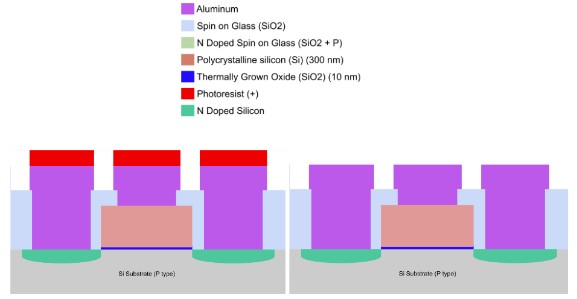

# Photoresist Strip SOP

| Total Time                   | 1 minute   |
| ---------------------------- | ---------- |
| Acetone Spray Time           | 20 seconds |
| Isopropyl Alcohol Rinse Time | 10 seconds |
| Nitrogen Blow Dry Time       | 10 seconds |

<figure><figcaption>
Resist strip cross section. The underlying chip doesn't need to look like this.
</figcaption></figure>

## Purpose

Stripping removes all photoresist from a chip. This is typically done after an etch step is completed, though it can also be used to remove resist before etching if you need to redo patterning.

## Tools

1. Fume Hood with Sink
2. N2 gun

## Materials

1. Chip with photoresist
2. Acetone
3. Isopropanol

## Procedure

### Stripping

1. Spray the entire chip with acetone for “Acetone Spray Time”
2. Rinse with IPA for “IPA rinse time”
3. Dry with nitrogen

## Safety

Be sure to spray the chip over a sink. Do not use near source of high heat.
