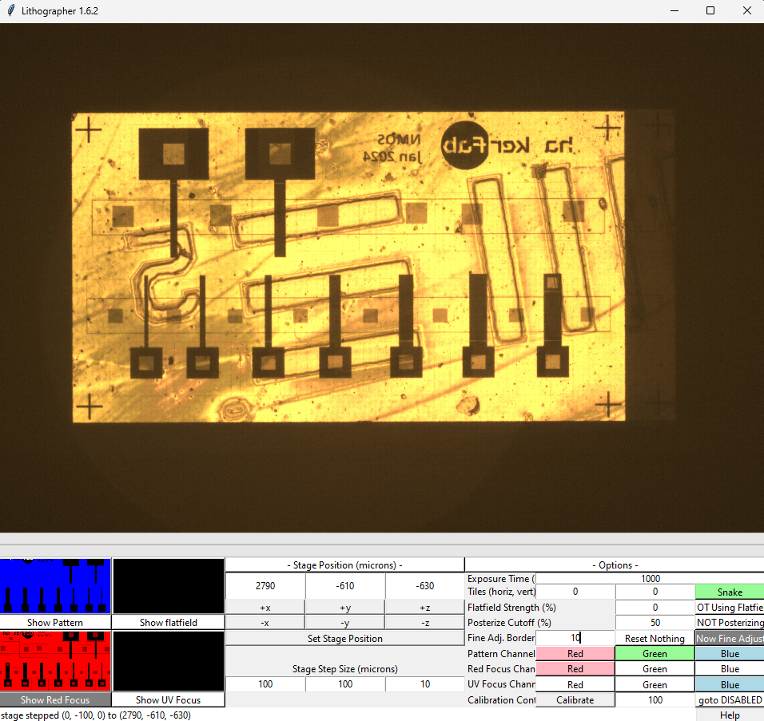
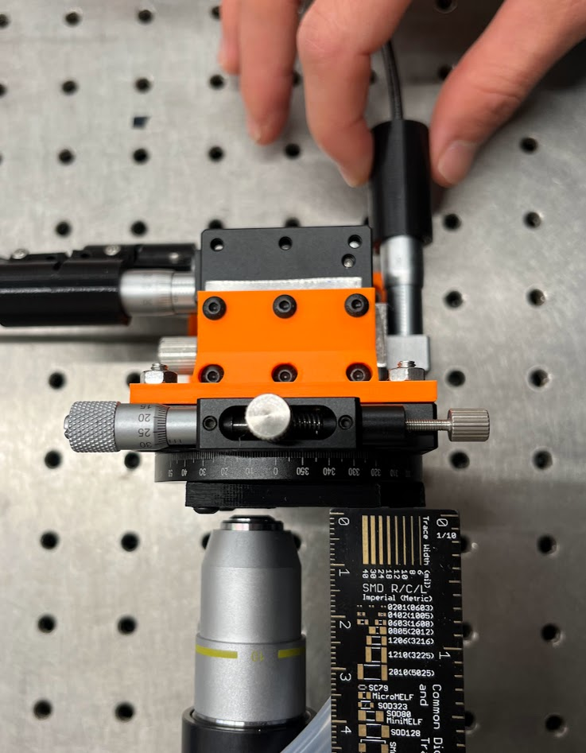
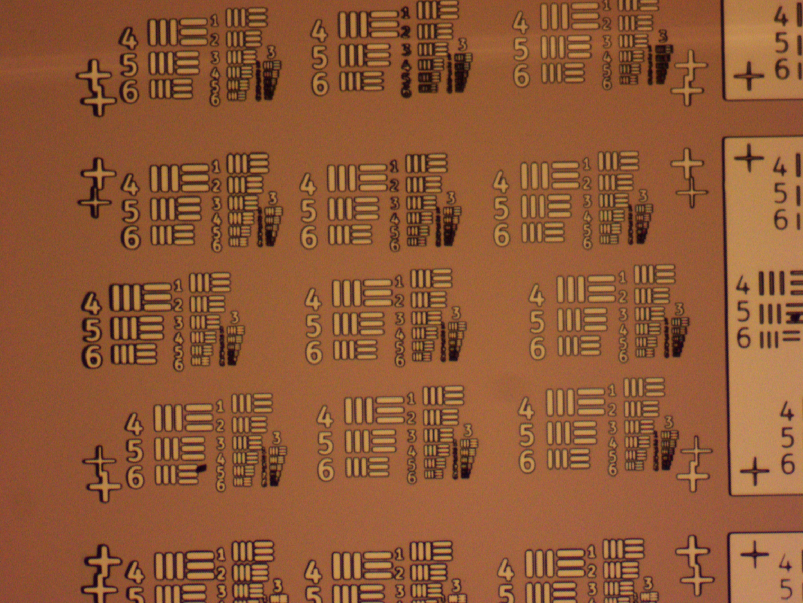
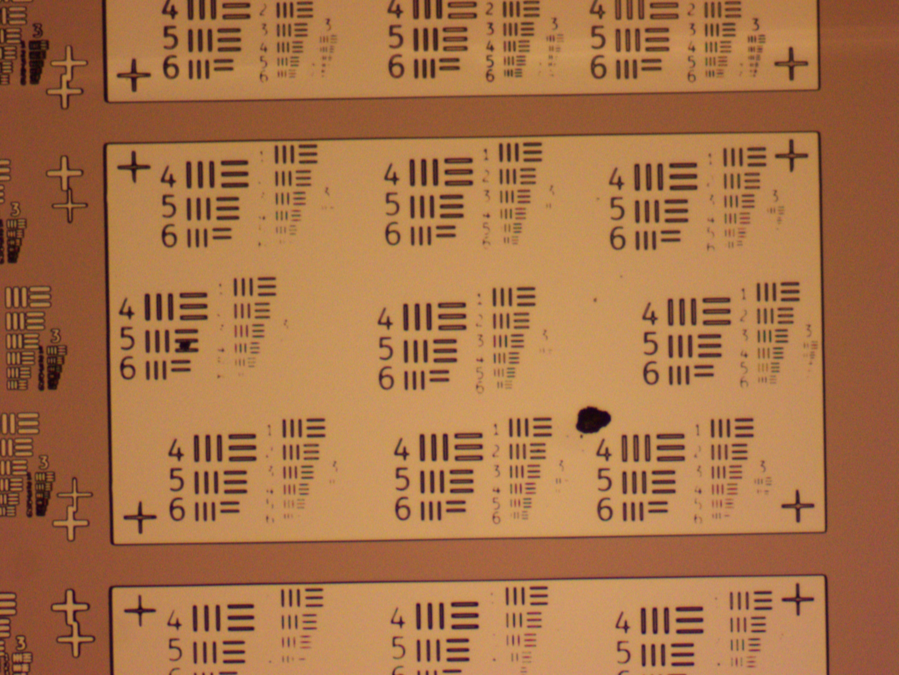

---
layout:
  title:
    visible: true
  description:
    visible: true
  tableOfContents:
    visible: true
  outline:
    visible: true
  pagination:
    visible: false
---

# Patterning SOP - Stepper V2

<figure><figcaption>
Generic Patterning Sequence
</figcaption></figure>

## Parameters

<table><thead><tr><th width="262"></th><th width="116"></th><th width="213"></th><th></th></tr></thead><tbody><tr><td>HMDS Prebake Temperature</td><td>100°C</td><td>Resist Bake Temperature</td><td>100°C</td></tr><tr><td>HMDS Prebake Time</td><td>60s</td><td>Resist Bake Time</td><td>90s</td></tr><tr><td>HMDS Amount (Drops)</td><td>2</td><td>Exposure Pattern</td><td>link</td></tr><tr><td>HMDS Spin Speed</td><td>4000 rpm</td><td>Exposure Source</td><td>Stepper V2</td></tr><tr><td>HMDS Spin Time</td><td>20s</td><td>Exposure Time</td><td>8s</td></tr><tr><td>HMDS Bake Temperature</td><td>100°C</td><td>Exposure Dose</td><td></td></tr><tr><td>HMDS Bake Time</td><td>60s</td><td>Developer Type</td><td>AZ-400K</td></tr><tr><td>Resist Amount</td><td>2 drops</td><td>Develop Time</td><td>60s</td></tr><tr><td>Resist Spin Speed</td><td>4000 rpm</td><td>Developer Temperature</td><td>20°C</td></tr><tr><td>Resist Spin Time</td><td>30s</td><td></td><td></td></tr></tbody></table>

#### For More Detailed Process Parameters:

[Patterning Process Sheet](https://docs.google.com/spreadsheets/d/1JrOyISOwiZrRkdBT3utiHOze-yCluFcrFgd6\_dhLPMw/edit#gid=38181110)

***

## Purpose

Patterning is the core of any micro/nanofabrication process, as it is used to mask etch and deposit steps. First we spin coat photoresist to deposit a thin layer. Then we use our maskless lithography stepper to expose our pattern in the resist with light. Finally we wash away the exposed region with developer. This leaves behind a resist pattern that is resistant to many types of acid and plasma etches. It can also be hard baked and used as a dielectric, or metal can be deposited on top of it for a lift off process. The procedure described here uses a positive resist, AZ-P4210, but negative resists also exist where unexposed areas become soluble.

See the appendix for useful resources about spin coating, our resist, and developer.

## Safety

* Harm to your eyes/eyesight is possible if you do not wear the right protective equipment. To shield your eyes from harmful UV-rays, everyone working with or near the stepper should wear UV-blocking goggles/glasses.&#x20;
* HMDS is a toxic, volatile chemical that should only be used in the fume hood.
* Photoresist, while not as bad as HMDS, contains some nasty solvents and should be cleaned with acetone if it gets on anything other than chips and the spin coater.
* AZ-400K developer is a strong base containing KOH. Use the appropriate precautions for working with bases. Only agitate the developer inside the fume hood to reduce the chance of droplets.

***

## Tools

1. [Spin Coater](https://docs.google.com/document/d/16tg5COz3QADQcWTJfgbuTBRsJrYIF2IFitKL2VLnr3I/edit?usp=sharing)
2. [Hot Plate](https://docs.google.com/document/d/14IZRb\_CLO6zwDDNvO9dSkzYD5jisfbr-6na2exCk-T0/edit?usp=sharing)
3. Flashlight Jig or Maskless Lithography Stepper

## Materials

1. [Hexamethyldisilazane (HMDS) adhesion promoter](https://docs.google.com/document/d/1Wtk8l1dXzwlhdUSQaCBSIJ00-sB0tanP0AOklIOY0Ik/edit?usp=sharing)
2. AZ-4210 positive photoresist ([specsheet](https://www.microchemicals.com/micro/tds\_az\_p4000\_series.pdf))
3. AZ-400K Developer
4. Acetone
5. Isopropanol
6. Deionized water
7. Evaporating dish

***

## Procedure

### Preparation

1. If you have already claimed a chip number, and opened its specific chip view data sheet, record your patterning data into that sheet. If you have NOT claimed a chip number, and have NOT begun recording data in a chip specific sheet, open this [central chip count](https://docs.google.com/spreadsheets/d/1MrqtnkHcNr5hekHpQHusBZJG4nrdcxDz7Yg5Emn9BMQ/edit#gid=0) sheet, claim the next available chip number, open the blank chip view sheet for that specific chip number and record all subsequent process data into it.
2. [Cleave](https://docs.google.com/document/d/1UWZ\_X2TpRqdOWOC8YGubfD7xW-dz4nRNzJk5c\_mo4w0/edit?usp=sharing) the Si wafer into a \~1 cm x 1 cm square.
3. Dust off the wafer with the nitrogen gun

### Wafer Cleaning

1. In the fume hood, hold the wafer with tweezers over the sink.
2. Rinse the polished side of the wafer thoroughly with acetone, then isopropyl alcohol.
   1. The acetone leaves a residue that must be removed by the isopropyl alcohol rinse.
3. Blow the wafer dry with the nitrogen gun.
   1. Even when the wafer appears dry, there may still be moisture on the edges, so dry liberally.
4. Inspect with the naked eye and note any marks on the wafer.
   1. Marks present after cleaning are likely scratches that need to be documented so we observe their effect on the process.

### Spin Coat

<figure><figcaption></figcaption></figure>

5. See the [Vacuum Spin Coater SOP](https://hacker-fab.gitbook.io/hacker-fab-space/standard-operating-procedures/patterning-sop-stepper-v2/vacuum-spin-coater-sop). Remember to pipette an appropriate amount, close the lid, and turn on the vacuum.
6. If previous steps required cleaning with solvents, pre-bake the wafer to dehydrate the surface.
7. If patterning on silicon or glass, spin coat 1-2 drops of HMDS. Otherwise skip to 7.
   1. Choose Time and RPM from [patterning data sheet](https://docs.google.com/spreadsheets/d/1T9-kXXxdD9c6KZh\_iy1LGt8I8wGlmeVlIZmvBrkVQ2g/edit#gid=0)
8. HMDS bake on the hot plate
9. Spin coat as much photoresist as needed to mostly cover the chip, normally 2-3 drops.
   1. Choose Time and RPM from [patterning data sheet](https://docs.google.com/spreadsheets/d/1T9-kXXxdD9c6KZh\_iy1LGt8I8wGlmeVlIZmvBrkVQ2g/edit#gid=0)
   2.  If chip is having trouble sticking on o-ring either: try pressing top of chip while vacuum is on with some pressure to make a better seal (use plastic tweezers)

       
   3. Or, take o-ring off and clean then re-install.
10. Soft bake on the hot plate at 100°C for 90 seconds.

## Stepper Setup

1. Power: Check that the projector, stage, and vacuum pump are all plugged in.
2. Plug the HDMI cable for the projector, the USB camera cable, and the Arduino + CNC Shield USB into your computer.
3. Set up the projector as an extended screen on your computer’s display settings (Win+P on Windows).
4.  Prepare your exposure, red align, and UV focus patterns.

    1. Your exposure pattern should be pure blue in the areas you want exposed, and black elsewhere. Include alignment marks for the next layer.
    2. Your red align image should be completely pure red except for alignment marks that match the previous layer.
    3. Your UV focus pattern should be completely black except for blue focus marks. Ideally these should be in a region that gets fully exposed. You may also use grayscale to avoid unintentional exposure.

    Note: If your pattern images have extraneous color components, the GUI has options to enable/disable different color channels for the red focus, UV focus, and exposure pattern. Use these at your convenience.
5. Set up the patterning GUI util script
   1. In the source or scripts folder, find and open config.py in your text editor of choice. If your GUI has an integrated camera implemented, set RUN\_WITH\_CAMERA to True. If your GUI uses a motorized stage, set RUN\_WITH\_STAGE to True.
   2. Run the python script called Lithographer.py. You can do this by opening a terminal and running the command "py -3.10 Lithographer.py". Make sure you have all dependencies installed as described in [Lithography Stepper V2 Build](../../fab-toolkit/patterning/lithography-stepper-v2-build-work-in-progress.md). If the program does not run, see [#troubleshooting](./#troubleshooting "mention").
   3. Move the black full-screen window to the projector (on windows, this is shift + win + L/R arrow)
   4. Use the three import thumbnails to select the desired images, these can be changed whenever. Make sure they are correct using the small previews.
   5. For more information about the software and its usage, click the "help" button at the bottom right of the GUI.
6. If you do not have an integrated GUI camera implemented and you are using the Flir Camera, open SpinView, select BlackFly S, and press the green play button. If you see horizontal bands across the live camera preview, follow the corresponding steps in [Troubleshooting](./#troubleshooting).&#x20;
7. The GUI should appear similarly to below. If you do not see content on the camera preview yet, this is fine for now.&#x20;

<figure><figcaption></figcaption></figure>

### Expose Using Maskless Photolithography Stepper

If you're doing this for the first time, it is recommended to read through the full instructions before starting. You will need to move somewhat quickly because the stepper will begin to expose photoresist in about 1 minute.

1. &#x20;Make sure the correct pattern is loaded in the Lithographer GUI. See step 4.4 in [#stepper-setup](./#stepper-setup "mention")

<figure><figcaption></figcaption></figure>

2. Push the projector to the left, out of the way of the small hole in the chip holding jig.

<figure><figcaption></figcaption></figure>

3. Turn on the vacuum pump. Ensure vibrations are isolated from the rest of the stepper.

 (1) (1) (1).png>)  (1).png>)  (1).png>)

4. Orient the chip over the hole with its squarest corner in the corner of the alignment jig. The vacuum will suck it against the jig. Push the chip into the corner. Doing this repeatably eliminates the need to adjust theta.

 (1).png>) .jpg>)

5. Push the projector back into place. Ensure it is touching all four bolts.

6. Turn the Z knob on the stage or modify the GUI stage coordinates until the objective lens is \~2mm from the chip and the image on SpinView or the GUI is in focus.

<figure><figcaption>
A well aligned exposure. Note that the previous layer is slightly smaller than the proected pattern.
</figcaption></figure>

7. Move the X and Y axes manually, or by using the GUI. One arbitrary "step" is approximately equal to 1 micron. To avoid straining the motors/stage, test small step sizes (i.e. 1) before trying larger ones (i.e. 10 or more). The minimum reliable step size is about 8-12 microns.
8. If this is your first layer, find an area with minimal contaminants, plan how many exposures you will do, and in which direction you will move. Otherwise, align to your previous layer using your pattern's alignment marks.&#x20;
9. Once you're ready to expose, move the Z axis by -54 steps (fine-tune if necessary). This will switch from focusing in red to focusing in UV.
10. Set your exposure time to 8000 ms.

<figure><figcaption>
Well-focused UV, ready to expose.
</figcaption></figure>

12. Press show UV focus. You are now exposing the photoresist, so try to do this quickly. If necessary, make fine adjustments to the Z axis if any marks seem less in focus than others. The image above is well focused (all crosses look in focus).
13. Press the big red "Begin Patterning" button. Avoid bumping the table while you wait for the exposure to finish.
14. Press "Show Red Focus" and move in Z by +54 steps to switch back to red.
15. Move on to your next pattern and repeat. A good spacing between patterns is 580 steps in Y and 1080 steps in X (assuming one step per micron). This will allow you to easily find your next pattern. Take note of where you started, which direction you're moving, and how many exposures you've done so that you don't miss any patterns.
16. Once you're finished, press "Clear". Push the projector to the left again, and carefully hold your chip with tweezers while you turn off the vacuum.

## Develop

<figure><figcaption>
Developer (Deionized water to AZ-400K 3:1) and DI water rinse.
</figcaption></figure>

1. Refresh the developer if it has been out for more than 6 hours. Otherwise skip to step 2.
   1. Pour the used developer into the bottle labeled "developer waste"
   2. Rinse the evaporating dish with DI water.
   3. Pour about 30 mL of pre-diluted 3:1 AZ-400K developer solution into the evaporating dish labeled “AZ-400K 3:1”. For a sense of scale: in the dish above this should only be about 3mm tall of liquid (just enough to cover the surface of the chip)
   4. Fill another evaporating dish halfway with DI water.
2. Start the timer **at the same time as you drop the wafer into the developer**, photoresist side up.

<figure><figcaption>
Agitate the developer
</figcaption></figure>

5. Agitate the chip in the developer solution with quick, small circular motions. Watch [this video](https://drive.google.com/file/d/1C2APhZpUS7O2a-3hzmjMloyEuc7RCg1Z/view?usp=sharing) for proper technique.
6. 5 seconds before the end of the timer, pick up the chip and prepare to drop it into the water. The chip should **hit the water exactly at 0 seconds**. Rinse well for 10 seconds.
   1. Note that development time includes all the time that developer is touching the chip, not just during agitation
7. Dry off the chip with compressed air.

## Inspect

1. Look at the chip with your bare eyes to help build an intuition for the process.
2. Put the chip under the microscope. Connect to the camera with your laptop and take pictures of each developed pattern at 5x. If there are smaller interesting features or defects, you may take pictures at higher magnification or under dark field. Be aware that it's easy to get carried away with the microscope.
3. **If you want to measure the length of pitch in microns (**μm**) then you must use only the calibrated objective.**
   1. This calibration converts pixels of the camera to microns using a calibration slide from the manufacturer. If you use a different objective, the measurement will be inaccurate.
   2. After this is selected, measure the pitch or any other length using the line tool

<figure><figcaption>
Measuring Microns with a 10x Objective
</figcaption></figure>

   

4. In order to measure the developed pattern resolution, expose [this resolution test pattern](https://docs.google.com/presentation/d/16IsbOxES9O-imGjrv0Toe71-hkYhzWTv\_O2MjYu2rck/edit?usp=sharing). The resolution is equal to the line pitch that is resolved in both light and dark field. Use AmScope to measure. The pitch is the distance between the center of two lines.
5. For each chip, batch save with the chip number as the first three characters in the file prefix. Do not change the folder. A script will upload to [drive](https://drive.google.com/drive/u/1/folders/1ySfcQiROhOYFecQzDvk9XBO2B2KqJLy6) every 5 min.
6. Paste a link to the folder in the last column of the chip sheet.
7. Put the chip away in a plastic box and label it with a serial number.

See below for examples of underexposure/development, overexposure/development, non-uniformity, and optical blurring.

<figure><figcaption>
Inspection image demonstrating non-uniform exposure
</figcaption></figure>

Right side: thicker lines and blurry edges. Left side: thin lines and sharp edges.

<figure><figcaption>
Inspection image showing blurring effect from defocused stepper
</figcaption></figure>

<figure><figcaption>
Insprction image showing incsufficient develop or exposure
</figcaption></figure>

***

### Additional Resources

See this webpage for in depth spin coating theory: [https://www.ossila.com/en-us/pages/spin-coating](https://www.ossila.com/en-us/pages/spin-coating)

[AZ-P4210 techsheet](https://www.microchemicals.com/micro/tds\_az\_p4000\_series.pdf)

[AZ 400K developer](https://www.microchemicals.com/micro/info\_az\_400k\_421k\_Developer.pdf)

### Alternative Exposure Technique: 365nm Flashlight

1. Put on UV protection glasses.
2. Before placing the chip under the exposure area, turn on the flashlight and adjust the position of the UV meter’s sensor head to maximize the reading.
   1. Depending on the battery level, this should be around 10 mW/cm2.
3. Turn off the flashlight, being careful not to move it out of position.
4. Place the chip on the plastic cap photoresist side up.
5. Place the mask on the wafer. Gently press down to sandwich the two together.
   1. If the ThorLabs logo is correctly oriented then the chrome is facing you. Put that side face down towards the chip.
   2. Try not to slide the mask on the wafer because you’ll damage the photoresist.
6. Place the cap with the wafer and mask on top of the UV sensor.
7. Turn on the flashlight for the desired exposure time.
8. Record the measured exposure time in the [spreadsheet](https://docs.google.com/spreadsheets/d/1T9-kXXxdD9c6KZh\_iy1LGt8I8wGlmeVlIZmvBrkVQ2g/edit?usp=sharing)
   1. Dose should be automatically calculated in the sheet based on exposure option used

## Troubleshooting

If horizontal bands appear in Flir-based camera preview:

1. Open the Flir camera viewer.
2. Select the connected Flir camera model (Blackfly S) and select the green triangle. You should see a preview of the camera's output (it may appear black or grainy; this is okay).
3. Update the camera settings so that Acquisition Frame Rate Enable, Acquisition Frame Rate, Exposure Auto, and Exposure Time have the same values shown below:

<figure><figcaption>
Example Flir Blackfly S Camera Settings
</figcaption></figure>

4. Verify that the horizontal bands are no longer present across the camera preview. This may be easier when viewing the stage or a chip while illuminated with the projector.&#x20;
