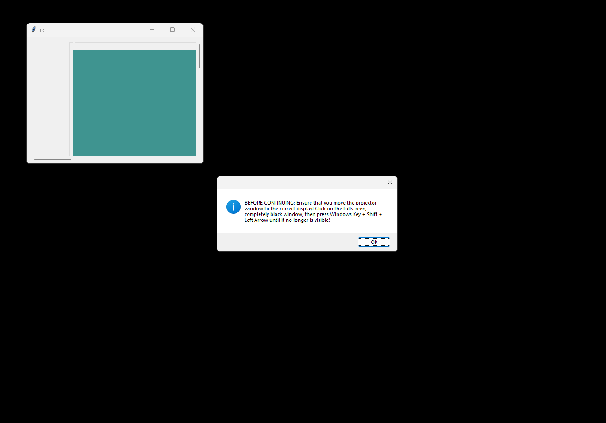
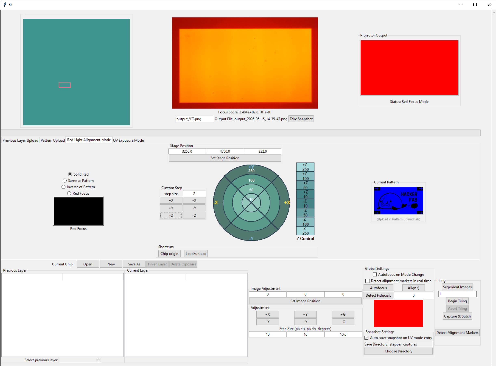
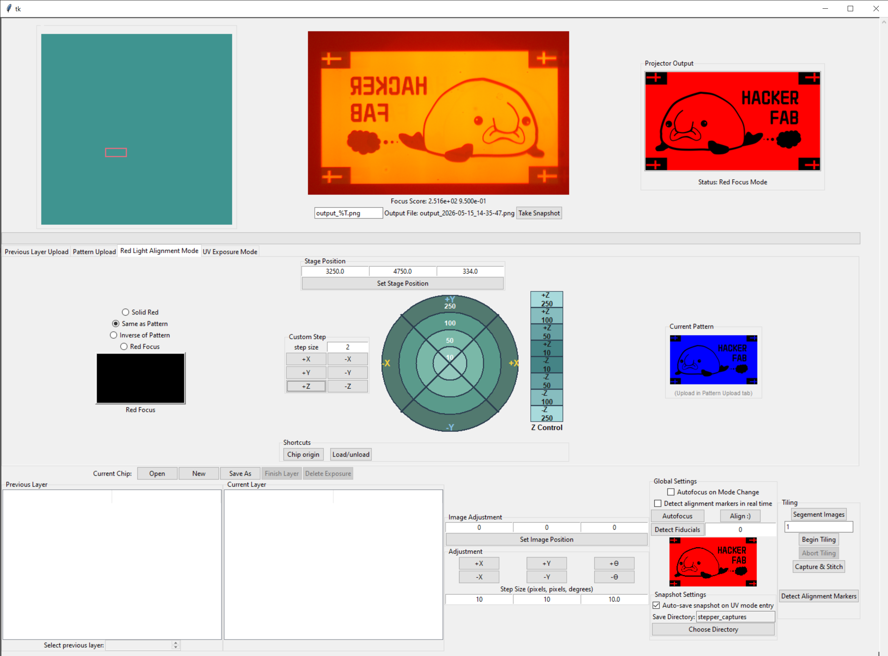
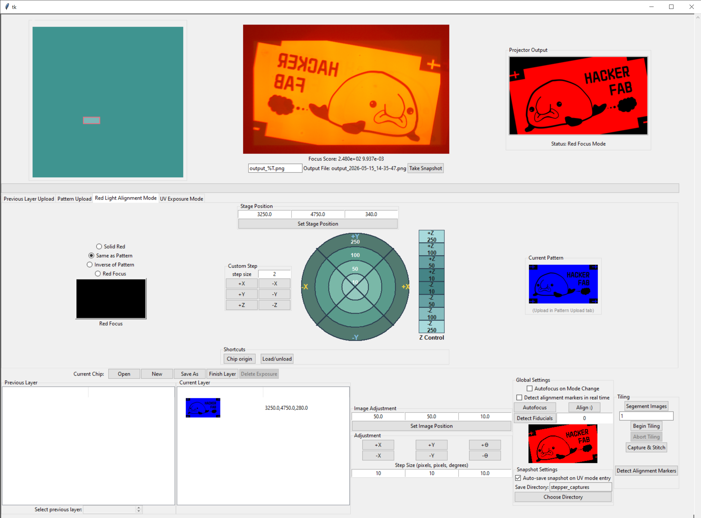
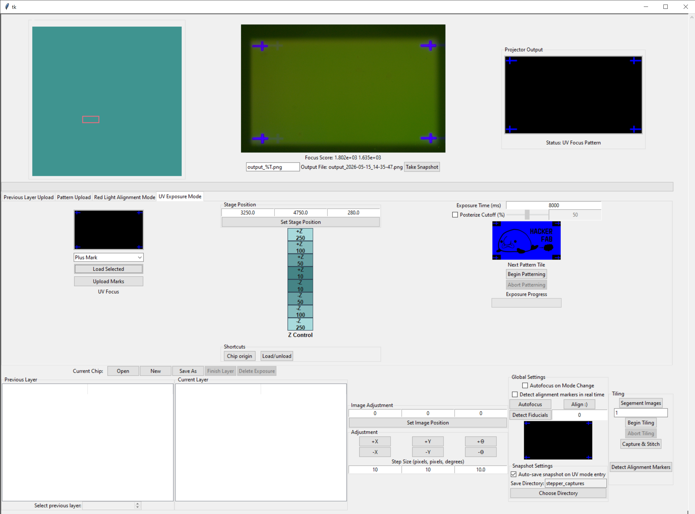
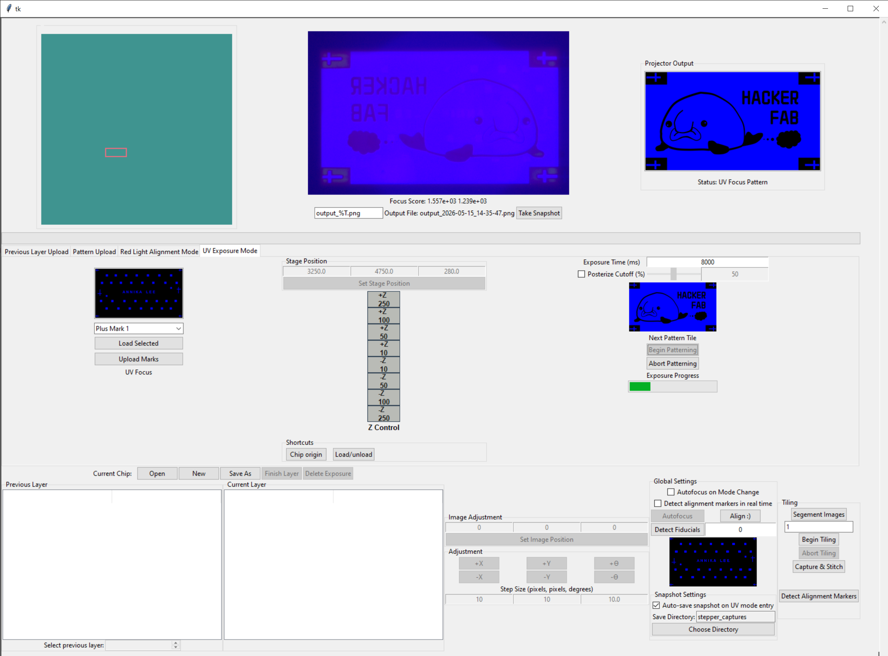
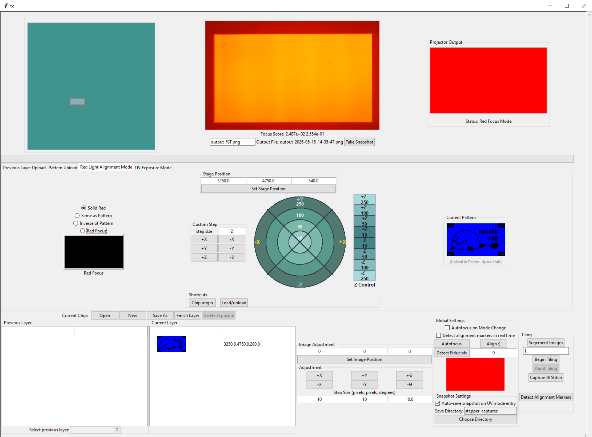
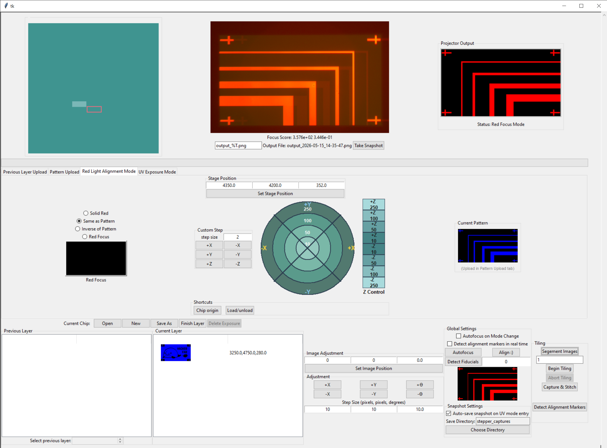
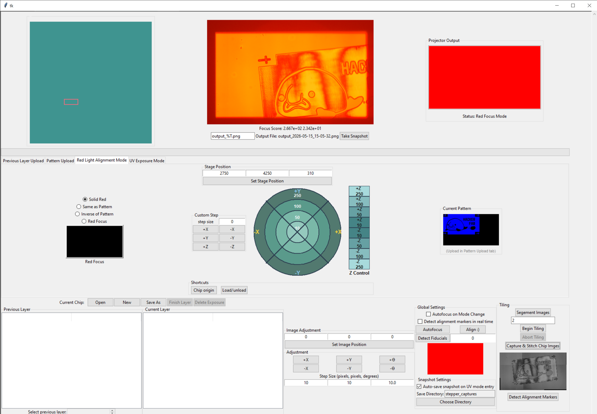
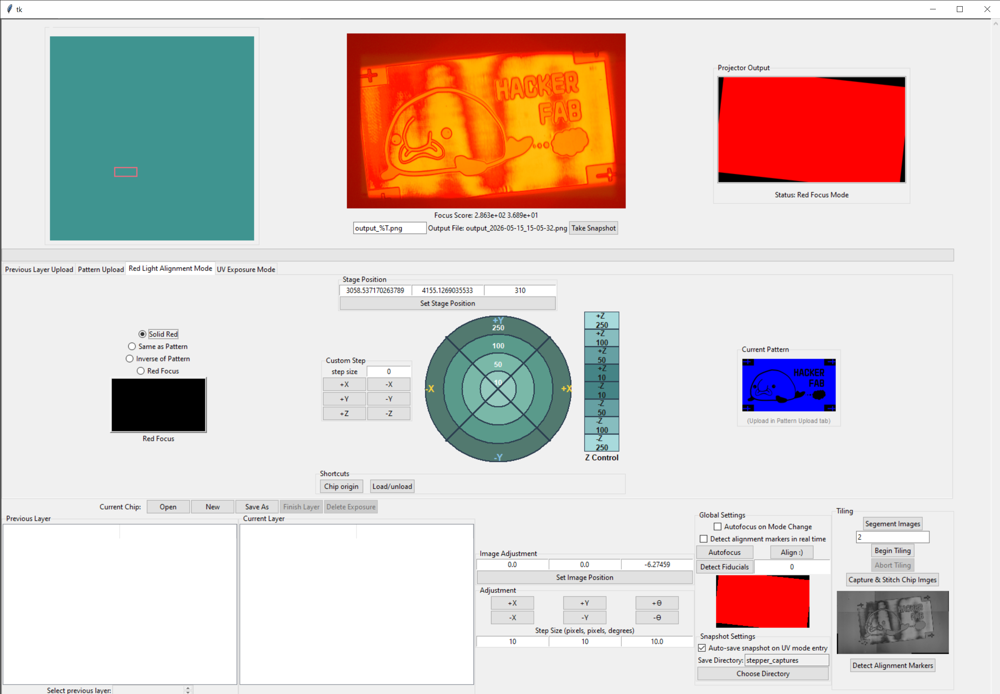

# Stepper User Manual

## Startup

Ensure that you've assembled the stepper and connected all ports and cables to their respective locations AND cloned the stepper repository and downloaded the necessary modules specified in the stepper repository's README file before proceeding to try out the GUI application.&#x20;

<figure><figcaption><p>Source: <a href="https://www.eizoglobal.com/library/basics/windows-10-multi-display-function/index.html">https://www.eizoglobal.com/library/basics/windows-10-multi-display-function/index.html</a></p></figcaption></figure>

To start the software in the manual in the terminal, type in the following commands. Alternatively, you may also create a bash script that does the same below

```
cd stepper/
uv run src/gui.py
```

Next, a window will pop up, in which you'll select the configuration file you wish to use to setup the stepper settings. You may reference the `default.toml` file in the stepper repository to customize your stepper configuration, then select that file and let the stepper software continue to run.&#x20;

**\[Optional]** When your configuration file enables homing, the stepper stage will startup by homing all axes. The ideal motion would be for the x and y stage to home _towards_ the proximity sensors in parallel, then the z-stage homes afterwards.&#x20;

After a few seconds, the GUI software will show up, and a window prompt will appear to request that the user switch the display. On a Windows Desktop/Laptop, the command to proceed with is `Win + Shift + Left` or `Win + Shift + Right` depending on which display frame shows the GUI and which shows the projection. _Ensure that your display settings are configured such that they are in "Extend display" mode._&#x20;

<figure><figcaption></figcaption></figure>

Now, you've officially completed all the setup stages to using the software. To see the camera display in "Safe Mode," you may click on the "Red Mode" tab to enter the mode ready for placement of chips containing spin-on photoresist onto the chip platform.&#x20;

<figure><figcaption></figcaption></figure>

## Lithography GUI Modes

| Red Mode                                                                       | UV Mode                                                                       | Pattern Upload Mode                                                                  |
| ------------------------------------------------------------------------------ | ----------------------------------------------------------------------------- | ------------------------------------------------------------------------------------ |
|  |  |  |

The deployed stepper software interface has three main modes as seen above. The pattern upload mode is used to upload a custom mask that we wish to pattern.&#x20;

Red mode is used for positioning the stage to a location to which we desire to pattern. Because photoresist is most much less sensitive to the wavelength of red light, we can safely shine it on a chip coated in photoresist without causing the resist to react drastically to the light while we are moving the stage for positioning.&#x20;

UV mode is used to project our mask onto the chip and expose the unmasked portion of the chip to UV light, and thereby creating a reaction with the photoresist on the chip.&#x20;

It's best to start by uploading a pattern of interest, then moving into red mode for positioning, the finally into UV mode for exposure.

## Stage Movement

There are 2 main ways to move the stage manually. Absolute and Relative.&#x20;

Stepper V2.1 uses 3 stages: X, Y, and Z. _A_ [_newer version of the stepper_](https://docs.hackerfab.org/home/working-docs/nanopositioner-wip/micromanipulator) _(that is in its validation phase) that uses an open-source micromanipulator stage has an additional rotational stage._&#x20;

To move the stepper using **relative coordinates**, refer to the teal-colored circular panel, as seen in the image demonstration below, and click on the arcs that are meant for X-axis movement (labeled 'X'). The same is done for the Y-axis. Each ring in the circle represents the step resolution, quantified in step units. The Z-axis-equivalent of this is to the right of the circular ring, in a single-column gradient-like panel in which the largest positive step size is at the top, and the largest negative step size is at the bottom.&#x20;

<figure><figcaption></figcaption></figure>

If the user wishes to make finer-precision steps, they may also adjust the custom step size  feature, which will be located to the left of the circular panel as shown below. Here, the user can specify a custom step size that they wish to take relative to the current step position.&#x20;

To move the stepper using **absolute coordinates**, refer to white table above the circular panel, where there will be three text fields, one per axis. The user may enter an absolute position to move the chip to, then click "Set Stage Position" to trigger the stage movement.&#x20;

## Pattern Projection Setup

In red mode, there exists three currently used sub-modes that you can choose from: Solid Red, Same as Pattern, and Inverse of Pattern.&#x20;

| Solid Red                                                                       | Same as Pattern                                                                | Inverse of Pattern                                                                    |
| ------------------------------------------------------------------------------- | ------------------------------------------------------------------------------ | ------------------------------------------------------------------------------------- |
|  |  |  |

When we're trying to position our stage (to look for a clean, evenly coated surface to pattern on), we commonly use Solid Red mode in order to see the entire area of the chip on which we're planning to add our pattern.

Once we find a good spot, we must then toggle with the z-stage to focus our chip. We can use Same as Pattern to help us evaluate how 'in-focus' we are. Inverse of Pattern can be used if we wish to invert the mask and pattern that instead (ie. what was exposed on the original mask will not be un-exposed, and what was un-exposed will now be exposed during patterning).&#x20;

For multi-layering patterning, it's very possible that users may take the chip off after the first layer of patterning, do some work on the chip, then put the chip back on the stepper stage platform. This can introduce rotational differences between the original placement of the chip, and the next placement for the next layer. Hence, we introduce the image position feature to allow users to rotate a mask projection to fit the rotational errors between layers of patterning

<figure><figcaption></figcaption></figure>

To use this feature, reference the `Image Adjustment` area in the bottom panel to adjust the absolute rotation, and offset from the default projection location and the `Adjustment` area below for relative adjustments in rotation and offset from the current projection location.

## Pre-Exposure Setup

During red mode, we were able to focus our chip by projecting the mask under red light. Due to the difference in wavelength between red and UV light, we need to adjust out stage for chromatic aberration by offsetting the z-axis by a custom amount of steps. After some trial and error, we estimated this <mark style="color:violet;">**amount to be around 60 to 70 steps in the downward**</mark> <mark style="color:violet;">**direction**</mark> (away from the lens).&#x20;

| Default Alignment Markers                                                      | Custom Uploaded Alignment Markers                                                   |
| ------------------------------------------------------------------------------ | ----------------------------------------------------------------------------------- |
|  |  |

However, depending how the stepper is assembled, this can vary. The `Load Markers` feature (on the left side of the GUI) allows users to pre-expose alignment markers onto the chip so that some form of projection can be seen in advance and users can use them to verify focus level of the projection in UV mode. Loading markers will allow benefit multi-layer patterning, where users wish to align the previous layer to the current by referencing the previous layer's alignment markers to the current mask.&#x20;

An extra feature that was introduced recently was the ability to load custom alignment markers so that masks don't need to be designed to work around a hard-coded set of alignment markers in the four corners.&#x20;

**The steps to using this feature** include:

1. If you wish to upload alignment markers, click on `Upload Marks` , which opens a file window that allows you to select for a new alignment marker mask. Then move onto Step 2
2. You may press `Load Selected` to project the alignment mask onto the chip in UV mode. **Ensure that the selected mask you are loading is the one you intend to load. If the preview image above the dropdown menu doesn't look right, then use the dropdown menu to select the actual mask you want to use**.
3. Focus the projection to your liking

## Patterning Mask

To customize your exposure, you may change the `Exposure Time (ms)` to change the number of milliseconds we expose the mask to UV light. You can also change the Posterization Cutoff percentage. Clicking `Begin Patterning` will start your official exposure based on the settings configured, and you will see a progress bar appear under `Exposure Progress` .&#x20;

During exposure, it's important for there to be as little vibration as possible to the stepper and the platform that supports it. This allows for accurate, precise exposures.&#x20;

<figure><figcaption></figcaption></figure>

Once an exposure is complete, the progress bar will disappear and there will no longer be any UV light exposed to the chip. You may exit UV mode by visiting the `Red Light Alignment Mode` tab to go back into safe mode as follows

<figure><figcaption></figcaption></figure>

## Optional Features

In efforts to expand the capabilities of the existing stepper, there are several features that have and are being introduced into the software.&#x20;

### Homing

The stepper stage is not entirely a closed-loop system because the proximity sensors can only sense  proximity in one direction, and cannot sent specific feedback on how far the stage has actually moved, and whether the stage has reached its maximum travel limit (on its own). Homing is an essential feature that allows for the GRBL stage firmware to have an approximate sense of absolute coordinates during a single session.&#x20;

More details on Homing can be found in this[ documentation page](../../fab-toolkit/patterning/lithography-stepper-v2.1.md).

### Chip Origin

Chip Origin is a feature that is enabled when homing is enabled in the configuration toml file. It will allow the stage to return to its origin coordinates (0,0,0) anytime the user presses the button. As of now, Chip Origin does the same behavior as Load/Unload Chip because origin is the optimal position to which we can insert or offload our chip.&#x20;

<figure><figcaption></figcaption></figure>

### Auto-Align

Auto Alignment is a feature enabled when the alignment feature is enabled in the configuration toml file. It will try to detect alignment markers in the current camera view and move the stage to align the chip to those a set of ideal coordinates that represent the target location of those alignment markers before patterning.&#x20;

Currently, this capability is limited due to ongoing work in a newer alignment marker detection model and updated software for the alignment algorithm. Please visit the [Multi-Layer Tiling page](../../fab-toolkit/patterning/multi-layer-tiling.md) to learn more about the work going into this area.&#x20;

### Capture Image

<figure><figcaption></figcaption></figure>

The snapshot feature allows users to take a snapshot of the camera view, and save it locally. This is great for logging progress. This feature does not require any configurations to be changed in the configuration toml file.&#x20;

### Autofocus

Autofocus is the capability for the stage to move to an optimal z-axis value such that the camera view achieve optimal focus of the chip pattern under any type of light. This feature is also undergoing massive changes due to multi-layer tiling efforts. Please visit this [documentation page](../../fab-toolkit/patterning/lithography-stepper-v2.1.md) to learn more about the work going into this area.&#x20;

<figure><figcaption></figcaption></figure>

#### Multi-Layer Tiling

This feature is a huge ongoing project that CMU Hacker Fab's stepper team is working on. Please visit the [Multi-Layer Tiling page](../../fab-toolkit/patterning/multi-layer-tiling.md) to learn more about the work going into this area. Below, we'll highlight the procedure of steps for each type of layer of patterning.

#### Single-Layer Tiling

Step 1: Upload your pattern

Step 2: Segment the image by clicking on `Segment Images` and set the value under the button to `1`

<figure><figcaption></figcaption></figure>

Step 3: Either click `Autofocus` or manually focus the first tile

Step 4: Click on `Begin Tiling` to start the tiling process

#### Multi-Layer Tiling

Step 1: Upload the previous mask you used for the previous layer&#x20;

<figure><figcaption></figcaption></figure>

Step 2: Upload the pattern mask for your current layer

<figure><figcaption></figcaption></figure>

Step 3: Go into `Red Mode.` Click on `Segment Images` to segment the current pattern image into tiles

Step 4: Set the vaue under the segment images button to your layer number (this won't be 1 anymore)

Step 5: Click on `Solid Red` and focus your chip

Step 6: Click on `Capture & Stitch` to start the SLAM search. Once it's done, an image will appear in the bottom right corner showing the stitched image of the search.&#x20;

<figure><figcaption></figcaption></figure>

Step 7: Click on `Detect Alignment Markers` to align the chip to the target alignment markers in the previous pattern mask. The algorithm moves the stage to the first tile location of the previous layer, which will also be the first tile location of the current layer

<figure><figcaption></figcaption></figure>

Step 8: Press `Same as Pattern` if the mask is not being projected (it should).&#x20;

Step 9: Focus your stage, then click `Begin Patterning`
