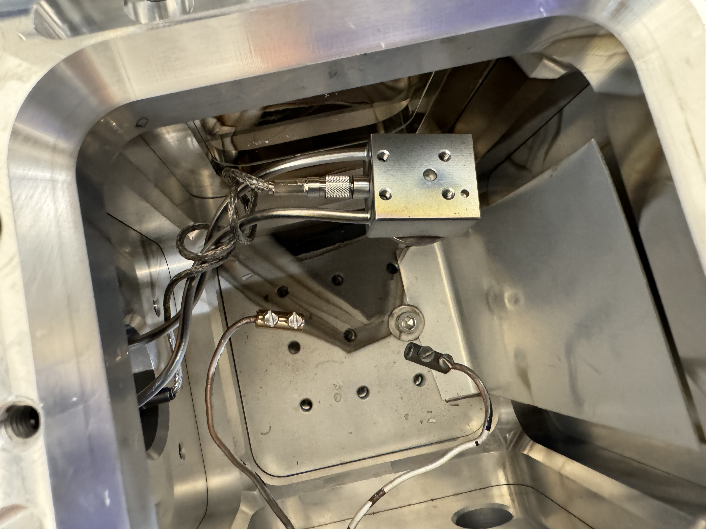

# Profilometer SOP

## Purpose

The purpose of the profilometer is to measure the roughness of a surface. Specifically, it is able to measure height differences across a region of interest (in one dimension) in the nano scale. This is useful especially after etching processes, where we can measure how much etching was performed on the chip.

The precision of this instrument is \~20-30 nm.

## Materials&#x20;

* Profilometer
* Your chip
  * If you are learning how to use the profilometer and do not have any patterns yet, you can use Chip 365 (there is a pattern on it, and it is also used in this tutorial)

<figure><figcaption>
Figure 1: Profilometer Set Up 
</figcaption></figure>

The profilometer (right) is connected to a very old computer (left). The profilometer contains a metal needle tip that is used to measure the roughness of a surface.

## Procedure

1. Place chip on stage
   * Ensure that you don't place the chip in the ridges, and this can lead to a runtime warning
2. Switch on the light on the stage, ensure that chip is under the light

<figure><figcaption>
Figure 2:  Profilometer Setup Movement
</figcaption></figure>

3. On computer, go to Display > Video to visibly see the chip. Also, select Sample Positioning in order to see where the stylus will start measuring.

<figure><figcaption>
Figure 3: Display > Video and Display > Sample Positioning
</figcaption></figure>

<figure><figcaption>
Figure 4: Display > Sample Positioning shows where the cross hair will appear
</figcaption></figure>

4. Move chip until you are able to see the cross hair being in line with the edge of your patterns.&#x20;
   * Chip can be moved using the knobs as seen in Figure 2.
   * Ensure that you don't touch/bump into the metal tip as it is very sensitive and delicate&#x20;
5. Go to Stylus > Stylus Down. This will move the stylus down to the chip and it should be aligned with the cross hair.
   * If the stylus is not aligned with the cross hair, double click on the new location where you want the cross hair to be. You will be prompted to update the cross hair location.

<figure><figcaption>
Figure 5: What you should see after Stylus Down command
</figcaption></figure>

6. Go to Run > Run Single Scan to start an experiment. The stylus will start moving.
   * If it runs into the AD conversion error, keep retrying (the error tends to go away after 5-6 times, see bottom of this document for photo)

## Results and Data Analysis

7. After the run is completed, this should be seen:

<figure><figcaption>
Figure 6: Results from Profilometer Run
</figcaption></figure>

As seen in the Figure above, we can see two "bumps", which are where we want to collect our data. However, we can also see that the graph is slanted, which means we first need to level our data.&#x20;

8. **Levelling plot:** Move the red and green vertical lines such that in between those lines, we have a relatively flat region (as seen in Figure 6). Go to Plot> Level. We should now see this:

<figure><figcaption>
Figure 7: Levelled Results from Profilometer
</figcaption></figure>

9. In order to measure the step height, drag the red and green vertical lines such that in between these lines we have the region of height difference (shown in Figure 7). The height difference is captured as Vert\_D. In this case, we an see that it is 2425 Angstroms, which translates to around 243 nm.

## Other Features

As seen in Figure 7 above, some regions are "bumpy". In order to get the average of these "bumps", one can go the Bands > Create Band and set a specific distance. For instance, in Figure 8 below, we have taken the average of 50 nm to the left and 50 nm to the right of the region of interest.&#x20;

<figure><figcaption>
Figure 8: Using Bands when analyzing data
</figcaption></figure>

## Errors that might occur&#x20;

1\) Timeout Waiting for AD Conversion

<figure><figcaption>
Figure 9: AD Conversion Error
</figcaption></figure>

This error happens very often. In order to fix this, perform multiple runs (usually around 5-6 times) until the timeout notice is no longer shown.
