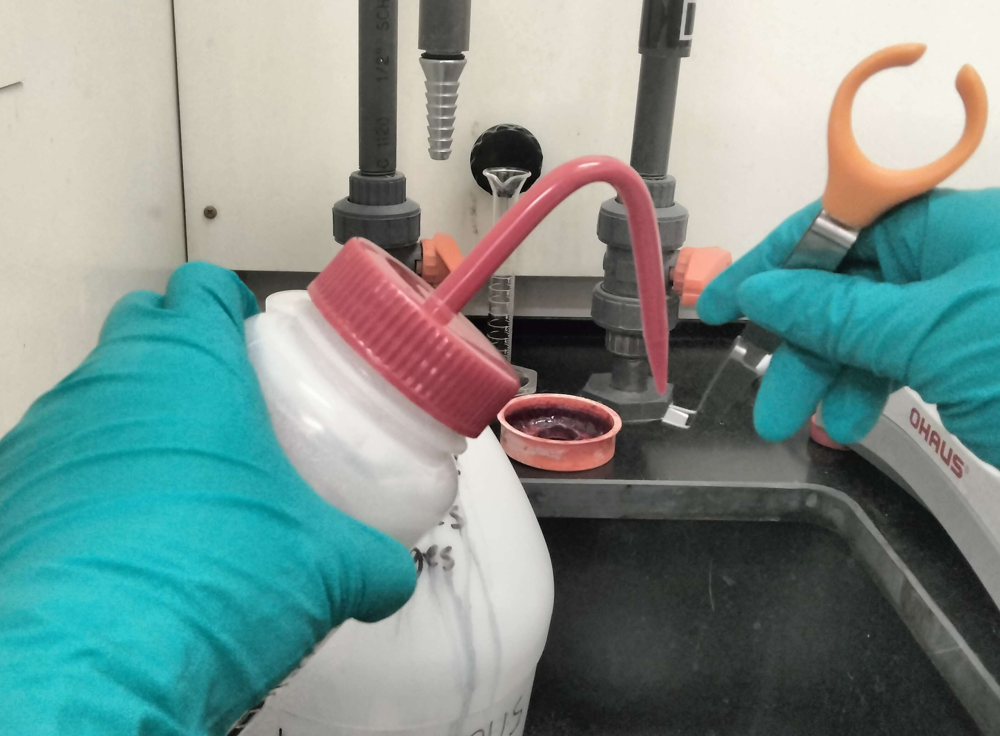
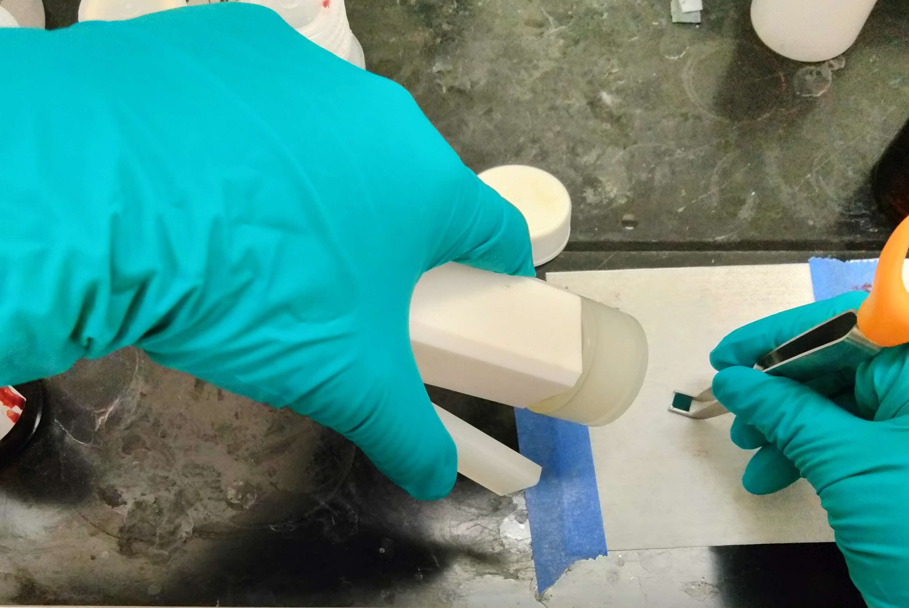
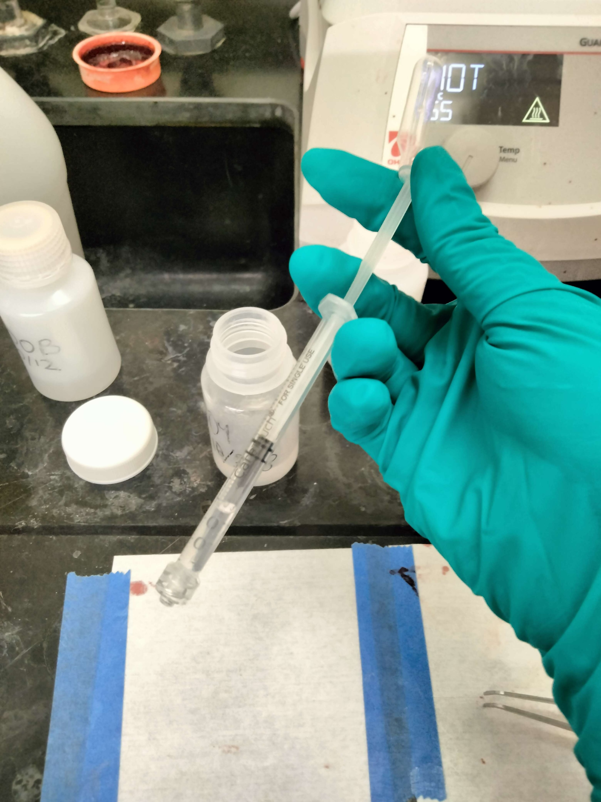
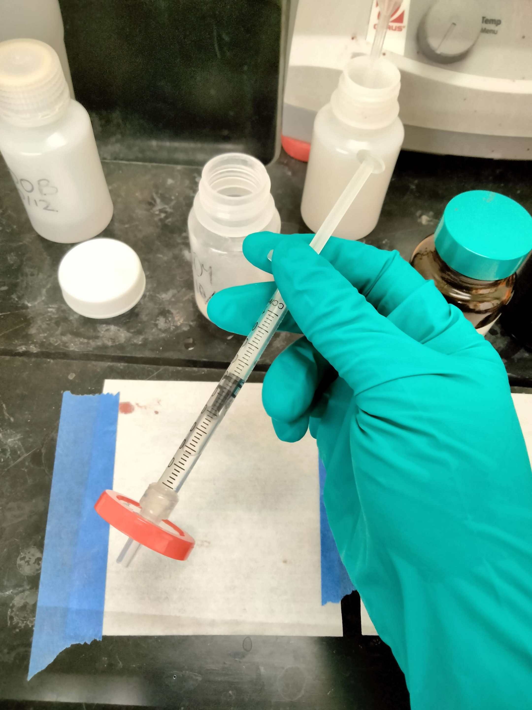

---
layout:
  title:
    visible: true
  description:
    visible: true
  tableOfContents:
    visible: true
  outline:
    visible: true
  pagination:
    visible: false
---

# Spin on Glass SOP

<figure><figcaption>
Before Spin on Glass (SOG)
</figcaption></figure>

<figure><figcaption>
After Spin on Glass (SOG)
</figcaption></figure>

## Process Parameters

***

| Total Time                                                                 | 2.5 Hours          |
| -------------------------------------------------------------------------- | ------------------ |
| Spin Speed                                                                 | 4000 rpm           |
| Spin Time                                                                  | 30s                |
| Anneal Temperature Profile \[temp 1, time 1, temp 2, time 2...] \[°C, min] | \[100, 2, 400, 30] |

#### For more detailed parameters:

[700B Process Sheet](https://docs.google.com/spreadsheets/d/1fmgTan5MyL4VjxuGR8\_-XMnE9dZDns9QorDNwK\_PFyc/edit#gid=0)

[P504 Process Sheet](https://docs.google.com/spreadsheets/u/3/d/182fEtTWk\_8xHNYmWTH\_aYQlMbS8q68xoudcD6ADTvAQ/edit?usp=drive\_web\&ouid=115587224328658053131)

***

## Purpose

700B (undoped) SOG

As seen in the cross sections above. 700B is applied after the gate etch is performed. The purpose of 700B is then to protect certain areas of the wafer from P504 during the doping process. More specifically the 700B blocks off everywhere but the active areas. This means that the 700B layer must be consistent and impermeable, so, cracks and pinholes may be detrimental to the function of the chips transistors since they could allow dopant to leak into undesired areas of the chip.&#x20;

The other purpose of the 700B is to act as a dielectric and insulate between contact areas on the chip. The resulting requirement is that the 700B layer is not conductive (which it is not)

P504 (doped glass) is doped with boron, unlike 700B. Naturally, this boron will diffuse into the silicon over time and this can be significantly sped up by heating it up in the tube furnace.&#x20;

***

## Tools

3. [Vacuum Spin Coater](../patterning-sop-stepper-v2/vacuum-spin-coater-sop.md)
4. [Hot Plate](../patterning-sop-stepper-v2/hot-plate-sop.md)

## Materials

1. Filmtronics 700B (undoped) or P504 (dopant) Spin On Glass
   1. [Storage and Preparation](spin-on-glass-storage-and-preperation.md)
2. Acetone
3. Isopropanol

***

## Procedure

### Organization

1. If you have already claimed a chip number, and opened its specific chip view data sheet, record your patterning data into that sheet. If you have NOT claimed a chip number, and have NOT begun recording data in a chip specific sheet, open this [central chip count](https://docs.google.com/spreadsheets/d/1MrqtnkHcNr5hekHpQHusBZJG4nrdcxDz7Yg5Emn9BMQ/edit#gid=0) sheet, claim the next available chip number, open the blank chip view sheet for that specific chip number and record all subsequent process data into it.

### Wafer Cleaning

1. In the fume hood, hold the wafer with tweezers over the sink.
2. Rinse the polished side of the wafer thoroughly with acetone, then isopropyl alcohol.
   1. The acetone leaves a residue that must be removed by the isopropyl alcohol rinse.
   2. If there is acetone film visible, repeat this step.
3. Blow the wafer dry with the nitrogen gun by pressing the wafer against a cleanroom wipe on the table to ensure it does not fly away. **Get a good grip on it with your tweezers**.
   1. Even when the wafer appears dry, there may still be moisture on the edges, so dry both sides liberally for \~20 seconds
4. Inspect with the naked eye and make note of any marks on the wafer.
   1. Marks present after cleaning are likely scratches that need to be documented

<figure><figcaption>
Acetone rinse
</figcaption></figure>

 

<figure><figcaption>
Drying with nitrogen gun
</figcaption></figure>

### Prebake

4. Preheat the[ Hot Plate](../patterning-sop-stepper-v2/hot-plate-sop.md) to 100°C
5. Place the wafer in the **center** of the hotplate for 20 seconds
   1. Be sure to handle the wafer with tweezers that can handle high temperatures (metal tweezers)
   2. No need to turn the hotplate off since annealing will require 100°C initially as well

<figure><figcaption>
100C hotplate with chip in the center
</figcaption></figure>

### Spin Coat

6. Place wafer onto the chuck of the [vacuum spin coater](../patterning-sop-stepper-v2/vacuum-spin-coater-sop.md)
7. Open the SOG container while keeping the bottom resting on the table
   1. Never open containers up in the air or outside of the fume hood
   2. **Ensure that the SOG container is not expired by inspecting with the naked eye. If you see floating particles of glass suspended in the liquid, this is expired SOG. See the** [**Storage and Preparation Document**](spin-on-glass-storage-and-preperation.md) **for more information.**
8. Pipette **1-2 drop** of SOG using Luer Lock filtered syringe:
   1. Take a clean syringe and draw it up \~¼ to create an air pocket in the tube
   2. Suck up SOG about halfway up the syringe. This is a lot more than you need for 1 drop, because the filter needs to be wetted by the excess solution before drops are released.
   3. Twist on a syringe filter
   4. Release 2 drops back into the SOG container
   5. Apply 1 or 2 drops to your chip, make sure the chip is completely coated in solution but do not use more than 2 drops
   6. Dump any remaining SOG in the syringe back into the SOG container
   7. Dispose of the syringe and the filter in the waste bucket

<figure><figcaption>
Pipette with SOG and air pocket
</figcaption></figure>

 

<figure><figcaption>
Pipette with filter
</figcaption></figure>

6. Spin coat the wafer <mark style="background-color:orange;">(Remember to switch on the vacuum!)</mark>
   1. After spin coating, the SOG application should appear even. (See pictures below)
7. Immediately move onto annealing

### 

### Hot Plate Annealing for 700B + P504

12. Before placing the wafer on the hot plate, use a cleanroom wipe to clean the surface of the hot plate using a small amount of acetone and IPA
13. The hot plate should already be at 100C
14. Place wafer onto the [Hot Plate](../patterning-sop-stepper-v2/hot-plate-sop.md)
    1. Be sure to handle the wafer with tweezers that can handle high temperatures
    2. Place a cover, such as a glass dish upside down, on top of the wafer to avoid contamination and air movement as the wafer is annealing
15. Follow the appropriate ramping profile (see top of this document or your own notes)
16. Ramp down temperature
    1. When baking has finished, turn off the hot plate and and do NOT remove the wafer
    2. This allows the wafer to cool at a slower rate to prevent cracking.
17. Once the hot plate cools to below 200C, it is safe to remove the wafer. (this takes at least 20 minutes to ramp down).&#x20;
    1. **Remember that the glass cover will also still be hot (although slightly less than 200C at this point). Do not burn yourself when removing the glass cover - nitrile gloves will not protect you from burns. If necessary, wait longer for the glass cover to get close to room temperature.**

### Tube Furnace Anneal/Diffusion P504

See [Tube Furnace SOP](../tube-furnace-sop.md) for details

### Inspection

See [Inspecting SOG wafers](spin-on-glass-inspection.md) document for a more detailed overview of failure conditions and possible causes.

## Safety

Be sure to work under fume hood when working with SOG. The SOG can give off toxic vapors (especially during annealing)

DO NOT touch the hot plate during operation. A 400 C hot plate will cause severe burns. (Reminder: 400 C = 752 F). The same is true of the glass cover, which is why it is important to ramp down before touching.

\

***

\
