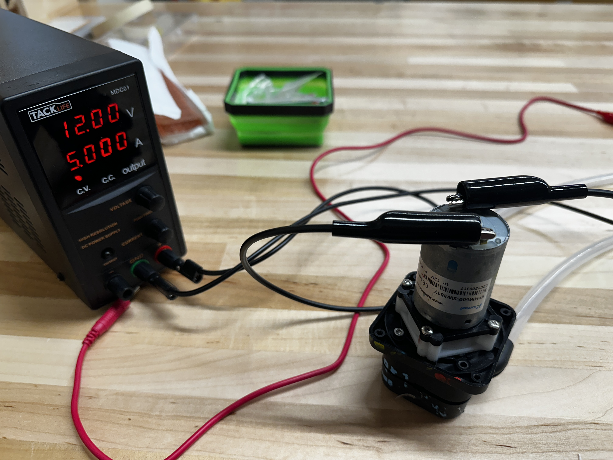
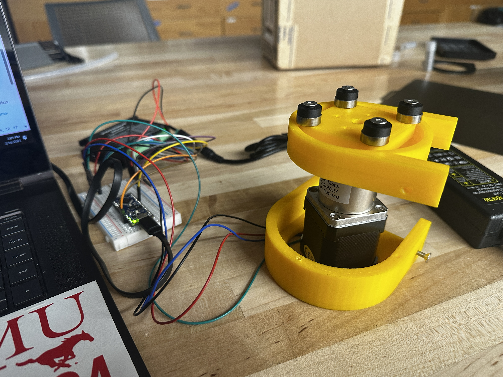

# Adwoa Asare

## Update 0

### Progress

* Researched pinch valves for new system design and suggested to the team.
* Looked into high torque motors and stepper motors with gearboxes so I can increase the torque being applied on the peristaltic pump.
* Chose a new motor to order to revamp the system.

### Roadblocks

* None. I just to need to order parts.

### Plans

* I will update the peristaltic pump 3d model to be compatible with a stepper motor that has a gear box attached.
* I will order a stepper motor that has a gear box.
* I will work on code for making the stepper motor move more smoothly.

***

## Update 1

Our project objective has changed to a single integrated design for spin coater and heating since last week. I still am working on liquid handling, but Matthew is doing the On-shape CAD for the pump instead.

### Progress

* Researched fittings & valves that work with our chemicals.
  * Polypropylene will work for most of our chemicals. It is **very compatible** with HMDS, Acetone, IPA, AZ P4210 (Photoresist). It is **likely also compatible** with Spin-on-glass 700B and P504 based on their compositions.
  * There are **fully polypropylene valves** we can use and just attach an actuator to instead of making our own valves and I think we should pursue this if it will take up less space.
* Ordered a stepper motor with gear box and the appropriate components to drive and power it.
* Worked on stepper code.

### Roadblocks

* I am waiting for the parts I ordered to arrive.

### Plans

* Meet up with Matthew and 3D print the peristaltic pump CAD from On-shape.
* Test pump functions.
* Look into how we can order the fittings and valves.

***

## Update 2

### Progress

We can order propylene fittings and valves from:

* John Guest Push-to-Connect Fittings
* Jaco Kynar Compression Tube Union Tees
* SP Bel-Art T Shaped Tubing Connectors

I worked on CAD for holding the tubes over the frames. It is parameterized and you can change the number of tubes.

<figure><figcaption></figcaption></figure>

I looked into position sensing methods for determining the location of the spin coater (ultrasonic, infrared, laser). We settled on infrared for the design.

Unrelated to automated spin coater, I investigated some ideas for Joshna regarding the automatic dicer. She brought to my attention that we could use fiber laser to cut the wafer to increase precision. The idea here is that with diamond scribing or even diamond cutting you get microcracking, microchipping, and lost material from kerf-loss. When you use laser to cut fully through a wafer there are micro warps from the melting and but not cracks and chips. You can avoid this warping by laser pulsing (see this article: [https://www.gmp.ch/htmlarea/pdf/GSI/JK100P\_app\_note.pdf](https://www.gmp.ch/htmlarea/pdf/GSI/JK100P_app_note.pdf)).&#x20;

To successfully laser cut a wafer we would need high powered lasers (100 W to 200W) depending on if we are using a fiber laser or Nd: YAG Laser. This would cost thousands of dollars just for the appropriate laser, so I don't think it will be worth it for our purposes. Also, a fume hood is not proper ventilation for laser cutting a wafer, so we would need to make a ventilation solution as well.&#x20;

We could get a weaker and cheaper laser and only use it for wafer scribing (in which case we would still separate the wafer using clean cut pliers). However, I think this would still result in kerf-loss. I think for our purposes (1 cm \* 1 cm chips), diamond scribing is good enough especially for a V1, but I would be curios to hear what other's think.

### Roadblocks

* The pump CAD was not finished this week, and our motor did not arrive yet.


### Plans

* I am working on a CAD to hold the heat gun, should be done by EOD Monday.
* Work on presentation and assembly with team.
* Hopefully motor will be here. If it is, Matthew and I will test the pump.


***

## Update 3

### Progress

* Found a peristaltic pump in Ideate, took it apart and reconstructed it with our tubing. I haven't gotten it to work yet, so I will trouble shoot it to see if the motor even works.
*

    <figure><figcaption></figcaption></figure>
* 3D printed, built, and tested custom peristaltic pump with Matthew. Took a while to debug but it works, need to test with water now. Wired Nema 17 with 27:1 gear box to motor controller and an Arduino Nano Every and a 24 volt power supply.
*

    <figure><figcaption></figcaption></figure>
* Finished CAD for holding heat gun with set screws.
*

    <figure><figcaption></figcaption></figure>

### Roadblocks

* Custom peristaltic pump switches directions when I increase the speed too much, so I need to investigate the limits so we can have predictable operation.

### Plans

* Test peristaltic pump with water
* Electrical diagram
* Demo 1 Presentation

***

## Update 4


### Progress

* New code that should allow us to switch from Arduino Nano to Raspberry Pi for pump controls


````
```python
#install RpiMotorLib https://github.com/gavinlyonsrepo/RpiMotorLib
#sudo sudo pip3 install RpiMotorLib

'''
Will need to test if DM320T is compatible w/ RpiMotorLib. Adjust certain parameters.
pulse width = 0.003 (3ms)
delay = 0.05 (50ms)
signal level is typically 5V but see if RPi 3.3V is enough
'''

from time import sleep
from RPi import GPIO
from RpiMotorLib import RpiMotorLib

# Define GPIO pins
DIR_PIN = 20
STEP_PIN = 21
ENABLE_PIN = 16
BUTTON_PIN = 18

# Set up GPIO
GPIO.setmode(GPIO.BCM)
GPIO.setup(ENABLE_PIN, GPIO.OUT)
GPIO.setup(BUTTON_PIN, GPIO.IN, pull_up_down=GPIO.PUD_UP)  # Configure button with pull-up resistor

# Create an instance of RpiMotorLib
stepper = RpiMotorLib.A4988Nema(DIR_PIN, STEP_PIN, (21, 21, 21), "DRV8825")

# Enable the motor
GPIO.output(ENABLE_PIN, GPIO.LOW)

try:
    while True:
        # Wait for button press
        button_state = GPIO.input(BUTTON_PIN)
        if button_state == GPIO.LOW:  # Button pressed
            # Move the motor with adjusted delay for pulse width
            #True = clockwise, False = counter-clockwise
            #Full = full step mode
            #200 = steps
            stepper.motor_go(True, "Full", 200, .003, False, .05)  # Adjusted delay for DM320T
            
            # Wait before accepting another button press
            sleep(0.5)

except KeyboardInterrupt:
    pass

# Disable the motor
GPIO.output(ENABLE_PIN, GPIO.HIGH)

# Clean up GPIO
GPIO.cleanup()

```
````

* Electrical Diagram

### Roadblocks

* None really, but I think we should discuss our design based on the feedback from peers during demos. Specifically, about the why not just elevate the liquid containers and let gravity do the work while we open and close a valve? Although we may need specific flow rate control for things like a wash station, that is needed for Automated Spin Coater, so we could be able to really simplify things.


### Plans

* Also, our motor drivers may or not be compatible with the RPi library I found. I will test this week.
* Depending on how much there is for me to do on ASC, I may start working on Auto Cleaver more, I want to CAD a design for it soon.

***

## Update 5

3/16/2025

### Progress

* Tested peristaltic pump with water. It was able to turn but the rollers were too small so it could not push the water
* Made bigger rollers to better squeeze the tube. I reassembled and retested.
  * the rollers could no longer spin, at first, I thought it was because the tube was too hard to squeeze but further testing & analysis showed that it was actually the lid clamping down on the rollers making them unable to move. (see pic below) It is able to spin when you lift the lit a little.
  *

      <figure><figcaption></figcaption></figure>
* So, I went back to our initial pump design on fusion360 since the rollers on that design are free spinning and edited to fit with the gear box on the Nema17. I will reprint and test this first thing this week to get final idea of if persitaltic pump can work or not.
* For automated dicer, I did some research into actuators that would be appropriate for moving the scribe tip up and down, landed on just doing simple rotation with a servo like they do in this ruling machine.
  *

      <figure><figcaption></figcaption></figure>

### Roadblocks

* waiting for some parts to make frame for auto dicer

### Plans

* reprint peristaltic pump so the rollers fit in under the lid properly and can free-spin
* make any necessary modifications to the motor & idler holders needed to make sure it fits with our frame
* CAD holder/actuator for the scribe point.

***
