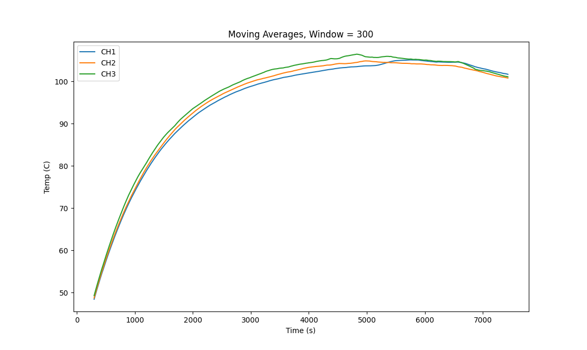

# Alex Echols

## Update 10 (04/06/2025)

### Progress Updates

* Substrate Heater Characterization

I am making progress on the substrate heater characterization and am going to quickly summarize the testing plan, the expected results, and how the results are shaping up in reality.

#### Motivation

We wish to understand the operating characteristics of the substrate heater, with key results that we are looking for being:

* If we wish to achieve a specific temperature on the surface, what input voltage/current should we supply?
* What is the maximum temperature that the heater can safely operate at?
* What is the maximum rate of change of temperature that the heater can safely withstand?
* When initially testing the heater using Boron Nitride as an insulator, the disks cracked. Why did this occur and how can we prevent it from occurring again?

#### Methodology

A combination of experimental and computational methodologies are used. Transient thermal and structural simulations are done in ANSYS to determine the maximum thermal loading conditions for our current iteration of the heater plate. These results are then back converted to real world voltage inputs for use by the controls system.&#x20;

Simulation Methodology

Because ANSYS simulations are not the absolute cheapest to run, we want to minimize the amount of runtime that will need to be completed. This requires an expectation of our results, particularly how we might expect the thermal stresses to change with time, for a given simulation run.

There are two primary failure modes that we are considering:

1. Static thermal stress induced failure

This mode is primarily caused by the differences in thermal expansion coefficients of the various materials of the system. As the entire heater is warmed, we expect some amount of stress formation, regardless of differences in local thermal profile. Since this behavior can be adequately described in the time limit (when the heater has reached steady state), I will refer to this as the "static" mode of failure. This mode determines the maximum operating temperature of the device.

<figure><figcaption>
Static thermal stress diagram. Depending on the CTEs of the materials, the AlN may expand more than the Al.
</figcaption></figure>

2. Dynamic thermal stress induced failure

This mode is primarily caused by differences in the local temperature distributions within the insulator material.&#x20;

<figure><figcaption>
Dynamic thermal stress diagram.
</figcaption></figure>

Because the relative lack of expansion of the "cold zone" with respect to the "hot zone", thermal stresses build up on the interface. This can then induce crack formation and propagation. This mode can only be described by short-timescale dynamic behavior, as it is concerned with the time dependence of temperature.

An important note on both modes is that we expect the initial stress to be zero at room temperature because this is where the heater is being assembled. Based on this, we can create very rough guesses at the trends of the transient thermal behavior of our heater.

<figure><figcaption>
Potential maximum stress vs time for the AlN insulator disk.
</figcaption></figure>

In red, we see a system which is largely dominated by the static failure mode. This would asymptotically increase in maximum stress as time increases. Though we cannot evaluate the stress at infinite time, we can make estimates of the true maximum stress based on the plots we can generate. In blue, we see a system which is largely dominated by the dynamic failure mode. The maximum thermal stress quickly increases as time increases, and then settles back down once the system begins to equilibriate.

#### Current Results

One of the main things that I have focused on to this point is understanding what the expected failure mode is. Because the magnitude of the dynamic stresses will be proportional to the input heat flux, we can assume that the timescale of the peak dynamic stress will be on the order of the timescale that it takes for the wire to fully heat up from ambient. I took both experimental data and simulated data on the temperature of the wire based on input parameter.&#x20;

In ANSYS, I am modeling the wire using a constant heat flux per unit volume, which seems like a reasonable model for a resistive heating element. A simple assumption of 100% of the input power being converted to output heat indicates that we would expect \~1E8 W/m^3 of internal heat generation based on the power draw of our wire and its size. This turns out to be incorrect, but is relatively similar as seen below.

<figure><figcaption></figcaption></figure>

Because the purpose of the simulation is to just get a rough idea of the maximum operating parameters, I feel that applying a constant scaling factor is appropriate to calculate internal heat generation from input voltage. Here is the same data, scaled based on the ratio of the slopes of the lines of best fit:

<figure><figcaption></figcaption></figure>

&#x20;This data will be useful later when back-converting the simulated data to real control data.

On the timescale side, I was able to measure the time to steady state (for the nichrome wire) using the same data. The following plot shows the general trend, which is that as the internal heat generation increases, we expect a decrease in the time to reach steady state.

<figure><figcaption></figcaption></figure>

Using this data, I can then tune simulations to run for lengths which are based on the equilibration time, saving runtime and allowing the gathering of useful data.

### Roadblocks

* As a member of S'n'S, carnival tends to be extremely busy for me. I was less able to get work done this week because of the amount of time I was spending on the carnival production.

### Plans

* Monday I have a relatively high amount of free time and am planning to basically run simulations whenever I can, now that the relevant timescales are understood. My current plan is to run a simulation at 1e8 W/m^3 for 5 (simulated) minutes and measure the stresses. I will continue increasing (or decreasing) the input until I find an upper and lower bound for the cracking, and then I can basically do a binary search to get within some margin of error.
* Over the weekend I found out that I can actually run multiple jobs on multiple computers in the simulation labs, so I am also planning to run steady-state thermal and structural simulations to quantify the static stresses and determine a maximum from that. This is unfortunately always going to be an overestimate, but will at least provide some guidance on ballparking the upper and lowerbounds mentioned above.

## Update 9 (03/30/2025)

### Progress Updates

* Substrate Heater Simulation

I was able to continue my simulation efforts on the ANSYS hall computers which gives much faster times than what I could achieve on my computer (shoutout to James for the suggestion). I am currently running into an issue with memory on the computer (simulations on the relevant timescales are \~100 GB) when trying to load the thermal data into a structural simulation. Regardless, based on the thermal expansion after 1 hour of running, I can pretty conclusively determine that the cause of the Boron Nitride cracking was thermal stress concentrations around the screws. The particular BN disk that we were using was pressed into shape out of powder, so was relatively weak in the lateral direction, and the area of maximum thermal stress was at the screw holes, which caused crack formation and subsequent failure. I do not believe that the Aluminum Nitride is at risk of this same failure mode, largely due to the lack of holes. Because we chose a disk which is 4" in diameter, which fits inside of the screws with a bit of wiggle room, the stresses caused in the lateral direction are fairly minimal when compared to those experienced by the BN.

I plan to continue my simulation efforts, but will be focusing more heavily on running the actual heater (once I get it hooked up again), as I do not feel concerned about the same failure mode. My suspicion based on some back of the napkin math is that we are not at risk of cracking the AlN in our temperature ranges, and will instead be constrained by our power supply.

* O-Ring Replacement

The new Aflas O-Rings arrived on 3/25. During the lab session that evening, I took apart the chamber, cleaned all of the sealing faces with IPA, and replaced the O-Rings with the Aflas ones. The latter half of the week was focused on confirming the quality of the chamber seals and ensuring the compatibility of all vacuum facing components. The Aflas seems to be sealing much better than the Viton, though I suspect that cleaning the sealing faces has something to do with it. Currently, with the pump running, the chamber reaches \~12 mTorr, and closing the throttle valve completely seals the chamber at pressure, with a leak rate of \~0.6 mTorr/min. It is worth noting that turning off the pump and venting the bellows does not allow the chamber to hold pressure. I believe that this is caused by improper orientation of the butterfly valve with respect to the pressure differential, the current arrangement would have the high pressure region pushing the O-Ring toward the chamber, away from the sealing surface. I will try flipping it around on Monday, but based on conversations with Viswesh, I feel like it may not matter all that much.

### Roadblocks

* Nothing solvable to report. It takes a while to run simulations and I don't have a ton of time to sit in ANSYS and babysit the computer, but I also think that we should be able to draw some useful conclusions from even very limited data.

### Plans

* Finish hooking up the substrate heater (had to be removed to replace the seals). The thermocouple is attached, so it's just the power lines now.
* Continue analyzing the thermal sim data. Ideally, I will be able to draw some conclusions by the end of the week, but I am very busy with carnival things so I feel slightly unsure about my ability to commit a ton of time to it.

## Update 8 (03/23/2025)

### Progress Updates

* Substrate Heater Simulation

<figure><figcaption>
Heatmap of the AlN before reaching temperature
</figcaption></figure>

I was able to get a transient thermal simulation of the substrate heater running in ANSYS (thanks CMU). So far I have been unable to export the spatial data to analyze the thermal stresses, but it's pretty clear that the process is limited by the heat flux out of the wire. Due to this, we see that the wire inside the heater is relatively similar in temperature to the rest of the heater, while the segments of wire that extend out of the heater are relatively hot, creating a region of very high local stress where the wire leaves the heater. This would explain the cracking that we saw for the Boron Nitride. Once I can export the data (hopefully tonight or tomorrow), I'll be able to analyze the peak thermal stress and figure out our maximum operating parameters for the heater.

I will be validating that the data follows the correct trends based on experimental data, as some of my other simulation attempts this week have given unsatisfactory results. Once we know that the data is relatively trustworthy, it may also give a good insight into the surface temperature uniformity without having to take much more data.

* Substrate Heater Characterization

I've taken more data on the heater, this time at 5.5V. I haven't gotten a chance to do much analysis yet, but it should be helpful to add to the V vs T trend.

### Roadblocks

* I was unexpectedly extremely busy with school work this week so have not had much chance to actually do work, especially sitting in the lab taking data.

### Plans

* I think that I am very close to getting the simulation data that I need, which will then let me not only report the maximum operating parameters of the heater but also create a much more rigorous plan for testing V/T relationships and be able to create an ideal heating curve.

## Update 7 (03/16/2025)

### Progress Updates

* Aluminum extrusion stand is built!!!

<figure><figcaption>
Chamber and Precursor Delivery on the ALD Stand
</figcaption></figure>

Since the aluminum extrusion came in over spring break, I was able to tap the holes and construct the stand. I also 3D printed the mounting brackets for the chamber, so on the chamber side of things, the mounting is done.

* Chamber reaches pressure

I tested a few things to get the chamber to hold pressure:

1. Tighten all of the bolts on the chamber, recording change in leak rate after each one. This did not change anything
2. Remove and examine all centering rings for flaws. Aside from some dust, there were none.
3. Clean the door seal. As mentioned via discord, there was a hair between the face and the seal, creating a small leak path. This allowed the chamber to reach pressure!!

Currently the chamber can reach pressure, but holds it rather poorly. We are targeting a pressure loss rate of 0.5 mTorr per minute or lower, though currently we are losing \~6 mTorr per minute. I am hoping that cleaning the seals and sealing surfaces will lower this rate, but I have been waiting for the new O-rings before doing that, as I don't think it's a good use of time to take it apart and reassemble it when it will need to be done again shortly.

Besides getting the current seals functioning well enough for now, I also sourced and ordered new Alfas O-Rings for all sealing surfaces:

| Part No. / Description       |
| ---------------------------- |
| Aflas-268 O-Ring (L1000-268) |
| Aflas-314 O-Ring (L1000-314) |
| Aflas-320 O-ring (L1000-320) |
| Aflas-208 O-Ring (L1000-208) |

* Substrate heater testing is going well

<figure><figcaption>
Substrate heater uniformity probe points
</figcaption></figure>

<figure><figcaption>
Uniformity test data (in atmosphere)
</figcaption></figure>

I worked on profiling the substrate heater, both uniformity and the voltage/temperature relationship. Above is a plot of a run in atmosphere, measuring the difference in temperature between various points on the surface. We see divergence as the temperature increases (this is expected, the points directly above the heating element will be hotter initially), but that once the temperature levels out, we see a convergence. Based on this trial, I estimate that leaving the heater running for approximately an hour after reaching temperature will be sufficient to allow the surface to even out. An important note is that the convective losses are very high for this system, meaning that it is very likely that the surface temperature profile will be different in vacuum. Since we only have one feedthrough for a thermocouple, testing this will be difficult. I am currently planning on doing independent trials with the probe location changing, the assumption being that the data will be able to be combined as if it were done in a single trial.

<figure><figcaption>
Measured probe temperature and fit exponential functions
</figcaption></figure>

I have also been working on the voltage responses (in vacuum). I have currently taken data at 5v and 6v, and fit exponential functions to the data (an exponential function is the expectation for a fixed heater temperature). I will be taking more data to establish a trend for the initial heating rate, time to temperature, and the reached temperature. All of these tests were done with the newly acquired AlN plates, which have been working great so far!

### Roadblocks

* None to report

### Plans

* Continue profiling the substrate heater
  * The main issue at the moment is that I need to take data for several hours at a time, meaning that I need stretches where I can be in the lab or leave my computer in there (I feel better about leaving the heater now that we know it works and it's fully enclosed in the vacuum chamber at pressure). I was wondering if there would be a way to set up the mini PC to work as a datalogger in place of my computer? The software that comes with the thermocouple logger only works on windows, and I put a bit of time into examining the serial data to try to communicate directly with the device but did not have much luck.
  * I plan to run trials at 4V, 4.5V, 5.5V, 6.5V, and 7V to get an idea of the voltage relationship and then 2 trials at 4 locations on the heater surface for a total of 8 additional uniformity tests. The idea is to get multiple runs at each location to get some sense of the variance between runs which will hopefully be quite low.
* If the O-Rings come in (doubtful this week), I will tear down the chamber and rebuild it with the new parts. This will hopefully happen the week of the 24th instead (based on shipping times).

## Update 6 (03/02/2025)

### Progress Updates

* Ordered AlN Parts

Not much to update here, options for the Aluminum Nitride disks were ordered from both amazon (cheaper but potentially less viable option) and Heeger Materials. Ideally it will be possible to construct the new heater module after spring break. The Techspark waterjet will be down for a while, so the plan to re-cut the heater plates may need to be sidelined. I will also be working on a version which can be manually cut on a bandsaw and drill press.

* Vacuum Pressure Test

The line from the chamber to the pump was constructed and the chamber was pumped down to check if it can reach pressure. Our target is \~20 mTorr, though the meter only reads down to 50 mTorr, so that is our target for the test. Unfortunately, the test only made it down to 58.9 mTorr (overnight), and after tightening bolts, a second test was run and did not perform better. Debugging is in progress.

&#x20;

<figure><figcaption></figcaption></figure>

<figure><figcaption></figcaption></figure>

### Roadblocks

* The Techspark waterjet will be broken for "a very long time". This is unfortunate and we should move forward as if it is not an option for us.

### Plans

* Clean up my documentation for midsemester
* Redesign chamber/stand brackets to be 3D printed (no waterjet)
* Test AlN performance with sputtering disk

## Update 5 (02/23/2025)

### Progress Updates

* Sourced Aluminum Nitride plates as a replacement for the Boron Nitride disks (which are cracking)

To lower costs, relative to getting a part custom made, the aluminum nitride is being sourced as a solid disk which will fit between the screws.&#x20;

<figure><figcaption>
Proposed disk size (4")
</figcaption></figure>

I received several quotes for 4" x 0.1" AlN disks. The cheapest option was from [Heeger Materials](https://heegermaterials.com/aluminum-nitride-aln-products/1914-aluminum-nitride-aln-ceramic-substrate.html), at $440. These disks would be a relatively simple, drop-in replacement for the current BN disks. A potentially cheaper alternative is these [AlN sheets from Amazon](https://a.co/d/5kcxq4Z). These sheets are comparatively quite thin, and due to their square shape, would likely require a modification to the structural plates. This could coincide with creating a new plate to mount the QCM.&#x20;

I am concerned about the amount of wasted effort that continuing to profile the substrate heater using BN disks (considering that we are moving away from them). I briefly spoke to Jay on Friday (02/21) and it seems that the sputtering team has an extra 2.5" diameter AlN disk which could be used for profiling. In particular, determining the equilibration time should be possible with the smaller disk, as long as the wire spacing is the same. I will continue to communicate the the sputtering team, and see if I can create a small test setup to profile uniformity before the custom disks arrive.

* Finalized ALD stand dimensions and ordered components

This is following up on the work done last week, but the dimensions and interactions of the precursor delivery and the chamber were finalized, meaning that the stand itself had its dimensions finalized. All parts have been ordered, and if they arrive by the end of the week, I can assemble the stand. If not, it can be a first priority after break, as it will be quite useful to have and should not be difficult.

* Substrate heater is mounted in the chamber!!!

Oops, I forgot to take a picture :( BUT the heater is mounted and fits well (as in the CAD) in the chamber!!! It seems that I made a minor error in my part dimensions and the center of the heater is about 0.5" off center relative to the chamber. This can be fixed in V2 of the heater or just ignored because it likely will not functionally change the device at all. The CAD has been updated so that if anyone plans to make a similar device in the future, they will not have this issue.

### Roadblocks

* The Techspark waterjet is broken again. I don't think that we will incur a ton of lost time to this, but it may cause problems with cutting the mounting brackets for the stand (I went to cut them earlier in the week and was unable to).
* Aluminum Nitride lead times are very long. I am working on getting a finalized quote from Heeger Materials Inc. to move forward into the purchasing phase.
* Not exactly a roadblock, but this week was quite busy for me including the presentations so I have not made as much progress as I would have liked to.

### Plans

* I am pretty sure that we now have all of the components to assemble the line from the chamber to the pump. Because of this, I am going to begin setting up a temporary stand (before the real stand parts arrive) and beginning pump down tests. Hopefully this can move into the Aflas testing later in the week.
* Substrate heater? I mention this above but would love to talk about it during the ALD team meeting on 02/24

## Update 4 (02/16/2025)

### Progress Updates

* Updated substrate heater testing plans

I continued to test the substrate heater this week, with an updated testing plan following the ALD project meeting on Monday, 2/10. Instead of focusing on generating a heatmap of the entire heater surface, the new testing methodology aims to profile the time it will take the substrate heater to reach steady state given a desired temperature.

#### Methodology

1. Tape 2 of the thermocouples to the substrate heater, using the rough placement of the heating element as a guide. One thermocouple should be approximately over the heating wire, while another should be approximately centered in the largest gap in the heating element. The 0.5" grid as marked in the previous procedure provides a good way to record where the measurements were taken.&#x20;
2. Run datalogging for the two surface thermocouples and the center (reference) thermocouple for a given voltage. I started at 5V, aiming to prevent the cracking issues that happened last week. Gradually ramp up the voltage over the course of the run (I incremented in 1.5V increments every 20 minutes)&#x20;
3. Note difference between the reference point and each of the test points, as well as the difference between the two test points. A K-Type thermocouple only has an accuracy of  ±2.2 C, and they are highly sensitive to the quality of contact with the surface.

Based on my testing, I feel that the Boron Nitride disks which we are using are not suitable for our purposes, partly due to cracking concerns, and partly due to low thermal conductivity. Jay suggested the use of Aluminum Nitride instead, which seems to fit our criteria a bit better. I reached out to a few vendors regarding custom AlN disks, but have not heard back yet.

* Updated CAD for QCM mount

Though it was agreed both in our team meeting on 2/10, and when speaking to Matt on 2/11 that the QCM is not necessary for the initial deposition, I still feel that it is necessary to properly design the chamber such that it can be easily retrofitted.&#x20;

<figure><figcaption>
Chamber CAD with QCM mount
</figcaption></figure>

The only change which effects the current design revision is the movement of the substrate heater mount from the back face of the chamber to the left face of the chamber (when looking from the front). This should not change the chamber mechanics at all, and is mainly necessary to allow the precursor delivery system to sit close to the chamber, without needing to move if the QCM is added in the future.

The QCM mount itself uses a CF 2.75" to KF40 adapter as mentioned in my previous update, and simply mounts to a replacement backplate which accepts a KF40 flange. The KF40 fitting is the smallest KF style flange which can adequately accommodate the QCM mount when building the device. The CAD model shows a collision between the substrate heater mount and the QCM mount, but this will not be an issue in reality, as we can bend the QCM mount to line up with the surface of the substrate heater. It may also be worthwhile to consider redesigning the substrate heater to mount directly to the QCM mount, simply so that the QCM will be known to be at the same temperature as the heater.

* ALD stand is designed\*\*

\*\* Waiting for final approval from James regarding the precursor delivery

<figure><figcaption>
ALD Chamber on ALD Stand. Precursor delivery not pictured.
</figcaption></figure>

There isn't a ton to say on this front, as the design is relatively simple: an Al extrusion frame with some custom sheet metal brackets to mount to the chamber itself. We should be able to cut the mounting brackets in techspark, but will need to order the extrusion and corner brackets. Once the precursor delivery design is sorted out, we can do a final design review and place part orders. Construction itself should not take more than a couple of hours at most.

### Roadblocks

* Not exactly a roadblock, but reconsidering the Boron Nitride this late into development is certainly far from ideal. I am working on some code to simulate the thermal performance of the device which can hopefully be used to inform design decisions, including whether or not to change the insulator material.
* Awaiting approval from James regarding stand dimensions

### Plans

* Analyze trial data for substrate heater uniformity
* Research alternative substrate heater designs, including part lead time and sourcing
* Finalize stand dimensions and order parts

## Update 3 (02/09/2025)

### Progress Updates

* Constructed\*\* substrate heater and began uniformity characterization

\*\* The hardware used (i.e. screws, nuts, washers) is not the same as those that will be used for the final assembly, but it should not make a significant difference for the tests that we are doing

I was able to cut the top and bottom sheets for the substrate heater on the Techspark waterjet, and complete all of the required post-processing steps. By Thursday (2/6) I was able to begin testing on the fully assembled substrate heater.

<figure><figcaption>
Full test setup with power supply, datalogger, and heater
</figcaption></figure>

<figure><figcaption>
Heater with grid and thermocouples during a measurement
</figcaption></figure>

As detailed in my project proposal, temperature readings are being taken on 0.5" intervals across the heater surface. I am also measuring the temperature at the "main" thermocouple (the one which will be in the final assembly) as a point of comparison. Due to the length of the testing, I was not able to do more than one run, but this week I will continue this testing and hopefully finish by Friday. Due to long test times, I have slightly revised my testing procedure from that in the project proposal:

#### Setup

1. Draw a 0.5" grid on the heater surface, using the center of the disk as the origin. Ideally this grid lines up with the direction of the heating wire "zig-zags".
2. Ensure that the datalogger is working for all four probes. My initial test plan involved an arduino being used for datalogging, but my tests are being conducted using a [THE-373](https://gainexpress-dealer.com/products/the-373) thermometer for simplicity.

#### Trial

1. Tape 3 of the thermocouples to points on the grid and record their positions (#4 is the center of the grid). Kapton tape or a similarly rated adhesive should be used. Electrical tape is pictured above and is not suitable.
2. Turn on datalogging and power supply (7V, constant voltage mode) for 20 minutes. The heater will reach approximately 100C by this time, which is lower than our operating temperatures, but should be suitable to notice any differences in the heating curves over time.
3. Turn off the power supply and allow the heater to cool down to room temperature. This will take approximately 50 minutes.
4. Move thermocouples to a new location and test again. Due to the long duration of each test trial (\~70 minutes), it is likely not advisable to probe at every single point on the surface of the heater. 1-2 trails per quadrant should be sufficient to notice any problem areas, assuming that the thermocouples are evenly spaced.

#### Analysis

This is still WIP, but my current notes are:

* Temperatures at each probe point should be compared to the center thermocouple. This is a better choice than comparing to mean temperature or similar because we will eventually be using the thermocouple at the center of the heater as the sole point of measurement, so the uniformity matters relative to that point.
* It is important to remember that K-type thermocouples (used here) have an accuracy of ±2.2 C, so any deviations within that range are not reason for concern. At the maximum operating temperature of our heater (600 C), this goes up to ±4.5 C

***

* Researched passthroughs for QCM and substrate heater

#### Substrate Heater

The substrate heater requires lines for power and the center thermocouple. We have two primary options for these needs, either use two seperate feedthroughs for power and the thermocouples or use a single power + thermocouple feedthrough. Upon examining prices, it is apparent that it is much more economical to purchase a single power + thermocouple feedthrough, and many vendors sell feedthroughs which are rated for our power needs.

| Vendor         | Price   | Lead Time                                               | Link                                                                                                                                                 |
| -------------- | ------- | ------------------------------------------------------- | ---------------------------------------------------------------------------------------------------------------------------------------------------- |
| IdealVac       | $465.26 | Ships Now                                               | [IdealVac P108066](https://www.idealvac.com/en-us/Electrical-Thermocouple-and-Power-Feedthrough-Type-K-5KV-30A-UHV-Rated-118-in-dia-KF16/pp/P108066) |
| Kurt J. Lesker | $315.00 | KJLC will contact you                                   | [KJL TFT1KY2N308](https://www.lesker.com/feedthroughs/thermocouple-feedthroughs-typek-miniplugpower-singleend/part/tft1ky2c308)                      |
| MDC Precision  | $321.00 | 6 weeks                                                 | [MDC 9393015](https://www.mdcprecision.com/9393015-thermocouple-powerfeedthrough-typek-1pair-5kv-30amps-k075-nw16-kwik-flangeisokf-quickflange)      |
| Allectra       | $301.37 | On Request (I emailed but have not received a response) | [Allectra 263-TCK-1-CU30-2-K16](https://www.allectra.com/products/263-tck-1-cu30-2-k16/)                                                             |

My recommendation for our project is to order from IdealVac, simply due to lead times. The other products on this list should be equivalent and could be ordered by another fab looking to replicate our device. Since we are concerned with getting the chamber working by spring break, purchasing the only option which we know can ship now makes the most sense to me.

#### QCM Passthrough

I am in the process of speaking to Matt about options for this sensor. Options for mounts/passthroughs are summarized [here](https://docs.google.com/document/d/1vYA7lyjGNZSNSQZndPqWmFKoCta1pJbzlKMnsrJxT94/edit?tab=t.0#heading=h.tuhjetsx3rhg).

While talking to Matt, we discussed the idea of either directly connecting a CF 2.75" flange to the chamber, or using a KF40 to CF 2.75" adapter to allow the sensor mounts to connect to the chamber. I did some quick cost analysis and it seems that both options are roughly price equivalent.

**CF on Chamber (No Adapter) | Total Cost (Est.): $1,329.47**

<table><thead><tr><th width="268">Item</th><th>Qty</th><th>Cost (Est.)</th><th>Source</th></tr></thead><tbody><tr><td>IdealVac 9x9 Plate (CF 2.75)</td><td>1</td><td>$258.15</td><td><a href="https://www.idealvac.com/en-us/Ideal-Vacuum-Cube-9-x-9-Vacuum-Chamber-Plate-With-One-Conflat-CF-275-in-Port/pp/P1010678">IdealVac</a></td></tr><tr><td>Aflas Sheet</td><td>1</td><td>$39.03</td><td><a href="https://www.mcmaster.com/5499T14/">McMaster</a></td></tr><tr><td>Gasket Cutter</td><td>1</td><td>$32.29</td><td><a href="https://www.mcmaster.com/36795A11/">McMaster</a></td></tr><tr><td>Sensor/Passthrough Assembly</td><td>1</td><td>$1,000.00</td><td>INFICON</td></tr></tbody></table>

**KF on Chamber (Adapter) | Total Cost (Est.): $1,396.90**

<table><thead><tr><th width="270">Item</th><th>Qty</th><th>Cost (Est.)</th><th>Source</th></tr></thead><tbody><tr><td>IdealVac 9x9 Plate (KF40)</td><td>1</td><td>$210.70</td><td><a href="https://www.idealvac.com/en-us/Ideal-Vacuum-Cube-9-x-9-Vacuum-Chamber-Plate-With-One-KF-40-(NW-40)-Port/pp/P109594">IdealVac</a></td></tr><tr><td>KF40 Centering Ring</td><td>1</td><td>$10.05</td><td><a href="https://www.lesker.com/newweb/flanges/hardware_kf_centeringrings.cfm?pgid=al">Kurt J Lesker</a></td></tr><tr><td>KF40 Bulkead Clamp</td><td>1</td><td>$36.10</td><td><a href="https://www.lesker.com/newweb/flanges/hardware_kf_clamps_bulkhead.cfm?pgid=al">Kurt J Lesker</a></td></tr><tr><td>KF40 to CF 2.75 Adapter</td><td>1</td><td>$105.65</td><td><a href="https://www.lesker.com/newweb/flanges/adapters_flanged_1.cfm?pgid=cfkf">Kurt J Lesker</a></td></tr><tr><td>Copper Gasket</td><td>1</td><td>$34.40</td><td><a href="https://www.lesker.com/newweb/flanges/hardware_cf_gaskets.cfm?pgid=ofhc">Kurt J Lesker</a></td></tr><tr><td>Sensor/Passthrough Assembly</td><td>1</td><td>$1,000.00</td><td>INFICON</td></tr></tbody></table>

### Roadblocks

* Not exactly a roadblock, but the Boron Nitride disks cracked during the initial testing of the heater. I will be looking into potential causes for this and potentially thinking of other options
* The heater testing takes much longer than I expected per trial, but I have planned around this as mentioned above. I will take measurements on a limited subset of points rather than all (49) points on the grid

### Plans

* Finish substrate heater uniformity testing and gather/analyze data
* Finalize feedthrough plans and order them ASAP. Matt is currently not responding to my email, but I will follow up with him on Tuesday if he has not responded by then
* Look into the Boron Nitride cracking

## Update 2 (02/02/2025)

### Progress Updates

#### Chamber Exhaust Part Sourcing

* Created CAD of the ALD chamber and the chamber to pump line

<figure><figcaption>
Chamber CAD made from models from IdealVac website
</figcaption></figure>

<figure><figcaption>
Chamber to pump assembly
</figcaption></figure>

* Sourced parts for the chamber to pump line from IdealVac

| Part                  | Qty Purchased | Price   |
| --------------------- | ------------- | ------- |
| KF-25 Hinge Clamp     | 2             | $23.98  |
| KF-25 Centering Ring  | 3             | $29.79  |
| KF-25 90 Degree Elbow | 1             | $71.92  |
| -------               | -------       | ------- |
| Total                 | -------       | $395.69 |

#### Substrate Heater Design

* Updated CAD of substrate heater
* Designed substrate heater mount

The substrate heater (pictured below) is very similar to the one which was designed during the F-2024 semester. The primary differences in the heater itself are:

* Countersink the holes in the upper plate to accommodate a #6-32 flat head screw. The plate thickness of 0.1" will just allow the bolts with a head height of 0.097" to fit without interfering with any wafers that may be placed on the surface
* Modify the bottom plate to add 3 slots, spaced 60 degrees radially apart, which are used from alignment.

<figure><figcaption>
Bottom plate (showing slot arrangement)
</figcaption></figure>

In addition to the substrate heater modifications, a mounting bracket was designed, which will hold the substrate heater into the chamber.  In order to minimize thermal conduction paths between the heater and the chamber walls, 3 silicon nitride balls will be used for alignment. This material should be compatible with our precursors, and has a thermal conductivity of approximately 20% of the aluminum plates. The mounting bracket has 3 holes which locate the balls, which then line up with the slots in the heater plate. Taking inspiration from the concept of exact constraint design, the balls contact the heater at exactly 6 points, constraining the heater in 6 DOF, and making removal easy in the event that the heater needs to be serviced. Additionally, the very low contact area of the lower heater plate with the balls, and the balls with the mounting bracket should further limit heat transfer by conduction, which is the primary vector that we are worried about.

<figure><figcaption>
Section view of chamber, showing the substrate heater and mount
</figcaption></figure>

* Sourced parts for substrate heater and mounting assembly

<table><thead><tr><th>Part</th><th width="121">Qty Needed</th><th>Vendor</th><th width="109">Est. Price</th><th>Notes</th></tr></thead><tbody><tr><td>#6-32 Flat Head Screw</td><td>4</td><td>McMaster (90585A215)</td><td>$5.23</td><td>Secures heater assembly**</td></tr><tr><td>#6-32 Hex Nut</td><td>4</td><td>McMaster (91841A007)</td><td>$4.04</td><td>Secures heater assembly**</td></tr><tr><td>#6 Lock Washer</td><td>4</td><td>McMaster (92146A540)</td><td>$1.78</td><td>Secures heater assembly**</td></tr><tr><td>Heater Top Plate</td><td>1</td><td>SendCutSend</td><td>$7.51</td><td>Could make in Techspark (if waterjet is working)</td></tr><tr><td>Heater Bottom Plate</td><td>1</td><td>SendCutSend</td><td>$10.30</td><td>Could make in Techspark (if waterjet is working)</td></tr><tr><td>#8-32 Standoff</td><td>1</td><td>McMaster (91115A843)</td><td>$5.53</td><td>Mounting Bracket Stability</td></tr><tr><td>#8-32 Socket Head Screw</td><td>2</td><td>McMaster (92196A192)</td><td>$9.95</td><td>Mounting Bracket Stability**</td></tr><tr><td>SiN Balls</td><td>3</td><td>McMaster (9576K46)</td><td>$42.81</td><td>Alignment</td></tr><tr><td>Mounting Plate</td><td>1</td><td>SendCutSend</td><td>$31.59</td><td>I would recommend getting this made externally, as SendCutSend can bend the part for us</td></tr><tr><td>1/4-20 Socket Head Screw</td><td>4</td><td>McMaster (92196A537)</td><td>$20.71</td><td>Mounting Bracket Mounting**</td></tr><tr><td>-------</td><td>-------</td><td>-------</td><td>-------</td><td>-------</td></tr><tr><td>Total</td><td>-------</td><td>-------</td><td>$139.45</td><td>-------</td></tr></tbody></table>

\*\* This item can almost definitely be sourced cheaper individually (i.e. from BoltDepot or similar), but it comes down to a question of lead times at some point

#### Chamber Stand Design

* This is currently in beginning stages, but some basic cad of a simple chamber stand has been made

<figure><figcaption>
CAD of chamber on aluminum extrusion stand
</figcaption></figure>

* This needs to be modified slightly from the simple box design to avoid some collisions with the line to the vacuum chamber

### Roadblocks

* No major roadblocks to report

### Plans

* Review substrate heater design with project leads
  * If approved, finalize sourcing and order parts
* Finalize design for chamber stand and source parts
  * Time permitting, review the design and order parts
* Once design work is finished on the substrate heater and parts are being ordered, begin research on creating Aflas O-Rings from the cording
  * Some preliminary googling indicates that a solvent weld with acetone might be possible, but I feel somewhat skeptical of the sealing quality of these O-Rings and feel that it's important to figure out how possible this sealing method is ASAP

## Update 1 (01/26/2025)

### Progress Updates

* Created experimental design for profiling substrate heater
* Began updating 3D CAD of the substrate heater and ALD chamber
* Reviewed literature on material compatibility with precursor materials (for heater parts)
* Drafted and submitted semester project proposal

### Roadblocks

* No major roadblocks to report

### Plans

* Continue to work on CAD of the chamber assembly
  * Preliminary designs for the entire heater stack, including chamber mounting by EOW
* Begin research on compatible tubing and passthroughs
* Create plan for making Aflas O-Rings from cording

## Update 0 (01/19/2025)

### Progress Updates

* Reviewed documentation from the Fall 2024 semester
* Had initial group meeting with ALD team to delegate roles and discuss next steps
* Began planning for ALD chamber passthroughs and substrate heater thermal characterization

### Roadblocks

* No major roadblocks to report

### Plans

* Review literature on material compatibility with precursor chemicals and vacuum design
* Detail experimental procedure for substrate heater characterization
  * Understand the relationship between input voltage/current and output temperature/temperature rate
  * Ensure heater uniformity
* Draft project proposal

