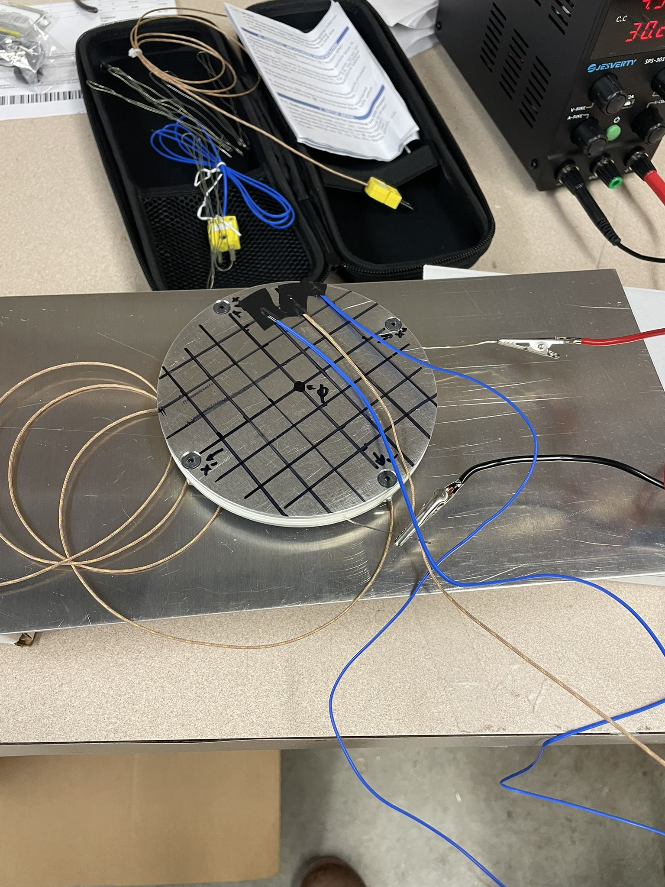

# Alex Echols

## Update 4 (02/16/2025)

### Progress Updates

* Updated substrate heater testing plans

I continued to test the substrate heater this week, with an updated testing plan following the ALD project meeting on Monday, 2/10. Instead of focusing on generating a heatmap of the entire heater surface, the new testing methodology aims to profile the time it will take the substrate heater to reach steady state given a desired temperature.

#### Methodology

1. Tape 2 of the thermocouples to the substrate heater, using the rough placement of the heating element as a guide. One thermocouple should be approximately over the heating wire, while another should be approximately centered in the largest gap in the heating element. The 0.5" grid as marked in the previous procedure provides a good way to record where the measurements were taken.&#x20;
2. Run datalogging for the two surface thermocouples and the center (reference) thermocouple for a given voltage. I started at 5V, aiming to prevent the cracking issues that happened last week. Gradually ramp up the voltage over the course of the run (I incremented in 1.5V increments every 20 minutes)&#x20;
3. Note difference between the reference point and each of the test points, as well as the difference between the two test points. A K-Type thermocouple only has an accuracy of  ±2.2 C, and they are highly sensitive to the quality of contact with the surface.

Based on my testing, I feel that the Boron Nitride disks which we are using are not suitable for our purposes, partly due to cracking concerns, and partly due to low thermal conductivity. Jay suggested the use of Aluminum Nitride instead, which seems to fit our criteria a bit better. I reached out to a few vendors regarding custom AlN disks, but have not heard back yet.

* Updated CAD for QCM mount

Though it was agreed both in our team meeting on 2/10, and when speaking to Matt on 2/11 that the QCM is not necessary for the initial deposition, I still feel that it is necessary to properly design the chamber such that it can be easily retrofitted.&#x20;

<figure><figcaption>
Chamber CAD with QCM mount
</figcaption></figure>

The only change which effects the current design revision is the movement of the substrate heater mount from the back face of the chamber to the left face of the chamber (when looking from the front). This should not change the chamber mechanics at all, and is mainly necessary to allow the precursor delivery system to sit close to the chamber, without needing to move if the QCM is added in the future.

The QCM mount itself uses a CF 2.75" to KF40 adapter as mentioned in my previous update, and simply mounts to a replacement backplate which accepts a KF40 flange. The KF40 fitting is the smallest KF style flange which can adequately accommodate the QCM mount when building the device. The CAD model shows a collision between the substrate heater mount and the QCM mount, but this will not be an issue in reality, as we can bend the QCM mount to line up with the surface of the substrate heater. It may also be worthwhile to consider redesigning the substrate heater to mount directly to the QCM mount, simply so that the QCM will be known to be at the same temperature as the heater.

* ALD stand is designed\*\*

\*\* Waiting for final approval from James regarding the precursor delivery

<figure><figcaption>
ALD Chamber on ALD Stand. Precursor delivery not pictured.
</figcaption></figure>

There isn't a ton to say on this front, as the design is relatively simple: an Al extrusion frame with some custom sheet metal brackets to mount to the chamber itself. We should be able to cut the mounting brackets in techspark, but will need to order the extrusion and corner brackets. Once the precursor delivery design is sorted out, we can do a final design review and place part orders. Construction itself should not take more than a couple of hours at most.

### Roadblocks

* Not exactly a roadblock, but reconsidering the Boron Nitride this late into development is certainly far from ideal. I am working on some code to simulate the thermal performance of the device which can hopefully be used to inform design decisions, including whether or not to change the insulator material.
* Awaiting approval from James regarding stand dimensions

### Plans

* Analyze trial data for substrate heater uniformity
* Research alternative substrate heater designs, including part lead time and sourcing
* Finalize stand dimensions and order parts

## Update 3 (02/09/2025)

### Progress Updates

* Constructed\*\* substrate heater and began uniformity characterization

\*\* The hardware used (i.e. screws, nuts, washers) is not the same as those that will be used for the final assembly, but it should not make a significant difference for the tests that we are doing

I was able to cut the top and bottom sheets for the substrate heater on the Techspark waterjet, and complete all of the required post-processing steps. By Thursday (2/6) I was able to begin testing on the fully assembled substrate heater.

<figure><figcaption>
Full test setup with power supply, datalogger, and heater
</figcaption></figure>

<figure><figcaption>
Heater with grid and thermocouples during a measurement
</figcaption></figure>

As detailed in my project proposal, temperature readings are being taken on 0.5" intervals across the heater surface. I am also measuring the temperature at the "main" thermocouple (the one which will be in the final assembly) as a point of comparison. Due to the length of the testing, I was not able to do more than one run, but this week I will continue this testing and hopefully finish by Friday. Due to long test times, I have slightly revised my testing procedure from that in the project proposal:

#### Setup

1. Draw a 0.5" grid on the heater surface, using the center of the disk as the origin. Ideally this grid lines up with the direction of the heating wire "zig-zags".
2. Ensure that the datalogger is working for all four probes. My initial test plan involved an arduino being used for datalogging, but my tests are being conducted using a [THE-373](https://gainexpress-dealer.com/products/the-373) thermometer for simplicity.

#### Trial

1. Tape 3 of the thermocouples to points on the grid and record their positions (#4 is the center of the grid). Kapton tape or a similarly rated adhesive should be used. Electrical tape is pictured above and is not suitable.
2. Turn on datalogging and power supply (7V, constant voltage mode) for 20 minutes. The heater will reach approximately 100C by this time, which is lower than our operating temperatures, but should be suitable to notice any differences in the heating curves over time.
3. Turn off the power supply and allow the heater to cool down to room temperature. This will take approximately 50 minutes.
4. Move thermocouples to a new location and test again. Due to the long duration of each test trial (\~70 minutes), it is likely not advisable to probe at every single point on the surface of the heater. 1-2 trails per quadrant should be sufficient to notice any problem areas, assuming that the thermocouples are evenly spaced.

#### Analysis

This is still WIP, but my current notes are:

* Temperatures at each probe point should be compared to the center thermocouple. This is a better choice than comparing to mean temperature or similar because we will eventually be using the thermocouple at the center of the heater as the sole point of measurement, so the uniformity matters relative to that point.
* It is important to remember that K-type thermocouples (used here) have an accuracy of ±2.2 C, so any deviations within that range are not reason for concern. At the maximum operating temperature of our heater (600 C), this goes up to ±4.5 C

***

* Researched passthroughs for QCM and substrate heater

#### Substrate Heater

The substrate heater requires lines for power and the center thermocouple. We have two primary options for these needs, either use two seperate feedthroughs for power and the thermocouples or use a single power + thermocouple feedthrough. Upon examining prices, it is apparent that it is much more economical to purchase a single power + thermocouple feedthrough, and many vendors sell feedthroughs which are rated for our power needs.

| Vendor         | Price   | Lead Time                                               | Link                                                                                                                                                 |
| -------------- | ------- | ------------------------------------------------------- | ---------------------------------------------------------------------------------------------------------------------------------------------------- |
| IdealVac       | $465.26 | Ships Now                                               | [IdealVac P108066](https://www.idealvac.com/en-us/Electrical-Thermocouple-and-Power-Feedthrough-Type-K-5KV-30A-UHV-Rated-118-in-dia-KF16/pp/P108066) |
| Kurt J. Lesker | $315.00 | KJLC will contact you                                   | [KJL TFT1KY2N308](https://www.lesker.com/feedthroughs/thermocouple-feedthroughs-typek-miniplugpower-singleend/part/tft1ky2c308)                      |
| MDC Precision  | $321.00 | 6 weeks                                                 | [MDC 9393015](https://www.mdcprecision.com/9393015-thermocouple-powerfeedthrough-typek-1pair-5kv-30amps-k075-nw16-kwik-flangeisokf-quickflange)      |
| Allectra       | $301.37 | On Request (I emailed but have not received a response) | [Allectra 263-TCK-1-CU30-2-K16](https://www.allectra.com/products/263-tck-1-cu30-2-k16/)                                                             |

My recommendation for our project is to order from IdealVac, simply due to lead times. The other products on this list should be equivalent and could be ordered by another fab looking to replicate our device. Since we are concerned with getting the chamber working by spring break, purchasing the only option which we know can ship now makes the most sense to me.

#### QCM Passthrough

I am in the process of speaking to Matt about options for this sensor. Options for mounts/passthroughs are summarized [here](https://docs.google.com/document/d/1vYA7lyjGNZSNSQZndPqWmFKoCta1pJbzlKMnsrJxT94/edit?tab=t.0#heading=h.tuhjetsx3rhg).

While talking to Matt, we discussed the idea of either directly connecting a CF 2.75" flange to the chamber, or using a KF40 to CF 2.75" adapter to allow the sensor mounts to connect to the chamber. I did some quick cost analysis and it seems that both options are roughly price equivalent.

**CF on Chamber (No Adapter) | Total Cost (Est.): $1,329.47**

<table><thead><tr><th width="268">Item</th><th>Qty</th><th>Cost (Est.)</th><th>Source</th></tr></thead><tbody><tr><td>IdealVac 9x9 Plate (CF 2.75)</td><td>1</td><td>$258.15</td><td><a href="https://www.idealvac.com/en-us/Ideal-Vacuum-Cube-9-x-9-Vacuum-Chamber-Plate-With-One-Conflat-CF-275-in-Port/pp/P1010678">IdealVac</a></td></tr><tr><td>Aflas Sheet</td><td>1</td><td>$39.03</td><td><a href="https://www.mcmaster.com/5499T14/">McMaster</a></td></tr><tr><td>Gasket Cutter</td><td>1</td><td>$32.29</td><td><a href="https://www.mcmaster.com/36795A11/">McMaster</a></td></tr><tr><td>Sensor/Passthrough Assembly</td><td>1</td><td>$1,000.00</td><td>INFICON</td></tr></tbody></table>

**KF on Chamber (Adapter) | Total Cost (Est.): $1,396.90**

<table><thead><tr><th width="270">Item</th><th>Qty</th><th>Cost (Est.)</th><th>Source</th></tr></thead><tbody><tr><td>IdealVac 9x9 Plate (KF40)</td><td>1</td><td>$210.70</td><td><a href="https://www.idealvac.com/en-us/Ideal-Vacuum-Cube-9-x-9-Vacuum-Chamber-Plate-With-One-KF-40-(NW-40)-Port/pp/P109594">IdealVac</a></td></tr><tr><td>KF40 Centering Ring</td><td>1</td><td>$10.05</td><td><a href="https://www.lesker.com/newweb/flanges/hardware_kf_centeringrings.cfm?pgid=al">Kurt J Lesker</a></td></tr><tr><td>KF40 Bulkead Clamp</td><td>1</td><td>$36.10</td><td><a href="https://www.lesker.com/newweb/flanges/hardware_kf_clamps_bulkhead.cfm?pgid=al">Kurt J Lesker</a></td></tr><tr><td>KF40 to CF 2.75 Adapter</td><td>1</td><td>$105.65</td><td><a href="https://www.lesker.com/newweb/flanges/adapters_flanged_1.cfm?pgid=cfkf">Kurt J Lesker</a></td></tr><tr><td>Copper Gasket</td><td>1</td><td>$34.40</td><td><a href="https://www.lesker.com/newweb/flanges/hardware_cf_gaskets.cfm?pgid=ofhc">Kurt J Lesker</a></td></tr><tr><td>Sensor/Passthrough Assembly</td><td>1</td><td>$1,000.00</td><td>INFICON</td></tr></tbody></table>

### Roadblocks

* Not exactly a roadblock, but the Boron Nitride disks cracked during the initial testing of the heater. I will be looking into potential causes for this and potentially thinking of other options
* The heater testing takes much longer than I expected per trial, but I have planned around this as mentioned above. I will take measurements on a limited subset of points rather than all (49) points on the grid

### Plans

* Finish substrate heater uniformity testing and gather/analyze data
* Finalize feedthrough plans and order them ASAP. Matt is currently not responding to my email, but I will follow up with him on Tuesday if he has not responded by then
* Look into the Boron Nitride cracking

## Update 2 (02/02/2025)

### Progress Updates

#### Chamber Exhaust Part Sourcing

* Created CAD of the ALD chamber and the chamber to pump line

<figure><figcaption>
Chamber CAD made from models from IdealVac website
</figcaption></figure>

<figure><figcaption>
Chamber to pump assembly
</figcaption></figure>

* Sourced parts for the chamber to pump line from IdealVac

| Part                  | Qty Purchased | Price   |
| --------------------- | ------------- | ------- |
| KF-25 Hinge Clamp     | 2             | $23.98  |
| KF-25 Centering Ring  | 3             | $29.79  |
| KF-25 90 Degree Elbow | 1             | $71.92  |
| -------               | -------       | ------- |
| Total                 | -------       | $395.69 |

#### Substrate Heater Design

* Updated CAD of substrate heater
* Designed substrate heater mount

The substrate heater (pictured below) is very similar to the one which was designed during the F-2024 semester. The primary differences in the heater itself are:

* Countersink the holes in the upper plate to accommodate a #6-32 flat head screw. The plate thickness of 0.1" will just allow the bolts with a head height of 0.097" to fit without interfering with any wafers that may be placed on the surface
* Modify the bottom plate to add 3 slots, spaced 60 degrees radially apart, which are used from alignment.

<figure><figcaption>
Bottom plate (showing slot arrangement)
</figcaption></figure>

In addition to the substrate heater modifications, a mounting bracket was designed, which will hold the substrate heater into the chamber.  In order to minimize thermal conduction paths between the heater and the chamber walls, 3 silicon nitride balls will be used for alignment. This material should be compatible with our precursors, and has a thermal conductivity of approximately 20% of the aluminum plates. The mounting bracket has 3 holes which locate the balls, which then line up with the slots in the heater plate. Taking inspiration from the concept of exact constraint design, the balls contact the heater at exactly 6 points, constraining the heater in 6 DOF, and making removal easy in the event that the heater needs to be serviced. Additionally, the very low contact area of the lower heater plate with the balls, and the balls with the mounting bracket should further limit heat transfer by conduction, which is the primary vector that we are worried about.

<figure><figcaption>
Section view of chamber, showing the substrate heater and mount
</figcaption></figure>

* Sourced parts for substrate heater and mounting assembly

<table><thead><tr><th>Part</th><th width="121">Qty Needed</th><th>Vendor</th><th width="109">Est. Price</th><th>Notes</th></tr></thead><tbody><tr><td>#6-32 Flat Head Screw</td><td>4</td><td>McMaster (90585A215)</td><td>$5.23</td><td>Secures heater assembly**</td></tr><tr><td>#6-32 Hex Nut</td><td>4</td><td>McMaster (91841A007)</td><td>$4.04</td><td>Secures heater assembly**</td></tr><tr><td>#6 Lock Washer</td><td>4</td><td>McMaster (92146A540)</td><td>$1.78</td><td>Secures heater assembly**</td></tr><tr><td>Heater Top Plate</td><td>1</td><td>SendCutSend</td><td>$7.51</td><td>Could make in Techspark (if waterjet is working)</td></tr><tr><td>Heater Bottom Plate</td><td>1</td><td>SendCutSend</td><td>$10.30</td><td>Could make in Techspark (if waterjet is working)</td></tr><tr><td>#8-32 Standoff</td><td>1</td><td>McMaster (91115A843)</td><td>$5.53</td><td>Mounting Bracket Stability</td></tr><tr><td>#8-32 Socket Head Screw</td><td>2</td><td>McMaster (92196A192)</td><td>$9.95</td><td>Mounting Bracket Stability**</td></tr><tr><td>SiN Balls</td><td>3</td><td>McMaster (9576K46)</td><td>$42.81</td><td>Alignment</td></tr><tr><td>Mounting Plate</td><td>1</td><td>SendCutSend</td><td>$31.59</td><td>I would recommend getting this made externally, as SendCutSend can bend the part for us</td></tr><tr><td>1/4-20 Socket Head Screw</td><td>4</td><td>McMaster (92196A537)</td><td>$20.71</td><td>Mounting Bracket Mounting**</td></tr><tr><td>-------</td><td>-------</td><td>-------</td><td>-------</td><td>-------</td></tr><tr><td>Total</td><td>-------</td><td>-------</td><td>$139.45</td><td>-------</td></tr></tbody></table>

\*\* This item can almost definitely be sourced cheaper individually (i.e. from BoltDepot or similar), but it comes down to a question of lead times at some point

#### Chamber Stand Design

* This is currently in beginning stages, but some basic cad of a simple chamber stand has been made

<figure><figcaption>
CAD of chamber on aluminum extrusion stand
</figcaption></figure>

* This needs to be modified slightly from the simple box design to avoid some collisions with the line to the vacuum chamber

### Roadblocks

* No major roadblocks to report

### Plans

* Review substrate heater design with project leads
  * If approved, finalize sourcing and order parts
* Finalize design for chamber stand and source parts
  * Time permitting, review the design and order parts
* Once design work is finished on the substrate heater and parts are being ordered, begin research on creating Aflas O-Rings from the cording
  * Some preliminary googling indicates that a solvent weld with acetone might be possible, but I feel somewhat skeptical of the sealing quality of these O-Rings and feel that it's important to figure out how possible this sealing method is ASAP

## Update 1 (01/26/2025)

### Progress Updates

* Created experimental design for profiling substrate heater
* Began updating 3D CAD of the substrate heater and ALD chamber
* Reviewed literature on material compatibility with precursor materials (for heater parts)
* Drafted and submitted semester project proposal

### Roadblocks

* No major roadblocks to report

### Plans

* Continue to work on CAD of the chamber assembly
  * Preliminary designs for the entire heater stack, including chamber mounting by EOW
* Begin research on compatible tubing and passthroughs
* Create plan for making Aflas O-Rings from cording

## Update 0 (01/19/2025)

### Progress Updates

* Reviewed documentation from the Fall 2024 semester
* Had initial group meeting with ALD team to delegate roles and discuss next steps
* Began planning for ALD chamber passthroughs and substrate heater thermal characterization

### Roadblocks

* No major roadblocks to report

### Plans

* Review literature on material compatibility with precursor chemicals and vacuum design
* Detail experimental procedure for substrate heater characterization
  * Understand the relationship between input voltage/current and output temperature/temperature rate
  * Ensure heater uniformity
* Draft project proposal

