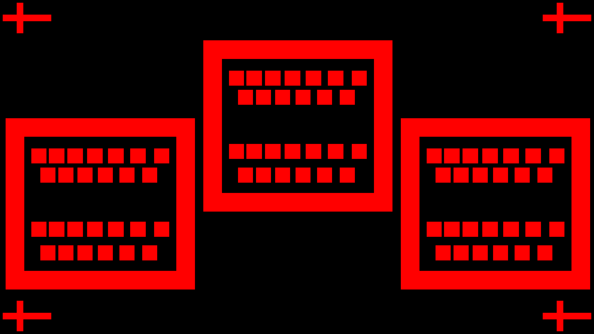
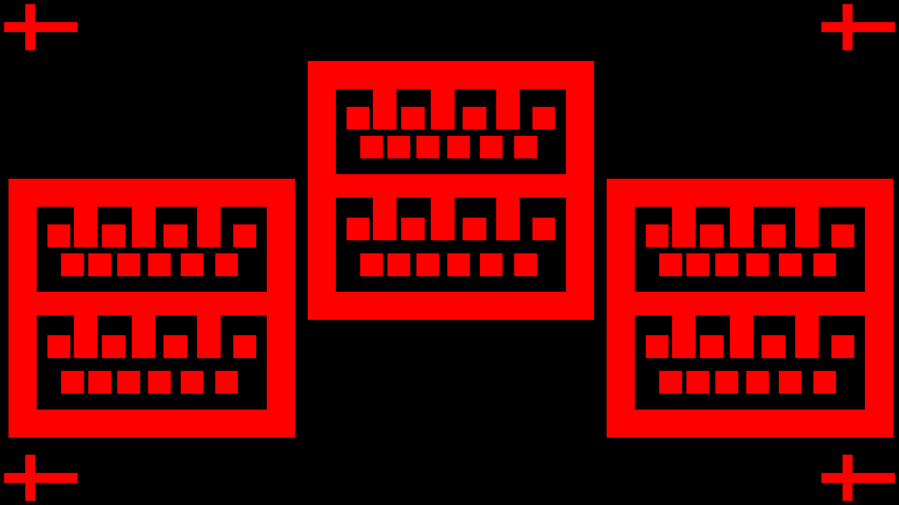

# Felicia Liu

**Weekly Update #1**

Work done:

I drafted project proposal and set goals/timeline on what we plan to achieve this semester with two other teammates in the EDA device modeling subteam ([https://docs.google.com/document/d/1sCj4PGeCfQZ3DJODLZkjC7j2guPgpSJxxSDldw\_wTm8/edit?tab=t.0](https://docs.google.com/document/d/1sCj4PGeCfQZ3DJODLZkjC7j2guPgpSJxxSDldw_wTm8/edit?tab=t.0)).

I focused on figuring out what tool to use for the SPICE model simulation. We decided to go with KiCad's schematic tool which has an embedded open-sourced SPICE simulator Ngspice. It supports custom MOSFET SPICE model definition and can export SPICE netlist from schematics.

Roadblocks:

Had some confusion about which tool was the best to use but resolved.

Plan for next week:

Try simulating with the initial MOSFET model with process parameters calculated from last semester's chip. Figure out what parameter is still needed to build a higher precision MOSFET model and coordinate with other teams involved to develop a testing plan.

**Weekly Update #2**

Work done:

I worked on writing a dummy MOSFET SPICE model and developing an SOP for SPICE simulation in KiCad ([https://docs.google.com/document/d/1\_067-FJ9xRFWtv6PRrNWwk6ueBx2oNrUpBuWezrBQxI/edit?tab=t.0](https://docs.google.com/document/d/1_067-FJ9xRFWtv6PRrNWwk6ueBx2oNrUpBuWezrBQxI/edit?tab=t.0)). I have figured out how to run DC sweep, plot diagrams, and export SPICE netlist.

Roadblocks:

It is hard to find reliable SPICE documentation. We are having some issues finding the correct way to calculate all the necessary SPICE model parameters from the testing results we currently have. Chips from last semester are not ideal and we are considering fabricating some new chips.&#x20;

Plan for next week:

Explore more KiCad SPICE functionalities. Research how to calculate parameters, maybe read some textbooks in addition to SPICE documentation.

**Weekly Update #3**

Work done:

Our group is currently working on developing a test chip for NMOS characterization to collect process parameters and plug them into SPICE model. I worked on designing an initial test chip mask&#x20;

([https://drive.google.com/file/d/1xJqtZhwv6ymNPnZKm5X7mc3w4kSNG3Up/view](https://drive.google.com/file/d/1xJqtZhwv6ymNPnZKm5X7mc3w4kSNG3Up/view)).

and helped with coming up with the testing plan ([https://docs.google.com/document/d/1wRFp3ccW5n\_bPLZD3rvi\_6JWFzY\_\_D2YDD\_fRpHgOsE/edit?tab=t.0](https://docs.google.com/document/d/1wRFp3ccW5n_bPLZD3rvi_6JWFzY__D2YDD_fRpHgOsE/edit?tab=t.0)).

I also learned how to use the probe station to test the chip when it comes back.

Roadblocks:

Initially, our group thought we could use the chips from last semester to get the curves needed to calculate the device parameters. However, the working chips were missing so we had to design and refabrication our own chip.

Plan for next week:

The hand-drawn chip masks (one for NMOS characterization by me and one for packaging with I/O pads by Gongwei) need to be finalized with appropriate spacing between components and be transferred to real masks by the mask design group.

**Weekly Update #4**

Work done:

I kept working on refining the chip mask for device characterization ([https://drive.google.com/file/d/1xJqtZhwv6ymNPnZKm5X7mc3w4kSNG3Up/view](https://drive.google.com/file/d/1xJqtZhwv6ymNPnZKm5X7mc3w4kSNG3Up/view)). Took advice from Icey to add metal pads and detail each layer in color. I referred to the relative ratio of Wentao's working chip mask ([https://docs.google.com/presentation/d/14-dpjaqdC6Muq3PNF8Y-pDv0M4lqNexc/edit#slide=id.p2](https://docs.google.com/presentation/d/14-dpjaqdC6Muq3PNF8Y-pDv0M4lqNexc/edit#slide=id.p2)) and came up with DRC width and spacing.

I worked on the presentation slides for our first presentation next week.

Roadblocks:

Currently do not have any roadblocks, just waiting to circle back on the test chip mask design.

Plan for next week:

Finish up the presentation slides and present on Thursday. Collaborate with Gina and Sandra to convert the hand draft test chip design into actual masks. Plug in numbers Gongwei got from chip 493 into SPICE model to verify if the simulation aligns with experimental results.

**Weekly Update #5**

Work done:

I finished the presentation slides ([https://docs.google.com/presentation/d/1tlnXbdm\_S4oZerqLOZx2ODcKvoIJ7EftKB4GgxjC8XI/edit](https://docs.google.com/presentation/d/1tlnXbdm_S4oZerqLOZx2ODcKvoIJ7EftKB4GgxjC8XI/edit)) and presented with the group on Thursday. During Q\&A, I got feedback on widening contact width for lower contact resistance which is better for NMOS characterization. I made the changes and looked into Sandra and Gina's mask generation codebase to try translating the hand-drawn draft to actual masks ([https://colab.research.google.com/drive/1Ihz8MFp59NgdUhTNkJPlqDkgh7zhsC7x?usp=sharing#scrollTo=bWKgX7jIjWGu](https://colab.research.google.com/drive/1Ihz8MFp59NgdUhTNkJPlqDkgh7zhsC7x?usp=sharing#scrollTo=bWKgX7jIjWGu)). Below is the initial result I have. There are a couple of issues:

1. &#x20;The codebase does not yet support custom MOSFET length and width.
2. The exact spacing is unclear.&#x20;
   1. The scale factor needs to be re-measured (Sandra and Gina working on it).
   2. It is hard to determine the spacing between components on the plotted diagram. Would be helpful if we could work out some sort of reference such as a live ruler tool.
3. The current design exceeds the area of a single exposure. However, whether or not the final design will exceed depends on the scale factor.
4. Need to define which layer P+ resides.

<figure><figcaption>
NMOS Characterization chip WIP
</figcaption></figure>

Roadblocks:

Waiting for Gina and Sandra to retrieve the accurate scale factor and implement MOSFET W/L customization.

Plan for next week:

Collaborate with Gina and Sandra to solve the above-mentioned issues and work out an initial working mask. Hopefully we can start fabricating soon.

**Weekly Update #6**

Work done:

I redid the mask design for the NMOS characterization chip. We realized that the scaling on the previous design version was incorrect, and one exposure can fit 5 patterns as shown below without interfering with the focus marks. Metal contact is added onto the MOSFET diffusion. I also collaborated with Sandra to help making the mask generation code more user friendly.

<figure><figcaption>
NMOS Characterization chip: exposure
</figcaption></figure>

<figure><figcaption>
NMOS Characterization chip: single pattern
</figcaption></figure>

Roadblocks:

Waiting on finalizing the fabrication steps to start fabricating the chip. Also need to finish the HF safety training.&#x20;

Plan for next week:

Review the mask design with Icey and make any final adjustments. Keep collaborating with Sandra and Gina to think of any other functionalities we should add/brainstorming LVS/DRC design and implementation. Complete HF training and start fabricating test chips.

**Weekly Update #7**

Work done:

I updated the mask design for the NMOS characterization chip, specifically added Body-Source tie at layout level. This is because the probe station still has only 3 probes and we don't expect an upgrade very soon.

We still plan to fabricate both versions of the chip, with and without BS connection, to ensure flexibility for potential upgrades and the study of body effects. The only difference between the two versions is the metal layer masks as shown below. The rest of the masks can be found in: [https://drive.google.com/drive/u/0/folders/1KTrhLrV\_Q7-Bw2zknYYuRV\_R\_0qcSj\_h?lfhs=2](https://drive.google.com/drive/u/0/folders/1KTrhLrV_Q7-Bw2zknYYuRV_R_0qcSj_h?lfhs=2)

<figure><figcaption>
NMOS Characterization Chip w/ BS connection
</figcaption></figure>

<figure><figcaption>
Metal layer w/o BS connection
</figcaption></figure> <figure><figcaption>
Metal layer w/ BS connection
</figcaption></figure>

We started test chip fabrication. We have 2 NMOS characterization chips and 2 packaging test chips (Gongwei's design). We finished P504 spin-on & diffusion and HF etching (4/4).

Roadblocks:

No roadblocks.

Plan for next week:

Continue to fabricate the chips.

**Weekly Update #8**

Work done:

This week we discussed next steps we can take other than developing device models. We think we could start looking at open-sourced LVS check tools such as KLayout and brainstorm how they can be integrated with the schematic tool. We also agree that it is too early to develop standard cell library layouts since we are still transferring the layout toolchain and figuring out DRC. However, it is helpful to come up with a list of items we want to build and make constructive suggestions to the process team. Here ([https://docs.google.com/document/d/1q6OOcurhvERhzqmwrdqSNwqdjOpPjROsGMo\_t2sZ4uE/edit?tab=t.0](https://docs.google.com/document/d/1q6OOcurhvERhzqmwrdqSNwqdjOpPjROsGMo_t2sZ4uE/edit?tab=t.0)) I started a documentation.

We continued to fabricate the NMOS characterization chip and the packaging test chip. We spun on HMDS (4/4) and patterned (2/4) our chip. However, the patterning was not successful.

Roadblocks:

The developer was out of stock until Thursday, so we could not fabricate for the first half of the week. The patterning of the two chips was not successful and we think the stepper was not focused properly.

Plan for next week:

Continue to fabricate. Debug the stepper and pattern the two other chips. Do research on KLayout, DRC,  and standard cell library options.

**Weekly Update #9**

Work done:

This week, we continued to fabricate; however, for different reasons, our attempts were not successful.  We first patterned two chips but they failed later because we set the plasma O2 clean time too long, and the patterns were lost. We then patterned a new chip but the plasma etch was unsuccessful and left a bunch of residue. We did not realize that and proceeded to spin-on glass, and it is no longer usable.

<figure><figcaption>
Chip that failed due to plasma etch residue
</figcaption></figure>

We started a couple of new chips and spun-on dopant. We HF-etched 2 of them and hope to retry patterning next week.

Roadblocks:

1. Stepper UV auto-focus was not accurate enough, so we had to manually fine-grain focus after hitting auto-focus for a coarse-grain focus.
2. The plasma chamber didn't open after etching on Tuesday, but the TAs were able to fix it.
3. Plasma O2 time duration was too long.
4. Wasn't sure why plasma etching was not successful the second time.
5. Only gate mask has the region we want to keep in black, all other layers have the opposite. Unsure if this is correct?

<figure><figcaption>
Gate
</figcaption></figure>

<figure><figcaption>
Metal
</figcaption></figure>

Plan for next week:

Continue to fabricate. Hopefully, as we gain more experience the process can move forward more smoothly. :(

**Weekly Update #10**

Work done:

This week we continued to fabricate. We produced 4 new chips with spin-on dopant and tried to pattern them. Two of them were successful. We then did plasma etch and got clean patterns for both of them. The two other chips had wired color and marks on them after the patterns were developed. We think they were not HF-etched properly in the previous stage. We are going to wipe out the photoresist and do HF-etching again on them.

Ying and I discussed what the EDA team is doing with Professor Jim Bain, and he suggested that fabrication should not be our bottleneck. Instead, he proposed that we could develop a flow to produce device modeling parameters from synthetic data, and then plug the real data in when it is ready. He also looked at the data we collected from the less ideal chips and suggested that it is still usable if we manually rule out some fabrication imperfections.

I continued to develop documentation for cell library: [https://docs.google.com/document/d/1q6OOcurhvERhzqmwrdqSNwqdjOpPjROsGMo\_t2sZ4uE/edit?tab=t.0](https://docs.google.com/document/d/1q6OOcurhvERhzqmwrdqSNwqdjOpPjROsGMo_t2sZ4uE/edit?tab=t.0)

Roadblocks:

Stepper auto-focus is still inaccurate, and we had to manually focus every time we pattern. We think HF-etching was not successful because the chips were not fully dipped into the solution.

Plan for next week:

Continue to fabricate. Continue to work on the standard cell library documentation. Try to develop a flow script to extract device parameters from synthetic data. Prepare for presentation 2 slides and present during class.

**Weekly Update #11**

Work done:

This week we presented our progress during lecture. Our fabrication is moving slowly, but we realized that it does not need to be the bottleneck of our project. Ying and I started to work on a device model parameter extraction flow ([https://colab.research.google.com/drive/1Ku2WJjzzi1aM3aYvisd9LoYFHgV0zpth#scrollTo=c\_yRD\_uWDncJ](https://colab.research.google.com/drive/1Ku2WJjzzi1aM3aYvisd9LoYFHgV0zpth#scrollTo=c_yRD_uWDncJ)) with synthetic data created based on the best chip 613 which went missing. We got some preliminary results as shown in the diagram below. The dashed line is the original IV curve, and the filled line is the reconstructed curve. The initial result is promising but still has some issues, as we stated in the presentation 2 slides. We also caught some issues with our previous parameter extraction documentation and updated it as we developed the flow.

<figure><figcaption></figcaption></figure>

We continued to fabricate the chip. Now we have two NMOS chips with good gate patterns and ready to fab the next layer, and Gongwei is working on another packaging chip.

Roadblocks:

1. The device model parameter extraction flow has some inaccuracy compared to the original data. We are still debugging why it is the case and whether it is due to the data itself being non-realistic or it is due to our algorithm.
2. The stepper system has been updated. The exposure is 7% larger than the previous stepper. Since one of our good chips was patterned with the previous stepper, we need to adjust some settings manually to make the layer size match.
3. We tried to align the second layer but could not figure out how to. We tried to align manually on red focus, but the alignment changed when we switched to UV mode.

Plan for next week:

Keep debugging the device model parameter extraction flow. Continue to fabricate.
