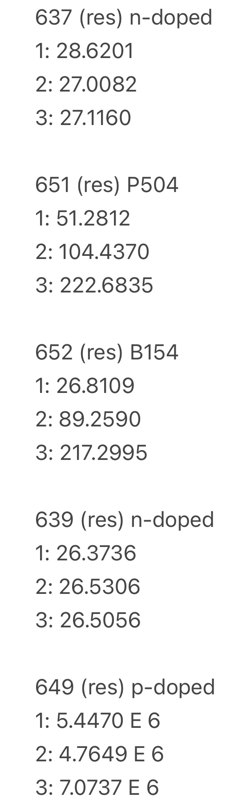

# Haewon Uhm

## Update 1&#x20;

**Accomplishments**&#x20;

* Completed the project proposal and went over it with the TAs&#x20;
* Set up the reflux apparatus in the acid fume hood (SOG)
* Decided to start with replicating the ProjectsInFlight formulation with later tests of catalysts, altering the ratios of ethanol, phosphoric acid, and boric acid (SOG)&#x20;
* Learned in greater detail the systems involved with the ALD controls (ALD)&#x20;

**Challenges**&#x20;

* Still having trouble downloading LabVIEW onto my computer
* Will probably need assistance from Viswesh&#x20;

<figure><figcaption>
Issue that comes up when trying to download LabVIEW multiple times. 
</figcaption></figure>

**Future Plans**&#x20;

* Solidify the plans for SOG and get more acclimated to the lab overall
* Do more research on the chemicals involved, narrowing down the many possibilities of failure (especially the boric acid)&#x20;
* Download LabVIEW and start learning how to use the system&#x20;
* Gain access to the LabVIEW for the ALD&#x20;

## Update 2 (SOG)&#x20;

**Accomplishments**

* Ordered 95% ethanol that is needed to replicate the ProjectsInFlight formula&#x20;
* To start testing, decided to use isopropyl alcohol as an ethanol replacement
* Looked into the Filmtronics ingredient list for 700B and found it possible to test ratios in the future

**Challenges**

* Realized we did not order ethanol, which is a key ingredient in the ProjectsInFlight video, so I have to wait until that comes in&#x20;
* Already resolved with Jay and Daniel&#x20;

**Future Plans**&#x20;

* Start testing the formulation of the n-doped spin-on glass using TEOS or TMOS, water, isopropyl alcohol, and phosphoric acid (ratios based on the video)&#x20;
* Might not work due to the less polar nature of IPA than ethanol and therefore not provide the emulsification that is needed for the water and TEOS/TMOS

## Update 2 (ALD)

**Accomplishments**

* Got more adapted to LabVIEW and was introduced to the ALD valve and heating element control systems on my computer
* Used a YouTube video to try and connect the MC DAQ to LabVIEW directly

**Challenges**

* Couldn't directly download the LabVIEW file from the GitHub due to the different version that is available for Mac versus Windows&#x20;
* Resolved with Viswesh&#x20;

**Future Plans**&#x20;

* Continue to try and connect the MCC DAQ to LabVIEW&#x20;
* If that does not work, make Python code that will alternatively do the job

## Update 3 (SOG)

**Accomplishments**

* Tested the ProjectsInFlight recipe with the exclusion of ethanol in place of IPA.
* Procedure can be found under 2/5/25 in the following doc: [https://docs.google.com/document/d/1Zv89gYlrvVO8jFVvS3HTmG\_rJBMBwB7pDHd5lRpelhI/edit?tab=t.0](https://docs.google.com/document/d/1Zv89gYlrvVO8jFVvS3HTmG_rJBMBwB7pDHd5lRpelhI/edit?tab=t.0)

<figure><figcaption>
Formula of the recipe tested.
</figcaption></figure>

**Challenges**

* After the heating, there was a residue inside the flask even after thoroughly washing (assuming it is glass).&#x20;
* The solution did not evaporate into the reflux apparatus and condensate back in to the flask at all (only condensate within the flask).&#x20;
* Our dopant on a chip was visibly darker in complexion in comparison to the commercial dopant on a chip.&#x20;
* More striations were present in the DIY SOG (not as smooth and might be due to the replacment of ethanol with IPA).

<figure><figcaption>
Shows the solution only condensing within the flask. 
</figcaption></figure>

<figure><figcaption>
Shows the residue that was present after cleaning the flask.
</figcaption></figure>

**Future Plans**

* In the video, there is somewhat direct heat contact between the flask and the hot plate without the use of a water bath, so higher contact temperature with the flask for a shorter amount of time should be tested with the same recipe from 2/5/25.&#x20;
* Research a type of silicate polymer that is compatible with the other ingredients shown below, and add that, along with reagent alcohol, to the purchase tracker.&#x20;

<figure><figcaption>
Ingredient list on the Filmtornics website for 700B.
</figcaption></figure>

* Vary the amount of 85% phosphoric acid by adding and subtracting 0.25 mL from the original 0.5 mL.&#x20;

## Update 3 (ALD)&#x20;

**Accomplishments**

* Found a way to connect the MCC DAQ to LabVIEW using InstaCal and ULx through this link: [https://files.digilent.com/manuals/QS%20ULx%20for%20NI%20LabVIEW.pdf?\_gl=1\*1oftj18\*\_ga\*MTU3NzI5NjAxMy4xNzM4NTcxMDcz\*\_ga\_YFKL15TK2S\*MTczODU3MTA3Mi4xLjAuMTczODU3MTA3Mi42MC4wLjA](https://files.digilent.com/manuals/QS%20ULx%20for%20NI%20LabVIEW.pdf?_gl=1*1oftj18*_ga*MTU3NzI5NjAxMy4xNzM4NTcxMDcz*_ga_YFKL15TK2S*MTczODU3MTA3Mi4xLjAuMTczODU3MTA3Mi42MC4wLjA)
* Instead of using the MCC DAQ to control the heating elements, relay hats and thermocouple breakouts will be connected to a Raspberry Pi 4 and the heating elements.&#x20;

<figure><figcaption>
Control system diagram.
</figcaption></figure>

* Connected the Pi 4 and tested the thermocouple relays with the python library and code provided by the adafruit: [https://learn.adafruit.com/thermocouple/python-circuitpython](https://learn.adafruit.com/thermocouple/python-circuitpython)
* Looked over the manual for the throttle valve software: [https://www.idealvac.com/files/manuals/CommandValve\_Generation\_II\_User\_Manual.p](https://www.idealvac.com/files/manuals/CommandValve_Generation_II_User_Manual.pdf)
  * DirectVac software only runs on windows
  * Open and close fully or open incrementally by 1º&#x20;
  * Any device capable of running a USB host and can communicate serial commands can precisely operate the CommandValve

**Challenges**&#x20;

* InstaCal and ULx only run on Windows, so I could not check it myself, but also later found out that LabVIEW is not compatible with the MCC DAQ, so we needed to find a new way.&#x20;
* Decided to scratch the use of a MCC DAQ as a whole.&#x20;

**Future Plans**&#x20;

* Look into how to run both ALD valves and the PID temperature LabVIEWs simultaneously once LabVIEW is downloaded onto the mini PC&#x20;
* Find the python block on LabVIEW and see if the python script runs on LabVIEW&#x20;
* Make python code that cycles through the thermocouples and averages the temperatures outputted, sending only one averaged value to LabVIEW&#x20;
* Need to transfer the temperature readings from the Pi 4 to a mini pc that is running LabVIEW (Pi 4 is quite slow).&#x20;
* Learn more about the adafruit library and code to accomplish the main task.

## Update 4 (SOG)

**Accomplishments**&#x20;

* Tested the ProjectsInFlight recipe with the exclusion of ethanol in place of IPA.
  * Recipes for each test can be found in the following doc: [https://docs.google.com/spreadsheets/d/11cc8vFxX2Cdq87uaElUpQxJZl3V7WWIpoaZI9dVXeNA/edit?gid=0#gid=0](https://docs.google.com/spreadsheets/d/11cc8vFxX2Cdq87uaElUpQxJZl3V7WWIpoaZI9dVXeNA/edit?gid=0#gid=0)
* Direct heat of 175ºC for 30 minutes on 2/13/25.

<figure><figcaption>
Before diffusing
</figcaption></figure>

<figure><figcaption>
After diffusing
</figcaption></figure>

* Direct heat of 100ºC for 15 minutes on 2/14/25.

<figure><figcaption>
Before diffusing
</figcaption></figure>

<figure><figcaption>
After diffusing
</figcaption></figure>

* Diffused the first sample made on 2/5/25.

<figure><figcaption>
Before diffusing
</figcaption></figure>

<figure><figcaption>
After diffusing
</figcaption></figure>

**Roadblocks**&#x20;

* No stir bar was used on 2/13/25 and might have been the reason for excessive residue at the bottom of the flask (need to order).&#x20;

<figure><figcaption>
Residue left at the bottom of flask
</figcaption></figure>

* There was a good amount of residue at the bottom of the flask that turned into a crystal-like powder after being left out in the flask for one day.&#x20;
  * The silica solid residue collapsed due to the dehydration of the solvent since it was left out (DI water and IPA).&#x20;
* Still not reaching the reflux apparatus (might be too little liquid for the size of the flask and the reflux apparatus).&#x20;
  * This shouldn't be an issue since there is condensation visible within the flask.&#x20;
* The leftover solution from the first sample (2/5/25) solidified into a gel consistency after a week in its container.
  * The SOG is not sustainable and has a short shelf life, which might be due to the speed of the reaction.&#x20;

**Future Plans**

* Continue to test the temperature and time&#x20;
  * Direct heat of 100ºC for 25 minutes.&#x20;
* Since I could not get to it last week, vary the amount of 85% phosphoric acid by adding and subtracting 0.25 mL from the original 0.5 mL.&#x20;
  * Increasing the phosphoric acid increases viscosity, and decreasing is okay as long as the pH is within the range that minimizes the reaction speed or else the shelf life of the dopant will tank (pH of 3-4)
* HF etch the previous chips and test the conductivity using the probe station.&#x20;
  * Look into how you know the dopant is successful and the range of all the components.&#x20;
* Grasp a better understanding of why the results are turning out the way they did, especially the test from 2/13/25

## Update 4 (ALD)

**Accomplishments**

* Found the python node on LabView.
  * Functions palette, connectivity, python.

<figure><figcaption>
Python node on LabVIEW
</figcaption></figure>

*   Instead of working and testing the python code all at once, I focused on writing the code to average the temperatures read from one thermocouple on the Raspberry Pi.&#x20;

    <figure><figcaption>
Python script added to the Raspberry Pi
</figcaption></figure>
* Able to run multiple VIs through a primary VI by calling multiple subVIs through the primary VIs:&#x20;
  * [https://knowledge.ni.com/KnowledgeArticleDetails?id=kA03q000000YHyLCAW\&l=en-US](https://knowledge.ni.com/KnowledgeArticleDetails?id=kA03q000000YHyLCAW\&l=en-US) (use to get started in the future).
  * [https://forums.ni.com/t5/LabVIEW/How-do-I-run-2-or-more-VIs-simultaneously/td-p/276636](https://forums.ni.com/t5/LabVIEW/How-do-I-run-2-or-more-VIs-simultaneously/td-p/276636) (helpful if there are issues).

**Roadblocks**

* Could not run the python script on LabView since it is incomplete.&#x20;
  * With the absence of a mini PC, would it be reasonable to figure out how to run the script through the PI instead of from the mini PC?&#x20;
* Had difficulty analyzing whether the code was averaging different temperatures due to the fact that the same number was repeatedly being outputted
  * Would it be possible to check with a wider range of temperatures to see if the output changes in that case?

**Future Plans**

* Confirm whether my python script is averaging the temperatures correctly.&#x20;
  * Could attempt to make a list of random values to average, importing the random library to do so.
* With the use of serial ports, run the python script on more than one thermocouple breakout.&#x20;
* Work on the section of the main function code where the data will be sent.&#x20;

<figure><figcaption>
Format of the main function
</figcaption></figure>

## Update 5 (SOG)

**Accomplishments**

* Tested the resistivity of chips 637 and 639 (got rid of 640)
  * 637: around 20 ohms
  * 639: around 25 ohms&#x20;
* Replaced the tubing for the water supply that reaches the drain
* [https://webbut.unitbv.ro/index.php/Series\_I/article/view/6140/4712](https://webbut.unitbv.ro/index.php/Series_I/article/view/6140/4712)
  * Increasing TEOS concentration will increase viscosity
  * If the particles grow too large, precipitation takes places
  * The time of gelation decreases for low water ratio
  * Heating at relatively high temperatures (100-500ºC) will accelerate the hydrolysis and condensation, removes the organic species, and forms SiO2 bonds

**Roadblocks**

* Didn’t have a sample with the commercial SOG
* Does the precipitate that is formed actually impact anything

**Future Plans**&#x20;

* Characterize and compare whether the resistivity is in the general range of a commercial SOG
  * Make a chip sample with P504
* Try the p-doped SOG using boric acid
* Do more research on sol gel components

### Feedback

* important distinction - what we measured on the chips is corner-to-corner surface resistance, which is not very consistent. We want to do a proper resistivity test using resistor patterns to properly measure it with the probe station
* The source on sol-gel is interesting- if we can better understand how to avoid the residue that would be great :thumbsup:&#x20;
* I think all the chemicals we'll need are here! let's make more samples to test :)

— Daniel

## Update 5 (ALD)

**Accomplishments**

* Found out how to localize the python on the Raspberry Pi
  * [https://roboticsbackend.com/raspberry-pi-run-python-script-in-the-terminal/#Run\_Python\_code\_directly\_on\_the\_terminal](https://roboticsbackend.com/raspberry-pi-run-python-script-in-the-terminal/#Run_Python_code_directly_on_the_terminal)
  * Using a nano terminal
  * Need to localize on the PC since LabVIEW can't connect to the Pi directly
* Integrated the thermocouple DAQ onto the physical Pi
* Tested the code to test the thermocouple DAQ but threading is not needed&#x20;

**Roadblocks**

* Still working on LabVIEW connection

**Future Plans**

* Using the new libraries for the thermocouple DAQ, make a new code that will average the data and send to LabVIEW
  * Replace the libraries that are for the thermocouple DAQ
  * Multiple thermocouple connections
* LabVIEW connection
  * Return value: [https://forums.ni.com/t5/LabVIEW/Specifying-Return-Type-for-Python-Node/td-p/3932556](https://forums.ni.com/t5/LabVIEW/Specifying-Return-Type-for-Python-Node/td-p/3932556)
    * Resolved issue from NI for the return value
    * Control of type double
  * Module block:
    * Test a sample code on the local PC and run on LabVIEW
  * Look into SSH commands&#x20;
    * [https://bitbucket.org/ChrisCilino/raspberry-pi/src/master/](https://bitbucket.org/ChrisCilino/raspberry-pi/src/master/)

## Update 6 (SOG)

**Accomplishments**

* Tested the recipe for p-doped SOG
* Made an n-doped control using P504

**Roadblocks**

* Residue on the chip after annealing the chip on the hot plate for 15 mins at 350ºC
  * If the ratio of vitrifying agent to boric acid is greater than about 2 to 1, a crystalline residue is formed upon drying: [https://patents.google.com/patent/US20080305351A1/en#:\~:text=Generally%2C%20if%20the%20vitrifying%20agent,drying%20of%20the%20aqueous%20mixture.](https://patents.google.com/patent/US20080305351A1/en)

**Future Plans**

* Pattern previous chips and test resistivity properly with the probe station
* Manipulate the p-doped recipe to prevent the crystallization and formation of boric acid residue

<figure><figcaption>
Ratios of moles of amino/methyl/propanol to moles of boric acid
</figcaption></figure>

* Try the 700B concentrations from the Filmtronics SDS

## Update 6 (ALD)

**Accomplishments**

* Locally connected a “Hello, World!” python code to LabVIEW

<figure><figcaption>
Dummy test for the LabVIEW connection
</figcaption></figure>

* Integrated the new library for the thermocouple DAQ into the python script&#x20;
  *   Calls a specific channel (1 or 2) to initiate averaging temperatures continuously

      <figure><figcaption>
Integrated into previous python code
</figcaption></figure>

      <figure><figcaption>
Attempted to alter for multiple thermocouples
</figcaption></figure>
* SSH commands are not necessary since we are calling the python script to LabVIEW from the mini PC locally

**Roadblocks**

* Have to discuss how we will call a specific channel of the four channels that will be used through LabVIEW and python script (string, boolean, integer)
  * All four channels simultaneously?&#x20;
  * Continuous loop or stop at a certain point?
* Question whether a main function is still necessary

**Future Plans**

* Make a python script that can be called from LabVIEW based on a certain channel based on discussion
* Use multiple thermocouples and test the python script

## Update 7 (SOG)

**Accomplishments**&#x20;

* Discussed possible changes to the project
  * Concentration of phosphoric acid should be diluted but causes an imbalance in pH (not acidic enough, but nitric and sulfuric acid might be too risky to use in lab)
  * P-dopant is not acidic enough but same issue as mentioned above&#x20;
  * Trimethyl borate in replacement of boric acid had better results according to the comments of the ProjectsInFlight video
* Annealed p-type chip and P504 (P504 turned out very bad, have to redo)

<figure><figcaption>
P504 post-diffusing
</figcaption></figure>

<figure><figcaption>
P-type post-diffusing
</figcaption></figure>

**Roadblocks**

* Couldn't thermally evaporate or pattern in order to probe the chips properly for the resistivity
  * Hopefully fixed for the next week
  * Preventing us from moving forward with testing P-type and N-type due to the uncertainty in concentration and pH

**Future Plans**

* Start testing the 700B recipe since all the chemicals came in
* Probe all the chips and calculate resistivity and dopant concentration&#x20;
* Remake controls (P504, B152, and 700B)

## Update 7 (ALD)

**Accomplishments**&#x20;

* Discussed changes for the Python script (updated to Github)
  * Change back to a running average
  * Return a new value every five seconds (still appending new values every one second)
  * Four inputs and four outputs
* Created a LabVIEW to test the Python script with four channels involved

<figure><figcaption>
LabVIEW to test the new script
</figcaption></figure>

**Roadblocks**

* Unsure if the script will run smoothly based on the LabVIEW
  * Will test as soon as possible
* The Python node includes a return value and type, but there might be complications on whether LabVIEW can differentiate the four return values
  * Using a cluster on LabVIEW might not be the best or have to make the script more specific to LabVIEW

**Future Plans**

* Test the LabVIEW
  * Research and make changes based on the results
* Discuss with Viswesh and Joel about the next steps for controls

## Update 8 (SOG)

**Accomplishments**

* Attempted to pattern and probe four of the test chips, but it was unsuccessful and currently in the process of re-patterning and probing
* Spun on P504 and B154 onto new chips to start the process of making the controls for the project

**Roadblocks**

* Over etched the aluminum on the chips, so had to etch everything off and start again&#x20;
  * Just finished the Al evaporation&#x20;
  * Scratched one of the chips pretty badly trying to take it off the thermal evaporator
* Couldn't start testing the 700B recipe from Filmtronics (thought it would be better to finish testing the previous chips and make the controls for the project)

**Future Plans**

* Finish the P504 and B154 control chips and start the 700B control chip
* Continue to pattern and probe the four chips&#x20;
* Possibly start testing the 700B recipe!!

## Update 8 (ALD)

**Accomplishments**

* Changed the python script to return a list instead of four separate values (updated to Github)
  * Easier for LabVIEW
* Replacing the Raspberry Pi 4 and thermocouple DAQ with Arduinos, MAX31855 thermocouples, and a relay shield to simplify the control system

**Roadblocks**

* The Raspberry Pi wasn't being responsive on Real VNC
  * The 3.3V supply failed and therefore was not allowing the device to boot
* Thermocouple DAQ was making a weird sound that it has not made before
* Arduino IDE runs in C/C++
  * Have to convert the Python Script or use an indirect application
  * Cannot use the Python node on LabVIEW anymore since we need to read the thermocouple temperatures from a serial port

**Future Plans**

* Look into Arduino and how they will work within the controls
* Discuss with Viswesh and Joel what to do with the Python script from here and make changes based on that
* Research how to read into a serial port from LabVIEW

## Update 9 (SOG)

**Accomplishments**

* Diffused the control chips for P504 and B154
* Patterned the three chips (two n-doped and one p-doped, got rid of the fourth since we restarted the P504 control chip)&#x20;
* Made a formula for 700B (undoped)

| Chemical                | Amount       |
| ----------------------- | ------------ |
| Isopropyl alcohol (IPA) | 5 mL (42%)   |
| Acetone                 | 2.5 mL (21%) |
| Ethanol                 | 2.3 mL (19%) |
| Silicic Acid            | 1.2 mL (10%) |
| Deionized water         | 1 mL (8%)    |

**Roadblocks**

* Not trained to etch the chips, so could not move forward with AL etching and HF etching
  * Possibly get trained?
* Spin coater vacuum was not strong enough and had to use double sided tape which dragged the time longer than expected

**Future plans**

* Test the 700B formulation
  * Different procedure from the doped SOG that involves no heat
  * Silicic acid reacted faster than TEOS, so heat is not needed to somewhat speed up the reaction
* Start the control for 700B
* Al etch and probe the P504 and B154 chips&#x20;

## Update 9 (ALD)

**Accomplishments**

* Made a basic LabVIEW VI that reads a string from a serial port, making it into an array that is able to be indexed into to get the four separate values

<figure><figcaption>
Basic LabVIEW model
</figcaption></figure>

**Roadblocks**

* Reading from SPI requires Windows since Linx is only compatible with Windows and Linux
  * Need Linx or an outside source since LabVIEW alone does not supper reading SPI from an Arduino
* Discussed to average the values on LabVIEW, but I am unsure if LabVIEW is able to store values once it reads in from the Arduino to average the values
  * Could instead average on the Arduino script
  * Have to make changes to the script
* Which COM port is the Arduino and LabVIEW communicating with?

**Future Plans**

* Change the Arduino script to send values from the serial port and average the values that are read from the thermocouple
  * Requires C/C++&#x20;
* Discuss with Joel and Viswesh what would be best in terms of the taking the average and if we should continue with reading from a serial port

## Update 10 (SOG)

**Accomplishments**

* Tested a n-doped SOG recipe that replicates the ProjectsInFlight video with ethanol instead of the usual IPA that I have been using
* Tested the 700B recipe

**Roadblocks**

* N-doped SOG would not spin on nicely but unsure if it is because of the spin coater or the SOG itself (will see further next week)
* Have yet to spin the 700B test recipe because the spin coater is somewhat broken so still cautious to using it&#x20;
* Still have yet to etch the previous chips (will ask to get the HF training)

**Future Plans**

* Etch the chips and probe the chips to test for the resistance/resistivity&#x20;
* Spin the 700B recipe and control&#x20;
* Start patterning and preparing to probe the 700B chips&#x20;
* Make changes based on the results&#x20;

## Update 10 (ALD)

**Accomplishments**

* Converted the previous Python script to work with the Arduino IDE in averageing the temperatures from four thermocouples (updated on the Github)
  * Had to make a few changes
  * Tested and works
* Checked the current LabVIEW setup&#x20;

**Roadblocks**

* Thinking the current LabVIEW should work and will test on Monday&#x20;
  * Concerned with how the string to array conversion will work in terms of syntax and whether that will change how LabVIEW indexes the different averaged temperatures
* Wondering about the 4-Channel K-Type Thermocouple Sensor MAX31855 SPI Arduino Shield and whether the use of this will change anything

**Future Plans**

* Test the LabVIEW set up with the Arduino
* Make changes based on any errors that might occur
* Possibly install four thermocouples so we can vary the temperatures to see if they are actually averaging

## Update 11 (SOG)

**Accomplishments**

* Started the control for 700B
* Spun on and annealed the 700B test recipe

<figure><figcaption>
700B test recipe post-annealing
</figcaption></figure>

<figure><figcaption>
700B control post-annealing
</figcaption></figure>

**Roadblocks**

* Could not Al etch the chips because there is no more Al etch solution
  * Ordered this week so do not know when it will come in
* Had unusual results with the n-doped recipe that replaces the IPA for ethanol
  * Was very uneven but might be because of the spin coater

**Future Plans**

* Possibly test the n-doped, ethanol test recipe again
* Pattern the 700B control and test chip
* Make new formulations and test

## Update 11 (ALD)

**Accomplishments**

* Connected the thermocouple shield to the Arduino&#x20;
* Changed the script and LabVIEW to read from the new thermocouple shield (both updated on Github)
* Tested the LabVIEW and Arduino connection and it works

**Roadblocks**

* Worried about the possible lagging that occurs with the thermocouple readings onto LabVIEW

**Future Plans**

* Make sure everything is working properly in terms of the thermocouple controls
* Test with Viswesh and James after integrating the process
* Make changes if there are any errors

## Update 12 (SOG)

**Accomplishments**

* Researched the impact of heavily doped devices since the concentration of our n-doped might be too high
  * The performance of a silicon solar cell can decrease due to the increase in the rates of Auger recombination, which is a process that recombines excess carriers without contributing to the electrical current ([https://www.sciencedirect.com/science/article/pii/037967878690058X](https://www.sciencedirect.com/science/article/pii/037967878690058X))
  * Optimizing doping levels to balance conductivity and minimize efficiency loss in semiconductor devices ([https://www.sciencedirect.com/science/article/pii/0038110187900700](https://www.sciencedirect.com/science/article/pii/0038110187900700))&#x20;
*   Attempted to find the doping concentrations of the current recipes

    * Resistivity measurement (not able to do because we have not probed the chips)
    * Hall effect measurement:&#x20;

    <figure><figcaption></figcaption></figure>

**Roadblocks**

* Al etch solution was made on Friday, so was unable to etch and probe the tested chips
* Didn't make new formulations due to the fact that it might be counterproductive&#x20;
  * Unsure of the doping concentration

**Future Plans**

* Etch and probe the chips&#x20;
* Make an analysis based on the results of the probing
* Possibly make another formulation or just possible recipes that could be made for the future

## Update 12 (ALD)

**Accomplishments**

* Tested each of the thermocouple outputs separately and then together
* Combined the temperature control LabVIEW that includes the PWM and the LabVIEW that reads the temperatures (updated on the GIthub)
  * Four subVI's that read the averaged temperatures from the Arduino shield and the specific chip selects
  * Made a subVI for the PWM that was copied four times for the four different subVI's that include the temperature readings
* Made a general LabVIEW that reads from through SPI just in case reading through serial port does not work

**Roadblocks**

* The thermocouples continuously read the value "nan" and inconsistently kept doing this
  * Had to change the Arduino code since there was an error (updated on the Github)
  * One of the thermocouples were busted so that was replaced&#x20;

**Future Plans**

* Test the new LabVIEW with the subVI's
* Run the process and make changes based on any errors&#x20;

## Update 13 (SOG)

**Accomplishments**

* Probed the two control chips (P504 and B154), two n-doped chips, and one p-doped chip

<figure><figcaption>
Resistance measurements
</figcaption></figure>

* Controls have good resistance measurements, n-doped chips measured around the same number for all distances, and the p-doped read an order of 10^6 for muliple patterns&#x20;

**Roadblocks**

* Struggled using the probe machine but got the hang of it after the help of Daniel
* Need to find out why the chips are reading unusual resistances&#x20;

**Future Plans**

* Research why the probe testing came out the way it did
* Compare the 700B control and test chip
* Prepare for the final demonstration on Friday&#x20;

## Update 13 (ALD)

**Accomplishments**

* Tested the LabVIEW with the subVI's but made changes
  * Only one subVI for the PWM but running multiple instances on the mainVI
  * Fixed the problem with the stop button (original stop button made it unclear weather it was reading True or False, so I changed it to the switch that clearly shows that)
  * Changed the Arduino code to read only one print statement instead of multiple at a time

<figure><figcaption>
Updated LabVIEW
</figcaption></figure>

* Jumper cables were added

**Roadblocks**

* Arduino code reads temperatures ranging from 100 to 600 and unsure as to why this is happening
* I think the Arduino code is only reading from the first thermocouple and unsure how to change it so that it reads from all of them
* Jumper cables caused a detection issue on the Arduino IDE that was not allowing the temperatures to be read

**Future Plans**

* Check with Viswesh if the LabVIEW is properly running
* Figure out what to do about the jumper cables
* Change the Arduino code to read all four thermocouples values&#x20;
* Prepare for the final demonstration&#x20;
