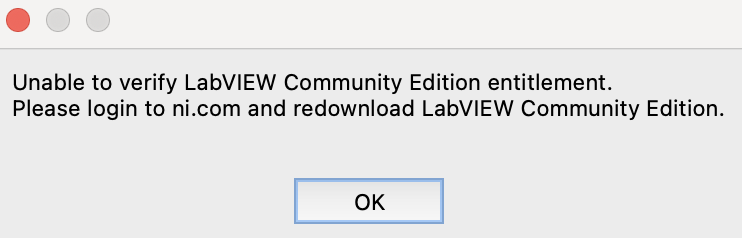
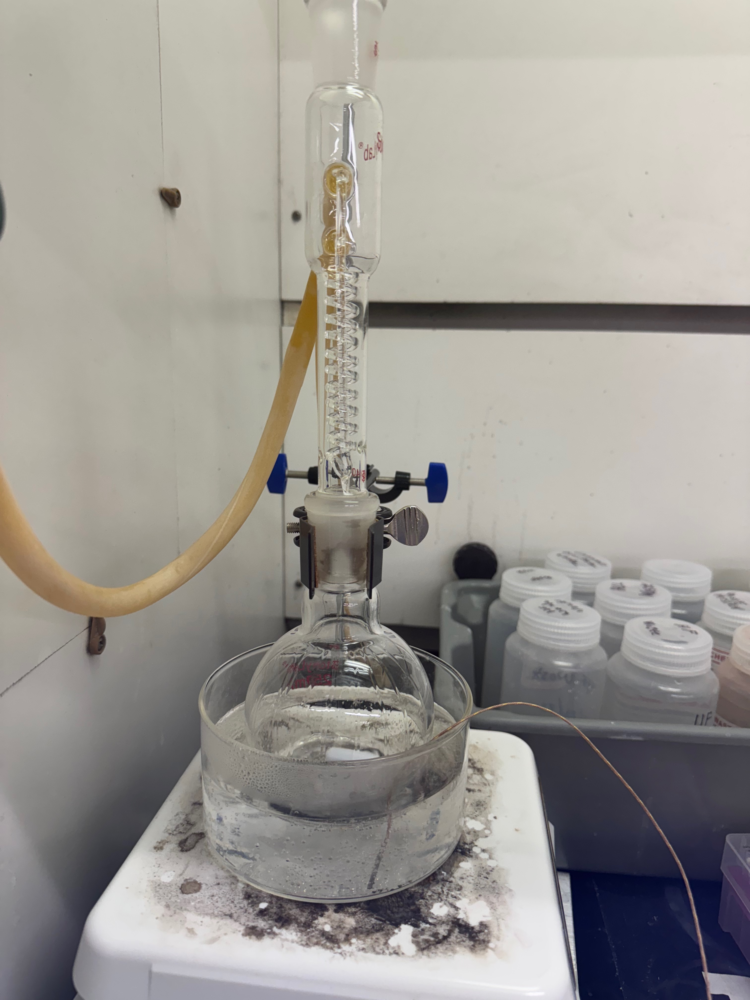
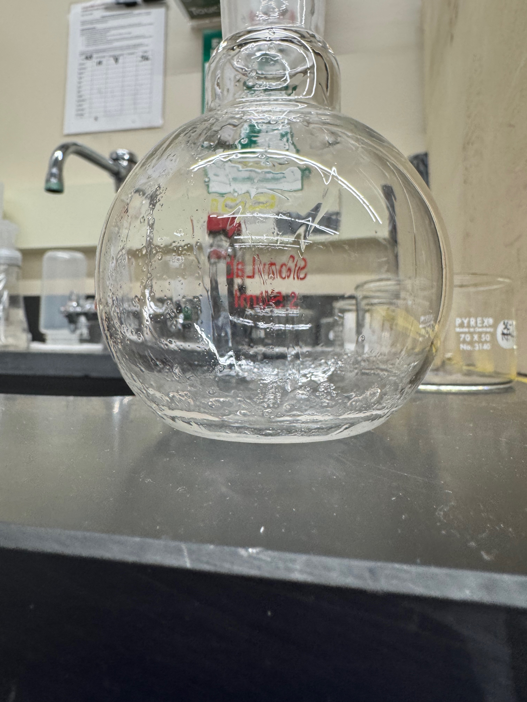
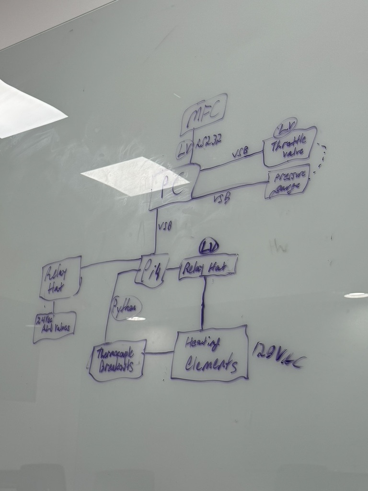

# Haewon Uhm

## Update 1&#x20;

**Accomplishments**&#x20;

* Completed the project proposal and went over it with the TAs&#x20;
* Set up the reflux apparatus in the acid fume hood (SOG)
* Decided to start with replicating the ProjectsInFlight formulation with later tests of catalysts, altering the ratios of ethanol, phosphoric acid, and boric acid (SOG)&#x20;
* Learned in greater detail the systems involved with the ALD controls (ALD)&#x20;

**Challenges**&#x20;

* Still having trouble downloading LabVIEW onto my computer
* Will probably need assistance from Viswesh&#x20;

<figure><figcaption>
Issue that comes up when trying to download LabVIEW multiple times. 
</figcaption></figure>

**Future Plans**&#x20;

* Solidify the plans for SOG and get more acclimated to the lab overall
* Do more research on the chemicals involved, narrowing down the many possibilities of failure (especially the boric acid)&#x20;
* Download LabVIEW and start learning how to use the system&#x20;
* Gain access to the LabVIEW for the ALD&#x20;

## Update 2 (SOG)&#x20;

**Accomplishments**

* Ordered 95% ethanol that is needed to replicate the ProjectsInFlight formula&#x20;
* To start testing, decided to use isopropyl alcohol as an ethanol replacement
* Looked into the Filmtronics ingredient list for 700B and found it possible to test ratios in the future

**Challenges**

* Realized we did not order ethanol, which is a key ingredient in the ProjectsInFlight video, so I have to wait until that comes in&#x20;
* Already resolved with Jay and Daniel&#x20;

**Future Plans**&#x20;

* Start testing the formulation of the n-doped spin-on glass using TEOS or TMOS, water, isopropyl alcohol, and phosphoric acid (ratios based on the video)&#x20;
* Might not work due to the less polar nature of IPA than ethanol and therefore not provide the emulsification that is needed for the water and TEOS/TMOS

## Update 2 (ALD)

**Accomplishments**

* Got more adapted to LabVIEW and was introduced to the ALD valve and heating element control systems on my computer
* Used a YouTube video to try and connect the MC DAQ to LabVIEW directly

**Challenges**

* Couldn't directly download the LabVIEW file from the GitHub due to the different version that is available for Mac versus Windows&#x20;
* Resolved with Viswesh&#x20;

**Future Plans**&#x20;

* Continue to try and connect the MCC DAQ to LabVIEW&#x20;
* If that does not work, make Python code that will alternatively do the job

## Update 3 (SOG)

**Accomplishments**

* Tested the ProjectsInFlight recipe with the exclusion of ethanol in place of IPA.
* Procedure can be found under 2/5/25 in the following doc: [https://docs.google.com/document/d/1Zv89gYlrvVO8jFVvS3HTmG\_rJBMBwB7pDHd5lRpelhI/edit?tab=t.0](https://docs.google.com/document/d/1Zv89gYlrvVO8jFVvS3HTmG_rJBMBwB7pDHd5lRpelhI/edit?tab=t.0)

<figure><figcaption>
Formula of the recipe tested.
</figcaption></figure>

**Challenges**

* After the heating, there was a residue inside the flask even after thoroughly washing (assuming it is glass).&#x20;
* The solution did not evaporate into the reflux apparatus and condensate back in to the flask at all (only condensate within the flask).&#x20;
* Our dopant on a chip was visibly darker in complexion in comparison to the commercial dopant on a chip.&#x20;
* More striations were present in the DIY SOG (not as smooth and might be due to the replacment of ethanol with IPA).

<figure><figcaption>
Shows the solution only condensing within the flask. 
</figcaption></figure>

<figure><figcaption>
Shows the residue that was present after cleaning the flask.
</figcaption></figure>

**Future Plans**

* In the video, there is somewhat direct heat contact between the flask and the hot plate without the use of a water bath, so higher contact temperature with the flask for a shorter amount of time should be tested with the same recipe from 2/5/25.&#x20;
* Research a type of silicate polymer that is compatible with the other ingredients shown below, and add that, along with reagent alcohol, to the purchase tracker.&#x20;

<figure><figcaption>
Ingredient list on the Filmtornics website for 700B.
</figcaption></figure>

* Vary the amount of 85% phosphoric acid by adding and subtracting 0.25 mL from the original 0.5 mL.&#x20;

## Update 3 (ALD)&#x20;

**Accomplishments**

* Found a way to connect the MCC DAQ to LabVIEW using InstaCal and ULx through this link: [https://files.digilent.com/manuals/QS%20ULx%20for%20NI%20LabVIEW.pdf?\_gl=1\*1oftj18\*\_ga\*MTU3NzI5NjAxMy4xNzM4NTcxMDcz\*\_ga\_YFKL15TK2S\*MTczODU3MTA3Mi4xLjAuMTczODU3MTA3Mi42MC4wLjA](https://files.digilent.com/manuals/QS%20ULx%20for%20NI%20LabVIEW.pdf?_gl=1*1oftj18*_ga*MTU3NzI5NjAxMy4xNzM4NTcxMDcz*_ga_YFKL15TK2S*MTczODU3MTA3Mi4xLjAuMTczODU3MTA3Mi42MC4wLjA)
* Instead of using the MCC DAQ to control the heating elements, relay hats and thermocouple breakouts will be connected to a Raspberry Pi 4 and the heating elements.&#x20;

<figure><figcaption>
Control system diagram.
</figcaption></figure>

* Connected the Pi 4 and tested the thermocouple relays with the python library and code provided by the adafruit: [https://learn.adafruit.com/thermocouple/python-circuitpython](https://learn.adafruit.com/thermocouple/python-circuitpython)
* Looked over the manual for the throttle valve software: [https://www.idealvac.com/files/manuals/CommandValve\_Generation\_II\_User\_Manual.p](https://www.idealvac.com/files/manuals/CommandValve_Generation_II_User_Manual.pdf)
  * DirectVac software only runs on windows
  * Open and close fully or open incrementally by 1º&#x20;
  * Any device capable of running a USB host and can communicate serial commands can precisely operate the CommandValve

**Challenges**&#x20;

* InstaCal and ULx only run on Windows, so I could not check it myself, but also later found out that LabVIEW is not compatible with the MCC DAQ, so we needed to find a new way.&#x20;
* Decided to scratch the use of a MCC DAQ as a whole.&#x20;

**Future Plans**&#x20;

* Look into how to run both ALD valves and the PID temperature LabVIEWs simultaneously once LabVIEW is downloaded onto the mini PC&#x20;
* Find the python block on LabVIEW and see if the python script runs on LabVIEW&#x20;
* Make python code that cycles through the thermocouples and averages the temperatures outputted, sending only one averaged value to LabVIEW&#x20;
* Need to transfer the temperature readings from the Pi 4 to a mini pc that is running LabVIEW (Pi 4 is quite slow).&#x20;
* Learn more about the adafruit library and code to accomplish the main task.

## Update 4 (SOG)

**Accomplishments**&#x20;

* Tested the ProjectsInFlight recipe with the exclusion of ethanol in place of IPA.
  * Recipes for each test can be found in the following doc: [https://docs.google.com/spreadsheets/d/11cc8vFxX2Cdq87uaElUpQxJZl3V7WWIpoaZI9dVXeNA/edit?gid=0#gid=0](https://docs.google.com/spreadsheets/d/11cc8vFxX2Cdq87uaElUpQxJZl3V7WWIpoaZI9dVXeNA/edit?gid=0#gid=0)
* Direct heat of 175ºC for 30 minutes on 2/13/25.

<figure><figcaption>
Before diffusing
</figcaption></figure>

<figure><figcaption>
After diffusing
</figcaption></figure>

* Direct heat of 100ºC for 15 minutes on 2/14/25.

<figure><figcaption>
Before diffusing
</figcaption></figure>

<figure><figcaption>
After diffusing
</figcaption></figure>

* Diffused the first sample made on 2/5/25.

<figure><figcaption>
Before diffusing
</figcaption></figure>

<figure><figcaption>
After diffusing
</figcaption></figure>

**Roadblocks**&#x20;

* No stir bar was used on 2/13/25 and might have been the reason for excessive residue at the bottom of the flask (need to order).&#x20;

<figure><figcaption>
Residue left at the bottom of flask
</figcaption></figure>

* There was a good amount of residue at the bottom of the flask that turned into a crystal-like powder after being left out in the flask for one day.&#x20;
  * The silica solid residue collapsed due to the dehydration of the solvent since it was left out (DI water and IPA).&#x20;
* Still not reaching the reflux apparatus (might be too little liquid for the size of the flask and the reflux apparatus).&#x20;
  * This shouldn't be an issue since there is condensation visible within the flask.&#x20;
* The leftover solution from the first sample (2/5/25) solidified into a gel consistency after a week in its container.
  * The SOG is not sustainable and has a short shelf life, which might be due to the speed of the reaction.&#x20;

**Future Plans**

* Continue to test the temperature and time&#x20;
  * Direct heat of 100ºC for 25 minutes.&#x20;
* Since I could not get to it last week, vary the amount of 85% phosphoric acid by adding and subtracting 0.25 mL from the original 0.5 mL.&#x20;
  * Increasing the phosphoric acid increases viscosity, and decreasing is okay as long as the pH is within the range that minimizes the reaction speed or else the shelf life of the dopant will tank (pH of 3-4)
* HF etch the previous chips and test the conductivity using the probe station.&#x20;
  * Look into how you know the dopant is successful and the range of all the components.&#x20;
* Grasp a better understanding of why the results are turning out the way they did, especially the test from 2/13/25

## Update 4 (ALD)

**Accomplishments**

* Found the python node on LabView.
  * Functions palette, connectivity, python.

<figure><figcaption>
Python node on LabVIEW
</figcaption></figure>

*   Instead of working and testing the python code all at once, I focused on writing the code to average the temperatures read from one thermocouple on the Raspberry Pi.&#x20;

    <figure><figcaption>
Python script added to the Raspberry Pi
</figcaption></figure>
* Able to run multiple VIs through a primary VI by calling multiple subVIs through the primary VIs:&#x20;
  * [https://knowledge.ni.com/KnowledgeArticleDetails?id=kA03q000000YHyLCAW\&l=en-US](https://knowledge.ni.com/KnowledgeArticleDetails?id=kA03q000000YHyLCAW\&l=en-US) (use to get started in the future).
  * [https://forums.ni.com/t5/LabVIEW/How-do-I-run-2-or-more-VIs-simultaneously/td-p/276636](https://forums.ni.com/t5/LabVIEW/How-do-I-run-2-or-more-VIs-simultaneously/td-p/276636) (helpful if there are issues).

**Roadblocks**

* Could not run the python script on LabView since it is incomplete.&#x20;
  * With the absence of a mini PC, would it be reasonable to figure out how to run the script through the PI instead of from the mini PC?&#x20;
* Had difficulty analyzing whether the code was averaging different temperatures due to the fact that the same number was repeatedly being outputted
  * Would it be possible to check with a wider range of temperatures to see if the output changes in that case?

**Future Plans**

* Confirm whether my python script is averaging the temperatures correctly.&#x20;
  * Could attempt to make a list of random values to average, importing the random library to do so.
* With the use of serial ports, run the python script on more than one thermocouple breakout.&#x20;
* Work on the section of the main function code where the data will be sent.&#x20;

<figure><figcaption>
Format of the main function
</figcaption></figure>

## Update 5 (SOG)

**Accomplishments**

* Tested the resistivity of chips 637 and 639 (got rid of 640)
  * 637: around 20 ohms
  * 639: around 25 ohms&#x20;
* Replaced the tubing for the water supply that reaches the drain
* [https://webbut.unitbv.ro/index.php/Series\_I/article/view/6140/4712](https://webbut.unitbv.ro/index.php/Series_I/article/view/6140/4712)
  * Increasing TEOS concentration will increase viscosity
  * If the particles grow too large, precipitation takes places
  * The time of gelation decreases for low water ratio
  * Heating at relatively high temperatures (100-500ºC) will accelerate the hydrolysis and condensation, removes the organic species, and forms SiO2 bonds

**Roadblocks**

* Didn’t have a sample with the commercial SOG
* Does the precipitate that is formed actually impact anything

**Future Plans**&#x20;

* Characterize and compare whether the resistivity is in the general range of a commercial SOG
  * Make a chip sample with P504
* Try the p-doped SOG using boric acid
* Do more research on sol gel components

### Feedback

* important distinction - what we measured on the chips is corner-to-corner surface resistance, which is not very consistent. We want to do a proper resistivity test using resistor patterns to properly measure it with the probe station
* The source on sol-gel is interesting- if we can better understand how to avoid the residue that would be great :thumbsup:&#x20;
* I think all the chemicals we'll need are here! let's make more samples to test :)

— Daniel

## Update 5 (ALD)

**Accomplishments**

* Found out how to localize the python on the Raspberry Pi
  * [https://roboticsbackend.com/raspberry-pi-run-python-script-in-the-terminal/#Run\_Python\_code\_directly\_on\_the\_terminal](https://roboticsbackend.com/raspberry-pi-run-python-script-in-the-terminal/#Run_Python_code_directly_on_the_terminal)
  * Using a nano terminal
  * Need to localize on the PC since LabVIEW can't connect to the Pi directly
* Integrated the thermocouple DAQ onto the physical Pi
* Tested the code to test the thermocouple DAQ but threading is not needed&#x20;

**Roadblocks**

* Still working on LabVIEW connection

**Future Plans**

* Using the new libraries for the thermocouple DAQ, make a new code that will average the data and send to LabVIEW
  * Replace the libraries that are for the thermocouple DAQ
  * Multiple thermocouple connections
* LabVIEW connection
  * Return value: [https://forums.ni.com/t5/LabVIEW/Specifying-Return-Type-for-Python-Node/td-p/3932556](https://forums.ni.com/t5/LabVIEW/Specifying-Return-Type-for-Python-Node/td-p/3932556)
    * Resolved issue from NI for the return value
    * Control of type double
  * Module block:
    * Test a sample code on the local PC and run on LabVIEW
  * Look into SSH commands&#x20;
    * [https://bitbucket.org/ChrisCilino/raspberry-pi/src/master/](https://bitbucket.org/ChrisCilino/raspberry-pi/src/master/)
