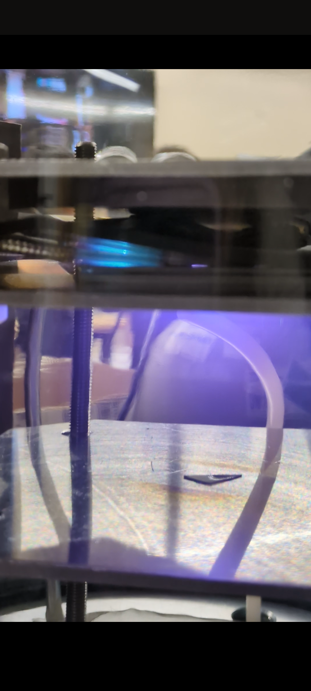
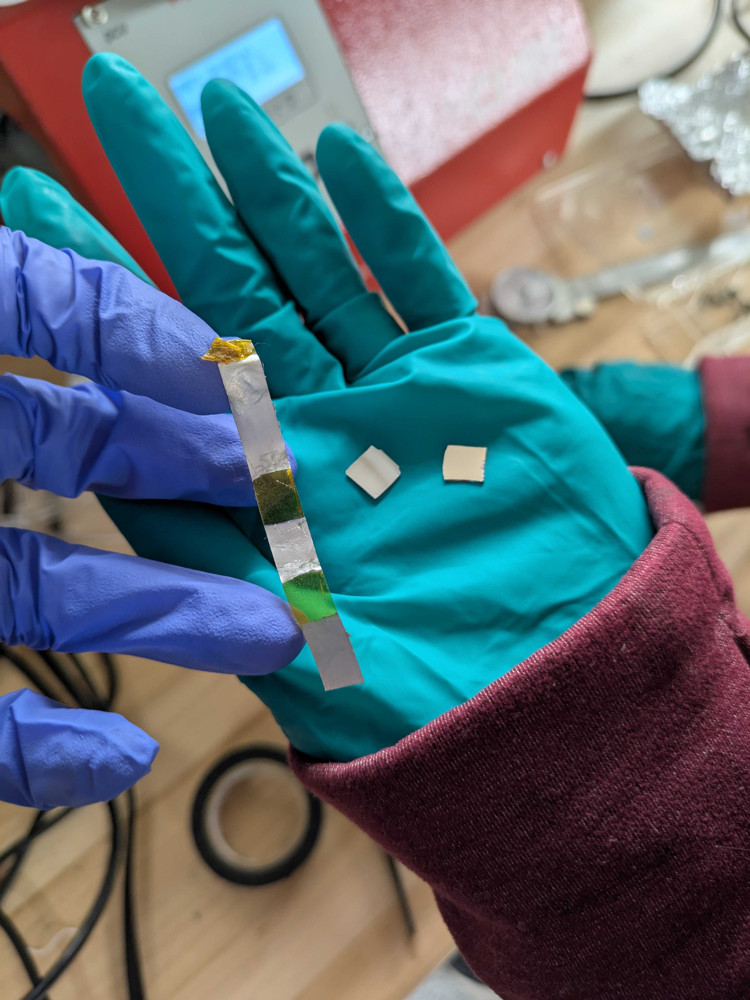

# Katie Eisenman

### <mark style="color:purple;">Update 9 - 3/30/2025</mark>

#### Accomplishments

* See project tracker here: [https://github.com/orgs/hacker-fab/projects/36/views/1](https://github.com/orgs/hacker-fab/projects/36/views/1)
* We replicated a previous paper's reactive evaporation procedure of aluminum oxide and saw what looks to be pretty good successes. Pics and videos of each trial can be found here: [https://drive.google.com/drive/folders/1PG48lTpIP-3RQL021rz6597xQAtxHhN4](https://drive.google.com/drive/folders/1PG48lTpIP-3RQL021rz6597xQAtxHhN4), and the parameters used for each trial can be found here [https://docs.google.com/spreadsheets/d/1O67ansNDFr7AUBcyVnXadPWayfpV0HPwh4IFn5GLq1o/edit?gid=0#gid=0](https://docs.google.com/spreadsheets/d/1O67ansNDFr7AUBcyVnXadPWayfpV0HPwh4IFn5GLq1o/edit?gid=0#gid=0)
  * We did a first trial just to see if it was feasible and ended up with a film that was almost golden in color and definitely looked visually different than the normal evaporated aluminum
  * .png>)
  * We then did another trial to try and see the upper limit of oxygen we could put into the chamber and still get an evaporated sample. We started at 3 sccm oxygen, then went up to 5 sccm, then back down to 4 and then 3.5 sccm. The resulting films were more like dark silver in color than the previous test (see first pic below). We were getting some odd readings from the QCM, so we stopped the test, and when we opened the chamber door not all the aluminum was melted so Melinda stayed behind to do another test to use up the rest. She tested up to 30sccm oxygen, and the resulting film looked kind of burnt (in my opinion) and was very dark brown in color
  * .png>).png>)
  * We then made a plan to test the electrical properties of these types of films through CV testing, and then Melinda and I sputtered normal Al on two p doped silicon chips to prepare building our capacitor-esque setup next week

#### Roadblocks

* Honestly, none coming to mind. I guess Carnival being this week means we won't get anything done Thursday/Friday/Weekend, but Melinda and I have a plan to get stuff done earlier in the week. I'm also personally very excited that our experiment actually worked lol, it's nice to feel like I'm accomplishing something.

#### Plans

* Based on the paper I found (also sent it in discord, [https://www.sciencedirect.com/science/article/pii/0040609076906131](https://www.sciencedirect.com/science/article/pii/0040609076906131)) with the chart of film thicknesses of aluminum oxide with their corresponding colors, I think XRR is worth a shot because both films could plausibly be under 100nm given that their colors are golden brown and brown/violet (potentially) respectively
* .png>)
* I'd also like to do XRR of Matt's sputtered aluminum oxide film that is a similar color to our third film just to compare and see if they give similar results. This would be a nice sanity check.
* Melinda and I are planning to create the aluminum/reactively evaporated aluminum oxide/aluminum layered setup on Monday as we discussed last Friday. Then we can do CV testing and see what the dielectric constant of the (potential) aluminum oxide film is compared to just an aluminum layer.&#x20;
* Now that we have AFM tips, we can do more AFM practice!! I will probably practice on Matt's sputtered films

### <mark style="color:purple;">Update 8 - 3/23/2025</mark>

#### Accomplishments

* See project tracker here: [https://github.com/orgs/hacker-fab/projects/36/views/1](https://github.com/orgs/hacker-fab/projects/36/views/1)
*   Did some literature review on the feasibility of reactive Al evaporation/ oxidation

    * I first just checked if we could still do this in air at high temperatures without impurities like aluminum nitride by checking out the Ellingham diagrams. TLDR as long as we don't do it in a high nitrogen environment there will be no problem, which is very reassuring. Most of the articles I read about reactive Al evaporation did it in an oxygen environment anyway, but on the off chance we couldn't do that (I'm not sure if we have access to oxygen gas/what the safety concerns would be if we heated oxygen gas up) I just wanted to check.

    <figure><figcaption>
<a href="https://www.researchgate.net/figure/Nitrides-formation-Ellingham-diagram-The-figure-was-reproduced-from-Ref-7-courtesy-of_fig1_334187423">https://www.researchgate.net/figure/Nitrides-formation-Ellingham-diagram-The-figure-was-reproduced-from-Ref-7-courtesy-of_fig1_334187423</a>
</figcaption></figure>

    * I also looked into pure thermal oxidation to see if we could use it to make films of reasonable sizes, and this study ([https://www.sciencedirect.com/science/article/pii/S0040609002007873](https://www.sciencedirect.com/science/article/pii/S0040609002007873)) is promising in terms of achieving an average Al2O3 film size of 30nm at a temperature of 500C under a PO2 of 1.33 \* 10^-4 Pa. They used XPS and HREM (High Resolution Electron Microscopy) to measure the size of the films. XPS isn't great for larger films but HREM (which is a type of TEM) can achieve a resolution of 0.2nm, which was used to measure the films. This study also observed that above 400C, after longer oxidation times, the amorphous Al2O3 eventually becomes gamma phase Al2O3, which is important to keep in mind.
    * Read through other papers about reactive evaporation of aluminum [https://docs.google.com/spreadsheets/d/1TKB6aHW9vdk9iT3zZkKUyYFrIMQ4lUR3xLNAh300AFA/edit?gid=1637598523#gid=1637598523](https://docs.google.com/spreadsheets/d/1TKB6aHW9vdk9iT3zZkKUyYFrIMQ4lUR3xLNAh300AFA/edit?gid=1637598523#gid=1637598523) Some observations about the different studies are that the temperatures range greatly from 100 - 800 C, but many studies had success around 400 - 600C. Many also used pure oxygen gas flow into the system (either alone or combined with Argon) rather than using an air environment.&#x20;

#### Roadblocks

* Chamber V2 is still in the works - I'll see what I can contribute this week! (I can actually attend all classes/work times this week lol)
* I am a little concerned about the fact that most of the sources we were looking at used oxygen gas flow, because it seems like kind of a hazard to flow it and heat up the system (explosions are bad). I'm wondering if EHS would be opposed, and also I'm not sure if either Hacker Fab or the MSE UG lab even has oxygen gas we could use to flow through something like a tube furnace. I know the MSE UG lab has a furnace that Melinda used in her capstone to flow Argon gas, so a setup does already exist to contain gas in a furnace.

#### Plans

* Coordinate with Matt once he gets back from the conference to get sputtered films from him
* Characterize Matt's films with XRR and AFM (fingers crossed the tips get delivered this week!)
* Look into feasibility of flowing oxygen for an oxidation/reactive evaporation test
* Help with V2 build/setup however I can

### <mark style="color:purple;">Update 7 - 3/16/2025</mark>

#### Accomplishments

* See project tracker here: [https://github.com/orgs/hacker-fab/projects/36/views/1](https://github.com/orgs/hacker-fab/projects/36/views/1)
* Did another session of AFM with Joel, and we came to the conclusion that the AFM tips he had given us were all broken because no matter what we tried we couldn't get images. I feel slightly vindicated because I wasn't sure if it was my inexperience with the machine the first time. Joel has since ordered us more AFM tips and they will hopefully be delivered soon.
* Finished the AFM SOP and wrote up our midsemester documentation with Melinda

#### Roadblocks

* I was pretty sick for several days so I missed class and work times :( I am feeling better now so this week I should be able to do a lot more.
* No sputtered samples :( I am optimistic the build/power supply teams will be able to figure out RF sputtering soon. I do not have a lot of ECE/MechE skills but I'm happy to help where I can.

#### Plans

* Talk to Matt and get sputtered film samples
* Perform AFM once tips arrive on sputtered films from Matt
* Assist with fixing the V1 sputtering chamber and try to get some sputtered aluminum oxide films!!
* Do more XRR with Melinda (may not be possible this week since MCF is doing some construction)

Response - Jay

* Recap of meeting 3/17
  * Next steps are to assess the viability of reactive Al evaporations, and/or cycles of Al evaporation followed by oxidation.

### <mark style="color:purple;">Update 6 - 3/2/2025</mark>

#### Accomplishments

* See project tracker here: [https://github.com/orgs/hacker-fab/projects/36/views/1](https://github.com/orgs/hacker-fab/projects/36/views/1)
*   Ran a DC sputtering test with Melinda on Tuesday - 44.29 total minutes before we switched to an RF power supply

    * No visible material deposited but it wasn't run for that long
    * Decent plasma confinement, but there was some arcing and it looked like it was arcing to the coax cable, possibly to the shielding (see below, blue stuff is arcing)

    
* Did AFM with Melinda on Wednesday - but got bad results :( Getting a good AFM image is hard (I have plans to overcome this, see Plans section) but I did take lots of notes and helpful pictures for my SOP. I feel a lot more confident now about setting up the machine (the tips are annoying to work with and also making sure everything is centered is difficult) and will be adding detailed notes to my SOP by next Sunday: [https://docs.google.com/document/d/1Om9A9HU8gnEE8mBFWFuM3S4So36rKFXuMusyGv7xwBE/edit?tab=t.0](https://docs.google.com/document/d/1Om9A9HU8gnEE8mBFWFuM3S4So36rKFXuMusyGv7xwBE/edit?tab=t.0)

#### Roadblocks

* The main roadblock is not actually having real sputtered samples to characterize, but Melinda and I talked to Matt in class on Thursday, and he said he had some old sputtered samples we could use. We are going to talk to him and get some that we can work with and see how the results from the thermally grown oxides differ so we know what we should be looking for.

#### Plans

* I'm doing AFM with Joel over Spring Break (this Wednesday)! He has a lot of experience and I think getting more practice with his help will ensure we can get much better images.&#x20;
* Get sputtered samples from Matt and perform XRR and AFM trials and compare results to those from oxide samples
* Do more DC sputtering trials after break, also do more RF trials with the new power source system
* Do more literature review on calculating roughness from AFM
* Finish SOPs by next Sunday, finish other documentation of previous sputtering trials

### <mark style="color:purple;">Update 5 - 2/23/2025</mark>

#### Accomplishments

* See project tracker here: [https://github.com/orgs/hacker-fab/projects/36/views/1](https://github.com/orgs/hacker-fab/projects/36/views/1)
* I worked with Melinda to develop our presentation for last Tuesday. We worked through a few drafts and rehearsed it together several times. We also got a lot of interesting questions afterwards that gave me a lot to think about (will discuss more below in plans)
*   I also helped Melinda collect XRR data on the thermally grown aluminum oxide chip. We experimented with some XRR data processing software to try and determine the thickness. It has a lot of cool tools that I want to learn how to use.

    <figure><figcaption></figcaption></figure>
* Melinda and I also prepared the chamber for DC sputtering by cleaning every surface and remaking the Teflon spacers. However, we ran out of time and couldn't find the cheat pin so we weren't able to run a DC trial.&#x20;

#### Roadblocks

* Aside from the RF sputtering still not working, I think my personal biggest roadblock is it's hard to find big chunks of time (like 3 hours or so) to be able to do everything like collecting data or sputtering trials. Running sputtering trials takes so long in terms of setup and then actually being present to run the test. I was also super busy this past week because I had another midterm presentation and a lot of stuff to do for other classes/research. But this week, I have a lot more blocks of free time so I should be able to schedule plenty of time to do the longer tasks.

#### Plans

* Based on the questions we got from the presentation, there are a few more things I want us to look into:
  * I want to find the resolution limit of the EDS on the SEM in the MSE undergrad lab
  * I want to do a deeper literature review on how we can quantify roughness of the whole sample based on some small sections of it under AFM. I also think we should look more into calculating the density and porosity of the films
* Actually get AFM tips from Joel this week (didn't have time to do AFM last week)
* Perform an AFM trial on thermally grown aluminum oxide
* Continue updating AFM SOP
* Make a new cheater pin and run a DC sputtering trial
* Maybe do another XRR trial if time permits

#### Response - Jay

* l'm curious to see how cross sections look on the MSEUG benchtop SEM. If they look good, I want to look at cross sections of Martas metal contacts to characterize Al spiking.
* lmk if u need help with the DC cheater plug
* Rahim and I have been working to setup an old donated sputtering RF power supply. We tried to use it in the past but the associated matching network was broken, so it couldn't strike any plasma. Now we are retrying it, buy using our 300W antenna tuner as the matching network. This should be ready sometime his week, ideally tn (Tuesday). The idea is that this power supply will have much higher Vp-p. This will help us determine if the chamber is the problem or the the low Vp-p on our radio power supply is the problem. Regardless, this may let you start doing RF process dev soon.

### <mark style="color:purple;">Update 4 - 2/16/2025</mark>

#### Accomplishments

* See project tracker here: [https://github.com/orgs/hacker-fab/projects/36/views/1](https://github.com/orgs/hacker-fab/projects/36/views/1)
* Evaporated Al onto two chips to use for XRR/AFM testing with Melinda. The final size from the QCM was around 1.6 k Angstroms, so slightly larger than what we were aiming for (1 k Angstrom), but still workable. If we evaporate again we need to remember to set the current to lower than 45A to start. We also had a bit of trouble getting the chips off the tape so they ended up a tad bit scratched, which may have contributed to rough XRR results. Hopefully this means we will have many observable features on AFM though.
  *

      <figure><figcaption></figcaption></figure>
* Observed/helped out with another RF sputtering trial at high pressure, but unfortunately nothing was deposited again :( There was a strange shiny-ness (see below, the almost blue tinted splotch near the top) observed on the Al target after, but really no other evidence of sputtering

<figure><figcaption></figcaption></figure>

* Performed XRR trial with Jay and Melinda on one of the evaporated chips, took many pictures/videos to be used for SOP (see folder with pics/videos here: [https://drive.google.com/drive/folders/1gZTIkKDhvZFrmSh1t8Wdxa14xSfIIauH?usp=sharing](https://drive.google.com/drive/folders/1gZTIkKDhvZFrmSh1t8Wdxa14xSfIIauH?usp=sharing)
  * Data from the test can be found here: [https://drive.google.com/drive/folders/1KTogftj\_zDFrn7nC8pkHbGv47KBVDxv9?usp=sharing](https://drive.google.com/drive/folders/1KTogftj_zDFrn7nC8pkHbGv47KBVDxv9?usp=sharing)

#### Roadblocks

* Obviously, the main roadblock right now is the fact that RF sputtering isn't working. I've been doing some researching and aside from being able to check the DC bias of the plates in the chamber (which to my understanding would be pretty difficult), I'm not really sure what else we can test with RF sputtering. I'd like to go back to DC sputtering to just double check that everything with the chamber is functional for that process. I think we will be able to narrow down the problem more efficiently regardless of the outcome of the DC sputtering trial, because at least we'll know it's either the chamber system itself or the RF system. Reproducibility of results is very important, as I have had to learn in my other research projects :) After that, we can eventually use the other power source (hopefully, if it works) from the Nanofab.&#x20;

#### Plans

* Finish presentation for presentation on Tuesday
* Start writing SOP for AFM (Melinda is going to do XRR)
* Perform DC sputtering trial as a sanity check, then start narrowing down what could be wrong with RF sputtering (assuming nothing is wrong with the chamber itself)
* Get AFM tips from Joel
* Perform an AFM trial on evaporated Al chip samples
* Grow some aluminum oxide in the furnace for further AFM/XRR testing

#### Responses - Jay

* Given the chamber roadblocks, I think continuing to workout XRR with thermal oxide and sanity checking the evaporated Al samples with AFM techniques makes sense.
* Rahim and I are working on upping the Vp-p of th rf supply in hopes that low Vp-p has been the issue. If this doesnt work, we will start doing reactive DC with V1 chamber.
* Overall thankyou for the well detailed update with pics!

### <mark style="color:purple;">Update 3 - 2/9/2025</mark>

Accomplishments

This week, I:

* Did AFM training with Melinda (see pictures of notes). There are a lot of different settings we'll have to mess with in order to get good images, but I am confident we will be able to do so. Andrew in MCF is also super helpful, and I'm sure he could help us in our first few sessions if necessary. I think this will be a good sanity check to the results we get from XRR.

<figure><figcaption></figcaption></figure>

<figure><figcaption></figcaption></figure>

<figure><figcaption></figcaption></figure>

* Did XRR training with Jay and Melinda (see picture of my notes). Assuming we can actually get samples next week I'd like to start running trials right away because I think this will be able to provide us with a lot of good information about thickness and potentially density.&#x20;

<figure><figcaption></figcaption></figure>

* I also helped run several different trials of the sputtering chamber this week.&#x20;
  * On Thursday, we discussed the new chamber development and the state of the current chamber. I suggested removing the top plate because based on my understanding, we were basically creating a second sputtering chamber on top of the one we wanted. I thought this because of the common occurrence of plasma appearing between the top two plates, and wondered if this could be pulling a lot of power and preventing significant sputtering on the chip. However, removing the top plate didn't work, as can be seen in the image below, because the plasma just kind of spread out even further.&#x20;

* Melinda and I spent some time on Saturday reviewing literature to find examples of other sputtering trials, which can be found here: [https://docs.google.com/spreadsheets/d/1TKB6aHW9vdk9iT3zZkKUyYFrIMQ4lUR3xLNAh300AFA/edit?gid=465241598#gid=465241598](https://docs.google.com/spreadsheets/d/1TKB6aHW9vdk9iT3zZkKUyYFrIMQ4lUR3xLNAh300AFA/edit?gid=465241598#gid=465241598). We also were brainstorming what could be wrong with the chamber, then joined Jay and observed him running another sputtering trial. He figured out that our system was missing a blocking capacitor and that was likely why we hadn't been sputtering anything!!! Because (to my understanding, I still need to read into this more, ECE stuff is hard lol) the AC current will just resolve any charge buildup between the plates that causes sputtering within a few cycles.&#x20;

#### Roadblocks

* The main roadblock was the fact that the sputtering chamber has not been able to produce a sample for us to start testing yet... But hopefully with the addition of the blocking capacitor that will change!&#x20;

#### Plans

* Purchase AFM tips after Andrew gets back to us about the best ones to buy
* After the blocking capacitor is added, make some sputtered aluminum samples!!!
* Assuming we can successfully get samples, I'd like to perform a few XRR trials and practice quantifying thickness. I also want to do some AFM.
  * Even if we can't get samples, I'd like to take some chips with either spin on glass or some kind of patterning to practice looking at under AFM and getting rid of image artifacts.
* Read more about RF sputtering and how it works so I can solidify my understanding of the system and why we need a blocking capacitor.

#### Response - Jay

* Good job completing both AFM and XRR training, good job helping with sputter chamber debugging.Comment
* As discussed in person, RF sputtering test wont be fruitful until we implement a blocking capacitor. So I would prioritize XRR practice on oxide and evaporated Al samples.Comment
* Based on: [https://www.lesker.com/newweb/ped/rateuniformity.cfm](https://www.lesker.com/newweb/ped/rateuniformity.cfm) I worry that the oxide sputter test (hoping oxide acts a blocking cap itself) may not be a good use of time, since we may have to sputter for ridiculous amounts of time to see anything). Which is also another good reason to do Reactive Al Rf sputtering instead of Al2O3 target sputtering.Comment
* DC Al sputter tests may still be interesting this week.
* Please make sure github project tracker is accurate and updated

### <mark style="color:purple;">Update 2 (02/02/2025)</mark>

**Accomplishments**

* Met with Professor Sokalski to learn more about XRR and how it works. It seems like it will be the best tool to determine sample thickness and potentially density. I took notes during the meeting that can be found here: [https://docs.google.com/document/d/11MBv83tX0nFboJv7nk2iF1xpBTiB1wlXRQb5I7Rys-I/edit?tab=t.0](https://docs.google.com/document/d/11MBv83tX0nFboJv7nk2iF1xpBTiB1wlXRQb5I7Rys-I/edit?tab=t.0)
* Ran an RF trial on the sputtering chamber with Jay, Melinda, Rahim, and Ayan. We tested several different parameter combinations, starting by changing the frequency, then altering the argon pressure and thus chamber pressure. Unfortunately, nothing was sputtered onto the slide and a piece of the system broke during our test. I recorded observations and the parameters tested, which can be found here: [https://docs.google.com/document/d/1djYb2jFaWNsHtIddbWhw9eNRoR0uh7QR40o2pBkO11E/edit?tab=t.0](https://docs.google.com/document/d/1djYb2jFaWNsHtIddbWhw9eNRoR0uh7QR40o2pBkO11E/edit?tab=t.0)
* I did the first lab! (And only dropped the chip like three (?) times)

**Roadblocks**

* The main roadblock is that so far we haven't got the chamber to sputter an observable layer. Jay, Melinda, and I are going to scour the literature to try and determine the problem (maybe DC bias on the target, maybe something else) and find a solution.

**Plans**

* Do AFM training with Melinda this Thursday (it can complement XRR so I think it's worth having the option)
* Read more literature to try and find a solution to the lack of sputtered material
* Perform more RF trials and try to get samples to use for XRR/AFM so we can start developing a protocol
* Do the next part of the lab

#### Responses - Jay

* make ssure youre updating project tracker
* Good job finalizing choice of XRR for characterization

### <mark style="color:purple;">Update 1 (01/26/2025)</mark>

#### Accomplishments

* Saw and helped operate the sputtering chamber twice
* Developed proposal with Melinda for what we are going to accomplish for the sputtering process this semester
* Worked with Jay and Melinda to make our first samples
* Requested AFM training, scheduled a meeting with Professor Sokalski to discuss XRR/XRD for thin films

#### Roadblocks

* Nothing aside from being out of town this past weekend, which just meant I didn't have time to do much work

#### Plans

* Start reading literature on how to characterize thin films with XRR, AFM, and other techniques
* Perform more sputtering trials and get better at operating the chamber independently
* Do the first lab

### <mark style="color:purple;">Update 0 (01/19/2025)</mark>

#### Accomplishments

* Read sputtering documents from last semester, read project primers
* Did the prereadings and spent time making sure I understood the fabrication processes as this is mostly new information for me
* Met with my partner Melinda for the sputter process project and helped each other understand the current state of the project and our task
* Met the rest of the sputter team and saw the sputter chamber in person to see how it works

#### Roadblocks

* Nothing major so far,  there's just a lot of new content to learn quickly but I think I have a good handle on it

#### Plans

* Review external literature to prepare for project proposal
* Meet with Melinda to discuss our plans and split up responsibilities
* Draft project proposal

