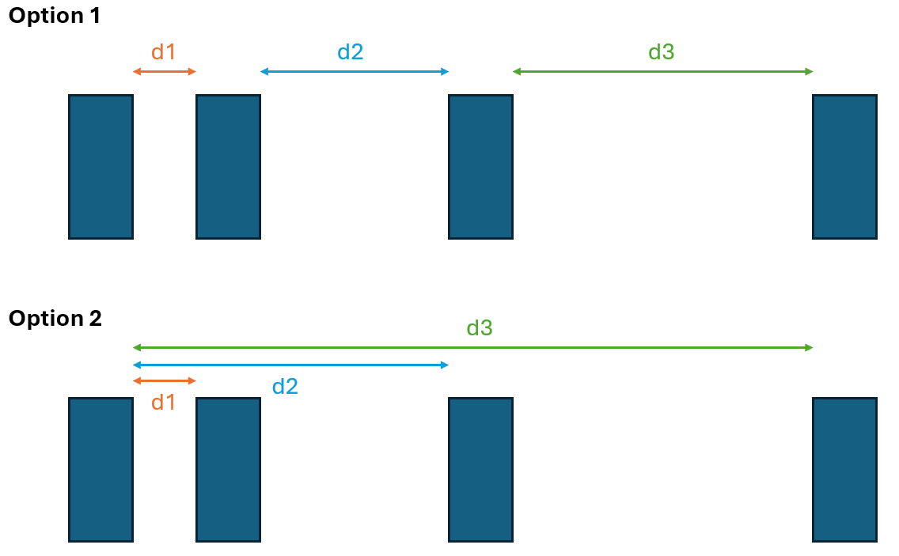

# Marta Freitas

***

### <mark style="background-color:blue;">Weekly Update #0 (Jan 18)</mark>

#### <mark style="color:blue;">Accomplished this week</mark>

Familiarized myself with the project, by reading the project primer and F24 documentation to assess what has been completed and what are the next steps. Had the initial group meeting with the team and was presented with two problems to be tackled this semester. Performed a literature review on both problems, including the suggested reading "Modern Semiconductor Devices for Integrated Circuits" (chapters 1, 4, 5, 6). Achieved a satisfactory comprehension of both problems and became inclined toward one of them.

#### <mark style="color:blue;">Roadblocks/Challenges</mark>

The major challenge was getting familiarized with new concepts. No roadblocks at the time.

#### <mark style="color:blue;">Plans for next week</mark>

Determine the problem to tackle. Define a concrete plan and write the project proposal.

***

### <mark style="background-color:blue;">Weekly Update #1 (Jan 26)</mark>

#### <mark style="color:blue;">Accomplished this week</mark>

Determined that I am going to be working on the metal contacts problem. Performed a literature review to better understand it. Reviewed previous documentation to assess the current state of the problem in the lab and determine what will be my first steps. Came up with a plan and wrote the proposal.

#### <mark style="color:blue;">Roadblocks/Challenges</mark>

No roadblocks at the time.

#### <mark style="color:blue;">Plans for next week</mark>

Will have the first training in the lab with the team.  Will receive feedback from the project proposal and define concrete first steps and determine what changes need to be made to the initial plan.

#### Responses

* From Jay
  *   For the progress update, be sure to link to the document(s) that show evidence of your progress. this week that would be a link to you project proposal

      For roadblocks, this is an opportunity to request help, or clarify what you need from us to keep moving forward. I would argue training on certain equipment to be roadblock for you.

      For plans, include more detail, or a working doc with more detail that we can look at to help give concrete advice. For example, clarify which trainings youre prioritizing to help you start fabing test devices. As for determining what changes need to be made, be specific, are we going to update the order of experiments? which experiments we will prioritize (thermal processing vs surface cleaning vs Ni contacts etc)? creating fabublox process flows for the test devices you want to make? Adding detail in you plan helps us give you advice. The more concrete plans you provide, the better we can help. These plans can be reflected in a working doc instead of typing it in the update, but be sure to link that doc and direct us on what part we should read over.
* From Cesely
  * Great work this week! I think that for the next couple of weeks the work is very well outlined for getting baseline contact resistance measurements using the transmission line method as expanded upon in your proposal. This week you should focus on making a Fabublox (link below) for the baseline testing and annealing testing as well as aim to start fabricating. https://www.fabublox.com/?code=tjb5YB9SR-N0rRKGmp6otki2udn6CikvKoSqdh\_Xza4uW\&state=cTBYYUpKUW4yMjZBZVFSQ2pYMm5lUlVKZC1iUHZGYkpxRnhodUJ0d2pfaQ%3D%3D

***

### <mark style="background-color:blue;">Weekly Update #2 (Feb 2)</mark>

Tasks: [https://github.com/orgs/hacker-fab/projects/35/views/1](https://github.com/orgs/hacker-fab/projects/35/views/1)

#### <mark style="color:blue;">Accomplished this week:</mark>

* Completed all the training that was needed to start fabrication.&#x20;
* Created Fabublox process for baseline testing ([https://www.fabublox.com/process-editor/2b1a8f1f-8915-4e10-83a6-1cb50809dc19](https://www.fabublox.com/process-editor/2b1a8f1f-8915-4e10-83a6-1cb50809dc19))
* Created Fabublox process for annealing testing ([https://www.fabublox.com/process-editor/0bf4952c-a946-4297-88c2-b4ad10fb9143](https://www.fabublox.com/process-editor/0bf4952c-a946-4297-88c2-b4ad10fb9143))
* Created Fabublox process for Ni contacts testing ([https://www.fabublox.com/process-editor/dd27629e-aa67-4ec5-8450-e68649ff62fc](https://www.fabublox.com/process-editor/dd27629e-aa67-4ec5-8450-e68649ff62fc))
* Defined the parameters to be extracted from IV and CV measurements ([https://docs.google.com/document/d/1kRxrYw\_IqMbyyWSPSQffWJJDcG3zCKjm/edit?usp=sharing\&ouid=104911347651865134602\&rtpof=true\&sd=true](https://docs.google.com/document/d/1kRxrYw_IqMbyyWSPSQffWJJDcG3zCKjm/edit?usp=sharing\&ouid=104911347651865134602\&rtpof=true\&sd=true))
* Started the chip fabrication for baseline testing following my Fabublox process flow

#### <mark style="color:blue;">Roadblocks/Challenges:</mark>

Fabrication this week could have been better. Started with 3 chips but lost 2 in the spin coater. Decided to take this first fabrication to the end with only the remaining chip. I would say my major challenge is getting accustomed to the equipment and processes.

#### <mark style="color:blue;">Plans for next week:</mark>

* In terms of fabrication, my plan is to have at least 3 viable chips ready for baseline measurements&#x20;
* If everything goes well with the fabrication, the plan is also to start making some measurements with TLM and extract valuable parameters
* In parallel, I would like to start doing some research on possible differences in metal-Si contact behavior for both p type and n type Si and assess the viability of introducing these in further testings

***

#### Responses

* From Cesely
  *   Great work this week!

      The spin coater can be difficult to work with. In the past I have tried ensuring that photoresist is prohibiting the vacuum or that the o-rings are clean. Another, parameter that affects its effectiveness is the size of the chip- try to keep your chips to 1 cm^2 so that they stay on. Additionally, you can try using double sided tape.

      Where are you in the fabrication process for your baseline chip? Are you varying any parameters between your three baseline chips (cleaning process, dopant concentration, etc.)? If you are varying any parameters I would make sure to deposit the aluminum at the same time on all three chips if you haven't already deposited.

      If you want you can attempt to perform a baseline p-type chip using B154. The Filmtronics Data Sheet provides good detail about junction depth/sheet resistance for their B154 SOG, which makes it easy to gauge the carrier concentration.
*   From Jay

    * Good job getting trained, getting used to the fab, and beginning some chips for TLM.
    * Make sure to link updated github project tracker
    * make sure to link your notes/documentation from fabing the TLM chips

***

### <mark style="background-color:blue;">Weekly Update #3 (Feb 9)</mark>

Tasks: [https://github.com/orgs/hacker-fab/projects/35/views/1](https://github.com/orgs/hacker-fab/projects/35/views/1)

Folder: [https://drive.google.com/drive/u/0/folders/1qafBxH8luKwNSnPRmJxCRI\_14apNio72](https://drive.google.com/drive/u/0/folders/1qafBxH8luKwNSnPRmJxCRI_14apNio72)

#### <mark style="color:blue;">Accomplished this week:</mark>

* We decided to fabricate 4 chips for the baseline testing: 2 with Aluminum and 2 with Nickel, and within those 1 p-doped and 1 n-doped ([https://docs.google.com/document/d/1ySbER2cQHFqWkUeQs8Q9j2Xhx4sTrYl5xfo5lC\_T\_s0/edit?tab=t.0](https://docs.google.com/document/d/1ySbER2cQHFqWkUeQs8Q9j2Xhx4sTrYl5xfo5lC_T_s0/edit?tab=t.0)). This way we ensure the baseline testing covers several parameters and chip variations.&#x20;
* I have fabricated the 4 chips side by side, according to the Fabublox process ([https://www.fabublox.com/process-editor/2b1a8f1f-8915-4e10-83a6-1cb50809dc19](https://www.fabublox.com/process-editor/2b1a8f1f-8915-4e10-83a6-1cb50809dc19)). The fabrication was not a smooth process. I learned that a lot of things can and will go wrong, creating several stepbacks and delays in the fabrication process.
* The 2 Al chips are finalized and ready to test.
* The 2 Ni chips are currently stuck on the Nickel etching step.

#### <mark style="color:blue;">Roadblocks/Challenges:</mark>

The major roadblock right now is Nickel etching. According to the deposited thickness and the etch rate, the etch time should be around 4 minutes at 40C. We used a thermistor to ensure that temperature was reached, and the Nickel was nowhere near being etched. We decided to increase the etch time, but still no luck. I plan to do some reading on this and try to find the problem.

#### <mark style="color:blue;">Plans for next week:</mark>

* Make IV and CV testing on the 2 fabricated Al chips
* Research Nickel etching to find the problem with our current process
* If I am successful in etching the Nickel, I also plan to do IV and CV testing on those chips, in hopes of having the full baseline testing ready for the first demo
* I have been making daily logs with the inputs of fabrication progress, including everything that was accomplished, what went wrong, calculations, parameters, and weird things observed. I plan on going through all of these and joining them in a public document.&#x20;

#### Responses

• From Cesely\
\
Accomplishing the fabrication this week is a big step forward. This week you should prioritize testing the Al chips and troubleshooting the Nickle chips.

Probing the Al chips should be straight forward. I can perform training with you on Friday or Saturday.

The electroless Nickle process and etching was a new process researched last semester, so I am not fully aware/familiar with the process. I’d recommend working with Daniel and meeting with him as he developed that process. Based on the issues encountered, it might be wise to fabricate some back up chips with n and p doped regions: that way once you identify the issue with the plating/etching you have chips you can quickly continue fabricating.

Additionally, as you wrap up the fabrication of our baseline chips, it will be important to finalize how we want to improve the contacts once you have collected the data. One way of doing this is by annealing the Al contacts. I would recommend that you start finalizing a fabrication and testing process.

Lastly, where are you documenting your daily logs? I do not see them in your folder.

*   From Jay

    * Make sure to document what worked in terms of plating Ni, and what didn't work in terms of etching Ni (link your logs). Also make sure github tracker is up to date!
    * I would remake the p type and n type chips for testing Ni contact. But I recommend using a lift off process (now that we know the Ni may unexpectedly plate the entire surface). To do this, you would keep the photoresist on after using HF to etch the 700B SOG, then do Ni plating with the photoresist still on, then strip the photoresist. This works well with electrodeposits because they deposits because they deposit incoherent spherical particles. you may find this interesting (Shaun and I did this before): [https://docs.google.com/presentation/d/1bSWTTT-sIEubeuqaU07rOFuCD53CE3sTV\_890MjevvU/edit#slide=id.g2d1d23487f0\_1\_5](https://docs.google.com/presentation/d/1bSWTTT-sIEubeuqaU07rOFuCD53CE3sTV_890MjevvU/edit#slide=id.g2d1d23487f0_1_50), and [https://docs.google.com/presentation/d/1oSqJersLTUbzyhDs-7WHrj79tlpNNgWxgJMDRFjoSxc/edit#slide=id.g2bcd2c5f16c\_0\_110](https://docs.google.com/presentation/d/1oSqJersLTUbzyhDs-7WHrj79tlpNNgWxgJMDRFjoSxc/edit#slide=id.g2bcd2c5f16c_0_110). My hope would be to compare to results Shaun and I got, then also test Schottky barrier and annealing effects.
    * After probing the Al contact, you should anneal them and reprobe.

***

### <mark style="background-color:blue;">Weekly Update #4 (Feb 16)</mark>

Tasks: [https://github.com/orgs/hacker-fab/projects/35/views/1](https://github.com/orgs/hacker-fab/projects/35/views/1)

Folder: [https://drive.google.com/drive/u/0/folders/1qafBxH8luKwNSnPRmJxCRI\_14apNio72](https://drive.google.com/drive/u/0/folders/1qafBxH8luKwNSnPRmJxCRI_14apNio72)

#### <mark style="color:blue;">Accomplished this week:</mark>

* This week I was out of town for most of the days so the accomplishments were not too focused on fabrication, but more on computer work.
* Did the IV testing of the 2 Al-Si chips before annealing ([https://drive.google.com/drive/u/0/folders/1xUAGCG\_4qKMOKwY4XnZI6zqIe8Cj1hDt](https://drive.google.com/drive/u/0/folders/1xUAGCG_4qKMOKwY4XnZI6zqIe8Cj1hDt)).
* Annealed the chips at 250C for 15 minutes and reprobed.
* I drafted a doc with the results and interpretation of the IV testing of the chips ([https://docs.google.com/document/d/1trwQnbqlPfQ9Eh84AGdTB\_nJhIKhLQ6Lg6GDPYc7yvs/edit?tab=t.0](https://docs.google.com/document/d/1trwQnbqlPfQ9Eh84AGdTB_nJhIKhLQ6Lg6GDPYc7yvs/edit?tab=t.0)).
* I have made some superficial research on what could be the Nickel etching problem but I put a pause on that research because we decided to just redo the fabrication, this time leaving the photoresist on upon Nickel deposition.
* My previous daily logs were private in my Notion app. This week I made sure to put them all together in a single public doc in the drive ([https://docs.google.com/document/d/1p4lcY1\_Jr3aeueYAerozEAqLVf2e0bBO/edit](https://docs.google.com/document/d/1p4lcY1_Jr3aeueYAerozEAqLVf2e0bBO/edit)).

#### <mark style="color:blue;">Roadblocks/Challenges:</mark>

I don't believe I have any roadblocks at the moment.&#x20;

#### <mark style="color:blue;">Plans for next week:</mark>

* The IV testing doc right now is simply a draft with some results pasted there. This week I want to finalize the doc with a more thorough interpretation with the resistance calculations and complete report.
* Last week I did not yet know how to perform CV testing, but I want to go through with that this week on the 2 fabricated Al chips.
* Fabricate 2 Ni-Si chips for baseline testing, this time with the photoresist on when depositing the Nickel.
* Prepare presentation 1.
* Prepare lab report 1.
* Conduct literature review on Nickel etching processes and identify potential improvements for future fabrication attempts.

Feedback

• Cesely\
This week you should prioritize interpreting your results from the Al contacts for presentation 1 and fabricating chips to test the nickel contacts.

Interpreting your results will be important for deciding our next steps forward. It’s not completely clear to me based on your results document which graphs correlate to the n-doped and p-doped chips as well as which graphs correspond to before and after annealing. If am understanding it correctly, it appears that annealing made the contacts more ohmic, which is a good result. You only annealed for 15 minutes at 250°C. It may be worthwhile to evaluate the effect of varying time and temperature on the quality of the ohmic contacts.

Under roadblocks you should have put that you could not perform the CV testing. The Keithley is already set up to perform CV measurements, and we simply only have to change the probe leads. I can go over CV testing during our weekly CMOS meeting and we can get some results for you to include in your first presentation.

*   Jay

    * I agree with Cesely that higher temp anneal would be intersting. However, not worth making a second Aluminum chip to test this, so just reanneal the same chip at higher temps to see if there is any effect.
    * I also agree that remaking the Ni contact chip with a "liftoff" is a priority
    * Overall good job documenting preliminary results
    * We need to get on the same page about how to interpret CV testing results, and whether or not the probes should each be on a metal pad, or one probe on the probe station chuck.

***

### <mark style="background-color:blue;">Weekly Update #5 (Feb 23)</mark>

Tasks: [https://github.com/orgs/hacker-fab/projects/35/views/1](https://github.com/orgs/hacker-fab/projects/35/views/1)

Folder: [https://drive.google.com/drive/u/0/folders/1qafBxH8luKwNSnPRmJxCRI\_14apNio72](https://drive.google.com/drive/u/0/folders/1qafBxH8luKwNSnPRmJxCRI_14apNio72)

#### <mark style="color:blue;">Accomplished this week:</mark>

* Did the CV testing of the 2 Al-Si chips after annealing ([https://drive.google.com/drive/u/0/folders/1OtfSeHiOk9\_0VzbUJs\_QtlfJ4iF9OcPx](https://drive.google.com/drive/u/0/folders/1OtfSeHiOk9_0VzbUJs_QtlfJ4iF9OcPx))
* Interpreted and reported the IV and CV testing of the Al chips before and after annealing ([https://docs.google.com/document/d/1LWW8GRc6YJ19bA5i7fVkmBhBC39hiSN-/edit#heading=h.gjdgxs](https://docs.google.com/document/d/1LWW8GRc6YJ19bA5i7fVkmBhBC39hiSN-/edit#heading=h.gjdgxs)).
* Prepared demo 1 ([https://docs.google.com/presentation/d/1YVpjbd\_4WD9iAc4TRs4-pJ2zuRISwatKMxx0omEiaQU/edit#slide=id.g2d99bb64625\_0\_786](https://docs.google.com/presentation/d/1YVpjbd_4WD9iAc4TRs4-pJ2zuRISwatKMxx0omEiaQU/edit#slide=id.g2d99bb64625_0_786))
* Fabricated the 2 Nickel chips for baseline testing (1 n-doped and 1 p-doped):

<figure><figcaption>
641 Ni-Si (n-doped)
</figcaption></figure> <figure><figcaption>
642 Ni-Si (p-doped)
</figcaption></figure>

#### <mark style="color:blue;">Roadblocks/Challenges:</mark>

CV testing might be a roadblock at the moment in terms of interpretation. I have made it on the Al chips only after annealing and the interpretation of the results is very limited. I will do the CV testing on the Ni chips before and after annealing and try to figure out the curves.

I also have a feeling that the Nickel deposition did not go as well as expected and I am suspicious the Nickel was not well deposited. I will confirm this when I probe the chips.

#### <mark style="color:blue;">Plans for next week:</mark>

* Perform IV and CV testing on the fabricated Ni chips
* Anneal Ni chips and reprobe
* Anneal Al chips at higher temperatures and reprobe
* Prepare lab report 1
* Prepare mid semester documentation

Feedback

• Cesely

You're on track with everything. Based on the images, it looks like the nickel deposition went well, so you’re good to proceed with fabrication/testing. Your goals and plans for this week are spot on. The data you collect will guide our fabrication and testing in the coming weeks. Wrapping up this baseline is crucial, and you’re in a great position to get it completed. Additionally, the results from this week will help us refine our annealing conditions and may inform us about silicide formation for future fab processes. It will also give us insight into whether we need to explore different annealing parameters for aluminum.

Also the mid-semester documentation is due this week. Document the experiments you have run to date covering theory, fabrication/process, and results.

·      Theory: Describe the type of device you plan to fabricate, the testing    methods, and the expected outcomes.

·      Fabrication/Process: Detail how the device is made.

·      Results: Summarize the data collected and provide an interpretation of that data.

You aren’t required to follow this format exactly, but I hope it gives you insight into what we are looking for.

***

### <mark style="background-color:blue;">Weekly Update #6 (Mar 2)</mark>

Tasks: [https://github.com/orgs/hacker-fab/projects/35/views/1](https://github.com/orgs/hacker-fab/projects/35/views/1)

Folder: [https://drive.google.com/drive/u/0/folders/1qafBxH8luKwNSnPRmJxCRI\_14apNio72](https://drive.google.com/drive/u/0/folders/1qafBxH8luKwNSnPRmJxCRI_14apNio72)

#### <mark style="color:blue;">Accomplished this week:</mark>

* Performed IV and CV testing on the fabricated Ni chips ([https://docs.google.com/document/d/1z\_dYBMZVsaTxZiWfWMkpSNwPIkKBFdF-/edit#heading=h.gjdgxs](https://docs.google.com/document/d/1z_dYBMZVsaTxZiWfWMkpSNwPIkKBFdF-/edit#heading=h.gjdgxs))
* Annealed the 2 Al chips at 450C for 15min
* Wrote lab report 1&#x20;

#### <mark style="color:blue;">Roadblocks/Challenges:</mark>

My current roadblock is related to the probe station and IV testing in particular. At the beginning of the week, I performed IV and CV testing on the Nickel chips with no problem, but then, when I went to reprobe some days later, I couldn't obtain any plausible curves, like there was something wrong with the setup and the testing. I switched the cables and the probing tips, but it did not solve the problem, so that is a current roadblock that impeded me from completing all the tasks I had planned for this week.

#### <mark style="color:blue;">Plans for next week:</mark>

* Troubleshoot probe station testing issues
* Reprobe annealed Ni chips
* Reprobe annealed Al chips
* Prepare mid-semester documentation

Feedback

• Cesely\
I am not sure what is causing the issue with the probe station. It will be best to investigate the station together in person. It was good of you to check both the cable connections and the probing needles.

Your plans for the coming week are good, but you should also put together a plan to optimize silicide formation to lower contact resistance by varying temperature and time. Then you should start fabricating another round of chips according to your new plan.

***

### <mark style="background-color:blue;">Weekly Update #7 (Mar 16)</mark>

Tasks: [https://github.com/orgs/hacker-fab/projects/35/views/1](https://github.com/orgs/hacker-fab/projects/35/views/1)

Folder: [https://drive.google.com/drive/u/0/folders/1qafBxH8luKwNSnPRmJxCRI\_14apNio72](https://drive.google.com/drive/u/0/folders/1qafBxH8luKwNSnPRmJxCRI_14apNio72)

#### <mark style="color:blue;">Accomplished this week:</mark>

* Prepared mid-semester documentation
* Reprobed Ni chips using the individual distances (option 1) and not the previous cumulative alternative (option 2), and analyzed the results for any differences between these methods

<figure><figcaption></figcaption></figure>

* Annealed Ni chips at 250C for 15 min and reprobed
* Reprobed Al chips after annealing at 450C for 15 min
* Data interpretation ([https://docs.google.com/document/d/1LWW8GRc6YJ19bA5i7fVkmBhBC39hiSN-/edit](https://docs.google.com/document/d/1LWW8GRc6YJ19bA5i7fVkmBhBC39hiSN-/edit)) and ([https://docs.google.com/document/d/1z\_dYBMZVsaTxZiWfWMkpSNwPIkKBFdF-/edit#heading=h.gjdgxs](https://docs.google.com/document/d/1z_dYBMZVsaTxZiWfWMkpSNwPIkKBFdF-/edit#heading=h.gjdgxs))

#### <mark style="color:blue;">Roadblocks/Challenges:</mark>

I wouldn't say I have any roadblocks at the moment. There is just something on my mind regarding the wafers used. We found out that the wafers used for lab 1 were not the correct ones, and that was around the same time I started fabricating my baseline chips. I find it odd that I got a much higher specific contact resistance compared with the previous studies and I am suspicious there is the possibility that I also used the wrong wafers. I remember taking them from a box labeled p type 5-10ohm but I also think that was the same one we used for lab 1. So if that box was mislabeled then my wafers were also the wrong ones. I have no way of confirming this now so I am thinking if I should find the time to redo them or just entirely move on to the silicide formation phase.

One current "challenge" is the behavior of the Al chips after annealing at 450C. Both chips had bubbles formed on the surface, suggesting possible Al spiking. However only the n doped chip changed from ohmic to rectifying, the p doped chip remained ohmic. I am not 100% sure on why this happens but I believe that since aluminum is a p type dopant, the spiking will have different effects on the contacts based on the doping type.  More discussion here: [https://docs.google.com/document/d/1LWW8GRc6YJ19bA5i7fVkmBhBC39hiSN-/edit](https://docs.google.com/document/d/1LWW8GRc6YJ19bA5i7fVkmBhBC39hiSN-/edit)

#### <mark style="color:blue;">Plans for next week:</mark>

* Anneal Ni chips at 450C for 15 min and reprobe
* Investigate possible unintended silicide formation with this annealing
* Fabricate new chips with intended silicide formation using Ni interconnects and Al contacts ([https://www.fabublox.com/process-editor/dd27629e-aa67-4ec5-8450-e68649ff62fc](https://www.fabublox.com/process-editor/dd27629e-aa67-4ec5-8450-e68649ff62fc))

Feedback

• Cesely

Great work this week. You have a good plan for fabrication this week. Don’t forget that this following week will be Demo 2, you will also need to prepare a presentation.

As far as using the wrong wafers, the difference between the wafers is a slight difference in the p-doping concentration, but more importantly, if there is a small oxide layer on the surface of the substrate. The oxide layer may have affected doping slightly, but this would have been the case uniformly for the set of chips tested. I am also not as concerned about the oxide layer: since we used a 700B mask for both Aluminum and nickel this extra oxide layer likely got removed during HF etching as it is very small. When looking at the baseline results, the chips became ohmic after annealing. If the oxide layer was affecting results, the contacts would remain non-ohmic after annealing. While this likely did impact results, I think it is best to keep moving forward with the silicide formation and testing process.

There may be a few issues with the Al on n-type Si and your analysis of potential errors is correct. Al spiking occurs when annealing at 450°C, so in the future the process should be performed at a lower temperature. Additionally, since Aluminum is a p-type dopant it is affecting the n-type regions doping concentration which is causing non-ohmic contacts. Additionally, though, it is suggests that pure Al contacts should not be used with junctions depths less than 2-3µm. The change from ohmic to rectifying behavior can help give insights into our current junction depth for our n-channels.

LINK: https://web.stanford.edu/class/ee311/NOTES/Ohmic\_Contacts.pdf

***

### <mark style="background-color:blue;">Weekly Update #8 (Mar 23)</mark>

Tasks: [https://github.com/orgs/hacker-fab/projects/35/views/1](https://github.com/orgs/hacker-fab/projects/35/views/1)

Folder: [https://drive.google.com/drive/u/0/folders/1qafBxH8luKwNSnPRmJxCRI\_14apNio72](https://drive.google.com/drive/u/0/folders/1qafBxH8luKwNSnPRmJxCRI_14apNio72)

#### <mark style="color:blue;">Accomplished this week:</mark>

* Annealed Ni chips at 450C for 15 min for silicide formation analysis
* Reprobed Ni chips after annealing
* Data interpretation on page 15 forward ([https://docs.google.com/document/d/1z\_dYBMZVsaTxZiWfWMkpSNwPIkKBFdF-/edit#heading=h.gjdgxs](https://docs.google.com/document/d/1z_dYBMZVsaTxZiWfWMkpSNwPIkKBFdF-/edit#heading=h.gjdgxs))
* Did some fabrication with Shagun as I am transitioning to her project

#### <mark style="color:blue;">Roadblocks/Challenges:</mark>

I guess switching to the main project is a challenge since I have not been deeply involved in what is being done and the specific goals. I have to get myself familiarized with it in order to be of good help and to have a meaningful contribution to it, other than helping with fabrication.

#### <mark style="color:blue;">Plans for next week:</mark>

* Regarding this metal contacts project the only thing that I can think of that might be missing is some surface preparation techniques but I don't believe that is a priority or that it will be fruitful to pursue now. The main checkpoints we had set of getting a baseline and studying silicide formation have been completed. So,  I do not have any more plans to continue my project, except for a deeper data interpretation and final documentation writing.
* Because of that, my main plans are to transition to Shagun's project, get acquainted with the goals, help with fabrication, and move forward with the main project.
* Prepare the second lab report.

Feedback

• Cesely

Great job wrapping up the metal contacts project. Since you have accomplished most of the goals for this project, it will be most helpful to have you start working on the doping project. While surface preparation could be improve our results, it will be more useful to demonstrate a working PMOS process by the end of this semester. It will likely take a couple of weeks to get caught up on the content of the doping project, but I am more than willing to meet up and discuss in depth what we are trying to accomplish. Additionally, you are joining Shagun’s project towards the end of her fabrication process- this means you can do data analysis with her new results which should quickly familiarize you with our theory/process.

Don’t forget that this week you should prepare Demo 2 slides. Don’t worry about presenting anything related to the doping project- just focus on the contacts project and final conclusions.

Lastly, I would agree that you are at a point to write up the final documentation for the contacts project.

Also in the future, please specify what fabrication steps you completed with Shagun in the weekly update.

***

### <mark style="background-color:blue;">Weekly Update #9 (Mar 30)</mark>

Folders: [https://drive.google.com/drive/u/0/folders/1qafBxH8luKwNSnPRmJxCRI\_14apNio72](https://drive.google.com/drive/u/0/folders/1qafBxH8luKwNSnPRmJxCRI_14apNio72) ; [https://drive.google.com/drive/u/0/folders/1bnJyeBcbssFuE7fQBo4J-6Roz3mHzRwJ](https://drive.google.com/drive/u/0/folders/1bnJyeBcbssFuE7fQBo4J-6Roz3mHzRwJ)

#### <mark style="color:blue;">Accomplished this week:</mark>

* Working on the final documentation of the metal contacts project
* Did around 4h of fabrication with Shagun: mainly etching, Al evaporation, patterning, up until the point where we decided we should give up on those chips
* Since we decided to switch to a different testing, I started fabricating 2 chips with 30min SOG diffusion time ([https://drive.google.com/drive/u/0/folders/1grOltwBc3ErNZL6vpNOOD5sNX-y5\_ksN](https://drive.google.com/drive/u/0/folders/1grOltwBc3ErNZL6vpNOOD5sNX-y5_ksN)), and this fabrication was paused after the 2h drive in

#### <mark style="color:blue;">Roadblocks/Challenges:</mark>

I am starting to get on track with Shagun's project, I don't believe there are any roadblocks at the moment.

#### <mark style="color:blue;">Plans for next week:</mark>

* Prepare demo 2.
* Prepare lab report 2.
* Finish fabrication. About 18 steps left [https://www.fabublox.com/process-editor/3d70d63d-8222-437a-bcf8-b71b8b61e8ae](https://www.fabublox.com/process-editor/3d70d63d-8222-437a-bcf8-b71b8b61e8ae)

Feedback

• Cesely

This weekend Jay and I used a hot probe method to determine when our substrate went from being p-type to n-type to confirm some of our model assumptions. We tested a push through, 15 seconds, 30 seconds, and 1 minute chip and compared this to the bare p-type substrate. We found that the push through, 13s, and 30s did not dope enough to change it to n-type. However, the 1 minute did dope n-type.\
\
Due to this, Jay and I believe that we should make chips to test at SOG diffusion times of 30s, 45s, 1 minute, 5 minute, 10 minute, and 30 minutes.

Currently this how we have distributed fabrication roles:

• Jay: 45s and 5 minute

• Ces: 30s and 1 minute

• Shagun: 10 minute

• Marta: 30 minute

Currently, the stepper will not move in the x-direction. As such it will be difficult to fabricate after SOG diffusion (step 11 of the [Fabublox](https://www.fabublox.com/process-editor/3d70d63d-8222-437a-bcf8-b71b8b61e8ae)). Hopefully this will be fixed before Wenesday so as to not delay fabrication progress.

Your goal is to have the MOSCaps fabricated by Friday provided that the stepper gets up and running again. Additionally, for demo 2 you only need to present on the contacts project. For demo 3, however, you will present with Shagun on the CMOS/PMOS process.

Lastly, make sure to update the project tracker for both the CMOS and contacts project.

***

### <mark style="background-color:blue;">Weekly Update #10 (Apr 6)</mark>

Folders: [https://drive.google.com/drive/u/0/folders/1qafBxH8luKwNSnPRmJxCRI\_14apNio72](https://drive.google.com/drive/u/0/folders/1qafBxH8luKwNSnPRmJxCRI_14apNio72) ; [https://drive.google.com/drive/u/0/folders/1bnJyeBcbssFuE7fQBo4J-6Roz3mHzRwJ](https://drive.google.com/drive/u/0/folders/1bnJyeBcbssFuE7fQBo4J-6Roz3mHzRwJ)

Tasks: [https://github.com/orgs/hacker-fab/projects/35/views/1the](https://github.com/orgs/hacker-fab/projects/35/views/1the)

[https://github.com/orgs/hacker-fab/projects/34](https://github.com/orgs/hacker-fab/projects/34)

Disclaimer: I have not touched the tasks on the doping project, since I was told that I would not fully switch to the project until demo 2, and I did not want to be messing Shagun's tasks without us having a concrete plan.

<mark style="color:blue;">Accomplished this week:</mark>

* Worked on lab report 2.
* Prepared demo 2.
* Finished the fabrication of the chips with 30min SOG diffusion time.

#### <mark style="color:blue;">Roadblocks/Challenges:</mark>

I don't believe there are any roadblocks at the moment. Fabrication is finished, and the next steps are dependent on the CV results. I just didn't fully understand what my role in this interpretation of results will be, and what part I should take in Shagun's demo 2 presentation.

#### <mark style="color:blue;">Plans for next week:</mark>

* Finish demo 2.
* I put a pause on the final documentation of the contacts project since it was not a priority, and fabrication needed to get done, but I might go back to it this week, depending on our next steps for the doping project.
* In terms of fabrication I am not sure what will be our next steps. This week, I will be fully transitioning into the doping project after demo 2, and the next steps will be defined by the CV results from the chips we fabricated with different SOG diffusion times.

Feedback

• Cesely

Do not worry about having your final documentation completely done this week. You won’t need to have that completed until the end of the semester. However, chipping away at it a little bit each week is wise so that at the end of the semester you won’t have to write documentation for both the metal contacts and doping project.

As far as interpreting results, I am expecting Shagun to do the analysis early this week. Once she does the analysis, we can review the results as a group and that should hopefully get you caught up. Additionally, once we review the results, we will be able to determine what we do next which will either be more refinement of the n-well process or moving on to making PMOS devices.

Lastly, as far as presenting with Shagun, I am not expecting you to really present much. Shagun should almost be exclusively presenting. You should be there to help inform or answer questions regarding the fabrication process, and Shagun should be able to handle questions more related to design choices and interpretation of results.

As far as next steps this week I think our following plan should be:

* Get you caught up on how we interpret results, which we can cover in the weekly meeting.
* Upon review of our new results, determine if we refine our n-well process further or move on to fabricating PMOS devices.
  * Formulate a fabrication process for either more n-well refinement or PMOS devices.
    * Begin fabrication.
* Based on the new results the model of our doping process should be updated to reflect our experimental results.
* Continue to make progress on the metal contacts documentation, but it doesn’t have to be finalized until the end of the semester.
