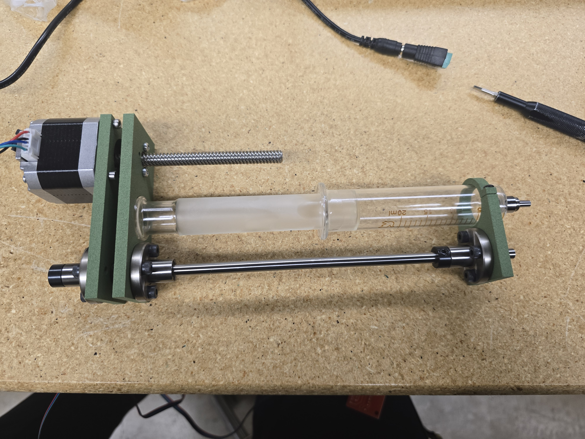
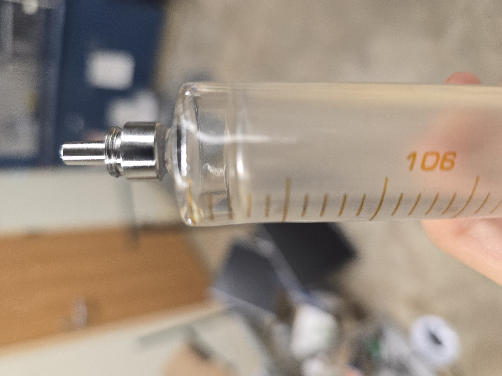
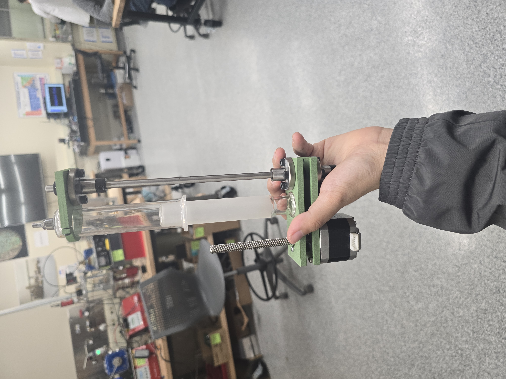

# Week 11 Update

What was Accomplished:

* Fixed the linear motion issue that prevented motor movement by implementing linear ball bearings
* Fixed a minor issue with the syringe clamp(lowered tolerance holes and slightly shifted the clamp location)
  * I slightly shifted the clamp shape so that I would end up using a shorter M3 screw, and also accounted for inconsistencies within the glass syringes(not ALL of them are uniform to each other, so I had to find a point there it was as close to uniform as possible to clamp)
* significantly reduced the volume of space used by over 50%
  * We are using a 1/4" linear shaft instead of 2 16mm linear shafts, which essentially reduced a lot of excess weight(this change was also made since 16mm linear ball bearings are absurdly expensive, and would have minimal difference in performance

<figure><figcaption>
Final assembled syringe pump assembly
</figcaption></figure> <figure><figcaption>
Revised Syringe Clamp Mechanism
</figcaption></figure> <figure><figcaption>
The syringe has a slight indent on the left of the syringe, so mounting the clamp was shifted slightly down(to around the 5ml area)
</figcaption></figure> <figure><figcaption>
Vertical view of syringe pump assembly
</figcaption></figure>

Roadblocks:

* Inconsistencies with the glass syringes(while testing for consistencies, some were clearly less usable on the clamp, given higher friction when shifting the plunge or slightly different geometry near the nozzle of the syringe)

Plans for next week:

* Finalize coding of the syringe pump(setting up virtual limits that the stepper motor cannot surpass, as well as discussing UI interface)
