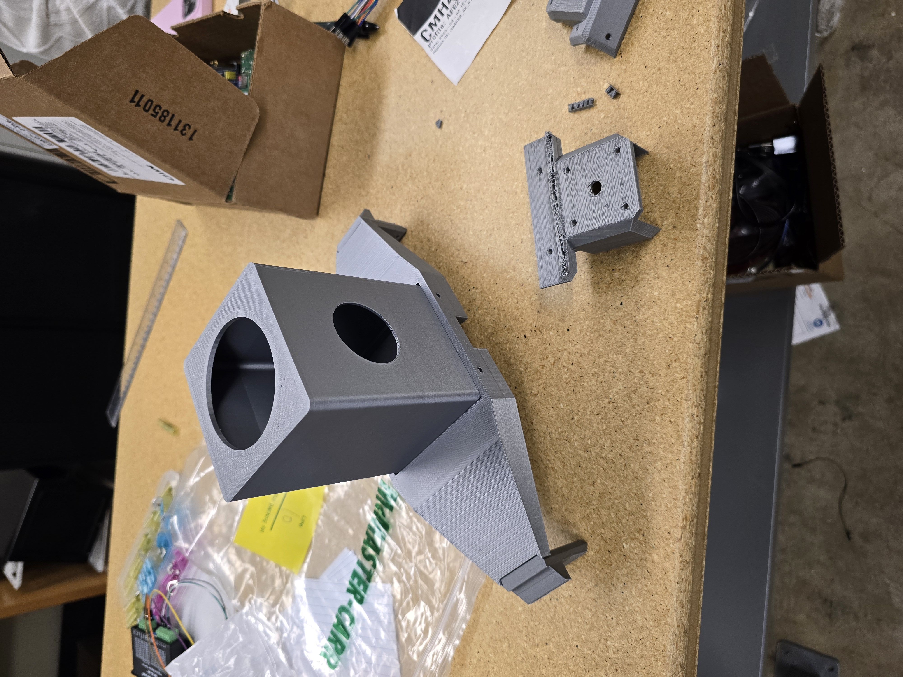

# Week 13 Update

What was Accomplished:

* made minor adjustments to syringe pump to account for mounting
* CADed out mounting system
* printed out ABS spin coater components, and checked if ABS components were flawed

<figure><figcaption>
ABS Prints results(spin coater + mounts)
</figcaption></figure>

<figure><figcaption>
Liquid Handling Mounting Mechanism
</figcaption></figure>

Roadblocks: None

Plans for next week:

* Print Syringe Mounting + mount on top of the actual assembly
* Finalize assembling all 4 syringes
* CAD design tubing mounts + heat gun mount and print them, along with final assembly
