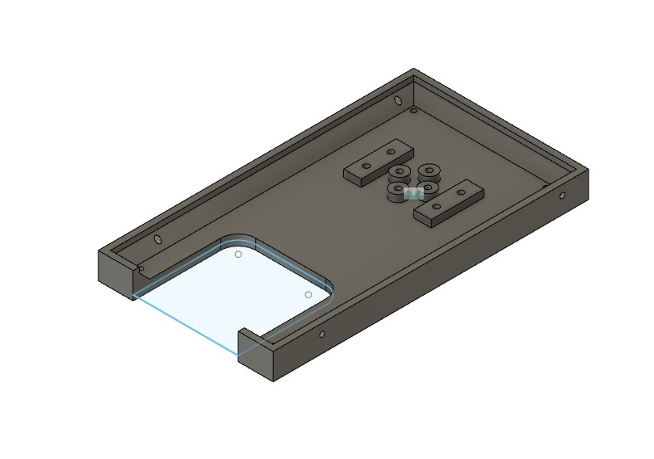
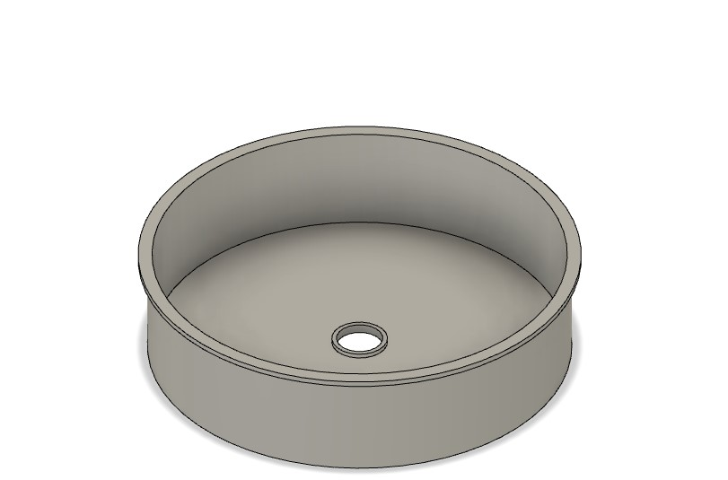
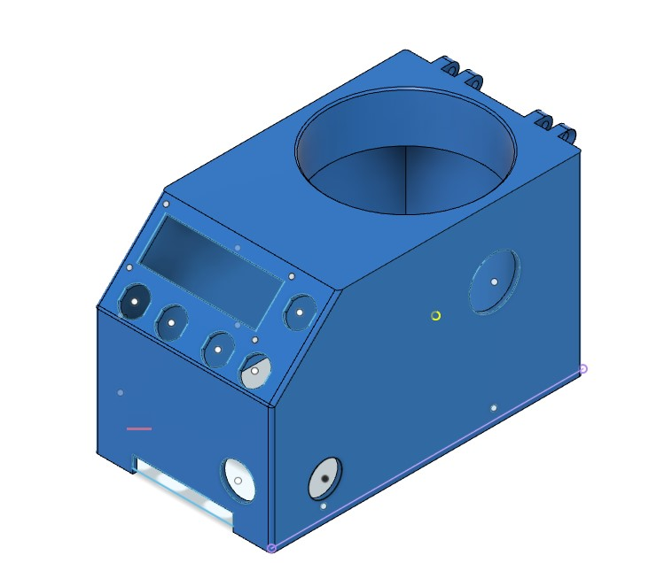

# Week 2 Updates

Before receiving updates on what I was supposed to work on this week, I helped Anirud re-CAD and 3d print several modified components of the Spin coater. The dimensions of the spin coater were increased in length by 45 mm, and the holes for buttons were more enclosed together due to wire entanglement concerns, and the buttons not being fully optimized for assembly. Along with that, the holes for motor attachment were slightly modified so that all four screw holes would accurately fit in the motor. The height of the vase was also slightly decreased to account for the addition of a top plate on the spin coater. All of these revisions ended up significantly increasing the efficiency of the spin coater's ability to hold silicon in place. **The only major roadblock** along the process was failing to recognize that the BAMBU 3d printer had different setting from the default BAMBU settings, as well as the PRUSA filament toppling over, resulting in some prints being scrapped.

<figure><figcaption>
New Base modified CAD of base plate(182 mm in length)
</figcaption></figure>

<figure><figcaption>
Modified Vase(decreased height by 2mm)
</figcaption></figure>

<figure><figcaption>
Modified CASE, an additional hole was made on the bottom left corner of the side, as well as uniformizing the distance between the button holes
</figcaption></figure>

I additionally began to conduct research on the pinch valve mechanism that I discussed with my fellow lab automation teammates, and began investigating the pros and cons of utilizing such a design in contrast to the original peristaltic pump. The pros include the fact that the basic mechanism for the pinch valve is a lot less complex, since it involves one or two motor simply twisting a screw to completely enclose water flow. The major downside is that a large majority of pinch valves attempt to "pinch" by enclosing both sides of the tube instead of only one. **The largest road block** as of now, is figuring out if there is an efficient pinch valve design capable of "pinching" the tube on both directions with one motor, while also being compact enough to fit with the rest of the lab automation components. Furthermore, the pinch valve is not suited for high temperature purposes, and I am not completely sure what temperatures the liquids will be operating in.&#x20;

**For next week**, I plan on CADing two or three different iterations of the pinch valve, depending on if I determine that pinching the tube on both ends is possible  with one motor. If possible, I will attempt to use FEA to determine if the liquid flow through the valve is minimized and compare the designs and check which one offers the least liquid flow.

[https://tameson.com/pages/pinch-valve](https://tameson.com/pages/pinch-valve)(resources used for general understanding)

