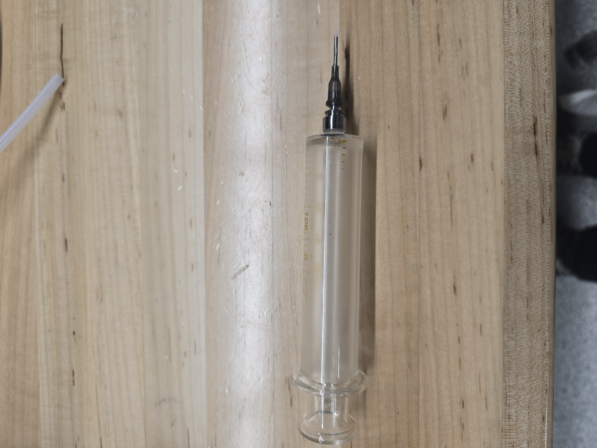
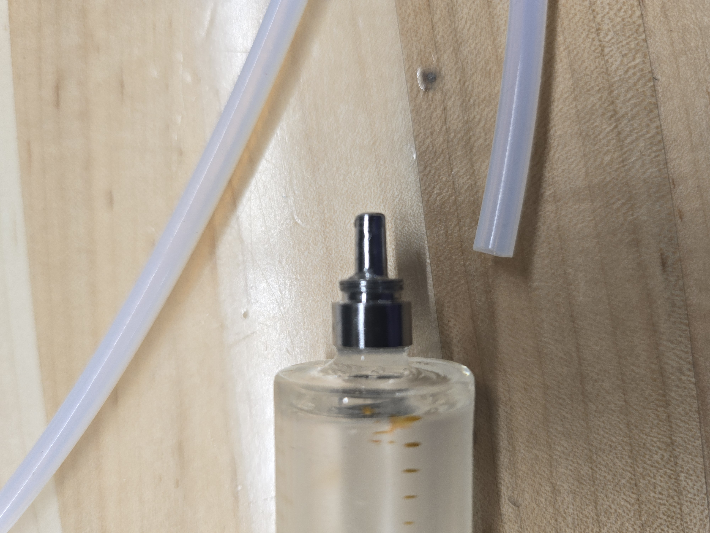

# Week 9 Update

What was Accomplished:

* Experimented the capabilities of the newly arrived syringe(by directly inserting liquids into it)
  * The syringe was able to pump out acetone, photoresist, IPA, and DI consistently
  * The syringe was not leaking regardless of liquid
  * However, these liquids can only be consistently pumped WHEN the syringe is directly attached to tubing, and not to a needle(since the liquid flowing through the exit of the needle actually flows onto the surface of the syringe)

<figure><figcaption>
Syringe + needle assembly used to test liquid handling
</figcaption></figure> <figure><figcaption>
Pump Assembly 3d print
</figcaption></figure> <figure><figcaption>
the syringe + tubing(the tubing should be slightly larger than the syringe nozzle, but this is not the case)
</figcaption></figure>

* Took measurements of the syringe(since we, and re-designed CAD models accordingly)
  * The measurement of the syringe hub was different than advertised(around 4mm), in comparison to our 3mm inner diameter syringes
  * To mitigate this issue, while testing the syringe, a luer lock needle was directly attached onto the syringe, instead of PTFE tubing
* 3D printed spin coater container for the lab automation assembly
* 3D printed revised CAD components for pump assembly

Roadblocks:

* Measurements provided by the syringe(as advertised) were inaccurate
* Not ALL of the glass syringes are leak proof, so we have to be very careful selecting the right syringe

Plans for next week:

* Wait for the actual linear actuator motor to arrive to finalize assembly, and compile the code
* Order parts for 3-4 additional syringe pumps
* 3d print the rest of the spin coater

